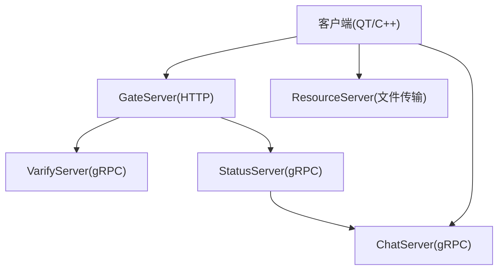
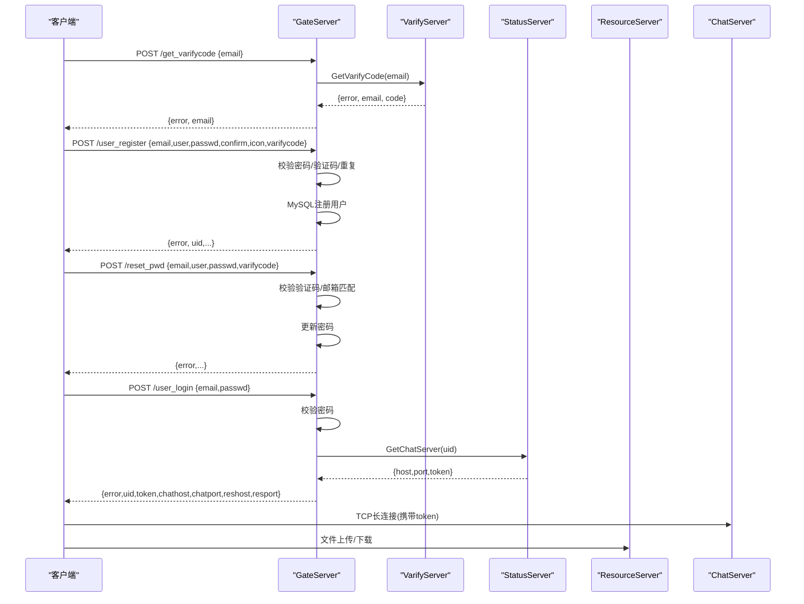
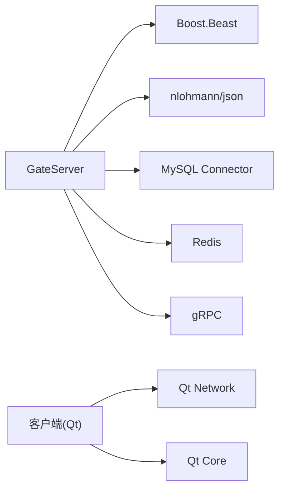

# API参考

<cite>
**本文引用的文件**   
- [README.md](file://README.md)
- [chat.proto](file://proto/chat_service/chat.proto)
- [status.proto](file://proto/status_service/status.proto)
- [verify.proto](file://proto/verify_service/verify.proto)
- [message.proto](file://server/VarifyServer/message.proto)
- [HttpConnection.h](file://server/GateServer/include/HttpConnection.h)
- [HttpConnection.cpp](file://server/GateServer/src/HttpConnection.cpp)
- [LogicSystem.h](file://server/GateServer/include/LogicSystem.h)
- [LogicSystem.cpp](file://server/GateServer/src/LogicSystem.cpp)
- [const.h](file://server/GateServer/include/const.h)
- [httpmgr.h](file://client/llfcchat/include/httpmgr.h)
- [httpmgr.cpp](file://client/llfcchat/src/httpmgr.cpp)
- [global.h](file://client/llfcchat/include/global.h)
- [logindialog.cpp](file://client/llfcchat/src/logindialog.cpp)
</cite>

## 目录
1. [简介](#简介)
2. [项目结构](#项目结构)
3. [核心组件](#核心组件)
4. [架构总览](#架构总览)
5. [详细接口说明](#详细接口说明)
6. [依赖关系分析](#依赖关系分析)
7. [性能与限流](#性能与限流)
8. [故障排查指南](#故障排查指南)
9. [结论](#结论)
10. [附录：SDK使用示例与测试/Mock](#附录sdk使用示例与测试mock)

## 简介
本文件为 LLFCChat 的API参考，覆盖HTTP REST接口、gRPC服务定义与消息协议格式。文档面向开发者，提供每个端点的请求方法、URL路径、请求头、请求体、响应体、状态码、认证方式、参数校验、错误处理与限流策略说明，并给出完整的请求/响应示例与客户端SDK调用要点。同时记录Protocol Buffers定义、服务接口和消息格式的详细说明，以及版本管理、向后兼容性与弃用策略建议。

## 项目结构
LLFCChat采用多服务微服务架构：
- GateServer：HTTP网关，负责路由分发、鉴权前置、验证码获取、用户注册/登录等HTTP接口，并通过gRPC调用后端服务。
- StatusServer：状态服务，负责为用户分配ChatServer实例，维护连接与负载均衡。
- ChatServer：聊天服务，实现好友申请、认证、文本/图片消息推送、踢人等能力（通过gRPC暴露）。
- ResourceServer：资源服务，负责文件上传下载、头像与聊天图片等资源存取。
- VarifyServer（Node.js）：验证码服务，生成验证码、发送邮件并缓存到Redis。
- 客户端（Qt/C++）：封装HTTP与TCP通信，调用GateServer HTTP接口，建立与ChatServer/ResourceServer的长连接。

图表来源
- [HttpConnection.cpp:133-194](file://server/GateServer/src/HttpConnection.cpp#L133-L194)
- [LogicSystem.cpp:36-396](file://server/GateServer/src/LogicSystem.cpp#L36-L396)
- [chat.proto:1-105](file://proto/chat_service/chat.proto#L1-L105)
- [status.proto:1-32](file://proto/status_service/status.proto#L1-L32)
- [verify.proto:1-19](file://proto/verify_service/verify.proto#L1-L19)

章节来源
- [README.md:1-112](file://README.md#L1-L112)

## 核心组件
- HTTP网关层（GateServer）
  - HttpConnection：基于Boost.Beast的HTTP连接封装，负责读取请求、解析GET参数、设置响应头、超时控制与异步写回。
  - LogicSystem：路由注册与分发系统，将URL路径映射到具体处理函数（lambda），统一处理GET/POST请求。
- gRPC客户端（GateServer内）
  - VerifyGrpcClient：调用VarifyServer发送验证码。
  - StatusGrpcClient：调用StatusServer分配ChatServer并返回token。
- 客户端HTTP管理器（HttpMgr）
  - 封装QNetworkAccessManager，统一发起POST请求，设置Content-Type为application/json，回调完成信号并分发给各模块。

章节来源
- [HttpConnection.h:1-36](file://server/GateServer/include/HttpConnection.h#L1-L36)
- [HttpConnection.cpp:1-225](file://server/GateServer/src/HttpConnection.cpp#L1-L225)
- [LogicSystem.h:1-24](file://server/GateServer/include/LogicSystem.h#L1-L24)
- [LogicSystem.cpp:1-467](file://server/GateServer/src/LogicSystem.cpp#L1-L467)
- [httpmgr.h:1-34](file://client/llfcchat/include/httpmgr.h#L1-L34)
- [httpmgr.cpp:1-62](file://client/llfcchat/src/httpmgr.cpp#L1-L62)

## 架构总览
GateServer作为统一入口，对外暴露HTTP接口；内部通过gRPC与VarifyServer、StatusServer交互；客户端在登录成功后，根据返回的连接信息直连ChatServer与ResourceServer进行实时通信与文件传输。

图表来源
- [LogicSystem.cpp:105-396](file://server/GateServer/src/LogicSystem.cpp#L105-L396)
- [status.proto:1-32](file://proto/status_service/status.proto#L1-L32)
- [verify.proto:1-19](file://proto/verify_service/verify.proto#L1-L19)

## 详细接口说明

### HTTP接口总览
- 基础约定
  - Content-Type: application/json
  - 成功时HTTP状态码通常为200，业务错误通过响应体中的error字段表示
  - 未找到路由时返回404 Not Found
- 通用错误码（服务器侧）
  - Success=0
  - Error_Json=1001
  - RPCFailed=1002
  - VarifyExpired=1003
  - VarifyCodeErr=1004
  - UserExist=1005
  - PasswdErr=1006
  - EmailNotMatch=1007
  - PasswdUpFailed=1008
  - PasswdInvalid=1009
  - TokenInvalid=1010
  - UidInvalid=1011

章节来源
- [const.h:31-44](file://server/GateServer/include/const.h#L31-L44)
- [HttpConnection.cpp:142-194](file://server/GateServer/src/HttpConnection.cpp#L142-L194)

#### GET /get_test
- 功能：测试接口，回显GET查询参数
- 请求
  - 方法：GET
  - URL：/get_test?key=value&...
  - 请求头：无特殊要求
  - 请求体：无
- 响应
  - 状态码：200
  - 响应体：纯文本，包含接收到的参数键值对
- 示例
  - 请求：GET /get_test?name=test&age=18
  - 响应：receive get_test req ... param1 key is name, value is test ...

章节来源
- [LogicSystem.cpp:36-54](file://server/GateServer/src/LogicSystem.cpp#L36-L54)
- [HttpConnection.cpp:96-130](file://server/GateServer/src/HttpConnection.cpp#L96-L130)

#### POST /test_procedure
- 功能：测试MySQL存储过程调用
- 请求
  - 方法：POST
  - URL：/test_procedure
  - 请求头：Content-Type: application/json
  - 请求体：{"email":"xxx@xxx.com"}
- 响应
  - 状态码：200
  - 响应体：{"error":0,"email":"...","name":"...","uid":123}
- 示例
  - 请求：POST /test_procedure {"email":"test@example.com"}
  - 响应：{"error":0,"email":"test@example.com","name":"TestUser","uid":1}

章节来源
- [LogicSystem.cpp:56-103](file://server/GateServer/src/LogicSystem.cpp#L56-L103)

#### POST /get_varifycode
- 功能：向指定邮箱发送验证码
- 请求
  - 方法：POST
  - URL：/get_varifycode
  - 请求头：Content-Type: application/json
  - 请求体：{"email":"xxx@xxx.com"}
- 响应
  - 状态码：200
  - 响应体：{"error":0,"email":"xxx@xxx.com"}
- 示例
  - 请求：POST /get_varifycode {"email":"user@example.com"}
  - 响应：{"error":0,"email":"user@example.com"}

章节来源
- [LogicSystem.cpp:105-147](file://server/GateServer/src/LogicSystem.cpp#L105-L147)
- [verify.proto:1-19](file://proto/verify_service/verify.proto#L1-L19)

#### POST /user_register
- 功能：用户注册
- 请求
  - 方法：POST
  - URL：/user_register
  - 请求头：Content-Type: application/json
  - 请求体：{"email":"...","user":"...","passwd":"...","confirm":"...","icon":"...","varifycode":"..."}
- 响应
  - 状态码：200
  - 响应体：{"error":0,"uid":123,"email":"...","user":"...","passwd":"...","confirm":"...","icon":"...","varifycode":"..."}
- 参数校验
  - 两次密码必须一致
  - 验证码需存在于Redis且未过期
  - 验证码需与输入一致
  - 用户名/邮箱不得重复
- 示例
  - 请求：POST /user_register {"email":"u@example.com","user":"UName","passwd":"Pass123!","confirm":"Pass123!","icon":"","varifycode":"123456"}
  - 响应：{"error":0,"uid":1001,"email":"u@example.com","user":"UName",...}

章节来源
- [LogicSystem.cpp:148-233](file://server/GateServer/src/LogicSystem.cpp#L148-L233)
- [const.h:31-44](file://server/GateServer/include/const.h#L31-L44)

#### POST /reset_pwd
- 功能：重置密码
- 请求
  - 方法：POST
  - URL：/reset_pwd
  - 请求头：Content-Type: application/json
  - 请求体：{"email":"...","user":"...","passwd":"...","varifycode":"..."}
- 响应
  - 状态码：200
  - 响应体：{"error":0,"email":"...","user":"...","passwd":"...","varifycode":"..."}
- 参数校验
  - 验证码存在且未过期
  - 验证码与输入一致
  - 用户名与邮箱匹配
- 示例
  - 请求：POST /reset_pwd {"email":"u@example.com","user":"UName","passwd":"NewPass123!","varifycode":"654321"}
  - 响应：{"error":0,"email":"u@example.com","user":"UName","passwd":"NewPass123!","varifycode":"654321"}

章节来源
- [LogicSystem.cpp:235-316](file://server/GateServer/src/LogicSystem.cpp#L235-L316)
- [const.h:31-44](file://server/GateServer/include/const.h#L31-L44)

#### POST /user_login
- 功能：用户登录，分配ChatServer并返回连接信息
- 请求
  - 方法：POST
  - URL：/user_login
  - 请求头：Content-Type: application/json
  - 请求体：{"email":"...","passwd":"..."}
- 响应
  - 状态码：200
  - 响应体：{"error":0,"email":"...","uid":123,"token":"...","chathost":"...","chatport":"...","reshost":"...","resport":"..."}
- 示例
  - 请求：POST /user_login {"email":"u@example.com","passwd":"Pass123!"}
  - 响应：{"error":0,"email":"u@example.com","uid":1001,"token":"abc123","chathost":"127.0.0.1","chatport":"8080","reshost":"127.0.0.1","resport":"9090"}

章节来源
- [LogicSystem.cpp:318-396](file://server/GateServer/src/LogicSystem.cpp#L318-L396)
- [status.proto:1-32](file://proto/status_service/status.proto#L1-L32)

### gRPC接口定义与消息格式

#### ChatService（聊天服务）
- 包名：message
- 服务方法
  - NotifyAddFriend(AddFriendReq) -> AddFriendRsp
  - NotifyAuthFriend(AuthFriendReq) -> AuthFriendRsp
  - NotifyTextChatMsg(TextChatMsgReq) -> TextChatMsgRsp
  - NotifyKickUser(KickUserReq) -> KickUserRsp
  - NotifyChatImgMsg(NotifyChatImgReq) -> NotifyChatImgRsp
- 消息定义
  - AddFriendReq：applyuid,name,desc,icon,nick,sex,touid
  - AddFriendRsp：error,applyuid,touid
  - AddFriendMsg：sender_id,unique_id,msg_id,thread_id,msgcontent,status
  - AuthFriendReq：fromuid,touid,textmsgs[]
  - AuthFriendRsp：error,fromuid,touid
  - TextChatData：unique_id,msg_id,msgcontent,chat_time
  - TextChatMsgReq：fromuid,touid,thread_id,textmsgs[]
  - TextChatMsgRsp：error,fromuid,touid,thread_id,textmsgs[]
  - KickUserReq：uid
  - KickUserRsp：error,uid
  - NotifyChatImgReq：from_uid,to_uid,message_id,file_name,total_size,thread_id
  - NotifyChatImgRsp：error,from_uid,to_uid,message_id,file_name,total_size,thread_id

章节来源
- [chat.proto:1-105](file://proto/chat_service/chat.proto#L1-L105)

#### StatusService（状态服务）
- 包名：message
- 服务方法
  - GetChatServer(GetChatServerReq) -> GetChatServerRsp
  - Login(LoginReq) -> LoginRsp
- 消息定义
  - GetChatServerReq：uid
  - GetChatServerRsp：error,host,port,token
  - LoginReq：uid,token
  - LoginRsp：error,uid,token

章节来源
- [status.proto:1-32](file://proto/status_service/status.proto#L1-L32)
- [message.proto:19-44](file://server/VarifyServer/message.proto#L19-L44)

#### VarifyService（验证码服务）
- 包名：message
- 服务方法
  - GetVarifyCode(GetVarifyReq) -> GetVarifyRsp
- 消息定义
  - GetVarifyReq：email
  - GetVarifyRsp：error,email,code

章节来源
- [verify.proto:1-19](file://proto/verify_service/verify.proto#L1-L19)
- [message.proto:1-18](file://server/VarifyServer/message.proto#L1-L18)

### 认证与令牌
- HTTP登录阶段：GateServer验证邮箱与密码后，通过StatusService分配ChatServer并返回token。
- TCP长连接阶段：客户端使用token与ChatServer建立连接，用于后续聊天与通知。
- 资源服务：客户端根据登录响应中的reshost/resport直连ResourceServer进行文件传输。

章节来源
- [LogicSystem.cpp:318-396](file://server/GateServer/src/LogicSystem.cpp#L318-L396)
- [status.proto:1-32](file://proto/status_service/status.proto#L1-L32)

### 参数验证与错误处理
- JSON解析失败：返回Error_Json
- 验证码相关：VarifyExpired、VarifyCodeErr
- 用户相关：UserExist、EmailNotMatch
- 密码相关：PasswdErr、PasswdUpFailed、PasswdInvalid
- RPC失败：RPCFailed
- 连接认证：TokenInvalid、UidInvalid

章节来源
- [const.h:31-44](file://server/GateServer/include/const.h#L31-L44)
- [LogicSystem.cpp:105-396](file://server/GateServer/src/LogicSystem.cpp#L105-L396)

### 限流策略
- 当前代码未实现显式限流逻辑。建议在GateServer入口处增加速率限制（如按IP或用户ID），并结合Redis计数器实现滑动窗口限流。

[本节为通用建议，不直接分析具体文件]

## 依赖关系分析
- GateServer依赖：
  - Boost.Beast（HTTP）
  - nlohmann/json（JSON解析）
  - MySQL Connector/C++（数据库）
  - Redis（验证码缓存）
  - gRPC（调用VarifyServer、StatusServer）
- 客户端依赖：
  - Qt Network（HTTP）
  - Qt Core（事件与数据结构）
  - Boost.Asio（TCP长连接，见TcpMgr）

图表来源
- [HttpConnection.cpp:1-225](file://server/GateServer/src/HttpConnection.cpp#L1-L225)
- [LogicSystem.cpp:1-467](file://server/GateServer/src/LogicSystem.cpp#L1-L467)
- [httpmgr.cpp:1-62](file://client/llfcchat/src/httpmgr.cpp#L1-L62)

章节来源
- [HttpConnection.cpp:1-225](file://server/GateServer/src/HttpConnection.cpp#L1-L225)
- [LogicSystem.cpp:1-467](file://server/GateServer/src/LogicSystem.cpp#L1-L467)
- [httpmgr.cpp:1-62](file://client/llfcchat/src/httpmgr.cpp#L1-L62)

## 性能与限流
- HTTP网关采用异步IO（Boost.Asio/Beast），具备高并发处理能力。
- 建议优化点：
  - 增加请求体大小限制，防止过大负载
  - 引入连接池（MySQL/Redis/gRPC）减少握手开销
  - 启用响应压缩（gzip）降低带宽占用
  - 增加限流与熔断机制提升稳定性

[本节为通用建议，不直接分析具体文件]

## 故障排查指南
- 常见问题
  - JSON解析失败：检查Content-Type与请求体格式
  - 验证码过期：重新获取验证码并确保及时提交
  - 用户已存在：更换用户名或邮箱
  - 密码错误：确认密码长度与字符集
  - RPC失败：检查StatusServer/VarifyServer可用性
- 调试技巧
  - 查看GateServer日志输出（HandleReq、HandlePost等）
  - 使用网络抓包工具验证请求/响应
  - 检查Redis中验证码key是否存在与是否过期

章节来源
- [HttpConnection.cpp:133-194](file://server/GateServer/src/HttpConnection.cpp#L133-L194)
- [LogicSystem.cpp:105-396](file://server/GateServer/src/LogicSystem.cpp#L105-L396)

## 结论
LLFCChat的API体系以GateServer为核心，HTTP接口负责认证与前置校验，gRPC接口承担服务间通信与实时消息推送。通过清晰的错误码与统一的响应格式，便于客户端集成与问题定位。建议在生产环境中补充限流、安全加固与监控告警，以提升系统的健壮性与可观测性。

[本节为总结，不直接分析具体文件]

## 附录：SDK使用示例与测试/Mock

### 客户端SDK使用要点（Qt/C++）
- 初始化HTTP管理器
  - 使用HttpMgr单例发起POST请求，设置Content-Type为application/json
  - 监听sig_http_finish信号，根据Modules区分处理注册/重置/登录回调
- 登录流程
  - 构造{"email","passwd"}请求体，调用/user_login
  - 解析响应获取uid、token、chathost、chatport、reshost、resport
  - 通过TcpMgr建立与ChatServer的长连接，携带token进行认证
  - 通过FileTcpMgr连接ResourceServer进行文件传输

章节来源
- [httpmgr.h:1-34](file://client/llfcchat/include/httpmgr.h#L1-L34)
- [httpmgr.cpp:1-62](file://client/llfcchat/src/httpmgr.cpp#L1-L62)
- [logindialog.cpp:175-195](file://client/llfcchat/src/logindialog.cpp#L175-L195)
- [global.h:122-136](file://client/llfcchat/include/global.h#L122-L136)

### 接口测试建议
- 使用curl或Postman测试HTTP接口
  - GET /get_test?key=value
  - POST /get_varifycode {"email":"test@example.com"}
  - POST /user_register {...}
  - POST /reset_pwd {...}
  - POST /user_login {"email":"...","passwd":"..."}
- gRPC测试
  - 使用grpcurl或gRPC工具调用VarifyService.GetVarifyCode、StatusService.GetChatServer

### Mock服务建议
- 针对VarifyServer与StatusServer，可在本地启动Mock服务返回固定响应，便于前端与客户端联调
- 使用WireMock或自定义gRPC Mock服务模拟验证码与ChatServer分配

[本节为通用建议，不直接分析具体文件]