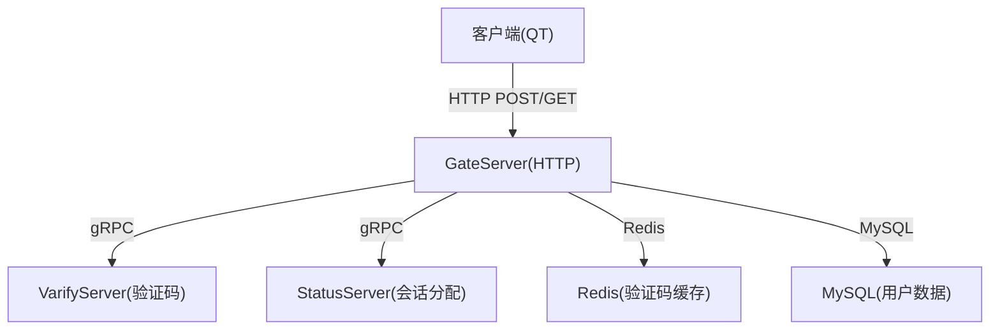
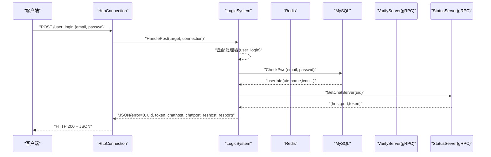
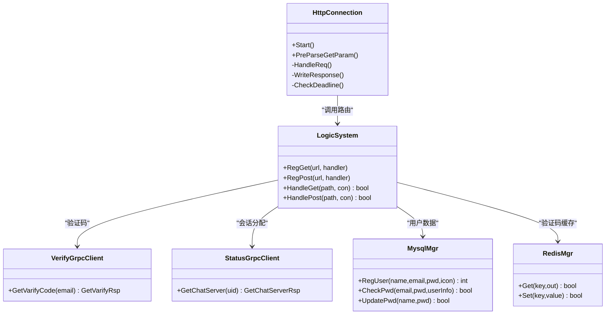

# HTTP API接口

<cite>
**本文引用的文件**   
- [GateServer.cpp](file://server/GateServer/src/GateServer.cpp)
- [HttpConnection.h](file://server/GateServer/include/HttpConnection.h)
- [HttpConnection.cpp](file://server/GateServer/src/HttpConnection.cpp)
- [LogicSystem.h](file://server/GateServer/include/LogicSystem.h)
- [LogicSystem.cpp](file://server/GateServer/src/LogicSystem.cpp)
- [const.h](file://server/GateServer/include/const.h)
- [config.ini](file://server/GateServer/config/config.ini)
- [httpmgr.h](file://client/llfcchat/include/httpmgr.h)
- [httpmgr.cpp](file://client/llfcchat/src/httpmgr.cpp)
- [global.h](file://client/llfcchat/include/global.h)
- [registerdialog.cpp](file://client/llfcchat/src/registerdialog.cpp)
- [day14-登录功能.md](file://开发文档/day14-登录功能.md)
- [day11-注册功能.md](file://开发文档/day11-注册功能.md)
</cite>

## 目录
1. [简介](#简介)
2. [项目结构](#项目结构)
3. [核心组件](#核心组件)
4. [架构总览](#架构总览)
5. [详细接口说明](#详细接口说明)
6. [依赖分析](#依赖分析)
7. [性能与限流](#性能与限流)
8. [故障排查](#故障排查)
9. [结论](#结论)
10. [附录：客户端调用示例](#附录客户端调用示例)

## 简介
本文件为 LLFCChat GateServer 的 HTTP API 完整接口文档，覆盖用户注册、邮箱验证码获取、重置密码、用户登录等 RESTful 端点。文档包含每个接口的 HTTP 方法、URL、请求头、请求体参数、响应体字段、状态码、错误码、认证方式（后续用于 TCP 连接的 Token）、参数校验规则、错误处理机制以及限流策略说明。同时给出 GateServer 的 HTTP 服务实现与请求处理流程，并附带客户端 Qt 调用示例路径。

## 项目结构
GateServer 作为 HTTP 网关，基于 Boost.Asio/Beast 提供异步 HTTP 服务，通过 LogicSystem 进行路由分发，结合 Redis、MySQL 与 gRPC（VarifyServer、StatusServer）完成业务逻辑。客户端使用 Qt 的 QNetworkAccessManager 发起 POST 请求。

**图表来源**
- [GateServer.cpp:128-158](file://server/GateServer/src/GateServer.cpp#L128-L158)
- [HttpConnection.cpp:132-194](file://server/GateServer/src/HttpConnection.cpp#L132-L194)
- [LogicSystem.cpp:36-396](file://server/GateServer/src/LogicSystem.cpp#L36-L396)
- [config.ini:1-25](file://server/GateServer/config/config.ini#L1-L25)

**章节来源**
- [GateServer.cpp:128-158](file://server/GateServer/src/GateServer.cpp#L128-L158)
- [config.ini:1-25](file://server/GateServer/config/config.ini#L1-L25)

## 核心组件
- HttpConnection：封装 HTTP 连接、请求解析、响应写入、超时控制与 GET 查询参数预解析。
- LogicSystem：单例路由系统，维护 GET/POST 处理器映射，负责将 URL 分发给对应 handler。
- MysqlMgr/RedisMgr/VerifyGrpcClient/StatusGrpcClient：数据库、缓存与 gRPC 客户端封装。
- 配置管理：从 config.ini 读取端口、后端服务地址等。

**章节来源**
- [HttpConnection.h:1-36](file://server/GateServer/include/HttpConnection.h#L1-L36)
- [HttpConnection.cpp:1-225](file://server/GateServer/src/HttpConnection.cpp#L1-L225)
- [LogicSystem.h:1-24](file://server/GateServer/include/LogicSystem.h#L1-L24)
- [LogicSystem.cpp:1-467](file://server/GateServer/src/LogicSystem.cpp#L1-L467)
- [const.h:31-44](file://server/GateServer/include/const.h#L31-L44)
- [config.ini:1-25](file://server/GateServer/config/config.ini#L1-L25)

## 架构总览
GateServer 启动后监听指定端口，接收 HTTP 请求，按方法分流到 HandleGet/HandlePost，再根据 URL 在 LogicSystem 中查找处理器执行。处理器内部可能调用 Redis、MySQL 或 gRPC 服务，最终统一以 JSON 形式返回。

**图表来源**
- [HttpConnection.cpp:132-194](file://server/GateServer/src/HttpConnection.cpp#L132-L194)
- [LogicSystem.cpp:318-396](file://server/GateServer/src/LogicSystem.cpp#L318-L396)

## 详细接口说明

### 通用约定
- 内容类型：application/json（客户端发送），text/json（服务器响应）。
- 字符编码：UTF-8。
- 跨域：服务器响应设置 Access-Control-Allow-Origin 为 *（生产环境建议限制来源）。
- 连接模式：短连接（keep-alive=false）。
- 超时：单个请求处理默认 60s（由定时器控制）。
- 版本与兼容：当前无显式版本号前缀；建议未来通过 URL 前缀或 Header 管理版本，保持向后兼容。
- 鉴权：HTTP 层不强制 JWT；登录成功后返回 token，后续 TCP 通信使用该 token 进行认证。

**章节来源**
- [HttpConnection.cpp:132-194](file://server/GateServer/src/HttpConnection.cpp#L132-L194)
- [const.h:31-44](file://server/GateServer/include/const.h#L31-L44)

### 接口列表
- GET /get_test
- POST /get_varifycode
- POST /user_register
- POST /reset_pwd
- POST /user_login

#### GET /get_test
- 描述：测试接口，回显所有 GET 查询参数。
- 请求头：无特殊要求。
- 请求体：无。
- 查询参数：任意 key=value 对。
- 响应体：纯文本，逐行输出参数键值。
- 状态码：200；未匹配路由时 404。
- 错误码：不适用。

示例请求
- GET http://127.0.0.1:8080/get_test?name=alice&age=20

示例响应
- text/plain
- receive get_test req 
- param1 key is name,  value is alice
- param2 key is age,  value is 20

**章节来源**
- [LogicSystem.cpp:36-54](file://server/GateServer/src/LogicSystem.cpp#L36-L54)

#### POST /get_varifycode
- 描述：向邮箱发送验证码。
- 请求头：Content-Type: application/json。
- 请求体：
  - email: string，必填，邮箱地址。
- 响应体：
  - error: int，错误码（0 表示成功）。
  - email: string，原样回显。
- 状态码：200；JSON 解析失败或参数缺失返回相应错误码。
- 错误码：
  - 0: 成功
  - 1001: Json 解析错误
  - 其他由 VarifyServer 返回的错误码透传。

示例请求
- POST http://127.0.0.1:8080/get_varifycode
- Body: {"email":"test@example.com"}

示例响应
- {"error":0,"email":"test@example.com"}

**章节来源**
- [LogicSystem.cpp:105-147](file://server/GateServer/src/LogicSystem.cpp#L105-L147)

#### POST /user_register
- 描述：用户注册。
- 请求头：Content-Type: application/json。
- 请求体：
  - user: string，用户名，必填。
  - email: string，邮箱，必填。
  - passwd: string，密码，必填。
  - confirm: string，确认密码，必填，需与 passwd 一致。
  - icon: string，头像（base64 或路径），可选。
  - varifycode: string，验证码，必填，需与 Redis 中对应 email 的验证码一致且未过期。
- 响应体：
  - error: int，错误码。
  - 成功时包含 uid、email、user、passwd、confirm、icon、varifycode 等字段。
- 状态码：200；失败返回对应错误码。
- 错误码：
  - 0: 成功
  - 1001: Json 解析错误
  - 1006: 密码不一致
  - 1003: 验证码已过期
  - 1004: 验证码错误
  - 1005: 用户或邮箱已存在
  - 其他数据库异常相关错误码。

示例请求
- POST http://127.0.0.1:8080/user_register
- Body: {"user":"alice","email":"alice@example.com","passwd":"Pass1234","confirm":"Pass1234","icon":"","varifycode":"123456"}

示例响应（成功）
- {"error":0,"uid":1,"email":"alice@example.com","user":"alice","passwd":"Pass1234","confirm":"Pass1234","icon":"","varifycode":"123456"}

示例响应（失败-验证码过期）
- {"error":1003}

**章节来源**
- [LogicSystem.cpp:148-233](file://server/GateServer/src/LogicSystem.cpp#L148-L233)

#### POST /reset_pwd
- 描述：重置密码。
- 请求头：Content-Type: application/json。
- 请求体：
  - email: string，必填。
  - user: string，必填。
  - passwd: string，必填，新密码。
  - varifycode: string，必填，需与 Redis 中对应 email 的验证码一致且未过期。
- 响应体：
  - error: int，错误码。
  - 成功时包含 email、user、passwd、varifycode。
- 状态码：200；失败返回对应错误码。
- 错误码：
  - 0: 成功
  - 1001: Json 解析错误
  - 1003: 验证码已过期
  - 1004: 验证码错误
  - 1007: 邮箱与用户名不匹配
  - 1008: 更新密码失败

示例请求
- POST http://127.0.0.1:8080/reset_pwd
- Body: {"email":"alice@example.com","user":"alice","passwd":"NewPass123","varifycode":"123456"}

示例响应（成功）
- {"error":0,"email":"alice@example.com","user":"alice","passwd":"NewPass123","varifycode":"123456"}

**章节来源**
- [LogicSystem.cpp:235-316](file://server/GateServer/src/LogicSystem.cpp#L235-L316)

#### POST /user_login
- 描述：用户登录，验证密码并通过 StatusServer 分配 ChatServer 及生成 token。
- 请求头：Content-Type: application/json。
- 请求体：
  - email: string，必填。
  - passwd: string，必填。
- 响应体：
  - error: int，错误码。
  - 成功时包含 uid、token、chathost、chatport、reshost、resport。
- 状态码：200；失败返回对应错误码。
- 错误码：
  - 0: 成功
  - 1001: Json 解析错误
  - 1009: 密码无效（用户名不存在或密码不匹配）
  - 1002: RPC 失败（StatusServer 不可用或分配失败）

示例请求
- POST http://127.0.0.1:8080/user_login
- Body: {"email":"alice@example.com","passwd":"Pass1234"}

示例响应（成功）
- {"error":0,"email":"alice@example.com","uid":1,"token":"uuid-string","chathost":"127.0.0.1","chatport":"8090","reshost":"127.0.0.1","resport":"9090"}

**章节来源**
- [LogicSystem.cpp:318-396](file://server/GateServer/src/LogicSystem.cpp#L318-L396)

### 认证与安全
- HTTP 层：当前未使用 JWT；登录成功后返回 token，供后续 TCP 连接认证使用。
- 验证码：通过 VarifyServer 生成并存储至 Redis，key 前缀为 CODEPREFIX（代码中定义为 "code_"）。
- 密码安全：建议在服务端对密码进行哈希存储与比对（当前实现直接比较明文，存在安全风险，建议升级）。

**章节来源**
- [const.h:62](file://server/GateServer/include/const.h#L62)
- [LogicSystem.cpp:318-396](file://server/GateServer/src/LogicSystem.cpp#L318-L396)

### 参数验证规则
- 邮箱格式：客户端使用正则校验，服务端在注册/重置流程中通过 Redis 验证码与数据库校验保障一致性。
- 密码长度与组成：客户端限制 6~15 位，允许字母、数字与部分特殊字符；服务端在注册时校验两次密码一致。
- 验证码：必须存在于 Redis 且未过期，且与输入一致。

**章节来源**
- [registerdialog.cpp:153-200](file://client/llfcchat/src/registerdialog.cpp#L153-L200)
- [LogicSystem.cpp:148-233](file://server/GateServer/src/LogicSystem.cpp#L148-L233)

### 错误处理机制
- JSON 解析失败：返回错误码 1001。
- 业务错误：通过 ErrorCodes 枚举返回具体错误码（如验证码过期、用户已存在、密码无效等）。
- 网络/IO 错误：客户端捕获 QNetworkReply::error 并上报 ERR_NETWORK。

**章节来源**
- [const.h:31-44](file://server/GateServer/include/const.h#L31-L44)
- [httpmgr.cpp:18-38](file://client/llfcchat/src/httpmgr.cpp#L18-L38)

### 限流策略
- 当前 GateServer 未实现应用层限流；可通过 Nginx/网关层或自定义中间件实现 IP/用户维度的速率限制。
- 建议对 /get_varifycode 和 /user_login 实施严格限流，防止暴力攻击。

[本节为通用指导，无需源码引用]

## 依赖分析
GateServer 依赖以下子系统：
- Redis：验证码缓存与校验。
- MySQL：用户数据持久化与校验。
- gRPC VarifyServer：验证码派发与邮件发送。
- gRPC StatusServer：聊天服务器分配与 token 生成。
- Boost.Asio/Beast：HTTP 服务与异步 I/O。

**图表来源**
- [HttpConnection.h:1-36](file://server/GateServer/include/HttpConnection.h#L1-L36)
- [LogicSystem.h:1-24](file://server/GateServer/include/LogicSystem.h#L1-L24)
- [LogicSystem.cpp:1-467](file://server/GateServer/src/LogicSystem.cpp#L1-L467)

**章节来源**
- [LogicSystem.cpp:1-467](file://server/GateServer/src/LogicSystem.cpp#L1-L467)

## 性能与限流
- 异步 I/O：基于 Boost.Asio 的异步读写，提升并发能力。
- 连接超时：默认 60s 处理超时，避免资源泄露。
- 短连接：每次请求独立连接，降低长连接状态复杂度。
- 建议优化：
  - 引入连接池复用 gRPC 通道（已在 StatusGrpcClient 中使用连接池思想）。
  - 增加请求体大小限制与慢请求监控。
  - 接入集中式限流与熔断保护。

**章节来源**
- [HttpConnection.cpp:196-208](file://server/GateServer/src/HttpConnection.cpp#L196-L208)
- [LogicSystem.cpp:318-396](file://server/GateServer/src/LogicSystem.cpp#L318-L396)

## 故障排查
- 常见问题：
  - JSON 解析失败：检查 Content-Type 与请求体格式。
  - 验证码过期：重新获取验证码并确保在有效期内提交。
  - 用户已存在：更换用户名或邮箱。
  - 密码无效：核对邮箱与密码是否正确。
  - RPC 失败：检查 StatusServer 是否可用。
- 日志定位：
  - GateServer 控制台输出请求体与关键步骤日志。
  - 客户端 QNetworkReply::errorString 打印网络错误信息。

**章节来源**
- [LogicSystem.cpp:60-103](file://server/GateServer/src/LogicSystem.cpp#L60-L103)
- [httpmgr.cpp:18-38](file://client/llfcchat/src/httpmgr.cpp#L18-L38)

## 结论
GateServer 提供了完整的 HTTP 入口，涵盖注册、验证码、重置密码与登录等核心功能。通过 Redis、MySQL 与 gRPC 协同工作，实现了验证码派发、用户认证与会话分配。建议在生产环境中加强密码安全、引入 JWT、完善限流与监控，以提升安全性与稳定性。

[本节为总结性内容，无需源码引用]

## 附录：客户端调用示例
- 客户端 HTTP 管理器：
  - 定义 PostHttpReq 接口，设置 Content-Type 为 application/json，发送 JSON 请求体，并通过信号槽回调结果。
  - 模块区分 REGISTERMOD、RESETMOD、LOGINMOD，分别触发不同信号。
- 注册界面：
  - 点击“获取验证码”发送 /get_varifycode。
  - 点击“确定”发送 /user_register，携带 user、email、passwd、confirm、icon、varifycode。
- 登录界面：
  - 点击“登录”发送 /user_login，携带 email、passwd。

示例调用路径
- 客户端发送验证码：[registerdialog.cpp:98-111](file://client/llfcchat/src/registerdialog.cpp#L98-L111)
- 客户端发送注册：[day11-注册功能.md:37-46](file://开发文档/day11-注册功能.md#L37-L46)
- 客户端发送登录：[day14-登录功能.md:26-34](file://开发文档/day14-登录功能.md#L26-L34)
- HTTP 管理器实现：[httpmgr.cpp:8-38](file://client/llfcchat/src/httpmgr.cpp#L8-L38)

**章节来源**
- [httpmgr.h:1-34](file://client/llfcchat/include/httpmgr.h#L1-L34)
- [httpmgr.cpp:1-62](file://client/llfcchat/src/httpmgr.cpp#L1-L62)
- [registerdialog.cpp:98-111](file://client/llfcchat/src/registerdialog.cpp#L98-L111)
- [day11-注册功能.md:37-46](file://开发文档/day11-注册功能.md#L37-L46)
- [day14-登录功能.md:26-34](file://开发文档/day14-登录功能.md#L26-L34)