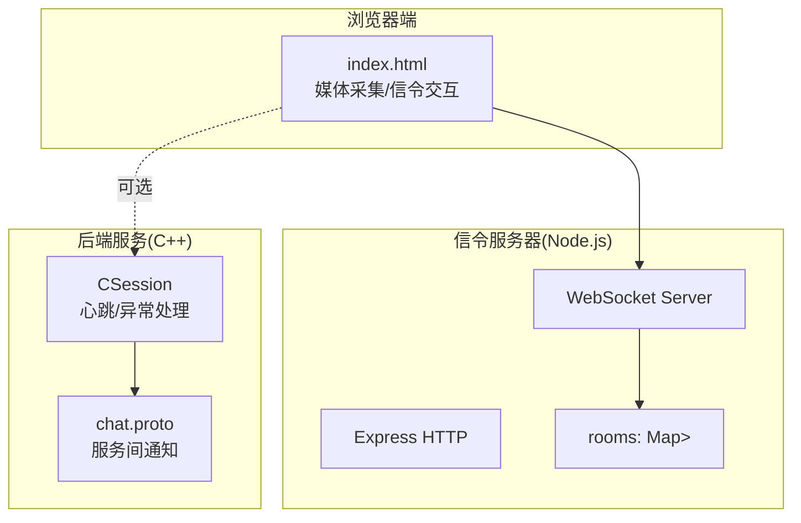
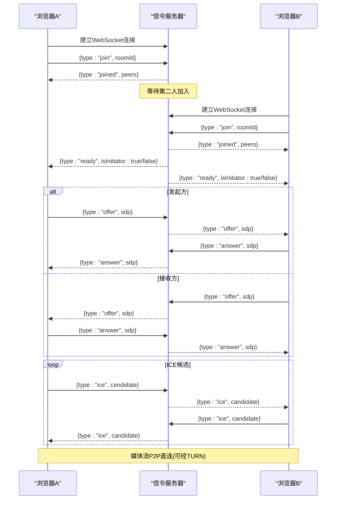
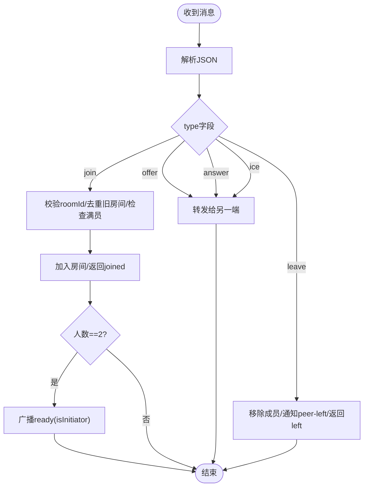
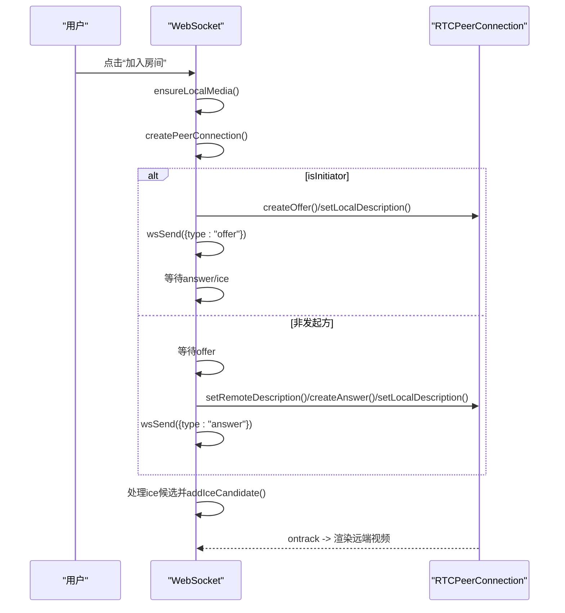
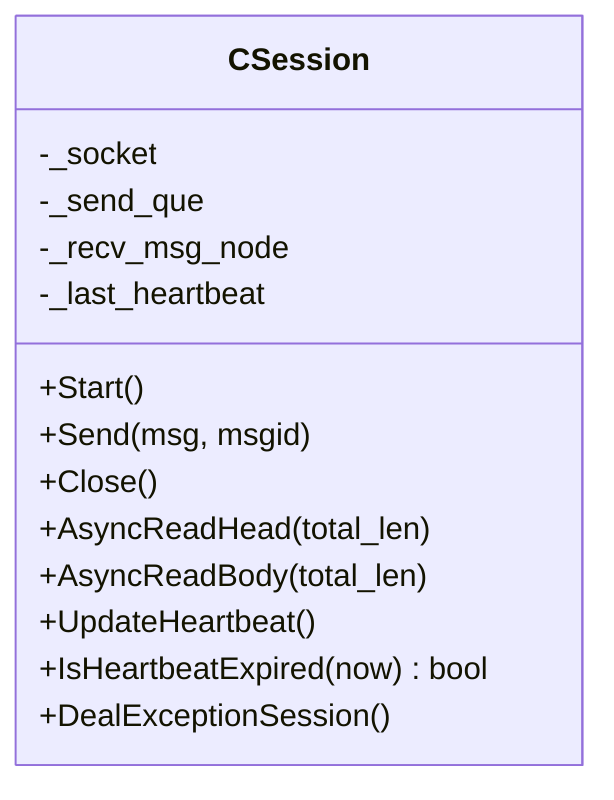
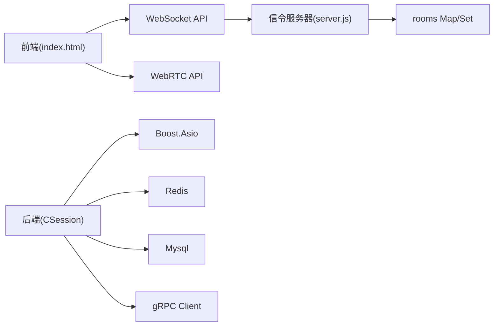

# WebSocket实时通信

<cite>
**本文引用的文件**   
- [server.js](file://webrtc-demo/server/server.js)
- [index.html](file://webrtc-demo/web/index.html)
- [day44-webrtc信令服务器实现.md](file://开发文档/day44-webrtc信令服务器实现.md)
- [CSession.h](file://server/ChatServer/include/CSession.h)
- [CSession.cpp](file://server/ChatServer/src/CSession.cpp)
- [const.h](file://server/ChatServer/include/const.h)
- [chat.proto](file://proto/chat_service/chat.proto)
</cite>

## 目录
1. [简介](#简介)
2. [项目结构](#项目结构)
3. [核心组件](#核心组件)
4. [架构总览](#架构总览)
5. [详细组件分析](#详细组件分析)
6. [依赖关系分析](#依赖关系分析)
7. [性能与可靠性](#性能与可靠性)
8. [故障排查指南](#故障排查指南)
9. [结论](#结论)
10. [附录：客户端集成示例与最佳实践](#附录客户端集成示例与最佳实践)

## 简介
本文件面向LLFCChat项目的WebRTC演示，聚焦WebSocket信令服务器的接口与行为，说明连接建立、房间管理、消息转发与WebRTC媒体协商流程。同时结合后端C++服务的心跳与异常处理机制，给出连接生命周期管理、心跳检测、断线重连与错误恢复策略的参考方案，并提供前端集成要点与最佳实践。

## 项目结构
- webrtc-demo/server/server.js：Node.js实现的信令服务器，提供HTTP静态资源与WebSocket服务，负责房间管理与offer/answer/ice透传。
- webrtc-demo/web/index.html：浏览器端示例页面，完成媒体采集、RTCPeerConnection创建、WebSocket信令交互与音视频渲染。
- 开发文档/day44-webrtc信令服务器实现.md：对信令服务器设计、房间模型、信令流程与生产建议的系统性说明。
- server/ChatServer/include/CSession.h 与 src/CSession.cpp：后端会话抽象，包含异步读写、发送队列、心跳更新与异常处理等能力。
- server/ChatServer/include/const.h：消息ID、错误码、常量定义，体现心跳与业务消息的协议边界。
- proto/chat_service/chat.proto：聊天相关gRPC接口定义，用于服务间通知（如文本消息、图片通知、踢人等）。

图表来源 
- [server.js:1-138](file://webrtc-demo/server/server.js#L1-L138)
- [index.html:1-276](file://webrtc-demo/web/index.html#L1-L276)
- [CSession.h:1-86](file://server/ChatServer/include/CSession.h#L1-L86)
- [CSession.cpp:1-200](file://server/ChatServer/src/CSession.cpp#L1-L200)
- [chat.proto:1-105](file://proto/chat_service/chat.proto#L1-L105)

章节来源
- [server.js:1-138](file://webrtc-demo/server/server.js#L1-L138)
- [index.html:1-276](file://webrtc-demo/web/index.html#L1-L276)
- [day44-webrtc信令服务器实现.md:1-468](file://开发文档/day44-webrtc信令服务器实现.md#L1-L468)

## 核心组件
- 信令服务器(server.js)
  - 职责：HTTP静态资源托管、WebSocket连接接入、房间Map维护、消息转发、离开与错误清理。
  - 关键能力：join/leave、ready、offer/answer/ice透传、peer-left广播、full限制。
- 浏览器端(index.html)
  - 职责：获取媒体流、创建RTCPeerConnection、发起或响应SDP交换、ICE候选传递、状态展示与清理。
  - 关键能力：ensureLocalMedia、createPeerConnection、startAsInitiator、handleOffer/handleAnswer/handleIce、cleanupAll。
- 后端会话(CSession)
  - 职责：TCP会话封装、异步读写、发送队列、心跳时间戳更新、异常会话处理。
  - 关键能力：AsyncReadHead/AsyncReadBody、UpdateHeartbeat、IsHeartbeatExpired、DealExceptionSession。
- 协议与消息(const.h, chat.proto)
  - 职责：定义心跳、聊天、图片、踢人等消息ID与gRPC通知接口，约束前后端与服务间契约。

章节来源
- [server.js:1-138](file://webrtc-demo/server/server.js#L1-L138)
- [index.html:1-276](file://webrtc-demo/web/index.html#L1-L276)
- [CSession.h:1-86](file://server/ChatServer/include/CSession.h#L1-L86)
- [CSession.cpp:1-200](file://server/ChatServer/src/CSession.cpp#L1-L200)
- [const.h:1-104](file://server/ChatServer/include/const.h#L1-L104)
- [chat.proto:1-105](file://proto/chat_service/chat.proto#L1-L105)

## 架构总览
信令服务器不参与媒体传输，仅负责信令交换；媒体通过WebRTC P2P直连，必要时经TURN中继。

图表来源 
- [server.js:62-132](file://webrtc-demo/server/server.js#L62-L132)
- [index.html:172-261](file://webrtc-demo/web/index.html#L172-L261)
- [day44-webrtc信令服务器实现.md:114-182](file://开发文档/day44-webrtc信令服务器实现.md#L114-L182)

## 详细组件分析

### 信令服务器(server.js)
- 房间模型：Map<roomId, Set<ws>>，最多2人，后加入者作为initiator。
- 消息路由：
  - join：校验roomId、去重旧房间、满员返回full、加入成功返回joined、凑齐2人广播ready。
  - offer/answer/ice：透传给房间内除自己外的另一端。
  - leave：移除并通知剩余成员peer-left，返回left。
- 生命周期：close/error时自动移除房间成员，防止脏数据。

图表来源 
- [server.js:62-132](file://webrtc-demo/server/server.js#L62-L132)
- [day44-webrtc信令服务器实现.md:282-360](file://开发文档/day44-webrtc信令服务器实现.md#L282-L360)

章节来源
- [server.js:1-138](file://webrtc-demo/server/server.js#L1-L138)
- [day44-webrtc信令服务器实现.md:87-182](file://开发文档/day44-webrtc信令服务器实现.md#L87-L182)

### 浏览器端(index.html)
- 媒体采集：getUserMedia获取音视频轨道，挂载到本地video。
- PeerConnection：配置STUN/TURN，监听onicecandidate与ontrack，设置连接状态回调。
- 信令交互：
  - join成功后根据isInitiator决定是否创建offer。
  - 处理offer/answer/ice，完成SDP与候选交换。
  - peer-left时清理PeerConnection与媒体流。
- 清理：leaveRoom/cleanupAll确保资源释放与UI复位。

图表来源 
- [index.html:80-153](file://webrtc-demo/web/index.html#L80-L153)
- [index.html:117-141](file://webrtc-demo/web/index.html#L117-L141)
- [index.html:172-261](file://webrtc-demo/web/index.html#L172-L261)

章节来源
- [index.html:1-276](file://webrtc-demo/web/index.html#L1-L276)

### 后端会话与心跳(CSession)
- 异步I/O：分头体读取，粘包处理，发送队列限流。
- 心跳：每次读消息更新_last_heartbeat；定时任务判断是否过期并关闭异常会话。
- 异常处理：网络错误、长度不匹配、无效session均触发Close与清理。

图表来源 
- [CSession.h:28-76](file://server/ChatServer/include/CSession.h#L28-L76)
- [CSession.cpp:87-191](file://server/ChatServer/src/CSession.cpp#L87-L191)

章节来源
- [CSession.h:1-86](file://server/ChatServer/include/CSession.h#L1-L86)
- [CSession.cpp:1-200](file://server/ChatServer/src/CSession.cpp#L1-L200)

### 协议与消息(const.h, chat.proto)
- const.h：定义心跳请求/回复、聊天消息、图片消息、踢人等消息ID，以及错误码与常量。
- chat.proto：定义服务间gRPC通知接口，如文本聊天、图片通知、好友认证、踢人等，便于跨服务协作。

章节来源
- [const.h:1-104](file://server/ChatServer/include/const.h#L1-L104)
- [chat.proto:1-105](file://proto/chat_service/chat.proto#L1-L105)

## 依赖关系分析
- 前端依赖：WebSocket API、WebRTC API（RTCPeerConnection、getUserMedia）、STUN/TURN配置。
- 信令服务器依赖：Express、ws、内存Map/Set。
- 后端依赖：Boost.Asio、线程/锁、Redis/Mysql（持久化与分布式锁），gRPC客户端调用其他服务。

图表来源 
- [index.html:1-276](file://webrtc-demo/web/index.html#L1-L276)
- [server.js:1-138](file://webrtc-demo/server/server.js#L1-L138)
- [CSession.cpp:1-200](file://server/ChatServer/src/CSession.cpp#L1-L200)

章节来源
- [server.js:1-138](file://webrtc-demo/server/server.js#L1-L138)
- [index.html:1-276](file://webrtc-demo/web/index.html#L1-L276)
- [CSession.cpp:1-200](file://server/ChatServer/src/CSession.cpp#L1-L200)

## 性能与可靠性
- 信令服务器
  - 内存模型简单高效，适合小规模1v1场景；可扩展为多人Mesh或SFU架构。
  - 无鉴权与重连机制，生产环境需补充token认证、WSS加密、心跳保活与断线重连。
- 前端
  - 建议在加入前预取媒体权限，避免ready阶段阻塞；合理配置STUN/TURN提升连通率。
  - 增加连接状态监听与重试逻辑，提高弱网稳定性。
- 后端
  - 使用心跳与定时器检测空闲连接，及时释放资源；发送队列限流避免拥塞。
  - 异常路径统一处理，保证会话一致性。

[本节为通用指导，不直接分析具体文件]

## 故障排查指南
- 无法加入房间
  - 检查roomId是否为空、是否已满（full）、是否先join再发消息。
  - 确认WebSocket连接状态为OPEN，URL与端口正确。
- 信令失败
  - 检查offer/answer/ice是否正确透传；确认浏览器控制台是否有错误日志。
  - 若NAT穿透失败，检查STUN/TURN配置与证书。
- 媒体无法播放
  - 检查ontrack是否触发，remoteVideo.srcObject是否赋值。
  - 确认浏览器权限与HTTPS/WSS要求。
- 连接断开
  - 检查close/error事件是否触发；信令服务器会移除房间成员并广播peer-left。
  - 后端侧检查心跳是否过期、是否存在异常会话清理。

章节来源
- [server.js:62-132](file://webrtc-demo/server/server.js#L62-L132)
- [index.html:242-261](file://webrtc-demo/web/index.html#L242-L261)
- [CSession.cpp:87-191](file://server/ChatServer/src/CSession.cpp#L87-L191)

## 结论
本项目以轻量Node.js信令服务器为核心，配合浏览器端WebRTC实现1v1音视频通话。信令服务器专注房间管理与消息转发，媒体走P2P直连。结合后端C++会话的心跳与异常处理机制，可构建高可靠的实时通信系统。生产环境建议补充鉴权、WSS、心跳重连与TURN动态签名等能力。

[本节为总结，不直接分析具体文件]

## 附录：客户端集成示例与最佳实践
- 连接建立
  - 使用WebSocket连接到信令服务器，优先使用WSS。
  - 连接成功后立即发送join消息，携带唯一roomId。
- 信令交换
  - 收到ready后，根据isInitiator决定发起offer或等待offer。
  - 透传offer/answer/ice，不要解析SDP内容。
- 媒体处理
  - 提前获取媒体权限，避免弹窗阻塞流程。
  - 配置合理的STUN/TURN，提升跨网络连通性。
- 生命周期管理
  - 监听close/error，执行清理与重连；leave主动发送leave消息。
  - 前端维护连接状态与角色标识，避免重复创建PeerConnection。
- 错误恢复
  - 遇到full或error提示，提示用户重试或更换房间号。
  - 后端侧通过心跳与定时器回收异常会话，保持资源健康。

章节来源
- [index.html:172-261](file://webrtc-demo/web/index.html#L172-L261)
- [server.js:62-132](file://webrtc-demo/server/server.js#L62-L132)
- [day44-webrtc信令服务器实现.md:434-468](file://开发文档/day44-webrtc信令服务器实现.md#L434-L468)