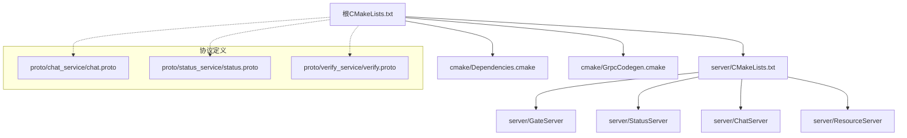
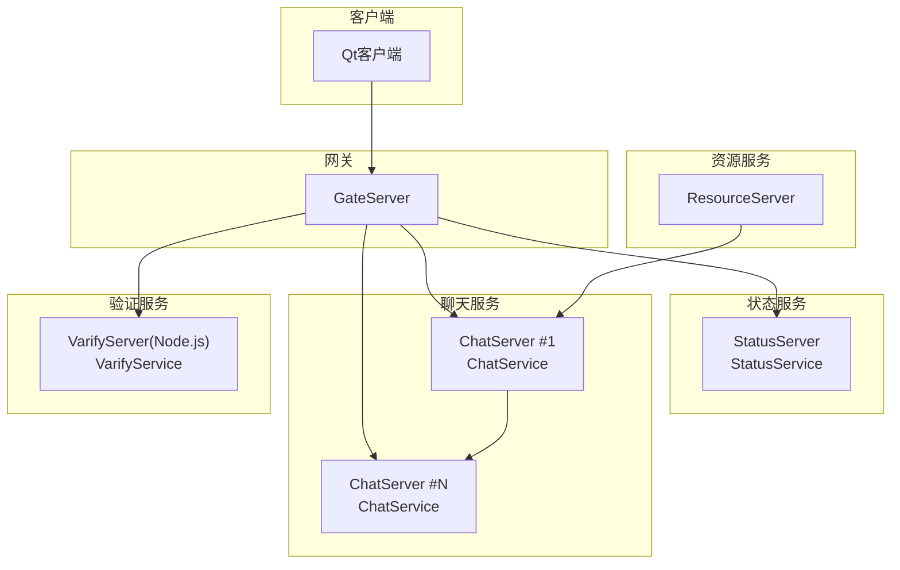
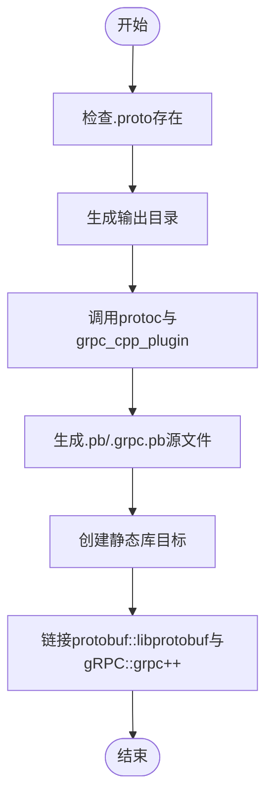
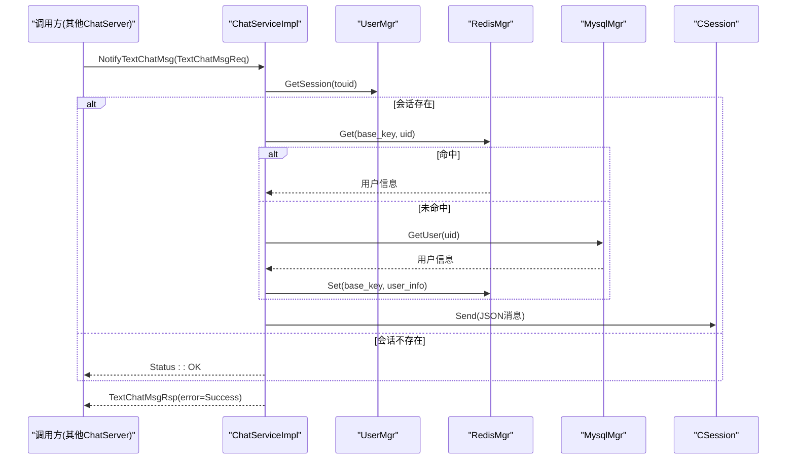
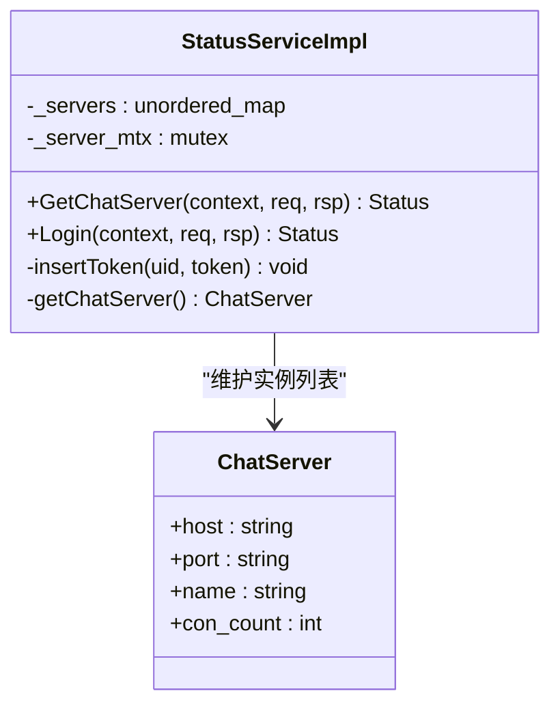
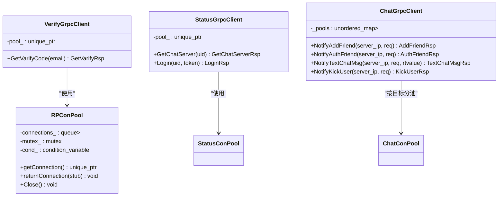
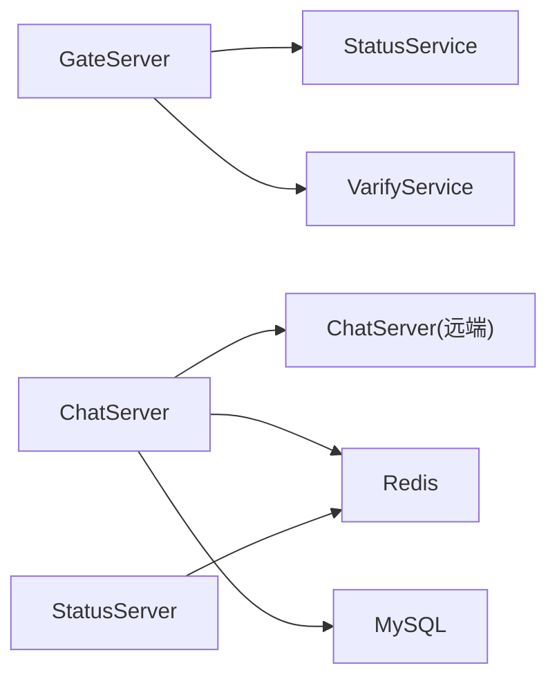

# gRPC开发指南

<cite>
**本文引用的文件**   
- [CMakeLists.txt](file://CMakeLists.txt)
- [Dependencies.cmake](file://cmake/Dependencies.cmake)
- [GrpcCodegen.cmake](file://cmake/GrpcCodegen.cmake)
- [chat.proto](file://proto/chat_service/chat.proto)
- [status.proto](file://proto/status_service/status.proto)
- [verify.proto](file://proto/verify_service/verify.proto)
- [ChatServiceImpl.h](file://server/ChatServer/include/ChatServiceImpl.h)
- [ChatServiceImpl.cpp](file://server/ChatServer/src/ChatServiceImpl.cpp)
- [StatusServiceImpl.h](file://server/StatusServer/include/StatusServiceImpl.h)
- [StatusServiceImpl.cpp](file://server/StatusServer/src/StatusServiceImpl.cpp)
- [VerifyGrpcClient.h](file://server/GateServer/include/VerifyGrpcClient.h)
- [ChatGrpcClient.h](file://server/ChatServer/include/ChatGrpcClient.h)
- [StatusGrpcClient.h](file://server/GateServer/include/StatusGrpcClient.h)
- [CMakeLists.txt（server）](file://server/CMakeLists.txt)
</cite>

## 目录
1. [简介](#简介)
2. [项目结构](#项目结构)
3. [核心组件](#核心组件)
4. [架构总览](#架构总览)
5. [详细组件分析](#详细组件分析)
6. [依赖关系分析](#依赖关系分析)
7. [性能考虑](#性能考虑)
8. [故障排查指南](#故障排查指南)
9. [结论](#结论)
10. [附录](#附录)

## 简介
本指南面向LLFCChat项目的gRPC开发与集成，覆盖Protocol Buffers语法规范、消息定义最佳实践、服务接口设计原则；详述gRPC代码生成流程与CMake构建集成；提供客户端与服务端实现模板、错误处理模式、日志与监控建议；并给出调试技巧、性能测试方法与常见问题解决方案。同时解释微服务架构下的服务发现、负载均衡与熔断机制的实践思路，以及完整的开发工作流与代码规范指导。

## 项目结构
本项目采用多模块CMake组织，根级CMake负责统一配置与子模块引入，cmake目录包含依赖解析与gRPC代码生成脚本，proto目录集中管理所有服务接口定义，server目录按服务拆分ChatServer、GateServer、StatusServer、ResourceServer等，client为Qt客户端。

图表来源
- [CMakeLists.txt:1-34](file://CMakeLists.txt#L1-L34)
- [Dependencies.cmake:1-82](file://cmake/Dependencies.cmake#L1-L82)
- [GrpcCodegen.cmake:1-72](file://cmake/GrpcCodegen.cmake#L1-L72)
- [CMakeLists.txt（server）:1-38](file://server/CMakeLists.txt#L1-L38)

章节来源
- [CMakeLists.txt:1-34](file://CMakeLists.txt#L1-L34)
- [Dependencies.cmake:1-82](file://cmake/Dependencies.cmake#L1-L82)
- [GrpcCodegen.cmake:1-72](file://cmake/GrpcCodegen.cmake#L1-L72)
- [CMakeLists.txt（server）:1-38](file://server/CMakeLists.txt#L1-L38)

## 核心组件
- 协议层：chat.proto、status.proto、verify.proto定义了聊天、状态与验证码三大服务的RPC接口与消息结构。
- 服务端实现：
  - ChatServiceImpl：实现聊天服务，转发好友申请、认证、文本消息、踢人、图片通知等。
  - StatusServiceImpl：实现状态服务，分配聊天服务器地址与令牌，校验登录令牌。
- 客户端封装：
  - VerifyGrpcClient：GateServer调用验证码服务，内置连接池与异常回退。
  - ChatGrpcClient：ChatServer内部调用其他ChatServer实例的RPC，带连接池。
  - StatusGrpcClient：GateServer调用状态服务获取ChatServer路由信息。

章节来源
- [chat.proto:1-105](file://proto/chat_service/chat.proto#L1-L105)
- [status.proto:1-32](file://proto/status_service/status.proto#L1-L32)
- [verify.proto:1-19](file://proto/verify_service/verify.proto#L1-L19)
- [ChatServiceImpl.h:1-55](file://server/ChatServer/include/ChatServiceImpl.h#L1-L55)
- [ChatServiceImpl.cpp:1-240](file://server/ChatServer/src/ChatServiceImpl.cpp#L1-L240)
- [StatusServiceImpl.h:1-52](file://server/StatusServer/include/StatusServiceImpl.h#L1-L52)
- [StatusServiceImpl.cpp:1-125](file://server/StatusServer/src/StatusServiceImpl.cpp#L1-L125)
- [VerifyGrpcClient.h:1-113](file://server/GateServer/include/VerifyGrpcClient.h#L1-L113)
- [ChatGrpcClient.h:1-116](file://server/ChatServer/include/ChatGrpcClient.h#L1-L116)
- [StatusGrpcClient.h:1-98](file://server/GateServer/include/StatusGrpcClient.h#L1-L98)

## 架构总览
下图展示了LLFCChat中gRPC相关服务之间的交互关系：GateServer作为入口，通过StatusService进行服务发现与令牌校验，再与ChatService进行业务通信；ChatServer之间可通过ChatService互相通知；资源服务通过ChatService通知聊天端图片下载。

图表来源
- [status.proto:1-32](file://proto/status_service/status.proto#L1-L32)
- [chat.proto:1-105](file://proto/chat_service/chat.proto#L1-L105)
- [verify.proto:1-19](file://proto/verify_service/verify.proto#L1-L19)
- [StatusServiceImpl.cpp:1-125](file://server/StatusServer/src/StatusServiceImpl.cpp#L1-L125)
- [ChatServiceImpl.cpp:1-240](file://server/ChatServer/src/ChatServiceImpl.cpp#L1-L240)
- [VerifyGrpcClient.h:1-113](file://server/GateServer/include/VerifyGrpcClient.h#L1-L113)
- [StatusGrpcClient.h:1-98](file://server/GateServer/include/StatusGrpcClient.h#L1-L98)
- [ChatGrpcClient.h:1-116](file://server/ChatServer/include/ChatGrpcClient.h#L1-L116)

## 详细组件分析

### Protocol Buffers与消息设计
- 语法与包名：统一使用proto3与package message，便于跨服务共享类型。
- 命名规范：
  - Service以领域命名，如ChatService、StatusService、VarifyService。
  - RPC方法动词+名词，如NotifyAddFriend、GetChatServer、GetVarifyCode。
  - 请求/响应成对命名，Req/Rsp后缀。
- 字段编号：从1开始连续递增，避免删除导致重排。
- 错误码：响应体统一error字段，配合业务语义返回。
- 扩展性：新增字段保持向后兼容，避免修改已有字段编号。

章节来源
- [chat.proto:1-105](file://proto/chat_service/chat.proto#L1-L105)
- [status.proto:1-32](file://proto/status_service/status.proto#L1-L32)
- [verify.proto:1-19](file://proto/verify_service/verify.proto#L1-L19)

### gRPC代码生成与CMake集成
- 自定义函数llfc_add_proto_library：根据.proto生成.pb与.grpc.pb源文件，创建静态库并链接protobuf与gRPC。
- 预置ensure函数：为status、verify、chat三个服务提供一键生成目标。
- 顶层CMake启用模块路径并include GrpcCodegen，设置C++17标准。
- server/CMakeLists.txt在独立构建时同样初始化vcpkg与模块路径。

图表来源
- [GrpcCodegen.cmake:1-72](file://cmake/GrpcCodegen.cmake#L1-L72)
- [CMakeLists.txt:1-34](file://CMakeLists.txt#L1-L34)
- [CMakeLists.txt（server）:1-38](file://server/CMakeLists.txt#L1-L38)

章节来源
- [GrpcCodegen.cmake:1-72](file://cmake/GrpcCodegen.cmake#L1-L72)
- [CMakeLists.txt:1-34](file://CMakeLists.txt#L1-L34)
- [CMakeLists.txt（server）:1-38](file://server/CMakeLists.txt#L1-L38)

### 服务端实现：ChatServiceImpl
- 职责：接收来自其他ChatServer或GateServer的RPC，查找用户会话并推送消息（好友申请、认证、文本、踢人、图片通知）。
- 关键逻辑：
  - 通过UserMgr获取会话，若不存在直接返回成功状态。
  - 将proto消息转换为JSON后通过TCP会话下发给客户端。
  - 基础信息查询优先Redis，未命中则查MySQL并回填缓存。
- 错误处理：统一设置error字段，失败时仍返回OK状态以便上层判断业务错误码。

图表来源
- [ChatServiceImpl.cpp:105-139](file://server/ChatServer/src/ChatServiceImpl.cpp#L105-L139)
- [ChatServiceImpl.cpp:142-185](file://server/ChatServer/src/ChatServiceImpl.cpp#L142-L185)

章节来源
- [ChatServiceImpl.h:1-55](file://server/ChatServer/include/ChatServiceImpl.h#L1-L55)
- [ChatServiceImpl.cpp:1-240](file://server/ChatServer/src/ChatServiceImpl.cpp#L1-L240)

### 服务端实现：StatusServiceImpl
- 职责：为GateServer提供ChatServer路由信息与登录令牌校验。
- 关键逻辑：
  - 构造期读取配置中的ChatServer列表。
  - GetChatServer选择负载较低的服务器（当前实现返回首个），生成唯一token并写入Redis。
  - Login校验token是否有效且未被占用。

图表来源
- [StatusServiceImpl.h:16-52](file://server/StatusServer/include/StatusServiceImpl.h#L16-L52)
- [StatusServiceImpl.cpp:1-125](file://server/StatusServer/src/StatusServiceImpl.cpp#L1-L125)

章节来源
- [StatusServiceImpl.h:1-52](file://server/StatusServer/include/StatusServiceImpl.h#L1-L52)
- [StatusServiceImpl.cpp:1-125](file://server/StatusServer/src/StatusServiceImpl.cpp#L1-L125)

### 客户端封装：VerifyGrpcClient、StatusGrpcClient、ChatGrpcClient
- 连接池模式：每个客户端类内嵌连接池，复用Channel与Stub，降低握手开销。
- 线程安全：使用互斥量与条件变量保护队列，支持优雅关闭。
- 错误处理：RPC失败时返回统一错误码，确保上层可识别。

图表来源
- [VerifyGrpcClient.h:1-113](file://server/GateServer/include/VerifyGrpcClient.h#L1-L113)
- [StatusGrpcClient.h:1-98](file://server/GateServer/include/StatusGrpcClient.h#L1-L98)
- [ChatGrpcClient.h:1-116](file://server/ChatServer/include/ChatGrpcClient.h#L1-L116)

章节来源
- [VerifyGrpcClient.h:1-113](file://server/GateServer/include/VerifyGrpcClient.h#L1-L113)
- [StatusGrpcClient.h:1-98](file://server/GateServer/include/StatusGrpcClient.h#L1-L98)
- [ChatGrpcClient.h:1-116](file://server/ChatServer/include/ChatGrpcClient.h#L1-L116)

## 依赖关系分析
- 构建依赖：Boost(asio/beast/date_time/filesystem/property_tree/uuid)、nlohmann_json、gRPC、Protobuf、hiredis、mysql-concpp。
- 模块耦合：
  - GateServer依赖StatusService与VarifyService。
  - ChatServer依赖ChatService（跨实例）、Redis与MySQL。
  - StatusServer依赖配置与Redis。
- 潜在循环：无直接循环依赖，服务间通过gRPC解耦。

图表来源
- [Dependencies.cmake:1-82](file://cmake/Dependencies.cmake#L1-L82)
- [ChatServiceImpl.cpp:142-185](file://server/ChatServer/src/ChatServiceImpl.cpp#L142-L185)
- [StatusServiceImpl.cpp:1-125](file://server/StatusServer/src/StatusServiceImpl.cpp#L1-L125)

章节来源
- [Dependencies.cmake:1-82](file://cmake/Dependencies.cmake#L1-L82)
- [ChatServiceImpl.cpp:142-185](file://server/ChatServer/src/ChatServiceImpl.cpp#L142-L185)
- [StatusServiceImpl.cpp:1-125](file://server/StatusServer/src/StatusServiceImpl.cpp#L1-L125)

## 性能考虑
- 连接池复用：客户端侧使用连接池减少握手与内存分配开销。
- 异步I/O：服务端基于AsioIOServicePool，提升并发处理能力。
- 缓存策略：用户基础信息优先Redis，未命中再落库，降低数据库压力。
- 序列化优化：proto二进制传输，避免JSON在网络层的额外开销。
- 限流与背压：可在gRPC层增加超时与重试策略，防止雪崩。

[本节为通用性能建议，不直接分析具体文件]

## 故障排查指南
- 常见错误码：
  - Success：操作成功。
  - UidInvalid：用户ID无效。
  - TokenInvalid：令牌无效或被占用。
  - RPCFailed：底层RPC调用失败。
- 定位步骤：
  - 检查gRPC状态码与业务error字段。
  - 确认Redis键是否存在（如用户令牌、用户信息）。
  - 核对ChatServer配置与连通性。
  - 查看服务端日志与网络抓包（Wireshark/gRPC拦截器）。
- 恢复策略：
  - 重试机制（指数退避）。
  - 降级到备用服务或本地缓存。
  - 快速失败并上报监控。

章节来源
- [StatusServiceImpl.cpp:94-116](file://server/StatusServer/src/StatusServiceImpl.cpp#L94-L116)
- [VerifyGrpcClient.h:87-104](file://server/GateServer/include/VerifyGrpcClient.h#L87-L104)

## 结论
LLFCChat通过清晰的proto定义、统一的CMake代码生成与模块化服务实现，构建了可扩展的gRPC微服务体系。结合连接池、缓存与异步I/O，系统在可用性、性能与可维护性方面具备良好基础。建议在后续迭代中完善负载均衡、熔断与全链路监控，进一步提升系统韧性。

[本节为总结性内容，不直接分析具体文件]

## 附录

### 开发工作流
- 定义proto：在proto目录下新增或修改接口与消息。
- 生成代码：运行CMake触发GrpcCodegen，生成.pb与.grpc.pb文件。
- 实现服务：在服务模块中继承生成的Service基类并实现方法。
- 编写客户端：使用NewStub与Channel调用RPC，建议使用连接池。
- 构建与测试：使用Ninja Multi-Config构建，单元测试与集成测试并行推进。

章节来源
- [GrpcCodegen.cmake:1-72](file://cmake/GrpcCodegen.cmake#L1-L72)
- [CMakeLists.txt:1-34](file://CMakeLists.txt#L1-L34)

### 代码规范指导
- 命名：Service/Method/Message遵循proto约定，Req/Rsp成对。
- 错误码：统一error字段，避免混用gRPC状态码与业务码。
- 日志：关键路径记录入参出参与耗时，脱敏敏感信息。
- 配置：外部化服务地址、端口、连接池大小等参数。
- 测试：为每个RPC提供单测与Mock，覆盖正常与异常分支。

[本节为通用规范建议，不直接分析具体文件]

### 微服务治理（服务发现、负载均衡、熔断）
- 服务发现：StatusService充当轻量注册中心，GateServer查询可用ChatServer。
- 负载均衡：当前为简单轮询/首节点选择，可扩展为加权或最少连接数策略。
- 熔断：建议引入断路器模式，失败阈值触发快速失败，周期性探测恢复。
- 监控：接入指标采集（延迟、吞吐、错误率）与告警。

[本节为概念性说明，不直接分析具体文件]