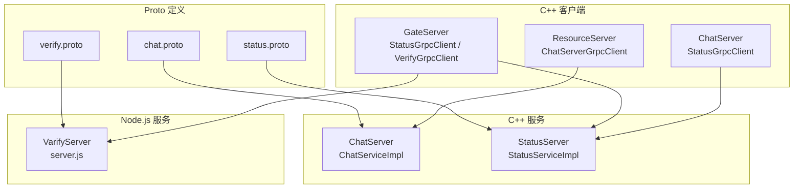
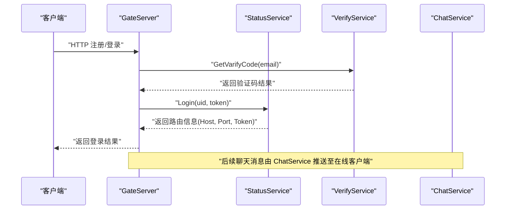
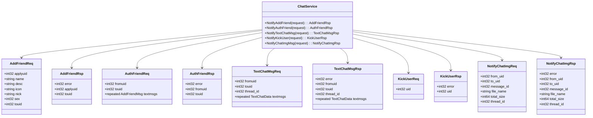
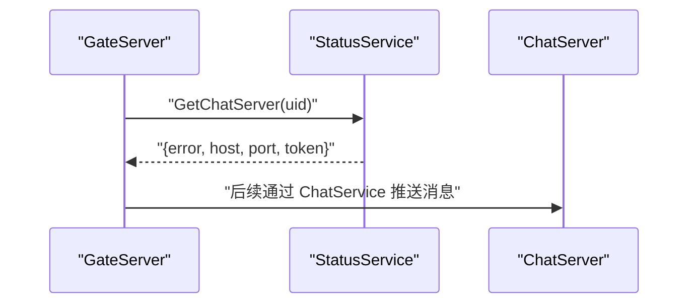
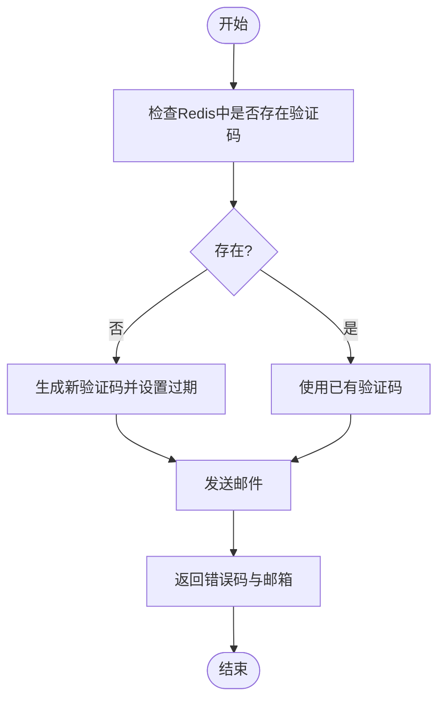
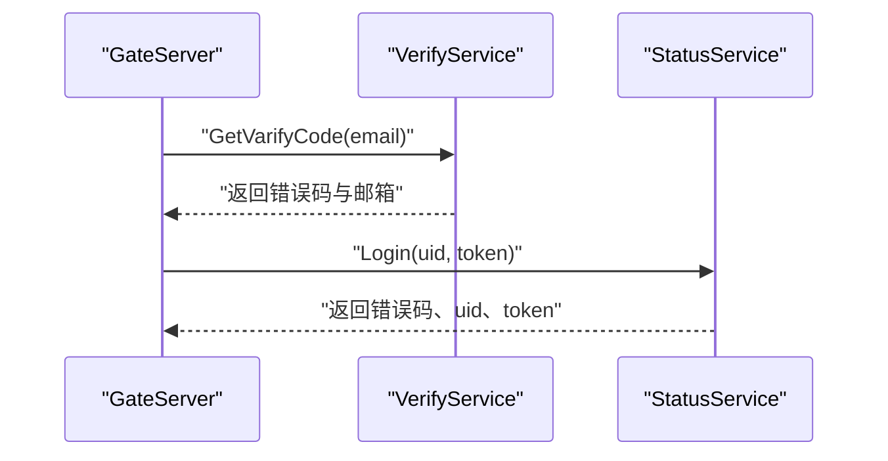
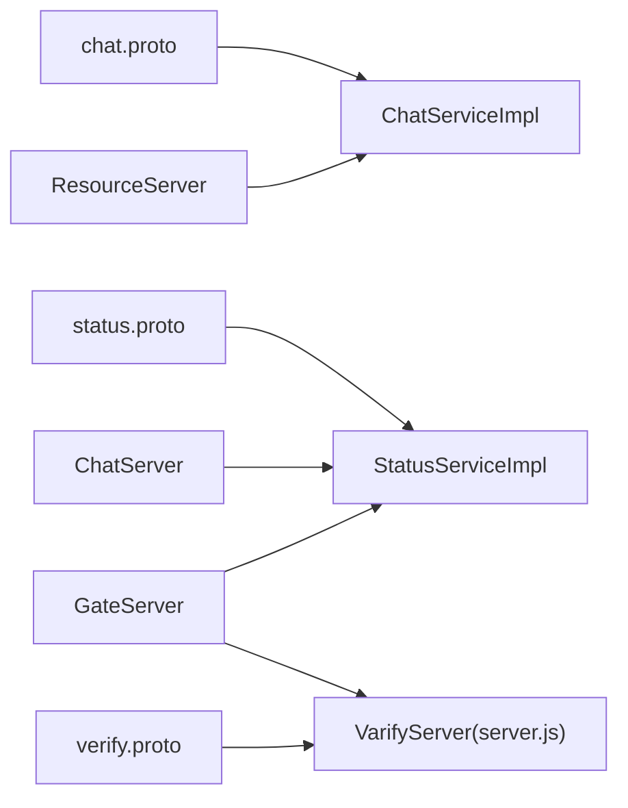

# gRPC接口定义

<cite>
**本文引用的文件**   
- [chat.proto](file://proto/chat_service/chat.proto)
- [status.proto](file://proto/status_service/status.proto)
- [verify.proto](file://proto/verify_service/verify.proto)
- [ChatServiceImpl.h](file://server/ChatServer/include/ChatServiceImpl.h)
- [ChatServiceImpl.cpp](file://server/ChatServer/src/ChatServiceImpl.cpp)
- [StatusServiceImpl.h](file://server/StatusServer/include/StatusServiceImpl.h)
- [VerifyGrpcClient.h](file://server/GateServer/include/VerifyGrpcClient.h)
- [VerifyGrpcClient.cpp](file://server/GateServer/src/VerifyGrpcClient.cpp)
- [StatusGrpcClient.h（GateServer）](file://server/GateServer/include/StatusGrpcClient.h)
- [StatusGrpcClient.cpp（GateServer）](file://server/GateServer/src/StatusGrpcClient.cpp)
- [StatusGrpcClient.h（ChatServer）](file://server/ChatServer/include/StatusGrpcClient.h)
- [ChatServerGrpcClient.h（ResourceServer）](file://server/ResourceServer/include/ChatServerGrpcClient.h)
- [server.js（VarifyServer）](file://server/VarifyServer/server.js)
- [GrpcCodegen.cmake](file://cmake/GrpcCodegen.cmake)
</cite>

## 目录
1. [简介](#简介)
2. [项目结构](#项目结构)
3. [核心组件](#核心组件)
4. [架构总览](#架构总览)
5. [详细组件分析](#详细组件分析)
6. [依赖关系分析](#依赖关系分析)
7. [性能与扩展性](#性能与扩展性)
8. [故障排查指南](#故障排查指南)
9. [结论](#结论)
10. [附录：代码生成与服务发现、负载均衡配置](#附录代码生成与服务发现负载均衡配置)

## 简介
本文件为 LLFCChat 的 gRPC 接口规范文档，覆盖 ChatService、StatusService、VerifyService 三个服务的 RPC 方法、消息格式、字段类型与约束。同时说明服务间通信模式、错误处理机制、重试策略，以及 Proto 文件生成过程、服务发现机制与负载均衡配置要点，并给出客户端与服务端的实现示例路径与调用时序图。

## 项目结构
- Proto 定义位于 proto 目录下，按服务分目录组织：
  - chat_service/chat.proto：聊天相关服务与消息
  - status_service/status.proto：状态与登录路由服务
  - verify_service/verify.proto：验证码服务
- C++ 服务端实现：
  - ChatServer：实现 ChatService
  - StatusServer：实现 StatusService
- Node.js 服务端实现：
  - VarifyServer：实现 VerifyService
- C++ 客户端封装：
  - GateServer：调用 StatusService、VerifyService
  - ChatServer：调用 StatusService
  - ResourceServer：调用 ChatService（图片通知）

**图表来源** 
- [chat.proto:1-105](file://proto/chat_service/chat.proto#L1-L105)
- [status.proto:1-32](file://proto/status_service/status.proto#L1-L32)
- [verify.proto:1-19](file://proto/verify_service/verify.proto#L1-L19)
- [ChatServiceImpl.h:1-55](file://server/ChatServer/include/ChatServiceImpl.h#L1-L55)
- [StatusServiceImpl.h:1-52](file://server/StatusServer/include/StatusServiceImpl.h#L1-L52)
- [server.js:1-76](file://server/VarifyServer/server.js#L1-L76)
- [VerifyGrpcClient.h:1-113](file://server/GateServer/include/VerifyGrpcClient.h#L1-L113)
- [StatusGrpcClient.h（GateServer）:1-98](file://server/GateServer/include/StatusGrpcClient.h#L1-L98)
- [StatusGrpcClient.h（ChatServer）:1-99](file://server/ChatServer/include/StatusGrpcClient.h#L1-L99)
- [ChatServerGrpcClient.h（ResourceServer）:1-93](file://server/ResourceServer/include/ChatServerGrpcClient.h#L1-L93)

**章节来源**
- [chat.proto:1-105](file://proto/chat_service/chat.proto#L1-L105)
- [status.proto:1-32](file://proto/status_service/status.proto#L1-L32)
- [verify.proto:1-19](file://proto/verify_service/verify.proto#L1-L19)

## 核心组件
- ChatService（C++ 实现）
  - 提供好友申请通知、好友认证通知、文本聊天消息推送、踢人通知、图片消息通知等能力
  - 通过 UserMgr 查找在线会话，将业务数据序列化为 JSON 并通过 TCP 下发到客户端
- StatusService（C++ 实现）
  - 提供获取 ChatServer 地址与令牌、用户登录校验能力
  - 内部维护 ChatServer 注册信息与连接数统计，支持简单负载均衡选择
- VerifyService（Node.js 实现）
  - 提供邮箱验证码发送能力，使用 Redis 缓存验证码，邮件模块发送

**章节来源**
- [ChatServiceImpl.h:1-55](file://server/ChatServer/include/ChatServiceImpl.h#L1-L55)
- [ChatServiceImpl.cpp:1-200](file://server/ChatServer/src/ChatServiceImpl.cpp#L1-L200)
- [StatusServiceImpl.h:1-52](file://server/StatusServer/include/StatusServiceImpl.h#L1-L52)
- [server.js:1-76](file://server/VarifyServer/server.js#L1-L76)

## 架构总览
LLFCChat 采用多服务微服务架构：
- GateServer 作为入口网关，负责 HTTP 请求与 gRPC 编排，调用 StatusService 进行路由与鉴权，调用 VerifyService 发送验证码
- ChatServer 承载聊天业务，暴露 ChatService 供其他服务调用以推送消息
- StatusServer 维护 ChatServer 注册表与登录态，提供路由与鉴权
- ResourceServer 负责资源存储与下载，必要时通过 ChatService 通知客户端下载资源
- VarifyServer（Node.js）提供验证码服务

**图表来源** 
- [StatusGrpcClient.cpp:1-53](file://server/GateServer/src/StatusGrpcClient.cpp#L1-L53)
- [VerifyGrpcClient.cpp:1-9](file://server/GateServer/src/VerifyGrpcClient.cpp#L1-L9)
- [server.js:1-76](file://server/VarifyServer/server.js#L1-L76)

## 详细组件分析

### ChatService（聊天服务）
- 服务与方法
  - NotifyAddFriend：通知目标用户收到好友申请
  - NotifyAuthFriend：通知目标用户好友认证消息
  - NotifyTextChatMsg：推送文本聊天消息
  - NotifyKickUser：踢出指定用户
  - NotifyChatImgMsg：通知图片消息元数据（文件名、大小、线程ID等）
- 消息结构与字段约束
  - AddFriendReq/AddFriendRsp：包含申请人、被申请人的基本信息与错误码
  - AuthFriendReq/AuthFriendRsp：包含双方 UID 与重复消息数组（AddFriendMsg），用于历史或批量认证消息
  - TextChatMsgReq/TextChatMsgRsp：包含发送方、接收方、线程ID与文本消息数组（TextChatData）
  - KickUserReq/KickUserRsp：包含被踢用户UID与错误码
  - NotifyChatImgReq/NotifyChatImgRsp：包含发送/接收UID、消息ID、文件名、总大小、线程ID与错误码
- 处理逻辑
  - 根据 touid/uid 查询在线会话，若存在则构造 JSON 并通过 TCP 下发给客户端；否则直接返回成功（避免阻塞）
  - 部分场景会读取 Redis/MySQL 获取基础用户信息，再组装响应

**图表来源** 
- [chat.proto:1-105](file://proto/chat_service/chat.proto#L1-L105)
- [ChatServiceImpl.h:1-55](file://server/ChatServer/include/ChatServiceImpl.h#L1-L55)

**章节来源**
- [chat.proto:1-105](file://proto/chat_service/chat.proto#L1-L105)
- [ChatServiceImpl.cpp:1-200](file://server/ChatServer/src/ChatServiceImpl.cpp#L1-L200)

### StatusService（状态与路由服务）
- 服务与方法
  - GetChatServer：根据用户UID返回 ChatServer 的地址与令牌
  - Login：校验用户登录态，返回错误码、UID 与令牌
- 消息结构与字段约束
  - GetChatServerReq/GetChatServerRsp：包含 UID、错误码、Host、Port、Token
  - LoginReq/LoginRsp：包含 UID、Token、错误码、返回 UID 与 Token
- 处理逻辑
  - 维护 ChatServer 注册表（host/port/name/con_count），选择合适实例返回
  - 登录时校验 token 并写入/更新缓存

**图表来源** 
- [status.proto:1-32](file://proto/status_service/status.proto#L1-L32)
- [StatusGrpcClient.cpp:1-53](file://server/GateServer/src/StatusGrpcClient.cpp#L1-L53)

**章节来源**
- [status.proto:1-32](file://proto/status_service/status.proto#L1-L32)
- [StatusServiceImpl.h:1-52](file://server/StatusServer/include/StatusServiceImpl.h#L1-L52)

### VerifyService（验证码服务）
- 服务与方法
  - GetVarifyCode：根据邮箱生成或复用验证码，存入 Redis，发送邮件
- 消息结构与字段约束
  - GetVarifyReq/GetVarifyRsp：包含 email、错误码、code
- 处理逻辑
  - 优先从 Redis 获取已有验证码，不存在则生成短码并设置过期时间
  - 调用邮件模块发送，返回统一错误码

**图表来源** 
- [verify.proto:1-19](file://proto/verify_service/verify.proto#L1-L19)
- [server.js:1-76](file://server/VarifyServer/server.js#L1-L76)

**章节来源**
- [verify.proto:1-19](file://proto/verify_service/verify.proto#L1-L19)
- [server.js:1-76](file://server/VarifyServer/server.js#L1-L76)

### 客户端实现示例（C++）
- VerifyGrpcClient（GateServer）
  - 使用连接池管理 VarifyService::Stub，调用 GetVarifyCode
  - 失败时设置统一错误码并归还连接
- StatusGrpcClient（GateServer/ChatServer）
  - 使用连接池管理 StatusService::Stub，调用 GetChatServer 与 Login
  - 失败时设置统一错误码并归还连接
- ChatServerGrpcClient（ResourceServer）
  - 使用连接池管理 ChatService::Stub，调用 NotifyChatImgMsg

**图表来源** 
- [VerifyGrpcClient.h:1-113](file://server/GateServer/include/VerifyGrpcClient.h#L1-L113)
- [VerifyGrpcClient.cpp:1-9](file://server/GateServer/src/VerifyGrpcClient.cpp#L1-L9)
- [StatusGrpcClient.h（GateServer）:1-98](file://server/GateServer/include/StatusGrpcClient.h#L1-L98)
- [StatusGrpcClient.cpp:1-53](file://server/GateServer/src/StatusGrpcClient.cpp#L1-L53)

**章节来源**
- [VerifyGrpcClient.h:1-113](file://server/GateServer/include/VerifyGrpcClient.h#L1-L113)
- [VerifyGrpcClient.cpp:1-9](file://server/GateServer/src/VerifyGrpcClient.cpp#L1-L9)
- [StatusGrpcClient.h（GateServer）:1-98](file://server/GateServer/include/StatusGrpcClient.h#L1-L98)
- [StatusGrpcClient.cpp:1-53](file://server/GateServer/src/StatusGrpcClient.cpp#L1-L53)
- [ChatServerGrpcClient.h（ResourceServer）:1-93](file://server/ResourceServer/include/ChatServerGrpcClient.h#L1-L93)

## 依赖关系分析
- Proto 到代码生成
  - 通过 GrpcCodegen.cmake 中的 llfc_add_proto_library 函数，调用 protoc 与 grpc_cpp_plugin 生成 .pb.cc/.h 与 .grpc.pb.cc/.h
  - 各服务通过 CMake 引入对应生成的库
- 服务间依赖
  - GateServer 依赖 StatusService 与 VerifyService
  - ChatServer 依赖 StatusService
  - ResourceServer 依赖 ChatService

**图表来源** 
- [GrpcCodegen.cmake:1-72](file://cmake/GrpcCodegen.cmake#L1-L72)
- [ChatServiceImpl.h:1-55](file://server/ChatServer/include/ChatServiceImpl.h#L1-L55)
- [StatusServiceImpl.h:1-52](file://server/StatusServer/include/StatusServiceImpl.h#L1-L52)
- [server.js:1-76](file://server/VarifyServer/server.js#L1-L76)

**章节来源**
- [GrpcCodegen.cmake:1-72](file://cmake/GrpcCodegen.cmake#L1-L72)

## 性能与扩展性
- 连接池与并发
  - 所有 gRPC 客户端均使用连接池（RPConPool/StatusConPool/ChatServerConPool），通过条件变量与互斥锁保证线程安全与资源复用
- 错误处理与重试
  - 当前实现未内置自动重试，失败时统一设置错误码并返回上层；可在上层增加指数退避重试策略
- 可扩展点
  - StatusService 可接入更完善的注册中心与负载均衡（如一致性哈希、权重轮询）
  - ChatService 可按线程ID分片，提升推送吞吐
  - VerifyService 可增加验证码长度策略、限流与防刷

[本节为通用指导，不直接分析具体文件]

## 故障排查指南
- 常见问题定位
  - 验证码发送失败：检查 Redis 连接与键前缀、邮件模块配置与网络连通性
  - 登录失败：检查 StatusService 的 token 校验逻辑与缓存一致性
  - 聊天消息未送达：确认目标用户在线会话是否存在（UserMgr），以及 ChatService 的 JSON 序列化与 TCP 发送是否正常
- 日志与调试
  - VarifyServer 打印请求参数与 Redis 查询结果，便于定位验证码生成与发送问题
  - ChatServiceImpl 在关键分支输出用户信息与操作结果，便于追踪消息推送链路

**章节来源**
- [server.js:1-76](file://server/VarifyServer/server.js#L1-L76)
- [ChatServiceImpl.cpp:1-200](file://server/ChatServer/src/ChatServiceImpl.cpp#L1-L200)

## 结论
LLFCChat 的 gRPC 接口设计清晰，职责分离明确：ChatService 专注消息推送，StatusService 负责路由与鉴权，VerifyService 提供验证码能力。客户端通过连接池高效复用通道，错误码统一且易于扩展。建议在现有基础上完善重试策略、服务发现与负载均衡，以提升系统鲁棒性与可扩展性。

[本节为总结性内容，不直接分析具体文件]

## 附录：代码生成与服务发现、负载均衡配置
- Proto 代码生成
  - 使用 GrpcCodegen.cmake 中的 llfc_add_proto_library 函数，指定 proto_path、cpp_out 与 grpc_out，生成 C++ 源码与头文件
  - 各服务通过 llfc_ensure_*_proto 函数确保对应 proto 库可用
- 服务发现与负载均衡
  - 当前 StatusService 内维护 ChatServer 列表与连接数，可作为轻量级注册中心
  - 建议引入外部注册中心（如 etcd/Nacos）与客户端侧负载均衡（轮询/加权/一致性哈希）
- 客户端配置
  - 通过 ConfigMgr 读取服务 Host/Port，初始化连接池大小与超时策略
  - 建议增加健康检查与动态扩缩容感知

**章节来源**
- [GrpcCodegen.cmake:1-72](file://cmake/GrpcCodegen.cmake#L1-L72)
- [StatusServiceImpl.h:1-52](file://server/StatusServer/include/StatusServiceImpl.h#L1-L52)
- [VerifyGrpcClient.cpp:1-9](file://server/GateServer/src/VerifyGrpcClient.cpp#L1-L9)
- [StatusGrpcClient.cpp:1-53](file://server/GateServer/src/StatusGrpcClient.cpp#L1-L53)