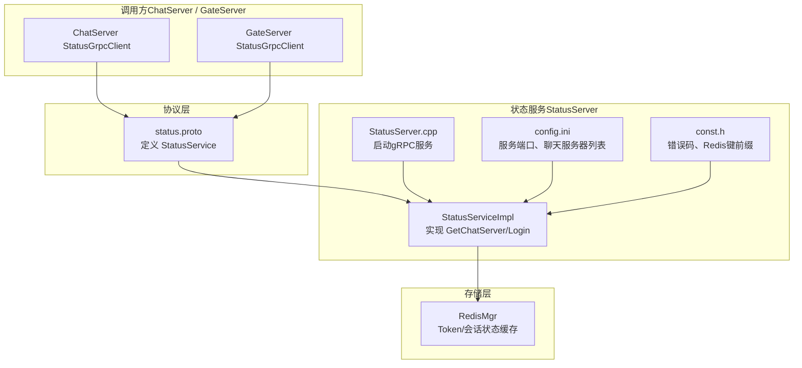
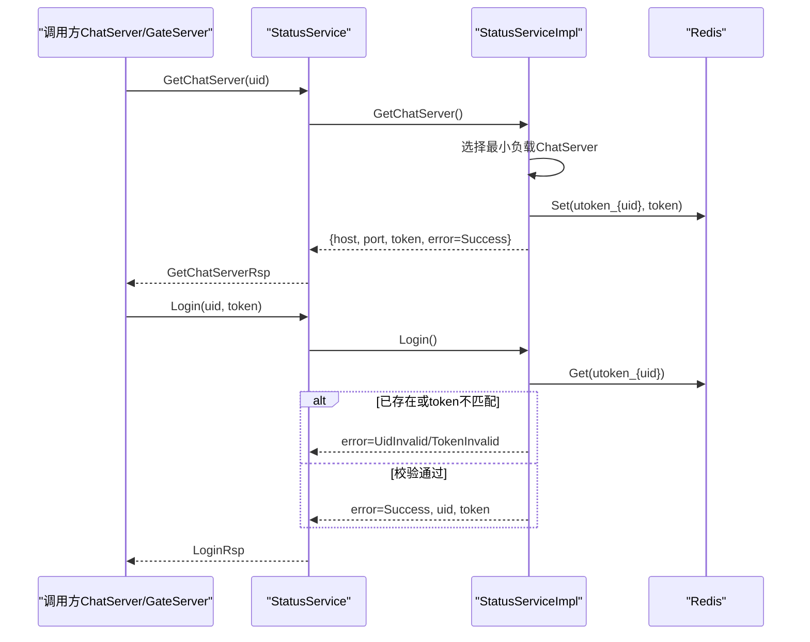
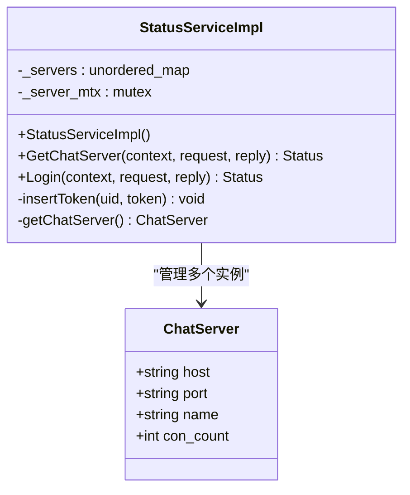
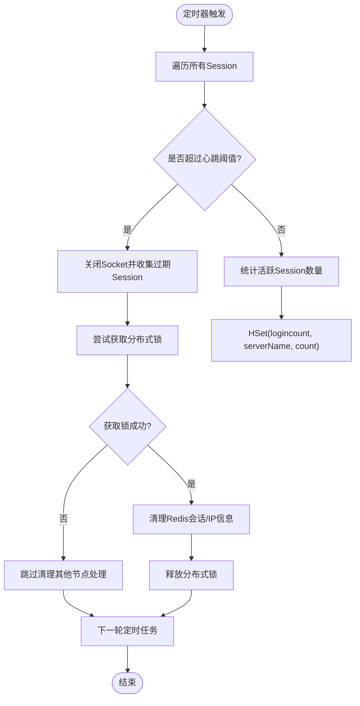
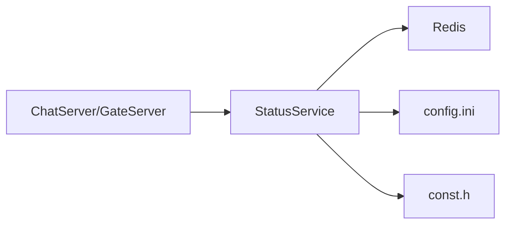

# 状态服务接口

<cite>
**本文引用的文件**   
- [status.proto](file://proto/status_service/status.proto)
- [StatusServiceImpl.h](file://server/StatusServer/include/StatusServiceImpl.h)
- [StatusServiceImpl.cpp](file://server/StatusServer/src/StatusServiceImpl.cpp)
- [StatusServer.cpp](file://server/StatusServer/src/StatusServer.cpp)
- [const.h（StatusServer）](file://server/StatusServer/include/const.h)
- [config.ini（StatusServer）](file://server/StatusServer/config/config.ini)
- [StatusGrpcClient.h（ChatServer）](file://server/ChatServer/include/StatusGrpcClient.h)
- [StatusGrpcClient.cpp（ChatServer）](file://server/ChatServer/src/StatusGrpcClient.cpp)
- [StatusGrpcClient.h（GateServer）](file://server/GateServer/include/StatusGrpcClient.h)
- [StatusGrpcClient.cpp（GateServer）](file://server/GateServer/src/StatusGrpcClient.cpp)
- [day35心跳逻辑.md](file://开发文档/day35心跳逻辑.md)
</cite>

## 目录
1. [简介](#简介)
2. [项目结构](#项目结构)
3. [核心组件](#核心组件)
4. [架构总览](#架构总览)
5. [详细组件分析](#详细组件分析)
6. [依赖关系分析](#依赖关系分析)
7. [性能考虑](#性能考虑)
8. [故障排查指南](#故障排查指南)
9. [结论](#结论)
10. [附录：客户端集成与最佳实践](#附录客户端集成与最佳实践)

## 简介
本文件为 LLFCChat 的状态服务（StatusService）提供完整的 gRPC 接口文档。基于 Protocol Buffers 定义，详细说明以下能力：
- 用户在线状态管理：登录校验、Token 绑定与失效控制
- 连接状态维护：会话存活检测、过期清理与分布式一致性
- 状态同步机制：Redis 作为状态缓存与持久化层
- 状态查询与更新接口：GetChatServer、Login 的请求/响应规范
- 客户端集成示例与监控最佳实践
- 分布式环境下的状态一致性与数据同步方案

注意：当前仓库中 StatusService 的 gRPC 接口仅包含 GetChatServer 与 Login 两个 RPC；心跳检测、连接状态维护等能力由 ChatServer/GateServer 内部实现并通过 Redis 进行状态同步，不在 StatusService 的 gRPC 接口中暴露。

## 项目结构
状态服务相关代码主要分布在以下位置：
- 协议定义：proto/status_service/status.proto
- 服务端实现：server/StatusServer/src/StatusServiceImpl.cpp、server/StatusServer/src/StatusServer.cpp
- 客户端调用：server/ChatServer/include/StatusGrpcClient.h/.cpp、server/GateServer/include/StatusGrpcClient.h/.cpp
- 配置与常量：server/StatusServer/config/config.ini、server/StatusServer/include/const.h

图表来源
- [status.proto:1-32](file://proto/status_service/status.proto#L1-L32)
- [StatusServiceImpl.h:1-52](file://server/StatusServer/include/StatusServiceImpl.h#L1-L52)
- [StatusServiceImpl.cpp:1-125](file://server/StatusServer/src/StatusServiceImpl.cpp#L1-L125)
- [StatusServer.cpp:1-69](file://server/StatusServer/src/StatusServer.cpp#L1-L69)
- [config.ini（StatusServer）:1-23](file://server/StatusServer/config/config.ini#L1-L23)
- [const.h（StatusServer）:1-75](file://server/StatusServer/include/const.h#L1-L75)
- [StatusGrpcClient.h（ChatServer）:1-99](file://server/ChatServer/include/StatusGrpcClient.h#L1-L99)
- [StatusGrpcClient.h（GateServer）:1-98](file://server/GateServer/include/StatusGrpcClient.h#L1-L98)

章节来源
- [status.proto:1-32](file://proto/status_service/status.proto#L1-L32)
- [StatusServer.cpp:1-69](file://server/StatusServer/src/StatusServer.cpp#L1-L69)
- [config.ini（StatusServer）:1-23](file://server/StatusServer/config/config.ini#L1-L23)

## 核心组件
- StatusService（gRPC 服务）
  - GetChatServer：根据 uid 返回可用的 ChatServer 地址与临时 Token
  - Login：校验 uid 与 token，防止重复登录或非法 token
- StatusServiceImpl（服务实现）
  - 从配置加载 ChatServer 列表，选择最小负载节点（当前默认首项）
  - 生成唯一 Token，写入 Redis（键前缀 USERTOKENPREFIX）
  - 登录校验时读取 Redis 中的 Token，判断是否已存在或匹配
- 存储层（Redis）
  - Token 绑定：utoken_{uid} -> token
  - 会话计数：logincount（哈希），用于负载均衡统计（预留）
- 客户端（ChatServer/GateServer）
  - 通过 StatusConPool 复用 gRPC 通道，调用 StatusService

章节来源
- [StatusServiceImpl.h:1-52](file://server/StatusServer/include/StatusServiceImpl.h#L1-L52)
- [StatusServiceImpl.cpp:1-125](file://server/StatusServer/src/StatusServiceImpl.cpp#L1-L125)
- [StatusGrpcClient.cpp（ChatServer）:1-53](file://server/ChatServer/src/StatusGrpcClient.cpp#L1-L53)
- [StatusGrpcClient.cpp（GateServer）:1-53](file://server/GateServer/src/StatusGrpcClient.cpp#L1-L53)

## 架构总览
状态服务在整体架构中承担“路由发现 + 登录鉴权”的职责。调用方（ChatServer/GateServer）先向 StatusService 获取目标 ChatServer 的地址和临时 Token，随后使用 Token 完成登录校验。会话存活与心跳由 ChatServer/GateServer 内部处理，并通过 Redis 同步状态。

图表来源
- [status.proto:1-32](file://proto/status_service/status.proto#L1-L32)
- [StatusServiceImpl.cpp:17-27](file://server/StatusServer/src/StatusServiceImpl.cpp#L17-L27)
- [StatusServiceImpl.cpp:94-116](file://server/StatusServer/src/StatusServiceImpl.cpp#L94-L116)
- [StatusGrpcClient.cpp（ChatServer）:3-21](file://server/ChatServer/src/StatusGrpcClient.cpp#L3-L21)
- [StatusGrpcClient.cpp（GateServer）:3-21](file://server/GateServer/src/StatusGrpcClient.cpp#L3-L21)

## 详细组件分析

### 协议与消息定义（status.proto）
- 服务：StatusService
  - rpc GetChatServer(GetChatServerReq) returns (GetChatServerRsp)
  - rpc Login(LoginReq) returns (LoginRsp)
- 请求/响应消息字段说明
  - GetChatServerReq
    - uid: int32，用户标识
  - GetChatServerRsp
    - error: int32，错误码（Success=0）
    - host: string，ChatServer 主机地址
    - port: string，ChatServer 端口号
    - token: string，临时令牌，用于后续登录校验
  - LoginReq
    - uid: int32，用户标识
    - token: string，临时令牌
  - LoginRsp
    - error: int32，错误码（Success=0、UidInvalid=1011、TokenInvalid=1010）
    - uid: int32，成功时回显 uid
    - token: string，成功时回显 token

章节来源
- [status.proto:1-32](file://proto/status_service/status.proto#L1-L32)

### 服务端实现（StatusServiceImpl）
- 功能要点
  - 初始化时从配置加载 ChatServer 列表，并构建内存映射
  - getChatServer() 当前返回第一个 ChatServer（预留按 Redis 统计的最小负载选择）
  - GetChatServer：生成唯一 token，写入 Redis（utoken_{uid}），返回 host/port/token
  - Login：读取 Redis 中的 utoken_{uid}，若不存在则判定 UidInvalid；若存在但不匹配则判定 TokenInvalid；否则返回 Success
  - insertToken：将 token 写入 Redis
- 并发与锁
  - _servers 访问加互斥锁保护
- 错误码
  - 使用 const.h 中的 ErrorCodes：Success、TokenInvalid、UidInvalid

图表来源
- [StatusServiceImpl.h:16-50](file://server/StatusServer/include/StatusServiceImpl.h#L16-L50)
- [StatusServiceImpl.cpp:29-55](file://server/StatusServer/src/StatusServiceImpl.cpp#L29-L55)
- [StatusServiceImpl.cpp:57-92](file://server/StatusServer/src/StatusServiceImpl.cpp#L57-L92)
- [StatusServiceImpl.cpp:94-125](file://server/StatusServer/src/StatusServiceImpl.cpp#L94-L125)

章节来源
- [StatusServiceImpl.cpp:17-27](file://server/StatusServer/src/StatusServiceImpl.cpp#L17-L27)
- [StatusServiceImpl.cpp:94-116](file://server/StatusServer/src/StatusServiceImpl.cpp#L94-L116)
- [const.h（StatusServer）:31-44](file://server/StatusServer/include/const.h#L31-L44)

### 服务启动与配置（StatusServer.cpp）
- 监听端口与注册服务：从配置读取 Host/Port，创建 gRPC Server 并注册 StatusServiceImpl
- 优雅关闭：捕获 SIGINT/SIGTERM，停止 io_context 并 Shutdown
- 资源释放：异常路径下关闭 Redis 连接

章节来源
- [StatusServer.cpp:17-52](file://server/StatusServer/src/StatusServer.cpp#L17-L52)
- [config.ini（StatusServer）:1-23](file://server/StatusServer/config/config.ini#L1-L23)

### 客户端调用（ChatServer/GateServer）
- 连接池：StatusConPool 维护多个 gRPC Channel，支持并发获取与归还
- 方法封装：GetChatServer(uid)、Login(uid, token)
- 错误处理：RPC 失败时设置错误码 RPCFailed

章节来源
- [StatusGrpcClient.h（ChatServer）:20-80](file://server/ChatServer/include/StatusGrpcClient.h#L20-L80)
- [StatusGrpcClient.cpp（ChatServer）:3-21](file://server/ChatServer/src/StatusGrpcClient.cpp#L3-L21)
- [StatusGrpcClient.h（GateServer）:19-79](file://server/GateServer/include/StatusGrpcClient.h#L19-L79)
- [StatusGrpcClient.cpp（GateServer）:3-21](file://server/GateServer/src/StatusGrpcClient.cpp#L3-L21)

### 心跳检测与连接状态维护（非 gRPC 接口）
- 心跳机制：ChatServer/GateServer 内部定时检测 Session 的心跳时间戳，超过阈值则判定连接过期
- 过期清理：关闭 Socket、清理 Redis 中的会话与 IP 信息，必要时使用分布式锁保证一致性
- 状态同步：通过 Redis 的 logincount 记录各 ChatServer 的连接数（预留用于负载均衡）

图表来源
- [day35心跳逻辑.md:272-316](file://开发文档/day35心跳逻辑.md#L272-L316)
- [day35心跳逻辑.md:418-444](file://开发文档/day35心跳逻辑.md#L418-L444)

章节来源
- [day35心跳逻辑.md:272-316](file://开发文档/day35心跳逻辑.md#L272-L316)
- [day35心跳逻辑.md:418-444](file://开发文档/day35心跳逻辑.md#L418-L444)

## 依赖关系分析
- StatusService 依赖 Redis 进行 Token 与状态缓存
- ChatServer/GateServer 依赖 StatusService 进行路由发现与登录校验
- 配置驱动：StatusServer 的监听地址、ChatServer 列表均来源于 config.ini
- 错误码统一：ErrorCodes 在各模块间保持一致

图表来源
- [StatusGrpcClient.cpp（ChatServer）:46-53](file://server/ChatServer/src/StatusGrpcClient.cpp#L46-L53)
- [StatusGrpcClient.cpp（GateServer）:46-53](file://server/GateServer/src/StatusGrpcClient.cpp#L46-L53)
- [StatusServer.cpp:17-31](file://server/StatusServer/src/StatusServer.cpp#L17-L31)
- [const.h（StatusServer）:31-44](file://server/StatusServer/include/const.h#L31-L44)

章节来源
- [StatusGrpcClient.cpp（ChatServer）:1-53](file://server/ChatServer/src/StatusGrpcClient.cpp#L1-L53)
- [StatusGrpcClient.cpp（GateServer）:1-53](file://server/GateServer/src/StatusGrpcClient.cpp#L1-L53)
- [StatusServer.cpp:17-31](file://server/StatusServer/src/StatusServer.cpp#L17-L31)
- [const.h（StatusServer）:31-44](file://server/StatusServer/include/const.h#L31-L44)

## 性能考虑
- gRPC 连接池：StatusConPool 复用 Channel，减少握手开销
- 负载均衡：当前默认返回首个 ChatServer；可结合 Redis 的 logincount 实现最小连接数策略
- 并发安全：_servers 访问加互斥锁；Redis 操作需考虑超时与重试
- 优雅关闭：信号捕获后停止 io_context，避免资源泄漏

[本节为通用指导，无需特定文件引用]

## 故障排查指南
- 常见问题
  - RPCFailed：检查 StatusServer 是否运行、端口是否正确、网络可达性
  - TokenInvalid：确认 GetChatServer 返回的 token 未被篡改或过期
  - UidInvalid：确认该 uid 未在其他节点登录或 Redis 中无对应 token
- 定位步骤
  - 查看 StatusServer 日志输出（启动监听、关闭流程）
  - 检查 Redis 中 utoken_{uid} 是否存在且值匹配
  - 检查 ChatServer/GateServer 的 StatusGrpcClient 配置（Host/Port）
- 建议
  - 增加重试与退避策略
  - 对 Redis 操作添加超时与异常捕获
  - 对关键路径增加监控指标（QPS、延迟、错误率）

章节来源
- [StatusServer.cpp:54-66](file://server/StatusServer/src/StatusServer.cpp#L54-L66)
- [StatusGrpcClient.cpp（ChatServer）:14-21](file://server/ChatServer/src/StatusGrpcClient.cpp#L14-L21)
- [StatusGrpcClient.cpp（GateServer）:14-21](file://server/GateServer/src/StatusGrpcClient.cpp#L14-L21)

## 结论
StatusService 在当前版本提供了稳定的路由发现与登录鉴权能力，配合 Redis 实现了 Token 绑定与状态缓存。心跳检测与连接状态维护由 ChatServer/GateServer 内部实现并通过 Redis 同步，保证了分布式环境下的一致性。未来可扩展更多状态管理与监控接口，进一步提升系统的可观测性与弹性。

[本节为总结，无需特定文件引用]

## 附录：客户端集成与最佳实践

### 接口规范速查
- GetChatServer
  - 请求：uid（int32）
  - 响应：error（int32）、host（string）、port（string）、token（string）
  - 用途：获取目标 ChatServer 地址与临时 Token
- Login
  - 请求：uid（int32）、token（string）
  - 响应：error（int32）、uid（int32）、token（string）
  - 用途：校验 Token 并完成登录

章节来源
- [status.proto:11-31](file://proto/status_service/status.proto#L11-L31)

### 客户端集成示例（伪代码）
- 初始化 StatusGrpcClient（连接池）
- 调用 GetChatServer(uid) 获取 host/port/token
- 调用 Login(uid, token) 完成登录校验
- 成功后建立与 ChatServer 的长连接，并定期发送心跳

章节来源
- [StatusGrpcClient.cpp（ChatServer）:3-21](file://server/ChatServer/src/StatusGrpcClient.cpp#L3-L21)
- [StatusGrpcClient.cpp（GateServer）:3-21](file://server/GateServer/src/StatusGrpcClient.cpp#L3-L21)

### 状态监控最佳实践
- 指标采集
  - QPS、延迟分布、错误率（RPCFailed、TokenInvalid、UidInvalid）
  - Redis 命中率、连接数、超时次数
- 告警规则
  - 错误率突增、延迟超阈值、Redis 不可用
- 健康检查
  - StatusServer 存活探测、Redis 连通性检测

[本节为通用指导，无需特定文件引用]