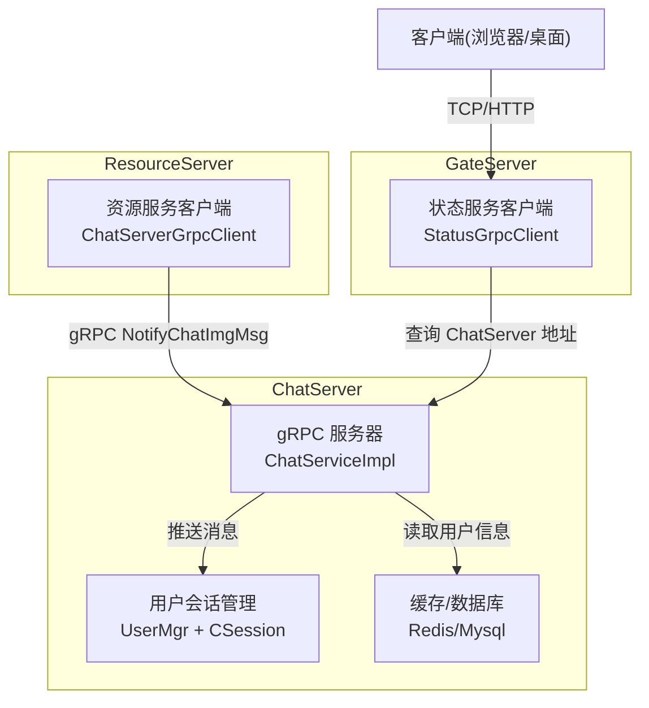
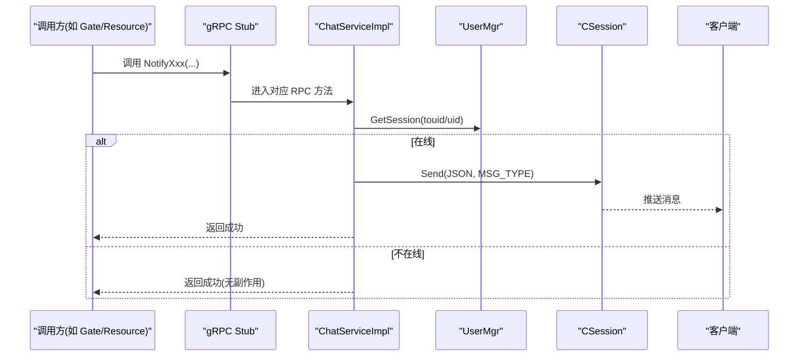
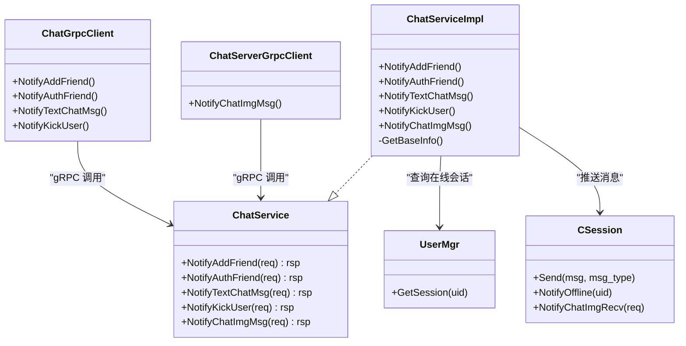
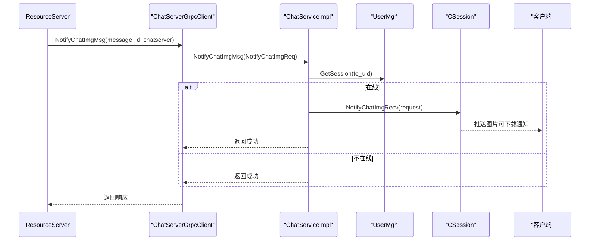

# 聊天服务接口

<cite>
**本文引用的文件**   
- [chat.proto](file://proto/chat_service/chat.proto)
- [ChatServiceImpl.h](file://server/ChatServer/include/ChatServiceImpl.h)
- [ChatServiceImpl.cpp](file://server/ChatServer/src/ChatServiceImpl.cpp)
- [CSession.h](file://server/ChatServer/include/CSession.h)
- [const.h](file://server/ChatServer/include/const.h)
- [ChatGrpcClient.h](file://server/ChatServer/include/ChatGrpcClient.h)
- [ChatGrpcClient.cpp](file://server/ChatServer/src/ChatGrpcClient.cpp)
- [ChatServerGrpcClient.h](file://server/ResourceServer/include/ChatServerGrpcClient.h)
- [ChatServerGrpcClient.cpp](file://server/ResourceServer/src/ChatServerGrpcClient.cpp)
- [StatusGrpcClient.h](file://server/GateServer/include/StatusGrpcClient.h)
- [ChatServer.cpp](file://server/ChatServer/src/ChatServer.cpp)
</cite>

## 目录
1. [简介](#简介)
2. [项目结构](#项目结构)
3. [核心组件](#核心组件)
4. [架构总览](#架构总览)
5. [详细组件分析](#详细组件分析)
6. [依赖关系分析](#依赖关系分析)
7. [性能考虑](#性能考虑)
8. [故障排查指南](#故障排查指南)
9. [结论](#结论)
10. [附录](#附录)

## 简介
本文件为 LLFCChat 聊天服务的 gRPC 接口文档，聚焦 ChatService 的五个 RPC 方法：NotifyAddFriend（好友申请通知）、NotifyAuthFriend（好友认证通知）、NotifyTextChatMsg（文本聊天消息）、NotifyKickUser（踢人通知）、NotifyChatImgMsg（图片消息通知）。文档涵盖每个方法的请求与响应消息字段、类型、约束与业务含义；提供调用示例与错误处理机制；解释微服务间异步通信模式与消息传递机制；并给出服务间调用的最佳实践与性能优化建议。

## 项目结构
- Proto 定义位于 proto/chat_service/chat.proto，定义了 ChatService 及其全部消息类型。
- ChatServer 实现 ChatService::Service，负责将 gRPC 请求转换为内部 TCP 会话推送或资源操作。
- GateServer/StatusServer 用于服务发现与登录状态管理，GateServer 通过 StatusGrpcClient 获取 ChatServer 地址。
- ResourceServer 在图片上传完成后，通过 ChatServerGrpcClient 调用 ChatService.NotifyChatImgMsg 通知接收端。
- ChatServer 内部通过 CSession 向在线客户端发送二进制协议消息（基于 Boost.Asio/Beast），并使用 UserMgr 维护用户到 Session 的映射。

**图表来源** 
- [ChatServer.cpp:40-51](file://server/ChatServer/src/ChatServer.cpp#L40-L51)
- [ChatServiceImpl.h:29-53](file://server/ChatServer/include/ChatServiceImpl.h#L29-L53)
- [ChatGrpcClient.h:96-112](file://server/ChatServer/include/ChatGrpcClient.h#L96-L112)
- [ChatServerGrpcClient.h:81-93](file://server/ResourceServer/include/ChatServerGrpcClient.h#L81-L93)
- [StatusGrpcClient.h:81-94](file://server/GateServer/include/StatusGrpcClient.h#L81-L94)

**章节来源**
- [chat.proto:1-105](file://proto/chat_service/chat.proto#L1-L105)
- [ChatServer.cpp:20-79](file://server/ChatServer/src/ChatServer.cpp#L20-L79)

## 核心组件
- ChatService 接口：定义 5 个 RPC 方法，分别覆盖好友申请、认证、文本消息、踢人、图片通知等场景。
- ChatServiceImpl：实现上述 RPC 方法，查找目标用户的在线 Session，构造内部 JSON 消息并通过 CSession 推送给客户端。
- CSession：封装 TCP Socket 读写队列、心跳、离线通知、图片下载通知等能力。
- ChatGrpcClient / ChatServerGrpcClient：分别为 ChatServer 与 ResourceServer 提供的 gRPC 客户端连接池封装，统一管理与远端 ChatService 的连接复用与错误处理。
- const.h：集中定义错误码、消息类型、键前缀等常量，保证跨模块一致性。

**章节来源**
- [ChatServiceImpl.h:29-53](file://server/ChatServer/include/ChatServiceImpl.h#L29-L53)
- [ChatServiceImpl.cpp:16-240](file://server/ChatServer/src/ChatServiceImpl.cpp#L16-L240)
- [CSession.h:28-76](file://server/ChatServer/include/CSession.h#L28-L76)
- [ChatGrpcClient.h:96-112](file://server/ChatServer/include/ChatGrpcClient.h#L96-L112)
- [ChatGrpcClient.cpp:1-203](file://server/ChatServer/src/ChatGrpcClient.cpp#L1-L203)
- [ChatServerGrpcClient.h:81-93](file://server/ResourceServer/include/ChatServerGrpcClient.h#L81-L93)
- [ChatServerGrpcClient.cpp:1-53](file://server/ResourceServer/src/ChatServerGrpcClient.cpp#L1-L53)
- [const.h:5-104](file://server/ChatServer/include/const.h#L5-L104)

## 架构总览
ChatService 作为聊天转发与通知中心，被以下角色调用：
- GateServer/其他 ChatServer：通过 ChatGrpcClient 调用 NotifyAddFriend、NotifyAuthFriend、NotifyTextChatMsg、NotifyKickUser。
- ResourceServer：通过 ChatServerGrpcClient 调用 NotifyChatImgMsg，通知接收端图片可下载。

ChatServiceImpl 收到请求后：
- 根据目标 uid 从 UserMgr 获取在线 Session。
- 若在线，则构造内部 JSON 消息并通过 CSession.Send 推送至客户端。
- 若不在线，直接返回成功（不阻塞调用方），由上层重试或落库后续补偿。

**图表来源** 
- [ChatServiceImpl.cpp:16-47](file://server/ChatServer/src/ChatServiceImpl.cpp#L16-L47)
- [ChatServiceImpl.cpp:49-103](file://server/ChatServer/src/ChatServiceImpl.cpp#L49-L103)
- [ChatServiceImpl.cpp:105-139](file://server/ChatServer/src/ChatServiceImpl.cpp#L105-L139)
- [ChatServiceImpl.cpp:187-210](file://server/ChatServer/src/ChatServiceImpl.cpp#L187-L210)
- [ChatServiceImpl.cpp:217-239](file://server/ChatServer/src/ChatServiceImpl.cpp#L217-L239)

## 详细组件分析

### RPC 方法一：NotifyAddFriend（好友申请通知）
- 功能：当 A 向 B 发起好友申请时，调用此方法通知 B 的客户端显示“新的好友申请”。
- 请求 AddFriendReq
  - applyuid: int32，申请人 uid
  - name: string，申请人姓名
  - desc: string，申请附言
  - icon: string，头像路径/URL
  - nick: string，昵称
  - sex: int32，性别
  - touid: int32，接收人 uid（必须在线才会推送）
- 响应 AddFriendRsp
  - error: int32，错误码（Success=0）
  - applyuid: int32，回显申请人 uid
  - touid: int32，回显接收人 uid
- 行为说明
  - 若 touid 在线：构造内部 JSON（包含 error、applyuid、name、desc、icon、sex、nick），通过 CSession.Send(ID_NOTIFY_ADD_FRIEND_REQ) 推送。
  - 若 touid 不在线：直接返回成功，不做任何推送（可由上层决定后续策略，如入队延迟重推）。
- 错误处理
  - error 使用 const.h 中的 ErrorCodes，常见为 Success。
  - 网络异常时，调用方会收到 gRPC Status 非 ok，应记录日志并重试。
- 调用示例（伪代码）
  - 构造 AddFriendReq，设置 applyuid/touid/name/desc/icon/nick/sex。
  - 通过 ChatGrpcClient.NotifyAddFriend(server_ip, req) 调用。
  - 检查 rsp.error，若为 0 表示服务端已处理（是否推送取决于对方是否在线）。

**章节来源**
- [chat.proto:15-29](file://proto/chat_service/chat.proto#L15-L29)
- [ChatServiceImpl.cpp:16-47](file://server/ChatServer/src/ChatServiceImpl.cpp#L16-L47)
- [const.h:5-20](file://server/ChatServer/include/const.h#L5-L20)
- [ChatGrpcClient.cpp:32-60](file://server/ChatServer/src/ChatGrpcClient.cpp#L32-L60)

### RPC 方法二：NotifyAuthFriend（好友认证通知）
- 功能：当双方完成好友认证流程后，通知接收方客户端展示认证相关聊天记录与对方基础信息。
- 请求 AuthFriendReq
  - fromuid: int32，发起认证的用户 uid
  - touid: int32，接收认证的用户 uid
  - textmsgs: repeated AddFriendMsg，认证过程中的消息列表
    - sender_id: int32，发送者 id
    - unique_id: string，唯一消息标识
    - msg_id: int32，消息 id
    - thread_id: int32，会话线程 id
    - msgcontent: string，消息内容
    - status: int32，消息状态（未读/已读/发送失败等）
- 响应 AuthFriendRsp
  - error: int32，错误码
  - fromuid: int32，回显发起方 uid
  - touid: int32，回显接收方 uid
- 行为说明
  - 若 touid 在线：先尝试从 Redis/MySQL 获取 fromuid 的基础信息（name/nick/icon/sex），然后组装 chat_datas 数组，通过 CSession.Send(ID_NOTIFY_AUTH_FRIEND_REQ) 推送。
  - 若 touid 不在线：直接返回成功。
- 错误处理
  - 若无法获取 fromuid 基础信息，error 可能设置为 UidInvalid。
  - 网络异常时，调用方捕获 gRPC Status 非 ok 并重试。
- 调用示例（伪代码）
  - 构造 AuthFriendReq，填充 fromuid/touid/textmsgs。
  - 调用 ChatGrpcClient.NotifyAuthFriend(server_ip, req)。
  - 检查 rsp.error 与回显 uid。

**章节来源**
- [chat.proto:32-51](file://proto/chat_service/chat.proto#L32-L51)
- [ChatServiceImpl.cpp:49-103](file://server/ChatServer/src/ChatServiceImpl.cpp#L49-L103)
- [const.h:5-20](file://server/ChatServer/include/const.h#L5-L20)
- [ChatGrpcClient.cpp:107-135](file://server/ChatServer/src/ChatGrpcClient.cpp#L107-L135)

### RPC 方法三：NotifyTextChatMsg（文本聊天消息）
- 功能：发送文本聊天消息，通知接收方客户端渲染新消息。
- 请求 TextChatMsgReq
  - fromuid: int32，发送者 uid
  - touid: int32，接收者 uid
  - thread_id: int32，会话线程 id
  - textmsgs: repeated TextChatData，消息体数组
    - unique_id: string，唯一消息标识
    - msg_id: int32，消息 id
    - msgcontent: string，消息内容
    - chat_time: string，时间戳字符串
- 响应 TextChatMsgRsp
  - error: int32，错误码
  - fromuid: int32，回显发送者 uid
  - touid: int32，回显接收者 uid
  - thread_id: int32，回显线程 id
  - textmsgs: repeated TextChatData，回显消息体
- 行为说明
  - 若 touid 在线：构造内部 JSON（包含 error/fromuid/touid/thread_id/chat_datas），通过 CSession.Send(ID_NOTIFY_TEXT_CHAT_MSG_REQ) 推送。
  - 若 touid 不在线：直接返回成功。
- 错误处理
  - error 为 Success 表示服务端已处理（是否推送取决于在线状态）。
  - 网络异常时，调用方捕获 gRPC Status 非 ok 并重试。
- 调用示例（伪代码）
  - 构造 TextChatMsgReq，填充 fromuid/touid/thread_id/textmsgs。
  - 调用 ChatGrpcClient.NotifyTextChatMsg(server_ip, req, rtvalue)。
  - 检查 rsp.error 与回显数据。

**章节来源**
- [chat.proto:54-74](file://proto/chat_service/chat.proto#L54-L74)
- [ChatServiceImpl.cpp:105-139](file://server/ChatServer/src/ChatServiceImpl.cpp#L105-L139)
- [const.h:5-20](file://server/ChatServer/include/const.h#L5-L20)
- [ChatGrpcClient.cpp:137-173](file://server/ChatServer/src/ChatGrpcClient.cpp#L137-L173)

### RPC 方法四：NotifyKickUser（踢人通知）
- 功能：强制下线指定用户（例如多设备互踢、管理员踢人）。
- 请求 KickUserReq
  - uid: int32，被踢用户 uid
- 响应 KickUserRsp
  - error: int32，错误码
  - uid: int32，回显被踢 uid
- 行为说明
  - 若 uid 在线：调用 session->NotifyOffline(uid) 并清理旧连接，再返回成功。
  - 若 uid 不在线：直接返回成功。
- 错误处理
  - error 为 Success 表示服务端已处理。
  - 网络异常时，调用方捕获 gRPC Status 非 ok 并重试。
- 调用示例（伪代码）
  - 构造 KickUserReq，设置 uid。
  - 调用 ChatGrpcClient.NotifyKickUser(server_ip, req)。
  - 检查 rsp.error。

**章节来源**
- [chat.proto:77-84](file://proto/chat_service/chat.proto#L77-L84)
- [ChatServiceImpl.cpp:187-210](file://server/ChatServer/src/ChatServiceImpl.cpp#L187-L210)
- [const.h:5-20](file://server/ChatServer/include/const.h#L5-L20)
- [ChatGrpcClient.cpp:175-202](file://server/ChatServer/src/ChatGrpcClient.cpp#L175-L202)

### RPC 方法五：NotifyChatImgMsg（图片消息通知）
- 功能：资源服务在完成图片上传后，通知 ChatServer 向接收端推送“图片可下载”的通知。
- 请求 NotifyChatImgReq
  - from_uid: int32，发送者 uid
  - to_uid: int32，接收者 uid
  - message_id: int32，消息 id
  - file_name: string，文件名
  - total_size: int64，文件大小
  - thread_id: int32，会话线程 id
- 响应 NotifyChatImgRsp
  - error: int32，错误码
  - from_uid: int32，回显发送者 uid
  - to_uid: int32，回显接收者 uid
  - message_id: int32，回显消息 id
  - file_name: string，回显文件名
  - total_size: int64，回显文件大小
  - thread_id: int32，回显线程 id
- 行为说明
  - 若 to_uid 在线：调用 session->NotifyChatImgRecv(request)，让客户端开始异步下载图片。
  - 若 to_uid 不在线：直接返回成功（客户端下次上线后可拉取）。
- 错误处理
  - error 为 Success 表示服务端已处理。
  - 网络异常时，调用方捕获 gRPC Status 非 ok 并重试。
- 调用示例（伪代码）
  - 构造 NotifyChatImgReq，填充 from_uid/to_uid/message_id/file_name/total_size/thread_id。
  - 通过 ChatServerGrpcClient.NotifyChatImgMsg(message_id, chatserver) 调用。
  - 检查 rsp.error。

**章节来源**
- [chat.proto:87-104](file://proto/chat_service/chat.proto#L87-L104)
- [ChatServiceImpl.cpp:217-239](file://server/ChatServer/src/ChatServiceImpl.cpp#L217-L239)
- [ChatServerGrpcClient.cpp:4-40](file://server/ResourceServer/src/ChatServerGrpcClient.cpp#L4-L40)
- [const.h:5-20](file://server/ChatServer/include/const.h#L5-L20)

## 依赖关系分析
- ChatService 被多个服务通过 gRPC 调用：
  - GateServer/ChatServer：通过 ChatGrpcClient 调用 NotifyAddFriend、NotifyAuthFriend、NotifyTextChatMsg、NotifyKickUser。
  - ResourceServer：通过 ChatServerGrpcClient 调用 NotifyChatImgMsg。
- ChatServiceImpl 依赖：
  - UserMgr：根据 uid 获取在线 Session。
  - CSession：向客户端推送消息。
  - Redis/Mysql：获取用户基础信息（认证场景）。
- 连接池与配置：
  - ChatConPool/ChatServerConPool：管理 gRPC Channel/Stub 的生命周期与复用。
  - ConfigMgr：读取 PeerServer/ChatServer 地址与端口。

**图表来源** 
- [ChatServiceImpl.h:29-53](file://server/ChatServer/include/ChatServiceImpl.h#L29-L53)
- [ChatGrpcClient.h:96-112](file://server/ChatServer/include/ChatGrpcClient.h#L96-L112)
- [ChatServerGrpcClient.h:81-93](file://server/ResourceServer/include/ChatServerGrpcClient.h#L81-L93)

**章节来源**
- [ChatGrpcClient.cpp:1-203](file://server/ChatServer/src/ChatGrpcClient.cpp#L1-L203)
- [ChatServerGrpcClient.cpp:1-53](file://server/ResourceServer/src/ChatServerGrpcClient.cpp#L1-L53)
- [const.h:5-104](file://server/ChatServer/include/const.h#L5-L104)

## 性能考虑
- 连接池复用
  - 所有 gRPC 调用均通过连接池（ChatConPool/ChatServerConPool）复用 Channel/Stub，减少握手开销。
  - 合理设置 poolSize（默认 5），在高并发下可适当增大，避免频繁创建销毁。
- 异步推送
  - ChatServiceImpl 仅做轻量拼装与推送，不阻塞 I/O；在线判断失败直接返回，避免长尾延迟。
- 缓存优先
  - 用户基础信息优先查 Redis，未命中再查 MySQL 并回填缓存，降低数据库压力。
- 批量消息
  - 文本消息以数组形式传输（textmsgs），减少多次往返。
- 超时与重试
  - 调用方需设置合理的 ClientContext 超时，并在 gRPC Status 非 ok 时进行指数退避重试。
- 背压与限流
  - 对高频消息（如大量文本/图片通知）建议在调用侧做限流与合并，避免瞬时峰值打满后端。

[本节为通用指导，无需特定文件引用]

## 故障排查指南
- 常见问题定位
  - 调用方收到 gRPC Status 非 ok：检查网络连通性、PeerServer 配置、服务端口是否正确。
  - 接收端未收到消息：确认目标 uid 是否在线（UserMgr.GetSession），不在线需采用延迟重推或离线消息策略。
  - 认证信息缺失：检查 Redis/MySQL 中 fromuid 的基础信息是否存在，确保 GetBaseInfo 逻辑正常。
  - 图片通知无效：确认 ResourceServer 已正确计算 total_size 与 file_name，且 ChatServerGrpcClient 能正确路由到目标 ChatServer。
- 错误码参考
  - Success=0：成功
  - RPCFailed=1002：RPC 请求错误
  - UidInvalid=1011：uid 无效
  - 其他错误码参见 const.h
- 日志与监控
  - 在关键路径（连接池获取/归还、gRPC 调用、Session 推送）增加日志埋点。
  - 监控 gRPC 调用耗时、错误率、在线用户数、推送成功率。

**章节来源**
- [const.h:5-20](file://server/ChatServer/include/const.h#L5-L20)
- [ChatGrpcClient.cpp:32-60](file://server/ChatServer/src/ChatGrpcClient.cpp#L32-L60)
- [ChatGrpcClient.cpp:107-135](file://server/ChatServer/src/ChatGrpcClient.cpp#L107-L135)
- [ChatGrpcClient.cpp:137-173](file://server/ChatServer/src/ChatGrpcClient.cpp#L137-L173)
- [ChatGrpcClient.cpp:175-202](file://server/ChatServer/src/ChatGrpcClient.cpp#L175-L202)
- [ChatServerGrpcClient.cpp:4-40](file://server/ResourceServer/src/ChatServerGrpcClient.cpp#L4-L40)

## 结论
ChatService 提供了稳定、可扩展的聊天通知与消息转发能力。通过连接池、缓存优先、异步推送等设计，系统在大规模在线场景下具备良好性能与可用性。建议在生产环境完善超时重试、幂等性与离线补偿策略，并结合监控告警保障服务质量。

[本节为总结，无需特定文件引用]

## 附录

### 消息与错误码速览
- 错误码（部分）
  - Success=0
  - RPCFailed=1002
  - UidInvalid=1011
- 消息类型（部分）
  - ID_NOTIFY_ADD_FRIEND_REQ=1011
  - ID_NOTIFY_AUTH_FRIEND_REQ=1015
  - ID_NOTIFY_TEXT_CHAT_MSG_REQ=1019
  - ID_NOTIFY_OFF_LINE_REQ=1021
  - ID_IMG_CHAT_MSG_REQ=1035
  - ID_NOTIFY_IMG_CHAT_MSG_REQ=1039

**章节来源**
- [const.h:5-20](file://server/ChatServer/include/const.h#L5-L20)
- [const.h:49-79](file://server/ChatServer/include/const.h#L49-L79)

### 典型调用序列图（图片通知）

**图表来源** 
- [ChatServerGrpcClient.cpp:4-40](file://server/ResourceServer/src/ChatServerGrpcClient.cpp#L4-L40)
- [ChatServiceImpl.cpp:217-239](file://server/ChatServer/src/ChatServiceImpl.cpp#L217-L239)