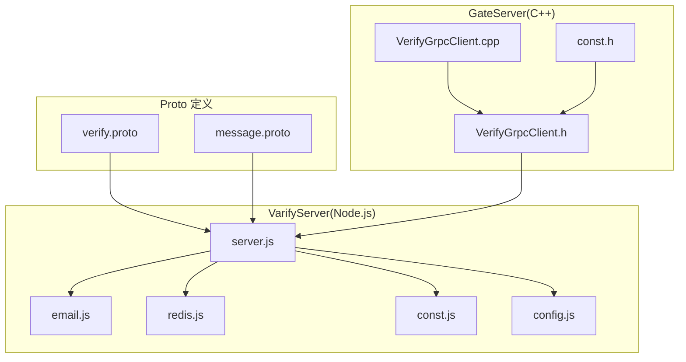
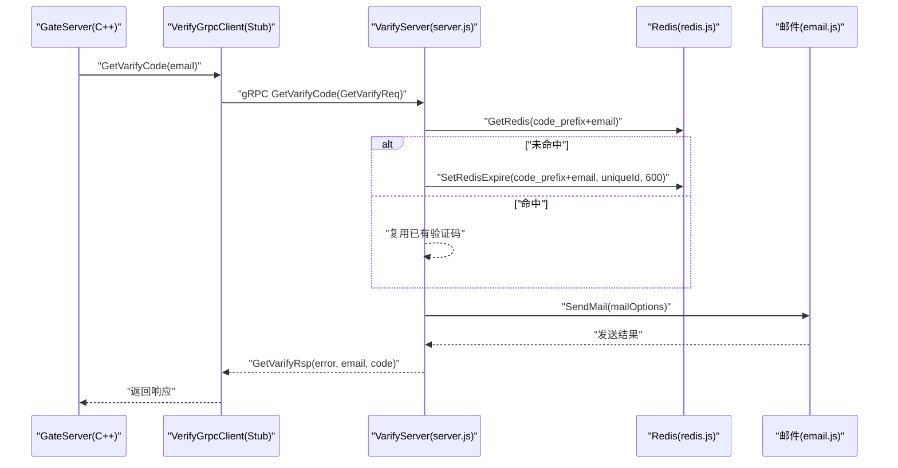
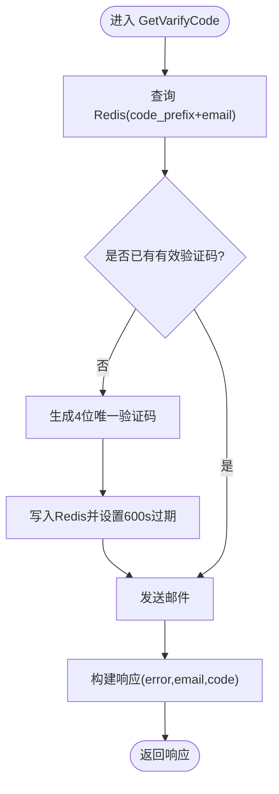
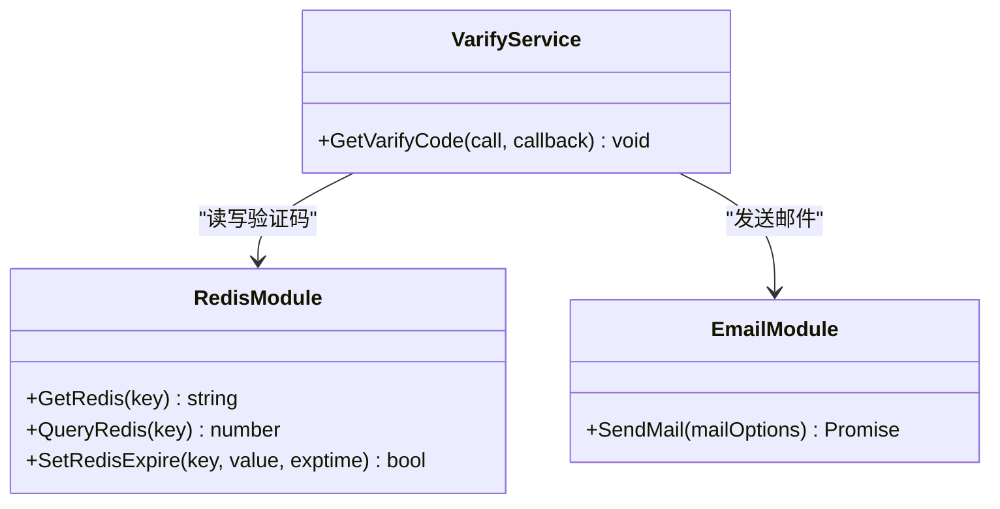
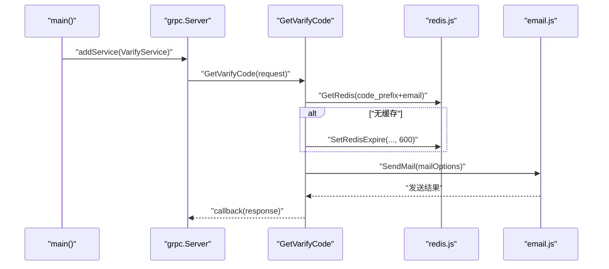
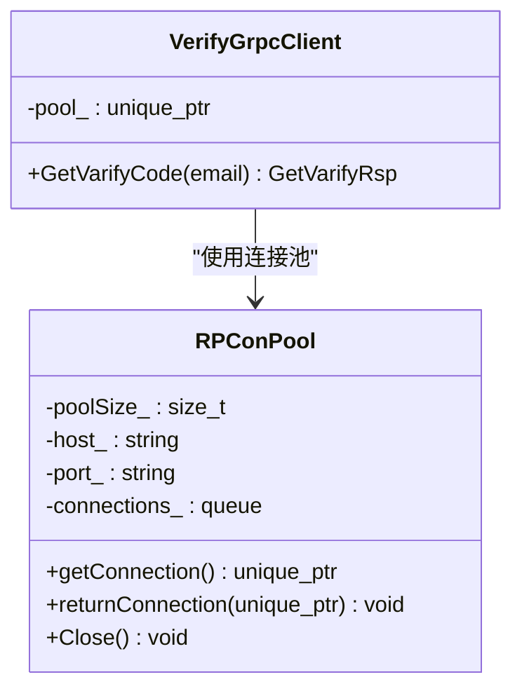
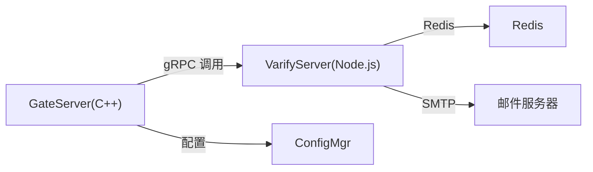

# 验证服务接口

<cite>
**本文引用的文件**
- [proto/verify_service/verify.proto](file://proto/verify_service/verify.proto)
- [server/VarifyServer/message.proto](file://server/VarifyServer/message.proto)
- [server/VarifyServer/server.js](file://server/VarifyServer/server.js)
- [server/VarifyServer/email.js](file://server/VarifyServer/email.js)
- [server/VarifyServer/redis.js](file://server/VarifyServer/redis.js)
- [server/VarifyServer/const.js](file://server/VarifyServer/const.js)
- [server/VarifyServer/config.js](file://server/VarifyServer/config.js)
- [server/GateServer/include/VerifyGrpcClient.h](file://server/GateServer/include/VerifyGrpcClient.h)
- [server/GateServer/src/VerifyGrpcClient.cpp](file://server/GateServer/src/VerifyGrpcClient.cpp)
- [server/GateServer/include/const.h](file://server/GateServer/include/const.h)
</cite>

## 目录
1. [简介](#简介)
2. [项目结构](#项目结构)
3. [核心组件](#核心组件)
4. [架构总览](#架构总览)
5. [详细组件分析](#详细组件分析)
6. [依赖关系分析](#依赖关系分析)
7. [性能考虑](#性能考虑)
8. [故障排查指南](#故障排查指南)
9. [结论](#结论)
10. [附录](#附录)

## 简介
本文件为 LLFCChat 验证服务的 gRPC 接口文档，聚焦于 VarifyService 的接口规范与实现细节。当前仓库中已实现的接口为“获取邮箱验证码”（GetVarifyCode），其流程包括：从 Redis 读取或生成验证码、通过邮件发送、返回统一错误码。GateServer 作为调用方，通过 C++ gRPC 客户端连接 Node.js 实现的 VarifyServer。

说明：
- 当前代码库仅实现了“获取验证码”这一 RPC；注册、登录、密码重置等校验逻辑在 GateServer 侧进行编排，但不在本仓库的 VarifyServer 中直接暴露为独立 RPC。
- 验证码生成算法、有效期管理、防刷机制与安全校验均基于 Redis 与邮件模块协同完成。

## 项目结构
与验证服务相关的核心文件分布如下：
- Proto 定义：proto/verify_service/verify.proto 与 server/VarifyServer/message.proto
- 服务端实现（Node.js）：server/VarifyServer/server.js、email.js、redis.js、const.js、config.js
- 客户端调用（C++）：server/GateServer/include/VerifyGrpcClient.h、server/GateServer/src/VerifyGrpcClient.cpp
- 错误码常量：server/GateServer/include/const.h

**图表来源**
- [proto/verify_service/verify.proto:1-19](file://proto/verify_service/verify.proto#L1-L19)
- [server/VarifyServer/message.proto:1-44](file://server/VarifyServer/message.proto#L1-L44)
- [server/VarifyServer/server.js:1-76](file://server/VarifyServer/server.js#L1-L76)
- [server/VarifyServer/email.js:1-37](file://server/VarifyServer/email.js#L1-L37)
- [server/VarifyServer/redis.js:1-101](file://server/VarifyServer/redis.js#L1-L101)
- [server/VarifyServer/const.js:1-10](file://server/VarifyServer/const.js#L1-L10)
- [server/VarifyServer/config.js:1-15](file://server/VarifyServer/config.js#L1-L15)
- [server/GateServer/include/VerifyGrpcClient.h:1-113](file://server/GateServer/include/VerifyGrpcClient.h#L1-L113)
- [server/GateServer/src/VerifyGrpcClient.cpp:1-9](file://server/GateServer/src/VerifyGrpcClient.cpp#L1-L9)
- [server/GateServer/include/const.h:1-65](file://server/GateServer/include/const.h#L1-L65)

**章节来源**
- [proto/verify_service/verify.proto:1-19](file://proto/verify_service/verify.proto#L1-L19)
- [server/VarifyServer/message.proto:1-44](file://server/VarifyServer/message.proto#L1-L44)
- [server/VarifyServer/server.js:1-76](file://server/VarifyServer/server.js#L1-L76)
- [server/GateServer/include/VerifyGrpcClient.h:1-113](file://server/GateServer/include/VerifyGrpcClient.h#L1-L113)
- [server/GateServer/src/VerifyGrpcClient.cpp:1-9](file://server/GateServer/src/VerifyGrpcClient.cpp#L1-L9)
- [server/GateServer/include/const.h:1-65](file://server/GateServer/include/const.h#L1-L65)

## 核心组件
- VarifyService（gRPC 服务）
  - 方法：GetVarifyCode
  - 请求：GetVarifyReq（字段 email）
  - 响应：GetVarifyRsp（字段 error、email、code）
- 验证码存储与过期（Redis）
  - Key 前缀：code_
  - 过期时间：600 秒（10 分钟）
- 邮件发送（Nodemailer）
  - SMTP 配置来自 config.js
- 错误码（Node.js 端）
  - Success=0, RedisErr=1, Exception=2

**章节来源**
- [proto/verify_service/verify.proto:6-18](file://proto/verify_service/verify.proto#L6-L18)
- [server/VarifyServer/message.proto:5-17](file://server/VarifyServer/message.proto#L5-L17)
- [server/VarifyServer/const.js:1-10](file://server/VarifyServer/const.js#L1-L10)
- [server/VarifyServer/redis.js:87-98](file://server/VarifyServer/redis.js#L87-L98)
- [server/VarifyServer/email.js:1-37](file://server/VarifyServer/email.js#L1-L37)
- [server/VarifyServer/config.js:1-15](file://server/VarifyServer/config.js#L1-L15)

## 架构总览
GateServer（C++）通过 gRPC 客户端调用 VarifyServer（Node.js）的 GetVarifyCode 接口。VarifyServer 使用 Redis 存取验证码并设置过期时间，再通过 Nodemailer 发送邮件。

**图表来源**
- [server/GateServer/include/VerifyGrpcClient.h:87-104](file://server/GateServer/include/VerifyGrpcClient.h#L87-L104)
- [server/VarifyServer/server.js:15-64](file://server/VarifyServer/server.js#L15-L64)
- [server/VarifyServer/redis.js:41-98](file://server/VarifyServer/redis.js#L41-L98)
- [server/VarifyServer/email.js:22-35](file://server/VarifyServer/email.js#L22-L35)

## 详细组件分析

### VarifyService 接口规范（GetVarifyCode）
- 服务名：VarifyService
- 方法名：GetVarifyCode
- 请求体 GetVarifyReq
  - email: string（必填）
- 响应体 GetVarifyRsp
  - error: int32（错误码，0 表示成功）
  - email: string（回显请求邮箱）
  - code: string（本次验证码值；若服务端复用历史验证码则可能为空字符串）

行为要点：
- 首次请求：生成 4 位唯一验证码，写入 Redis，设置 600 秒过期，发送邮件后返回 success。
- 重复请求（有效期内）：复用 Redis 中的验证码，不重新生成，仍发送邮件（实际可优化为幂等控制）。
- 异常处理：Redis 写入失败返回 RedisErr；其他异常返回 Exception。

**图表来源**
- [server/VarifyServer/server.js:15-64](file://server/VarifyServer/server.js#L15-L64)
- [server/VarifyServer/redis.js:87-98](file://server/VarifyServer/redis.js#L87-L98)

**章节来源**
- [proto/verify_service/verify.proto:6-18](file://proto/verify_service/verify.proto#L6-L18)
- [server/VarifyServer/message.proto:5-17](file://server/VarifyServer/message.proto#L5-L17)
- [server/VarifyServer/server.js:15-64](file://server/VarifyServer/server.js#L15-L64)

### 验证码生成算法与有效期管理
- 生成算法：使用 UUID 的前 4 个字符作为验证码。
- 有效期：Redis 键设置 600 秒过期。
- 存储策略：以 code_prefix + email 作为 key，值为验证码字符串。
- 防刷机制：同一邮箱在有效期内复用同一验证码，避免频繁生成新码；建议结合业务层限流（当前代码未实现频率限制）。

**图表来源**
- [server/VarifyServer/redis.js:41-98](file://server/VarifyServer/redis.js#L41-L98)
- [server/VarifyServer/email.js:22-35](file://server/VarifyServer/email.js#L22-L35)
- [server/VarifyServer/server.js:15-64](file://server/VarifyServer/server.js#L15-L64)

**章节来源**
- [server/VarifyServer/server.js:24-36](file://server/VarifyServer/server.js#L24-L36)
- [server/VarifyServer/redis.js:87-98](file://server/VarifyServer/redis.js#L87-L98)
- [server/VarifyServer/const.js:1-10](file://server/VarifyServer/const.js#L1-L10)

### 安全校验机制
- 验证码有效性：由调用方（GateServer）在业务层校验 Redis 中的验证码是否匹配且未过期。
- 错误码约定：
  - 0：成功
  - 1：Redis 错误
  - 2：异常
- GateServer 侧错误码扩展：包含验证码过期、验证码错误、用户存在、密码错误、Token 失效等（用于上层业务编排）。

**章节来源**
- [server/VarifyServer/const.js:1-10](file://server/VarifyServer/const.js#L1-L10)
- [server/GateServer/include/const.h:31-44](file://server/GateServer/include/const.h#L31-L44)

### 注册验证、登录验证、密码修改验证（接口规划与现状）
- 现状：仓库中仅实现“获取验证码”的 RPC。注册、登录、密码重置等业务逻辑在 GateServer 侧编排，但未在 VarifyServer 中暴露对应 RPC。
- 建议扩展（供后续开发参考）：
  - VerifyUserRegister：校验用户名、邮箱唯一性，校验验证码有效性。
  - VerifyLogin：校验用户名/邮箱与密码，必要时校验验证码。
  - VerifyResetPassword：校验邮箱验证码与新密码格式。
- 注意：上述接口未在现有代码中实现，如需接入需新增 proto 定义与服务端实现。

[本节为概念性说明，不直接分析具体文件]

### Node.js 服务端实现示例（调用路径与关键步骤）
- 启动 gRPC 服务器，绑定端口 50051。
- 注册 VarifyService.GetVarifyCode 处理器。
- 处理器内部：
  - 读取 Redis 中是否存在该邮箱的验证码。
  - 不存在则生成 4 位验证码并设置 600 秒过期。
  - 构造邮件内容并调用邮件模块发送。
  - 返回统一响应。

**图表来源**
- [server/VarifyServer/server.js:66-76](file://server/VarifyServer/server.js#L66-L76)
- [server/VarifyServer/server.js:15-64](file://server/VarifyServer/server.js#L15-L64)
- [server/VarifyServer/redis.js:41-98](file://server/VarifyServer/redis.js#L41-L98)
- [server/VarifyServer/email.js:22-35](file://server/VarifyServer/email.js#L22-L35)

**章节来源**
- [server/VarifyServer/server.js:15-76](file://server/VarifyServer/server.js#L15-L76)
- [server/VarifyServer/email.js:1-37](file://server/VarifyServer/email.js#L1-L37)
- [server/VarifyServer/redis.js:1-101](file://server/VarifyServer/redis.js#L1-L101)

### C++ 客户端调用示例（GateServer 侧）
- VerifyGrpcClient 维护一个连接池 RPConPool，创建多个 gRPC Channel 与 Stub。
- GetVarifyCode 方法：
  - 从池中获取一个 Stub。
  - 发起 RPC 调用，成功后归还连接。
  - 失败时设置错误码并归还连接。

**图表来源**
- [server/GateServer/include/VerifyGrpcClient.h:18-78](file://server/GateServer/include/VerifyGrpcClient.h#L18-L78)
- [server/GateServer/include/VerifyGrpcClient.h:87-104](file://server/GateServer/include/VerifyGrpcClient.h#L87-L104)
- [server/GateServer/src/VerifyGrpcClient.cpp:4-9](file://server/GateServer/src/VerifyGrpcClient.cpp#L4-L9)

**章节来源**
- [server/GateServer/include/VerifyGrpcClient.h:1-113](file://server/GateServer/include/VerifyGrpcClient.h#L1-L113)
- [server/GateServer/src/VerifyGrpcClient.cpp:1-9](file://server/GateServer/src/VerifyGrpcClient.cpp#L1-L9)

## 依赖关系分析
- Proto 定义被两端共享：
  - GateServer 使用 verify.grpc.pb.h（由 proto 生成）
  - VarifyServer 使用 message.proto（本地定义）
- 运行时依赖：
  - VarifyServer 依赖 Redis（ioredis）与邮件（nodemailer）
  - GateServer 依赖 gRPC C++ 库与配置管理器

**图表来源**
- [server/GateServer/include/VerifyGrpcClient.h:1-113](file://server/GateServer/include/VerifyGrpcClient.h#L1-L113)
- [server/VarifyServer/server.js:1-76](file://server/VarifyServer/server.js#L1-L76)
- [server/VarifyServer/redis.js:1-101](file://server/VarifyServer/redis.js#L1-L101)
- [server/VarifyServer/email.js:1-37](file://server/VarifyServer/email.js#L1-L37)

**章节来源**
- [server/GateServer/include/VerifyGrpcClient.h:1-113](file://server/GateServer/include/VerifyGrpcClient.h#L1-L113)
- [server/VarifyServer/server.js:1-76](file://server/VarifyServer/server.js#L1-L76)

## 性能考虑
- 连接池：GateServer 侧通过 RPConPool 复用 gRPC 连接，减少握手开销。
- 验证码复用：同一邮箱在有效期内复用验证码，降低生成与发送压力。
- 异步 I/O：Node.js 侧使用异步 Redis 与邮件发送，提升吞吐。
- 建议优化：
  - 增加限流与去重（如滑动窗口计数）防止恶意刷取。
  - 对邮件发送失败进行重试与告警。
  - 将验证码长度与复杂度策略化（当前固定 4 位数字）。

[本节为通用指导，不直接分析具体文件]

## 故障排查指南
- 常见问题定位：
  - Redis 连接失败：检查 redis.js 配置与网络连通性。
  - 邮件发送失败：检查 email.js 的 SMTP 配置与授权码。
  - gRPC 调用失败：检查 GateServer 配置的 VarifyServer Host/Port 与端口可达性。
- 错误码对照：
  - Node.js 端：Success=0, RedisErr=1, Exception=2
  - GateServer 端：包含验证码过期、验证码错误、Token 失效等（用于上层业务判断）

**章节来源**
- [server/VarifyServer/const.js:1-10](file://server/VarifyServer/const.js#L1-L10)
- [server/GateServer/include/const.h:31-44](file://server/GateServer/include/const.h#L31-L44)
- [server/VarifyServer/redis.js:16-28](file://server/VarifyServer/redis.js#L16-L28)
- [server/VarifyServer/email.js:22-35](file://server/VarifyServer/email.js#L22-L35)
- [server/GateServer/src/VerifyGrpcClient.cpp:4-9](file://server/GateServer/src/VerifyGrpcClient.cpp#L4-L9)

## 结论
当前仓库实现了 VarifyService 的“获取邮箱验证码”接口，采用 Redis 存储与过期管理、Nodemailer 发送邮件，GateServer 通过 C++ gRPC 客户端调用。整体架构清晰、职责分离明确。后续可扩展更多验证类 RPC（注册、登录、密码重置）以满足完整业务流程。

[本节为总结性内容，不直接分析具体文件]

## 附录

### 接口参数与返回值说明（GetVarifyCode）
- 请求 GetVarifyReq
  - email: string（邮箱地址）
- 响应 GetVarifyRsp
  - error: int32（错误码）
  - email: string（回显邮箱）
  - code: string（验证码；若复用历史值可能为空串）

**章节来源**
- [proto/verify_service/verify.proto:10-18](file://proto/verify_service/verify.proto#L10-L18)
- [server/VarifyServer/message.proto:9-17](file://server/VarifyServer/message.proto#L9-L17)

### 验证码存储策略与防刷机制
- 存储策略：key = code_prefix + email，value = 验证码字符串，过期时间 600 秒。
- 防刷机制：有效期内复用验证码；建议叠加业务层限流（当前未实现）。

**章节来源**
- [server/VarifyServer/const.js:1-10](file://server/VarifyServer/const.js#L1-L10)
- [server/VarifyServer/redis.js:87-98](file://server/VarifyServer/redis.js#L87-L98)
- [server/VarifyServer/server.js:24-36](file://server/VarifyServer/server.js#L24-L36)

### Node.js 服务端运行要点
- 依赖：@grpc/grpc-js、uuid、nodemailer、ioredis
- 配置：config.json 中包含 email、mysql、redis 相关项
- 启动：监听 0.0.0.0:50051

**章节来源**
- [server/VarifyServer/server.js:66-76](file://server/VarifyServer/server.js#L66-L76)
- [server/VarifyServer/config.js:1-15](file://server/VarifyServer/config.js#L1-L15)

### C++ 客户端调用要点
- 连接池大小：默认 5
- 配置来源：ConfigMgr 读取 VarifyServer 的 Host/Port
- 错误处理：RPC 失败时设置 ErrorCodes::RPCFailed

**章节来源**
- [server/GateServer/include/VerifyGrpcClient.h:20-28](file://server/GateServer/include/VerifyGrpcClient.h#L20-L28)
- [server/GateServer/src/VerifyGrpcClient.cpp:4-9](file://server/GateServer/src/VerifyGrpcClient.cpp#L4-L9)
- [server/GateServer/include/const.h:31-44](file://server/GateServer/include/const.h#L31-L44)