# 消息协议格式

<cite>
**本文引用的文件**   
- [chat.proto](file://proto/chat_service/chat.proto)
- [status.proto](file://proto/status_service/status.proto)
- [verify.proto](file://proto/verify_service/verify.proto)
- [tcpmgr.h](file://client/llfcchat/include/tcpmgr.h)
- [tcpmgr.cpp](file://client/llfcchat/src/tcpmgr.cpp)
- [global.h](file://client/llfcchat/include/global.h)
- [CSession.h](file://server/ChatServer/include/CSession.h)
- [CSession.cpp](file://server/ChatServer/src/CSession.cpp)
- [MsgNode.h](file://server/ChatServer/include/MsgNode.h)
- [const.h](file://server/ChatServer/include/const.h)
- [data.h](file://server/ChatServer/include/data.h)
</cite>

## 目录
1. [简介](#简介)
2. [项目结构](#项目结构)
3. [核心组件](#核心组件)
4. [架构总览](#架构总览)
5. [详细组件分析](#详细组件分析)
6. [依赖分析](#依赖分析)
7. [性能考虑](#性能考虑)
8. [故障排查指南](#故障排查指南)
9. [结论](#结论)
10. [附录](#附录)

## 简介
本文件为 LLFCChat 的 TCP 消息协议格式文档，覆盖以下要点：
- TCP 帧结构与头部定义（消息类型、长度、字节序）
- 载荷内容与校验机制（JSON 载荷与错误码）
- 消息类型定义（文本消息、图片消息、好友申请、系统通知等）
- 序列化/反序列化流程、编码方式与粘包处理
- 消息路由机制、线程ID管理与会话状态维护
- 编解码实现示例与调试方法
- 断线重连、心跳与消息确认机制

## 项目结构
LLFCChat 采用多服务架构：客户端通过 TCP 与 ChatServer 通信；GateServer 负责认证与路由；StatusServer 提供会话分配；ResourceServer 负责资源（如图片）传输；VerifyService（Node.js）提供验证码。Proto 文件定义了跨服务 RPC 的消息结构，TCP 层使用自定义二进制帧承载 JSON 载荷。

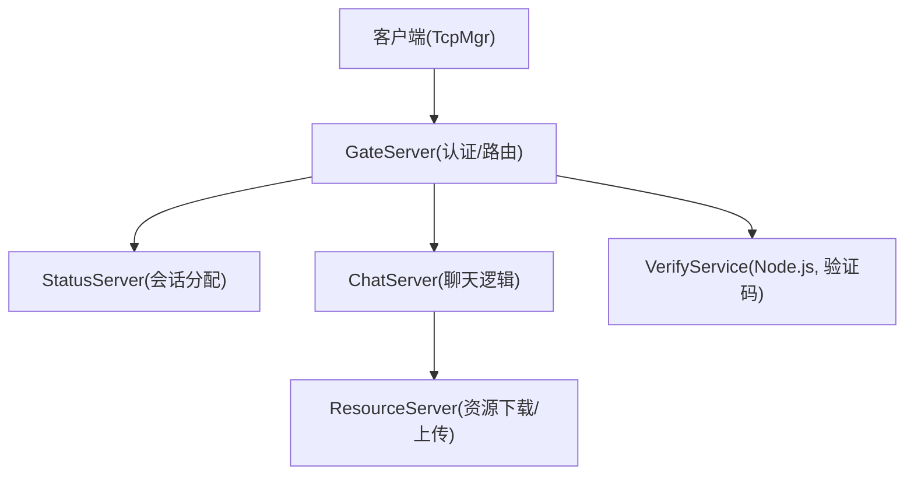

[无图表来源：该图为概念性架构示意]

**章节来源**
- [tcpmgr.h:1-90](file://client/llfcchat/include/tcpmgr.h#L1-L90)
- [CSession.h:1-86](file://server/ChatServer/include/CSession.h#L1-L86)
- [const.h:1-104](file://server/ChatServer/include/const.h#L1-L104)

## 核心组件
- 客户端 TCP 管理器 TcpMgr：负责连接管理、粘包处理、发送队列、消息路由与信号分发。
- 服务器端会话 CSession：基于 Boost.Asio 的非阻塞 I/O，解析固定长度头部，读取变长载荷，投递到逻辑层。
- 消息节点 MsgNode/RecvNode/SendNode：封装收发缓冲与消息类型。
- 全局常量与枚举：ReqId、MSG_TYPES、ErrorCodes、ChatMsgType 等。
- Proto 消息定义：用于服务间 RPC 的结构化数据。

**章节来源**
- [tcpmgr.cpp:1-1094](file://client/llfcchat/src/tcpmgr.cpp#L1-L1094)
- [CSession.cpp:1-200](file://server/ChatServer/src/CSession.cpp#L1-L200)
- [MsgNode.h:1-48](file://server/ChatServer/include/MsgNode.h#L1-L48)
- [global.h:1-296](file://client/llfcchat/include/global.h#L1-L296)
- [const.h:1-104](file://server/ChatServer/include/const.h#L1-L104)

## 架构总览
TCP 帧格式（客户端与服务器一致）：
- 头部：2 字节消息类型 + 2 字节载荷长度（网络字节序，大端）
- 载荷：JSON 字符串（UTF-8），包含业务字段与 error 字段
- 校验：服务端对 msg_type/msg_len 进行合法性检查；载荷通过 JSON 解析与 error 字段判断成功与否

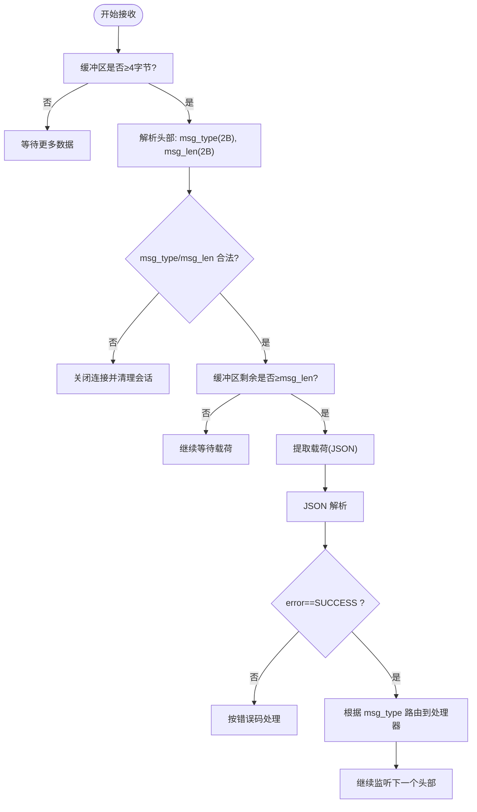

**图表来源**
- [CSession.cpp:130-191](file://server/ChatServer/src/CSession.cpp#L130-L191)
- [tcpmgr.cpp:18-55](file://client/llfcchat/src/tcpmgr.cpp#L18-L55)
- [const.h:38-44](file://server/ChatServer/include/const.h#L38-L44)

**章节来源**
- [CSession.cpp:130-191](file://server/ChatServer/src/CSession.cpp#L130-L191)
- [tcpmgr.cpp:18-55](file://client/llfcchat/src/tcpmgr.cpp#L18-L55)
- [const.h:38-44](file://server/ChatServer/include/const.h#L38-L44)

## 详细组件分析

### TCP 帧与编解码
- 帧头：2 字节 ID + 2 字节长度（BigEndian）
- 载荷：JSON 文本，统一包含 error 字段；业务字段随消息类型变化
- 客户端发送：组装 block = id(2B) + len(2B) + json_bytes；写入 socket；bytesWritten 回调驱动队列
- 客户端接收：readyRead 累积到 _buffer；循环解析头部与载荷；handleMsg 分派到处理器
- 服务器接收：AsyncReadHead 读 4 字节；校验后 AsyncReadBody 读载荷；更新心跳并投递 LogicSystem

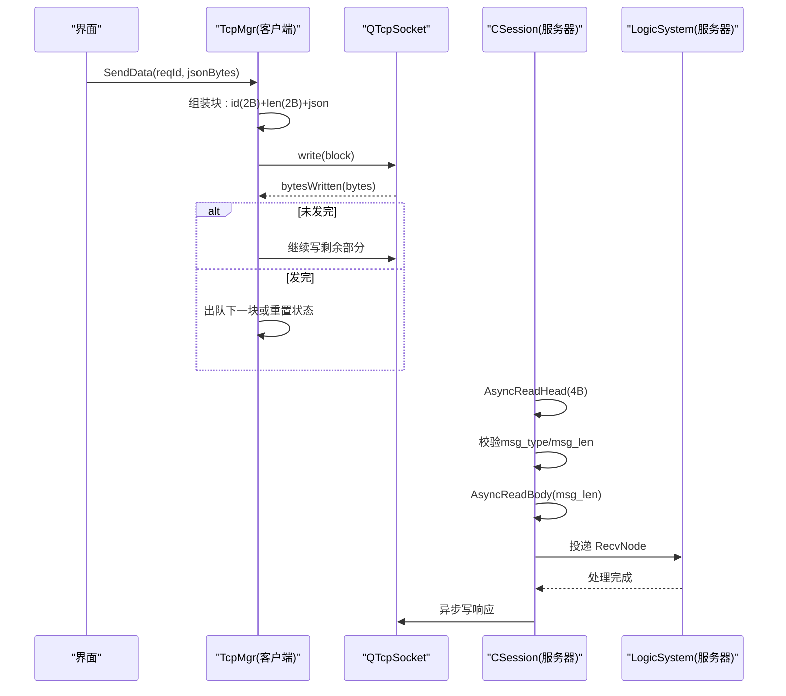

**图表来源**
- [tcpmgr.cpp:1044-1079](file://client/llfcchat/src/tcpmgr.cpp#L1044-L1079)
- [tcpmgr.cpp:18-55](file://client/llfcchat/src/tcpmgr.cpp#L18-L55)
- [CSession.cpp:130-191](file://server/ChatServer/src/CSession.cpp#L130-L191)

**章节来源**
- [tcpmgr.cpp:1044-1079](file://client/llfcchat/src/tcpmgr.cpp#L1044-L1079)
- [tcpmgr.cpp:18-55](file://client/llfcchat/src/tcpmgr.cpp#L18-L55)
- [CSession.cpp:130-191](file://server/ChatServer/src/CSession.cpp#L130-L191)

### 消息类型与载荷定义
- 文本消息
  - 请求/回复：TextChatMsgReq / TextChatMsgRsp（含 fromuid、touid、thread_id、textmsgs[]）
  - 通知：NotifyTextChatMsgReq（推送新文本消息）
- 图片消息
  - 通知：NotifyChatImgReq（from_uid、to_uid、message_id、file_name、total_size、thread_id）
  - 回复：NotifyChatImgRsp
- 好友申请与认证
  - AddFriendReq / AddFriendRsp
  - AuthFriendReq / AuthFriendRsp（含 textmsgs[]）
- 系统通知
  - KickUserReq/Rsp（踢人）
  - 下线通知、心跳等由 ReqId 映射

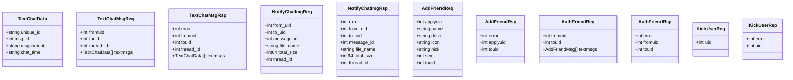

**图表来源**
- [chat.proto:1-105](file://proto/chat_service/chat.proto#L1-L105)

**章节来源**
- [chat.proto:1-105](file://proto/chat_service/chat.proto#L1-L105)

### 消息路由与处理器
- 客户端通过 _handlers 映射 ReqId 到 lambda 处理器，统一入口 handleMsg(id,len,data)
- 典型处理器：登录响应、搜索用户、好友申请通知、认证通知、文本消息通知/回复、图片消息通知/回复、离线通知、心跳、加载聊天线程/消息等
- 处理器内部将 JSON 解析为业务对象并通过 Qt 信号发送到 UI

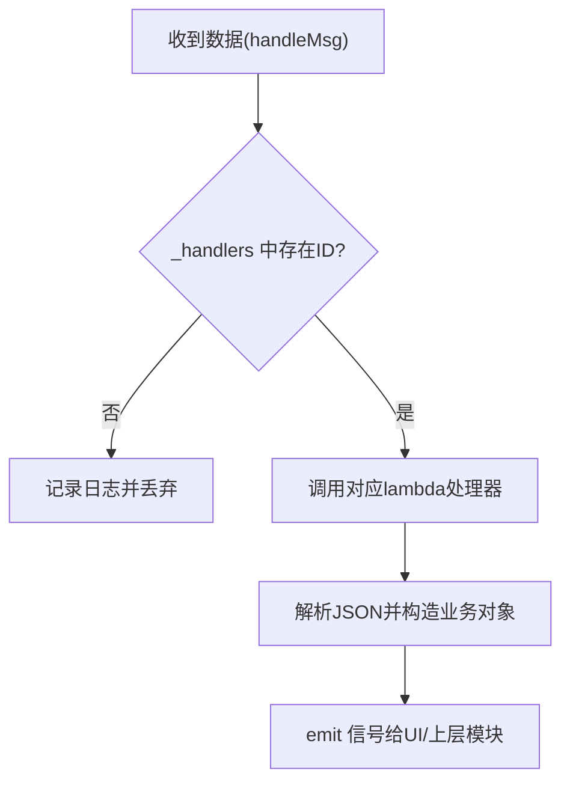

**图表来源**
- [tcpmgr.cpp:1019-1028](file://client/llfcchat/src/tcpmgr.cpp#L1019-L1028)
- [tcpmgr.cpp:182-986](file://client/llfcchat/src/tcpmgr.cpp#L182-L986)

**章节来源**
- [tcpmgr.cpp:182-986](file://client/llfcchat/src/tcpmgr.cpp#L182-L986)
- [tcpmgr.cpp:1019-1028](file://client/llfcchat/src/tcpmgr.cpp#L1019-L1028)

### 线程ID管理与会话状态
- thread_id：用于区分私聊/群聊会话，贯穿文本与图片消息
- 客户端维护会话列表与消息分页（load_more、next_last_id）
- 服务器端 CSession 维护 session_id、用户UID、心跳时间戳，异常时清理会话

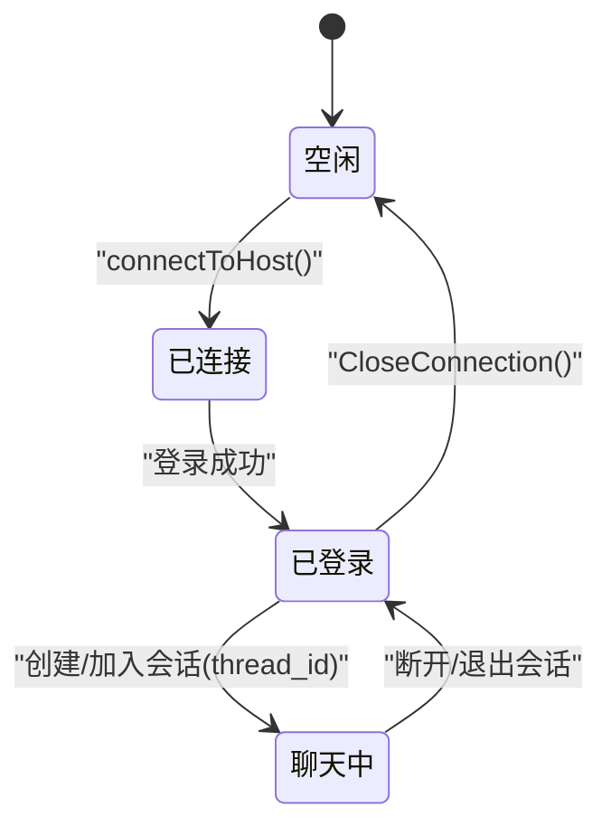

**图表来源**
- [tcpmgr.cpp:1034-1042](file://client/llfcchat/src/tcpmgr.cpp#L1034-L1042)
- [CSession.cpp:10-16](file://server/ChatServer/src/CSession.cpp#L10-L16)

**章节来源**
- [tcpmgr.cpp:1034-1042](file://client/llfcchat/src/tcpmgr.cpp#L1034-L1042)
- [CSession.cpp:10-16](file://server/ChatServer/src/CSession.cpp#L10-L16)

### 粘包处理与发送队列
- 客户端：readyRead 累积到 _buffer，循环解析头部与载荷；bytesWritten 驱动 _send_queue 顺序发送
- 服务器：AsyncReadHead/AsyncReadBody 确保完整读取后再处理；发送走 _send_que 队列与互斥锁保护

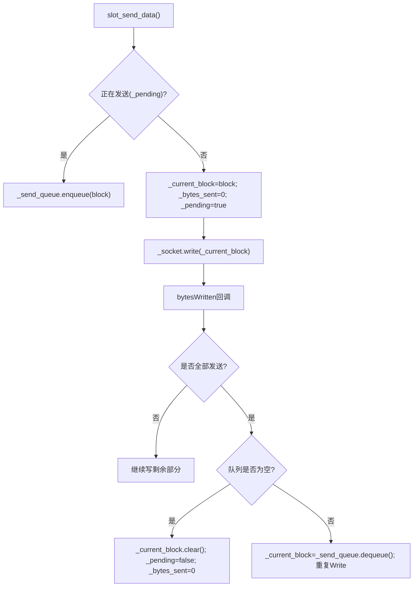

**图表来源**
- [tcpmgr.cpp:1044-1079](file://client/llfcchat/src/tcpmgr.cpp#L1044-L1079)
- [CSession.cpp:43-75](file://server/ChatServer/src/CSession.cpp#L43-L75)

**章节来源**
- [tcpmgr.cpp:1044-1079](file://client/llfcchat/src/tcpmgr.cpp#L1044-L1079)
- [CSession.cpp:43-75](file://server/ChatServer/src/CSession.cpp#L43-L75)

### 断线重连与心跳
- 客户端：error/disconnected 信号触发状态上报与重连策略（由上层控制）
- 服务器：CSession 维护 _last_heartbeat，IsHeartbeatExpired 检测超时；DealExceptionSession 清理异常会话

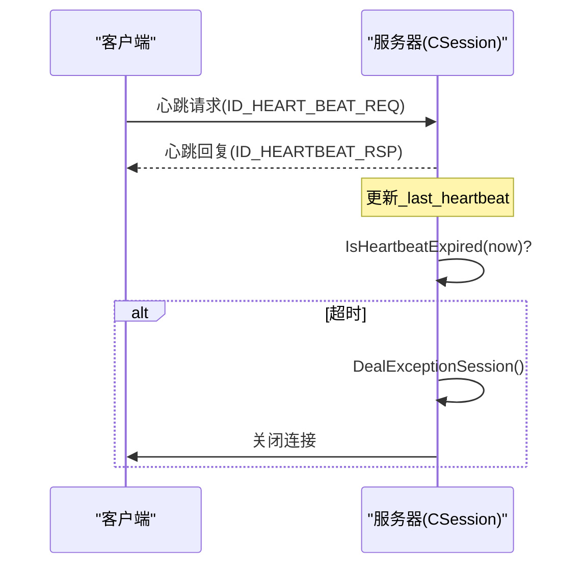

**图表来源**
- [CSession.h:46-51](file://server/ChatServer/include/CSession.h#L46-L51)
- [CSession.cpp:117-122](file://server/ChatServer/src/CSession.cpp#L117-L122)

**章节来源**
- [CSession.h:46-51](file://server/ChatServer/include/CSession.h#L46-L51)
- [CSession.cpp:117-122](file://server/ChatServer/src/CSession.cpp#L117-L122)

### 图片消息与资源传输
- 通知：NotifyChatImgReq 告知接收方图片元信息（文件名、大小、thread_id）
- 下载：客户端发起 ID_IMG_CHAT_DOWN_REQ，ResourceServer 返回分片数据（seq、trans_size、total_size、md5、data base64）
- 上传：客户端分片上传，携带 token、uid、sender/receiver、message_id 等

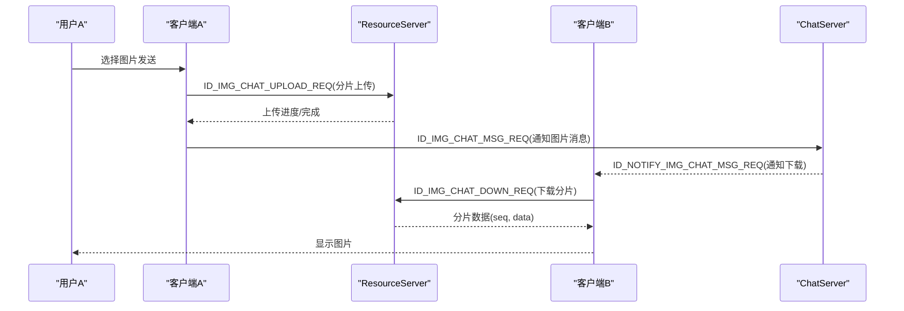

**图表来源**
- [chat.proto:86-104](file://proto/chat_service/chat.proto#L86-L104)
- [tcpmgr.cpp:912-985](file://client/llfcchat/src/tcpmgr.cpp#L912-L985)
- [tcpmgr.cpp:800-909](file://client/llfcchat/src/tcpmgr.cpp#L800-L909)

**章节来源**
- [chat.proto:86-104](file://proto/chat_service/chat.proto#L86-L104)
- [tcpmgr.cpp:912-985](file://client/llfcchat/src/tcpmgr.cpp#L912-L985)
- [tcpmgr.cpp:800-909](file://client/llfcchat/src/tcpmgr.cpp#L800-L909)

### 消息确认机制
- 图片上传：客户端维护 _flighting_seqs（待确认序列集合）、_last_confirmed_seq（最后确认序列），收到服务器确认后移除
- 下载：客户端维护 _rsp_seqs（已确认序列集合），避免重复下载
- 失败重传：基于 seq 与 last 标志位，结合超时策略（由上层实现）

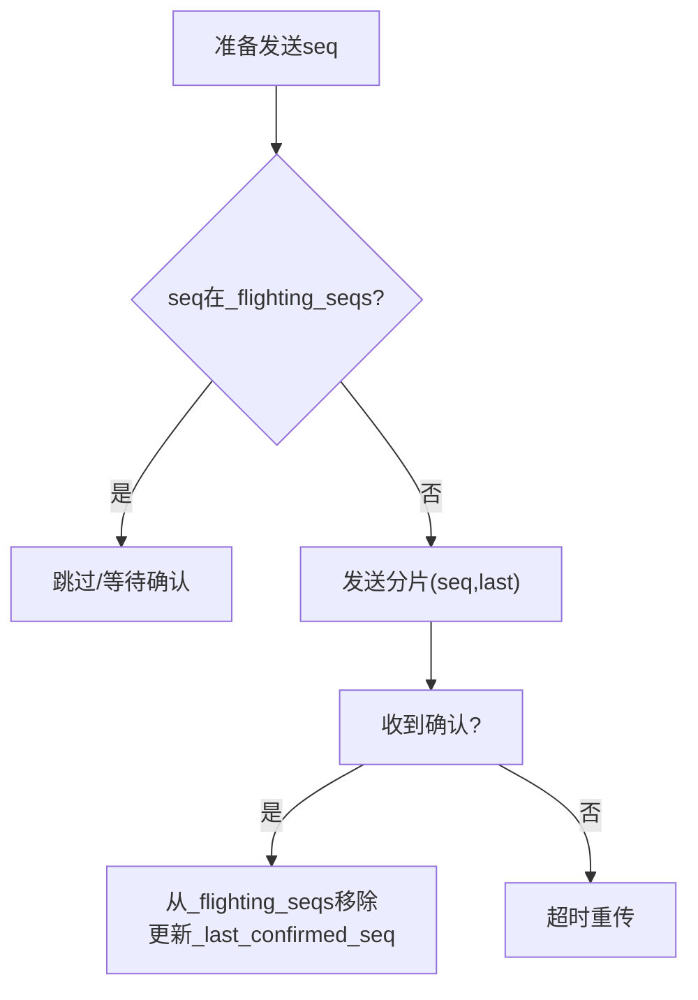

**图表来源**
- [global.h:167-200](file://client/llfcchat/include/global.h#L167-L200)

**章节来源**
- [global.h:167-200](file://client/llfcchat/include/global.h#L167-L200)

## 依赖分析
- 客户端依赖 Qt 网络与 JSON 库，使用 QDataStream 设置 BigEndian 字节序
- 服务器依赖 Boost.Asio 与 gRPC（服务间通信），使用自定义二进制帧
- 全局枚举 ReqId 与 MSG_TYPES 保持两端一致，保证路由正确

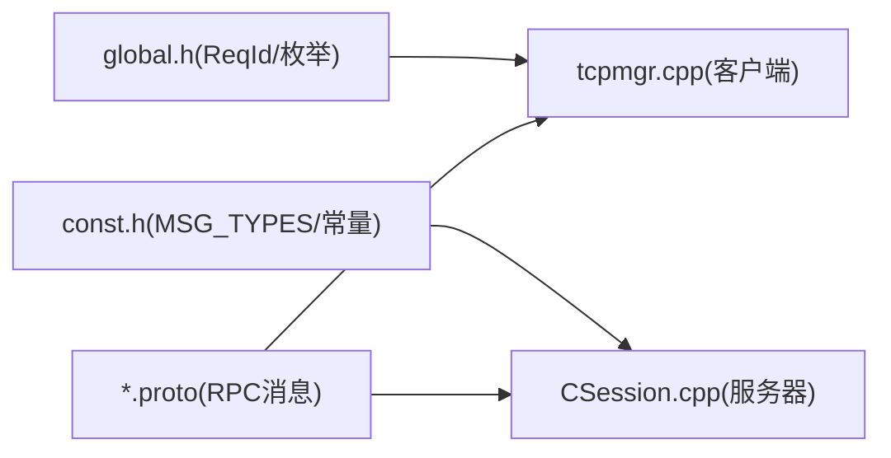

**图表来源**
- [global.h:43-88](file://client/llfcchat/include/global.h#L43-L88)
- [const.h:49-79](file://server/ChatServer/include/const.h#L49-L79)
- [chat.proto:1-105](file://proto/chat_service/chat.proto#L1-L105)

**章节来源**
- [global.h:43-88](file://client/llfcchat/include/global.h#L43-L88)
- [const.h:49-79](file://server/ChatServer/include/const.h#L49-L79)
- [chat.proto:1-105](file://proto/chat_service/chat.proto#L1-L105)

## 性能考虑
- 粘包处理：循环解析头部与载荷，避免多次内存拷贝；服务器使用固定缓冲与复用节点
- 发送队列：客户端与服务端均使用队列与互斥锁，防止并发写冲突
- 心跳：定期更新 _last_heartbeat，及时清理僵尸连接
- 分片传输：图片/文件分片上传下载，降低单次内存占用与网络拥塞

[本节为通用指导，不直接分析具体文件]

## 故障排查指南
- 常见错误码：ErrorCodes::ERR_JSON、ERR_NETWORK 等；服务端 Error_Json、RPCFailed、TokenInvalid 等
- 调试建议：
  - 打印帧头与载荷长度，确认字节序与大端一致性
  - 检查 JSON 是否包含 error 字段且值为 SUCCESS
  - 观察 bytesWritten 回调与 _send_queue 状态，定位发送卡住
  - 查看服务器 AsyncReadHead/AsyncReadBody 的错误码与长度匹配情况
- 常见问题：
  - 粘包导致解析错位：确保循环解析直到缓冲区不足
  - 心跳超时被踢：检查客户端心跳周期与服务器阈值
  - 图片下载失败：核对 seq、trans_size、total_size、md5 一致性

**章节来源**
- [global.h:91-95](file://client/llfcchat/include/global.h#L91-L95)
- [const.h:5-20](file://server/ChatServer/include/const.h#L5-L20)
- [tcpmgr.cpp:18-55](file://client/llfcchat/src/tcpmgr.cpp#L18-L55)
- [CSession.cpp:130-191](file://server/ChatServer/src/CSession.cpp#L130-L191)

## 结论
LLFCChat 的 TCP 协议以“固定长度头部 + JSON 载荷”为核心，配合严格的字节序与长度校验，实现了稳定可靠的即时通信。通过 ReqId 路由、thread_id 会话隔离、心跳与分片传输，满足了聊天、好友关系与资源传输的业务需求。建议在后续迭代中完善统一的错误码体系与更完善的确认/重传策略。

[本节为总结，不直接分析具体文件]

## 附录

### 协议字段速查
- 文本消息：fromuid、touid、thread_id、textmsgs[]（unique_id、msg_id、msgcontent、chat_time）
- 图片消息：from_uid、to_uid、message_id、file_name、total_size、thread_id
- 好友申请：applyuid、name、desc、icon、nick、sex、touid
- 认证：fromuid、touid、textmsgs[]（AddFriendMsg）
- 系统通知：uid（踢人）、token（登录/鉴权）

**章节来源**
- [chat.proto:1-105](file://proto/chat_service/chat.proto#L1-L105)

### 调试工具使用方法
- 客户端：启用 qDebug 输出，观察 readyRead 与 bytesWritten 日志；检查 _buffer 与 _send_queue 状态
- 服务器：查看 CSession 的日志输出（msg_type、msg_len、read length not match）；监控 _send_que 与 _recv_msg_node
- 抓包：使用 Wireshark 捕获 TCP 流，验证帧头与 JSON 载荷

**章节来源**
- [tcpmgr.cpp:18-55](file://client/llfcchat/src/tcpmgr.cpp#L18-L55)
- [CSession.cpp:130-191](file://server/ChatServer/src/CSession.cpp#L130-L191)