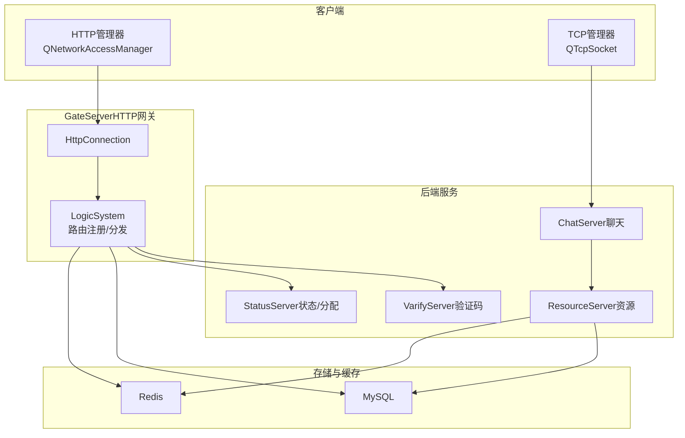
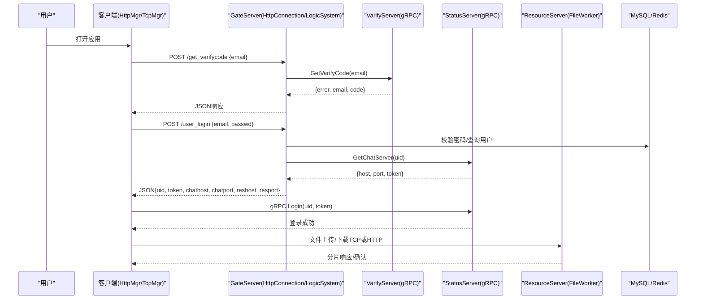
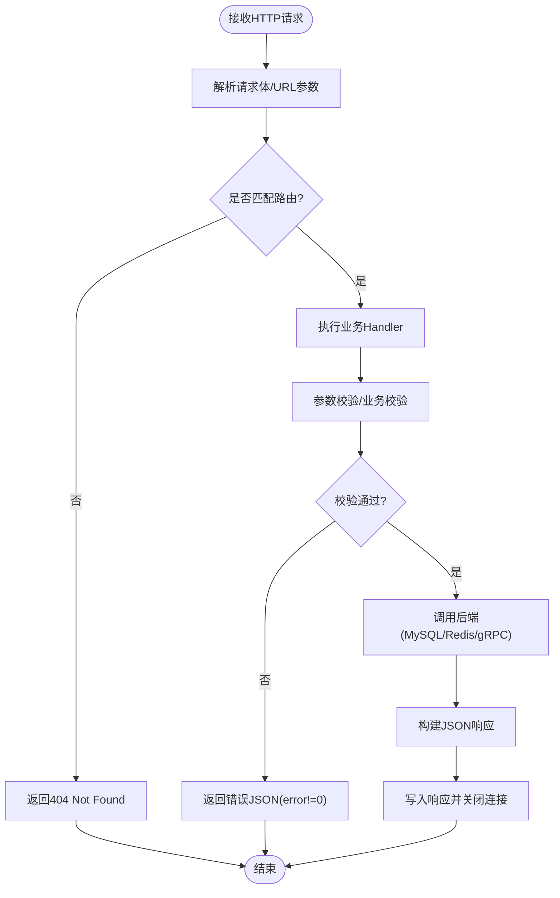
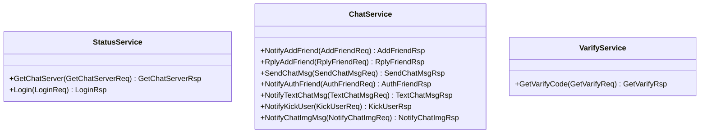
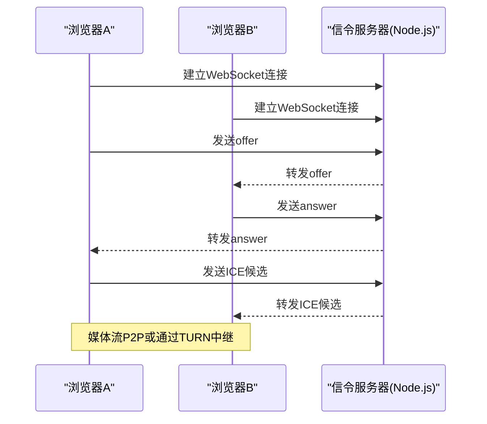
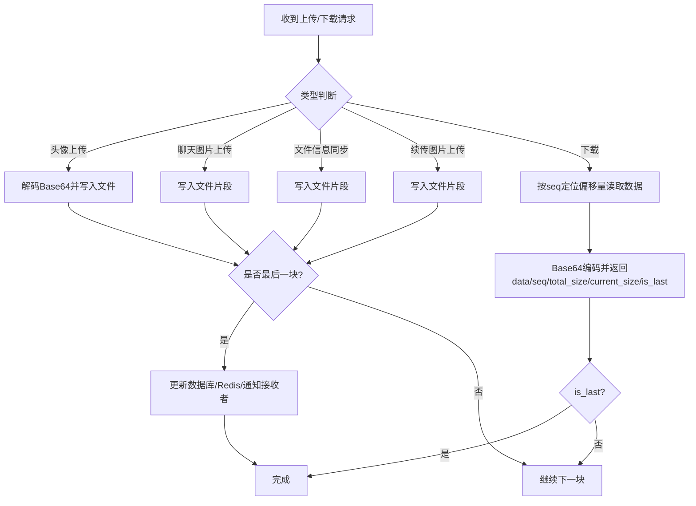
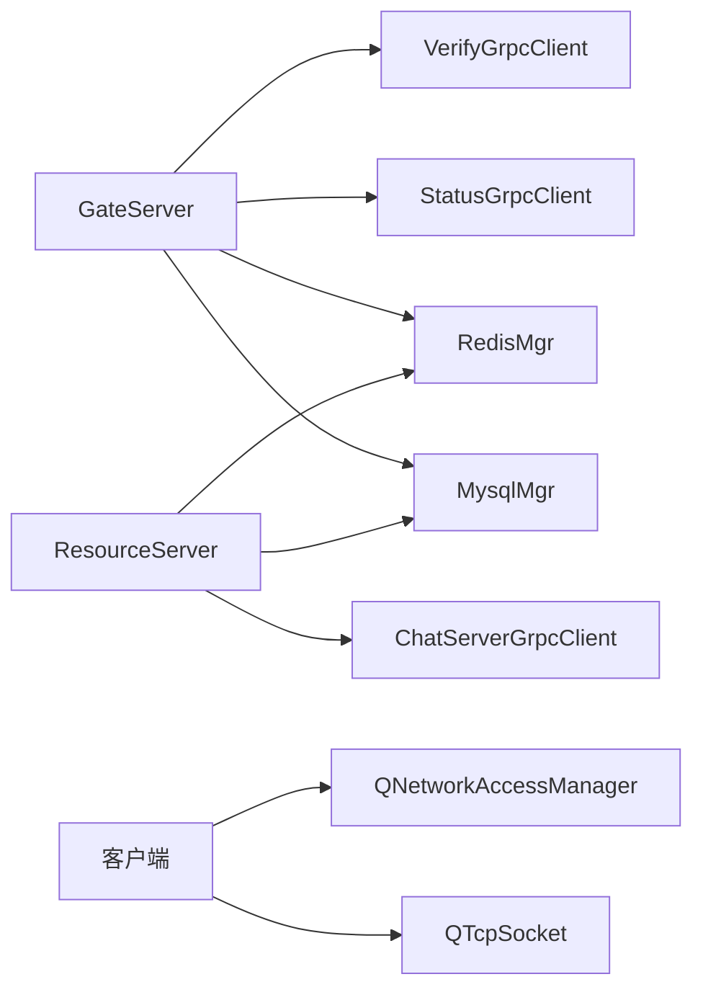

# API参考文档

<cite>
**本文引用的文件**
- [README.md](file://README.md)
- [message.proto（聊天）](file://server/proto/chat/message.proto)
- [message.proto（控制）](file://server/proto/control/message.proto)
- [message.proto（资源）](file://server/proto/resource/message.proto)
- [HttpConnection.h](file://server/GateServer/include/HttpConnection.h)
- [HttpConnection.cpp](file://server/GateServer/src/HttpConnection.cpp)
- [LogicSystem.h](file://server/GateServer/include/LogicSystem.h)
- [LogicSystem.cpp](file://server/GateServer/src/LogicSystem.cpp)
- [httpmgr.h](file://client/llfcchat/include/httpmgr.h)
- [tcpmgr.h](file://client/llfcchat/include/tcpmgr.h)
- [FileWorker.h](file://server/ResourceServer/include/FileWorker.h)
- [FileWorker.cpp](file://server/ResourceServer/src/FileWorker.cpp)
- [day40-聊天图片资源续传和进度显示.md](file://开发文档/day40-聊天图片资源续传和进度显示.md)
- [day41-通知客户端异步下载聊天图片.md](file://开发文档/day41-通知客户端异步下载聊天图片.md)
- [day44-webrtc信令服务器实现.md](file://开发文档/day44-webrtc信令服务器实现.md)
</cite>

## 目录
1. [简介](#简介)
2. [项目结构](#项目结构)
3. [核心组件](#核心组件)
4. [架构总览](#架构总览)
5. [详细组件分析](#详细组件分析)
6. [依赖关系分析](#依赖关系分析)
7. [性能与可靠性](#性能与可靠性)
8. [故障排查指南](#故障排查指南)
9. [结论](#结论)
10. [附录：接口规范与示例](#附录接口规范与示例)

## 简介
本API参考文档面向LLFCChat项目的HTTP、gRPC、WebSocket与文件传输接口，覆盖RESTful设计、请求响应格式、错误码约定、认证方式、Protobuf消息定义与服务方法签名、参数校验与返回格式、实时通信协议、文件上传/下载/断点续传等。同时提供客户端实现要点、版本管理与向后兼容性建议，以及接口文档自动生成的最佳实践。

## 项目结构
- GateServer：HTTP网关，负责路由分发、JSON解析、调用后端服务（验证码、状态、MySQL、Redis）。
- ChatServer/StatusServer/ResourceServer：分别处理聊天会话、状态分配与资源文件读写。
- Client（Qt）：封装HTTP与TCP通信，管理登录、聊天、好友申请、文件传输等。
- Protobuf定义：统一消息契约，位于server/proto下。

图表来源
- [HttpConnection.cpp:1-225](file://server/GateServer/src/HttpConnection.cpp#L1-L225)
- [LogicSystem.cpp:1-477](file://server/GateServer/src/LogicSystem.cpp#L1-L477)
- [message.proto（聊天）:1-167](file://server/proto/chat/message.proto#L1-L167)
- [message.proto（资源）:1-169](file://server/proto/resource/message.proto#L1-L169)

章节来源
- [README.md:1-112](file://README.md#L1-L112)

## 核心组件
- HTTP网关（GateServer）
  - HttpConnection：基于Boost.Beast的HTTP连接封装，负责读取请求、解析GET参数、设置响应头、超时控制与写入响应。
  - LogicSystem：单例路由系统，维护GET/POST处理器映射，将请求分发到具体业务逻辑。
- gRPC服务
  - StatusService：获取ChatServer地址与token、用户登录校验。
  - ChatService：好友申请、回复、文本消息、踢人、图片通知等。
  - VarifyService：验证码获取。
- 文件传输（ResourceServer）
  - FileWorker/DownloadWorker：队列化任务执行，支持头像上传、聊天图片上传、信息同步、断点续传下载。
- 客户端通信
  - HttpMgr：Qt HTTP请求封装，统一Post请求与回调信号。
  - TcpMgr：Qt TCP连接与消息收发，处理粘包、注册处理器、事件信号。

章节来源
- [HttpConnection.h:1-36](file://server/GateServer/include/HttpConnection.h#L1-L36)
- [HttpConnection.cpp:1-225](file://server/GateServer/src/HttpConnection.cpp#L1-L225)
- [LogicSystem.h:1-24](file://server/GateServer/include/LogicSystem.h#L1-L24)
- [LogicSystem.cpp:1-477](file://server/GateServer/src/LogicSystem.cpp#L1-L477)
- [message.proto（聊天）:1-167](file://server/proto/chat/message.proto#L1-L167)
- [message.proto（控制）:1-143](file://server/proto/control/message.proto#L1-L143)
- [message.proto（资源）:1-169](file://server/proto/resource/message.proto#L1-L169)
- [FileWorker.h:1-90](file://server/ResourceServer/include/FileWorker.h#L1-L90)
- [FileWorker.cpp:1-663](file://server/ResourceServer/src/FileWorker.cpp#L1-L663)
- [httpmgr.h:1-34](file://client/llfcchat/include/httpmgr.h#L1-L34)
- [tcpmgr.h:1-90](file://client/llfcchat/include/tcpmgr.h#L1-L90)

## 架构总览
整体采用微服务+网关模式：
- 客户端通过HTTP访问GateServer进行鉴权、注册、密码重置、获取验证码；登录后由GateServer返回ChatServer与ResourceServer的连接信息。
- 客户端建立TCP长连接到ChatServer进行聊天、好友申请、消息推送、图片通知等。
- ResourceServer负责文件落盘、分片读取、断点续传，并通过Redis记录进度。
- StatusServer负责负载均衡分配ChatServer实例并生成token。

图表来源
- [LogicSystem.cpp:107-405](file://server/GateServer/src/LogicSystem.cpp#L107-L405)
- [message.proto（控制）:19-44](file://server/proto/control/message.proto#L19-L44)
- [message.proto（聊天）:138-166](file://server/proto/chat/message.proto#L138-L166)
- [FileWorker.cpp:528-663](file://server/ResourceServer/src/FileWorker.cpp#L528-L663)

## 详细组件分析

### HTTP REST接口（GateServer）
- 路由机制
  - GET/POST处理器在LogicSystem中注册，HandleGet/HandlePost根据路径分发。
  - 未匹配路由返回404。
- 典型接口
  - GET /get_test：回显GET参数，用于调试。
  - POST /test_procedure：测试MySQL存储过程调用。
  - POST /get_varifycode：发送邮箱验证码（调用VarifyServer，验证码存入Redis）。
  - POST /user_register：注册（校验两次密码一致、验证码有效性、用户名/邮箱唯一性）。
  - POST /reset_pwd：重置密码（验证码校验、用户名邮箱匹配、更新数据库）。
  - POST /user_login：登录（校验密码、分配ChatServer、返回连接信息与ResourceServer地址）。
- 请求/响应格式
  - Content-Type: text/json
  - 统一字段error表示错误码；成功时error=0。
- 错误码约定（示例）
  - Error_Json：JSON解析失败
  - PasswdErr：密码不一致
  - VarifyExpired：验证码过期
  - VarifyCodeErr：验证码错误
  - UserExist：用户已存在
  - EmailNotMatch：邮箱不匹配
  - PasswdUpFailed：密码更新失败
  - PasswdInvalid：密码无效
  - RPCFailed：gRPC调用失败
- 跨域与安全
  - 允许所有来源（生产环境应限制具体来源）。
  - 短连接模式，默认keep_alive=false。

图表来源
- [HttpConnection.cpp:132-194](file://server/GateServer/src/HttpConnection.cpp#L132-L194)
- [LogicSystem.cpp:448-477](file://server/GateServer/src/LogicSystem.cpp#L448-L477)

章节来源
- [HttpConnection.cpp:1-225](file://server/GateServer/src/HttpConnection.cpp#L1-L225)
- [LogicSystem.cpp:1-477](file://server/GateServer/src/LogicSystem.cpp#L1-L477)

### gRPC服务接口
- StatusService
  - GetChatServer(GetChatServerReq) -> GetChatServerRsp：按uid分配ChatServer地址与token。
  - Login(LoginReq) -> LoginRsp：登录校验，返回uid与token。
- ChatService
  - NotifyAddFriend/AddFriendReq -> AddFriendRsp：发起好友申请。
  - RplyAddFriend/RplyFriendReq -> RplyFriendRsp：回复好友申请。
  - SendChatMsg/SendChatMsgReq -> SendChatMsgRsp：发送聊天消息。
  - NotifyAuthFriend/AuthFriendReq -> AuthFriendRsp：认证消息通知。
  - NotifyTextChatMsg/TextChatMsgReq -> TextChatMsgRsp：文本消息推送。
  - NotifyKickUser/KickUserReq -> KickUserRsp：踢人通知。
  - NotifyChatImgMsg/NotifyChatImgReq -> NotifyChatImgRsp：聊天图片通知。
- VarifyService
  - GetVarifyCode(GetVarifyReq) -> GetVarifyRsp：获取验证码。

图表来源
- [message.proto（控制）:1-143](file://server/proto/control/message.proto#L1-L143)
- [message.proto（聊天）:1-167](file://server/proto/chat/message.proto#L1-L167)
- [message.proto（资源）:1-169](file://server/proto/resource/message.proto#L1-L169)

章节来源
- [message.proto（控制）:1-143](file://server/proto/control/message.proto#L1-L143)
- [message.proto（聊天）:1-167](file://server/proto/chat/message.proto#L1-L167)
- [message.proto（资源）:1-169](file://server/proto/resource/message.proto#L1-L169)

### WebSocket实时通信（WebRTC信令）
- 用途：浏览器端视频通话的信令交换（offer/answer/ice），不参与媒体流。
- 技术栈：Node.js + Express + ws，复用HTTP端口。
- 职责：房间管理、消息转发。
- 注意：本项目中的桌面客户端主要使用TCP进行聊天与文件传输；WebRTC信令服务于浏览器场景。

图表来源
- [day44-webrtc信令服务器实现.md:1-86](file://开发文档/day44-webrtc信令服务器实现.md#L1-L86)

章节来源
- [day44-webrtc信令服务器实现.md:1-86](file://开发文档/day44-webrtc信令服务器实现.md#L1-L86)

### 文件传输API（ResourceServer）
- 上传流程
  - 头像上传：ID_UPLOAD_HEAD_ICON_REQ，Base64分片写入，最后一片更新头像并写Redis缓存。
  - 聊天图片上传：ID_IMG_CHAT_UPLOAD_REQ，完成后更新数据库状态，若接收者在线则通过gRPC通知ChatServer。
  - 文件信息同步：ID_FILE_INFO_SYNC_REQ，用于通用文件同步。
  - 续传图片上传：ID_IMG_CHAT_CONTINUE_UPLOAD_REQ，支持断点续传。
- 下载流程
  - DownloadWorker按seq分片读取文件，Base64编码后返回data/seq/total_size/current_size/is_last。
  - 首次下载记录Redis，后续续传从Redis恢复进度。
- 进度与状态
  - 客户端侧维护序列号集合（flighting_seqs/rsp_seqs）、last_confirmed_seq、rsp_size等，实时更新UI进度。
  - 完成标志：last_confirmed_seq == max_seq。

图表来源
- [FileWorker.cpp:49-456](file://server/ResourceServer/src/FileWorker.cpp#L49-L456)
- [FileWorker.cpp:528-663](file://server/ResourceServer/src/FileWorker.cpp#L528-L663)
- [day40-聊天图片资源续传和进度显示.md:552-876](file://开发文档/day40-聊天图片资源续传和进度显示.md#L552-L876)
- [day41-通知客户端异步下载聊天图片.md:571-709](file://开发文档/day41-通知客户端异步下载聊天图片.md#L571-L709)

章节来源
- [FileWorker.h:1-90](file://server/ResourceServer/include/FileWorker.h#L1-L90)
- [FileWorker.cpp:1-663](file://server/ResourceServer/src/FileWorker.cpp#L1-L663)
- [day40-聊天图片资源续传和进度显示.md:552-876](file://开发文档/day40-聊天图片资源续传和进度显示.md#L552-L876)
- [day41-通知客户端异步下载聊天图片.md:571-709](file://开发文档/day41-通知客户端异步下载聊天图片.md#L571-L709)

### 客户端HTTP与TCP管理
- HttpMgr（Qt）
  - PostHttpReq：统一POST请求封装，回调sig_http_finish携带响应与错误码。
- TcpMgr（Qt）
  - 连接ChatServer，处理粘包、注册处理器、发送队列、事件信号（登录、搜索、好友申请、聊天消息、图片消息等）。
  - 与文件传输配合，触发上传/下载流程。

章节来源
- [httpmgr.h:1-34](file://client/llfcchat/include/httpmgr.h#L1-L34)
- [tcpmgr.h:1-90](file://client/llfcchat/include/tcpmgr.h#L1-L90)

## 依赖关系分析
- GateServer依赖：
  - VerifyGrpcClient（VarifyServer）
  - StatusGrpcClient（StatusServer）
  - RedisMgr（验证码缓存）
  - MysqlMgr（用户数据）
- ResourceServer依赖：
  - ChatServerGrpcClient（通知ChatServer）
  - MysqlMgr（状态更新）
  - RedisMgr（下载进度）
- 客户端依赖：
  - QNetworkAccessManager（HTTP）
  - QTcpSocket（TCP）

图表来源
- [LogicSystem.cpp:1-477](file://server/GateServer/src/LogicSystem.cpp#L1-L477)
- [FileWorker.cpp:1-663](file://server/ResourceServer/src/FileWorker.cpp#L1-L663)

章节来源
- [LogicSystem.cpp:1-477](file://server/GateServer/src/LogicSystem.cpp#L1-L477)
- [FileWorker.cpp:1-663](file://server/ResourceServer/src/FileWorker.cpp#L1-L663)

## 性能与可靠性
- 并发模型
  - GateServer：Beast异步IO，短连接，定时器保护空闲连接。
  - ResourceServer：线程池+队列（FileWorker/DownloadWorker），避免阻塞主循环。
- 缓存策略
  - Redis缓存验证码、用户信息、下载进度，降低DB压力。
- 错误处理
  - 统一error字段，区分JSON解析、权限、网络、数据库、gRPC错误。
- 可扩展性
  - 路由注册机制便于新增接口；gRPC服务解耦，便于水平扩展。

[本节为通用指导，无需引用具体文件]

## 故障排查指南
- HTTP 404：检查LogicSystem路由是否注册，确认请求方法与路径正确。
- JSON解析失败：检查Content-Type与请求体格式，确保必要字段存在。
- 验证码相关错误：确认Redis键是否存在且未过期，核对验证码值。
- 登录失败：检查MySQL密码校验与StatusServer分配结果。
- 文件上传失败：检查目录权限、Base64解码、写入权限、last标志位。
- 下载断点续传失败：检查Redis中下载进度是否有效、seq是否匹配。

章节来源
- [HttpConnection.cpp:132-194](file://server/GateServer/src/HttpConnection.cpp#L132-L194)
- [LogicSystem.cpp:107-405](file://server/GateServer/src/LogicSystem.cpp#L107-L405)
- [FileWorker.cpp:528-663](file://server/ResourceServer/src/FileWorker.cpp#L528-L663)

## 结论
LLFCChat采用清晰的微服务架构与统一的Protobuf契约，GateServer作为HTTP入口提供稳定可靠的REST接口；Chat/Status/Resource服务各司其职，结合Redis与MySQL实现高效的数据与状态管理；客户端通过Qt的HTTP与TCP模块完成交互。文件传输支持断点续传与进度反馈，满足大文件场景。建议在后续迭代中完善错误码体系、增加限流与审计、引入OpenAPI自动生成文档以提升可维护性。

[本节为总结，无需引用具体文件]

## 附录：接口规范与示例

### HTTP REST接口规范
- 通用响应结构
  - error：整数错误码，0表示成功
  - 其他字段依具体接口而定
- 常见错误码
  - Error_Json、PasswdErr、VarifyExpired、VarifyCodeErr、UserExist、EmailNotMatch、PasswdUpFailed、PasswdInvalid、RPCFailed
- 示例接口
  - POST /get_varifycode
    - 请求体：{"email":"..."}
    - 响应体：{"error":0,"email":"..."}
  - POST /user_register
    - 请求体：{"email":"...","user":"...","passwd":"...","confirm":"...","icon":"...","varifycode":"..."}
    - 响应体：{"error":0,"uid":...,...}
  - POST /reset_pwd
    - 请求体：{"email":"...","user":"...","passwd":"...","varifycode":"..."}
    - 响应体：{"error":0,...}
  - POST /user_login
    - 请求体：{"email":"...","passwd":"..."}
    - 响应体：{"error":0,"uid":...,"token":"...","chathost":"...","chatport":"...","reshost":"...","resport":"..."}

章节来源
- [LogicSystem.cpp:107-405](file://server/GateServer/src/LogicSystem.cpp#L107-L405)

### gRPC接口规范
- StatusService
  - GetChatServer：输入uid，返回host/port/token
  - Login：输入uid/token，返回error/uid/token
- ChatService
  - 好友申请/回复、文本消息、图片通知、踢人等
- VarifyService
  - GetVarifyCode：输入email，返回error/email/code

章节来源
- [message.proto（控制）:1-143](file://server/proto/control/message.proto#L1-L143)
- [message.proto（聊天）:1-167](file://server/proto/chat/message.proto#L1-L167)
- [message.proto（资源）:1-169](file://server/proto/resource/message.proto#L1-L169)

### WebSocket实时通信规范（WebRTC信令）
- 连接建立：浏览器与信令服务器建立ws连接
- 消息类型：offer/answer/ice候选
- 职责：房间管理与消息转发，不参与媒体流

章节来源
- [day44-webrtc信令服务器实现.md:1-86](file://开发文档/day44-webrtc信令服务器实现.md#L1-L86)

### 文件传输API规范
- 上传消息ID
  - ID_UPLOAD_HEAD_ICON_REQ：头像上传
  - ID_IMG_CHAT_UPLOAD_REQ：聊天图片上传
  - ID_FILE_INFO_SYNC_REQ：文件信息同步
  - ID_IMG_CHAT_CONTINUE_UPLOAD_REQ：续传图片上传
- 下载流程
  - seq分片读取，Base64编码返回data/seq/total_size/current_size/is_last
  - Redis记录下载进度，支持断点续传

章节来源
- [FileWorker.cpp:49-456](file://server/ResourceServer/src/FileWorker.cpp#L49-L456)
- [FileWorker.cpp:528-663](file://server/ResourceServer/src/FileWorker.cpp#L528-L663)
- [day40-聊天图片资源续传和进度显示.md:552-876](file://开发文档/day40-聊天图片资源续传和进度显示.md#L552-L876)
- [day41-通知客户端异步下载聊天图片.md:571-709](file://开发文档/day41-通知客户端异步下载聊天图片.md#L571-L709)

### 客户端实现指南
- HTTP请求构造
  - 使用HttpMgr.PostHttpReq统一封装，监听sig_http_finish处理响应与错误码
- TCP连接与消息
  - 使用TcpMgr连接ChatServer，注册处理器处理各类消息（登录、搜索、好友申请、聊天消息、图片消息）
- 错误处理与重试
  - 对网络异常与业务错误码进行重试与提示
  - 文件传输中根据is_last与seq推进进度，失败时重发对应seq

章节来源
- [httpmgr.h:1-34](file://client/llfcchat/include/httpmgr.h#L1-L34)
- [tcpmgr.h:1-90](file://client/llfcchat/include/tcpmgr.h#L1-L90)

### API治理最佳实践
- 版本管理
  - URL前缀或Header中声明版本（如/v1/），保持向后兼容
- 向后兼容
  - 新增字段可选，旧客户端忽略未知字段
- 文档自动生成
  - 基于Protobuf生成gRPC文档；HTTP接口可通过OpenAPI描述生成Swagger文档
- 安全与合规
  - 限制CORS来源、启用HTTPS、敏感字段加密、速率限制与审计日志

[本节为通用指导，无需引用具体文件]