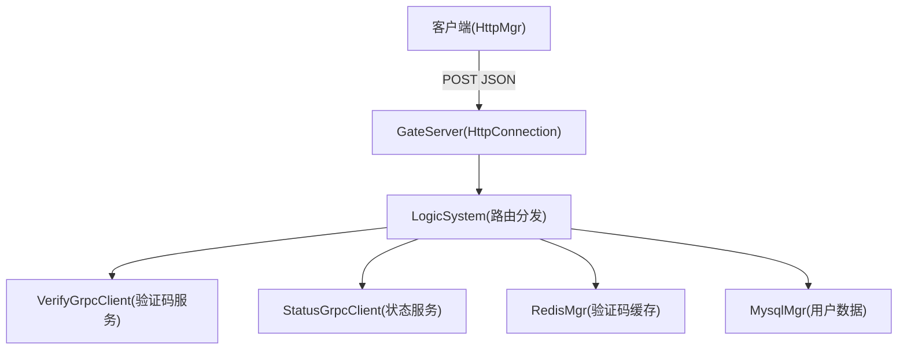
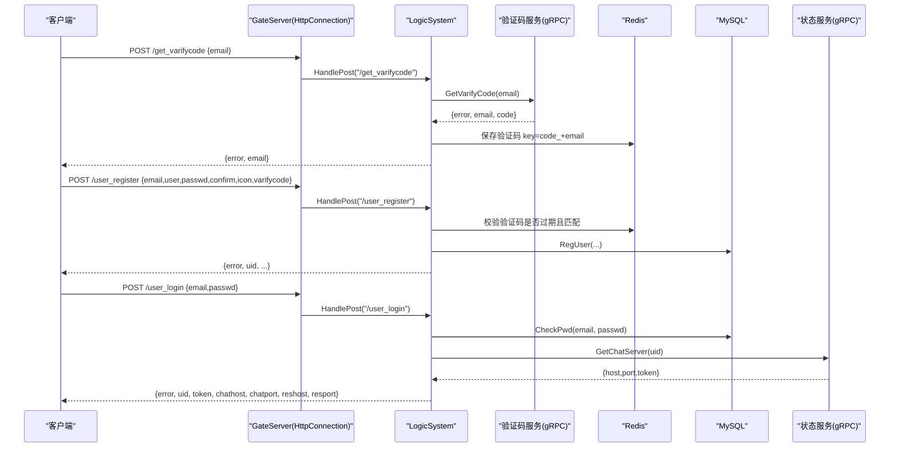
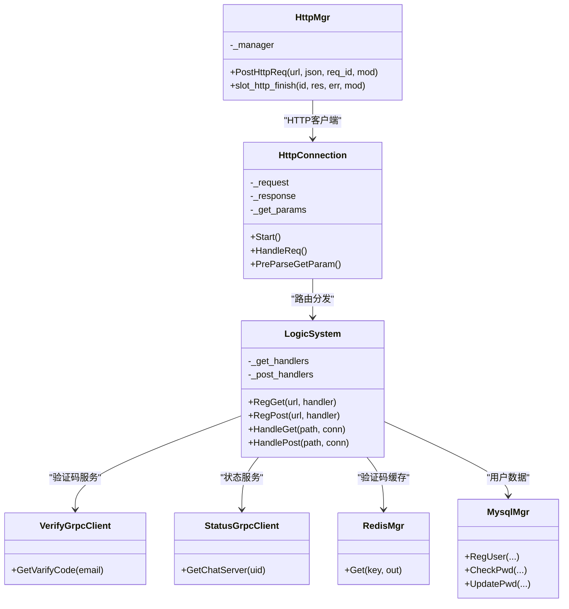

# HTTP API接口

<cite>
**本文引用的文件**   
- [HttpConnection.h](file://server/GateServer/include/HttpConnection.h)
- [HttpConnection.cpp](file://server/GateServer/src/HttpConnection.cpp)
- [LogicSystem.h](file://server/GateServer/include/LogicSystem.h)
- [LogicSystem.cpp](file://server/GateServer/src/LogicSystem.cpp)
- [const.h](file://server/GateServer/include/const.h)
- [httpmgr.h](file://client/llfcchat/include/httpmgr.h)
- [httpmgr.cpp](file://client/llfcchat/src/httpmgr.cpp)
- [registerdialog.cpp](file://client/llfcchat/src/registerdialog.cpp)
- [logindialog.cpp](file://client/llfcchat/src/logindialog.cpp)
- [message.proto](file://server/VarifyServer/message.proto)
- [config.ini（客户端）](file://client/llfcchat/config/config.ini)
</cite>

## 目录
1. [简介](#简介)
2. [项目结构](#项目结构)
3. [核心组件](#核心组件)
4. [架构总览](#架构总览)
5. [详细接口说明](#详细接口说明)
6. [依赖关系分析](#依赖关系分析)
7. [性能与扩展性](#性能与扩展性)
8. [故障排查指南](#故障排查指南)
9. [结论](#结论)
10. [附录：错误码与规范](#附录错误码与规范)

## 简介
本文件为 LLFCChat 项目的 HTTP API 接口文档，聚焦 GateServer 提供的 RESTful 端点，覆盖用户注册、登录、验证码获取、密码重置等关键流程。文档包含：
- 每个接口的 URL、HTTP 方法、请求参数、响应字段、状态码定义
- 认证机制说明（JWT/Token 的使用与生命周期）
- 完整的请求与响应示例（成功与错误）
- API 版本管理策略、向后兼容性保证、错误码统一规范等最佳实践

## 项目结构
GateServer 作为 HTTP 网关，使用 Boost.Beast 处理 HTTP 请求，通过 LogicSystem 进行路由分发；业务逻辑涉及 Redis（验证码缓存）、MySQL（用户数据）、gRPC（验证码服务与状态服务）。客户端通过 Qt 的 QNetworkAccessManager 发起 HTTP POST 请求，并通过信号槽回调处理结果。

**图示来源**
- [HttpConnection.cpp:132-193](file://server/GateServer/src/HttpConnection.cpp#L132-L193)
- [LogicSystem.cpp:36-406](file://server/GateServer/src/LogicSystem.cpp#L36-L406)
- [message.proto:1-44](file://server/VarifyServer/message.proto#L1-L44)

**章节来源**
- [HttpConnection.h:1-36](file://server/GateServer/include/HttpConnection.h#L1-L36)
- [HttpConnection.cpp:1-225](file://server/GateServer/src/HttpConnection.cpp#L1-L225)
- [LogicSystem.h:1-24](file://server/GateServer/include/LogicSystem.h#L1-L24)
- [LogicSystem.cpp:1-477](file://server/GateServer/src/LogicSystem.cpp#L1-L477)

## 核心组件
- HttpConnection：封装 HTTP 连接、请求解析、响应写入、超时控制、CORS 设置等
- LogicSystem：维护 GET/POST 路由表，将请求分发到具体 handler
- 客户端 HttpMgr：封装 QNetworkAccessManager，统一发送 POST 请求并回调模块处理器
- gRPC 客户端：VerifyGrpcClient（验证码服务）、StatusGrpcClient（状态服务）
- 存储与缓存：MysqlMgr（MySQL 操作）、RedisMgr（验证码缓存）

**章节来源**
- [HttpConnection.cpp:132-193](file://server/GateServer/src/HttpConnection.cpp#L132-L193)
- [LogicSystem.cpp:416-477](file://server/GateServer/src/LogicSystem.cpp#L416-L477)
- [httpmgr.cpp:1-62](file://client/llfcchat/src/httpmgr.cpp#L1-L62)

## 架构总览
GateServer 接收 HTTP 请求后，根据路径调用 LogicSystem 注册的 handler。各 handler 负责：
- 解析 JSON 请求体
- 校验参数与验证码（Redis）
- 调用 MySQL/gRPC 完成业务
- 返回统一的 JSON 响应（含 error 字段）

**图示来源**
- [LogicSystem.cpp:107-406](file://server/GateServer/src/LogicSystem.cpp#L107-L406)
- [message.proto:1-44](file://server/VarifyServer/message.proto#L1-L44)

## 详细接口说明

### 通用约定
- 内容类型：application/json
- 响应格式：JSON，统一包含 error 字段表示业务错误码
- HTTP 状态码：成功 200；未找到路由 404；其他异常由业务 error 描述
- CORS：服务端允许所有来源（生产环境建议限制具体来源）

**章节来源**
- [HttpConnection.cpp:132-193](file://server/GateServer/src/HttpConnection.cpp#L132-L193)
- [const.h:32-45](file://server/GateServer/include/const.h#L32-L45)

### 获取验证码
- URL：/get_varifycode
- 方法：POST
- 请求体：{"email": "xxx@xxx.com"}
- 响应体：{"error": 0, "email": "xxx@xxx.com"}
- 行为：
  - 解析 email
  - 调用验证码服务生成验证码并发送邮件
  - 将验证码存入 Redis（key 前缀 CODEPREFIX + email）
  - 返回 error 与 email

- 成功示例
  - 请求：{"email":"test@example.com"}
  - 响应：{"error":0,"email":"test@example.com"}

- 失败示例
  - 请求体 JSON 解析失败：{"error":1001,...}
  - 缺少 email：{"error":1001,...}
  - 验证码服务异常：{"error":1002,...}

**章节来源**
- [LogicSystem.cpp:107-151](file://server/GateServer/src/LogicSystem.cpp#L107-L151)
- [message.proto:1-17](file://server/VarifyServer/message.proto#L1-L17)
- [const.h:32-45](file://server/GateServer/include/const.h#L32-L45)

### 用户注册
- URL：/user_register
- 方法：POST
- 请求体：{"email":"...","user":"...","passwd":"...","confirm":"...","icon":"...","varifycode":"..."}
- 响应体：{"error":0,"uid":123,"email":"...","user":"...","passwd":"...","confirm":"...","icon":"...","varifycode":"..."}
- 行为：
  - 校验两次密码一致
  - 从 Redis 校验验证码是否过期且匹配
  - 调用 MySQL 注册用户（检查用户名/邮箱唯一性）
  - 返回用户信息或错误码

- 成功示例
  - 响应：{"error":0,"uid":123,"email":"test@example.com","user":"alice",...}

- 失败示例
  - 密码不一致：{"error":1006,...}
  - 验证码过期：{"error":1003,...}
  - 验证码错误：{"error":1004,...}
  - 用户已存在：{"error":1005,...}
  - 数据库异常：{"error":1005,...}

**章节来源**
- [LogicSystem.cpp:152-239](file://server/GateServer/src/LogicSystem.cpp#L152-L239)
- [const.h:32-45](file://server/GateServer/include/const.h#L32-L45)

### 重置密码
- URL：/reset_pwd
- 方法：POST
- 请求体：{"email":"...","user":"...","passwd":"...","varifycode":"..."}
- 响应体：{"error":0,"email":"...","user":"...","passwd":"...","varifycode":"..."}
- 行为：
  - 校验验证码是否过期且匹配
  - 校验用户名与邮箱匹配
  - 更新数据库密码

- 成功示例
  - 响应：{"error":0,"email":"test@example.com","user":"alice","passwd":"***","varifycode":"***"}

- 失败示例
  - 验证码过期：{"error":1003,...}
  - 验证码错误：{"error":1004,...}
  - 邮箱不匹配：{"error":1007,...}
  - 更新失败：{"error":1008,...}

**章节来源**
- [LogicSystem.cpp:241-324](file://server/GateServer/src/LogicSystem.cpp#L241-L324)
- [const.h:32-45](file://server/GateServer/include/const.h#L32-L45)

### 用户登录
- URL：/user_login
- 方法：POST
- 请求体：{"email":"...","passwd":"..."}
- 响应体：{"error":0,"email":"...","uid":123,"token":"...","chathost":"...","chatport":"...","reshost":"...","resport":"..."}
- 行为：
  - 校验邮箱与密码
  - 调用状态服务分配 ChatServer（返回 host、port、token）
  - 读取 ResourceServer 地址配置
  - 返回连接信息与认证令牌

- 成功示例
  - 响应：{"error":0,"email":"test@example.com","uid":123,"token":"abc123","chathost":"10.0.0.1","chatport":"9001","reshost":"10.0.0.2","resport":"8081"}

- 失败示例
  - 密码无效：{"error":1009,...}
  - RPC 失败：{"error":1002,...}

**章节来源**
- [LogicSystem.cpp:326-406](file://server/GateServer/src/LogicSystem.cpp#L326-L406)
- [message.proto:19-44](file://server/VarifyServer/message.proto#L19-L44)
- [const.h:32-45](file://server/GateServer/include/const.h#L32-L45)

### 测试接口（GET）
- URL：/get_test
- 方法：GET
- 查询参数：任意键值对
- 响应体：纯文本，回显接收到的参数键值对
- 用途：验证 GET 参数解析功能

**章节来源**
- [LogicSystem.cpp:37-54](file://server/GateServer/src/LogicSystem.cpp#L37-L54)

## 依赖关系分析
- GateServer 依赖：
  - Boost.Beast/Asio：HTTP 网络栈
  - JsonCpp：JSON 解析与构建
  - hiredis：Redis 操作
  - mysql-connector-cpp：MySQL 访问
  - gRPC：验证码服务与状态服务通信
- 客户端依赖：
  - Qt Network：QNetworkAccessManager 发送 HTTP 请求
  - 信号槽：异步回调处理响应

**图示来源**
- [HttpConnection.h:1-36](file://server/GateServer/include/HttpConnection.h#L1-L36)
- [LogicSystem.h:1-24](file://server/GateServer/include/LogicSystem.h#L1-L24)
- [httpmgr.h:1-34](file://client/llfcchat/include/httpmgr.h#L1-L34)

**章节来源**
- [HttpConnection.cpp:1-225](file://server/GateServer/src/HttpConnection.cpp#L1-L225)
- [LogicSystem.cpp:1-477](file://server/GateServer/src/LogicSystem.cpp#L1-L477)
- [httpmgr.cpp:1-62](file://client/llfcchat/src/httpmgr.cpp#L1-L62)

## 性能与扩展性
- 短连接：默认 keep_alive=false，简化并发模型，适合高吞吐场景
- 超时控制：连接级 deadline 定时器，避免资源泄漏
- 路由表：map 查找 O(log n)，可扩展为哈希表提升性能
- 外部依赖：Redis 与 MySQL 建议使用连接池；gRPC 使用连接池减少握手开销
- 扩展建议：
  - 增加限流与熔断保护后端服务
  - 引入鉴权中间件（如 JWT 校验）
  - 统一日志与监控埋点

[本节为通用指导，无需源码引用]

## 故障排查指南
- 常见错误码：
  - 1001：JSON 解析错误
  - 1002：RPC 请求错误
  - 1003：验证码过期
  - 1004：验证码错误
  - 1005：用户已存在
  - 1006：密码错误
  - 1007：邮箱不匹配
  - 1008：更新密码失败
  - 1009：密码无效
  - 1010：Token 失效
  - 1011：UID 无效
- 排查步骤：
  - 检查请求体 JSON 结构与字段名
  - 确认验证码是否已发送且在有效期内
  - 核对 Redis 中验证码 key 是否存在
  - 检查 MySQL 记录与权限
  - 查看 gRPC 调用状态码与返回值

**章节来源**
- [const.h:32-45](file://server/GateServer/include/const.h#L32-L45)
- [LogicSystem.cpp:60-406](file://server/GateServer/src/LogicSystem.cpp#L60-L406)

## 结论
LLFCChat 的 HTTP API 以 GateServer 为核心，采用简洁的 RESTful 设计，结合 Redis 与 MySQL 提供验证码与用户管理能力，并通过 gRPC 与验证码服务、状态服务协作完成登录与资源分配。统一错误码与 JSON 响应格式便于前后端协同开发与问题定位。后续可引入更完善的鉴权与限流机制以提升安全性与稳定性。

[本节为总结，无需源码引用]

## 附录：错误码与规范

### 错误码定义
- Success = 0
- Error_Json = 1001
- RPCFailed = 1002
- VarifyExpired = 1003
- VarifyCodeErr = 1004
- UserExist = 1005
- PasswdErr = 1006
- EmailNotMatch = 1007
- PasswdUpFailed = 1008
- PasswdInvalid = 1009
- TokenInvalid = 1010
- UidInvalid = 1011

**章节来源**
- [const.h:32-45](file://server/GateServer/include/const.h#L32-L45)

### 认证机制说明
- 登录成功后返回 token（由状态服务生成），用于后续 TCP 聊天连接的认证
- 客户端在建立 TCP 连接时携带 token，服务器校验通过后建立会话
- 当前 HTTP 层未实现基于 JWT 的请求签名，建议在网关层增加鉴权中间件

**章节来源**
- [LogicSystem.cpp:326-406](file://server/GateServer/src/LogicSystem.cpp#L326-L406)
- [message.proto:19-44](file://server/VarifyServer/message.proto#L19-L44)

### API 版本管理与兼容性
- 当前未启用 URL 版本前缀（如 /v1/），建议未来通过路径版本化保障向后兼容
- 新增字段应默认可选，避免破坏旧客户端
- 废弃字段需保留一段时间并提供迁移指引

[本节为通用指导，无需源码引用]

### 客户端调用示例
- 获取验证码：
  - 请求：POST /get_varifycode {"email":"test@example.com"}
  - 响应：{"error":0,"email":"test@example.com"}
- 用户注册：
  - 请求：POST /user_register {"email":"...","user":"...","passwd":"...","confirm":"...","icon":"...","varifycode":"..."}
  - 响应：{"error":0,"uid":123,...}
- 用户登录：
  - 请求：POST /user_login {"email":"...","passwd":"..."}
  - 响应：{"error":0,"uid":123,"token":"...","chathost":"...","chatport":"...","reshost":"...","resport":"..."}

**章节来源**
- [registerdialog.cpp:98-111](file://client/llfcchat/src/registerdialog.cpp#L98-L111)
- [logindialog.cpp:175-195](file://client/llfcchat/src/logindialog.cpp#L175-L195)
- [httpmgr.cpp:8-38](file://client/llfcchat/src/httpmgr.cpp#L8-L38)

### 配置与基础信息
- 客户端 GateServer 地址：
  - config.ini 中 [GateServer] 段 host/port
- 服务端端口与依赖：
  - GateServer 监听端口与 gRPC 服务地址由配置文件决定

**章节来源**
- [config.ini（客户端）:1-3](file://client/llfcchat/config/config.ini#L1-L3)