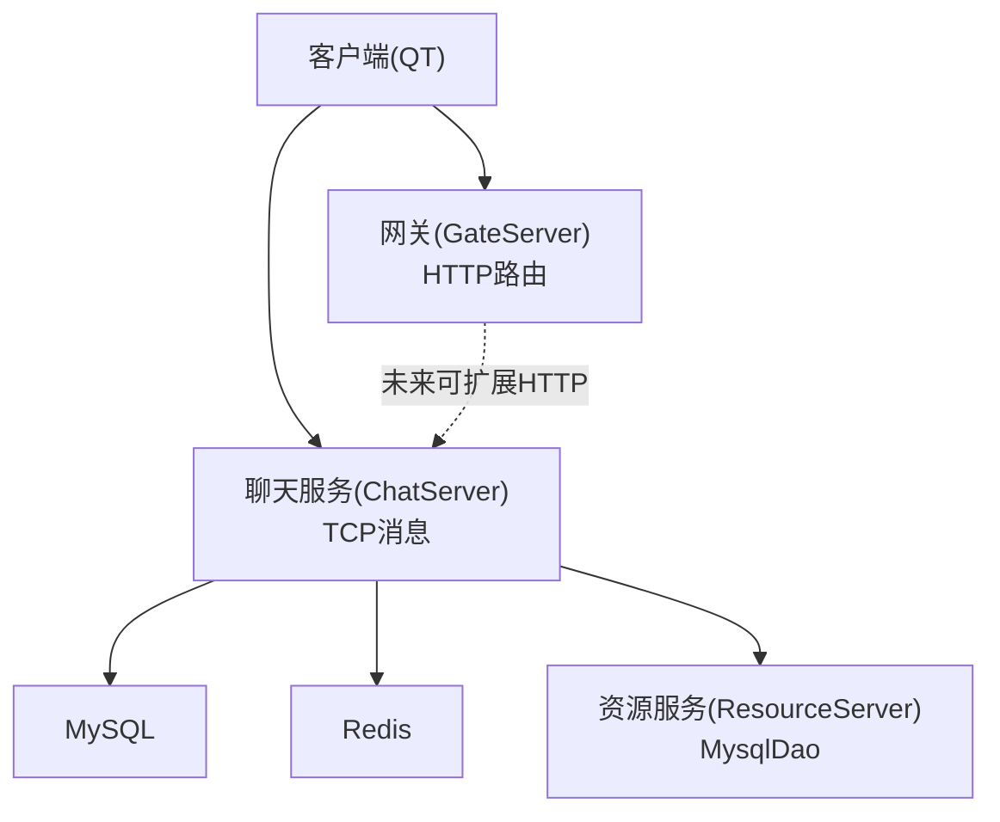
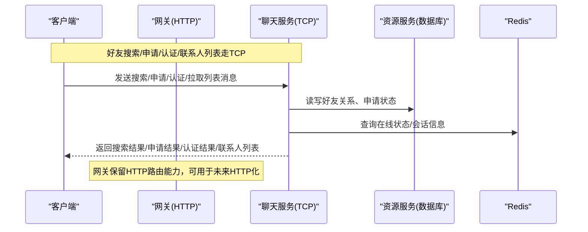
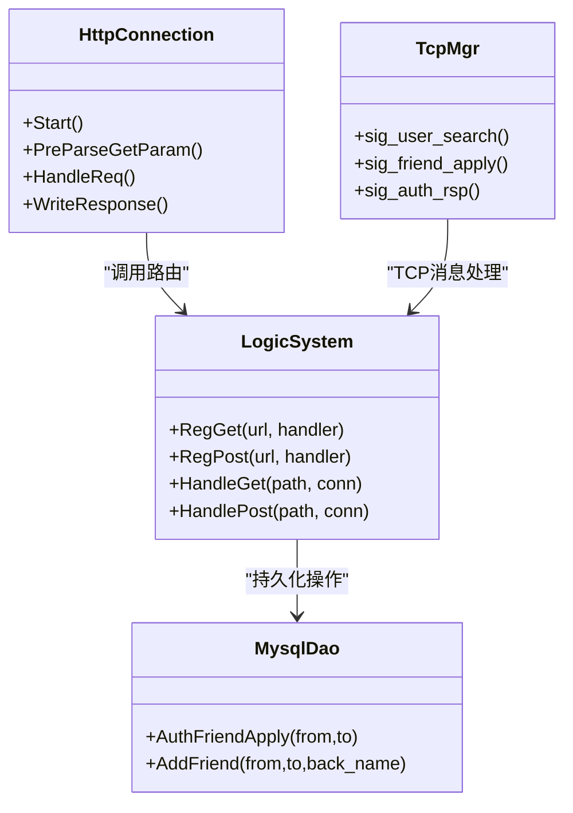

# 好友关系API

<cite>
**本文引用的文件**   
- [HttpConnection.h](file://server/GateServer/include/HttpConnection.h)
- [HttpConnection.cpp](file://server/GateServer/src/HttpConnection.cpp)
- [LogicSystem.h](file://server/GateServer/include/LogicSystem.h)
- [LogicSystem.cpp](file://server/GateServer/src/LogicSystem.cpp)
- [userdata.h](file://client/llfcchat/include/userdata.h)
- [httpmgr.h](file://client/llfcchat/include/httpmgr.h)
- [httpmgr.cpp](file://client/llfcchat/src/httpmgr.cpp)
- [tcpmgr.cpp](file://client/llfcchat/src/tcpmgr.cpp)
- [applyfriendpage.cpp](file://client/llfcchat/src/applyfriendpage.cpp)
- [contactuserlist.cpp](file://client/llfcchat/src/contactuserlist.cpp)
- [LogicSystem.cpp（ChatServer）](file://server/ChatServer/src/LogicSystem.cpp)
- [MysqlDao.cpp（ResourceServer）](file://server/ResourceServer/src/MysqlDao.cpp)
- [day28-好友查询和申请.md](file://开发文档/day28-好友查询和申请.md)
- [day26-实现联系人列表和好友申请列表.md](file://开发文档/day26-实现联系人列表和好友申请列表.md)
- [day29-好友认证和聊天通信.md](file://开发文档/day29-好友认证和聊天通信.md)
</cite>

## 目录
1. [简介](#简介)
2. [项目结构](#项目结构)
3. [核心组件](#核心组件)
4. [架构总览](#架构总览)
5. [详细接口规范](#详细接口规范)
6. [依赖分析](#依赖分析)
7. [性能考虑](#性能考虑)
8. [故障排查指南](#故障排查指南)
9. [结论](#结论)

## 简介
本文件为“好友关系管理”的HTTP API与相关TCP交互的完整规范，覆盖以下能力：
- 搜索用户接口（/api/user/search）：查询参数、分页支持、结果格式
- 好友申请流程：发送申请（/api/friend/apply）、处理申请（/api/friend/authenticate）、撤销申请
- 联系人列表获取（/api/contact/list）：数据结构、在线状态、头像等字段说明
- 错误码与异常处理约定
- 业务规则与约束条件

注意：当前网关（GateServer）已实现通用HTTP路由框架，但尚未注册上述四个HTTP端点；实际的好友搜索、申请、认证、联系人列表通过客户端与ChatServer之间的TCP消息完成。本文在给出HTTP接口规范的同时，补充了现有TCP实现的行为与数据模型，便于前后端对齐与后续扩展。

## 项目结构
- GateServer（网关）
  - HTTP连接封装与请求解析：HttpConnection
  - 路由注册与分发：LogicSystem
- ChatServer（聊天服务）
  - 好友搜索、申请、认证等逻辑：LogicSystem（TCP消息处理）
- ResourceServer（资源服务）
  - 数据库访问：MysqlDao（好友申请状态更新、添加好友等）
- 客户端（Qt）
  - HTTP模块：HttpMgr（仅用于登录、注册等HTTP场景）
  - TCP模块：TcpMgr（好友搜索、申请、认证、通知等）
  - 界面与数据模型：ApplyFriendPage、ContactUserList、UserData（SearchInfo、AddFriendApply、ApplyInfo、UserInfo等）

**图示来源** 
- [HttpConnection.cpp:132-194](file://server/GateServer/src/HttpConnection.cpp#L132-L194)
- [LogicSystem.cpp:36-406](file://server/GateServer/src/LogicSystem.cpp#L36-L406)
- [LogicSystem.cpp（ChatServer）:256-301](file://server/ChatServer/src/LogicSystem.cpp#L256-L301)
- [MysqlDao.cpp（ResourceServer）:212-245](file://server/ResourceServer/src/MysqlDao.cpp#L212-L245)

**章节来源**
- [HttpConnection.h:1-36](file://server/GateServer/include/HttpConnection.h#L1-L36)
- [HttpConnection.cpp:1-225](file://server/GateServer/src/HttpConnection.cpp#L1-L225)
- [LogicSystem.h:1-24](file://server/GateServer/include/LogicSystem.h#L1-L24)
- [LogicSystem.cpp:1-477](file://server/GateServer/src/LogicSystem.cpp#L1-L477)

## 核心组件
- HTTP网关（GateServer）
  - HttpConnection：负责读取HTTP请求、解析GET参数、构造响应、超时控制
  - LogicSystem：维护GET/POST路由表，将请求分发到对应处理器
- 聊天服务（ChatServer）
  - LogicSystem：处理好友搜索（SearchInfo）、好友申请（AddFriendApply）、好友认证（AuthFriendApply）等TCP消息
- 资源服务（ResourceServer）
  - MysqlDao：执行好友申请状态更新、添加好友等SQL操作
- 客户端（Client）
  - HttpMgr：封装HTTP POST请求（目前用于登录/注册等）
  - TcpMgr：封装TCP消息收发，处理好友搜索、申请、认证、通知等
  - ApplyFriendPage/ContactUserList：展示申请列表与联系人列表
  - UserData：定义SearchInfo、AddFriendApply、ApplyInfo、UserInfo等数据结构

**章节来源**
- [httpmgr.h:1-34](file://client/llfcchat/include/httpmgr.h#L1-L34)
- [httpmgr.cpp:1-62](file://client/llfcchat/src/httpmgr.cpp#L1-L62)
- [tcpmgr.cpp:290-333](file://client/llfcchat/src/tcpmgr.cpp#L290-L333)
- [applyfriendpage.cpp:1-95](file://client/llfcchat/src/applyfriendpage.cpp#L1-L95)
- [contactuserlist.cpp:1-43](file://client/llfcchat/src/contactuserlist.cpp#L1-L43)
- [userdata.h:1-288](file://client/llfcchat/include/userdata.h#L1-L288)

## 架构总览
下图展示了从客户端发起“好友搜索/申请/认证/联系人列表”的整体流程。由于这些能力当前基于TCP而非HTTP，网关层未直接暴露对应HTTP端点；但网关具备完善的HTTP路由框架，可在此基础上快速扩展HTTP接口。

**图示来源** 
- [LogicSystem.cpp（ChatServer）:256-301](file://server/ChatServer/src/LogicSystem.cpp#L256-L301)
- [MysqlDao.cpp（ResourceServer）:212-245](file://server/ResourceServer/src/MysqlDao.cpp#L212-L245)
- [tcpmgr.cpp:290-333](file://client/llfcchat/src/tcpmgr.cpp#L290-L333)

## 详细接口规范

### 搜索用户接口 /api/user/search
- 方法：GET
- 路径：/api/user/search
- 查询参数
  - keyword: string，必填，支持按uid或name模糊匹配
  - page: int，可选，默认1，页码（从1开始）
  - size: int，可选，默认20，每页条数（建议上限100）
- 响应体（JSON）
  - error: int，错误码（0表示成功）
  - list: array，搜索结果数组，每项包含：
    - uid: int
    - name: string
    - nick: string
    - desc: string
    - sex: int
    - icon: string（头像URL或base64）
  - total: int，总记录数
  - page: int，当前页
  - size: int，每页大小
- 示例响应
  - 成功：{"error":0,"list":[{"uid":1001,"name":"alice","nick":"小A","desc":"你好","sex":1,"icon":"https://..."}],"total":1,"page":1,"size":20}
  - 失败：{"error":1001,"msg":"参数缺失"}
- 错误码约定
  - 0：成功
  - 1001：参数缺失或非法
  - 1002：无匹配结果
  - 1003：服务器内部错误
- 备注
  - 当前实际搜索逻辑由ChatServer的TCP SearchInfo处理；HTTP接口为预留规范，可在GateServer中注册路由后复用后端逻辑

**章节来源**
- [LogicSystem.cpp（ChatServer）:256-279](file://server/ChatServer/src/LogicSystem.cpp#L256-L279)
- [day28-好友查询和申请.md:1-3](file://开发文档/day28-好友查询和申请.md#L1-L3)

### 好友申请接口 /api/friend/apply
- 方法：POST
- 路径：/api/friend/apply
- 请求体（JSON）
  - from_uid: int，申请人ID
  - to_uid: int，被申请人ID
  - applyname: string，申请备注
  - bakname: string，对方备注名（可选）
- 响应体（JSON）
  - error: int，错误码
  - msg: string，提示信息（可选）
- 示例响应
  - 成功：{"error":0,"msg":"申请已发送"}
  - 失败：{"error":1004,"msg":"重复申请"}
- 错误码约定
  - 0：成功
  - 1004：重复申请或无效目标
  - 1005：权限校验失败
  - 1003：服务器内部错误
- 备注
  - 当前申请逻辑由ChatServer的TCP AddFriendApply处理；HTTP接口为预留规范

**章节来源**
- [LogicSystem.cpp（ChatServer）:281-301](file://server/ChatServer/src/LogicSystem.cpp#L281-L301)

### 好友认证接口 /api/friend/authenticate
- 方法：POST
- 路径：/api/friend/authenticate
- 请求体（JSON）
  - fromuid: int，申请人ID
  - touid: int，被申请人ID
  - back: string，审核备注（可选）
- 响应体（JSON）
  - error: int，错误码
  - name/nick/icon/sex/uid: 被申请人的基本信息（当认证成功时返回）
  - chat_datas: array，初始聊天数据（可选）
- 示例响应
  - 成功：{"error":0,"name":"alice","nick":"小A","icon":"https://...","sex":1,"uid":1001,"chat_datas":[]}
  - 失败：{"error":1006,"msg":"用户不存在"}
- 错误码约定
  - 0：成功
  - 1006：用户不存在或UID无效
  - 1007：申请不存在或状态不符
  - 1003：服务器内部错误
- 备注
  - 当前认证逻辑由ChatServer的TCP AuthFriendApply处理；HTTP接口为预留规范

**章节来源**
- [day29-好友认证和聊天通信.md:1-98](file://开发文档/day29-好友认证和聊天通信.md#L1-L98)
- [LogicSystem.cpp（ChatServer）:256-301](file://server/ChatServer/src/LogicSystem.cpp#L256-L301)

### 联系人列表接口 /api/contact/list
- 方法：GET
- 路径：/api/contact/list
- 查询参数
  - uid: int，当前登录用户ID（必填）
  - page: int，可选，默认1
  - size: int，可选，默认20
- 响应体（JSON）
  - error: int，错误码
  - list: array，联系人数组，每项包含：
    - uid: int
    - name: string
    - nick: string
    - icon: string（头像URL或base64）
    - sex: int
    - last_msg: string（最近一条消息摘要，可选）
    - online: bool（在线状态，可选）
    - thread_id: int（会话ID，可选）
  - total: int，总记录数
  - page: int，当前页
  - size: int，每页大小
- 示例响应
  - 成功：{"error":0,"list":[{"uid":1001,"name":"alice","nick":"小A","icon":"https://...","sex":1,"last_msg":"你好","online":true,"thread_id":101}],"total":1,"page":1,"size":20}
- 错误码约定
  - 0：成功
  - 1001：参数缺失或非法
  - 1002：无联系人
  - 1003：服务器内部错误
- 备注
  - 当前联系人列表由客户端本地管理与TCP推送；HTTP接口为预留规范

**章节来源**
- [contactuserlist.cpp:1-43](file://client/llfcchat/src/contactuserlist.cpp#L1-L43)
- [userdata.h:108-142](file://client/llfcchat/include/userdata.h#L108-L142)

### 撤销申请接口 /api/friend/cancel
- 方法：POST
- 路径：/api/friend/cancel
- 请求体（JSON）
  - from_uid: int，申请人ID
  - to_uid: int，被申请人ID
- 响应体（JSON）
  - error: int，错误码
  - msg: string，提示信息（可选）
- 示例响应
  - 成功：{"error":0,"msg":"已撤销申请"}
  - 失败：{"error":1008,"msg":"申请不存在"}
- 错误码约定
  - 0：成功
  - 1008：申请不存在或状态不符
  - 1003：服务器内部错误
- 备注
  - 该接口为预留规范，可在GateServer中注册路由后调用ChatServer的相应逻辑

[本节为预留接口规范，暂无具体实现]

## 依赖分析
- GateServer
  - 提供HTTP入口与路由分发，便于未来将好友相关能力HTTP化
- ChatServer
  - 实现好友搜索、申请、认证的核心逻辑，依赖MySQL与Redis
- ResourceServer
  - 提供数据库访问能力（如更新申请状态、添加好友）
- 客户端
  - 使用TcpMgr进行TCP消息收发，使用HttpMgr进行HTTP请求（登录/注册等）

**图示来源** 
- [HttpConnection.cpp:132-194](file://server/GateServer/src/HttpConnection.cpp#L132-L194)
- [LogicSystem.cpp:416-477](file://server/GateServer/src/LogicSystem.cpp#L416-L477)
- [tcpmgr.cpp:290-333](file://client/llfcchat/src/tcpmgr.cpp#L290-L333)
- [MysqlDao.cpp（ResourceServer）:212-245](file://server/ResourceServer/src/MysqlDao.cpp#L212-L245)

**章节来源**
- [LogicSystem.h:1-24](file://server/GateServer/include/LogicSystem.h#L1-L24)
- [LogicSystem.cpp:1-477](file://server/GateServer/src/LogicSystem.cpp#L1-L477)
- [tcpmgr.cpp:290-333](file://client/llfcchat/src/tcpmgr.cpp#L290-L333)
- [MysqlDao.cpp（ResourceServer）:212-245](file://server/ResourceServer/src/MysqlDao.cpp#L212-L245)

## 性能考虑
- 分页与限流
  - 所有列表接口均支持分页，建议设置合理的size上限（如100），避免大结果集传输
- 缓存策略
  - 联系人列表与在线状态可通过Redis缓存，减少数据库压力
- 异步与并发
  - GateServer采用异步IO（Boost.Asio），ChatServer使用线程池与消息队列，提升吞吐
- 数据库优化
  - 对好友关系、申请状态建立合适索引，避免全表扫描

[本节为通用指导，不引用具体文件]

## 故障排查指南
- 常见错误码
  - 1001：参数缺失或非法（检查keyword、from_uid、to_uid等必填字段）
  - 1002：无匹配结果（确认搜索关键字或联系人是否存在）
  - 1003：服务器内部错误（查看服务端日志，定位数据库/Redis问题）
  - 1004：重复申请或无效目标（检查是否已存在申请记录）
  - 1005：权限校验失败（确认from_uid与to_uid合法性）
  - 1006：用户不存在或UID无效（检查目标用户是否存在）
  - 1007：申请不存在或状态不符（检查申请状态）
  - 1008：撤销失败（检查申请是否存在且处于可撤销状态）
- 排查步骤
  - 检查请求参数是否符合规范
  - 查看服务端日志（GateServer/ChatServer/ResourceServer）
  - 验证数据库与Redis连接状态
  - 确认客户端与服务端版本一致（协议字段未变更）

**章节来源**
- [LogicSystem.cpp（ChatServer）:256-301](file://server/ChatServer/src/LogicSystem.cpp#L256-L301)
- [MysqlDao.cpp（ResourceServer）:212-245](file://server/ResourceServer/src/MysqlDao.cpp#L212-L245)

## 结论
本文提供了好友关系管理的HTTP API规范，并补充了现有TCP实现的行为与数据模型。尽管当前功能主要通过TCP完成，但GateServer已具备完整的HTTP路由框架，可快速扩展HTTP接口以适配Web或第三方集成。建议在后续迭代中将搜索、申请、认证、联系人列表逐步HTTP化，以提升系统开放性与兼容性。