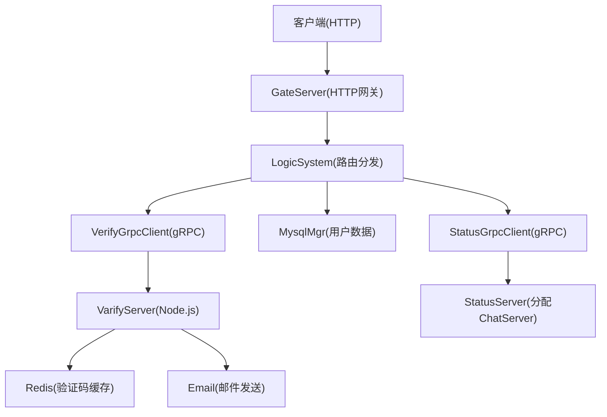
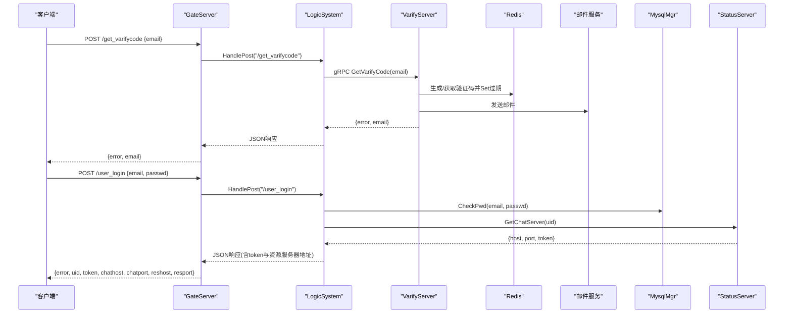
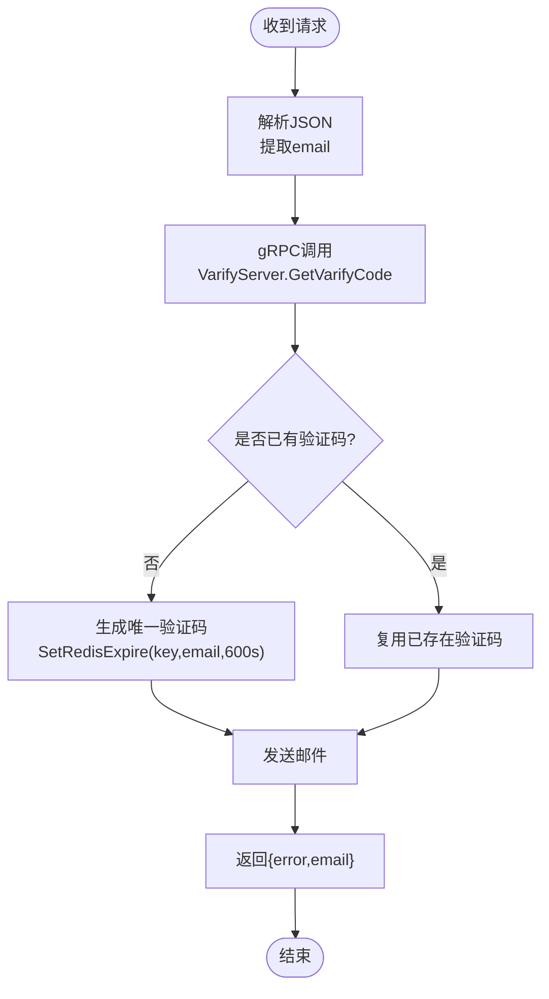
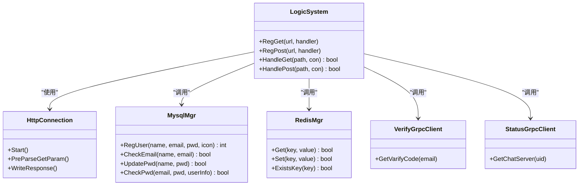

# 用户认证API

<cite>
**本文引用的文件**   
- [server/GateServer/src/LogicSystem.cpp](file://server/GateServer/src/LogicSystem.cpp)
- [server/GateServer/include/LogicSystem.h](file://server/GateServer/include/LogicSystem.h)
- [server/GateServer/src/HttpConnection.cpp](file://server/GateServer/src/HttpConnection.cpp)
- [server/GateServer/include/HttpConnection.h](file://server/GateServer/include/HttpConnection.h)
- [server/GateServer/include/const.h](file://server/GateServer/include/const.h)
- [server/GateServer/include/MysqlMgr.h](file://server/GateServer/include/MysqlMgr.h)
- [server/GateServer/include/RedisMgr.h](file://server/GateServer/include/RedisMgr.h)
- [server/GateServer/src/GateServer.cpp](file://server/GateServer/src/GateServer.cpp)
- [server/VarifyServer/server.js](file://server/VarifyServer/server.js)
- [server/VarifyServer/email.js](file://server/VarifyServer/email.js)
- [server/VarifyServer/redis.js](file://server/VarifyServer/redis.js)
- [client/llfcchat/src/httpmgr.cpp](file://client/llfcchat/src/httpmgr.cpp)
- [client/llfcchat/src/logindialog.cpp](file://client/llfcchat/src/logindialog.cpp)
- [client/llfcchat/src/resetdialog.cpp](file://client/llfcchat/src/resetdialog.cpp)
- [开发文档/day13-重置界面.md](file://开发文档/day13-重置界面.md)
</cite>

## 目录
1. [简介](#简介)
2. [项目结构](#项目结构)
3. [核心组件](#核心组件)
4. [架构总览](#架构总览)
5. [详细组件分析](#详细组件分析)
6. [依赖分析](#依赖分析)
7. [性能考虑](#性能考虑)
8. [故障排查指南](#故障排查指南)
9. [结论](#结论)
10. [附录：接口规范与示例](#附录接口规范与示例)

## 简介
本文件为用户认证相关的HTTP API完整技术文档，覆盖以下能力：
- 用户注册、登录、登出（当前未实现）、密码重置
- 邮箱验证码获取（/api/get_varifycode）的实现细节与限制策略
- JWT令牌机制说明（当前系统使用gRPC分配的TCP连接token，非JWT；本文给出扩展建议）
- 请求与响应格式、错误码、安全注意事项与最佳实践

## 项目结构
GateServer作为HTTP网关，负责接收客户端HTTP请求并路由到对应处理函数。验证码服务VarifyServer通过gRPC提供验证码生成与邮件发送能力。Redis用于验证码缓存与过期控制，MySQL用于用户数据持久化。

图表来源
- [server/GateServer/src/LogicSystem.cpp](file://server/GateServer/src/LogicSystem.cpp)
- [server/GateServer/src/HttpConnection.cpp](file://server/GateServer/src/HttpConnection.cpp)
- [server/VarifyServer/server.js](file://server/VarifyServer/server.js)
- [server/VarifyServer/email.js](file://server/VarifyServer/email.js)
- [server/VarifyServer/redis.js](file://server/VarifyServer/redis.js)
- [server/GateServer/include/MysqlMgr.h](file://server/GateServer/include/MysqlMgr.h)
- [server/GateServer/include/RedisMgr.h](file://server/GateServer/include/RedisMgr.h)

章节来源
- [server/GateServer/src/GateServer.cpp](file://server/GateServer/src/GateServer.cpp)
- [server/GateServer/src/HttpConnection.cpp](file://server/GateServer/src/HttpConnection.cpp)
- [server/GateServer/include/LogicSystem.h](file://server/GateServer/include/LogicSystem.h)

## 核心组件
- HTTP连接层：HttpConnection负责读取请求、设置响应头、CORS、超时与写入响应。
- 路由分发：LogicSystem在构造时注册所有POST/GET路由，按路径分发到具体handler。
- 验证码服务：VarifyServer通过gRPC接收邮箱，生成验证码、存入Redis并发送邮件。
- 存储层：MysqlMgr负责用户注册、校验、密码更新等；RedisMgr管理验证码缓存与过期。
- 客户端HTTP封装：HttpMgr统一发起POST请求并回调模块处理结果。

章节来源
- [server/GateServer/include/HttpConnection.h](file://server/GateServer/include/HttpConnection.h)
- [server/GateServer/src/HttpConnection.cpp](file://server/GateServer/src/HttpConnection.cpp)
- [server/GateServer/include/LogicSystem.h](file://server/GateServer/include/LogicSystem.h)
- [server/GateServer/src/LogicSystem.cpp](file://server/GateServer/src/LogicSystem.cpp)
- [server/VarifyServer/server.js](file://server/VarifyServer/server.js)
- [server/VarifyServer/email.js](file://server/VarifyServer/email.js)
- [server/VarifyServer/redis.js](file://server/VarifyServer/redis.js)
- [server/GateServer/include/MysqlMgr.h](file://server/GateServer/include/MysqlMgr.h)
- [server/GateServer/include/RedisMgr.h](file://server/GateServer/include/RedisMgr.h)
- [client/llfcchat/src/httpmgr.cpp](file://client/llfcchat/src/httpmgr.cpp)

## 架构总览
GateServer作为入口，将HTTP请求解析后交由LogicSystem路由到具体业务逻辑。验证码流程跨服务调用VarifyServer，登录流程通过StatusServer分配ChatServer并返回连接信息。

图表来源
- [server/GateServer/src/LogicSystem.cpp](file://server/GateServer/src/LogicSystem.cpp)
- [server/VarifyServer/server.js](file://server/VarifyServer/server.js)
- [server/VarifyServer/redis.js](file://server/VarifyServer/redis.js)
- [server/VarifyServer/email.js](file://server/VarifyServer/email.js)
- [server/GateServer/include/MysqlMgr.h](file://server/GateServer/include/MysqlMgr.h)

## 详细组件分析

### HTTP连接与路由分发
- HttpConnection负责：
  - 异步读取HTTP请求
  - 解析GET查询参数
  - 设置响应头（Content-Type、CORS、Server）
  - 处理超时与响应写入
- LogicSystem负责：
  - 注册路由（RegGet/RegPost）
  - 根据URL路径分发到对应handler
  - 统一JSON响应构建与错误码填充

章节来源
- [server/GateServer/src/HttpConnection.cpp](file://server/GateServer/src/HttpConnection.cpp)
- [server/GateServer/include/HttpConnection.h](file://server/GateServer/include/HttpConnection.h)
- [server/GateServer/include/LogicSystem.h](file://server/GateServer/include/LogicSystem.h)
- [server/GateServer/src/LogicSystem.cpp](file://server/GateServer/src/LogicSystem.cpp)

### 验证码获取接口（/api/get_varifycode）
- URL与方法：/get_varifycode（POST）
- 请求体字段：
  - email: string，邮箱地址
- 响应体字段：
  - error: int，错误码
  - email: string，回显邮箱
- 实现要点：
  - GateServer的LogicSystem注册该路由，解析JSON并调用VerifyGrpcClient
  - VarifyServer生成或复用验证码，设置Redis键为 code_prefix + email，过期时间600秒
  - 通过邮件服务发送邮件，返回错误码与邮箱

图表来源
- [server/GateServer/src/LogicSystem.cpp](file://server/GateServer/src/LogicSystem.cpp)
- [server/VarifyServer/server.js](file://server/VarifyServer/server.js)
- [server/VarifyServer/redis.js](file://server/VarifyServer/redis.js)
- [server/VarifyServer/email.js](file://server/VarifyServer/email.js)

章节来源
- [server/GateServer/src/LogicSystem.cpp](file://server/GateServer/src/LogicSystem.cpp)
- [server/VarifyServer/server.js](file://server/VarifyServer/server.js)
- [server/VarifyServer/redis.js](file://server/VarifyServer/redis.js)
- [server/VarifyServer/email.js](file://server/VarifyServer/email.js)

### 用户注册接口（/api/user_register）
- URL与方法：/user_register（POST）
- 请求体字段：
  - email: string，邮箱
  - user: string，用户名/昵称
  - passwd: string，密码
  - confirm: string，确认密码
  - icon: string，头像（路径或base64）
  - varifycode: string，验证码
- 响应体字段：
  - error: int，错误码
  - uid: int，新注册用户ID（成功时）
  - email,user,passwd,confirm,icon,varifycode: 回显字段
- 处理流程：
  - 校验两次密码一致
  - 从Redis中校验验证码是否存在且未过期
  - 比对验证码是否正确
  - 调用MysqlMgr.RegUser进行注册（内部检查用户名/邮箱唯一性）
  - 返回成功或错误码

章节来源
- [server/GateServer/src/LogicSystem.cpp](file://server/GateServer/src/LogicSystem.cpp)
- [server/GateServer/include/MysqlMgr.h](file://server/GateServer/include/MysqlMgr.h)
- [server/GateServer/include/RedisMgr.h](file://server/GateServer/include/RedisMgr.h)
- [client/llfcchat/src/registerdialog.cpp](file://client/llfcchat/src/registerdialog.cpp)

### 密码重置接口（/api/reset_pwd）
- URL与方法：/reset_pwd（POST）
- 请求体字段：
  - email: string，邮箱
  - user: string，用户名
  - passwd: string，新密码
  - varifycode: string，验证码
- 响应体字段：
  - error: int，错误码
  - email,user,passwd,varifycode: 回显字段
- 处理流程：
  - 校验验证码是否存在且未过期
  - 比对验证码是否正确
  - 校验用户名与邮箱匹配（防止恶意重置他人密码）
  - 更新数据库中的密码

章节来源
- [server/GateServer/src/LogicSystem.cpp](file://server/GateServer/src/LogicSystem.cpp)
- [开发文档/day13-重置界面.md](file://开发文档/day13-重置界面.md)
- [client/llfcchat/src/resetdialog.cpp](file://client/llfcchat/src/resetdialog.cpp)

### 用户登录接口（/api/user_login）
- URL与方法：/user_login（POST）
- 请求体字段：
  - email: string，邮箱
  - passwd: string，密码
- 响应体字段：
  - error: int，错误码
  - email: string，邮箱
  - uid: int，用户ID
  - token: string，TCP连接认证令牌（由StatusServer生成）
  - chathost: string，ChatServer主机
  - chatport: string，ChatServer端口
  - reshost: string，资源服务器主机
  - resport: string，资源服务器端口
- 处理流程：
  - 校验邮箱与密码（MysqlMgr.CheckPwd）
  - 通过StatusGrpcClient向StatusServer申请ChatServer分配，返回host/port/token
  - 读取配置获取ResourceServer地址
  - 返回包含连接信息与token的JSON

章节来源
- [server/GateServer/src/LogicSystem.cpp](file://server/GateServer/src/LogicSystem.cpp)
- [server/GateServer/include/MysqlMgr.h](file://server/GateServer/include/MysqlMgr.h)
- [client/llfcchat/src/logindialog.cpp](file://client/llfcchat/src/logindialog.cpp)

### 登出接口（/api/logout）
- 当前代码库未实现登出HTTP接口。若需实现，建议在服务端维护会话状态或使用Token黑名单机制，并在客户端清除本地保存的token与会话信息。

[本节不直接分析具体文件]

## 依赖分析
- GateServer依赖：
  - RedisMgr：验证码缓存与过期控制
  - MysqlMgr：用户数据CRUD
  - VerifyGrpcClient：调用VarifyServer
  - StatusGrpcClient：调用StatusServer分配ChatServer
- VarifyServer依赖：
  - Redis：验证码存储与过期
  - 邮件服务：发送邮件
- 客户端依赖：
  - HttpMgr：统一HTTP请求封装与回调分发

图表来源
- [server/GateServer/include/LogicSystem.h](file://server/GateServer/include/LogicSystem.h)
- [server/GateServer/include/HttpConnection.h](file://server/GateServer/include/HttpConnection.h)
- [server/GateServer/include/MysqlMgr.h](file://server/GateServer/include/MysqlMgr.h)
- [server/GateServer/include/RedisMgr.h](file://server/GateServer/include/RedisMgr.h)

章节来源
- [server/GateServer/src/LogicSystem.cpp](file://server/GateServer/src/LogicSystem.cpp)
- [server/GateServer/include/LogicSystem.h](file://server/GateServer/include/LogicSystem.h)
- [server/GateServer/include/MysqlMgr.h](file://server/GateServer/include/MysqlMgr.h)
- [server/GateServer/include/RedisMgr.h](file://server/GateServer/include/RedisMgr.h)

## 性能考虑
- 验证码缓存：Redis键以邮箱为key，设置600秒过期，避免重复生成与频繁邮件发送。
- 连接池：RedisMgr内置连接池与心跳检测，提升高并发稳定性。
- 短连接：HTTP响应设置为keep_alive=false，减少长连接占用。
- 超时控制：HttpConnection设置60秒超时，避免僵尸连接。
- 负载均衡：登录时通过StatusServer分配ChatServer，避免单点过载。

[本节为通用指导，不直接分析具体文件]

## 故障排查指南
- JSON解析失败：检查请求体是否为合法JSON，确保Content-Type为application/json。
- 验证码过期：确认Redis中验证码键是否存在且未过期，检查VarifyServer的过期时间设置。
- 验证码错误：核对客户端输入的验证码与服务端缓存值是否一致。
- 用户名/邮箱不匹配：重置密码时需保证用户名与邮箱同时匹配。
- RPC失败：检查StatusServer与VarifyServer可用性，查看gRPC调用错误码。
- 网络异常：客户端HttpMgr会抛出ERR_NETWORK，检查网络连通性与服务器端口。

章节来源
- [server/GateServer/include/const.h](file://server/GateServer/include/const.h)
- [client/llfcchat/src/httpmgr.cpp](file://client/llfcchat/src/httpmgr.cpp)
- [server/GateServer/src/LogicSystem.cpp](file://server/GateServer/src/LogicSystem.cpp)

## 结论
本系统通过GateServer统一HTTP入口，结合VarifyServer与StatusServer完成验证码与聊天服务分配，使用Redis与MySQL分别处理验证码缓存与用户数据。当前未实现登出接口与JWT令牌机制，建议后续扩展会话管理与令牌刷新流程以提升安全性与用户体验。

[本节为总结，不直接分析具体文件]

## 附录：接口规范与示例

### 通用约定
- Content-Type：application/json
- 响应体均为JSON，包含error字段表示错误码，成功时error=0
- 错误码定义参见const.h中的ErrorCodes枚举

章节来源
- [server/GateServer/include/const.h](file://server/GateServer/include/const.h)

### 接口一：获取邮箱验证码
- URL：/get_varifycode
- 方法：POST
- 请求体：
  - email: string
- 响应体：
  - error: int
  - email: string
- 成功示例：
  - 请求：{"email":"test@example.com"}
  - 响应：{"error":0,"email":"test@example.com"}
- 错误场景：
  - JSON解析失败：{"error":1001}
  - 验证码生成失败（Redis错误）：{"error":1002}
  - 邮件发送异常：{"error":1002}

章节来源
- [server/GateServer/src/LogicSystem.cpp](file://server/GateServer/src/LogicSystem.cpp)
- [server/VarifyServer/server.js](file://server/VarifyServer/server.js)
- [server/VarifyServer/redis.js](file://server/VarifyServer/redis.js)
- [server/VarifyServer/email.js](file://server/VarifyServer/email.js)

### 接口二：用户注册
- URL：/user_register
- 方法：POST
- 请求体：
  - email: string
  - user: string
  - passwd: string
  - confirm: string
  - icon: string
  - varifycode: string
- 响应体：
  - error: int
  - uid: int（成功时）
  - email,user,passwd,confirm,icon,varifycode: 回显
- 成功示例：
  - 请求：{"email":"test@example.com","user":"alice","passwd":"Pass123!","confirm":"Pass123!","icon":"/head_1.jpg","varifycode":"ABCD"}
  - 响应：{"error":0,"uid":123,"email":"test@example.com","user":"alice","passwd":"Pass123!","confirm":"Pass123!","icon":"/head_1.jpg","varifycode":"ABCD"}
- 错误场景：
  - 两次密码不一致：{"error":1006}
  - 验证码过期：{"error":1003}
  - 验证码错误：{"error":1004}
  - 用户或邮箱已存在：{"error":1005}

章节来源
- [server/GateServer/src/LogicSystem.cpp](file://server/GateServer/src/LogicSystem.cpp)
- [server/GateServer/include/MysqlMgr.h](file://server/GateServer/include/MysqlMgr.h)

### 接口三：密码重置
- URL：/reset_pwd
- 方法：POST
- 请求体：
  - email: string
  - user: string
  - passwd: string
  - varifycode: string
- 响应体：
  - error: int
  - email,user,passwd,varifycode: 回显
- 成功示例：
  - 请求：{"email":"test@example.com","user":"alice","passwd":"NewPass123!","varifycode":"ABCD"}
  - 响应：{"error":0,"email":"test@example.com","user":"alice","passwd":"NewPass123!","varifycode":"ABCD"}
- 错误场景：
  - 验证码过期：{"error":1003}
  - 验证码错误：{"error":1004}
  - 用户名与邮箱不匹配：{"error":1007}
  - 更新密码失败：{"error":1008}

章节来源
- [server/GateServer/src/LogicSystem.cpp](file://server/GateServer/src/LogicSystem.cpp)
- [开发文档/day13-重置界面.md](file://开发文档/day13-重置界面.md)

### 接口四：用户登录
- URL：/user_login
- 方法：POST
- 请求体：
  - email: string
  - passwd: string
- 响应体：
  - error: int
  - email: string
  - uid: int
  - token: string
  - chathost: string
  - chatport: string
  - reshost: string
  - resport: string
- 成功示例：
  - 请求：{"email":"test@example.com","passwd":"Pass123!"}
  - 响应：{"error":0,"email":"test@example.com","uid":123,"token":"abc123","chathost":"192.168.1.10","chatport":"8080","reshost":"192.168.1.11","resport":"9090"}
- 错误场景：
  - 密码错误或用户不存在：{"error":1009}
  - RPC失败（StatusServer不可用）：{"error":1002}

章节来源
- [server/GateServer/src/LogicSystem.cpp](file://server/GateServer/src/LogicSystem.cpp)
- [client/llfcchat/src/logindialog.cpp](file://client/llfcchat/src/logindialog.cpp)

### 接口五：登出（未实现）
- URL：/logout
- 方法：POST
- 说明：当前未实现。建议服务端维护会话或Token黑名单，客户端清除本地token。

[本节为概念性说明，不直接分析具体文件]

### 验证码生成规则与频率限制
- 生成规则：
  - 优先复用Redis中已存在的验证码（同一邮箱）
  - 若无则生成唯一验证码（UUID前4位），存入Redis并设置600秒过期
- 有效期：
  - 600秒（10分钟）
- 发送频率限制：
  - 当前未实现限流，建议基于Redis计数器对同一邮箱进行限流（如每分钟最多一次）

章节来源
- [server/VarifyServer/server.js](file://server/VarifyServer/server.js)
- [server/VarifyServer/redis.js](file://server/VarifyServer/redis.js)

### JWT令牌机制说明与建议
- 现状：
  - 登录成功后返回的token由StatusServer生成，用于TCP连接认证，并非JWT
- 建议扩展：
  - 引入JWT签发与验证中间件
  - 支持refresh_token刷新流程
  - 设置合理的过期时间与黑名单机制

[本节为概念性说明，不直接分析具体文件]

### 安全考虑与最佳实践
- 密码加密存储：
  - 当前MysqlMgr.UpdatePwd直接更新明文密码，建议改为哈希存储（如bcrypt）
- 输入验证：
  - 客户端已做基础校验（长度、正则），服务端应再次严格校验
- 防暴力破解：
  - 增加验证码重试次数限制
  - 对登录与重置接口实施IP级限流
- 传输安全：
  - 生产环境启用HTTPS，避免明文传输敏感数据
- CORS与安全头：
  - 当前CORS设置为允许所有来源，生产环境应限制具体域名

章节来源
- [server/GateServer/include/const.h](file://server/GateServer/include/const.h)
- [client/llfcchat/src/httpmgr.cpp](file://client/llfcchat/src/httpmgr.cpp)
- [server/GateServer/src/HttpConnection.cpp](file://server/GateServer/src/HttpConnection.cpp)