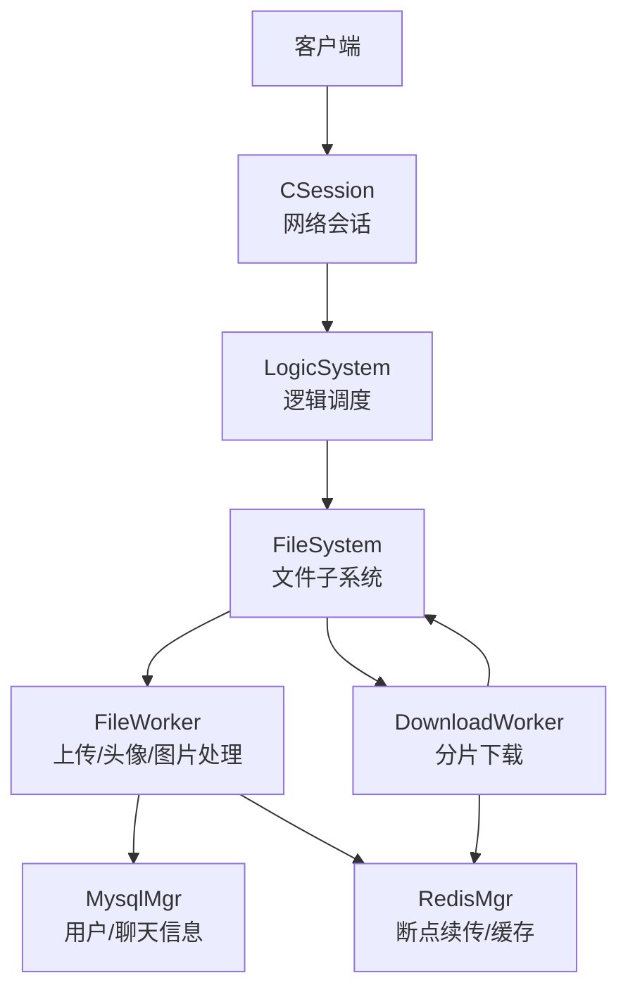
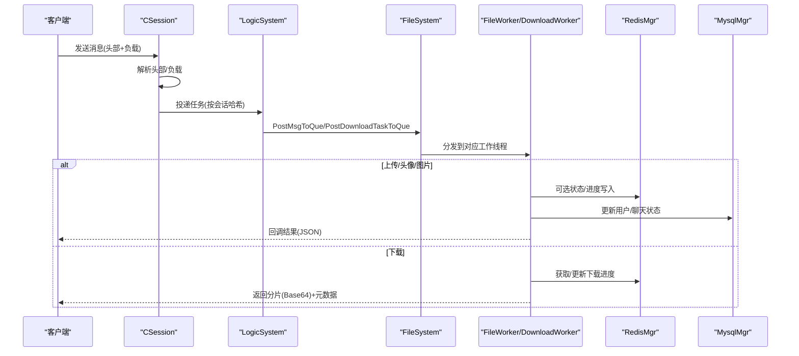
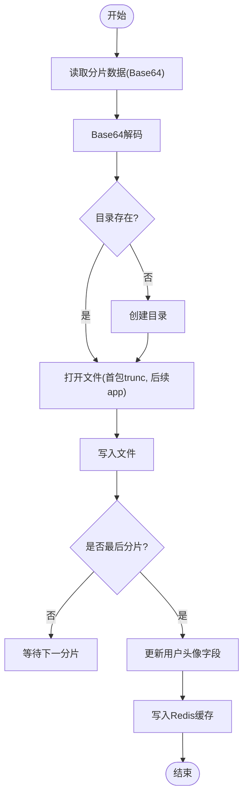
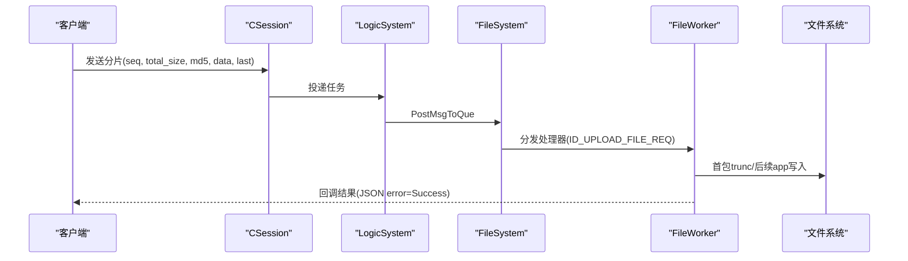
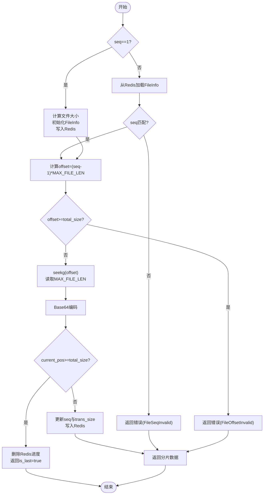
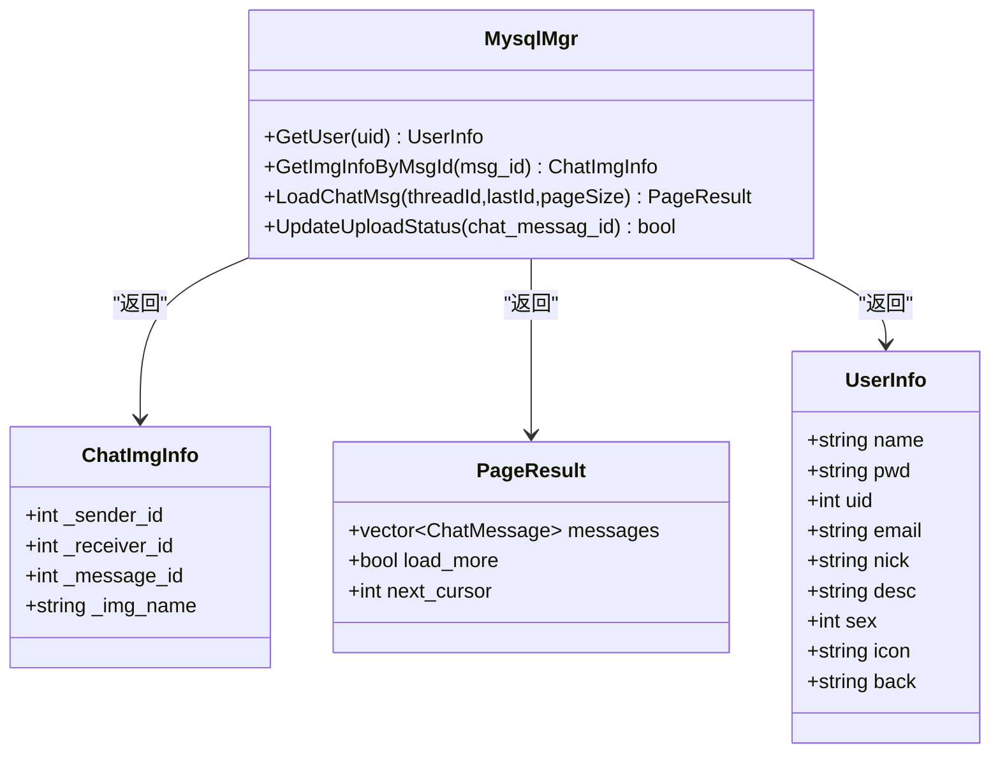
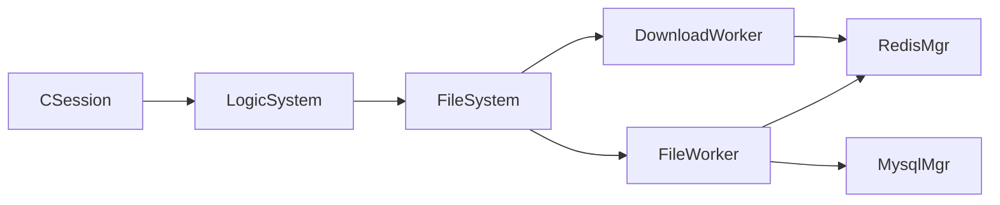

# 资源管理API

<cite>
**本文引用的文件**   
- [FileSystem.h](file://server/ResourceServer/include/FileSystem.h)
- [FileWorker.h](file://server/ResourceServer/include/FileWorker.h)
- [FileInfo.h](file://server/ResourceServer/include/FileInfo.h)
- [LogicSystem.h](file://server/ResourceServer/include/LogicSystem.h)
- [const.h](file://server/ResourceServer/include/const.h)
- [data.h](file://server/ResourceServer/include/data.h)
- [CSession.h](file://server/ResourceServer/include/CSession.h)
- [CSession.cpp](file://server/ResourceServer/src/CSession.cpp)
- [FileWorker.cpp](file://server/ResourceServer/src/FileWorker.cpp)
- [FileSystem.cpp](file://server/ResourceServer/src/FileSystem.cpp)
- [MysqlMgr.h](file://server/ResourceServer/include/MysqlMgr.h)
- [RedisMgr.h](file://server/ResourceServer/include/RedisMgr.h)
</cite>

## 目录
1. [简介](#简介)
2. [项目结构](#项目结构)
3. [核心组件](#核心组件)
4. [架构总览](#架构总览)
5. [详细组件分析](#详细组件分析)
6. [依赖关系分析](#依赖关系分析)
7. [性能考量](#性能考量)
8. [故障排查指南](#故障排查指南)
9. [结论](#结论)
10. [附录：接口规范与示例](#附录接口规范与示例)

## 简介
本文件为资源管理相关的HTTP API文档，覆盖头像上传、文件上传下载、资源查询等能力。结合服务端实现，说明以下要点：
- 头像上传接口（/api/avatar/upload）的文件格式要求、大小限制、裁剪参数支持
- 文件上传的分片上传机制（分片编号、总大小、MD5校验等）
- 文件下载的断点续传实现（Range请求头处理、进度查询接口）
- 资源查询接口的使用方法（按类型、时间、用户等条件筛选）
- 二进制数据处理的正确方式（Base64编解码、分片读写）
- 文件存储策略、访问权限控制、安全防护措施

## 项目结构
资源管理相关代码位于 ResourceServer 模块，采用“会话层 + 逻辑调度 + 工作线程”的架构：
- CSession：网络会话与异步I/O，负责解析消息头与负载，投递到逻辑系统
- LogicSystem：逻辑任务分发，维护MD5到文件信息的映射
- FileSystem：文件系统抽象，持有多个 FileWorker 和 DownloadWorker
- FileWorker / DownloadWorker：分别处理上传与下载任务队列，执行具体业务
- RedisMgr / MysqlMgr：缓存与持久化，支撑断点续传状态、用户信息与聊天图片状态

图表来源
- [CSession.h:1-64](file://server/ResourceServer/include/CSession.h#L1-L64)
- [CSession.cpp:1-244](file://server/ResourceServer/src/CSession.cpp#L1-L244)
- [LogicSystem.h:1-34](file://server/ResourceServer/include/LogicSystem.h#L1-L34)
- [FileSystem.h:1-21](file://server/ResourceServer/include/FileSystem.h#L1-L21)
- [FileWorker.h:1-90](file://server/ResourceServer/include/FileWorker.h#L1-L90)
- [RedisMgr.h:1-313](file://server/ResourceServer/include/RedisMgr.h#L1-L313)
- [MysqlMgr.h:1-44](file://server/ResourceServer/include/MysqlMgr.h#L1-L44)

章节来源
- [CSession.h:1-64](file://server/ResourceServer/include/CSession.h#L1-L64)
- [CSession.cpp:1-244](file://server/ResourceServer/src/CSession.cpp#L1-L244)
- [FileSystem.h:1-21](file://server/ResourceServer/include/FileSystem.h#L1-L21)
- [FileWorker.h:1-90](file://server/ResourceServer/include/FileWorker.h#L1-L90)
- [LogicSystem.h:1-34](file://server/ResourceServer/include/LogicSystem.h#L1-L34)

## 核心组件
- CSession：基于Boost.Asio的异步会话，读取固定长度头部后读取负载，按会话ID哈希将任务投递给逻辑系统
- LogicSystem：单例，维护MD5到FileInfo的映射，提供AddMD5File与GetFileInfo方法
- FileSystem：单例，维护多实例FileWorker与DownloadWorker，提供PostMsgToQue与PostDownloadTaskToQue
- FileWorker：注册多种MSG_IDS处理器，包括上传、头像上传、聊天图片上传、文件信息同步、续传图片等
- DownloadWorker：实现分片下载，使用Redis记录下载进度，支持断点续传
- RedisMgr：连接池、键值操作、分布式锁、下载进度存取
- MysqlMgr：用户信息、聊天消息、头像更新、上传状态更新

章节来源
- [CSession.cpp:1-244](file://server/ResourceServer/src/CSession.cpp#L1-L244)
- [LogicSystem.h:1-34](file://server/ResourceServer/include/LogicSystem.h#L1-L34)
- [FileSystem.h:1-21](file://server/ResourceServer/include/FileSystem.h#L1-L21)
- [FileWorker.h:1-90](file://server/ResourceServer/include/FileWorker.h#L1-L90)
- [RedisMgr.h:1-313](file://server/ResourceServer/include/RedisMgr.h#L1-L313)
- [MysqlMgr.h:1-44](file://server/ResourceServer/include/MysqlMgr.h#L1-L44)

## 架构总览
资源管理流程从网络会话开始，经逻辑调度进入文件工作线程，最终落盘或返回数据；下载流程通过Redis维护分片进度，支持断点续传。

图表来源
- [CSession.cpp:1-244](file://server/ResourceServer/src/CSession.cpp#L1-L244)
- [LogicSystem.h:1-34](file://server/ResourceServer/include/LogicSystem.h#L1-L34)
- [FileSystem.h:1-21](file://server/ResourceServer/include/FileSystem.h#L1-L21)
- [FileWorker.cpp:1-663](file://server/ResourceServer/src/FileWorker.cpp#L1-L663)
- [RedisMgr.h:1-313](file://server/ResourceServer/include/RedisMgr.h#L1-L313)
- [MysqlMgr.h:1-44](file://server/ResourceServer/include/MysqlMgr.h#L1-L44)

## 详细组件分析

### 头像上传接口（/api/avatar/upload）
- 功能：接收客户端上传的头像图片，保存至本地路径并更新用户头像信息
- 文件格式：服务端对负载进行Base64解码后直接写文件，因此客户端应上传常见图片格式（如PNG/JPG/BMP/WebP），由客户端完成裁剪与缩放
- 大小限制：常量MAX_FILE_LEN用于分片大小，头像上传同样遵循分片机制
- 裁剪参数：由客户端在上传前完成裁剪与缩放，服务端不解析裁剪参数
- 关键流程：
  - 客户端计算MD5，构造JSON负载（包含md5、name、seq、trans_size、total_size、token、uid、last、data、last_seq）
  - 服务端FileWorker根据ID_UPLOAD_HEAD_ICON_REQ处理器解码并写入文件
  - 最后一个分片时更新数据库头像字段，并将用户信息写入Redis缓存

图表来源
- [FileWorker.cpp:1-663](file://server/ResourceServer/src/FileWorker.cpp#L1-L663)
- [MysqlMgr.h:1-44](file://server/ResourceServer/include/MysqlMgr.h#L1-L44)
- [RedisMgr.h:1-313](file://server/ResourceServer/include/RedisMgr.h#L1-L313)

章节来源
- [FileWorker.cpp:114-196](file://server/ResourceServer/src/FileWorker.cpp#L114-L196)
- [MysqlMgr.h:35-36](file://server/ResourceServer/include/MysqlMgr.h#L35-L36)
- [RedisMgr.h:269-313](file://server/ResourceServer/include/RedisMgr.h#L269-L313)

### 文件上传（分片上传机制）
- 分片编号：seq（从1开始递增）
- 总大小：total_size（字节）
- MD5校验：md5（客户端计算，用于去重或校验）
- 传输大小：trans_size（当前累计已传输字节数）
- 最后分片标记：last（1表示最后一个分片）
- 负载数据：data（Base64编码的二进制分片）
- 其他参数：name（文件名）、token（鉴权）、uid（用户ID）、last_seq（总片数）
- 服务端处理：
  - FileWorker::RegisterHandlers中注册ID_UPLOAD_FILE_REQ处理器
  - 首包以trunc模式打开文件，后续分片以append模式追加
  - 写入失败返回错误码（如FileWritePermissionFailed）

图表来源
- [FileWorker.cpp:49-112](file://server/ResourceServer/src/FileWorker.cpp#L49-L112)
- [CSession.cpp:100-125](file://server/ResourceServer/src/CSession.cpp#L100-L125)
- [LogicSystem.h:21-23](file://server/ResourceServer/include/LogicSystem.h#L21-L23)

章节来源
- [FileWorker.cpp:49-112](file://server/ResourceServer/src/FileWorker.cpp#L49-L112)
- [const.h:72-95](file://server/ResourceServer/include/const.h#L72-L95)

### 文件下载（断点续传）
- 分片下载：DownloadWorker按seq定位偏移量offset=(seq-1)*MAX_FILE_LEN，读取最多MAX_FILE_LEN字节
- 进度存储：首次下载初始化FileInfo（total_size、trans_size、seq），写入Redis；后续下载从Redis恢复
- 响应字段：data（Base64编码的分片数据）、seq、total_size、current_size、is_last
- 完成清理：最后一个分片完成后删除Redis中的下载信息
- Range请求头：服务端未直接解析HTTP Range，而是通过自定义seq与offset实现断点续传

图表来源
- [FileWorker.cpp:528-663](file://server/ResourceServer/src/FileWorker.cpp#L528-L663)
- [RedisMgr.h:303-313](file://server/ResourceServer/include/RedisMgr.h#L303-L313)

章节来源
- [FileWorker.cpp:528-663](file://server/ResourceServer/src/FileWorker.cpp#L528-L663)
- [RedisMgr.h:303-313](file://server/ResourceServer/include/RedisMgr.h#L303-L313)

### 资源查询接口
- 聊天图片资源：通过ChatImgInfo与MysqlMgr提供的查询接口，可按message_id获取图片信息
- 聊天消息分页：PageResult包含messages、load_more、next_cursor，支持按threadId与lastId分页
- 用户信息：UserInfo包含icon、back等字段，头像更新后需刷新缓存

图表来源
- [FileInfo.h:17-25](file://server/ResourceServer/include/FileInfo.h#L17-L25)
- [data.h:54-58](file://server/ResourceServer/include/data.h#L54-L58)
- [MysqlMgr.h:21-38](file://server/ResourceServer/include/MysqlMgr.h#L21-L38)

章节来源
- [FileInfo.h:17-25](file://server/ResourceServer/include/FileInfo.h#L17-L25)
- [data.h:54-58](file://server/ResourceServer/include/data.h#L54-L58)
- [MysqlMgr.h:21-38](file://server/ResourceServer/include/MysqlMgr.h#L21-L38)

## 依赖关系分析
- CSession依赖LogicSystem进行任务分发
- LogicSystem依赖FileSystem进行文件操作
- FileSystem依赖FileWorker与DownloadWorker
- FileWorker依赖RedisMgr与MysqlMgr进行状态与持久化
- DownloadWorker依赖RedisMgr进行断点续传状态管理

图表来源
- [CSession.cpp:100-125](file://server/ResourceServer/src/CSession.cpp#L100-L125)
- [LogicSystem.h:21-23](file://server/ResourceServer/include/LogicSystem.h#L21-L23)
- [FileSystem.h:9-17](file://server/ResourceServer/include/FileSystem.h#L9-L17)
- [FileWorker.h:58-73](file://server/ResourceServer/include/FileWorker.h#L58-L73)
- [RedisMgr.h:269-313](file://server/ResourceServer/include/RedisMgr.h#L269-L313)
- [MysqlMgr.h:9-42](file://server/ResourceServer/include/MysqlMgr.h#L9-L42)

章节来源
- [CSession.cpp:100-125](file://server/ResourceServer/src/CSession.cpp#L100-L125)
- [LogicSystem.h:21-23](file://server/ResourceServer/include/LogicSystem.h#L21-L23)
- [FileSystem.h:9-17](file://server/ResourceServer/include/FileSystem.h#L9-L17)
- [FileWorker.h:58-73](file://server/ResourceServer/include/FileWorker.h#L58-L73)
- [RedisMgr.h:269-313](file://server/ResourceServer/include/RedisMgr.h#L269-L313)
- [MysqlMgr.h:9-42](file://server/ResourceServer/include/MysqlMgr.h#L9-L42)

## 性能考量
- 分片大小：MAX_FILE_LEN决定分片大小，影响内存占用与网络吞吐
- 并发模型：LogicWorker与FileWorker/DownloadWorker数量由常量配置，避免阻塞
- I/O优化：首包trunc、后续app模式减少重复写入；随机读定位offset提升下载效率
- 缓存策略：Redis用于断点续传状态与用户信息缓存，降低数据库压力
- 错误处理：文件读写失败、序列号不匹配、偏移越界等均有明确错误码

[本节为通用指导，无需引用具体文件]

## 故障排查指南
- 文件写入失败：检查目录权限与磁盘空间，错误码FileWritePermissionFailed
- 文件不存在：错误码FileNotExists，确认路径与文件名
- 序列号不匹配：错误码FileSeqInvalid，确保客户端与服务端seq一致
- 偏移量越界：错误码FileOffsetInvalid，检查total_size与seq计算
- Redis读取失败：错误码RedisReadErr，检查Redis连接与键是否存在
- 文件读取失败：错误码FileReadFailed，检查文件可读性

章节来源
- [const.h:5-29](file://server/ResourceServer/include/const.h#L5-L29)
- [FileWorker.cpp:540-663](file://server/ResourceServer/src/FileWorker.cpp#L540-L663)

## 结论
资源管理API通过清晰的职责分离与异步I/O模型，实现了高效的头像上传、文件分片上传与断点续传下载。结合Redis与MySQL，提供了可靠的进度管理与持久化能力。建议在生产环境中加强输入校验、安全策略与监控告警，以提升系统的健壮性与可观测性。

[本节为总结性内容，无需引用具体文件]

## 附录：接口规范与示例

### 头像上传接口（/api/avatar/upload）
- 请求方法：POST
- 请求体：JSON
  - md5：字符串，文件MD5
  - name：字符串，文件名
  - seq：整数，分片序号（从1开始）
  - trans_size：整数，累计已传输字节数
  - total_size：整数，文件总大小
  - token：字符串，鉴权令牌
  - uid：整数，用户ID
  - last：整数，是否最后分片（1/0）
  - data：字符串，Base64编码的分片数据
  - last_seq：整数，总分片数
- 响应体：JSON
  - error：整数，错误码（0表示成功）
- 注意事项：
  - 客户端需在上传前完成裁剪与缩放
  - 支持常见图片格式（PNG/JPG/BMP/WebP）
  - 最后一个分片会触发头像更新与缓存刷新

章节来源
- [FileWorker.cpp:114-196](file://server/ResourceServer/src/FileWorker.cpp#L114-L196)
- [MysqlMgr.h:35-36](file://server/ResourceServer/include/MysqlMgr.h#L35-L36)
- [RedisMgr.h:269-313](file://server/ResourceServer/include/RedisMgr.h#L269-L313)

### 文件上传接口（分片上传）
- 请求方法：POST
- 请求体：JSON（同头像上传，但用于任意文件）
- 响应体：JSON（error字段）
- 注意事项：
  - 首包以trunc模式打开文件，后续分片以append模式追加
  - 服务端不校验MD5，仅做写入与回调

章节来源
- [FileWorker.cpp:49-112](file://server/ResourceServer/src/FileWorker.cpp#L49-L112)

### 文件下载接口（断点续传）
- 请求方法：GET
- 请求参数：
  - name：字符串，文件名
  - seq：整数，分片序号
- 响应体：JSON
  - data：字符串，Base64编码的分片数据
  - seq：整数，当前分片序号
  - total_size：字符串，文件总大小
  - current_size：字符串，当前已传输字节数
  - is_last：布尔，是否最后分片
- 注意事项：
  - 首次下载（seq=1）会初始化进度并写入Redis
  - 后续下载从Redis恢复进度，支持断点续传
  - 最后一个分片完成后清理Redis进度

章节来源
- [FileWorker.cpp:528-663](file://server/ResourceServer/src/FileWorker.cpp#L528-L663)
- [RedisMgr.h:303-313](file://server/ResourceServer/include/RedisMgr.h#L303-L313)

### 资源查询接口
- 聊天图片查询：
  - 输入：message_id（整数）
  - 输出：ChatImgInfo（sender_id、receiver_id、message_id、img_name）
- 聊天消息分页：
  - 输入：threadId（整数）、lastId（整数）、pageSize（整数）
  - 输出：PageResult（messages、load_more、next_cursor）
- 用户信息查询：
  - 输入：uid（整数）
  - 输出：UserInfo（name、pwd、uid、email、nick、desc、sex、icon、back）

章节来源
- [MysqlMgr.h:21-38](file://server/ResourceServer/include/MysqlMgr.h#L21-L38)
- [data.h:54-58](file://server/ResourceServer/include/data.h#L54-L58)
- [FileInfo.h:17-25](file://server/ResourceServer/include/FileInfo.h#L17-L25)

### 二进制数据处理示例
- 上传：客户端将分片二进制数据Base64编码后放入data字段
- 下载：服务端读取二进制数据后Base64编码返回，客户端解码后拼接分片

章节来源
- [FileWorker.cpp:629-631](file://server/ResourceServer/src/FileWorker.cpp#L629-L631)

### 文件存储策略
- 存储位置：本地文件系统，路径由客户端指定（path/name）
- 目录管理：自动创建缺失目录
- 权限控制：文件读写权限由操作系统与进程权限决定

章节来源
- [FileWorker.cpp:66-74](file://server/ResourceServer/src/FileWorker.cpp#L66-L74)

### 访问权限控制
- 鉴权：token与uid用于身份验证
- 分布式锁：RedisMgr提供acquireLock/releaseLock接口

章节来源
- [RedisMgr.h:293-297](file://server/ResourceServer/include/RedisMgr.h#L293-L297)

### 安全防护措施
- 输入校验：msg_id与msg_len合法性检查
- 错误码：统一错误码体系便于客户端处理
- 异常处理：网络I/O异常捕获与连接清理

章节来源
- [CSession.cpp:156-173](file://server/ResourceServer/src/CSession.cpp#L156-L173)
- [const.h:5-29](file://server/ResourceServer/include/const.h#L5-L29)