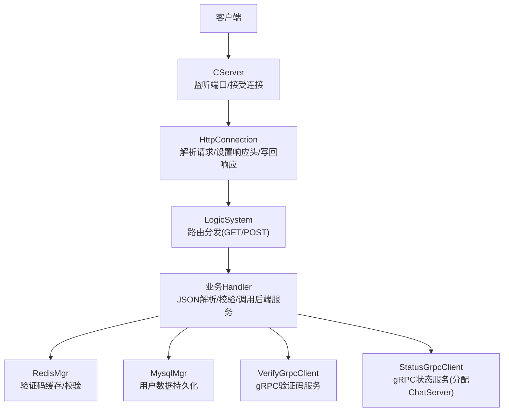
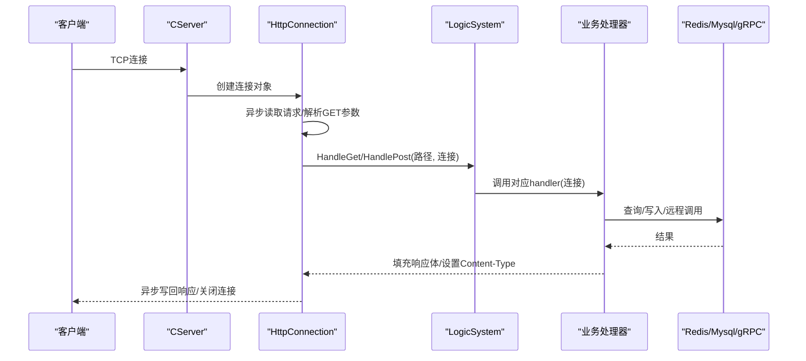
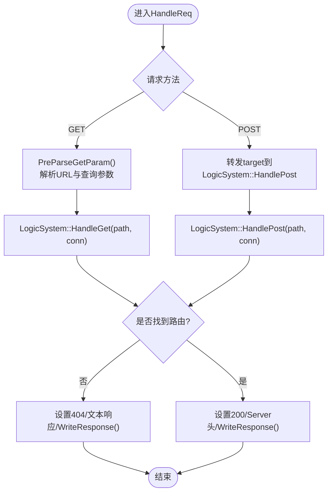
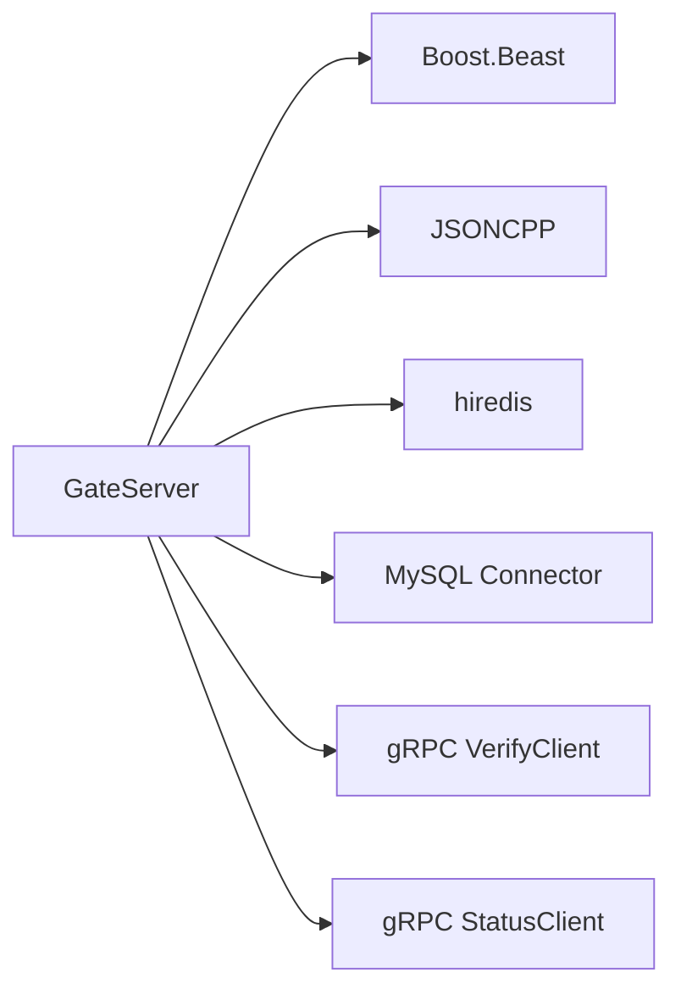
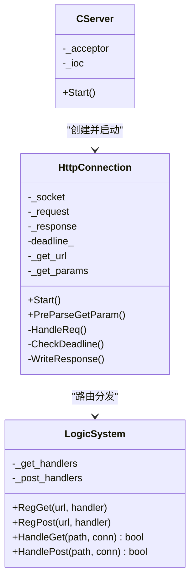

# 通用接口

<cite>
**本文引用的文件**   
- [HttpConnection.cpp](file://server/GateServer/src/HttpConnection.cpp)
- [HttpConnection.h](file://server/GateServer/include/HttpConnection.h)
- [LogicSystem.cpp](file://server/GateServer/src/LogicSystem.cpp)
- [LogicSystem.h](file://server/GateServer/include/LogicSystem.h)
- [CServer.cpp](file://server/GateServer/src/CServer.cpp)
- [CServer.h](file://server/GateServer/include/CServer.h)
- [GateServer.cpp](file://server/GateServer/src/GateServer.cpp)
- [const.h](file://server/GateServer/include/const.h)
- [config.ini（GateServer）](file://server/GateServer/config/config.ini)
- [httpmgr.cpp](file://client/llfcchat/src/httpmgr.cpp)
- [httpmgr.h](file://client/llfcchat/include/httpmgr.h)
- [global.h](file://client/llfcchat/include/global.h)
</cite>

## 目录
1. [简介](#简介)
2. [项目结构](#项目结构)
3. [核心组件](#核心组件)
4. [架构总览](#架构总览)
5. [详细组件分析](#详细组件分析)
6. [依赖分析](#依赖分析)
7. [性能考虑](#性能考虑)
8. [故障排查指南](#故障排查指南)
9. [结论](#结论)
10. [附录](#附录)

## 简介
本文件为通用HTTP接口的规范文档，面向GateServer提供的HTTP网关能力。当前代码库已实现基于Boost.Beast的HTTP网关、路由分发与业务处理框架，并包含若干示例与业务接口（如验证码、注册、重置密码、登录等）。本文在此基础上，补充并统一健康检查、版本信息、配置获取等基础接口规范，明确错误码与响应格式，给出限流、访问日志、监控指标等通用能力的建议方案，并提供客户端集成指南与最佳实践。

## 项目结构
GateServer作为HTTP入口，采用“连接层 + 路由层 + 业务处理器”的分层设计：
- 连接层：负责TCP连接生命周期、HTTP请求解析、超时控制与响应发送
- 路由层：维护GET/POST路由表，将URL路径映射到具体处理函数
- 业务层：各业务接口在路由注册时以lambda形式绑定处理逻辑

图表来源
- [CServer.cpp:10-33](file://server/GateServer/src/CServer.cpp#L10-L33)
- [HttpConnection.cpp:132-194](file://server/GateServer/src/HttpConnection.cpp#L132-L194)
- [LogicSystem.cpp:448-477](file://server/GateServer/src/LogicSystem.cpp#L448-L477)

章节来源
- [CServer.cpp:1-36](file://server/GateServer/src/CServer.cpp#L1-L36)
- [HttpConnection.cpp:1-225](file://server/GateServer/src/HttpConnection.cpp#L1-L225)
- [LogicSystem.cpp:1-477](file://server/GateServer/src/LogicSystem.cpp#L1-L477)

## 核心组件
- HTTP连接管理（HttpConnection）
  - 异步读取请求、解析GET参数、设置响应头（含CORS）、统一返回404未找到路由、短连接模式、超时关闭
- 路由系统（LogicSystem）
  - 提供RegGet/RegPost注册接口；HandleGet/HandlePost按路径分发；支持lambda处理器接收HttpConnection指针
- 服务器启动（CServer/GateServer）
  - 初始化IO上下文、信号处理、端口监听、连接分发
- 配置管理（ConfigMgr）
  - 从配置文件读取服务地址、端口等运行时参数
- 客户端HTTP封装（HttpMgr）
  - Qt网络模块封装，统一POST请求、错误回调、模块级信号分发

章节来源
- [HttpConnection.h:1-36](file://server/GateServer/include/HttpConnection.h#L1-L36)
- [HttpConnection.cpp:96-130](file://server/GateServer/src/HttpConnection.cpp#L96-L130)
- [HttpConnection.cpp:132-194](file://server/GateServer/src/HttpConnection.cpp#L132-L194)
- [LogicSystem.h:1-24](file://server/GateServer/include/LogicSystem.h#L1-L24)
- [LogicSystem.cpp:416-477](file://server/GateServer/src/LogicSystem.cpp#L416-L477)
- [CServer.cpp:1-36](file://server/GateServer/src/CServer.cpp#L1-L36)
- [GateServer.cpp:131-163](file://server/GateServer/src/GateServer.cpp#L131-L163)
- [httpmgr.cpp:1-62](file://client/llfcchat/src/httpmgr.cpp#L1-L62)
- [httpmgr.h:1-34](file://client/llfcchat/include/httpmgr.h#L1-L34)

## 架构总览
GateServer通过CServer监听端口，接受连接后交由HttpConnection处理HTTP协议细节，随后由LogicSystem根据URL路径分发至对应业务处理器。业务处理器可调用Redis、MySQL以及gRPC服务完成验证码、用户认证、会话分配等操作。

图表来源
- [CServer.cpp:10-33](file://server/GateServer/src/CServer.cpp#L10-L33)
- [HttpConnection.cpp:132-194](file://server/GateServer/src/HttpConnection.cpp#L132-L194)
- [LogicSystem.cpp:448-477](file://server/GateServer/src/LogicSystem.cpp#L448-L477)

## 详细组件分析

### HTTP连接与路由分发
- 请求处理流程
  - GET：解析URL与查询参数，调用LogicSystem::HandleGet
  - POST：直接转发target到LogicSystem::HandlePost
  - 未匹配路由：返回404，Content-Type=text/plain，响应体提示url not found
- 响应设置
  - keep_alive=false（短连接）
  - 设置Server=GateServer
  - CORS允许所有来源（生产环境应限制）
- 超时控制
  - 使用定时器对连接处理设置截止时间，超时关闭socket

图表来源
- [HttpConnection.cpp:132-194](file://server/GateServer/src/HttpConnection.cpp#L132-L194)
- [HttpConnection.cpp:96-130](file://server/GateServer/src/HttpConnection.cpp#L96-L130)
- [LogicSystem.cpp:448-477](file://server/GateServer/src/LogicSystem.cpp#L448-L477)

章节来源
- [HttpConnection.cpp:132-194](file://server/GateServer/src/HttpConnection.cpp#L132-L194)
- [HttpConnection.cpp:196-225](file://server/GateServer/src/HttpConnection.cpp#L196-L225)
- [LogicSystem.cpp:416-477](file://server/GateServer/src/LogicSystem.cpp#L416-L477)

### 现有业务接口概览（用于参考）
- GET /get_test：回显GET参数（验证参数解析）
- POST /test_procedure：测试MySQL存储过程调用
- POST /get_varifycode：获取邮箱验证码（调用VarifyServer gRPC，验证码存入Redis）
- POST /user_register：用户注册（校验密码一致性、验证码有效性、数据库唯一性）
- POST /reset_pwd：重置密码（验证码校验、用户名邮箱匹配、更新密码）
- POST /user_login：用户登录（校验密码、分配ChatServer、返回资源服务器信息）

章节来源
- [LogicSystem.cpp:36-406](file://server/GateServer/src/LogicSystem.cpp#L36-L406)

### 新增基础接口规范

#### 健康检查接口 /api/health
- 方法：GET
- 功能：返回服务整体健康状态及关键依赖组件状态
- 请求参数：无
- 响应体字段（JSON）
  - error：整数错误码（成功为0）
  - status：字符串，服务状态（如 ok/degraded/down）
  - components：对象，包含依赖组件状态
    - mysql：对象，包含 status（ok/error）、latency_ms（毫秒）
    - redis：对象，包含 status（ok/error）、latency_ms
    - verify_grpc：对象，包含 status（ok/error）、latency_ms
    - status_grpc：对象，包含 status（ok/error）、latency_ms
  - uptime_seconds：浮点，服务运行时长
- 错误码：沿用全局错误码定义（见“错误码与响应格式”）
- 说明：该接口用于外部监控系统探测服务可用性，建议在LogicSystem中注册新路由实现

章节来源
- [const.h:32-45](file://server/GateServer/include/const.h#L32-L45)

#### 版本信息接口 /api/version
- 方法：GET
- 功能：返回应用版本、构建信息与依赖库版本
- 请求参数：无
- 响应体字段（JSON）
  - error：整数错误码（成功为0）
  - app_version：字符串，应用版本号
  - build_time：字符串，构建时间戳
  - git_commit：字符串，提交哈希
  - dependencies：对象
    - boost_beast：字符串
    - jsoncpp：字符串
    - hiredis：字符串
    - mysql_connector：字符串
- 说明：可在编译期注入版本信息，或在启动时读取配置文件/环境变量

章节来源
- [GateServer.cpp:131-163](file://server/GateServer/src/GateServer.cpp#L131-L163)

#### 配置获取接口 /api/config
- 方法：GET
- 功能：动态获取当前生效的配置片段（仅暴露只读必要项）
- 请求参数：可选 key（如 GateServer/ResServer），不传则返回全部白名单配置
- 响应体字段（JSON）
  - error：整数错误码（成功为0）
  - config：对象，键值对形式的配置快照
- 安全建议：仅暴露白名单字段（如Host、Port），避免泄露敏感信息（密码等）

章节来源
- [config.ini（GateServer）:1-25](file://server/GateServer/config/config.ini#L1-L25)

### 统一错误码与响应格式
- 错误码定义（部分）
  - Success：0
  - Error_Json：1001
  - RPCFailed：1002
  - VarifyExpired：1003
  - VarifyCodeErr：1004
  - UserExist：1005
  - PasswdErr：1006
  - EmailNotMatch：1007
  - PasswdUpFailed：1008
  - PasswdInvalid：1009
  - TokenInvalid：1010
  - UidInvalid：1011
- 响应格式约定
  - 成功：error=0，附带业务字段
  - 失败：error≠0，至少包含error字段；必要时附加msg或detail
  - Content-Type：text/json（JSON响应）或 text/plain（错误提示）

章节来源
- [const.h:32-45](file://server/GateServer/include/const.h#L32-L45)

### 限流、访问日志与监控指标（建议）
- 限流
  - 建议在GateServer入口处增加令牌桶/漏桶策略，按IP或API维度限流
  - 超限返回429，并在响应头携带Retry-After
- 访问日志
  - 记录请求ID、时间戳、客户端IP、方法、路径、状态码、耗时、UA
  - 异步落盘，避免阻塞主流程
- 监控指标
  - 请求总量、成功率、P95/P99延迟、错误率、连接数、CPU/内存
  - 暴露Prometheus端点或上报至APM平台

[本节为通用建议，不直接分析具体文件]

### 客户端集成指南与最佳实践
- 客户端HTTP封装（Qt）
  - 使用QNetworkAccessManager发起POST请求，设置Content-Type为application/json
  - 统一错误处理：网络错误、JSON解析错误、业务错误码
  - 模块级信号分发：注册、重置、登录等模块分别处理响应
- 最佳实践
  - 重试与退避：对瞬时错误（网络抖动、限流）进行指数退避重试
  - 超时控制：合理设置请求超时，避免长尾阻塞
  - 鉴权与会话：登录后保存token，后续请求携带认证头
  - 幂等性：对写操作保证幂等，避免重复提交
  - 降级与熔断：依赖服务不可用时快速失败，保护主流程

章节来源
- [httpmgr.cpp:1-62](file://client/llfcchat/src/httpmgr.cpp#L1-L62)
- [httpmgr.h:1-34](file://client/llfcchat/include/httpmgr.h#L1-L34)
- [global.h:91-101](file://client/llfcchat/include/global.h#L91-L101)

## 依赖分析
GateServer依赖以下子系统：
- Boost.Asio/Beast：HTTP/TCP异步I/O
- JSONCPP：JSON序列化/反序列化
- hiredis：Redis客户端
- MySQL Connector/C++：数据库访问
- gRPC客户端：验证码服务、状态服务

图表来源
- [GateServer.cpp:1-163](file://server/GateServer/src/GateServer.cpp#L1-L163)
- [LogicSystem.cpp:1-477](file://server/GateServer/src/LogicSystem.cpp#L1-L477)

章节来源
- [GateServer.cpp:1-163](file://server/GateServer/src/GateServer.cpp#L1-L163)
- [LogicSystem.cpp:1-477](file://server/GateServer/src/LogicSystem.cpp#L1-L477)

## 性能考虑
- 连接模型：短连接（keep_alive=false），减少连接保持开销
- 超时控制：连接处理设置截止时间，防止慢连接占用资源
- I/O并发：AsioIOServicePool复用IO线程，提升吞吐
- 序列化：JSON解析与构造尽量复用对象，避免频繁分配
- 依赖调用：对Redis/MySQL/gRPC调用设置超时与重试上限，避免雪崩

[本节为通用建议，不直接分析具体文件]

## 故障排查指南
- 常见问题
  - 404未找到路由：检查LogicSystem是否正确注册对应路径
  - JSON解析失败：确认请求体结构与字段名一致
  - 验证码过期/错误：检查Redis中验证码key是否存在且未过期
  - gRPC调用失败：检查目标服务可达性与端口配置
  - 数据库异常：检查连接串、权限与SQL执行结果
- 定位手段
  - 查看服务端日志输出（请求体、错误码、堆栈）
  - 检查配置文件中的服务地址与端口
  - 使用curl或客户端调试工具模拟请求

章节来源
- [LogicSystem.cpp:36-406](file://server/GateServer/src/LogicSystem.cpp#L36-L406)
- [config.ini（GateServer）:1-25](file://server/GateServer/config/config.ini#L1-L25)

## 结论
GateServer提供了稳定的HTTP网关与路由分发能力，结合Redis、MySQL与gRPC实现了完整的用户认证与消息通信链路。本文在此基础上补充了健康检查、版本信息、配置获取等基础接口规范，明确了错误码与响应格式，并给出了限流、日志、监控等通用能力的建议方案。客户端侧通过统一的HTTP封装与错误处理机制，可实现稳定可靠的集成。

[本节为总结，不直接分析具体文件]

## 附录

### 类关系图（GateServer核心）

图表来源
- [CServer.h:1-16](file://server/GateServer/include/CServer.h#L1-L16)
- [CServer.cpp:1-36](file://server/GateServer/src/CServer.cpp#L1-L36)
- [HttpConnection.h:1-36](file://server/GateServer/include/HttpConnection.h#L1-L36)
- [LogicSystem.h:1-24](file://server/GateServer/include/LogicSystem.h#L1-L24)

章节来源
- [CServer.h:1-16](file://server/GateServer/include/CServer.h#L1-L16)
- [CServer.cpp:1-36](file://server/GateServer/src/CServer.cpp#L1-L36)
- [HttpConnection.h:1-36](file://server/GateServer/include/HttpConnection.h#L1-L36)
- [LogicSystem.h:1-24](file://server/GateServer/include/LogicSystem.h#L1-L24)