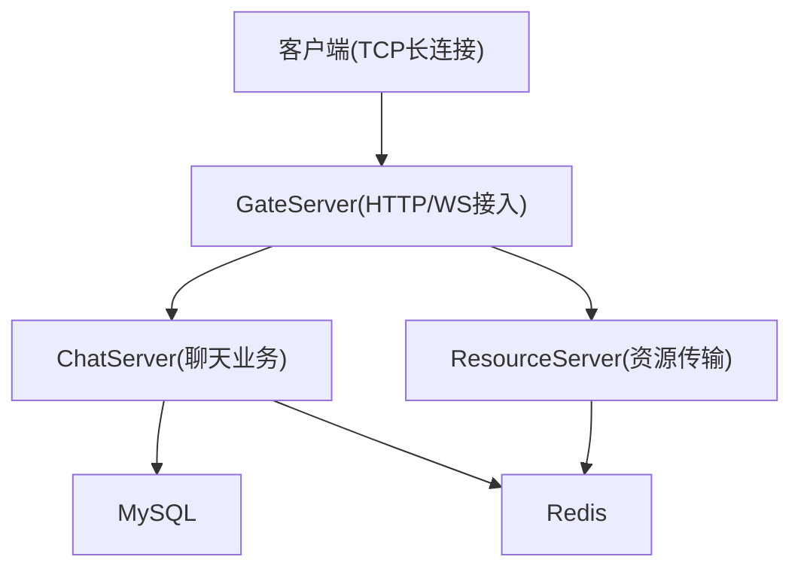
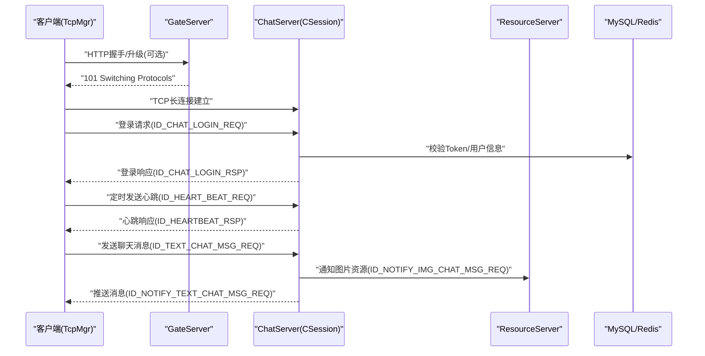
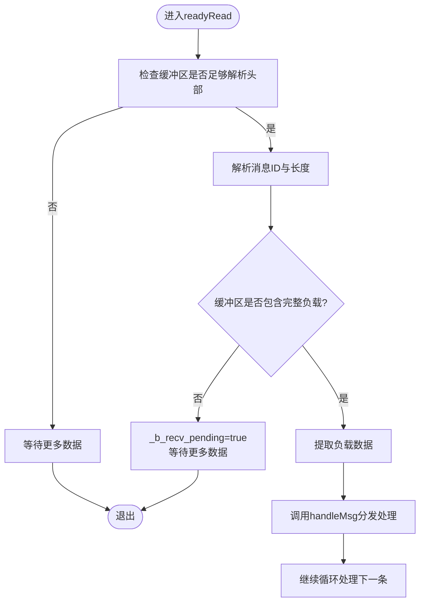
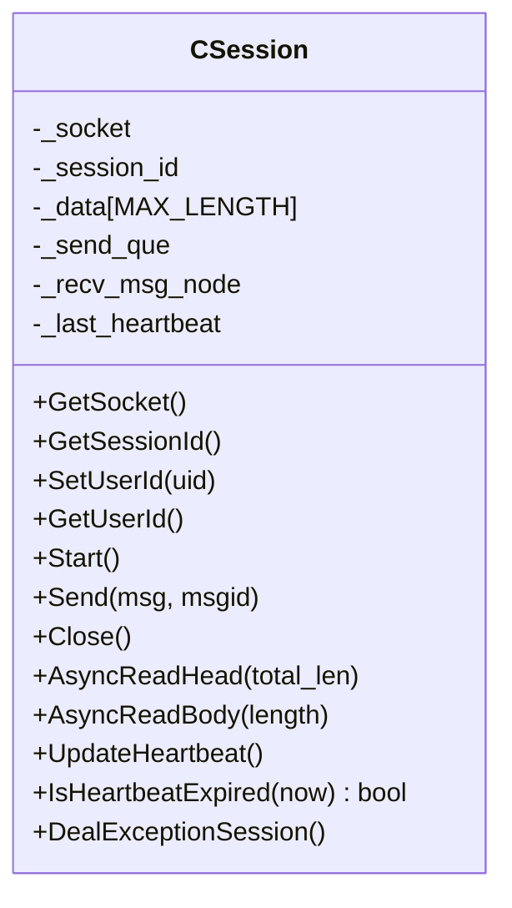
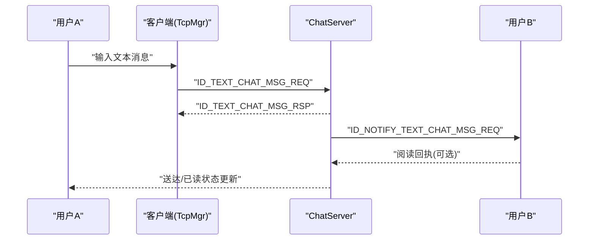
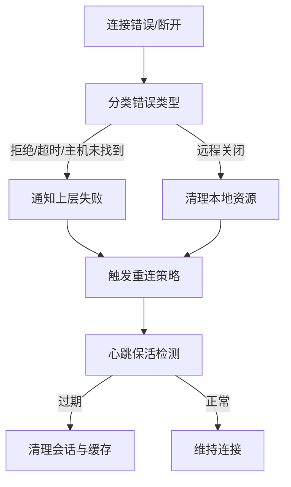
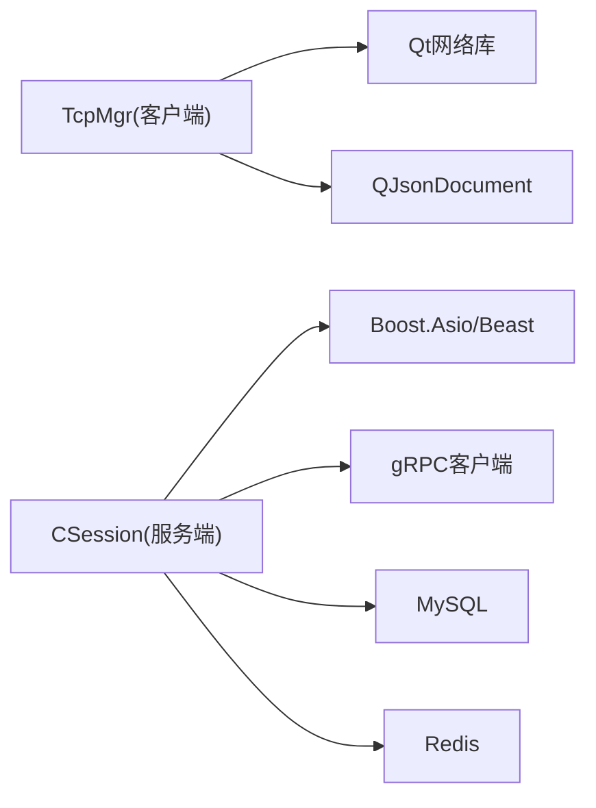

# WebSocket实时通信接口

<cite>
**本文引用的文件**   
- [tcpmgr.h](file://client/llfcchat/include/tcpmgr.h)
- [tcpmgr.cpp](file://client/llfcchat/src/tcpmgr.cpp)
- [global.h](file://client/llfcchat/include/global.h)
- [CSession.h](file://server/ChatServer/include/CSession.h)
- [const.h](file://server/ChatServer/include/const.h)
- [message.proto（聊天）](file://server/proto/chat/message.proto)
- [message.proto（资源）](file://server/proto/resource/message.proto)
- [LogicSystem.cpp](file://server/ChatServer/src/LogicSystem.cpp)
- [day35心跳逻辑.md](file://开发文档/day35心跳逻辑.md)
- [day29-好友认证和聊天通信.md](file://开发文档/day29-好友认证和聊天通信.md)
- [day42-用户加载聊天资源.md](file://开发文档/day42-用户加载聊天资源.md)
- [day38-断点续传.md](file://开发文档/day38-断点续传.md)
- [day31-文件传输.md](file://开发文档/day31-文件传输.md)
- [HttpConnection.cpp](file://server/GateServer/src/HttpConnection.cpp)
- [RedisMgr.h（GateServer）](file://server/GateServer/include/RedisMgr.h)
- [MysqlDao.h（ChatServer）](file://server/ChatServer/include/MysqlDao.h)
</cite>

## 目录
1. [简介](#简介)
2. [项目结构](#项目结构)
3. [核心组件](#核心组件)
4. [架构总览](#架构总览)
5. [详细组件分析](#详细组件分析)
6. [依赖关系分析](#依赖关系分析)
7. [性能考虑](#性能考虑)
8. [故障排查指南](#故障排查指南)
9. [结论](#结论)
10. [附录](#附录)

## 简介
本文件为 LLFCChat 项目的“WebSocket 实时通信接口”提供完整技术文档。尽管客户端使用 TCP 长连接实现消息通道，但整体协议与交互模式遵循 WebSocket 的常见范式：基于请求-响应的事件驱动、帧式消息头+负载、序列号机制、心跳保活、断线重连与异常恢复等。本文重点说明：
- 长连接建立过程（握手、鉴权、参数配置）
- 消息帧格式（头部、负载、序列号、心跳包）
- 事件类型与处理逻辑（聊天消息、好友申请、系统通知等）
- 连接状态管理（重连、断线检测、异常恢复）
- 客户端集成指南（连接池、消息队列、错误重试）

## 项目结构
本项目采用多服务架构：
- 客户端（Qt/C++）通过 TCP 长连接与服务器通信，封装了粘包/拆包、发送队列、事件分发等能力。
- GateServer 负责 HTTP/WebSocket 接入与鉴权转发。
- ChatServer 承载聊天业务逻辑、会话管理与消息路由。
- ResourceServer 负责文件与图片等资源传输。
- StatusServer 与 VarifyServer 分别提供状态与验证码等服务。



图表来源
- [CSession.h](file://server/ChatServer/include/CSession.h)
- [HttpConnection.cpp](file://server/GateServer/src/HttpConnection.cpp)

章节来源
- [tcpmgr.h](file://client/llfcchat/include/tcpmgr.h)
- [tcpmgr.cpp](file://client/llfcchat/src/tcpmgr.cpp)
- [CSession.h](file://server/ChatServer/include/CSession.h)
- [HttpConnection.cpp](file://server/GateServer/src/HttpConnection.cpp)

## 核心组件
- 客户端 TcpMgr：封装 QTcpSocket，实现粘包/拆包、发送队列、事件注册与分发、错误处理与断开回调。
- 服务端 CSession：基于 Boost.Asio/Beast 的会话对象，维护收发缓冲、心跳时间戳、发送队列与异步读写。
- 协议常量与枚举：全局 ReqId、MSG_IDS、ErrorCodes 等定义消息ID与错误码。
- Proto 定义：聊天与资源模块的消息体结构（文本、图片、通知、踢人等）。

章节来源
- [tcpmgr.h](file://client/llfcchat/include/tcpmgr.h)
- [tcpmgr.cpp](file://client/llfcchat/src/tcpmgr.cpp)
- [global.h](file://client/llfcchat/include/global.h)
- [const.h](file://server/ChatServer/include/const.h)
- [message.proto（聊天）](file://server/proto/chat/message.proto)
- [message.proto（资源）](file://server/proto/resource/message.proto)

## 架构总览
下图展示从客户端到服务器的关键交互路径，包括连接建立、鉴权、消息收发与心跳。



图表来源
- [HttpConnection.cpp](file://server/GateServer/src/HttpConnection.cpp)
- [CSession.h](file://server/ChatServer/include/CSession.h)
- [message.proto（聊天）](file://server/proto/chat/message.proto)
- [message.proto（资源）](file://server/proto/resource/message.proto)

## 详细组件分析

### 客户端 TcpMgr（TCP长连接与消息帧）
- 连接生命周期
  - 连接成功触发 connected 信号，向上层发出连接成功回调。
  - readyRead 中循环读取数据，先解析头部（消息ID+长度），再按长度读取负载，调用 handleMsg 分发给对应处理器。
  - error/disconnected 信号用于错误分类与连接关闭通知。
- 发送流程
  - slot_send_data 将 ReqId 与负载组装成块（大端序），若正在发送则入队；否则直接 write，并在 bytesWritten 回调中推进发送。
- 粘包/拆包
  - 使用 _buffer 累积数据，_b_recv_pending 标记是否等待完整负载；每次解析后移除已消费字节。
- 事件分发
  - initHandlers 注册各 ReqId 的处理函数，handleMsg 根据 ID 查找并执行。



图表来源
- [tcpmgr.cpp](file://client/llfcchat/src/tcpmgr.cpp)

章节来源
- [tcpmgr.h](file://client/llfcchat/include/tcpmgr.h)
- [tcpmgr.cpp](file://client/llfcchat/src/tcpmgr.cpp)
- [day42-用户加载聊天资源.md](file://开发文档/day42-用户加载聊天资源.md)

### 服务端 CSession（会话与心跳）
- 会话属性
  - 维护 socket、session_id、用户uid、发送队列、接收节点、上次心跳时间戳。
- 心跳机制
  - UpdateHeartbeat 更新最近心跳时间；IsHeartbeatExpired 判断是否过期（阈值由服务器策略决定）。
  - LogicSystem::HeartBeatHandler 解析心跳请求并返回心跳响应。
- 异常处理
  - DealExceptionSession 用于异常连接的清理与资源释放。



图表来源
- [CSession.h](file://server/ChatServer/include/CSession.h)

章节来源
- [CSession.h](file://server/ChatServer/include/CSession.h)
- [LogicSystem.cpp](file://server/ChatServer/src/LogicSystem.cpp)
- [day35心跳逻辑.md](file://开发文档/day35心跳逻辑.md)

### 协议与消息帧格式
- 帧头部
  - 客户端侧：消息ID（ReqId，16位）+ 负载长度（quint16，16位），大端序。
  - 服务器侧：HEAD_TOTAL_LEN=4，其中 HEAD_ID_LEN=2，HEAD_DATA_LEN=2。
- 负载数据
  - 聊天模块：TextChatData（unique_id、msg_id、msgcontent、chat_time）、TextChatMsgReq/Rsp、NotifyChatImgReq/Rsp、KickUserReq/Rsp 等。
  - 资源模块：图片上传/下载、文件同步、续传等消息体。
- 序列号机制
  - 文件/图片传输使用 seq 字段进行分片与确认，结合 md5 与 total_size 实现断点续传与完整性校验。
- 心跳包
  - 客户端周期性发送 ID_HEART_BEAT_REQ，服务器返回 ID_HEARTBEAT_RSP。

```mermaid
erDiagram
TEXTCHATDATA {
string unique_id
int32 msg_id
string msgcontent
string chat_time
}
TEXTCHATMSGREQ {
int32 fromuid
int32 touid
int32 thread_id
repeated TextChatData textmsgs
}
NOTIFYCHATIMGREQ {
int32 from_uid
int32 to_uid
int32 message_id
string file_name
int64 total_size
int32 thread_id
}
KICKUSERREQ {
int32 uid
}
```

图表来源
- [message.proto（聊天）](file://server/proto/chat/message.proto)
- [message.proto（资源）](file://server/proto/resource/message.proto)

章节来源
- [global.h](file://client/llfcchat/include/global.h)
- [const.h](file://server/ChatServer/include/const.h)
- [message.proto（聊天）](file://server/proto/chat/message.proto)
- [message.proto（资源）](file://server/proto/resource/message.proto)
- [day31-文件传输.md](file://开发文档/day31-文件传输.md)
- [day38-断点续传.md](file://开发文档/day38-断点续传.md)

### 事件类型与处理逻辑
- 聊天消息
  - 客户端发送 ID_TEXT_CHAT_MSG_REQ，服务器返回 ID_TEXT_CHAT_MSG_RSP；同时可能触发 ID_NOTIFY_TEXT_CHAT_MSG_REQ 推送给对端。
- 好友申请与认证
  - AddFriendMsg、AuthFriendReq/Rsp 用于好友申请与认证流程。
- 系统通知
  - KickUserReq/Rsp 用于踢人通知；ID_NOTIFY_OFF_LINE_REQ 下线通知。
- 图片资源
  - NotifyChatImgReq/Rsp 用于图片下载通知；配合资源服务完成实际传输。



图表来源
- [message.proto（聊天）](file://server/proto/chat/message.proto)
- [day29-好友认证和聊天通信.md](file://开发文档/day29-好友认证和聊天通信.md)

章节来源
- [message.proto（聊天）](file://server/proto/chat/message.proto)
- [message.proto（资源）](file://server/proto/resource/message.proto)
- [day29-好友认证和聊天通信.md](file://开发文档/day29-好友认证和聊天通信.md)

### 连接状态管理与可靠性保障
- 断线检测
  - 客户端监听 error/disconnected，区分拒绝、远程关闭、主机未找到、超时等错误。
- 心跳保活
  - 客户端定时发送心跳；服务器每60s扫描会话，超过阈值则判定过期并清理。
- 异常恢复
  - 客户端在连接失败时向上层发出失败信号，上层可触发重连；服务器侧通过分布式锁与Redis清理会话信息。
- 数据库与缓存连接健康检查
  - MySQL/Redis连接池定期PING或查询，失败则重建连接。



图表来源
- [tcpmgr.cpp](file://client/llfcchat/src/tcpmgr.cpp)
- [day35心跳逻辑.md](file://开发文档/day35心跳逻辑.md)
- [MysqlDao.h（ChatServer）](file://server/ChatServer/include/MysqlDao.h)
- [RedisMgr.h（GateServer）](file://server/GateServer/include/RedisMgr.h)

章节来源
- [tcpmgr.cpp](file://client/llfcchat/src/tcpmgr.cpp)
- [day35心跳逻辑.md](file://开发文档/day35心跳逻辑.md)
- [MysqlDao.h（ChatServer）](file://server/ChatServer/include/MysqlDao.h)
- [RedisMgr.h（GateServer）](file://server/GateServer/include/RedisMgr.h)

### 客户端集成指南
- 连接池管理
  - 单例 TcpMgr 管理单一 TCP 连接；如需多实例，可在上层封装连接池，按会话维度分配。
- 消息队列
  - 使用 QQueue 暂存待发包，避免阻塞 IO；bytesWritten 回调驱动队列出队。
- 错误重试
  - 对网络错误与超时进行指数退避重试；对 JSON 解析失败进行降级提示。
- 事件订阅
  - 通过 sig_* 信号订阅聊天消息、好友申请、离线通知等事件，解耦 UI 与网络层。

章节来源
- [tcpmgr.h](file://client/llfcchat/include/tcpmgr.h)
- [tcpmgr.cpp](file://client/llfcchat/src/tcpmgr.cpp)
- [day42-用户加载聊天资源.md](file://开发文档/day42-用户加载聊天资源.md)

## 依赖关系分析
- 客户端依赖 Qt 网络库（QTcpSocket）与 JSON 解析（QJsonDocument）。
- 服务端依赖 Boost.Asio/Beast、gRPC 客户端、MySQL/Redis 客户端。
- 协议定义集中在 proto 文件中，确保跨语言一致性。



图表来源
- [tcpmgr.h](file://client/llfcchat/include/tcpmgr.h)
- [CSession.h](file://server/ChatServer/include/CSession.h)

章节来源
- [tcpmgr.h](file://client/llfcchat/include/tcpmgr.h)
- [CSession.h](file://server/ChatServer/include/CSession.h)

## 性能考虑
- 粘包/拆包优化：减少内存拷贝，使用缓冲区复用与零拷贝策略。
- 发送队列：限制队列长度，避免内存膨胀；背压控制防止写放大。
- 心跳间隔：合理设置心跳周期与超时阈值，平衡保活与开销。
- 资源传输：分片大小与并发度调优，结合断点续传提升吞吐。
- 数据库/缓存：连接池大小与空闲回收策略，避免频繁重连。

[本节为通用指导，不直接分析具体文件]

## 故障排查指南
- 常见问题
  - 连接被拒绝/超时：检查网络可达性与端口配置。
  - 心跳过期：确认客户端心跳定时器是否正常；服务器会话清理策略是否过严。
  - JSON 解析失败：核对负载结构与字段命名。
  - 图片/文件传输中断：检查 seq 与 md5 校验，确认续传逻辑。
- 定位方法
  - 客户端日志：打印发送/接收块、队列状态、错误码。
  - 服务端日志：会话心跳时间戳、异常连接清理记录。
  - 数据库/缓存：连接池健康检查与重连日志。

章节来源
- [tcpmgr.cpp](file://client/llfcchat/src/tcpmgr.cpp)
- [day35心跳逻辑.md](file://开发文档/day35心跳逻辑.md)
- [MysqlDao.h（ChatServer）](file://server/ChatServer/include/MysqlDao.h)
- [RedisMgr.h（GateServer）](file://server/GateServer/include/RedisMgr.h)

## 结论
LLFCChat 的实时通信以 TCP 长连接为核心，实现了类 WebSocket 的帧式协议、事件驱动与心跳保活。通过清晰的客户端与服务端职责划分、完善的错误处理与可靠性保障，以及可扩展的 proto 定义，系统具备良好的稳定性与可维护性。建议在生产环境中进一步细化连接池、背压与监控指标，以提升整体性能与可观测性。

[本节为总结，不直接分析具体文件]

## 附录
- 协议常量与枚举参考：
  - 客户端 ReqId、ErrorCodes、MsgType、TransferState 等定义。
  - 服务器 MSG_IDS、ErrorCodes、头部长度常量。
- 关键流程参考：
  - 心跳逻辑、断点续传、文件传输、好友认证与聊天通信。

章节来源
- [global.h](file://client/llfcchat/include/global.h)
- [const.h](file://server/ChatServer/include/const.h)
- [day35心跳逻辑.md](file://开发文档/day35心跳逻辑.md)
- [day38-断点续传.md](file://开发文档/day38-断点续传.md)
- [day31-文件传输.md](file://开发文档/day31-文件传输.md)
- [day29-好友认证和聊天通信.md](file://开发文档/day29-好友认证和聊天通信.md)