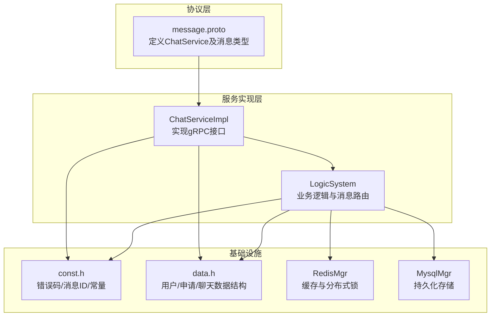
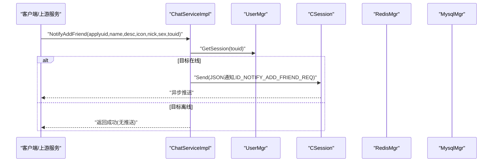
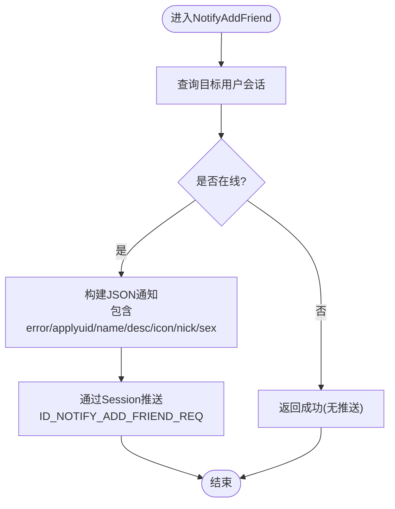
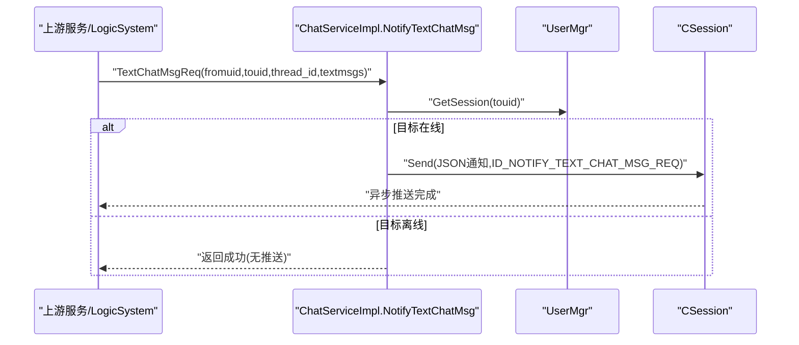
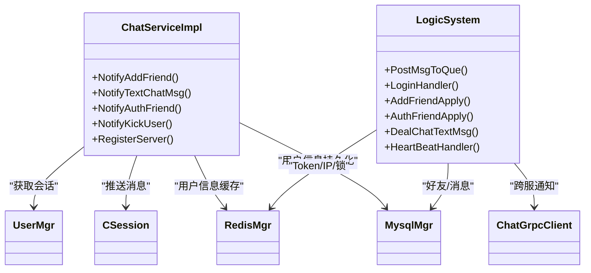

# ChatService聊天服务

<cite>
**本文引用的文件**   
- [message.proto](file://server/proto/chat/message.proto)
- [ChatServiceImpl.h](file://server/ChatServer/include/ChatServiceImpl.h)
- [ChatServiceImpl.cpp](file://server/ChatServer/src/ChatServiceImpl.cpp)
- [LogicSystem.h](file://server/ChatServer/include/LogicSystem.h)
- [LogicSystem.cpp](file://server/ChatServer/src/LogicSystem.cpp)
- [const.h](file://server/ChatServer/include/const.h)
- [data.h](file://server/ChatServer/include/data.h)
</cite>

## 目录
1. [简介](#简介)
2. [项目结构](#项目结构)
3. [核心组件](#核心组件)
4. [架构总览](#架构总览)
5. [详细组件分析](#详细组件分析)
6. [依赖关系分析](#依赖关系分析)
7. [性能考虑](#性能考虑)
8. [故障排查指南](#故障排查指南)
9. [结论](#结论)
10. [附录：消息结构与示例](#附录消息结构与示例)

## 简介
本文件为 ChatService 聊天服务的全面 API 文档，聚焦以下能力：
- 好友申请相关接口：NotifyAddFriend（发送好友申请）、RplyAddFriend（回复好友申请），并详细说明申请信息字段 applyuid/name/desc/icon/nick/sex。
- 聊天消息接口：SendChatMsg（发送文本消息）、NotifyTextChatMsg（推送聊天消息），包括消息内容格式、线程ID管理、消息去重机制。
- 好友认证接口 AuthFriendReq 与踢人接口 KickUser 的使用方法。
- 完整消息结构示例：TextChatData、AddFriendMsg 等复杂类型的字段含义。
- 错误处理策略与异常处理方案。

## 项目结构
ChatService 基于 gRPC 暴露 RPC 接口，服务端实现位于 ChatServer 模块；业务逻辑由 LogicSystem 统一调度；协议定义在 proto 文件中；常量与数据结构分别定义在 const.h 与 data.h。

**图表来源** 
- [message.proto:158-166](file://server/proto/chat/message.proto#L158-L166)
- [ChatServiceImpl.h:29-51](file://server/ChatServer/include/ChatServiceImpl.h#L29-L51)
- [LogicSystem.h:18-58](file://server/ChatServer/include/LogicSystem.h#L18-L58)
- [const.h:5-20](file://server/ChatServer/include/const.h#L5-L20)
- [data.h:4-51](file://server/ChatServer/include/data.h#L4-L51)

**章节来源**
- [message.proto:158-166](file://server/proto/chat/message.proto#L158-L166)
- [ChatServiceImpl.h:29-51](file://server/ChatServer/include/ChatServiceImpl.h#L29-L51)
- [LogicSystem.h:18-58](file://server/ChatServer/include/LogicSystem.h#L18-L58)
- [const.h:5-20](file://server/ChatServer/include/const.h#L5-L20)
- [data.h:4-51](file://server/ChatServer/include/data.h#L4-L51)

## 核心组件
- ChatService（gRPC 服务）：对外暴露好友申请、聊天消息、认证、踢人、图片通知等 RPC。
- ChatServiceImpl：实现上述 RPC，负责查找在线会话、组装 JSON 通知、调用 UserMgr 获取 Session、必要时跨服调用。
- LogicSystem：内部消息队列与回调分发，处理登录、搜索、好友申请、认证、文本聊天、心跳、线程加载、私聊创建、消息加载、图片聊天等。
- 数据与常量：ErrorCodes、MSG_IDS、UserInfo、ApplyInfo、ChatThreadInfo、ChatMessage、ChatMsgType。

**章节来源**
- [message.proto:158-166](file://server/proto/chat/message.proto#L158-L166)
- [ChatServiceImpl.h:29-51](file://server/ChatServer/include/ChatServiceImpl.h#L29-L51)
- [ChatServiceImpl.cpp:16-47](file://server/ChatServer/src/ChatServiceImpl.cpp#L16-L47)
- [LogicSystem.h:18-58](file://server/ChatServer/include/LogicSystem.h#L18-L58)
- [const.h:5-20](file://server/ChatServer/include/const.h#L5-L20)
- [data.h:4-51](file://server/ChatServer/include/data.h#L4-L51)

## 架构总览
ChatService 的调用路径分为两类：
- 外部客户端通过 gRPC 直接调用 ChatService 接口（如 NotifyAddFriend、NotifyTextChatMsg、NotifyKickUser）。
- 内部业务逻辑由 LogicSystem 处理 TCP 消息后，可能再调用 ChatService 进行跨服通知或转发。

**图表来源** 
- [message.proto:158-166](file://server/proto/chat/message.proto#L158-L166)
- [ChatServiceImpl.cpp:16-47](file://server/ChatServer/src/ChatServiceImpl.cpp#L16-L47)

**章节来源**
- [message.proto:158-166](file://server/proto/chat/message.proto#L158-L166)
- [ChatServiceImpl.cpp:16-47](file://server/ChatServer/src/ChatServiceImpl.cpp#L16-L47)

## 详细组件分析

### 好友申请接口：NotifyAddFriend
- 功能：向目标用户推送好友申请通知。
- 输入字段（AddFriendReq）：
  - applyuid：申请人UID
  - name：申请人姓名
  - desc：申请备注
  - icon：头像地址
  - nick：昵称
  - sex：性别
  - touid：目标用户UID
- 输出字段（AddFriendRsp）：
  - error：错误码
  - applyuid：申请人UID
  - touid：目标用户UID
- 行为说明：
  - 若目标在线，构造JSON通知并通过 CSession 推送 ID_NOTIFY_ADD_FRIEND_REQ。
  - 若目标不在线，仍返回成功（仅状态回包，不推送）。
- 错误码：Success、UidInvalid 等（见 ErrorCodes）。

**图表来源** 
- [ChatServiceImpl.cpp:16-47](file://server/ChatServer/src/ChatServiceImpl.cpp#L16-L47)
- [const.h:50-63](file://server/ChatServer/include/const.h#L50-L63)

**章节来源**
- [message.proto:46-60](file://server/proto/chat/message.proto#L46-L60)
- [ChatServiceImpl.cpp:16-47](file://server/ChatServer/src/ChatServiceImpl.cpp#L16-L47)
- [const.h:50-63](file://server/ChatServer/include/const.h#L50-L63)

### 好友申请回复接口：RplyAddFriend
- 功能：目标用户对好友申请进行同意/拒绝的回复。
- 输入字段（RplyFriendReq）：
  - rplyuid：回复者UID
  - agree：是否同意
  - touid：被回复的目标UID（通常即申请人）
- 输出字段（RplyFriendRsp）：
  - error：错误码
  - rplyuid：回复者UID
  - touid：被回复的目标UID
- 行为说明：
  - 该接口用于记录回复结果，具体通知流程由上层业务（LogicSystem）驱动，例如在认证通过后同步历史消息。

**章节来源**
- [message.proto:62-72](file://server/proto/chat/message.proto#L62-L72)

### 聊天消息接口：SendChatMsg
- 功能：发送文本聊天消息。
- 输入字段（SendChatMsgReq）：
  - fromuid：发送方UID
  - touid：接收方UID
  - message：文本内容
- 输出字段（SendChatMsgRsp）：
  - error：错误码
  - fromuid：发送方UID
  - touid：接收方UID
- 行为说明：
  - 实际文本消息的持久化与推送由 LogicSystem::DealChatTextMsg 处理，使用 TextChatMsgReq/TextChatMsgRsp 进行跨服通知。
  - 发送端会收到 ID_TEXT_CHAT_MSG_RSP 确认。

**章节来源**
- [message.proto:74-84](file://server/proto/chat/message.proto#L74-L84)
- [LogicSystem.cpp:480-576](file://server/ChatServer/src/LogicSystem.cpp#L480-L576)

### 聊天消息推送接口：NotifyTextChatMsg
- 功能：向目标用户推送文本聊天消息（跨服场景）。
- 输入字段（TextChatMsgReq）：
  - fromuid：发送方UID
  - touid：接收方UID
  - thread_id：聊天线程ID
  - textmsgs：文本消息数组（TextChatData）
- 输出字段（TextChatMsgRsp）：
  - error：错误码
  - fromuid：发送方UID
  - touid：接收方UID
  - thread_id：聊天线程ID
  - textmsgs：文本消息数组（TextChatData）
- 行为说明：
  - 若目标在线，构造JSON通知并通过 CSession 推送 ID_NOTIFY_TEXT_CHAT_MSG_REQ。
  - 若目标不在线，返回成功（不推送）。

**图表来源** 
- [ChatServiceImpl.cpp:105-139](file://server/ChatServer/src/ChatServiceImpl.cpp#L105-L139)
- [const.h:60-63](file://server/ChatServer/include/const.h#L60-L63)

**章节来源**
- [message.proto:107-127](file://server/proto/chat/message.proto#L107-L127)
- [ChatServiceImpl.cpp:105-139](file://server/ChatServer/src/ChatServiceImpl.cpp#L105-L139)
- [const.h:60-63](file://server/ChatServer/include/const.h#L60-L63)

### 好友认证接口：AuthFriendReq
- 功能：好友认证通过后，将双方历史消息与基础信息同步给对端。
- 输入字段（AuthFriendReq）：
  - fromuid：发起认证方UID
  - touid：被认证方UID
  - textmsgs：历史消息数组（AddFriendMsg）
- 输出字段（AuthFriendRsp）：
  - error：错误码
  - fromuid：发起认证方UID
  - touid：被认证方UID
- 行为说明：
  - 若目标在线，构造JSON通知并通过 CSession 推送 ID_NOTIFY_AUTH_FRIEND_REQ，包含对方基础信息与历史消息。
  - 若目标不在线，返回成功（不推送）。

**章节来源**
- [message.proto:95-105](file://server/proto/chat/message.proto#L95-L105)
- [ChatServiceImpl.cpp:49-103](file://server/ChatServer/src/ChatServiceImpl.cpp#L49-L103)

### 踢人接口：KickUser
- 功能：强制下线指定用户（单服或多服场景）。
- 输入字段（KickUserReq）：
  - uid：被踢用户UID
- 输出字段（KickUserRsp）：
  - error：错误码
  - uid：被踢用户UID
- 行为说明：
  - 若目标在线，调用 Session.NotifyOffline(uid) 并清理旧连接。
  - 多服场景下，LogicSystem 会在登录时根据 IP 映射决定本地踢人或跨服通知。

**章节来源**
- [message.proto:129-136](file://server/proto/chat/message.proto#L129-L136)
- [ChatServiceImpl.cpp:189-212](file://server/ChatServer/src/ChatServiceImpl.cpp#L189-L212)
- [LogicSystem.cpp:200-239](file://server/ChatServer/src/LogicSystem.cpp#L200-L239)

## 依赖关系分析
- ChatServiceImpl 依赖 UserMgr（获取在线会话）、CSession（推送消息）、RedisMgr/MysqlMgr（用户信息缓存与持久化）。
- LogicSystem 依赖 RedisMgr（Token/IP映射/分布式锁）、MysqlMgr（好友申请/聊天消息）、ChatGrpcClient（跨服通知）。
- 常量与数据结构贯穿各层，确保消息ID、错误码、消息类型一致。

**图表来源** 
- [ChatServiceImpl.h:29-51](file://server/ChatServer/include/ChatServiceImpl.h#L29-L51)
- [LogicSystem.h:18-58](file://server/ChatServer/include/LogicSystem.h#L18-L58)

**章节来源**
- [ChatServiceImpl.h:29-51](file://server/ChatServer/include/ChatServiceImpl.h#L29-L51)
- [LogicSystem.h:18-58](file://server/ChatServer/include/LogicSystem.h#L18-L58)

## 性能考虑
- 在线检测优先：ChatServiceImpl 先查 UserMgr 会话，避免不必要的数据库访问。
- 缓存策略：用户基础信息优先从 Redis 读取，未命中则回源 MySQL 并写回缓存。
- 异步推送：通过 CSession 异步发送消息，降低阻塞。
- 分布式锁：登录与关键操作使用 Redis 分布式锁，防止并发冲突。
- 批量处理：聊天消息以数组形式传输，减少网络往返。

[本节为通用指导，无需特定文件引用]

## 故障排查指南
- 错误码检查：
  - Success：操作成功
  - TokenInvalid：Token失效
  - UidInvalid：UID无效
  - Error_Json：JSON解析错误
  - RPCFailed：RPC请求失败
- 常见问题定位：
  - 通知未送达：检查目标是否在线（UserMgr.GetSession），以及 Session 推送是否成功。
  - 认证失败：检查 Redis 中 Token 是否正确，以及 UID 是否存在。
  - 消息重复：检查 unique_id 去重机制（见附录）。
  - 踢人无效：检查用户是否在线，以及跨服情况下是否通过 ChatGrpcClient 正确通知。

**章节来源**
- [const.h:5-20](file://server/ChatServer/include/const.h#L5-L20)
- [ChatServiceImpl.cpp:16-47](file://server/ChatServer/src/ChatServiceImpl.cpp#L16-L47)
- [LogicSystem.cpp:116-156](file://server/ChatServer/src/LogicSystem.cpp#L116-L156)

## 结论
ChatService 提供了完善的好友申请、聊天消息、认证与踢人能力，结合 Redis 缓存与分布式锁，具备高可用与可扩展性。通过明确的错误码与消息ID体系，便于前后端协作与问题定位。建议在生产环境中加强日志与监控，确保消息投递与一致性。

[本节为总结性内容，无需特定文件引用]

## 附录：消息结构与示例

### AddFriendMsg（好友申请消息）
- sender_id：发送者UID
- unique_id：消息唯一标识（用于去重）
- msg_id：消息ID（数据库自增或生成）
- thread_id：聊天线程ID
- msgcontent：消息内容
- status：消息状态（如已读/未读）

**章节来源**
- [message.proto:86-93](file://server/proto/chat/message.proto#L86-L93)

### TextChatData（文本聊天数据）
- unique_id：消息唯一标识（用于去重）
- msg_id：消息ID
- msgcontent：文本内容
- chat_time：聊天时间戳

**章节来源**
- [message.proto:114-119](file://server/proto/chat/message.proto#L114-L119)

### 消息去重机制
- 客户端生成 unique_id 作为消息唯一标识。
- 服务器端在持久化与推送前可基于 unique_id 进行去重判断，避免重复消息。
- 客户端侧可通过 _unrsp_item_map 等结构维护未响应消息，避免重复发送。

**章节来源**
- [LogicSystem.cpp:480-576](file://server/ChatServer/src/LogicSystem.cpp#L480-L576)
- [chatpage.cpp:66-176](file://client/llfcchat/src/chatpage.cpp#L66-L176)

### 线程ID管理
- thread_id 用于区分不同聊天会话（私聊/群聊）。
- 私聊时 thread_id 对应 private_chat.user1_id/user2_id；群聊时为独立ID。
- 客户端需根据 thread_id 组织消息列表与展示。

**章节来源**
- [data.h:33-38](file://server/ChatServer/include/data.h#L33-L38)
- [message.proto:107-127](file://server/proto/chat/message.proto#L107-L127)

### 错误处理策略
- 所有接口均返回 error 字段，客户端应据此判断成功与否。
- 常见错误码：Success、TokenInvalid、UidInvalid、Error_Json、RPCFailed。
- 对于离线用户，部分接口仍返回成功（不推送），客户端需自行处理重试或提示。

**章节来源**
- [const.h:5-20](file://server/ChatServer/include/const.h#L5-L20)
- [message.proto:56-72](file://server/proto/chat/message.proto#L56-L72)