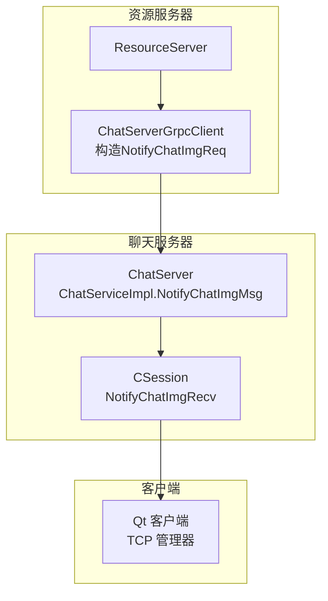
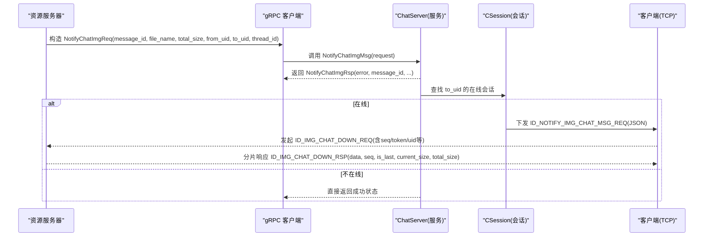
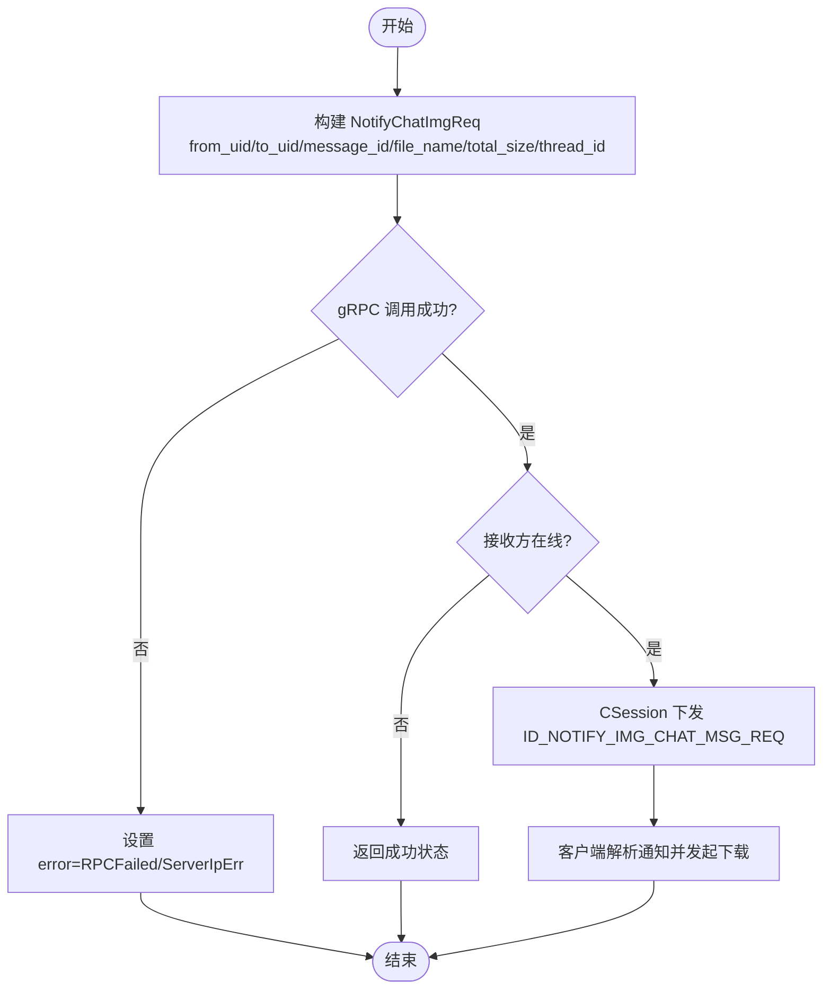
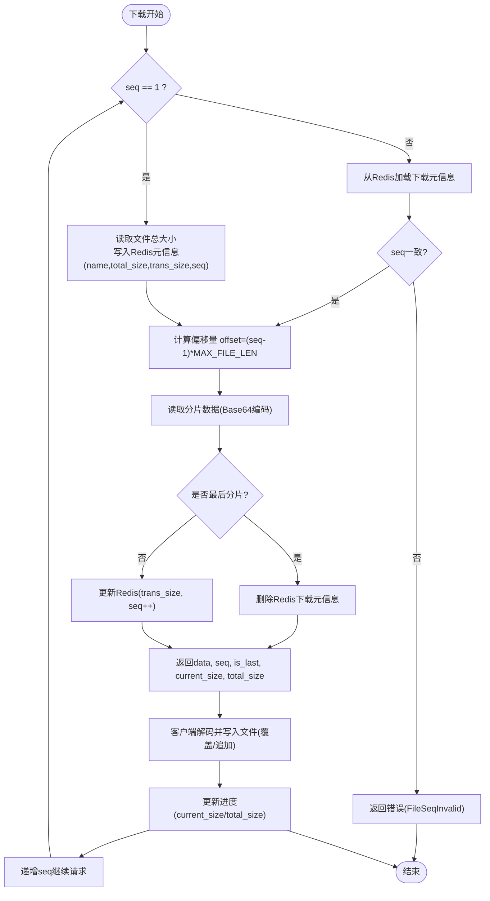
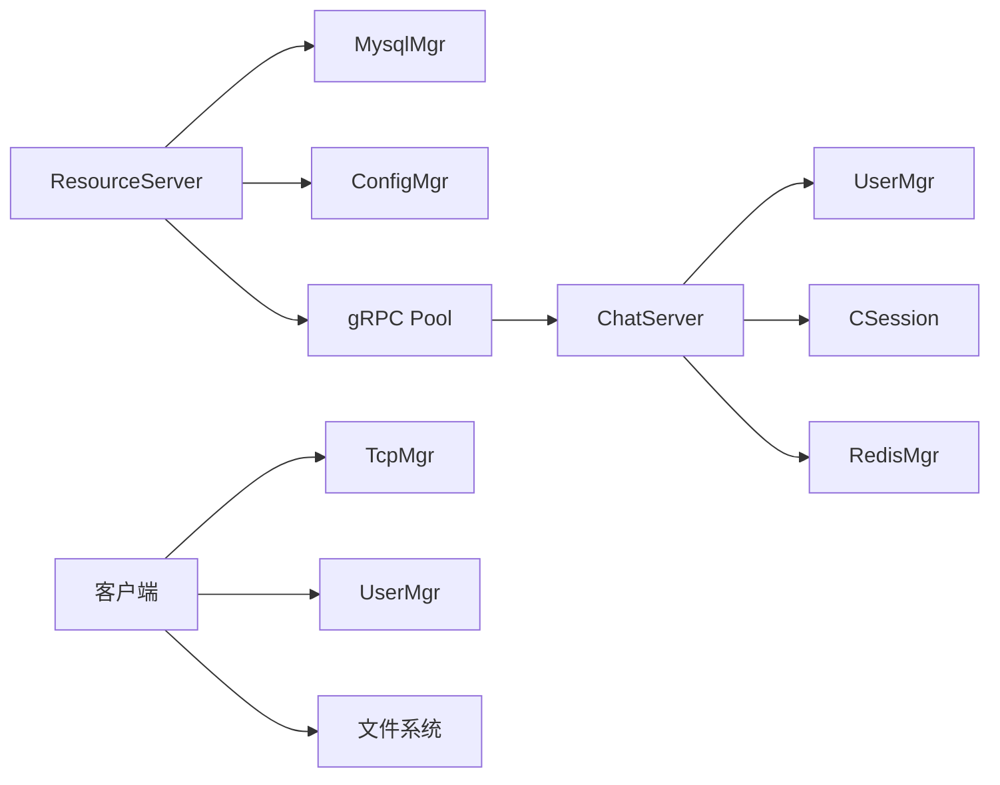

# 图片通知接口

<cite>
**本文引用的文件**   
- [server/proto/resource/message.proto](file://server/proto/resource/message.proto)
- [server/ResourceServer/src/ChatServerGrpcClient.cpp](file://server/ResourceServer/src/ChatServerGrpcClient.cpp)
- [server/ChatServer/src/ChatServiceImpl.cpp](file://server/ChatServer/src/ChatServiceImpl.cpp)
- [server/ChatServer/include/CSession.h](file://server/ChatServer/include/CSession.h)
- [server/ChatServer/src/CSession.cpp](file://server/ChatServer/src/CSession.cpp)
- [client/llfcchat/include/global.h](file://client/llfcchat/include/global.h)
- [开发文档/day41-通知客户端异步下载聊天图片.md](file://开发文档/day41-通知客户端异步下载聊天图片.md)
</cite>

## 目录
1. [简介](#简介)
2. [项目结构](#项目结构)
3. [核心组件](#核心组件)
4. [架构总览](#架构总览)
5. [详细组件分析](#详细组件分析)
6. [依赖关系分析](#依赖关系分析)
7. [性能考虑](#性能考虑)
8. [故障排查指南](#故障排查指南)
9. [结论](#结论)
10. [附录](#附录)

## 简介
本文件为 ChatService 的图片通知功能提供详细的 API 文档，聚焦于 NotifyChatImgReq/NotifyChatImgRsp 接口的字段说明、调用流程与错误处理策略。同时给出完整的图片传输场景示例（从上传到通知下载），并解释断点续传与进度更新机制的设计要点。

## 项目结构
围绕图片通知能力，涉及的关键代码位置如下：
- Proto 定义：消息结构与 RPC 方法声明
- 资源服务器：构造请求并调用 ChatService 的 NotifyChatImgMsg
- ChatServer：接收通知，查找在线会话，转发给客户端
- 客户端：收到通知后发起下载请求，支持断点续传与进度更新

**图表来源** 
- [server/proto/resource/message.proto:138-165](file://server/proto/resource/message.proto#L138-L165)
- [server/ResourceServer/src/ChatServerGrpcClient.cpp:4-40](file://server/ResourceServer/src/ChatServerGrpcClient.cpp#L4-L40)
- [server/ChatServer/src/ChatServiceImpl.cpp:219-241](file://server/ChatServer/src/ChatServiceImpl.cpp#L219-L241)
- [server/ChatServer/src/CSession.cpp:266-280](file://server/ChatServer/src/CSession.cpp#L266-L280)

**章节来源**
- [server/proto/resource/message.proto:138-165](file://server/proto/resource/message.proto#L138-L165)
- [server/ResourceServer/src/ChatServerGrpcClient.cpp:4-40](file://server/ResourceServer/src/ChatServerGrpcClient.cpp#L4-L40)
- [server/ChatServer/src/ChatServiceImpl.cpp:219-241](file://server/ChatServer/src/ChatServiceImpl.cpp#L219-L241)
- [server/ChatServer/src/CSession.cpp:266-280](file://server/ChatServer/src/CSession.cpp#L266-L280)

## 核心组件
- 协议层（Proto）
  - 定义 NotifyChatImgReq/NotifyChatImgRsp 的消息结构与字段
  - 定义 ChatService 的 NotifyChatImgMsg RPC 方法
- 资源服务器（ResourceServer）
  - 根据消息 ID 查询数据库获取发送方/接收方、文件名、线程ID等
  - 计算文件大小，构造 NotifyChatImgReq 并通过 gRPC 调用 ChatService
- 聊天服务器（ChatServer）
  - 实现 NotifyChatImgMsg，按 to_uid 查找在线会话
  - 若在线则通过 CSession 将通知以 JSON 形式下发至客户端
- 客户端（Qt）
  - 监听 ID_NOTIFY_IMG_CHAT_MSG_REQ，解析通知数据
  - 组织 ID_IMG_CHAT_DOWN_REQ 下载请求，支持断点续传与进度更新

**章节来源**
- [server/proto/resource/message.proto:138-165](file://server/proto/resource/message.proto#L138-L165)
- [server/ResourceServer/src/ChatServerGrpcClient.cpp:4-40](file://server/ResourceServer/src/ChatServerGrpcClient.cpp#L4-L40)
- [server/ChatServer/src/ChatServiceImpl.cpp:219-241](file://server/ChatServer/src/ChatServiceImpl.cpp#L219-L241)
- [server/ChatServer/src/CSession.cpp:266-280](file://server/ChatServer/src/CSession.cpp#L266-L280)
- [client/llfcchat/include/global.h:79-88](file://client/llfcchat/include/global.h#L79-L88)

## 架构总览
下图展示了“图片上传完成 → 资源服务器通知 → ChatServer 推送 → 客户端下载”的完整链路。

**图表来源** 
- [server/ResourceServer/src/ChatServerGrpcClient.cpp:4-40](file://server/ResourceServer/src/ChatServerGrpcClient.cpp#L4-L40)
- [server/ChatServer/src/ChatServiceImpl.cpp:219-241](file://server/ChatServer/src/ChatServiceImpl.cpp#L219-L241)
- [server/ChatServer/src/CSession.cpp:266-280](file://server/ChatServer/src/CSession.cpp#L266-L280)
- [client/llfcchat/include/global.h:79-88](file://client/llfcchat/include/global.h#L79-L88)
- [开发文档/day41-通知客户端异步下载聊天图片.md:217-269](file://开发文档/day41-通知客户端异步下载聊天图片.md#L217-L269)

## 详细组件分析

### NotifyChatImgReq 接口说明
- 用途：资源服务器在图片上传完成后，通知 ChatServer 该图片已就绪，以便向接收方客户端推送下载信息。
- 关键字段含义与用法
  - from_uid：发送方用户ID，用于标识图片来源
  - to_uid：接收方用户ID，用于定位目标在线会话并推送通知
  - message_id：消息ID，唯一标识本次图片对应的聊天消息
  - file_name：文件名，客户端据此确定本地存储路径与显示名称
  - total_size：文件大小（字节），用于客户端初始化下载进度与校验
  - thread_id：会话线程ID，用于区分不同聊天会话
- 字段类型与约束
  - from_uid/to_uid/message_id/thread_id：整型
  - file_name：字符串
  - total_size：64位整型（字节）

**章节来源**
- [server/proto/resource/message.proto:138-145](file://server/proto/resource/message.proto#L138-L145)
- [server/ResourceServer/src/ChatServerGrpcClient.cpp:14-25](file://server/ResourceServer/src/ChatServerGrpcClient.cpp#L14-L25)

### NotifyChatImgRsp 响应结构说明
- 用途：对资源服务器的通知进行确认，包含错误码与关键上下文字段，便于上层追踪。
- 关键字段作用
  - error：错误码，0表示成功；非0表示失败原因（如网络异常、RPC失败、服务端IP错误等）
  - from_uid/to_uid：回显发送方与接收方ID，便于日志核对
  - message_id：回显消息ID，用于关联原始请求
  - file_name：回显文件名
  - total_size：回显文件大小
  - thread_id：回显会话线程ID

**章节来源**
- [server/proto/resource/message.proto:147-155](file://server/proto/resource/message.proto#L147-L155)
- [server/ResourceServer/src/ChatServerGrpcClient.cpp:33-39](file://server/ResourceServer/src/ChatServerGrpcClient.cpp#L33-L39)

### ChatService.NotifyChatImgMsg 调用流程
- 资源服务器侧
  - 根据 message_id 查询数据库，填充 from_uid、to_uid、file_name、thread_id
  - 计算 total_size（基于本地文件路径与大小）
  - 使用连接池获取 gRPC Stub，调用 NotifyChatImgMsg
- ChatServer 侧
  - 根据 to_uid 查找在线会话
  - 若存在，则通过 CSession 下发通知；否则直接返回成功状态（仅确认）
- 客户端侧
  - 收到 ID_NOTIFY_IMG_CHAT_MSG_REQ 后，先检查本地是否已有图片
  - 若无，则构造 ID_IMG_CHAT_DOWN_REQ 发起下载，并在界面插入预览项与进度条

**图表来源** 
- [server/ResourceServer/src/ChatServerGrpcClient.cpp:4-40](file://server/ResourceServer/src/ChatServerGrpcClient.cpp#L4-L40)
- [server/ChatServer/src/ChatServiceImpl.cpp:219-241](file://server/ChatServer/src/ChatServiceImpl.cpp#L219-L241)
- [server/ChatServer/src/CSession.cpp:266-280](file://server/ChatServer/src/CSession.cpp#L266-L280)
- [client/llfcchat/include/global.h:79-88](file://client/llfcchat/include/global.h#L79-L88)
- [开发文档/day41-通知客户端异步下载聊天图片.md:217-269](file://开发文档/day41-通知客户端异步下载聊天图片.md#L217-L269)

**章节来源**
- [server/ResourceServer/src/ChatServerGrpcClient.cpp:4-40](file://server/ResourceServer/src/ChatServerGrpcClient.cpp#L4-L40)
- [server/ChatServer/src/ChatServiceImpl.cpp:219-241](file://server/ChatServer/src/ChatServiceImpl.cpp#L219-L241)
- [server/ChatServer/src/CSession.cpp:266-280](file://server/ChatServer/src/CSession.cpp#L266-L280)
- [client/llfcchat/include/global.h:79-88](file://client/llfcchat/include/global.h#L79-L88)
- [开发文档/day41-通知客户端异步下载聊天图片.md:217-269](file://开发文档/day41-通知客户端异步下载聊天图片.md#L217-L269)

### 图片下载流程设计（断点续传与进度更新）
- 断点续传
  - 首次请求（seq=1）：服务器读取文件总大小，写入 Redis 作为下载元信息（name、total_size、trans_size、seq）
  - 后续请求（seq>1）：从 Redis 读取历史进度，校验 seq 一致性，按偏移量读取对应分片
  - 最后一个分片：is_last=true，清理 Redis 中的下载元信息
- 进度更新
  - 每次响应携带 current_size（当前累计字节数）、total_size（总大小）、seq（分片序号）、is_last（是否最后分片）
  - 客户端根据 current_size/total_size 更新 UI 进度条
- 分片传输
  - 服务器按固定分片大小读取文件，Base64 编码后随响应返回
  - 客户端 Base64 解码并按 seq 覆盖/追加写入本地文件

**图表来源** 
- [开发文档/day41-通知客户端异步下载聊天图片.md:496-709](file://开发文档/day41-通知客户端异步下载聊天图片.md#L496-L709)

**章节来源**
- [开发文档/day41-通知客户端异步下载聊天图片.md:496-709](file://开发文档/day41-通知客户端异步下载聊天图片.md#L496-L709)

### 完整图片传输场景示例
- 步骤概览
  1) 发送方客户端上传图片至资源服务器
  2) 资源服务器保存文件，构造 NotifyChatImgReq（填充 from_uid、to_uid、message_id、file_name、total_size、thread_id）
  3) 资源服务器通过 gRPC 调用 ChatService.NotifyChatImgMsg
  4) ChatServer 查找接收方在线会话，若在线则下发 ID_NOTIFY_IMG_CHAT_MSG_REQ
  5) 客户端解析通知，若本地无图则发起 ID_IMG_CHAT_DOWN_REQ（含 token、uid、sender_id、receiver_id、message_id、seq、total_size 等）
  6) 资源服务器按 seq 分片返回 ID_IMG_CHAT_DOWN_RSP（data、seq、is_last、current_size、total_size）
  7) 客户端解码写入文件，更新进度，直至 is_last=true 完成下载
- 关键点
  - 通知阶段仅传递元数据，实际数据通过下载通道传输
  - 断点续传依赖 Redis 持久化下载进度，确保网络中断后可恢复
  - 进度更新由 current_size/total_size 驱动，UI 实时反馈

**章节来源**
- [server/ResourceServer/src/ChatServerGrpcClient.cpp:4-40](file://server/ResourceServer/src/ChatServerGrpcClient.cpp#L4-L40)
- [server/ChatServer/src/ChatServiceImpl.cpp:219-241](file://server/ChatServer/src/ChatServiceImpl.cpp#L219-L241)
- [server/ChatServer/src/CSession.cpp:266-280](file://server/ChatServer/src/CSession.cpp#L266-L280)
- [client/llfcchat/include/global.h:79-88](file://client/llfcchat/include/global.h#L79-L88)
- [开发文档/day41-通知客户端异步下载聊天图片.md:217-269](file://开发文档/day41-通知客户端异步下载聊天图片.md#L217-L269)
- [开发文档/day41-通知客户端异步下载聊天图片.md:496-709](file://开发文档/day41-通知客户端异步下载聊天图片.md#L496-L709)

## 依赖关系分析
- 组件耦合
  - 资源服务器依赖 MysqlMgr（查询消息元数据）、ConfigMgr（获取文件输出路径）、gRPC 连接池（多 ChatServer）
  - ChatServer 依赖 UserMgr（会话管理）、CSession（消息下发）、Redis/Mysql（可选扩展）
  - 客户端依赖 TcpMgr（消息分发）、UserMgr（用户信息与文件管理）、文件系统（本地存储）
- 外部依赖
  - gRPC：跨服务通信
  - Redis：断点续传元信息缓存
  - MySQL：聊天消息元数据持久化

**图表来源** 
- [server/ResourceServer/src/ChatServerGrpcClient.cpp:4-40](file://server/ResourceServer/src/ChatServerGrpcClient.cpp#L4-L40)
- [server/ChatServer/src/ChatServiceImpl.cpp:219-241](file://server/ChatServer/src/ChatServiceImpl.cpp#L219-L241)
- [server/ChatServer/include/CSession.h:23-24](file://server/ChatServer/include/CSession.h#L23-L24)
- [client/llfcchat/include/global.h:79-88](file://client/llfcchat/include/global.h#L79-L88)

**章节来源**
- [server/ResourceServer/src/ChatServerGrpcClient.cpp:4-40](file://server/ResourceServer/src/ChatServerGrpcClient.cpp#L4-L40)
- [server/ChatServer/src/ChatServiceImpl.cpp:219-241](file://server/ChatServer/src/ChatServiceImpl.cpp#L219-L241)
- [server/ChatServer/include/CSession.h:23-24](file://server/ChatServer/include/CSession.h#L23-L24)
- [client/llfcchat/include/global.h:79-88](file://client/llfcchat/include/global.h#L79-L88)

## 性能考虑
- gRPC 连接池：资源服务器维护多个 ChatServer 的连接池，减少握手开销，提高并发能力
- 分片下载：固定分片大小降低单次内存占用，提升大文件传输稳定性
- Redis 缓存：断点续传元信息快速读写，避免重复 IO 与数据库访问
- 异步处理：资源服务器将下载任务投递到队列，由 Worker 并行处理，提升吞吐

[本节为通用指导，无需具体文件引用]

## 故障排查指南
- 常见错误码与处理
  - ServerIpErr：ChatServer IP 不存在或配置错误，需检查连接池配置
  - RPCFailed：gRPC 调用失败，检查网络连通性与服务状态
  - FileNotExists：服务器端文件缺失，检查上传流程与存储路径
  - FileReadPermissionFailed：权限问题，检查文件读权限
  - RedisReadErr：Redis 读取失败，检查 Redis 连接与键是否存在
  - FileSeqInvalid：序列号不一致，检查客户端 seq 与服务器记录
  - FileOffsetInvalid：偏移量越界，检查分片大小与 total_size
- 网络异常重试
  - 客户端在网络错误时进行指数退避重试，限制最大重试次数
  - 断点续传自动恢复：利用 Redis 中 trans_size 与 seq 继续下载
- 调试建议
  - 打印 message_id、file_name、total_size、thread_id 等关键字段，核对上下游一致性
  - 检查 Redis 中下载元信息的生命周期与过期策略

**章节来源**
- [server/ResourceServer/src/ChatServerGrpcClient.cpp:10-12](file://server/ResourceServer/src/ChatServerGrpcClient.cpp#L10-L12)
- [server/ResourceServer/src/ChatServerGrpcClient.cpp:33-39](file://server/ResourceServer/src/ChatServerGrpcClient.cpp#L33-L39)
- [开发文档/day41-通知客户端异步下载聊天图片.md:586-646](file://开发文档/day41-通知客户端异步下载聊天图片.md#L586-L646)

## 结论
NotifyChatImgReq/NotifyChatImgRsp 构成了图片通知的核心契约，配合分片下载与 Redis 断点续传，实现了高可靠、可恢复的图片传输流程。资源服务器负责元数据聚合与通知触发，ChatServer 负责在线会话路由与客户端推送，客户端负责下载与进度展示。整体设计清晰、可扩展性强，适合大规模聊天场景下的图片资源分发。

[本节为总结性内容，无需具体文件引用]

## 附录
- 字段对照表（通知阶段）
  - NotifyChatImgReq：from_uid、to_uid、message_id、file_name、total_size、thread_id
  - NotifyChatImgRsp：error、from_uid、to_uid、message_id、file_name、total_size、thread_id
- 消息标识（客户端）
  - ID_NOTIFY_IMG_CHAT_MSG_REQ：通知图片聊天信息
  - ID_IMG_CHAT_DOWN_REQ：聊天图片下载请求
  - ID_IMG_CHAT_DOWN_RSP：聊天图片下载回复

**章节来源**
- [server/proto/resource/message.proto:138-165](file://server/proto/resource/message.proto#L138-L165)
- [client/llfcchat/include/global.h:79-88](file://client/llfcchat/include/global.h#L79-L88)