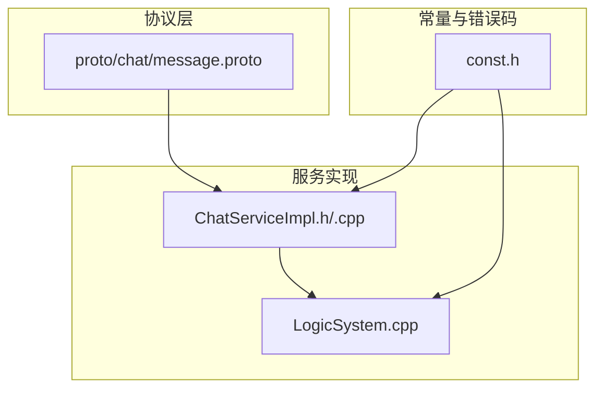
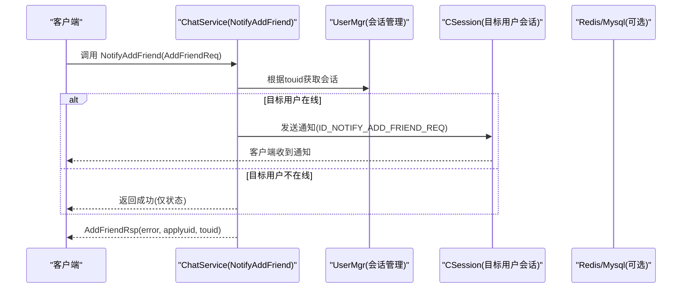
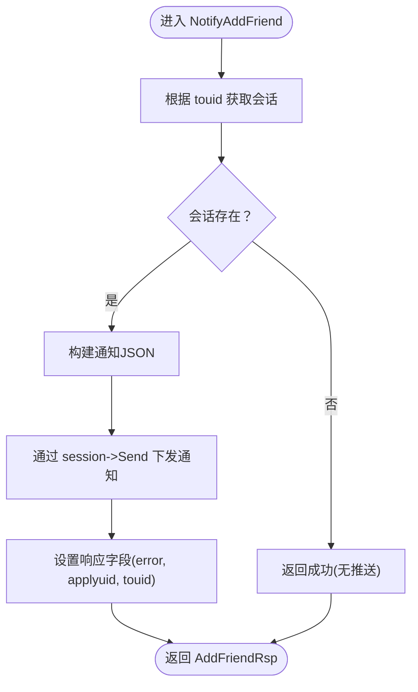
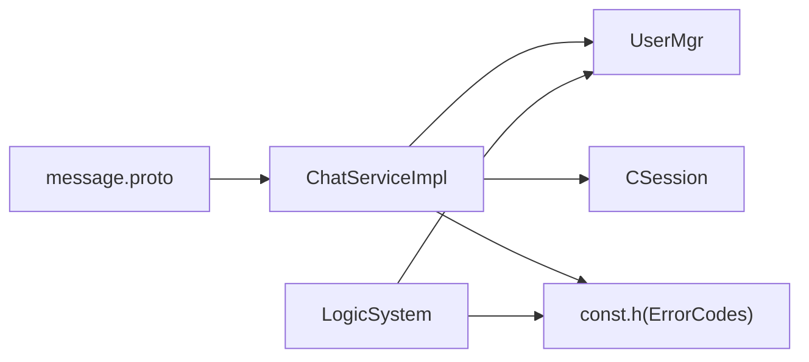

# 好友管理接口

<cite>
**本文引用的文件**   
- [message.proto](file://server/proto/chat/message.proto)
- [ChatServiceImpl.cpp](file://server/ChatServer/src/ChatServiceImpl.cpp)
- [ChatServiceImpl.h](file://server/ChatServer/include/ChatServiceImpl.h)
- [const.h](file://server/ChatServer/include/const.h)
- [LogicSystem.cpp](file://server/ChatServer/src/LogicSystem.cpp)
</cite>

## 目录
1. [简介](#简介)
2. [项目结构](#项目结构)
3. [核心组件](#核心组件)
4. [架构总览](#架构总览)
5. [详细组件分析](#详细组件分析)
6. [依赖关系分析](#依赖关系分析)
7. [性能考虑](#性能考虑)
8. [故障排查指南](#故障排查指南)
9. [结论](#结论)
10. [附录](#附录)

## 简介
本文件为 ChatService 的好友管理功能提供详细的 API 文档，重点覆盖以下两个 RPC 接口：
- NotifyAddFriend：用于发送好友申请通知。请求参数包括申请人ID、姓名、描述、头像URL、昵称、性别、目标用户ID等字段，并给出完整字段说明与校验建议。
- RplyAddFriend：用于回复好友申请（同意/拒绝）。包含回复人ID、是否同意标志、目标用户ID等参数说明。

文档同时提供消息结构定义、错误码说明、异常处理策略以及端到端调用时序图，帮助开发者快速集成与排障。

## 项目结构
与好友管理相关的代码主要位于服务端 ChatServer 模块，协议定义在 proto 文件中，实现逻辑分布在 ChatServiceImpl 与 LogicSystem 中。

图表来源
- [message.proto:46-72](file://server/proto/chat/message.proto#L46-L72)
- [ChatServiceImpl.h:29-53](file://server/ChatServer/include/ChatServiceImpl.h#L29-L53)
- [ChatServiceImpl.cpp:16-47](file://server/ChatServer/src/ChatServiceImpl.cpp#L16-L47)
- [const.h:5-20](file://server/ChatServer/include/const.h#L5-L20)

章节来源
- [message.proto:46-72](file://server/proto/chat/message.proto#L46-L72)
- [ChatServiceImpl.h:29-53](file://server/ChatServer/include/ChatServiceImpl.h#L29-L53)
- [ChatServiceImpl.cpp:16-47](file://server/ChatServer/src/ChatServiceImpl.cpp#L16-L47)
- [const.h:5-20](file://server/ChatServer/include/const.h#L5-L20)

## 核心组件
- 协议消息定义
  - AddFriendReq：NotifyAddFriend 的请求体，包含申请人ID、姓名、描述、头像URL、昵称、性别、目标用户ID。
  - AddFriendRsp：NotifyAddFriend 的响应体，包含错误码、申请人ID、目标用户ID。
  - RplyFriendReq：RplyAddFriend 的请求体，包含回复人ID、是否同意、目标用户ID。
  - RplyFriendRsp：RplyAddFriend 的响应体，包含错误码、回复人ID、目标用户ID。
- 服务接口
  - ChatService.NotifyAddFriend：接收好友申请并推送给在线的目标用户。
  - ChatService.RplyAddFriend：处理好友申请的同意或拒绝。
- 错误码
  - Success、UidInvalid、TokenInvalid 等，定义于 const.h。

章节来源
- [message.proto:46-72](file://server/proto/chat/message.proto#L46-L72)
- [const.h:5-20](file://server/ChatServer/include/const.h#L5-L20)

## 架构总览
下图展示了客户端通过 gRPC 调用 ChatService 的好友申请流程，以及服务器将通知下发到在线用户的会话通道。

图表来源
- [message.proto:158-166](file://server/proto/chat/message.proto#L158-L166)
- [ChatServiceImpl.cpp:16-47](file://server/ChatServer/src/ChatServiceImpl.cpp#L16-L47)
- [const.h:49-79](file://server/ChatServer/include/const.h#L49-L79)

## 详细组件分析

### NotifyAddFriend（发送好友申请）
- 接口职责
  - 接收 AddFriendReq，查找目标用户会话，若在线则通过内部消息 ID_NOTIFY_ADD_FRIEND_REQ 推送通知；若不在线则直接返回成功状态。
- 请求参数（AddFriendReq）
  - applyuid：申请人ID（int32），必填，需为正整数。
  - name：姓名（string），必填，长度建议不超过 MAX_LENGTH。
  - desc：描述（string），选填，长度建议不超过 MAX_LENGTH。
  - icon：头像URL（string），选填，需为合法URL格式。
  - nick：昵称（string），必填，长度建议不超过 MAX_LENGTH。
  - sex：性别（int32），选填，建议取值范围（如0未知/1男/2女）。
  - touid：目标用户ID（int32），必填，需为正整数且存在。
- 响应参数（AddFriendRsp）
  - error：错误码（int32），Success=0表示成功。
  - applyuid：申请人ID（int32）。
  - touid：目标用户ID（int32）。
- 处理逻辑要点
  - 使用 UserMgr::GetInstance()->GetSession(touid) 获取在线会话。
  - 若会话为空，直接返回 Status::OK（不阻塞调用方）。
  - 构造 JSON 通知数据并通过 session->Send 下发。
  - 使用 Defer 统一设置响应字段。
- 错误码与异常处理
  - 成功：error=Success。
  - 目标用户不存在或无效：可返回 UidInvalid（由调用方判断）。
  - Token失效等上游认证问题：由调用方在登录阶段处理。
  - 重复申请：建议在业务层维护申请状态（数据库或缓存），避免重复推送。
- 示例（JSON 风格）
  - 请求示例（AddFriendReq）
    - {
      "applyuid": 1001,
      "name": "张三",
      "desc": "你好，我是张三",
      "icon": "https://example.com/avatar/1001.jpg",
      "nick": "张三Nick",
      "sex": 1,
      "touid": 2001
    }
  - 响应示例（AddFriendRsp）
    - {
      "error": 0,
      "applyuid": 1001,
      "touid": 2001
    }

章节来源
- [message.proto:46-60](file://server/proto/chat/message.proto#L46-L60)
- [ChatServiceImpl.cpp:16-47](file://server/ChatServer/src/ChatServiceImpl.cpp#L16-L47)
- [const.h:5-20](file://server/ChatServer/include/const.h#L5-L20)
- [const.h:49-79](file://server/ChatServer/include/const.h#L49-L79)

### RplyAddFriend（回复好友申请）
- 接口职责
  - 接收 RplyFriendReq，处理目标用户对好友申请的同意或拒绝。该接口在 proto 中已定义，但当前 ChatServiceImpl 未提供实现。
- 请求参数（RplyFriendReq）
  - rplyuid：回复人ID（int32），必填，需为正整数。
  - agree：是否同意（bool），true 表示同意，false 表示拒绝。
  - touid：目标用户ID（int32），必填，需为正整数且存在。
- 响应参数（RplyFriendRsp）
  - error：错误码（int32），Success=0表示成功。
  - rplyuid：回复人ID（int32）。
  - touid：目标用户ID（int32）。
- 处理逻辑建议
  - 校验 rplyuid 与 touid 的有效性。
  - 查询申请记录是否存在且处于待处理状态。
  - 更新申请状态（同意/拒绝），并持久化至数据库。
  - 若申请人为在线用户，通过其会话下发结果通知。
  - 返回统一的错误码与双方UID。
- 错误码与异常处理
  - 成功：error=Success。
  - 用户无效：UidInvalid。
  - 申请不存在或状态异常：可在业务层定义新错误码（例如“申请不存在”、“申请已处理”）。
  - 非好友关系：同意成功后建立好友关系；拒绝后保持非好友关系。
- 示例（JSON 风格）
  - 请求示例（RplyFriendReq）
    - {
      "rplyuid": 2001,
      "agree": true,
      "touid": 1001
    }
  - 响应示例（RplyFriendRsp）
    - {
      "error": 0,
      "rplyuid": 2001,
      "touid": 1001
    }

章节来源
- [message.proto:62-72](file://server/proto/chat/message.proto#L62-L72)
- [const.h:5-20](file://server/ChatServer/include/const.h#L5-L20)

### 消息结构与字段说明
- AddFriendReq
  - applyuid：申请人ID（int32）
  - name：姓名（string）
  - desc：描述（string）
  - icon：头像URL（string）
  - nick：昵称（string）
  - sex：性别（int32）
  - touid：目标用户ID（int32）
- AddFriendRsp
  - error：错误码（int32）
  - applyuid：申请人ID（int32）
  - touid：目标用户ID（int32）
- RplyFriendReq
  - rplyuid：回复人ID（int32）
  - agree：是否同意（bool）
  - touid：目标用户ID（int32）
- RplyFriendRsp
  - error：错误码（int32）
  - rplyuid：回复人ID（int32）
  - touid：目标用户ID（int32）

章节来源
- [message.proto:46-72](file://server/proto/chat/message.proto#L46-L72)

### 错误码与异常处理策略
- 错误码定义（部分）
  - Success：0
  - Error_Json：1001（JSON解析错误）
  - RPCFailed：1002（RPC请求错误）
  - VarifyExpired：1003（验证码过期）
  - VarifyCodeErr：1004（验证码错误）
  - UserExist：1005（用户已存在）
  - PasswdErr：1006（密码错误）
  - EmailNotMatch：1007（邮箱不匹配）
  - PasswdUpFailed：1008（更新密码失败）
  - PasswdInvalid：1009（密码更新失败）
  - TokenInvalid：1010（Token失效）
  - UidInvalid：1011（uid无效）
  - CREATE_CHAT_FAILED：1012（创建聊天失败）
  - LOAD_CHAT_FAILED：1013（加载聊天失败）
- 常见异常场景与建议
  - 重复申请：在业务层维护申请状态（数据库/缓存），检测到重复时返回业务错误码并提示“已申请”。
  - 非好友关系：同意前确保双方为非好友；同意后建立好友关系。
  - 目标用户不在线：NotifyAddFriend 仍返回成功，但不会推送通知；客户端应支持离线申请列表拉取。
  - 参数校验失败：对必填字段进行非空校验，对字符串长度与格式进行限制。

章节来源
- [const.h:5-20](file://server/ChatServer/include/const.h#L5-L20)

### 处理流程图（NotifyAddFriend）

图表来源
- [ChatServiceImpl.cpp:16-47](file://server/ChatServer/src/ChatServiceImpl.cpp#L16-L47)
- [const.h:49-79](file://server/ChatServer/include/const.h#L49-L79)

## 依赖关系分析
- 协议依赖
  - message.proto 定义了 ChatService 的 RPC 方法与消息结构。
- 服务实现依赖
  - ChatServiceImpl 依赖 UserMgr 获取会话、依赖 CSession 发送消息。
  - LogicSystem 负责消息队列与回调注册，包含好友申请相关回调（ID_ADD_FRIEND_REQ 等）。
- 错误码依赖
  - const.h 中的 ErrorCodes 被多处使用以统一错误处理。

图表来源
- [message.proto:158-166](file://server/proto/chat/message.proto#L158-L166)
- [ChatServiceImpl.h:29-53](file://server/ChatServer/include/ChatServiceImpl.h#L29-L53)
- [ChatServiceImpl.cpp:16-47](file://server/ChatServer/src/ChatServiceImpl.cpp#L16-L47)
- [const.h:5-20](file://server/ChatServer/include/const.h#L5-L20)
- [LogicSystem.cpp:83-114](file://server/ChatServer/src/LogicSystem.cpp#L83-L114)

章节来源
- [message.proto:158-166](file://server/proto/chat/message.proto#L158-L166)
- [ChatServiceImpl.h:29-53](file://server/ChatServer/include/ChatServiceImpl.h#L29-L53)
- [ChatServiceImpl.cpp:16-47](file://server/ChatServer/src/ChatServiceImpl.cpp#L16-L47)
- [const.h:5-20](file://server/ChatServer/include/const.h#L5-L20)
- [LogicSystem.cpp:83-114](file://server/ChatServer/src/LogicSystem.cpp#L83-L114)

## 性能考虑
- 在线检测与推送
  - 通过 UserMgr 快速获取会话，避免不必要的数据库访问。
  - 若目标用户不在线，直接返回成功，减少阻塞。
- 序列化与传输
  - 使用 JSON 组织通知数据，注意控制字段大小与数量，避免大对象传输。
- 并发与队列
  - LogicSystem 使用消息队列与条件变量处理请求，保证高吞吐与低延迟。
- 缓存与一致性
  - 用户基础信息优先从 Redis 读取，未命中再查 MySQL，提升读取性能。

[本节为通用性能建议，无需特定文件引用]

## 故障排查指南
- 常见问题定位
  - 通知未到达：检查目标用户是否在线（UserMgr.GetSession），确认会话通道是否正常。
  - 参数校验失败：核对必填字段与格式，关注 JSON 解析错误码（Error_Json）。
  - 重复申请：检查业务层申请状态表，确保幂等性。
  - 非好友关系：同意前验证双方关系，避免非法操作。
- 日志与调试
  - 查看服务器日志输出，确认消息ID与处理回调是否正确注册。
  - 使用错误码快速定位问题类型（如 UidInvalid、TokenInvalid）。

章节来源
- [const.h:5-20](file://server/ChatServer/include/const.h#L5-L20)
- [LogicSystem.cpp:83-114](file://server/ChatServer/src/LogicSystem.cpp#L83-L114)

## 结论
本文档围绕 ChatService 的好友管理功能，详细说明了 NotifyAddFriend 与 RplyAddFriend 接口的参数、响应、错误码与异常处理策略，并结合源码给出了架构图与流程图。对于 RplyAddFriend，当前 proto 已定义但未实现，建议按本文建议完善业务逻辑与错误处理，以提升系统健壮性与用户体验。

[本节为总结性内容，无需特定文件引用]

## 附录
- 关键文件路径
  - 协议定义：server/proto/chat/message.proto
  - 服务实现：server/ChatServer/src/ChatServiceImpl.cpp
  - 服务接口声明：server/ChatServer/include/ChatServiceImpl.h
  - 错误码定义：server/ChatServer/include/const.h
  - 逻辑系统与回调：server/ChatServer/src/LogicSystem.cpp

[本节为索引性内容，无需特定文件引用]