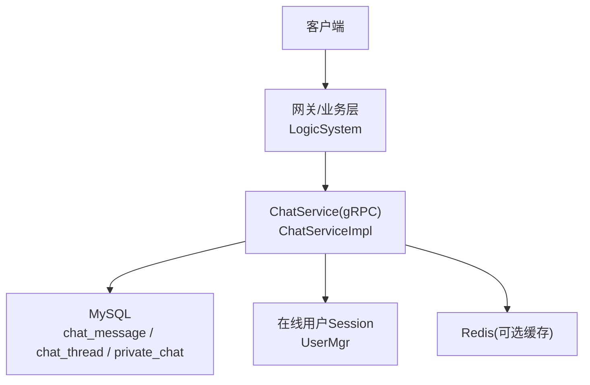
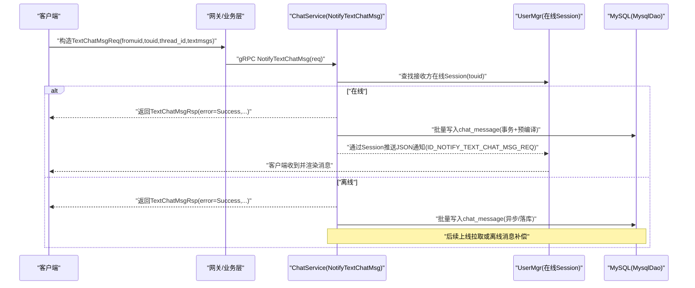
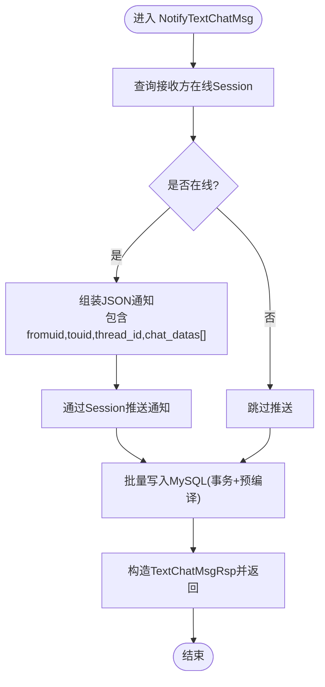
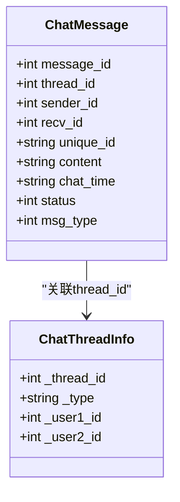
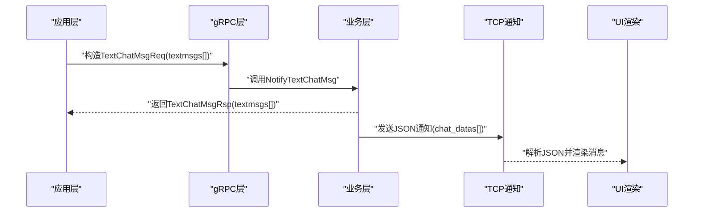
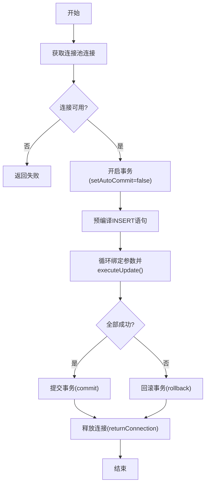
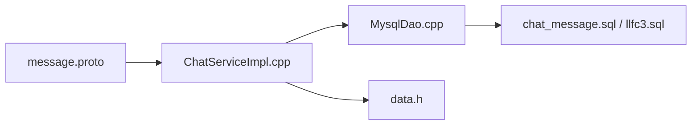

# 聊天消息接口

<cite>
**本文引用的文件**   
- [message.proto](file://server/proto/chat/message.proto)
- [ChatServiceImpl.h](file://server/ChatServer/include/ChatServiceImpl.h)
- [ChatServiceImpl.cpp](file://server/ChatServer/src/ChatServiceImpl.cpp)
- [MysqlDao.h](file://server/ChatServer/include/MysqlDao.h)
- [MysqlDao.cpp](file://server/ChatServer/src/MysqlDao.cpp)
- [data.h](file://server/ChatServer/include/data.h)
- [chat_message.sql](file://sql备份/chat_message.sql)
- [llfc3.sql](file://sql备份/llfc3.sql)
- [day29-好友认证和聊天通信.md](file://开发文档/day29-好友认证和聊天通信.md)
- [day37-聊天信息存储方案.md](file://开发文档/day37-聊天信息存储方案.md)
</cite>

## 目录
1. [简介](#简介)
2. [项目结构](#项目结构)
3. [核心组件](#核心组件)
4. [架构总览](#架构总览)
5. [详细组件分析](#详细组件分析)
6. [依赖关系分析](#依赖关系分析)
7. [性能考量](#性能考量)
8. [故障排查指南](#故障排查指南)
9. [结论](#结论)
10. [附录](#附录)

## 简介
本文件为 ChatService 的聊天消息功能提供全面的 API 文档，重点覆盖以下能力：
- SendChatMsg：发送文本消息（fromuid、touid、message）字段格式与长度限制说明
- NotifyTextChatMsg：推送聊天消息（thread_id 会话线程ID管理、textmsgs 数组中 TextChatData 的结构定义）
- 消息去重机制与线程ID分配策略
- 完整消息序列化/反序列化示例（TextChatMsgReq、TextChatMsgRsp、TextChatData 等）
- 消息持久化策略与性能优化建议

## 项目结构
围绕聊天消息的核心代码分布在如下位置：
- 协议定义：server/proto/chat/message.proto
- 服务实现：server/ChatServer/src/ChatServiceImpl.cpp（NotifyTextChatMsg）
- 数据模型：server/ChatServer/include/data.h（ChatMessage、ChatThreadInfo 等）
- 数据库访问：server/ChatServer/src/MysqlDao.cpp（批量插入消息）、SQL 脚本（chat_message.sql、llfc3.sql）
- 业务逻辑与流程参考：开发文档 day29、day37

图表来源 
- [ChatServiceImpl.cpp:105-139](file://server/ChatServer/src/ChatServiceImpl.cpp#L105-L139)
- [MysqlDao.cpp:939-973](file://server/ChatServer/src/MysqlDao.cpp#L939-L973)
- [chat_message.sql:24-36](file://sql备份/chat_message.sql#L24-L36)
- [llfc3.sql:145-170](file://sql备份/llfc3.sql#L145-L170)

章节来源
- [message.proto:74-127](file://server/proto/chat/message.proto#L74-L127)
- [ChatServiceImpl.h:29-53](file://server/ChatServer/include/ChatServiceImpl.h#L29-L53)
- [ChatServiceImpl.cpp:105-139](file://server/ChatServer/src/ChatServiceImpl.cpp#L105-L139)
- [MysqlDao.h:236-267](file://server/ChatServer/include/MysqlDao.h#L236-L267)
- [MysqlDao.cpp:939-973](file://server/ChatServer/src/MysqlDao.cpp#L939-L973)
- [data.h:32-51](file://server/ChatServer/include/data.h#L32-L51)
- [chat_message.sql:24-36](file://sql备份/chat_message.sql#L24-L36)
- [llfc3.sql:145-170](file://sql备份/llfc3.sql#L145-L170)

## 核心组件
- ChatService（gRPC）
  - SendChatMsg：用于发送单条文本消息（旧式接口）
  - NotifyTextChatMsg：用于推送批量文本消息（新式接口，支持 thread_id 与 textmsgs）
- 数据结构
  - TextChatMsgReq：请求体（fromuid、touid、thread_id、textmsgs[]）
  - TextChatMsgRsp：响应体（error、fromuid、touid、thread_id、textmsgs[]）
  - TextChatData：单条消息元素（unique_id、msg_id、msgcontent、chat_time）
- 数据模型（服务端内存）
  - ChatMessage：包含 message_id、thread_id、sender_id、recv_id、unique_id、content、chat_time、status、msg_type
  - ChatThreadInfo：会话线程信息（_thread_id、_type、_user1_id、_user2_id）

章节来源
- [message.proto:74-127](file://server/proto/chat/message.proto#L74-L127)
- [data.h:32-51](file://server/ChatServer/include/data.h#L32-L51)

## 架构总览
下图展示了从客户端到 ChatService 再到 MySQL 的端到端调用链，以及在线用户的即时推送路径。

图表来源 
- [ChatServiceImpl.cpp:105-139](file://server/ChatServer/src/ChatServiceImpl.cpp#L105-L139)
- [MysqlDao.cpp:939-973](file://server/ChatServer/src/MysqlDao.cpp#L939-L973)
- [day29-好友认证和聊天通信.md:827-895](file://开发文档/day29-好友认证和聊天通信.md#L827-L895)
- [day37-聊天信息存储方案.md:3283-3383](file://开发文档/day37-聊天信息存储方案.md#L3283-L3383)

## 详细组件分析

### SendChatMsg 接口（发送文本消息）
- 用途：发送单条文本消息（历史接口，常用于早期版本或兼容场景）
- 请求字段
  - fromuid：发送者ID（int32）
  - touid：接收者ID（int32）
  - message：消息内容（string）
- 响应字段
  - error：错误码（int32）
  - fromuid：回显发送者ID（int32）
  - touid：回显接收者ID（int32）
- 字段格式与长度限制
  - fromuid/touid：正整数，需符合系统用户ID规范
  - message：字符串类型；建议在客户端侧进行长度校验（例如不超过数千字节），避免过大负载影响网络与存储
- 典型用法
  - 适用于简单文本直发场景；若需要会话线程管理与批量消息，建议使用 NotifyTextChatMsg

章节来源
- [message.proto:74-84](file://server/proto/chat/message.proto#L74-L84)

### NotifyTextChatMsg 接口（推送聊天消息）
- 用途：推送批量文本消息，支持会话线程ID与消息去重
- 请求字段
  - fromuid：发送者ID（int32）
  - touid：接收者ID（int32）
  - thread_id：会话线程ID（int32），用于区分私聊/群聊会话
  - textmsgs：TextChatData 数组（repeated）
- 响应字段
  - error：错误码（int32）
  - fromuid：回显发送者ID（int32）
  - touid：回显接收者ID（int32）
  - thread_id：回显会话线程ID（int32）
  - textmsgs：回写已处理的消息列表（可用于客户端确认与状态同步）
- TextChatData 结构
  - unique_id：唯一标识（string），用于消息去重与幂等
  - msg_id：消息序号（int32），通常对应数据库自增ID或服务器生成ID
  - msgcontent：消息内容（string）
  - chat_time：时间戳（string），建议统一使用 ISO 8601 或 Unix 毫秒字符串
- 处理流程要点
  - 服务端根据 touid 查找在线 Session，若在线则直接推送；否则仅落库
  - 将 textmsgs 转换为 JSON 并通过 TCP 通知客户端（ID_NOTIFY_TEXT_CHAT_MSG_REQ）
  - 批量写入 MySQL，保证一致性

图表来源 
- [ChatServiceImpl.cpp:105-139](file://server/ChatServer/src/ChatServiceImpl.cpp#L105-L139)
- [MysqlDao.cpp:939-973](file://server/ChatServer/src/MysqlDao.cpp#L939-L973)

章节来源
- [message.proto:107-127](file://server/proto/chat/message.proto#L107-L127)
- [ChatServiceImpl.cpp:105-139](file://server/ChatServer/src/ChatServiceImpl.cpp#L105-L139)
- [day29-好友认证和聊天通信.md:827-895](file://开发文档/day29-好友认证和聊天通信.md#L827-L895)
- [day37-聊天信息存储方案.md:3283-3383](file://开发文档/day37-聊天信息存储方案.md#L3283-L3383)

### 线程ID（thread_id）管理机制
- 线程表设计
  - chat_thread：记录会话类型（private/group）与创建时间
  - private_chat：私聊关系映射（thread_id, user1_id, user2_id），含唯一索引与多索引优化
- 分配策略
  - 私聊时先按 user1_id/user2_id 排序后查询是否存在 thread_id（加行级锁 FOR UPDATE）
  - 不存在则新建 chat_thread 记录并插入 private_chat，返回 thread_id
  - 存在则直接返回已有 thread_id，确保同一对用户的私聊会话唯一
- 查询与分页
  - GetUserThreads 支持按 lastId 分页获取会话列表，nextLastId 作为游标

图表来源 
- [data.h:32-51](file://server/ChatServer/include/data.h#L32-L51)
- [llfc3.sql:145-170](file://sql备份/llfc3.sql#L145-L170)
- [llfc3.sql:189-210](file://sql备份/llfc3.sql#L189-L210)

章节来源
- [llfc3.sql:145-170](file://sql备份/llfc3.sql#L145-L170)
- [llfc3.sql:189-210](file://sql备份/llfc3.sql#L189-L210)
- [day37-聊天信息存储方案.md:1081-1225](file://开发文档/day37-聊天信息存储方案.md#L1081-L1225)

### 消息去重机制
- 去重键：unique_id（string）
- 客户端在首次发送前生成全局唯一ID（如 UUID），并在重试/断线重连时使用相同 unique_id
- 服务端在落库或推送前可基于 unique_id 做幂等判断（例如 Redis Set 或数据库唯一约束）
- 客户端侧维护未应答消息集合，收到服务器确认后移动至已应答集合，避免重复渲染

章节来源
- [message.proto:114-119](file://server/proto/chat/message.proto#L114-L119)
- [data.h:40-51](file://server/ChatServer/include/data.h#L40-L51)
- [day37-聊天信息存储方案.md:3283-3383](file://开发文档/day37-聊天信息存储方案.md#L3283-L3383)

### 消息序列化与反序列化示例
- gRPC 协议层（proto）
  - TextChatMsgReq：fromuid、touid、thread_id、textmsgs[]
  - TextChatMsgRsp：error、fromuid、touid、thread_id、textmsgs[]
  - TextChatData：unique_id、msg_id、msgcontent、chat_time
- 内部传输（TCP 通知）
  - 服务端将 TextChatData 转为 JSON 数组 chat_datas[]，字段包括 content、unique_id、message_id、chat_time
  - 客户端解析 JSON 并构建本地消息对象，更新 UI

图表来源 
- [message.proto:107-127](file://server/proto/chat/message.proto#L107-L127)
- [ChatServiceImpl.cpp:118-133](file://server/ChatServer/src/ChatServiceImpl.cpp#L118-L133)
- [day29-好友认证和聊天通信.md:984-1052](file://开发文档/day29-好友认证和聊天通信.md#L984-L1052)

章节来源
- [message.proto:107-127](file://server/proto/chat/message.proto#L107-L127)
- [ChatServiceImpl.cpp:118-133](file://server/ChatServer/src/ChatServiceImpl.cpp#L118-L133)
- [day29-好友认证和聊天通信.md:984-1052](file://开发文档/day29-好友认证和聊天通信.md#L984-L1052)

### 消息持久化策略
- 表结构
  - chat_message：主键 message_id，索引 idx_thread_created、idx_thread_message
  - chat_thread：会话元数据（type、created_at）
  - private_chat：私聊关系映射（thread_id, user1_id, user2_id），唯一索引与多索引优化
- 写入方式
  - 使用预编译语句与事务批量插入，减少往返开销
  - 关闭自动提交，手动控制事务边界，失败回滚
- 查询优化
  - 基于 thread_id 与 created_at/message_id 的复合索引加速分页与倒序加载

图表来源 
- [MysqlDao.cpp:939-973](file://server/ChatServer/src/MysqlDao.cpp#L939-L973)
- [chat_message.sql:24-36](file://sql备份/chat_message.sql#L24-L36)

章节来源
- [MysqlDao.cpp:939-973](file://server/ChatServer/src/MysqlDao.cpp#L939-L973)
- [chat_message.sql:24-36](file://sql备份/chat_message.sql#L24-L36)
- [llfc3.sql:145-170](file://sql备份/llfc3.sql#L145-L170)
- [llfc3.sql:189-210](file://sql备份/llfc3.sql#L189-L210)

## 依赖关系分析
- ChatServiceImpl 依赖 UserMgr 获取在线 Session，依赖 MysqlDao 进行持久化
- 协议层（message.proto）定义了所有 RPC 消息结构
- 数据模型（data.h）定义了 ChatMessage、ChatThreadInfo 等内存结构
- SQL 脚本定义了 chat_message、chat_thread、private_chat 表结构与索引

图表来源 
- [message.proto:158-166](file://server/proto/chat/message.proto#L158-L166)
- [ChatServiceImpl.h:29-53](file://server/ChatServer/include/ChatServiceImpl.h#L29-L53)
- [MysqlDao.h:236-267](file://server/ChatServer/include/MysqlDao.h#L236-L267)
- [chat_message.sql:24-36](file://sql备份/chat_message.sql#L24-L36)
- [llfc3.sql:145-170](file://sql备份/llfc3.sql#L145-L170)

章节来源
- [message.proto:158-166](file://server/proto/chat/message.proto#L158-L166)
- [ChatServiceImpl.h:29-53](file://server/ChatServer/include/ChatServiceImpl.h#L29-L53)
- [MysqlDao.h:236-267](file://server/ChatServer/include/MysqlDao.h#L236-L267)
- [chat_message.sql:24-36](file://sql备份/chat_message.sql#L24-L36)
- [llfc3.sql:145-170](file://sql备份/llfc3.sql#L145-L170)

## 性能考量
- 批量写入
  - 使用预编译语句与事务批量插入，显著降低 IO 次数与锁竞争
- 连接池与心跳
  - MySQL 连接池具备健康检查与自动重连，保障高可用
- 索引优化
  - 基于 thread_id 的复合索引提升分页与倒序查询效率
- 网络与序列化
  - 服务端将消息转为 JSON 推送，注意控制 payload 大小；必要时可压缩或分片
- 幂等与去重
  - 利用 unique_id 避免重复处理，结合 Redis Set 或数据库唯一约束实现强一致

[本节为通用指导，不直接分析具体文件]

## 故障排查指南
- 常见问题
  - 接收方离线导致推送失败：检查 UserMgr 是否找到 Session；离线消息应落库并等待上线拉取
  - JSON 解析失败：检查服务端构造的 chat_datas 字段是否与客户端期望一致
  - 数据库写入失败：查看事务是否回滚，检查连接池健康与 SQL 语法
- 定位步骤
  - 打印 gRPC 请求/响应日志，核对 fromuid、touid、thread_id、textmsgs
  - 检查 MySQL 错误日志与慢查询日志，关注 thread_id 相关索引命中情况
  - 验证 unique_id 的唯一性与客户端重试逻辑

章节来源
- [ChatServiceImpl.cpp:105-139](file://server/ChatServer/src/ChatServiceImpl.cpp#L105-L139)
- [MysqlDao.cpp:939-973](file://server/ChatServer/src/MysqlDao.cpp#L939-L973)
- [day29-好友认证和聊天通信.md:984-1052](file://开发文档/day29-好友认证和聊天通信.md#L984-L1052)

## 结论
- SendChatMsg 适用于简单文本直发；NotifyTextChatMsg 更适合现代聊天系统的线程化管理与批量消息推送
- 通过 unique_id 实现消息幂等，通过 thread_id 管理会话上下文，结合 MySQL 索引与事务保障一致性与性能
- 建议客户端严格校验输入长度与格式，服务端做好离线落库与上线补偿，确保用户体验与数据可靠性

[本节为总结性内容，不直接分析具体文件]

## 附录
- 字段与类型速查
  - TextChatMsgReq：fromuid(int32)、touid(int32)、thread_id(int32)、textmsgs(repeated TextChatData)
  - TextChatMsgRsp：error(int32)、fromuid(int32)、touid(int32)、thread_id(int32)、textmsgs(repeated TextChatData)
  - TextChatData：unique_id(string)、msg_id(int32)、msgcontent(string)、chat_time(string)
- 推荐实践
  - 客户端生成全局唯一 unique_id（UUID），重试保持相同 ID
  - chat_time 使用统一时间格式（ISO8601 或 Unix 毫秒字符串）
  - 大消息分片或走资源通道（图片/视频/文件）

章节来源
- [message.proto:107-127](file://server/proto/chat/message.proto#L107-L127)
- [data.h:32-51](file://server/ChatServer/include/data.h#L32-L51)