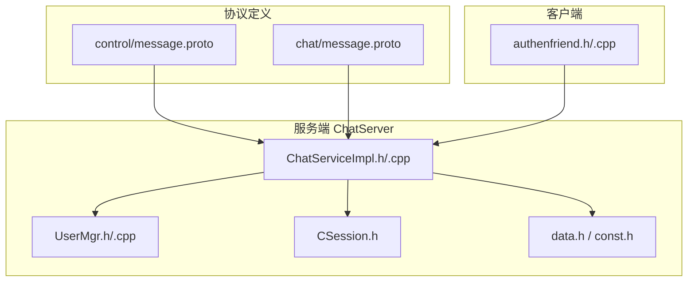
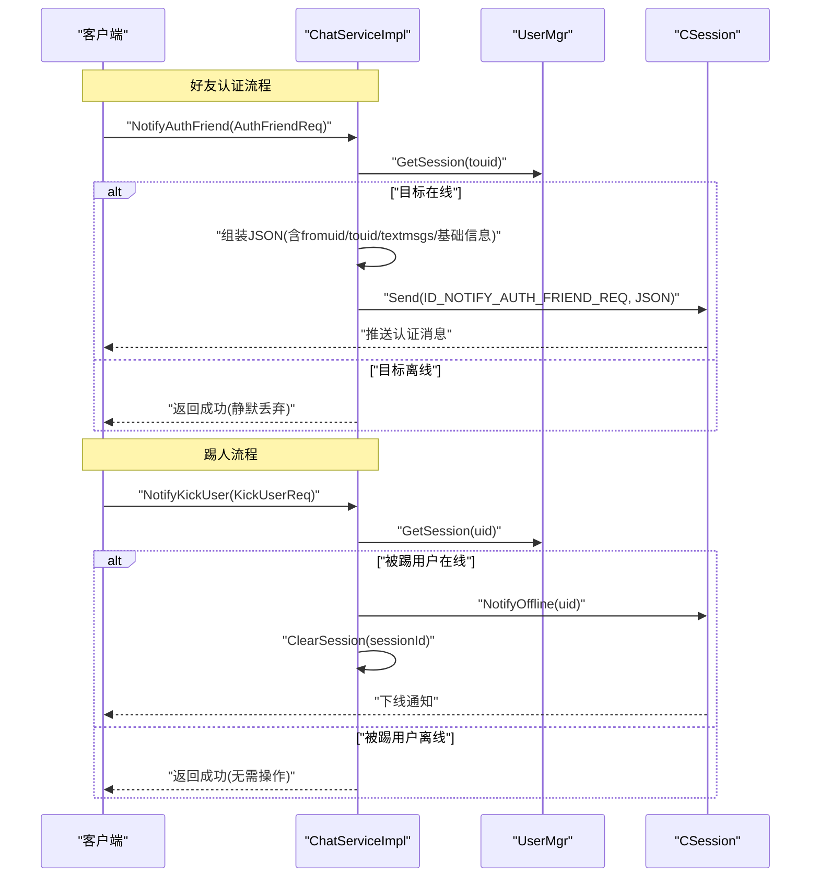
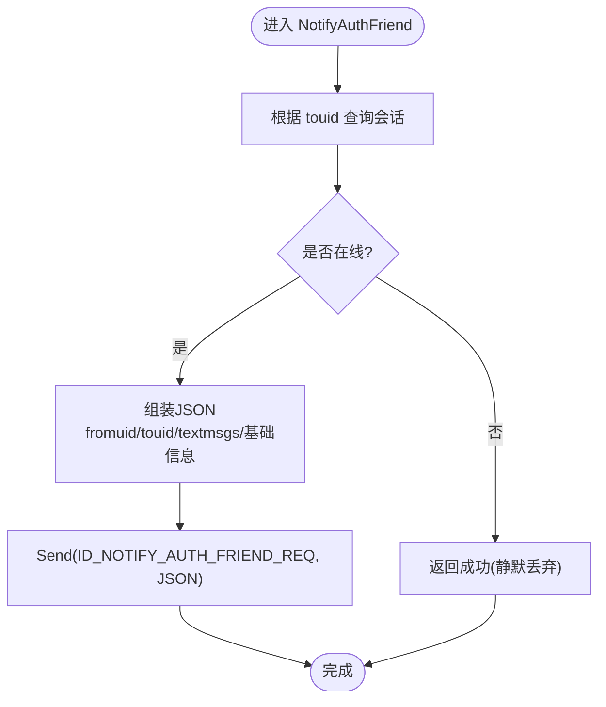
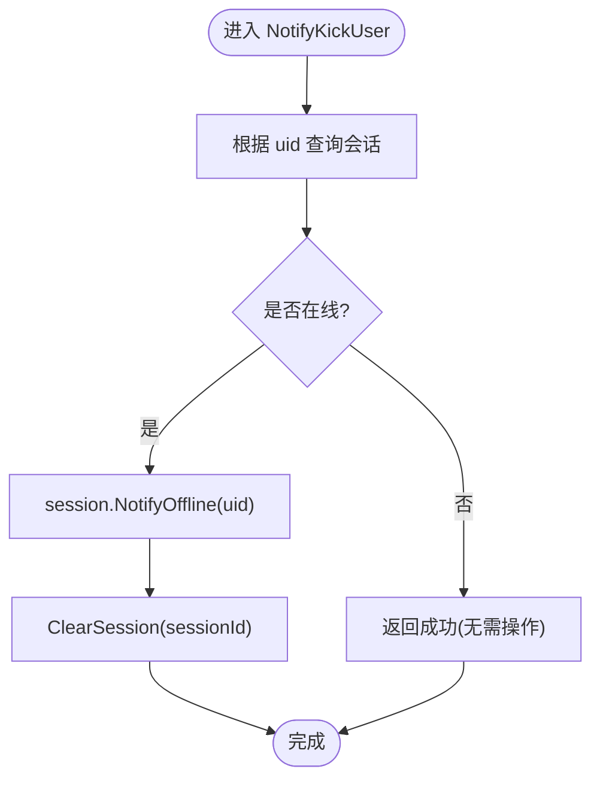
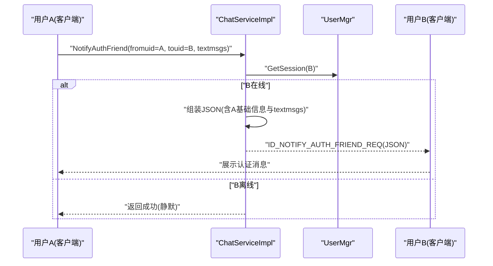
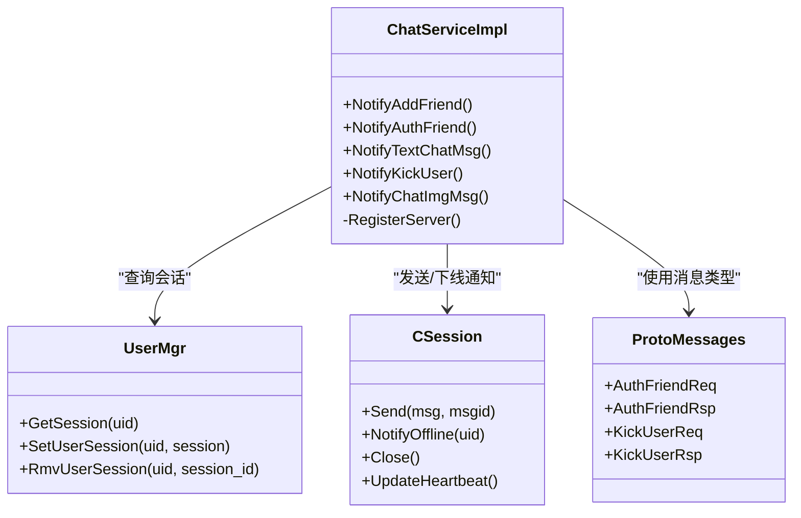

# 认证控制接口

<cite>
**本文引用的文件**   
- [server/proto/control/message.proto](file://server/proto/control/message.proto)
- [server/proto/chat/message.proto](file://server/proto/chat/message.proto)
- [server/ChatServer/include/ChatServiceImpl.h](file://server/ChatServer/include/ChatServiceImpl.h)
- [server/ChatServer/src/ChatServiceImpl.cpp](file://server/ChatServer/src/ChatServiceImpl.cpp)
- [server/ChatServer/include/UserMgr.h](file://server/ChatServer/include/UserMgr.h)
- [server/ChatServer/src/UserMgr.cpp](file://server/ChatServer/src/UserMgr.cpp)
- [server/ChatServer/include/CSession.h](file://server/ChatServer/include/CSession.h)
- [server/ChatServer/include/data.h](file://server/ChatServer/include/data.h)
- [server/ChatServer/include/const.h](file://server/ChatServer/include/const.h)
- [client/llfcchat/include/authenfriend.h](file://client/llfcchat/include/authenfriend.h)
- [client/llfcchat/src/authenfriend.cpp](file://client/llfcchat/src/authenfriend.cpp)
</cite>

## 目录
1. [简介](#简介)
2. [项目结构](#项目结构)
3. [核心组件](#核心组件)
4. [架构总览](#架构总览)
5. [详细组件分析](#详细组件分析)
6. [依赖关系分析](#依赖关系分析)
7. [性能考虑](#性能考虑)
8. [故障排查指南](#故障排查指南)
9. [结论](#结论)
10. [附录](#附录)

## 简介
本文件面向 ChatService 的认证与控制能力，重点说明以下两个 RPC 接口的定义、参数语义、处理流程与状态同步机制：
- 好友认证接口：NotifyAuthFriend（请求体 AuthFriendReq）
- 踢人接口：NotifyKickUser（请求体 KickUserReq）

文档同时覆盖认证流程的状态管理、权限控制策略、完整交互示例以及异常处理策略（如用户离线、权限不足等）。

## 项目结构
本项目采用多服务架构，认证与控制相关的协议定义位于 proto 目录；服务端实现位于 ChatServer；客户端 UI 与网络层位于 client/llfcchat。

图表来源 
- [server/proto/control/message.proto:126-142](file://server/proto/control/message.proto#L126-L142)
- [server/proto/chat/message.proto:129-166](file://server/proto/chat/message.proto#L129-L166)
- [server/ChatServer/include/ChatServiceImpl.h:29-53](file://server/ChatServer/include/ChatServiceImpl.h#L29-L53)
- [server/ChatServer/src/ChatServiceImpl.cpp:189-212](file://server/ChatServer/src/ChatServiceImpl.cpp#L189-L212)
- [server/ChatServer/include/UserMgr.h:10-20](file://server/ChatServer/include/UserMgr.h#L10-L20)
- [server/ChatServer/include/CSession.h:28-76](file://server/ChatServer/include/CSession.h#L28-L76)
- [server/ChatServer/include/data.h:4-15](file://server/ChatServer/include/data.h#L4-L15)
- [server/ChatServer/include/const.h:5-20](file://server/ChatServer/include/const.h#L5-L20)
- [client/llfcchat/include/authenfriend.h:13-61](file://client/llfcchat/include/authenfriend.h#L13-L61)
- [client/llfcchat/src/authenfriend.cpp:412-436](file://client/llfcchat/src/authenfriend.cpp#L412-L436)

章节来源
- [server/proto/control/message.proto:94-142](file://server/proto/control/message.proto#L94-L142)
- [server/proto/chat/message.proto:95-166](file://server/proto/chat/message.proto#L95-L166)
- [server/ChatServer/include/ChatServiceImpl.h:29-53](file://server/ChatServer/include/ChatServiceImpl.h#L29-L53)
- [server/ChatServer/src/ChatServiceImpl.cpp:49-103](file://server/ChatServer/src/ChatServiceImpl.cpp#L49-L103)
- [server/ChatServer/include/UserMgr.h:10-20](file://server/ChatServer/include/UserMgr.h#L10-L20)
- [server/ChatServer/include/CSession.h:28-76](file://server/ChatServer/include/CSession.h#L28-L76)
- [client/llfcchat/src/authenfriend.cpp:412-436](file://client/llfcchat/src/authenfriend.cpp#L412-L436)

## 核心组件
- ChatServiceImpl：实现 ChatService 的 gRPC 接口，包括 NotifyAuthFriend、NotifyKickUser 等，负责消息路由、会话查找、数据组装与下发。
- UserMgr：维护 uid 到 CSession 的映射，提供线程安全的会话查询与清理。
- CSession：封装 TCP 连接、发送队列、心跳、离线通知等。
- data.h/const.h：定义用户信息结构、错误码、消息 ID 常量等。
- 客户端 authenfriend：构建认证请求并发送。

章节来源
- [server/ChatServer/include/ChatServiceImpl.h:29-53](file://server/ChatServer/include/ChatServiceImpl.h#L29-L53)
- [server/ChatServer/src/ChatServiceImpl.cpp:49-103](file://server/ChatServer/src/ChatServiceImpl.cpp#L49-L103)
- [server/ChatServer/include/UserMgr.h:10-20](file://server/ChatServer/include/UserMgr.h#L10-L20)
- [server/ChatServer/include/CSession.h:28-76](file://server/ChatServer/include/CSession.h#L28-L76)
- [server/ChatServer/include/data.h:4-15](file://server/ChatServer/include/data.h#L4-L15)
- [server/ChatServer/include/const.h:5-20](file://server/ChatServer/include/const.h#L5-L20)
- [client/llfcchat/src/authenfriend.cpp:412-436](file://client/llfcchat/src/authenfriend.cpp#L412-L436)

## 架构总览
下图展示了从客户端发起“好友认证”到服务端推送给目标用户的整体流程，以及“踢人”控制流程。

图表来源 
- [server/proto/chat/message.proto:158-166](file://server/proto/chat/message.proto#L158-L166)
- [server/proto/control/message.proto:135-142](file://server/proto/control/message.proto#L135-L142)
- [server/ChatServer/src/ChatServiceImpl.cpp:49-103](file://server/ChatServer/src/ChatServiceImpl.cpp#L49-L103)
- [server/ChatServer/src/ChatServiceImpl.cpp:189-212](file://server/ChatServer/src/ChatServiceImpl.cpp#L189-L212)
- [server/ChatServer/include/UserMgr.h:10-20](file://server/ChatServer/include/UserMgr.h#L10-L20)
- [server/ChatServer/include/CSession.h:44-51](file://server/ChatServer/include/CSession.h#L44-L51)

## 详细组件分析

### 接口定义与字段说明
- AuthFriendReq（好友认证请求）
  - fromuid：发起认证的用户ID
  - touid：被认证的目标用户ID
  - textmsgs：认证消息列表（数组），每条包含 sender_id、unique_id、msg_id、thread_id、msgcontent、status 等字段
- AuthFriendRsp（好友认证响应）
  - error：错误码
  - fromuid、touid：回显请求方与被认证方ID
- KickUserReq（踢人请求）
  - uid：被踢用户ID
- KickUserRsp（踢人响应）
  - error：错误码
  - uid：被踢用户ID

章节来源
- [server/proto/chat/message.proto:95-105](file://server/proto/chat/message.proto#L95-L105)
- [server/proto/chat/message.proto:129-136](file://server/proto/chat/message.proto#L129-L136)
- [server/proto/control/message.proto:94-104](file://server/proto/control/message.proto#L94-L104)
- [server/proto/control/message.proto:126-133](file://server/proto/control/message.proto#L126-L133)

### 认证流程处理逻辑（NotifyAuthFriend）
- 根据 touid 查询在线会话
- 若目标在线：
  - 组装响应 JSON，包含 fromuid、touid、textmsgs 及 fromuid 的基础信息（name/nick/icon/sex）
  - 通过 CSession.Send 以 ID_NOTIFY_AUTH_FRIEND_REQ 推送给目标客户端
- 若目标离线：
  - 直接返回成功（静默丢弃）

图表来源 
- [server/ChatServer/src/ChatServiceImpl.cpp:49-103](file://server/ChatServer/src/ChatServiceImpl.cpp#L49-L103)
- [server/ChatServer/include/CSession.h:38-40](file://server/ChatServer/include/CSession.h#L38-L40)
- [server/ChatServer/include/const.h:56-60](file://server/ChatServer/include/const.h#L56-L60)

章节来源
- [server/ChatServer/src/ChatServiceImpl.cpp:49-103](file://server/ChatServer/src/ChatServiceImpl.cpp#L49-L103)
- [server/ChatServer/include/const.h:56-60](file://server/ChatServer/include/const.h#L56-L60)

### 踢人流程处理逻辑（NotifyKickUser）
- 根据 uid 查询在线会话
- 若在线：
  - 调用 session.NotifyOffline(uid) 触发客户端下线通知
  - 清理旧连接 ClearSession(sessionId)
- 若离线：
  - 直接返回成功（无需操作）

图表来源 
- [server/ChatServer/src/ChatServiceImpl.cpp:189-212](file://server/ChatServer/src/ChatServiceImpl.cpp#L189-L212)
- [server/ChatServer/include/CSession.h:44-51](file://server/ChatServer/include/CSession.h#L44-L51)

章节来源
- [server/ChatServer/src/ChatServiceImpl.cpp:189-212](file://server/ChatServer/src/ChatServiceImpl.cpp#L189-L212)
- [server/ChatServer/include/CSession.h:44-51](file://server/ChatServer/include/CSession.h#L44-L51)

### 客户端认证入口（UI 与发送）
- 用户在认证对话框中选择标签/填写备注后，构造 JSON 并触发发送
- 使用 ReqId::ID_AUTH_FRIEND_REQ 将数据发送至 ChatServer

章节来源
- [client/llfcchat/src/authenfriend.cpp:412-436](file://client/llfcchat/src/authenfriend.cpp#L412-L436)
- [client/llfcchat/include/authenfriend.h:24-56](file://client/llfcchat/include/authenfriend.h#L24-L56)

### 状态管理与权限控制
- 会话管理
  - UserMgr 维护 uid -> CSession 的映射，提供 GetSession/SetUserSession/RmvUserSession
  - 并发安全：内部使用互斥锁保护
- 权限控制
  - 当前实现未对调用者身份进行鉴权校验，仅依据 touid/uid 查找会话
  - 建议增加调用者 token 校验与业务权限检查（例如是否为管理员或群主）
- 状态同步
  - 认证消息通过 ID_NOTIFY_AUTH_FRIEND_REQ 推送
  - 踢人通过 NotifyOffline 与 ClearSession 保证连接清理与状态一致

章节来源
- [server/ChatServer/include/UserMgr.h:10-20](file://server/ChatServer/include/UserMgr.h#L10-L20)
- [server/ChatServer/src/UserMgr.cpp:10-44](file://server/ChatServer/src/UserMgr.cpp#L10-L44)
- [server/ChatServer/include/CSession.h:44-51](file://server/ChatServer/include/CSession.h#L44-L51)
- [server/ChatServer/include/const.h:56-60](file://server/ChatServer/include/const.h#L56-L60)

### 完整认证场景示例
- 场景：A 向 B 发起好友认证，附带多条认证消息
- 步骤：
  1) 客户端 A 构造 AuthFriendReq（fromuid=A, touid=B, textmsgs=[...]）
  2) 调用 NotifyAuthFriend
  3) 服务端查找 B 的会话
     - 若 B 在线：组装 JSON（含 A 的基础信息与 textmsgs），通过 ID_NOTIFY_AUTH_FRIEND_REQ 推送给 B
     - 若 B 离线：直接返回成功
  4) B 收到认证消息后展示并可选择同意/拒绝（由上层业务处理）

图表来源 
- [server/proto/chat/message.proto:95-105](file://server/proto/chat/message.proto#L95-L105)
- [server/ChatServer/src/ChatServiceImpl.cpp:49-103](file://server/ChatServer/src/ChatServiceImpl.cpp#L49-L103)
- [server/ChatServer/include/UserMgr.h:10-20](file://server/ChatServer/include/UserMgr.h#L10-L20)
- [server/ChatServer/include/const.h:56-60](file://server/ChatServer/include/const.h#L56-L60)

### 异常处理策略
- 用户离线
  - 认证：NotifyAuthFriend 在目标离线时直接返回成功，不投递消息
  - 踢人：NotifyKickUser 在目标离线时直接返回成功，无需操作
- 权限不足
  - 当前实现未做调用者鉴权，建议在接入层增加 token 校验与角色权限判断
- 数据一致性
  - 认证消息中的 textmsgs 需确保唯一性（unique_id/msg_id/thread_id）以避免重复或乱序
- 资源清理
  - 踢人成功后必须清理会话，避免僵尸连接

章节来源
- [server/ChatServer/src/ChatServiceImpl.cpp:49-103](file://server/ChatServer/src/ChatServiceImpl.cpp#L49-L103)
- [server/ChatServer/src/ChatServiceImpl.cpp:189-212](file://server/ChatServer/src/ChatServiceImpl.cpp#L189-L212)
- [server/ChatServer/include/const.h:5-20](file://server/ChatServer/include/const.h#L5-L20)

## 依赖关系分析

图表来源 
- [server/ChatServer/include/ChatServiceImpl.h:29-53](file://server/ChatServer/include/ChatServiceImpl.h#L29-L53)
- [server/ChatServer/include/UserMgr.h:10-20](file://server/ChatServer/include/UserMgr.h#L10-L20)
- [server/ChatServer/include/CSession.h:28-76](file://server/ChatServer/include/CSession.h#L28-L76)
- [server/proto/chat/message.proto:95-105](file://server/proto/chat/message.proto#L95-L105)
- [server/proto/chat/message.proto:129-136](file://server/proto/chat/message.proto#L129-L136)

章节来源
- [server/ChatServer/include/ChatServiceImpl.h:29-53](file://server/ChatServer/include/ChatServiceImpl.h#L29-L53)
- [server/ChatServer/include/UserMgr.h:10-20](file://server/ChatServer/include/UserMgr.h#L10-L20)
- [server/ChatServer/include/CSession.h:28-76](file://server/ChatServer/include/CSession.h#L28-L76)
- [server/proto/chat/message.proto:95-105](file://server/proto/chat/message.proto#L95-L105)
- [server/proto/chat/message.proto:129-136](file://server/proto/chat/message.proto#L129-L136)

## 性能考虑
- 会话查找为 O(1) 哈希表访问，具备良好扩展性
- 认证消息批量拼装 JSON，注意 textmsgs 规模过大时的序列化开销
- 推送路径短平快，无额外阻塞 I/O
- 建议：
  - 对 textmsgs 设置上限与分页策略
  - 对高频认证场景引入本地缓存或去重机制
  - 监控推送失败率与延迟指标

[本节为通用指导，不涉及具体文件分析]

## 故障排查指南
- 常见问题定位
  - 认证消息未到达：检查目标用户是否在线（UserMgr.GetSession）
  - 踢人不生效：确认 NotifyOffline 与 ClearSession 是否执行
  - 权限问题：当前未鉴权，需在接入层补充 token 校验
- 日志与调试
  - 关注错误码 ErrorCodes 与消息 ID 常量 MSG_IDS
  - 检查 Redis/Mysql 获取基础信息的链路（GetBaseInfo）

章节来源
- [server/ChatServer/include/const.h:5-20](file://server/ChatServer/include/const.h#L5-L20)
- [server/ChatServer/include/const.h:49-79](file://server/ChatServer/include/const.h#L49-L79)
- [server/ChatServer/src/ChatServiceImpl.cpp:142-187](file://server/ChatServer/src/ChatServiceImpl.cpp#L142-L187)

## 结论
- NotifyAuthFriend 用于将认证消息推送到目标用户，支持携带多条认证消息与发送方基础信息
- NotifyKickUser 用于强制下线指定用户，确保连接清理与状态一致
- 当前实现侧重快速转发与状态同步，尚未内置调用者鉴权，建议在生产环境完善权限控制
- 建议在客户端与服务端共同保障消息幂等性与顺序性，提升用户体验

[本节为总结，不涉及具体文件分析]

## 附录
- 相关数据结构
  - UserInfo：用户基本信息（name/pwd/email/nick/desc/sex/icon/back）
  - MsgStatus：消息状态（未读/发送失败/已读/未上传）
- 关键常量
  - ErrorCodes：错误码集合
  - MSG_IDS：消息类型标识（如 ID_NOTIFY_AUTH_FRIEND_REQ、ID_NOTIFY_OFF_LINE_REQ 等）

章节来源
- [server/ChatServer/include/data.h:4-15](file://server/ChatServer/include/data.h#L4-L15)
- [server/ChatServer/include/const.h:96-101](file://server/ChatServer/include/const.h#L96-L101)
- [server/ChatServer/include/const.h:49-79](file://server/ChatServer/include/const.h#L49-L79)