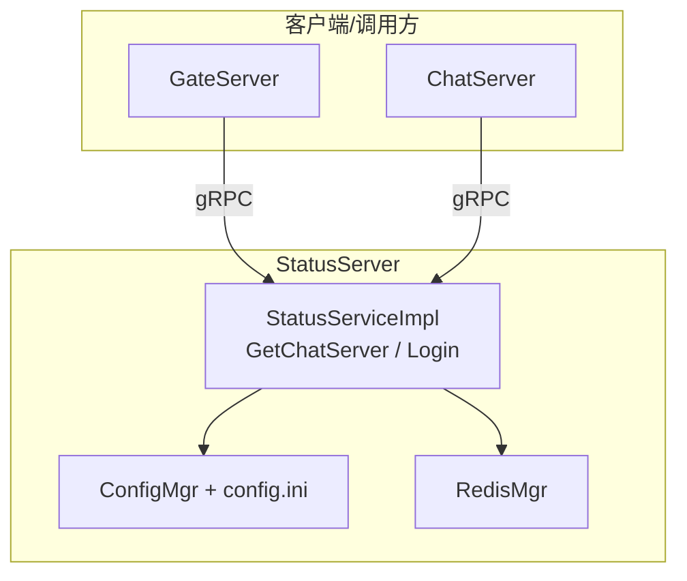
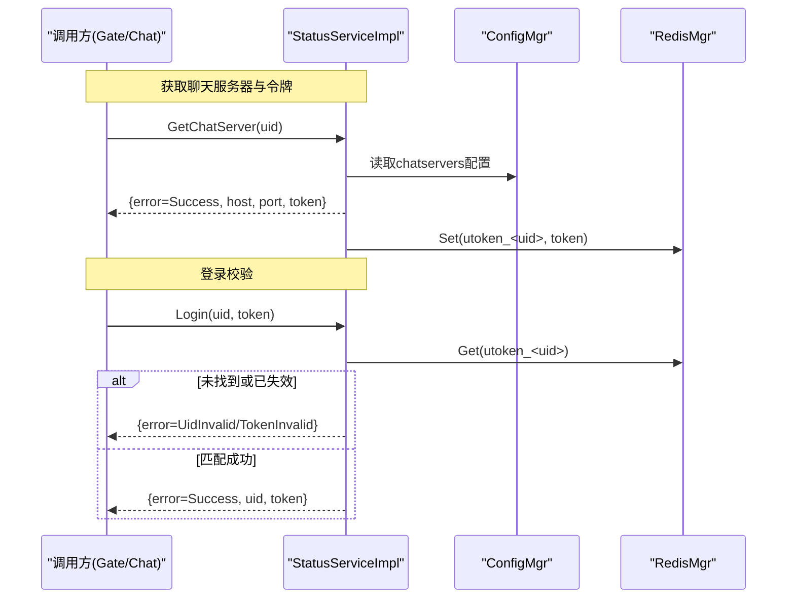
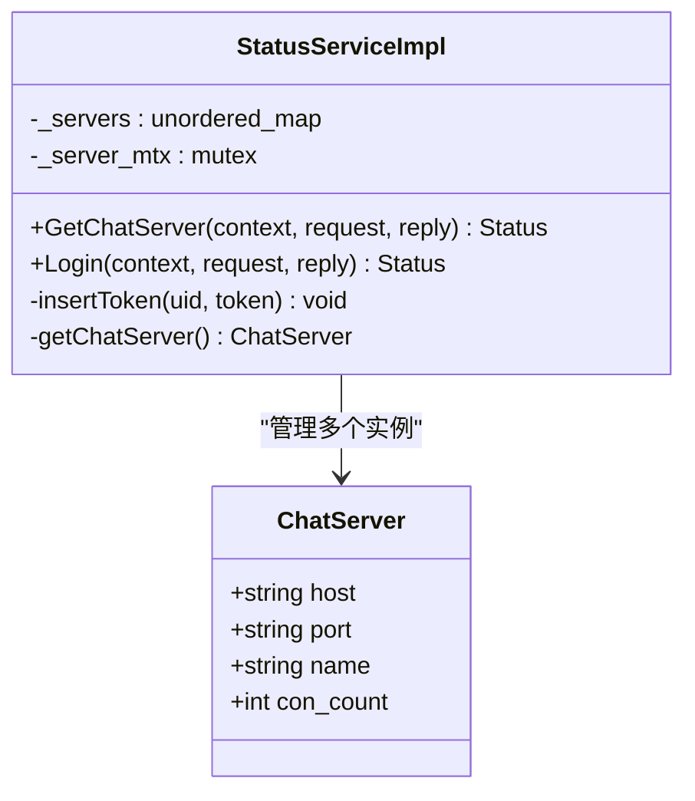
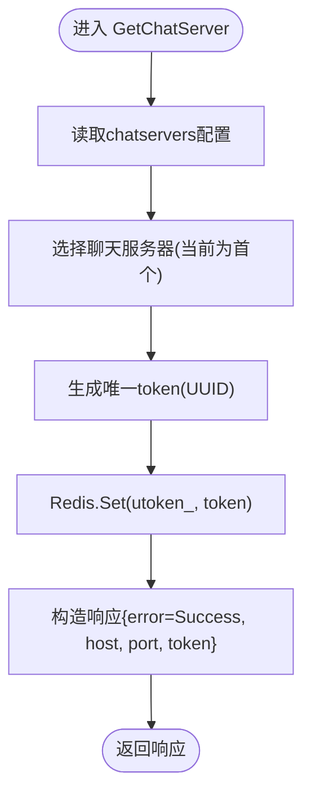
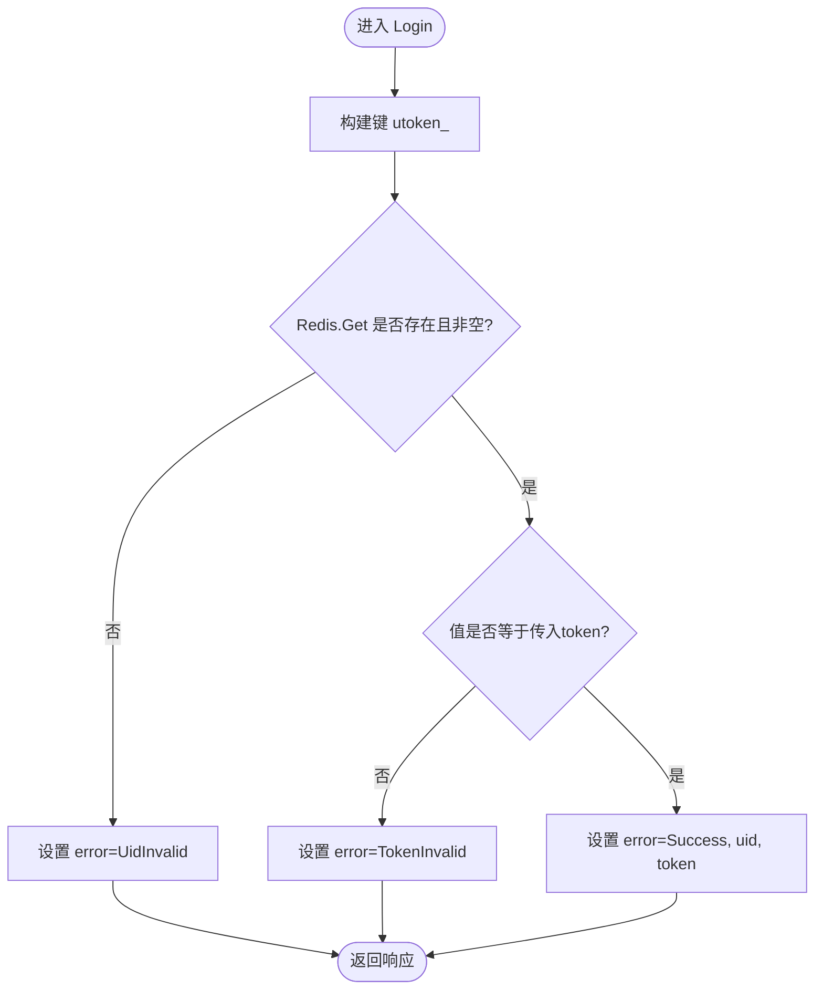
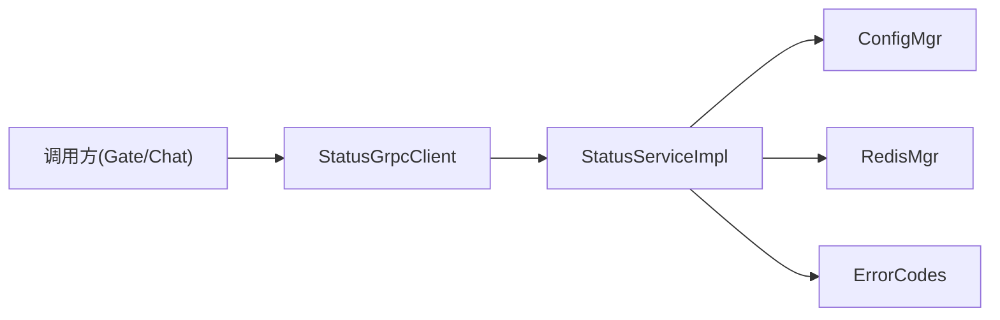

# StatusService状态服务API文档

<cite>
**本文档引用的文件**
- [StatusServiceImpl.h](file://server/StatusServer/include/StatusServiceImpl.h)
- [StatusServiceImpl.cpp](file://server/StatusServer/src/StatusServiceImpl.cpp)
- [message.proto](file://server/proto/chat/message.proto)
- [const.h](file://server/StatusServer/include/const.h)
- [config.ini](file://server/StatusServer/config/config.ini)
- [StatusGrpcClient.h](file://server/ChatServer/include/StatusGrpcClient.h)
- [StatusGrpcClient.cpp](file://server/ChatServer/src/StatusGrpcClient.cpp)
</cite>

## 目录
1. [简介](#简介)
2. [项目结构](#项目结构)
3. [核心组件](#核心组件)
4. [架构总览](#架构总览)
5. [详细组件分析](#详细组件分析)
6. [依赖关系分析](#依赖关系分析)
7. [性能考虑](#性能考虑)
8. [故障排查指南](#故障排查指南)
9. [结论](#结论)
10. [附录：请求与响应示例](#附录请求与响应示例)

## 简介
本文件为 StatusService 状态服务的 API 文档，聚焦以下两个 RPC：
- GetChatServer：根据用户 uid 返回聊天服务器地址（host/port）和连接令牌 token。
- Login：基于 token 进行登录校验，完成用户身份认证。

该服务通过 gRPC 暴露接口，使用 Redis 存储用户 token，并依据配置动态选择聊天服务器。

## 项目结构
StatusService 位于 server/StatusServer 模块中，核心实现由 gRPC 服务类 StatusServiceImpl 提供；协议定义在 proto 文件中；错误码与常量在 const.h 中；服务启动与配置读取在 ConfigMgr 与 config.ini 中。

图表来源
- [StatusServiceImpl.cpp:17-27](file://server/StatusServer/src/StatusServiceImpl.cpp#L17-L27)
- [StatusServiceImpl.cpp:94-116](file://server/StatusServer/src/StatusServiceImpl.cpp#L94-L116)
- [config.ini:14-23](file://server/StatusServer/config/config.ini#L14-L23)

章节来源
- [StatusServiceImpl.h:36-50](file://server/StatusServer/include/StatusServiceImpl.h#L36-L50)
- [StatusServiceImpl.cpp:29-55](file://server/StatusServer/src/StatusServiceImpl.cpp#L29-L55)
- [message.proto:19-44](file://server/proto/chat/message.proto#L19-L44)

## 核心组件
- StatusServiceImpl：实现 StatusService 的两个 RPC 方法，负责：
  - GetChatServer：生成唯一 token、写入 Redis、选择聊天服务器并返回 host/port/token。
  - Login：从 Redis 读取并校验 token，返回错误码与用户信息。
- 消息类型（proto）：GetChatServerReq/Rsp、LoginReq/Rsp。
- 错误码：ErrorCodes 枚举，包含 Success、TokenInvalid、UidInvalid、RPCFailed 等。
- 配置与存储：config.ini 中的 chatservers 列表；Redis 用于 token 存储与校验。

章节来源
- [StatusServiceImpl.h:36-50](file://server/StatusServer/include/StatusServiceImpl.h#L36-L50)
- [message.proto:19-44](file://server/proto/chat/message.proto#L19-L44)
- [const.h:32-45](file://server/StatusServer/include/const.h#L32-L45)
- [config.ini:14-23](file://server/StatusServer/config/config.ini#L14-L23)

## 架构总览
StatusService 作为“状态与路由”中心，承担两项职责：
- 分配聊天服务器地址与连接令牌（GetChatServer）。
- 校验连接令牌并完成登录（Login）。

图表来源
- [StatusServiceImpl.cpp:17-27](file://server/StatusServer/src/StatusServiceImpl.cpp#L17-L27)
- [StatusServiceImpl.cpp:94-116](file://server/StatusServer/src/StatusServiceImpl.cpp#L94-L116)
- [config.ini:14-23](file://server/StatusServer/config/config.ini#L14-L23)

## 详细组件分析

### 类与接口设计
StatusServiceImpl 继承自 gRPC 生成的 StatusService::Service，并提供两个 RPC 实现。内部维护聊天服务器映射表与互斥锁，保证并发安全。

图表来源
- [StatusServiceImpl.h:16-50](file://server/StatusServer/include/StatusServiceImpl.h#L16-L50)

章节来源
- [StatusServiceImpl.h:36-50](file://server/StatusServer/include/StatusServiceImpl.h#L36-L50)

### GetChatServer 方法详解
- 输入参数
  - uid：用户标识，用于生成并绑定 token。
- 处理流程
  - 从配置加载聊天服务器列表，选择其中一个（当前实现返回首个）。
  - 生成唯一 token（UUID），写入 Redis 键 utoken_<uid>。
  - 返回 host、port、token 以及 error=Success。
- 输出字段
  - host：聊天服务器主机地址。
  - port：聊天服务器端口号。
  - token：连接令牌，后续 Login 校验用。
  - error：错误码，成功时为 Success。

图表来源
- [StatusServiceImpl.cpp:17-27](file://server/StatusServer/src/StatusServiceImpl.cpp#L17-L27)
- [StatusServiceImpl.cpp:29-55](file://server/StatusServer/src/StatusServiceImpl.cpp#L29-L55)
- [config.ini:14-23](file://server/StatusServer/config/config.ini#L14-L23)

章节来源
- [StatusServiceImpl.cpp:17-27](file://server/StatusServer/src/StatusServiceImpl.cpp#L17-L27)
- [StatusServiceImpl.cpp:29-55](file://server/StatusServer/src/StatusServiceImpl.cpp#L29-L55)

### Login 方法详解
- 输入参数
  - uid：用户标识。
  - token：连接令牌，需与 GetChatServer 返回的 token 一致。
- 处理流程
  - 计算 Redis 键 utoken_<uid> 并尝试读取。
  - 若不存在或值不匹配，则返回相应错误码（UidInvalid 或 TokenInvalid）。
  - 若匹配成功，返回 error=Success，并回显 uid 与 token。
- 输出字段
  - error：错误码，成功时为 Success。
  - uid：用户标识。
  - token：原样返回的 token。

图表来源
- [StatusServiceImpl.cpp:94-116](file://server/StatusServer/src/StatusServiceImpl.cpp#L94-L116)

章节来源
- [StatusServiceImpl.cpp:94-116](file://server/StatusServer/src/StatusServiceImpl.cpp#L94-L116)

### 错误码说明与处理策略
- Success（0）：操作成功。
- UidInvalid（1011）：Redis 中未找到对应 uid 的 token，视为 uid 无效或未获取过 token。
- TokenInvalid（1010）：token 不匹配，视为 token 失效或被篡改。
- RPCFailed（1002）：底层 gRPC 调用失败（由调用方封装时设置）。

处理建议：
- 网络异常（RPCFailed）：重试机制、降级提示、记录日志。
- 认证失败（UidInvalid/TokenInvalid）：引导重新获取 token，或提示用户重新登录。
- 业务成功（Success）：继续后续流程（如建立聊天连接）。

章节来源
- [const.h:32-45](file://server/StatusServer/include/const.h#L32-L45)
- [StatusGrpcClient.cpp:14-20](file://server/ChatServer/src/StatusGrpcClient.cpp#L14-L20)
- [StatusGrpcClient.cpp:36-42](file://server/ChatServer/src/StatusGrpcClient.cpp#L36-L42)

## 依赖关系分析
- StatusServiceImpl 依赖：
  - ConfigMgr：读取 chatservers 配置。
  - RedisMgr：读写 token。
  - 错误码常量：ErrorCodes。
- 调用方依赖：
  - StatusGrpcClient：封装 gRPC 调用，统一错误码处理。

图表来源
- [StatusServiceImpl.cpp:29-55](file://server/StatusServer/src/StatusServiceImpl.cpp#L29-L55)
- [StatusGrpcClient.cpp:1-52](file://server/ChatServer/src/StatusGrpcClient.cpp#L1-L52)

章节来源
- [StatusServiceImpl.cpp:29-55](file://server/StatusServer/src/StatusServiceImpl.cpp#L29-L55)
- [StatusGrpcClient.h:82-95](file://server/ChatServer/include/StatusGrpcClient.h#L82-L95)

## 性能考虑
- 服务器选择：当前实现直接返回首个服务器，未做负载统计。可结合 Redis 的连接计数或延迟指标进行负载均衡。
- Redis 访问：token 写入与读取均为 O(1)，注意键前缀 USERTOKENPREFIX 避免冲突。
- 并发安全：getChatServer 使用互斥锁保护 _servers 遍历，确保线程安全。
- gRPC 连接池：调用方使用 StatusConPool 复用通道与 stub，减少握手开销。

[本节为通用指导，不直接分析具体文件]

## 故障排查指南
- 无法获取聊天服务器
  - 检查 config.ini 中 chatservers 配置是否正确。
  - 确认 StatusServer 端口与 Host 配置正确。
  - 查看调用方日志中的 RPCFailed 错误码。
- 登录失败（UidInvalid/TokenInvalid）
  - 确认先调用 GetChatServer 获取 token，再调用 Login。
  - 检查 Redis 中 utoken_<uid> 是否存在且值与请求一致。
  - 排查网络与跨进程 token 传递问题。
- 网络异常
  - 检查 gRPC 连接池初始化与关闭逻辑。
  - 增加重试与超时控制，记录详细错误上下文。

章节来源
- [config.ini:1-13](file://server/StatusServer/config/config.ini#L1-L13)
- [StatusGrpcClient.cpp:14-20](file://server/ChatServer/src/StatusGrpcClient.cpp#L14-L20)
- [StatusGrpcClient.cpp:36-42](file://server/ChatServer/src/StatusGrpcClient.cpp#L36-L42)

## 结论
StatusService 提供了稳定的“获取聊天服务器与令牌”和“登录校验”能力。通过 Redis 保障 token 一致性，通过配置驱动服务器选择。建议在后续版本引入负载均衡与更完善的错误恢复机制，以提升系统可用性与扩展性。

[本节为总结，不直接分析具体文件]

## 附录：请求与响应示例

### GetChatServer
- 请求消息 GetChatServerReq
  - uid：整型用户标识。
- 响应消息 GetChatServerRsp
  - error：错误码（成功为 Success）。
  - host：聊天服务器主机地址。
  - port：聊天服务器端口号。
  - token：连接令牌。

章节来源
- [message.proto:19-28](file://server/proto/chat/message.proto#L19-L28)
- [StatusServiceImpl.cpp:17-27](file://server/StatusServer/src/StatusServiceImpl.cpp#L17-L27)

### Login
- 请求消息 LoginReq
  - uid：整型用户标识。
  - token：字符串连接令牌。
- 响应消息 LoginRsp
  - error：错误码（成功为 Success，失败为 UidInvalid/TokenInvalid）。
  - uid：用户标识。
  - token：原样返回的 token。

章节来源
- [message.proto:30-39](file://server/proto/chat/message.proto#L30-L39)
- [StatusServiceImpl.cpp:94-116](file://server/StatusServer/src/StatusServiceImpl.cpp#L94-L116)

### 典型调用序列
- 客户端先调用 GetChatServer(uid) 获取 host/port/token。
- 随后调用 Login(uid, token) 完成登录校验。
- 成功后使用 host/port 建立聊天连接，携带 token 进行鉴权。

章节来源
- [StatusGrpcClient.cpp:1-52](file://server/ChatServer/src/StatusGrpcClient.cpp#L1-L52)