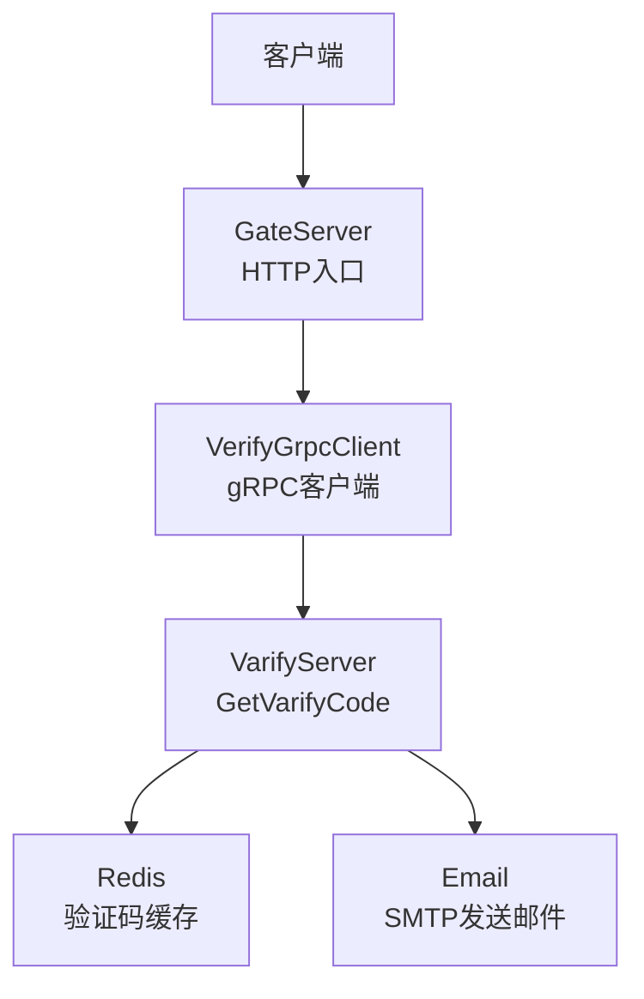
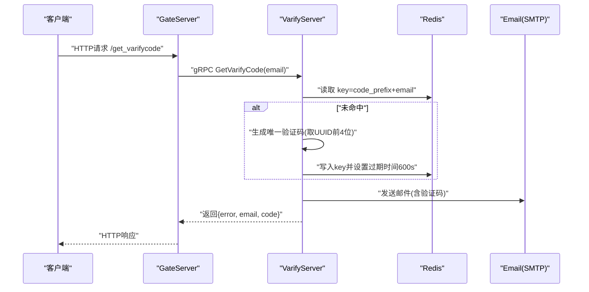
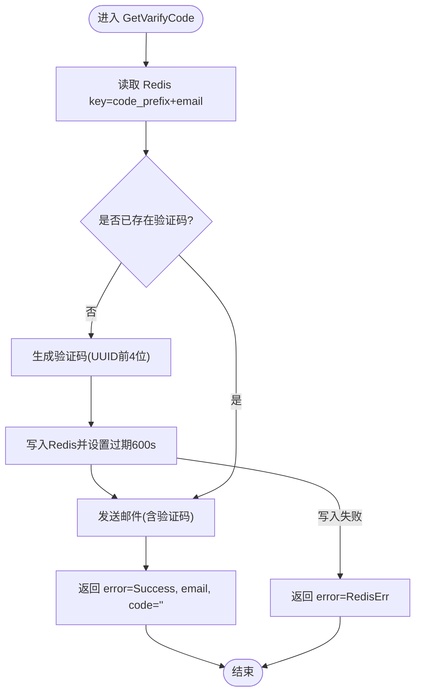
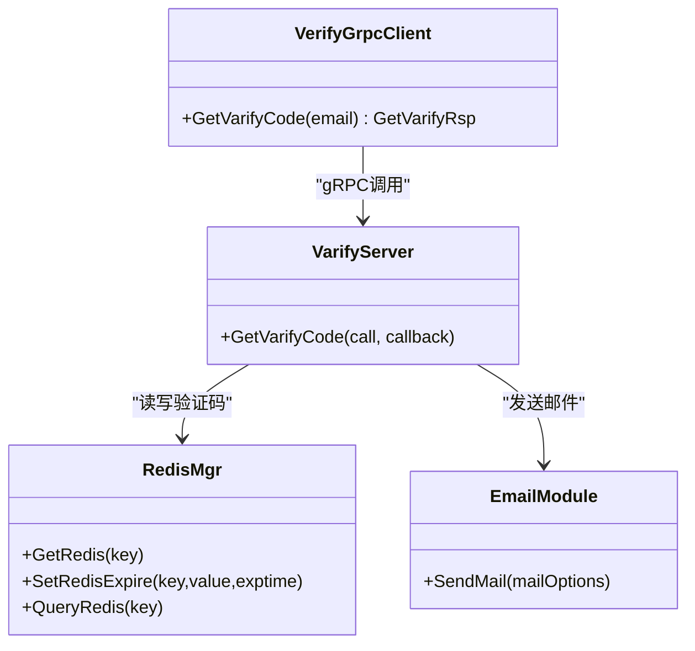

# VarifyService验证码服务

<cite>
**本文引用的文件**   
- [server.js](file://server/VarifyServer/server.js)
- [message.proto](file://server/VarifyServer/message.proto)
- [email.js](file://server/VarifyServer/email.js)
- [redis.js](file://server/VarifyServer/redis.js)
- [const.js](file://server/VarifyServer/const.js)
- [config.json](file://server/VarifyServer/config.json)
- [VerifyGrpcClient.h](file://server/GateServer/include/VerifyGrpcClient.h)
- [VerifyGrpcClient.cpp](file://server/GateServer/src/VerifyGrpcClient.cpp)
- [LogicSystem.cpp](file://server/GateServer/src/LogicSystem.cpp)
</cite>

## 目录
1. [简介](#简介)
2. [项目结构](#项目结构)
3. [核心组件](#核心组件)
4. [架构总览](#架构总览)
5. [详细组件分析](#详细组件分析)
6. [依赖关系分析](#依赖关系分析)
7. [性能考虑](#性能考虑)
8. [故障排查指南](#故障排查指南)
9. [结论](#结论)
10. [附录](#附录)

## 简介
本文件为 VarifyService 验证码服务的API文档，聚焦 GetVarifyCode 方法。内容涵盖：
- 请求消息 GetVarifyReq 与响应消息 GetVarifyRsp 的字段说明
- email 参数的校验规则建议
- 验证码生成算法、有效期管理、Redis缓存策略
- 邮件发送集成流程
- 安全考量（防刷、加密存储等）
- 调用示例与异常处理

## 项目结构
VarifyService 基于 Node.js + gRPC 实现，GateServer 通过 gRPC 客户端调用该服务。关键文件如下：
- server/VarifyServer/server.js：gRPC 服务实现，包含 GetVarifyCode 逻辑
- server/VarifyServer/message.proto：gRPC 接口定义
- server/VarifyServer/email.js：邮件发送封装
- server/VarifyServer/redis.js：Redis 操作封装
- server/VarifyServer/const.js：常量与错误码
- server/VarifyServer/config.json：配置项（邮箱、Redis、MySQL等）
- server/GateServer/include/VerifyGrpcClient.h：C++ gRPC 客户端封装
- server/GateServer/src/VerifyGrpcClient.cpp：客户端初始化与连接池
- server/GateServer/src/LogicSystem.cpp：HTTP 到 gRPC 的转发与业务编排

图表来源 
- [VerifyGrpcClient.h:80-110](file://server/GateServer/include/VerifyGrpcClient.h#L80-L110)
- [VerifyGrpcClient.cpp:4-9](file://server/GateServer/src/VerifyGrpcClient.cpp#L4-L9)
- [server.js:15-64](file://server/VarifyServer/server.js#L15-L64)
- [redis.js:41-98](file://server/VarifyServer/redis.js#L41-L98)
- [email.js:22-35](file://server/VarifyServer/email.js#L22-L35)

章节来源
- [server.js:15-64](file://server/VarifyServer/server.js#L15-L64)
- [message.proto:5-17](file://server/VarifyServer/message.proto#L5-L17)
- [VerifyGrpcClient.h:80-110](file://server/GateServer/include/VerifyGrpcClient.h#L80-L110)
- [VerifyGrpcClient.cpp:4-9](file://server/GateServer/src/VerifyGrpcClient.cpp#L4-L9)
- [LogicSystem.cpp:107-142](file://server/GateServer/src/LogicSystem.cpp#L107-L142)

## 核心组件
- gRPC 接口定义：VarifyService.GetVarifyCode
- 请求体：GetVarifyReq.email
- 响应体：GetVarifyRsp.error, GetVarifyRsp.email, GetVarifyRsp.code
- 验证码生成与缓存：UUID截取前4位，Redis键格式 code_prefix+email，过期时间600秒
- 邮件发送：使用 nodemailer 通过 SMTP 发送验证码文本
- 错误码：Success=0, RedisErr=1, Exception=2

章节来源
- [message.proto:5-17](file://server/VarifyServer/message.proto#L5-L17)
- [server.js:15-64](file://server/VarifyServer/server.js#L15-L64)
- [const.js:1-10](file://server/VarifyServer/const.js#L1-L10)
- [redis.js:41-98](file://server/VarifyServer/redis.js#L41-L98)
- [email.js:22-35](file://server/VarifyServer/email.js#L22-L35)

## 架构总览
GetVarifyCode 的端到端调用序列如下：

图表来源 
- [server.js:15-64](file://server/VarifyServer/server.js#L15-L64)
- [redis.js:41-98](file://server/VarifyServer/redis.js#L41-L98)
- [email.js:22-35](file://server/VarifyServer/email.js#L22-L35)
- [VerifyGrpcClient.h:87-104](file://server/GateServer/include/VerifyGrpcClient.h#L87-L104)

## 详细组件分析

### API 定义与字段说明
- 服务与方法：VarifyService.GetVarifyCode
- 请求消息 GetVarifyReq
  - email: string，用于标识用户邮箱地址
- 响应消息 GetVarifyRsp
  - error: int32，错误码（0成功，1 Redis错误，2 异常）
  - email: string，回显请求中的邮箱地址
  - code: string，验证码字符串（当前实现中不直接返回，由邮件发送）

章节来源
- [message.proto:5-17](file://server/VarifyServer/message.proto#L5-L17)
- [const.js:1-10](file://server/VarifyServer/const.js#L1-L10)

### GetVarifyCode 方法详解
- 输入参数
  - call.request.email：邮箱地址
- 处理流程
  - 从 Redis 查询 key=code_prefix+email 的验证码
  - 若不存在，则生成唯一验证码（UUID截取前4位），写入 Redis 并设置过期时间为600秒
  - 构造邮件内容，包含验证码与提示语，通过 SMTP 发送
  - 返回响应，包含 error、email；code 字段在当前实现中为空
- 异常处理
  - Redis 写入失败时返回 RedisErr
  - 其他异常捕获后返回 Exception

图表来源 
- [server.js:15-64](file://server/VarifyServer/server.js#L15-L64)
- [redis.js:87-98](file://server/VarifyServer/redis.js#L87-L98)

章节来源
- [server.js:15-64](file://server/VarifyServer/server.js#L15-L64)

### 邮箱参数 email 验证规则
- 当前实现未对 email 进行格式校验，建议在网关层或服务层增加正则校验
- 建议规则
  - 非空且长度合理
  - 符合标准邮箱格式（如 user@domain.tld）
  - 域名部分需包含至少一个点号
- 可在 GateServer 或 VarifyServer 入口处统一校验，避免无效请求进入后续流程

章节来源
- [server.js:15-64](file://server/VarifyServer/server.js#L15-L64)

### 验证码生成算法
- 生成方式：使用 UUID v4，截取前4个字符作为验证码
- 特点：短小易记，便于用户输入；但碰撞概率略高，适合短时有效场景
- 改进建议：如需更高安全性，可增加长度或使用更复杂的随机源

章节来源
- [server.js:24-28](file://server/VarifyServer/server.js#L24-L28)

### 存储机制与有效期管理
- 存储位置：Redis
- Key 格式：code_prefix + email（例如 "code_xxx@xxx.com"）
- 过期时间：600秒（10分钟）
- 操作封装：GetRedis、SetRedisExpire、QueryRedis
- 心跳与健康检查：定时写入 heartbeat key，便于监控连接状态

章节来源
- [redis.js:41-98](file://server/VarifyServer/redis.js#L41-L98)
- [const.js:1-10](file://server/VarifyServer/const.js#L1-L10)
- [config.json:1-21](file://server/VarifyServer/config.json#L1-L21)

### 邮件发送集成
- 使用 nodemailer 创建 SMTP 传输通道
- 配置项：host、port、secure、auth.user、auth.pass
- 发送内容：包含验证码与提示语
- 错误处理：发送失败时抛出异常，由上层捕获并返回错误码

章节来源
- [email.js:22-35](file://server/VarifyServer/email.js#L22-L35)
- [config.json:1-21](file://server/VarifyServer/config.json#L1-L21)

### GateServer 调用流程
- HTTP 入口接收请求，解析 JSON，提取 email
- 通过 VerifyGrpcClient 调用 VarifyServer.GetVarifyCode
- 将 gRPC 响应转换为 HTTP 响应返回给客户端
- 在注册/重置流程中，后续会从 Redis 校验验证码（防止过期与错误）

章节来源
- [VerifyGrpcClient.h:87-104](file://server/GateServer/include/VerifyGrpcClient.h#L87-L104)
- [VerifyGrpcClient.cpp:4-9](file://server/GateServer/src/VerifyGrpcClient.cpp#L4-L9)
- [LogicSystem.cpp:107-142](file://server/GateServer/src/LogicSystem.cpp#L107-L142)

## 依赖关系分析
- VarifyServer 依赖
  - @grpc/grpc-js：gRPC 服务端
  - uuid：生成唯一ID
  - nodemailer：邮件发送
  - ioredis：Redis 客户端
- GateServer 依赖
  - grpcpp：gRPC 客户端
  - 连接池：RPConPool 管理多个 VarifyService::Stub

图表来源 
- [server.js:15-64](file://server/VarifyServer/server.js#L15-L64)
- [redis.js:41-98](file://server/VarifyServer/redis.js#L41-L98)
- [email.js:22-35](file://server/VarifyServer/email.js#L22-L35)
- [VerifyGrpcClient.h:87-104](file://server/GateServer/include/VerifyGrpcClient.h#L87-L104)

章节来源
- [server.js:15-64](file://server/VarifyServer/server.js#L15-L64)
- [VerifyGrpcClient.h:87-104](file://server/GateServer/include/VerifyGrpcClient.h#L87-L104)

## 性能考虑
- Redis 操作为 O(1)，整体延迟主要受网络与邮件发送影响
- 连接池复用 gRPC 连接，减少握手开销
- 建议
  - 对频繁请求的邮箱实施限流（如每IP每分钟最多N次）
  - 邮件发送异步化，避免阻塞主流程
  - Redis 集群与持久化策略根据可用性需求调整

[本节为通用指导，无需引用具体文件]

## 故障排查指南
- Redis 连接异常
  - 现象：GetRedis/SetRedisExpire 失败
  - 排查：检查 config.json 中 redis.host/port/passwd，确认 Redis 服务可用
- 邮件发送失败
  - 现象：SendMail 抛错
  - 排查：检查 SMTP 配置（host、port、secure、auth.user、auth.pass），确认授权码正确
- 验证码未生效
  - 现象：注册/重置时校验失败
  - 排查：确认 Redis 中 key 是否存在且未过期，核对 key 格式与过期时间
- gRPC 调用失败
  - 现象：RPCFailed
  - 排查：检查 GateServer 配置的 VarifyServer Host/Port，确认服务启动正常

章节来源
- [redis.js:41-98](file://server/VarifyServer/redis.js#L41-L98)
- [email.js:22-35](file://server/VarifyServer/email.js#L22-L35)
- [VerifyGrpcClient.h:95-104](file://server/GateServer/include/VerifyGrpcClient.h#L95-L104)

## 结论
VarifyService 提供了简洁高效的验证码获取能力，结合 Redis 缓存与邮件发送完成闭环。当前实现未对 email 做严格校验，且 code 字段未返回，建议在网关层增强校验并在响应中补充 code 字段以便调试。同时应加强安全策略（限流、加密存储、审计日志）以提升鲁棒性。

[本节为总结，无需引用具体文件]

## 附录

### API 定义表
- 服务：VarifyService
- 方法：GetVarifyCode
- 请求：GetVarifyReq
  - email: string
- 响应：GetVarifyRsp
  - error: int32（0成功，1 Redis错误，2 异常）
  - email: string
  - code: string（当前实现为空）

章节来源
- [message.proto:5-17](file://server/VarifyServer/message.proto#L5-L17)

### 调用示例（概念性）
- 构造请求
  - 设置 email 为合法邮箱地址
- 发送请求
  - 通过 GateServer HTTP 接口或 VarifyServer gRPC 接口发送
- 处理响应
  - error=0 表示成功，检查邮箱是否收到验证码
  - error=1 表示 Redis 错误，重试或检查配置
  - error=2 表示异常，查看日志定位问题
- 异常情况
  - 网络超时：重试机制与退避策略
  - 邮件失败：记录日志并通知运维
  - Redis 不可用：降级策略（如本地缓存或队列）

[本节为概念性示例，无需引用具体文件]

### 安全建议
- 防刷机制
  - 按 IP/邮箱维度限制单位时间内请求次数
  - 引入验证码图形或人机验证
- 验证码加密存储
  - 在 Redis 中对验证码进行哈希或对称加密存储
  - 定期清理过期数据
- 传输安全
  - 使用 TLS 保护 gRPC 通信
  - 敏感配置（邮箱密码）使用密钥管理服务

[本节为通用建议，无需引用具体文件]