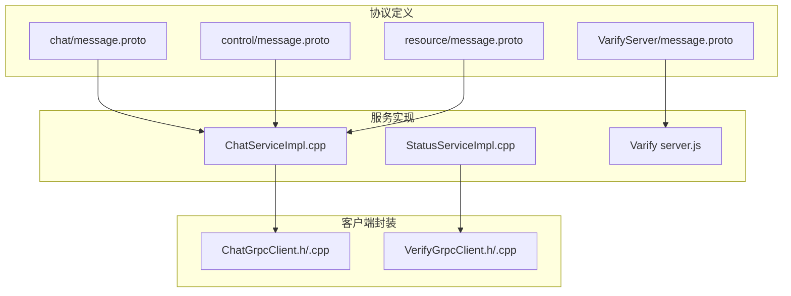
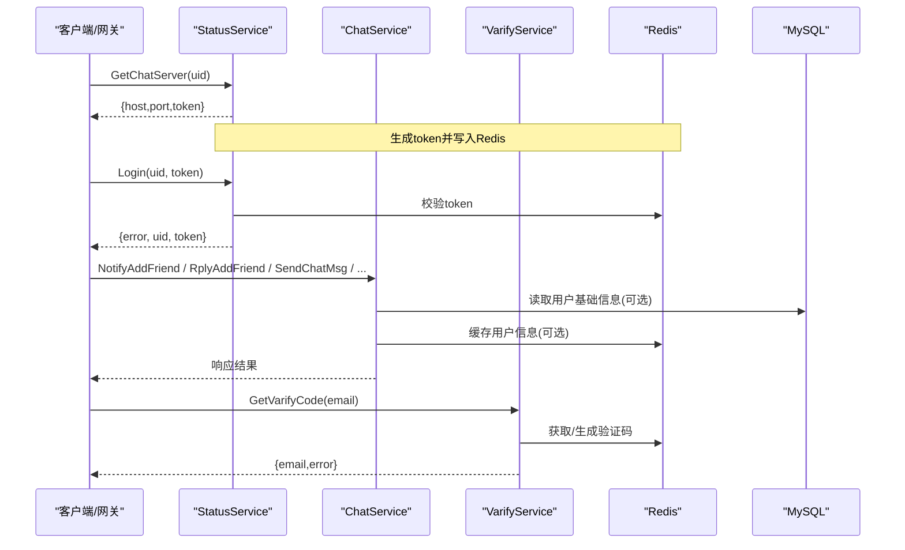
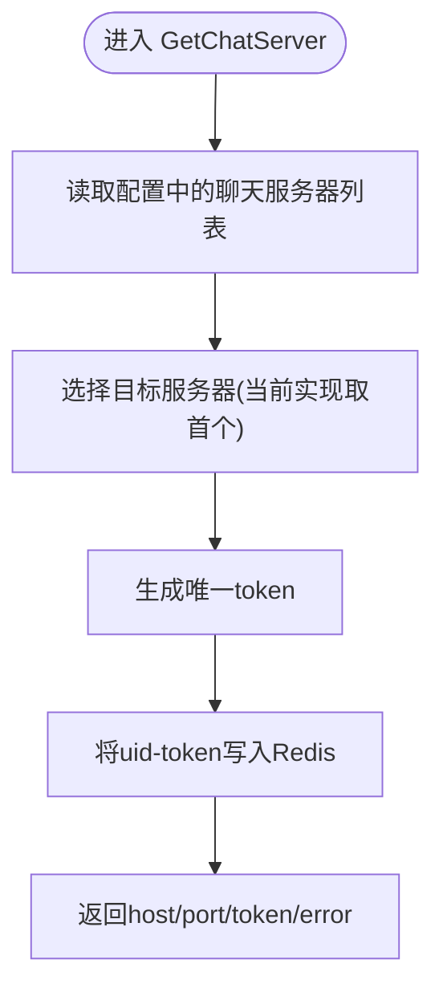
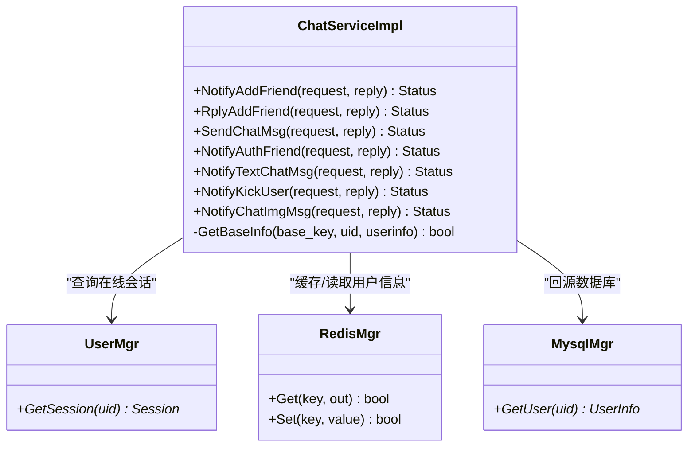
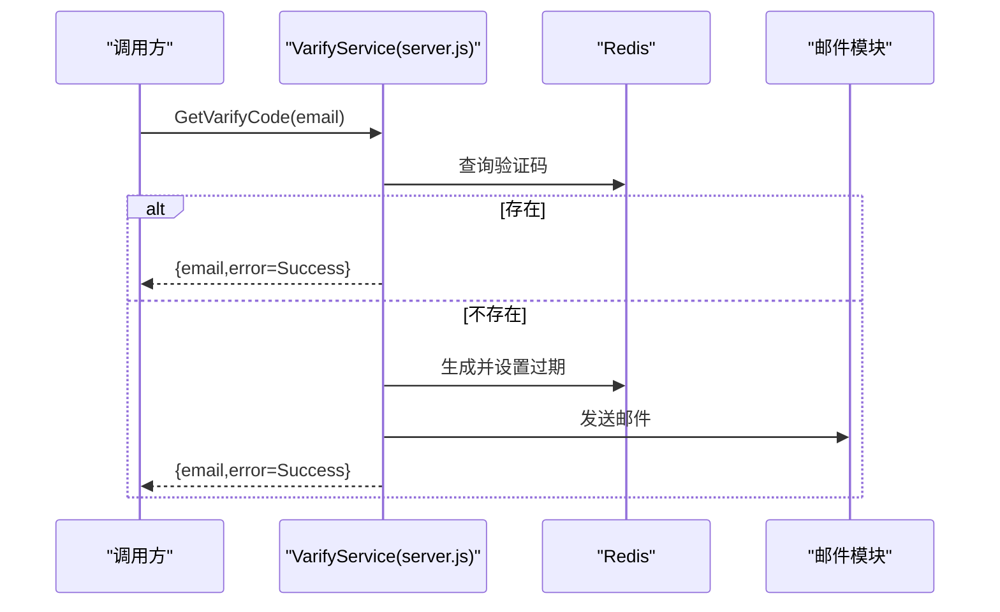
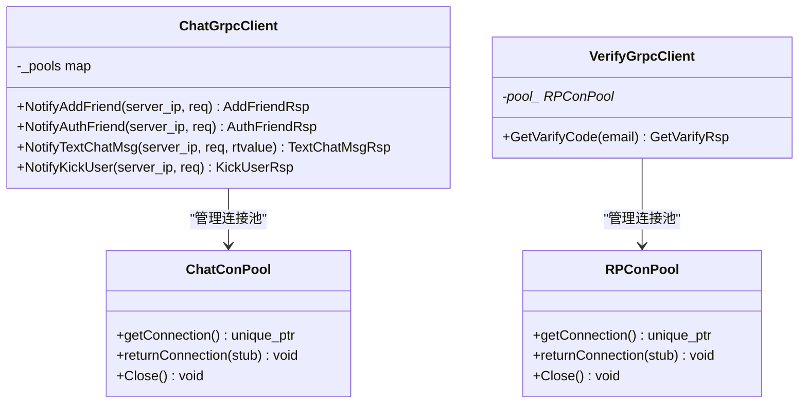
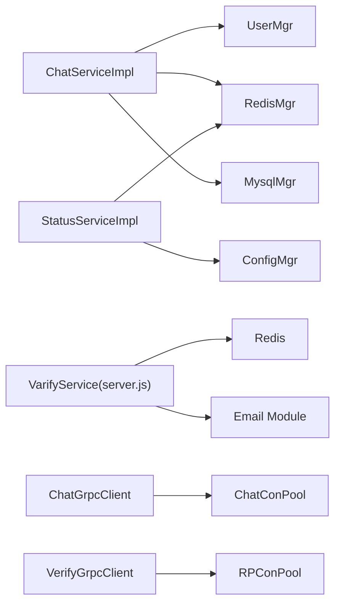

# gRPC服务接口

<cite>
**本文引用的文件**   
- [server/proto/chat/message.proto](file://server/proto/chat/message.proto)
- [server/proto/control/message.proto](file://server/proto/control/message.proto)
- [server/proto/resource/message.proto](file://server/proto/resource/message.proto)
- [server/VarifyServer/message.proto](file://server/VarifyServer/message.proto)
- [server/StatusServer/src/StatusServiceImpl.cpp](file://server/StatusServer/src/StatusServiceImpl.cpp)
- [server/StatusServer/include/StatusServiceImpl.h](file://server/StatusServer/include/StatusServiceImpl.h)
- [server/ChatServer/src/ChatServiceImpl.cpp](file://server/ChatServer/src/ChatServiceImpl.cpp)
- [server/ChatServer/include/ChatGrpcClient.h](file://server/ChatServer/include/ChatGrpcClient.h)
- [server/ChatServer/src/ChatGrpcClient.cpp](file://server/ChatServer/src/ChatGrpcClient.cpp)
- [server/GateServer/include/VerifyGrpcClient.h](file://server/GateServer/include/VerifyGrpcClient.h)
- [server/GateServer/src/VerifyGrpcClient.cpp](file://server/GateServer/src/VerifyGrpcClient.cpp)
- [server/VarifyServer/server.js](file://server/VarifyServer/server.js)
- [README.md](file://README.md)
</cite>

## 目录
1. [简介](#简介)
2. [项目结构](#项目结构)
3. [核心组件](#核心组件)
4. [架构总览](#架构总览)
5. [详细组件分析](#详细组件分析)
6. [依赖分析](#依赖分析)
7. [性能考虑](#性能考虑)
8. [故障排查指南](#故障排查指南)
9. [结论](#结论)
10. [附录](#附录)

## 简介
本文件为LLFCChat项目的gRPC服务接口文档，覆盖以下要点：
- Protobuf消息定义与字段说明（数据类型、必填约束）
- 服务方法签名与语义（StatusService、ChatService、VarifyService）
- 请求响应流程（参数校验、错误处理、超时控制）
- 多语言客户端调用示例（构造请求、处理响应、异常处理）
- gRPC连接管理、负载均衡、熔断降级等高级特性

## 项目结构
本项目采用多服务拆分架构，通过gRPC进行跨进程通信。Proto定义位于server/proto下，按业务域划分为chat、control、resource三个包；各服务实现分别位于对应子目录中。

图表来源
- [server/proto/chat/message.proto:1-167](file://server/proto/chat/message.proto#L1-L167)
- [server/proto/control/message.proto:1-143](file://server/proto/control/message.proto#L1-L143)
- [server/proto/resource/message.proto:1-169](file://server/proto/resource/message.proto#L1-L169)
- [server/VarifyServer/message.proto:1-44](file://server/VarifyServer/message.proto#L1-L44)
- [server/StatusServer/src/StatusServiceImpl.cpp:1-125](file://server/StatusServer/src/StatusServiceImpl.cpp#L1-L125)
- [server/ChatServer/src/ChatServiceImpl.cpp:1-242](file://server/ChatServer/src/ChatServiceImpl.cpp#L1-L242)
- [server/VarifyServer/server.js:1-76](file://server/VarifyServer/server.js#L1-L76)
- [server/ChatServer/include/ChatGrpcClient.h:1-120](file://server/ChatServer/include/ChatGrpcClient.h#L1-L120)
- [server/ChatServer/src/ChatGrpcClient.cpp:1-205](file://server/ChatServer/src/ChatGrpcClient.cpp#L1-L205)
- [server/GateServer/include/VerifyGrpcClient.h:1-113](file://server/GateServer/include/VerifyGrpcClient.h#L1-L113)
- [server/GateServer/src/VerifyGrpcClient.cpp:1-9](file://server/GateServer/src/VerifyGrpcClient.cpp#L1-L9)

章节来源
- [README.md:1-112](file://README.md#L1-L112)

## 核心组件
- StatusService：负责获取聊天服务器地址与登录校验，返回token并写入Redis用于后续鉴权。
- ChatService：提供好友申请、回复、文本聊天、踢人、图片通知等能力，内部通过UserMgr查找在线会话并推送消息。
- VarifyService：验证码服务，基于Redis生成或复用验证码并通过邮件发送。

章节来源
- [server/proto/chat/message.proto:1-167](file://server/proto/chat/message.proto#L1-L167)
- [server/StatusServer/src/StatusServiceImpl.cpp:1-125](file://server/StatusServer/src/StatusServiceImpl.cpp#L1-L125)
- [server/ChatServer/src/ChatServiceImpl.cpp:1-242](file://server/ChatServer/src/ChatServiceImpl.cpp#L1-L242)
- [server/VarifyServer/server.js:1-76](file://server/VarifyServer/server.js#L1-L76)

## 架构总览
下图展示了从客户端到各服务的典型调用路径，包括状态服务、聊天服务和验证码服务之间的协作关系。

图表来源
- [server/proto/chat/message.proto:1-167](file://server/proto/chat/message.proto#L1-L167)
- [server/StatusServer/src/StatusServiceImpl.cpp:1-125](file://server/StatusServer/src/StatusServiceImpl.cpp#L1-L125)
- [server/ChatServer/src/ChatServiceImpl.cpp:1-242](file://server/ChatServer/src/ChatServiceImpl.cpp#L1-L242)
- [server/VarifyServer/server.js:1-76](file://server/VarifyServer/server.js#L1-L76)

## 详细组件分析

### Protobuf消息与服务定义
- 包与命名空间：所有proto使用package message，统一了跨服务消息类型。
- 服务与方法：
  - StatusService：GetChatServer、Login
  - ChatService：NotifyAddFriend、RplyAddFriend、SendChatMsg、NotifyAuthFriend、NotifyTextChatMsg、NotifyKickUser、NotifyChatImgMsg
  - VarifyService：GetVarifyCode
- 字段约束：
  - proto3默认无“必填”概念，但业务层对关键字段有隐式要求（如uid、email、fromuid/touid等）。
  - error字段为int32，表示业务错误码；成功时通常设为Success。
  - 列表字段使用repeated，如textmsgs。

章节来源
- [server/proto/chat/message.proto:1-167](file://server/proto/chat/message.proto#L1-L167)
- [server/proto/control/message.proto:1-143](file://server/proto/control/message.proto#L1-L143)
- [server/proto/resource/message.proto:1-169](file://server/proto/resource/message.proto#L1-L169)
- [server/VarifyServer/message.proto:1-44](file://server/VarifyServer/message.proto#L1-L44)

### StatusService（状态服务）
- GetChatServer
  - 输入：uid
  - 输出：host、port、token、error
  - 行为：选择聊天服务器实例，生成唯一token并写入Redis，供后续Login校验。
- Login
  - 输入：uid、token
  - 输出：error、uid、token
  - 行为：根据uid在Redis中校验token是否匹配且未失效，失败返回相应错误码。

图表来源
- [server/StatusServer/src/StatusServiceImpl.cpp:17-27](file://server/StatusServer/src/StatusServiceImpl.cpp#L17-L27)
- [server/StatusServer/src/StatusServiceImpl.cpp:118-123](file://server/StatusServer/src/StatusServiceImpl.cpp#L118-L123)

章节来源
- [server/StatusServer/src/StatusServiceImpl.cpp:1-125](file://server/StatusServer/src/StatusServiceImpl.cpp#L1-L125)
- [server/StatusServer/include/StatusServiceImpl.h:1-52](file://server/StatusServer/include/StatusServiceImpl.h#L1-L52)

### ChatService（聊天服务）
- NotifyAddFriend：向目标用户推送好友申请通知（若在线），否则直接返回成功。
- RplyAddFriend：回复好友申请（服务端实现未展示具体逻辑，但消息结构已定义）。
- SendChatMsg：发送简单文本消息（结构包含fromuid、touid、message）。
- NotifyAuthFriend：认证好友并携带历史消息数据（含用户基础信息、时间戳等）。
- NotifyTextChatMsg：批量推送文本聊天消息（支持thread_id与多条消息）。
- NotifyKickUser：踢出指定用户（触发离线通知并清理会话）。
- NotifyChatImgMsg：通知接收方下载聊天图片资源（包含文件名、大小、thread_id等）。

图表来源
- [server/ChatServer/src/ChatServiceImpl.cpp:16-242](file://server/ChatServer/src/ChatServiceImpl.cpp#L16-L242)

章节来源
- [server/ChatServer/src/ChatServiceImpl.cpp:1-242](file://server/ChatServer/src/ChatServiceImpl.cpp#L1-L242)

### VarifyService（验证码服务）
- GetVarifyCode
  - 输入：email
  - 输出：email、error、code（由服务端决定返回策略）
  - 行为：优先从Redis获取已有验证码，不存在则生成短码并设置过期时间，随后发送邮件。

图表来源
- [server/VarifyServer/server.js:15-64](file://server/VarifyServer/server.js#L15-L64)

章节来源
- [server/VarifyServer/server.js:1-76](file://server/VarifyServer/server.js#L1-L76)

### 客户端封装与连接池
- ChatGrpcClient
  - 维护多个Peer服务器的连接池（ChatConPool），按名称索引。
  - 提供NotifyAddFriend、NotifyAuthFriend、NotifyTextChatMsg、NotifyKickUser等方法，统一处理上下文、状态码与错误码。
- VerifyGrpcClient
  - 维护VarifyService的连接池（RPConPool），封装GetVarifyCode调用，自动归还连接并处理RPC失败。

图表来源
- [server/ChatServer/include/ChatGrpcClient.h:38-116](file://server/ChatServer/include/ChatGrpcClient.h#L38-L116)
- [server/ChatServer/src/ChatGrpcClient.cpp:1-205](file://server/ChatServer/src/ChatGrpcClient.cpp#L1-L205)
- [server/GateServer/include/VerifyGrpcClient.h:18-110](file://server/GateServer/include/VerifyGrpcClient.h#L18-L110)
- [server/GateServer/src/VerifyGrpcClient.cpp:1-9](file://server/GateServer/src/VerifyGrpcClient.cpp#L1-L9)

章节来源
- [server/ChatServer/include/ChatGrpcClient.h:1-120](file://server/ChatServer/include/ChatGrpcClient.h#L1-L120)
- [server/ChatServer/src/ChatGrpcClient.cpp:1-205](file://server/ChatServer/src/ChatGrpcClient.cpp#L1-L205)
- [server/GateServer/include/VerifyGrpcClient.h:1-113](file://server/GateServer/include/VerifyGrpcClient.h#L1-L113)
- [server/GateServer/src/VerifyGrpcClient.cpp:1-9](file://server/GateServer/src/VerifyGrpcClient.cpp#L1-L9)

## 依赖分析
- 服务间依赖
  - ChatServiceImpl依赖UserMgr（在线会话）、RedisMgr（缓存）、MysqlMgr（用户基础信息）。
  - StatusServiceImpl依赖ConfigMgr（服务器列表）、RedisMgr（token存储）。
  - VarifyService依赖Redis与邮件模块。
- 客户端依赖
  - ChatGrpcClient与VerifyGrpcClient均依赖各自的连接池与配置管理器。

图表来源
- [server/ChatServer/src/ChatServiceImpl.cpp:142-187](file://server/ChatServer/src/ChatServiceImpl.cpp#L142-L187)
- [server/StatusServer/src/StatusServiceImpl.cpp:29-55](file://server/StatusServer/src/StatusServiceImpl.cpp#L29-L55)
- [server/VarifyServer/server.js:1-76](file://server/VarifyServer/server.js#L1-L76)
- [server/ChatServer/include/ChatGrpcClient.h:38-98](file://server/ChatServer/include/ChatGrpcClient.h#L38-L98)
- [server/GateServer/include/VerifyGrpcClient.h:18-78](file://server/GateServer/include/VerifyGrpcClient.h#L18-L78)

章节来源
- [server/ChatServer/src/ChatServiceImpl.cpp:1-242](file://server/ChatServer/src/ChatServiceImpl.cpp#L1-L242)
- [server/StatusServer/src/StatusServiceImpl.cpp:1-125](file://server/StatusServer/src/StatusServiceImpl.cpp#L1-L125)
- [server/VarifyServer/server.js:1-76](file://server/VarifyServer/server.js#L1-L76)
- [server/ChatServer/include/ChatGrpcClient.h:1-120](file://server/ChatServer/include/ChatGrpcClient.h#L1-L120)
- [server/GateServer/include/VerifyGrpcClient.h:1-113](file://server/GateServer/include/VerifyGrpcClient.h#L1-L113)

## 性能考虑
- 连接池
  - ChatConPool与RPConPool通过队列+条件变量实现线程安全的连接借用与归还，避免频繁创建销毁Channel。
- 缓存策略
  - ChatServiceImpl优先从Redis读取用户信息，未命中再回源MySQL并写回Redis，降低数据库压力。
- 并发模型
  - gRPC服务端默认多线程处理请求；客户端连接池可提升吞吐。
- 序列化开销
  - ChatServiceImpl在部分场景中将Protobuf转换为JSON进行内部推送，需注意额外序列化成本。

[本节为通用指导，不直接分析具体文件]

## 故障排查指南
- RPC失败
  - 客户端侧检查Status.ok()与错误码；VerifyGrpcClient在失败时设置ErrorCodes::RPCFailed。
- 登录失败
  - StatusServiceImpl的Login会校验Redis中的token，失败返回UidInvalid或TokenInvalid。
- 验证码问题
  - VarifyService在Redis操作失败或邮件发送异常时返回特定错误码，需检查Redis与邮件配置。
- 会话缺失
  - ChatServiceImpl在目标用户不在线时直接返回成功，不会阻塞；如需强一致，应在上层重试或异步补偿。

章节来源
- [server/ChatServer/src/ChatGrpcClient.cpp:54-57](file://server/ChatServer/src/ChatGrpcClient.cpp#L54-L57)
- [server/GateServer/include/VerifyGrpcClient.h:95-103](file://server/GateServer/include/VerifyGrpcClient.h#L95-L103)
- [server/StatusServer/src/StatusServiceImpl.cpp:94-116](file://server/StatusServer/src/StatusServiceImpl.cpp#L94-L116)
- [server/VarifyServer/server.js:56-62](file://server/VarifyServer/server.js#L56-L62)

## 结论
LLFCChat的gRPC接口以清晰的职责划分与统一的Protobuf定义支撑了状态服务、聊天服务与验证码服务的高效协作。通过连接池、缓存与合理的错误码体系，系统在可用性、可扩展性与性能方面具备良好基础。建议在后续迭代中补充更完善的超时控制、重试与熔断机制，以提升鲁棒性。

[本节为总结性内容，不直接分析具体文件]

## 附录

### 各语言客户端调用示例（步骤指引）
- C++（基于grpcpp）
  - 生成stub后，构造请求对象并设置必要字段（如uid、email、fromuid/touid等）。
  - 使用ClientContext设置超时（例如set_deadline）。
  - 调用服务方法并检查Status.ok()与响应体error字段。
  - 参考ChatGrpcClient与VerifyGrpcClient的实现模式。
- Node.js（基于@grpc/grpc-js）
  - 加载proto生成的模块，创建客户端实例。
  - 构造请求对象并调用服务方法，处理回调或Promise中的错误。
  - 参考VarifyServer/server.js中的GetVarifyCode实现。
- Java/Go/Python等
  - 使用各自语言的gRPC代码生成工具生成客户端。
  - 遵循相同的数据结构与错误码约定，确保字段完整性与类型正确。

[本节为通用指导，不直接分析具体文件]

### 错误码与字段说明摘要
- error：int32，业务错误码；Success表示成功，其他值表示不同错误。
- uid/email/fromuid/touid：关键标识字段，必须填写。
- textmsgs：repeated TextChatData，用于批量消息传输。
- thread_id：会话/线程标识，用于消息分组。
- host/port/token：状态服务返回的连接与会话令牌。

章节来源
- [server/proto/chat/message.proto:1-167](file://server/proto/chat/message.proto#L1-L167)
- [server/proto/control/message.proto:1-143](file://server/proto/control/message.proto#L1-L143)
- [server/proto/resource/message.proto:1-169](file://server/proto/resource/message.proto#L1-L169)
- [server/VarifyServer/message.proto:1-44](file://server/VarifyServer/message.proto#L1-L44)