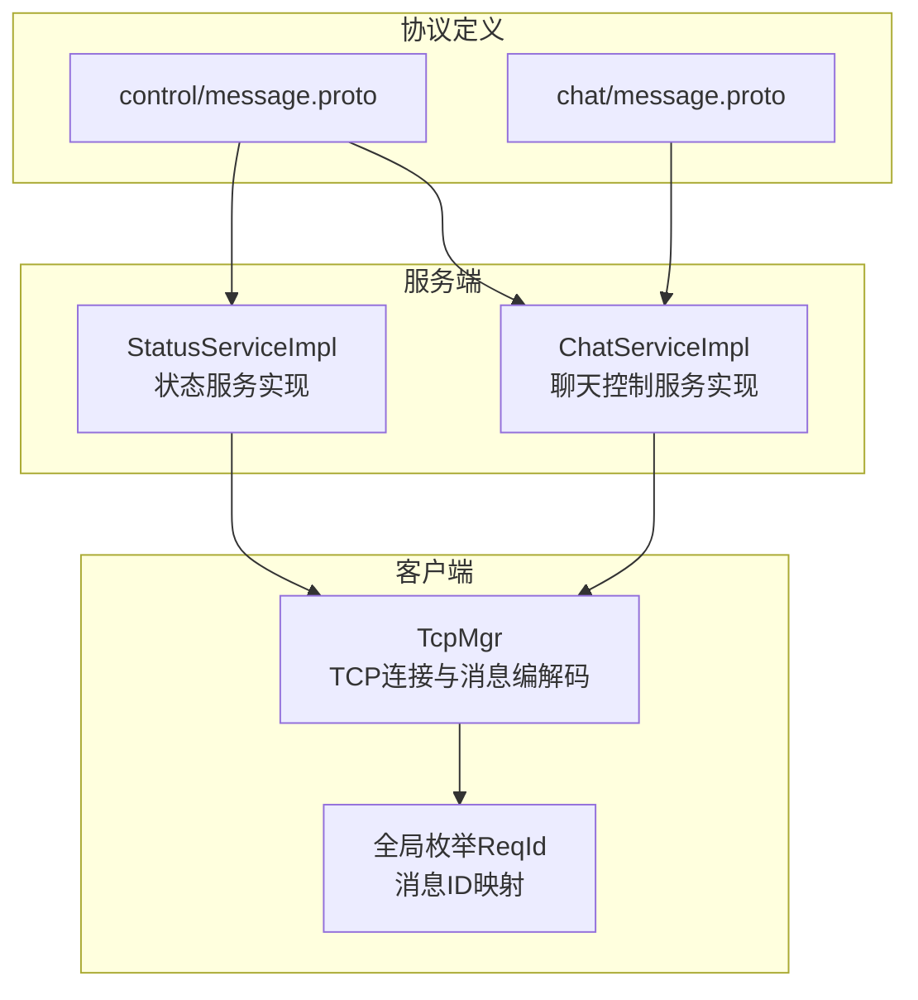
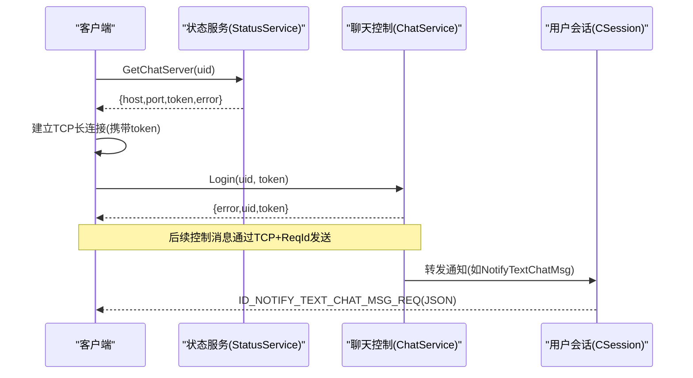
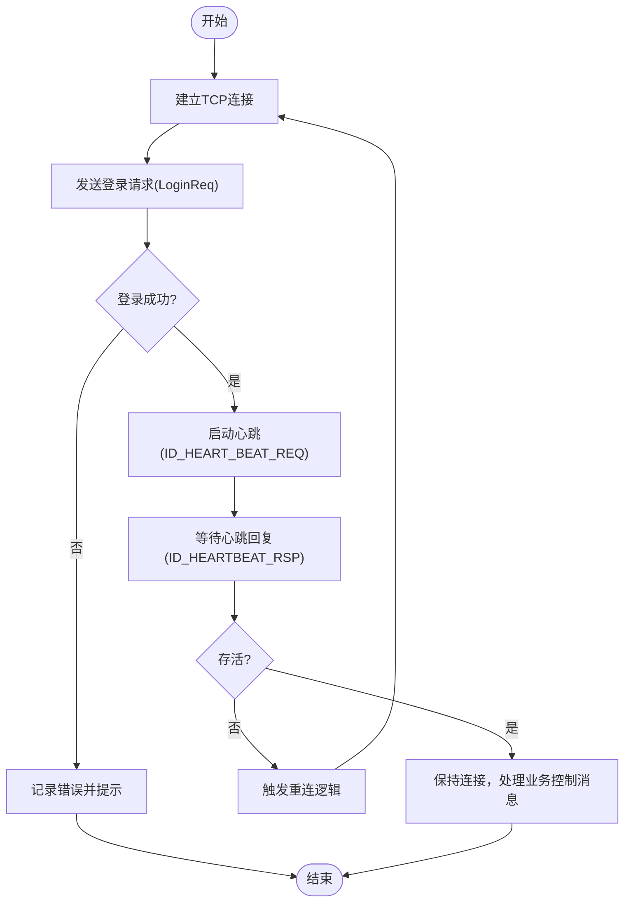
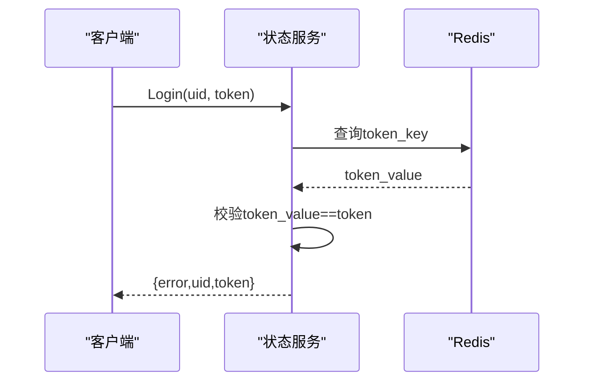
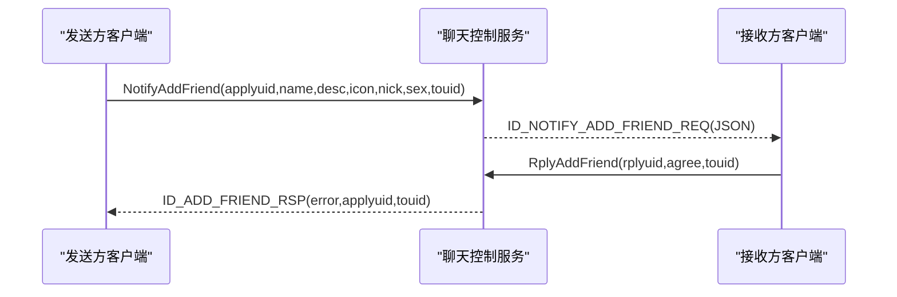
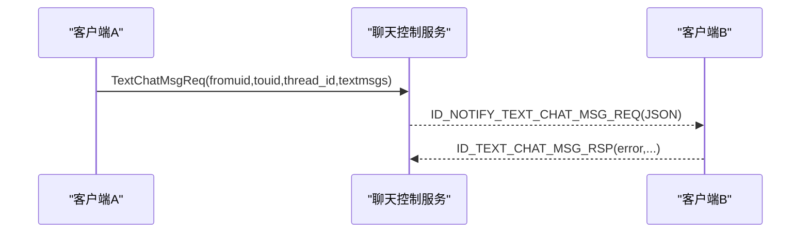
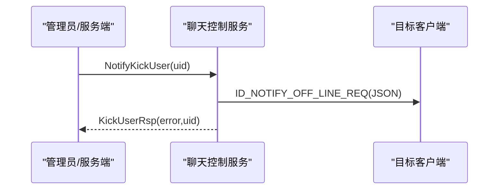
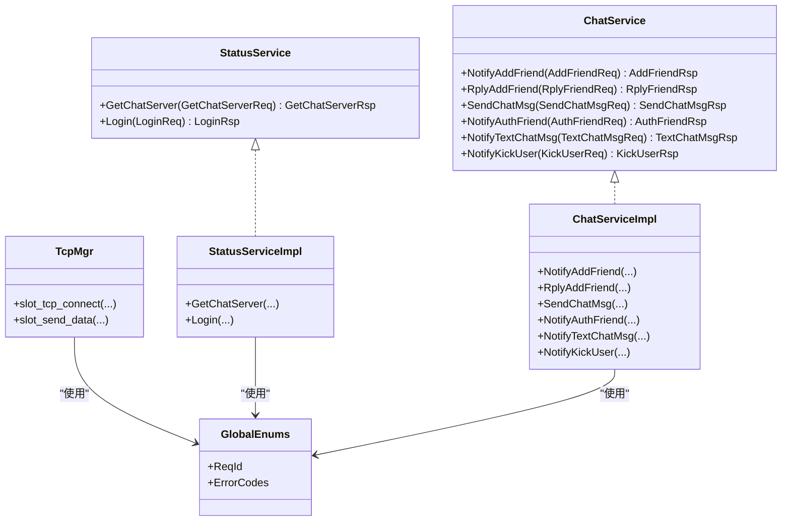

# 控制消息协议定义

<cite>
**本文引用的文件**   
- [server/proto/control/message.proto](file://server/proto/control/message.proto)
- [server/proto/chat/message.proto](file://server/proto/chat/message.proto)
- [server/StatusServer/src/StatusServiceImpl.cpp](file://server/StatusServer/src/StatusServiceImpl.cpp)
- [server/ChatServer/src/ChatServiceImpl.cpp](file://server/ChatServer/src/ChatServiceImpl.cpp)
- [client/llfcchat/include/global.h](file://client/llfcchat/include/global.h)
- [开发文档/day15-客户端Tcp管理类设计.md](file://开发文档/day15-客户端Tcp管理类设计.md)
- [开发文档/day29-好友认证和聊天通信.md](file://开发文档/day29-好友认证和聊天通信.md)
- [开发文档/day38-断点续传.md](file://开发文档/day38-断点续传.md)
</cite>

## 目录
1. [简介](#简介)
2. [项目结构](#项目结构)
3. [核心组件](#核心组件)
4. [架构总览](#架构总览)
5. [详细组件分析](#详细组件分析)
6. [依赖关系分析](#依赖关系分析)
7. [性能考虑](#性能考虑)
8. [故障排查指南](#故障排查指南)
9. [结论](#结论)
10. [附录](#附录)

## 简介
本文件为 LLFCChat 项目的“控制消息协议”提供全面文档，聚焦于 control/message.proto 中定义的控制类消息结构与通信协议。控制消息用于连接管理、会话控制、权限验证与系统级通知等，与业务消息（聊天内容、图片/文件传输等）在职责上分离：控制消息负责“通道与状态”，业务消息负责“数据与内容”。

## 项目结构
- 控制协议定义位于 server/proto/control/message.proto，包含验证码服务、状态服务与聊天控制服务的 RPC 接口及消息体。
- 业务协议定义位于 server/proto/chat/message.proto，包含聊天消息、好友申请、文本/图片消息等。
- 服务端实现：
  - StatusServiceImpl 实现状态服务（获取聊天服务器、登录校验）。
  - ChatServiceImpl 实现聊天控制服务（好友申请通知、文本聊天通知、踢人通知等）。
- 客户端侧通过 TCP 长连接进行控制消息收发，使用 ReqId 标识消息类型，并通过 JSON 作为应用层载荷。

图表来源 
- [server/proto/control/message.proto](file://server/proto/control/message.proto)
- [server/proto/chat/message.proto](file://server/proto/chat/message.proto)
- [server/StatusServer/src/StatusServiceImpl.cpp](file://server/StatusServer/src/StatusServiceImpl.cpp)
- [server/ChatServer/src/ChatServiceImpl.cpp](file://server/ChatServer/src/ChatServiceImpl.cpp)
- [client/llfcchat/include/global.h](file://client/llfcchat/include/global.h)
- [开发文档/day15-客户端Tcp管理类设计.md](file://开发文档/day15-客户端Tcp管理类设计.md)

章节来源
- [server/proto/control/message.proto](file://server/proto/control/message.proto)
- [server/proto/chat/message.proto](file://server/proto/chat/message.proto)
- [client/llfcchat/include/global.h](file://client/llfcchat/include/global.h)

## 核心组件
- 验证码服务 VarifyService
  - GetVarifyCode：根据邮箱发送验证码。
  - 请求/响应字段：email、error、code。
- 状态服务 StatusService
  - GetChatServer：根据 uid 返回可用的聊天服务器 host/port 以及 token。
  - Login：校验 uid/token 有效性，返回 error、uid、token。
- 聊天控制服务 ChatService
  - NotifyAddFriend：向目标用户推送好友申请通知。
  - RplyAddFriend：回复好友申请同意/拒绝。
  - SendChatMsg：发送聊天消息（控制面确认）。
  - NotifyAuthFriend：通知对方好友认证信息（含历史消息片段）。
  - NotifyTextChatMsg：推送文本聊天消息。
  - NotifyKickUser：强制下线通知。

章节来源
- [server/proto/control/message.proto](file://server/proto/control/message.proto)
- [server/proto/chat/message.proto](file://server/proto/chat/message.proto)

## 架构总览
控制消息的端到端流程如下：
- 客户端先通过 HTTP 或 gRPC 获取验证码、注册、登录等；随后通过状态服务获取聊天服务器地址与 token。
- 客户端建立到聊天服务器的 TCP 长连接，使用 ReqId 标识消息类型，并以 JSON 作为应用层载荷。
- 服务端根据消息类型路由至相应处理逻辑，必要时转发给在线用户会话。

图表来源 
- [server/proto/control/message.proto](file://server/proto/control/message.proto)
- [server/StatusServer/src/StatusServiceImpl.cpp](file://server/StatusServer/src/StatusServiceImpl.cpp)
- [server/ChatServer/src/ChatServiceImpl.cpp](file://server/ChatServer/src/ChatServiceImpl.cpp)
- [client/llfcchat/include/global.h](file://client/llfcchat/include/global.h)
- [开发文档/day15-客户端Tcp管理类设计.md](file://开发文档/day15-客户端Tcp管理类设计.md)

## 详细组件分析

### 控制消息格式与字段规范
- 传输层
  - 基于 TCP 长连接，采用“头部 + 负载”的粘包处理：
    - 头部：消息ID（ReqId，2字节）、长度（uint16，2字节），大端序。
    - 负载：JSON 字符串。
- 应用层
  - 所有控制消息以 ReqId 区分类型，负载为 JSON，统一包含 error 字段表示结果码。
  - 错误码定义见 global.h 中的 ErrorCodes，常见包括 SUCCESS=0、ERR_JSON=1、ERR_NETWORK=2 等。

章节来源
- [client/llfcchat/include/global.h](file://client/llfcchat/include/global.h)
- [开发文档/day15-客户端Tcp管理类设计.md](file://开发文档/day15-客户端Tcp管理类设计.md)
- [开发文档/day38-断点续传.md](file://开发文档/day38-断点续传.md)

### 连接管理与心跳
- 连接建立
  - 客户端调用状态服务获取聊天服务器地址与 token，随后建立 TCP 连接并发送登录请求。
- 心跳检测
  - 使用 ID_HEART_BEAT_REQ / ID_HEARTBEAT_RSP 维持连接活性，防止空闲断开。
- 断开处理
  - 客户端监听 socket 错误与断开信号，进行重连与状态清理。

图表来源 
- [client/llfcchat/include/global.h](file://client/llfcchat/include/global.h)
- [开发文档/day15-客户端Tcp管理类设计.md](file://开发文档/day15-客户端Tcp管理类设计.md)
- [server/StatusServer/src/StatusServiceImpl.cpp](file://server/StatusServer/src/StatusServiceImpl.cpp)

章节来源
- [client/llfcchat/include/global.h](file://client/llfcchat/include/global.h)
- [开发文档/day15-客户端Tcp管理类设计.md](file://开发文档/day15-客户端Tcp管理类设计.md)
- [server/StatusServer/src/StatusServiceImpl.cpp](file://server/StatusServer/src/StatusServiceImpl.cpp)

### 权限验证与登录
- 状态服务 Login
  - 校验 Redis 中存储的 token 与请求是否一致，返回 error、uid、token。
  - 若 token 无效或重复登录，返回对应错误码。
- 客户端侧
  - 收到成功后保存 token，并在后续控制消息中携带（如需）。

图表来源 
- [server/StatusServer/src/StatusServiceImpl.cpp](file://server/StatusServer/src/StatusServiceImpl.cpp)
- [server/proto/control/message.proto](file://server/proto/control/message.proto)

章节来源
- [server/StatusServer/src/StatusServiceImpl.cpp](file://server/StatusServer/src/StatusServiceImpl.cpp)
- [server/proto/control/message.proto](file://server/proto/control/message.proto)

### 好友申请与认证
- 发起申请
  - 客户端发送 AddFriendReq，服务端通过 ChatService.NotifyAddFriend 推送给目标用户。
- 认证过程
  - 服务端将发件人基础信息与部分历史消息片段封装为 AuthFriendReq，通知收件人。
- 回复
  - 客户端可回复 RplyFriendReq（同意/拒绝），服务端更新状态并回包。

图表来源 
- [server/proto/control/message.proto](file://server/proto/control/message.proto)
- [server/ChatServer/src/ChatServiceImpl.cpp](file://server/ChatServer/src/ChatServiceImpl.cpp)
- [client/llfcchat/include/global.h](file://client/llfcchat/include/global.h)

章节来源
- [server/proto/control/message.proto](file://server/proto/control/message.proto)
- [server/ChatServer/src/ChatServiceImpl.cpp](file://server/ChatServer/src/ChatServiceImpl.cpp)
- [client/llfcchat/include/global.h](file://client/llfcchat/include/global.h)

### 文本聊天控制消息
- 发送与通知
  - 客户端发送 TextChatMsgReq，服务端查找目标会话并推送 ID_NOTIFY_TEXT_CHAT_MSG_REQ。
- 客户端处理
  - 解析 JSON，校验 error，提取 fromuid/touid 与 text_array，更新 UI。

图表来源 
- [server/proto/control/message.proto](file://server/proto/control/message.proto)
- [server/ChatServer/src/ChatServiceImpl.cpp](file://server/ChatServer/src/ChatServiceImpl.cpp)
- [client/llfcchat/include/global.h](file://client/llfcchat/include/global.h)
- [开发文档/day29-好友认证和聊天通信.md](file://开发文档/day29-好友认证和聊天通信.md)

章节来源
- [server/proto/control/message.proto](file://server/proto/control/message.proto)
- [server/ChatServer/src/ChatServiceImpl.cpp](file://server/ChatServer/src/ChatServiceImpl.cpp)
- [client/llfcchat/include/global.h](file://client/llfcchat/include/global.h)
- [开发文档/day29-好友认证和聊天通信.md](file://开发文档/day29-好友认证和聊天通信.md)

### 踢人与离线通知
- 踢人
  - 服务端调用 NotifyKickUser，定位目标会话并下发离线通知，同时清理旧连接。
- 客户端处理
  - 收到离线通知后清理会话状态，提示用户重新登录。

图表来源 
- [server/proto/control/message.proto](file://server/proto/control/message.proto)
- [server/ChatServer/src/ChatServiceImpl.cpp](file://server/ChatServer/src/ChatServiceImpl.cpp)
- [client/llfcchat/include/global.h](file://client/llfcchat/include/global.h)

章节来源
- [server/proto/control/message.proto](file://server/proto/control/message.proto)
- [server/ChatServer/src/ChatServiceImpl.cpp](file://server/ChatServer/src/ChatServiceImpl.cpp)
- [client/llfcchat/include/global.h](file://client/llfcchat/include/global.h)

### 控制消息与业务消息的区别与联系
- 区别
  - 控制消息：负责连接、认证、会话、通知等系统级控制，使用 ReqId + JSON。
  - 业务消息：承载聊天内容（文本、图片、文件等），定义在 chat/message.proto，通常由控制消息驱动。
- 联系
  - 控制消息决定何时、如何传递业务消息；例如 NotifyTextChatMsg 触发客户端展示文本聊天内容。

章节来源
- [server/proto/control/message.proto](file://server/proto/control/message.proto)
- [server/proto/chat/message.proto](file://server/proto/chat/message.proto)

## 依赖关系分析
- 协议与服务实现
  - control/message.proto 定义了 VarifyService、StatusService、ChatService 的 RPC 接口。
  - StatusServiceImpl 实现状态服务，依赖配置与 Redis。
  - ChatServiceImpl 实现聊天控制服务，依赖 UserMgr、CSession、Redis/Mysql。
- 客户端依赖
  - TcpMgr 负责 TCP 连接、粘包处理与消息分发。
  - global.h 定义 ReqId、ErrorCodes 等关键枚举。

图表来源 
- [server/proto/control/message.proto](file://server/proto/control/message.proto)
- [server/StatusServer/src/StatusServiceImpl.cpp](file://server/StatusServer/src/StatusServiceImpl.cpp)
- [server/ChatServer/src/ChatServiceImpl.cpp](file://server/ChatServer/src/ChatServiceImpl.cpp)
- [client/llfcchat/include/global.h](file://client/llfcchat/include/global.h)

章节来源
- [server/proto/control/message.proto](file://server/proto/control/message.proto)
- [server/StatusServer/src/StatusServiceImpl.cpp](file://server/StatusServer/src/StatusServiceImpl.cpp)
- [server/ChatServer/src/ChatServiceImpl.cpp](file://server/ChatServer/src/ChatServiceImpl.cpp)
- [client/llfcchat/include/global.h](file://client/llfcchat/include/global.h)

## 性能考虑
- 粘包与分片
  - 使用固定头部（ID+Length）避免粘包问题，提高解析效率。
- 心跳机制
  - 定期发送心跳，降低空闲连接被中间设备断开的概率。
- 异步处理
  - 服务端使用 gRPC 异步回调，减少阻塞；客户端使用 Qt 信号槽与队列，提升吞吐。
- 缓存与数据库
  - 用户信息优先从 Redis 读取，未命中再查 MySQL，降低延迟。

[本节为通用指导，不直接分析具体文件]

## 故障排查指南
- JSON 解析失败
  - 检查负载是否为合法 JSON，确保 error 字段存在且值正确。
- 网络错误
  - 检查网络连接、防火墙、端口可达性；客户端应捕获 socket 错误并重连。
- 登录失败
  - 核对 uid/token 是否与 Redis 一致；注意重复登录限制。
- 消息未送达
  - 检查目标用户是否在线（UserMgr 会话是否存在）；确认 ReqId 与处理器映射是否正确。

章节来源
- [client/llfcchat/include/global.h](file://client/llfcchat/include/global.h)
- [开发文档/day29-好友认证和聊天通信.md](file://开发文档/day29-好友认证和聊天通信.md)
- [server/StatusServer/src/StatusServiceImpl.cpp](file://server/StatusServer/src/StatusServiceImpl.cpp)

## 结论
控制消息协议在 LLFCChat 中承担连接、认证、会话与系统通知的核心职责，与业务消息形成清晰分层。通过统一的 ReqId + JSON 格式，结合 TCP 长连接与 gRPC 服务，实现了高内聚、低耦合的通信体系。遵循本文档的规范可实现稳定可靠的控制面交互。

[本节为总结，不直接分析具体文件]

## 附录
- 关键流程示例路径（不包含代码内容）
  - 连接建立与登录：参考 [server/StatusServer/src/StatusServiceImpl.cpp](file://server/StatusServer/src/StatusServiceImpl.cpp)、[client/llfcchat/include/global.h](file://client/llfcchat/include/global.h)。
  - 心跳检测与断开处理：参考 [开发文档/day15-客户端Tcp管理类设计.md](file://开发文档/day15-客户端Tcp管理类设计.md)、[client/llfcchat/include/global.h](file://client/llfcchat/include/global.h)。
  - 文本聊天通知与处理：参考 [server/ChatServer/src/ChatServiceImpl.cpp](file://server/ChatServer/src/ChatServiceImpl.cpp)、[开发文档/day29-好友认证和聊天通信.md](file://开发文档/day29-好友认证和聊天通信.md)。
  - 好友申请与认证：参考 [server/proto/control/message.proto](file://server/proto/control/message.proto)、[server/ChatServer/src/ChatServiceImpl.cpp](file://server/ChatServer/src/ChatServiceImpl.cpp)。
  - 踢人与离线通知：参考 [server/proto/control/message.proto](file://server/proto/control/message.proto)、[server/ChatServer/src/ChatServiceImpl.cpp](file://server/ChatServer/src/ChatServiceImpl.cpp)。

[本节为附录，不直接分析具体文件]