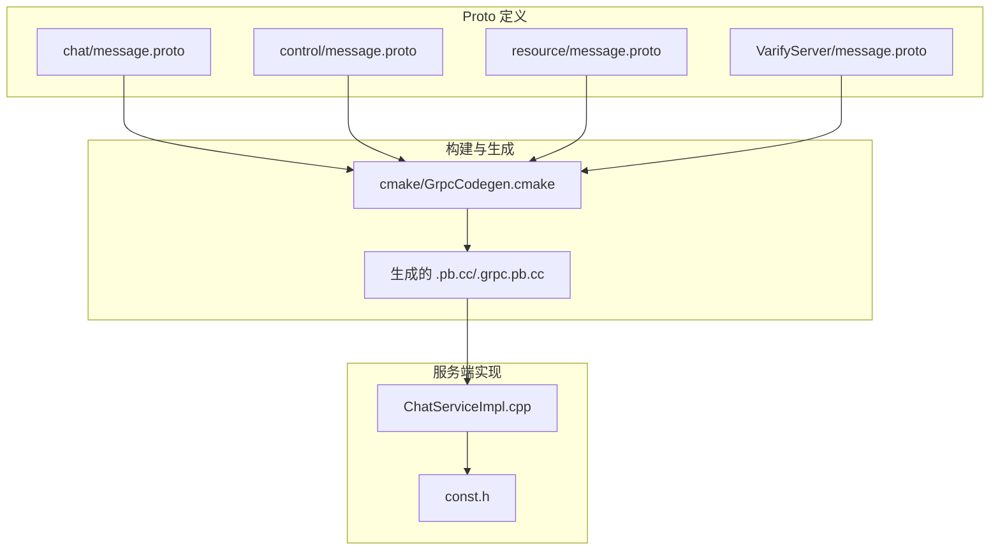
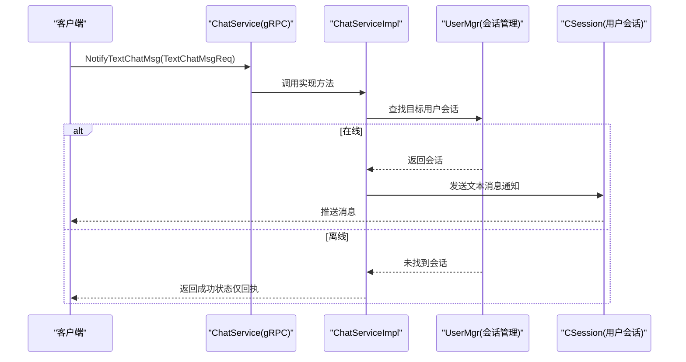
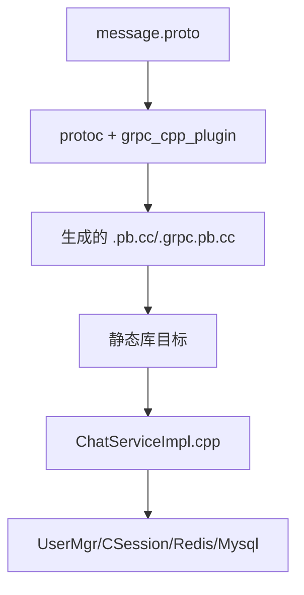

# 消息类型定义

<cite>
**本文引用的文件**   
- [server/proto/chat/message.proto](file://server/proto/chat/message.proto)
- [server/proto/control/message.proto](file://server/proto/control/message.proto)
- [server/proto/resource/message.proto](file://server/proto/resource/message.proto)
- [server/VarifyServer/message.proto](file://server/VarifyServer/message.proto)
- [cmake/GrpcCodegen.cmake](file://cmake/GrpcCodegen.cmake)
- [server/ChatServer/src/ChatServiceImpl.cpp](file://server/ChatServer/src/ChatServiceImpl.cpp)
- [server/ChatServer/include/const.h](file://server/ChatServer/include/const.h)
</cite>

## 目录
1. [简介](#简介)
2. [项目结构](#项目结构)
3. [核心组件](#核心组件)
4. [架构总览](#架构总览)
5. [详细组件分析](#详细组件分析)
6. [依赖关系分析](#依赖关系分析)
7. [性能考虑](#性能考虑)
8. [故障排查指南](#故障排查指南)
9. [结论](#结论)
10. [附录](#附录)

## 简介
本文件为 LLFCChat 项目的 gRPC 消息类型参考文档，覆盖所有 Protobuf 消息定义、字段说明、版本兼容策略、序列化与反序列化最佳实践、校验与错误处理机制，以及在不同编程语言（C++、JavaScript、Python）中的使用要点。文档以仓库中实际 proto 定义为依据，并结合服务端实现与构建脚本进行说明，帮助开发者快速理解并正确使用这些消息类型。

## 项目结构
LLFCChat 的 gRPC 协议定义集中在 server/proto 目录下，按业务域划分为 chat、control、resource 三个子包；同时 VarifyServer 中也包含一份用于验证码服务的 proto 定义。构建阶段通过 CMake 脚本调用 protoc 生成各语言的代码（当前主要关注 C++）。

图表来源
- [server/proto/chat/message.proto:1-167](file://server/proto/chat/message.proto#L1-L167)
- [server/proto/control/message.proto:1-143](file://server/proto/control/message.proto#L1-L143)
- [server/proto/resource/message.proto:1-169](file://server/proto/resource/message.proto#L1-L169)
- [server/VarifyServer/message.proto:1-44](file://server/VarifyServer/message.proto#L1-L44)
- [cmake/GrpcCodegen.cmake:1-72](file://cmake/GrpcCodegen.cmake#L1-L72)
- [server/ChatServer/src/ChatServiceImpl.cpp:1-242](file://server/ChatServer/src/ChatServiceImpl.cpp#L1-L242)
- [server/ChatServer/include/const.h:1-104](file://server/ChatServer/include/const.h#L1-L104)

章节来源
- [server/proto/chat/message.proto:1-167](file://server/proto/chat/message.proto#L1-L167)
- [server/proto/control/message.proto:1-143](file://server/proto/control/message.proto#L1-L143)
- [server/proto/resource/message.proto:1-169](file://server/proto/resource/message.proto#L1-L169)
- [server/VarifyServer/message.proto:1-44](file://server/VarifyServer/message.proto#L1-L44)
- [cmake/GrpcCodegen.cmake:1-72](file://cmake/GrpcCodegen.cmake#L1-L72)

## 核心组件
- 服务接口
  - StatusService：提供获取聊天服务器信息与登录能力。
  - ChatService：提供好友申请、认证、文本聊天、踢人、图片通知等聊天相关能力。
  - VarifyService：提供验证码获取能力。
- 消息分类
  - 认证与会话：GetVarifyReq/Rsp、GetChatServerReq/Rsp、LoginReq/Rsp。
  - 好友关系：AddFriendReq/Rsp、RplyFriendReq/Rsp、AuthFriendReq/Rsp、AddFriendMsg。
  - 聊天通信：SendChatMsgReq/Rsp、TextChatMsgReq/Rsp、TextChatData、NotifyChatImgReq/Rsp。
  - 控制命令：KickUserReq/Rsp。

章节来源
- [server/proto/chat/message.proto:1-167](file://server/proto/chat/message.proto#L1-L167)
- [server/proto/control/message.proto:1-143](file://server/proto/control/message.proto#L1-L143)
- [server/proto/resource/message.proto:1-169](file://server/proto/resource/message.proto#L1-L169)
- [server/VarifyServer/message.proto:1-44](file://server/VarifyServer/message.proto#L1-L44)

## 架构总览
gRPC 服务在多个子模块中暴露相同或相近的接口，客户端通过 gRPC 调用服务端方法，服务端根据请求路由到具体逻辑，并通过内部会话管理向目标用户推送消息。

图表来源
- [server/proto/chat/message.proto:107-127](file://server/proto/chat/message.proto#L107-L127)
- [server/ChatServer/src/ChatServiceImpl.cpp:105-139](file://server/ChatServer/src/ChatServiceImpl.cpp#L105-L139)

章节来源
- [server/proto/chat/message.proto:107-127](file://server/proto/chat/message.proto#L107-L127)
- [server/ChatServer/src/ChatServiceImpl.cpp:105-139](file://server/ChatServer/src/ChatServiceImpl.cpp#L105-L139)

## 详细组件分析

### 认证与会话消息
- GetVarifyReq / GetVarifyRsp
  - 用途：获取邮箱验证码及返回码。
  - 关键字段：email、error、code。
- GetChatServerReq / GetChatServerRsp
  - 用途：查询聊天服务器地址与令牌。
  - 关键字段：uid、error、host、port、token。
- LoginReq / LoginRsp
  - 用途：登录鉴权。
  - 关键字段：uid、token、error。

字段语义与默认值
- 字符串字段为空串时视为未设置；整型字段默认 0。
- error 字段统一表示结果码，0 表示成功，非 0 表示失败原因。

章节来源
- [server/proto/chat/message.proto:9-44](file://server/proto/chat/message.proto#L9-L44)
- [server/proto/control/message.proto:9-44](file://server/proto/control/message.proto#L9-L44)
- [server/proto/resource/message.proto:9-44](file://server/proto/resource/message.proto#L9-L44)
- [server/VarifyServer/message.proto:9-44](file://server/VarifyServer/message.proto#L9-L44)

### 好友关系消息
- AddFriendReq / AddFriendRsp
  - 用途：发起添加好友申请。
  - 关键字段：applyuid、name、desc、icon、nick、sex、touid、error。
- RplyFriendReq / RplyFriendRsp
  - 用途：回复好友申请（同意/拒绝）。
  - 关键字段：rplyuid、agree、touid、error。
- AuthFriendReq / AuthFriendRsp
  - 用途：认证好友并携带历史消息片段。
  - 关键字段：fromuid、touid、textmsgs（repeated AddFriendMsg）、error。
- AddFriendMsg
  - 用途：好友认证消息体。
  - 关键字段：sender_id、unique_id、msg_id、thread_id、msgcontent、status（部分包存在）。

注意
- 不同包的 AddFriendMsg 字段略有差异（如 status 字段），需按包区分使用。

章节来源
- [server/proto/chat/message.proto:46-105](file://server/proto/chat/message.proto#L46-L105)
- [server/proto/control/message.proto:46-104](file://server/proto/control/message.proto#L46-L104)
- [server/proto/resource/message.proto:46-105](file://server/proto/resource/message.proto#L46-L105)

### 聊天通信消息
- SendChatMsgReq / SendChatMsgRsp
  - 用途：发送单条聊天消息。
  - 关键字段：fromuid、touid、message、error。
- TextChatMsgReq / TextChatMsgRsp
  - 用途：批量文本聊天消息。
  - 关键字段：fromuid、touid、thread_id（部分包存在）、textmsgs（repeated TextChatData）、error。
- TextChatData
  - 用途：文本消息数据单元。
  - 关键字段：unique_id、msg_id、thread_id（部分包存在）、msgcontent、chat_time（部分包存在）。
- NotifyChatImgReq / NotifyChatImgRsp
  - 用途：图片聊天通知（文件名、大小、线程ID等）。
  - 关键字段：from_uid、to_uid、message_id、file_name、total_size、thread_id、error。

字段差异说明
- control 包中 TextChatData 不含 chat_time，chat 与 resource 包中包含 chat_time。
- thread_id 字段在部分包中存在，使用时需检查包定义。

章节来源
- [server/proto/chat/message.proto:74-156](file://server/proto/chat/message.proto#L74-L156)
- [server/proto/control/message.proto:74-133](file://server/proto/control/message.proto#L74-L133)
- [server/proto/resource/message.proto:74-155](file://server/proto/resource/message.proto#L74-L155)

### 控制命令消息
- KickUserReq / KickUserRsp
  - 用途：踢出用户。
  - 关键字段：uid、error。

章节来源
- [server/proto/chat/message.proto:129-136](file://server/proto/chat/message.proto#L129-L136)
- [server/proto/control/message.proto:126-133](file://server/proto/control/message.proto#L126-L133)
- [server/proto/resource/message.proto:129-136](file://server/proto/resource/message.proto#L129-L136)

### 服务接口与方法
- StatusService
  - GetChatServer(GetChatServerReq) -> GetChatServerRsp
  - Login(LoginReq) -> LoginRsp
- ChatService
  - NotifyAddFriend(AddFriendReq) -> AddFriendRsp
  - RplyAddFriend(RplyFriendReq) -> RplyFriendRsp
  - SendChatMsg(SendChatMsgReq) -> SendChatMsgRsp
  - NotifyAuthFriend(AuthFriendReq) -> AuthFriendRsp
  - NotifyTextChatMsg(TextChatMsgReq) -> TextChatMsgRsp
  - NotifyKickUser(KickUserReq) -> KickUserRsp
  - NotifyChatImgMsg(NotifyChatImgReq) -> NotifyChatImgRsp（chat 与 resource 包）
- VarifyService
  - GetVarifyCode(GetVarifyReq) -> GetVarifyRsp

章节来源
- [server/proto/chat/message.proto:5-44](file://server/proto/chat/message.proto#L5-L44)
- [server/proto/control/message.proto:5-44](file://server/proto/control/message.proto#L5-L44)
- [server/proto/resource/message.proto:5-44](file://server/proto/resource/message.proto#L5-L44)
- [server/VarifyServer/message.proto:5-44](file://server/VarifyServer/message.proto#L5-L44)

### 服务端实现与错误码
- ChatServiceImpl 中实现了 ChatService 的方法，包括好友通知、认证消息、文本聊天、踢人、图片通知等。
- const.h 定义了统一的错误码 ErrorCodes 与消息 ID 常量，便于跨层一致的错误处理与消息路由。

章节来源
- [server/ChatServer/src/ChatServiceImpl.cpp:16-242](file://server/ChatServer/src/ChatServiceImpl.cpp#L16-L242)
- [server/ChatServer/include/const.h:5-20](file://server/ChatServer/include/const.h#L5-L20)

## 依赖关系分析
- Proto 到代码生成
  - CMake 脚本 llfc_add_proto_library 调用 protoc 与 grpc_cpp_plugin，将 message.proto 生成 .pb.cc/.h 与 .grpc.pb.cc/.h。
  - 针对 chat、control、resource 分别生成独立库目标，供服务端与客户端链接。
- 运行时依赖
  - ChatServiceImpl 依赖 UserMgr、CSession、RedisMgr、MysqlMgr 等组件完成会话查找、缓存与持久化。

图表来源
- [cmake/GrpcCodegen.cmake:23-47](file://cmake/GrpcCodegen.cmake#L23-L47)
- [server/ChatServer/src/ChatServiceImpl.cpp:1-20](file://server/ChatServer/src/ChatServiceImpl.cpp#L1-L20)

章节来源
- [cmake/GrpcCodegen.cmake:1-72](file://cmake/GrpcCodegen.cmake#L1-L72)

## 性能考虑
- 序列化与传输
  - 使用 proto3 的 compact 二进制编码，避免不必要的字段设置以减少体积。
  - 对大对象（如图片通知）采用分块或异步下载策略，避免阻塞主流程。
- 批量操作
  - 文本聊天使用 repeated 字段批量传输，减少 RPC 次数。
- 内存与并发
  - 在服务端尽量复用消息对象，避免频繁分配；合理设置队列长度与超时。
- 网络优化
  - 连接复用、心跳保活、错误重试与退避策略。

[本节为通用指导，不直接分析具体文件]

## 故障排查指南
- 错误码定位
  - 优先检查 error 字段是否为 0；非 0 时对照 const.h 中的 ErrorCodes 定位问题。
- 常见错误
  - JSON 解析错误、RPC 失败、验证码过期/错误、Token 失效、UID 无效等。
- 日志与追踪
  - 结合 unique_id、msg_id、thread_id 进行端到端追踪；在服务端记录关键路径日志。
- 会话与连接
  - 确认目标用户是否在线（UserMgr 会话查找）；离线场景下仅返回状态而不推送。

章节来源
- [server/ChatServer/include/const.h:5-20](file://server/ChatServer/include/const.h#L5-L20)
- [server/ChatServer/src/ChatServiceImpl.cpp:16-242](file://server/ChatServer/src/ChatServiceImpl.cpp#L16-L242)

## 结论
LLFCChat 的 gRPC 消息体系围绕认证、好友关系、聊天通信与控制命令四大类展开，proto 定义清晰且在各包间保持较高一致性。通过统一的错误码与字段约定，配合 CMake 的代码生成与服务端实现，形成了稳定高效的通信基础。建议在实际使用中严格遵循字段语义、版本兼容策略与性能优化建议，确保系统的可维护性与可扩展性。

[本节为总结性内容，不直接分析具体文件]

## 附录

### Protobuf 语法规范与数据类型
- 基本类型
  - int32、int64、string、bool 等。
- 复合类型
  - repeated：数组/列表（如 textmsgs）。
  - 嵌套消息：如 TextChatData、AddFriendMsg。
- 枚举与默认值
  - 未显式声明 default 时，proto3 使用语言默认值（如 string 为空串、int 为 0、bool 为 false）。
- 字段编号
  - 每个字段必须指定唯一编号，新增字段应使用新的编号，删除字段应保留编号占位以保持向后兼容。

章节来源
- [server/proto/chat/message.proto:1-167](file://server/proto/chat/message.proto#L1-L167)
- [server/proto/control/message.proto:1-143](file://server/proto/control/message.proto#L1-L143)
- [server/proto/resource/message.proto:1-169](file://server/proto/resource/message.proto#L1-L169)

### 字段定义与必填/可选说明
- 必填字段
  - proto3 无“必填”概念，但业务层面应在客户端构造时确保必要字段（如 uid、token、fromuid、touid）已设置。
- 可选字段
  - 可通过判断是否为默认值来识别是否设置（如 string 空串、int 0）。
- 默认值
  - 建议在响应中明确 error 字段，0 表示成功，非 0 表示失败原因。

章节来源
- [server/proto/chat/message.proto:9-44](file://server/proto/chat/message.proto#L9-L44)
- [server/proto/control/message.proto:9-44](file://server/proto/control/message.proto#L9-L44)
- [server/proto/resource/message.proto:9-44](file://server/proto/resource/message.proto#L9-L44)

### 版本兼容与字段编号管理
- 向后兼容策略
  - 新增字段使用新编号，旧客户端忽略未知字段。
  - 删除字段保留编号占位，避免后续重用导致歧义。
- 包间差异
  - control、chat、resource 三包的 TextChatData 与 AddFriendMsg 存在字段差异，升级时需评估影响范围。

章节来源
- [server/proto/chat/message.proto:114-119](file://server/proto/chat/message.proto#L114-L119)
- [server/proto/control/message.proto:112-117](file://server/proto/control/message.proto#L112-L117)
- [server/proto/resource/message.proto:114-119](file://server/proto/resource/message.proto#L114-L119)

### 序列化和反序列化最佳实践
- 客户端
  - 构造消息时填充必要字段，避免多余字段增加体积。
  - 解析响应时先检查 error 字段，再处理业务数据。
- 服务端
  - 使用 repeated 批量传输，减少 RPC 次数。
  - 对大对象采用分片或异步处理，避免阻塞。

章节来源
- [server/ChatServer/src/ChatServiceImpl.cpp:105-139](file://server/ChatServer/src/ChatServiceImpl.cpp#L105-L139)

### 消息验证规则与错误处理
- 输入校验
  - 校验 uid、token、email 等字段的合法性与有效性。
- 错误处理
  - 统一使用 error 字段返回状态码；结合 const.h 中的错误码进行定位。
- 异常恢复
  - 对网络异常、解析错误进行重试与降级处理。

章节来源
- [server/ChatServer/include/const.h:5-20](file://server/ChatServer/include/const.h#L5-L20)
- [server/ChatServer/src/ChatServiceImpl.cpp:16-242](file://server/ChatServer/src/ChatServiceImpl.cpp#L16-L242)

### 多语言使用示例要点
- C++
  - 使用生成的 .pb.h/.grpc.pb.h 头文件构造与解析消息；通过 gRPC 客户端调用服务方法。
- JavaScript
  - 使用 @grpc/grpc-js 与生成的 .js 文件；注意字符串与数字类型的转换。
- Python
  - 使用 grpcio 与生成的 .py 文件；注意 bytes 与 str 的编码处理。

[本节为通用指导，不直接分析具体文件]