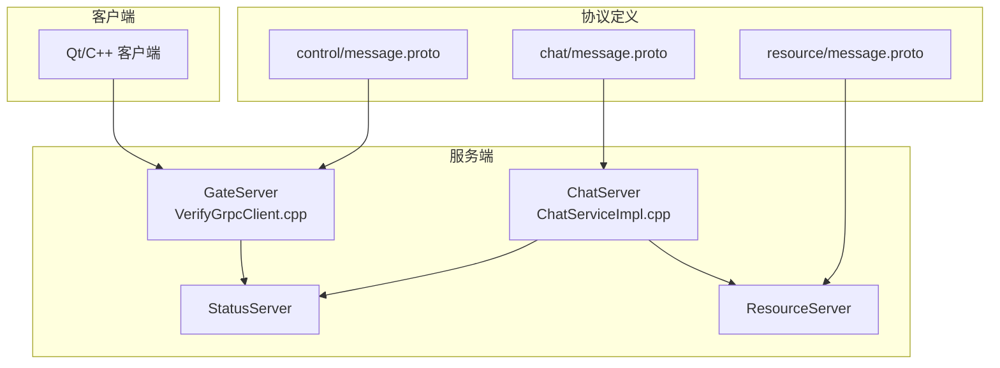
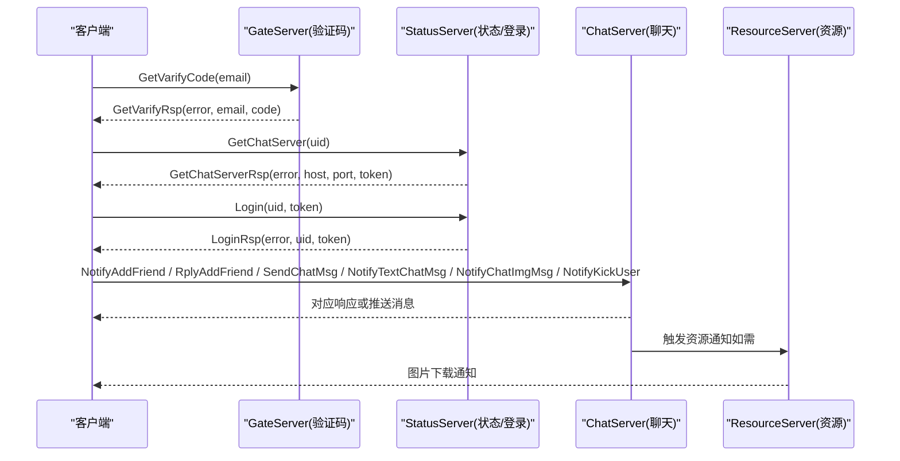
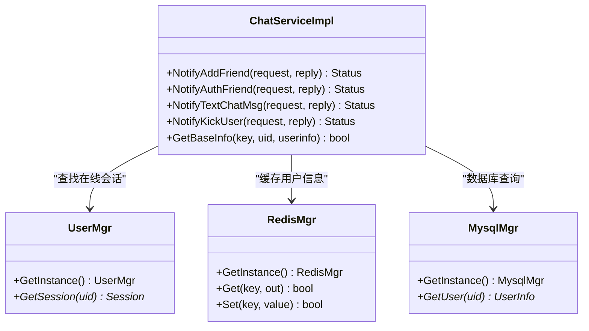
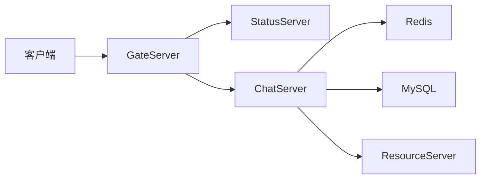

# 聊天消息协议定义

<cite>
**本文引用的文件**
- [server/proto/chat/message.proto](file://server/proto/chat/message.proto)
- [server/proto/control/message.proto](file://server/proto/control/message.proto)
- [server/proto/resource/message.proto](file://server/proto/resource/message.proto)
- [server/ChatServer/include/const.h](file://server/ChatServer/include/const.h)
- [client/llfcchat/include/global.h](file://client/llfcchat/include/global.h)
- [server/ChatServer/src/ChatServiceImpl.cpp](file://server/ChatServer/src/ChatServiceImpl.cpp)
- [server/GateServer/src/VerifyGrpcClient.cpp](file://server/GateServer/src/VerifyGrpcClient.cpp)
</cite>

## 目录
1. [简介](#简介)
2. [项目结构](#项目结构)
3. [核心组件](#核心组件)
4. [架构总览](#架构总览)
5. [详细组件分析](#详细组件分析)
6. [依赖关系分析](#依赖关系分析)
7. [性能与序列化规范](#性能与序列化规范)
8. [故障排查指南](#故障排查指南)
9. [结论](#结论)
10. [附录：客户端使用示例（多语言）](#附录客户端使用示例多语言)

## 简介
本文件为 LLFCChat 项目的聊天消息协议文档，聚焦于 gRPC 服务与消息类型定义。协议由三个 proto 文件组成：
- chat/message.proto：聊天业务主协议，包含验证码、状态查询、登录认证、好友申请与回复、文本消息、图片通知、踢人等能力。
- control/message.proto：控制面协议，覆盖验证码、状态、登录、好友、文本消息、踢人等基础能力（不含图片通知）。
- resource/message.proto：资源面协议，在 chat 基础上扩展了图片通知相关接口。

本文档将详细说明以下 gRPC 服务及其 RPC 方法：
- VarifyService：验证码获取
- StatusService：获取聊天服务器信息与用户登录认证
- ChatService：好友管理、文本消息、图片通知、踢人等

同时解释各消息结构的字段含义、错误码约定、字段验证规则，并提供消息流转图与各语言客户端调用示例。

## 项目结构
LLFCChat 的协议定义位于 server/proto 目录下，按功能域划分为 chat、control、resource 三个子目录。服务端实现分布在 ChatServer、GateServer、StatusServer、ResourceServer 等模块中；客户端使用 Qt/C++ 实现，并通过 TCP/gRPC 与后端交互。

图表来源
- [server/proto/chat/message.proto:1-167](file://server/proto/chat/message.proto#L1-L167)
- [server/proto/control/message.proto:1-143](file://server/proto/control/message.proto#L1-L143)
- [server/proto/resource/message.proto:1-169](file://server/proto/resource/message.proto#L1-L169)
- [server/ChatServer/src/ChatServiceImpl.cpp:1-200](file://server/ChatServer/src/ChatServiceImpl.cpp#L1-L200)
- [server/GateServer/src/VerifyGrpcClient.cpp:1-9](file://server/GateServer/src/VerifyGrpcClient.cpp#L1-L9)

章节来源
- [server/proto/chat/message.proto:1-167](file://server/proto/chat/message.proto#L1-L167)
- [server/proto/control/message.proto:1-143](file://server/proto/control/message.proto#L1-L143)
- [server/proto/resource/message.proto:1-169](file://server/proto/resource/message.proto#L1-L169)

## 核心组件
- 服务层
  - VarifyService：提供验证码获取能力，用于注册、重置密码等场景。
  - StatusService：提供获取聊天服务器地址与登录认证能力，用于客户端接入聊天服务。
  - ChatService：提供好友申请与回复、文本消息推送、图片通知、踢人等聊天核心能力。
- 消息层
  - 验证码请求/响应：GetVarifyReq/GetVarifyRsp
  - 状态与登录：GetChatServerReq/GetChatServerRsp、LoginReq/LoginRsp
  - 好友管理：AddFriendReq/AddFriendRsp、RplyFriendReq/RplyFriendRsp、AuthFriendReq/AuthFriendRsp
  - 文本消息：SendChatMsgReq/SendChatMsgRsp、TextChatMsgReq/TextChatMsgRsp、TextChatData
  - 图片通知：NotifyChatImgReq/NotifyChatImgRsp
  - 踢人：KickUserReq/KickUserRsp
- 错误码与常量
  - ErrorCodes：统一错误码定义，如成功、JSON解析错误、RPC失败、验证码过期/错误、用户存在、密码错误、邮箱不匹配、Token无效、uid无效、创建/加载聊天失败等。
  - MsgStatus：消息状态（未读、发送失败、已读、未上传完成）。
  - MSG_IDS：TCP 消息ID枚举，用于客户端与服务端之间的二进制帧路由。

章节来源
- [server/proto/chat/message.proto:1-167](file://server/proto/chat/message.proto#L1-L167)
- [server/proto/control/message.proto:1-143](file://server/proto/control/message.proto#L1-L143)
- [server/proto/resource/message.proto:1-169](file://server/proto/resource/message.proto#L1-L169)
- [server/ChatServer/include/const.h:1-104](file://server/ChatServer/include/const.h#L1-L104)
- [client/llfcchat/include/global.h:85-120](file://client/llfcchat/include/global.h#L85-L120)

## 架构总览
LLFCChat 采用分层与分域设计：
- 控制面（GateServer/StatusServer）负责验证码、状态查询与登录认证。
- 聊天面（ChatServer）负责好友关系、消息转发与推送。
- 资源面（ResourceServer）负责图片等资源下载与通知。

图表来源
- [server/proto/chat/message.proto:1-167](file://server/proto/chat/message.proto#L1-L167)
- [server/proto/control/message.proto:1-143](file://server/proto/control/message.proto#L1-L143)
- [server/proto/resource/message.proto:1-169](file://server/proto/resource/message.proto#L1-L169)
- [server/ChatServer/src/ChatServiceImpl.cpp:1-200](file://server/ChatServer/src/ChatServiceImpl.cpp#L1-L200)
- [server/GateServer/src/VerifyGrpcClient.cpp:1-9](file://server/GateServer/src/VerifyGrpcClient.cpp#L1-L9)

## 详细组件分析

### VarifyService（验证码服务）
- RPC
  - GetVarifyCode(GetVarifyReq) -> GetVarifyRsp
- 请求字段
  - email：字符串，邮箱地址
- 响应字段
  - error：整型，错误码
  - email：字符串，邮箱地址（回显）
  - code：字符串，验证码内容
- 用途
  - 注册、重置密码等需要邮箱验证码的场景
- 错误码约定
  - 参考 ErrorCodes：如 VarifyExpired、VarifyCodeErr 等
- 字段验证规则
  - email 非空且符合邮箱格式
  - code 长度与有效期由服务端策略决定

章节来源
- [server/proto/chat/message.proto:5-17](file://server/proto/chat/message.proto#L5-L17)
- [server/proto/control/message.proto:5-17](file://server/proto/control/message.proto#L5-L17)
- [server/proto/resource/message.proto:5-17](file://server/proto/resource/message.proto#L5-L17)
- [server/ChatServer/include/const.h:5-20](file://server/ChatServer/include/const.h#L5-L20)

### StatusService（状态服务）
- RPC
  - GetChatServer(GetChatServerReq) -> GetChatServerRsp
  - Login(LoginReq) -> LoginRsp
- 请求字段
  - GetChatServerReq.uid：整型，用户ID
  - LoginReq.uid：整型，用户ID
  - LoginReq.token：字符串，登录令牌
- 响应字段
  - GetChatServerRsp.error：整型，错误码
  - GetChatServerRsp.host：字符串，聊天服务器主机
  - GetChatServerRsp.port：字符串，聊天服务器端口
  - GetChatServerRsp.token：字符串，会话令牌
  - LoginRsp.error：整型，错误码
  - LoginRsp.uid：整型，用户ID
  - LoginRsp.token：字符串，会话令牌
- 用途
  - 客户端根据 uid 获取聊天服务器连接信息并完成登录认证
- 错误码约定
  - TokenInvalid、UidInvalid、RPCFailed 等
- 字段验证规则
  - uid 必须有效
  - token 需满足服务端校验策略

章节来源
- [server/proto/chat/message.proto:19-44](file://server/proto/chat/message.proto#L19-L44)
- [server/proto/control/message.proto:19-44](file://server/proto/control/message.proto#L19-L44)
- [server/proto/resource/message.proto:19-44](file://server/proto/resource/message.proto#L19-L44)
- [server/ChatServer/include/const.h:5-20](file://server/ChatServer/include/const.h#L5-L20)

### ChatService（聊天服务）
- RPC
  - NotifyAddFriend(AddFriendReq) -> AddFriendRsp
  - RplyAddFriend(RplyFriendReq) -> RplyFriendRsp
  - SendChatMsg(SendChatMsgReq) -> SendChatMsgRsp
  - NotifyAuthFriend(AuthFriendReq) -> AuthFriendRsp
  - NotifyTextChatMsg(TextChatMsgReq) -> TextChatMsgRsp
  - NotifyKickUser(KickUserReq) -> KickUserRsp
  - NotifyChatImgMsg(NotifyChatImgReq) -> NotifyChatImgRsp（仅 resource 协议）
- 关键消息结构与字段说明
  - AddFriendReq：applyuid、name、desc、icon、nick、sex、touid
  - AddFriendRsp：error、applyuid、touid
  - RplyFriendReq：rplyuid、agree、touid
  - RplyFriendRsp：error、rplyuid、touid
  - SendChatMsgReq：fromuid、touid、message
  - SendChatMsgRsp：error、fromuid、touid
  - AuthFriendReq：fromuid、touid、textmsgs（重复字段，类型为 AddFriendMsg）
  - AuthFriendRsp：error、fromuid、touid
  - TextChatMsgReq：fromuid、touid、thread_id、textmsgs（重复字段，类型为 TextChatData）
  - TextChatData：unique_id、msg_id、msgcontent、chat_time（chat/time 字段在不同 proto 中位置可能不同）
  - TextChatMsgRsp：error、fromuid、touid、thread_id、textmsgs
  - NotifyChatImgReq：from_uid、to_uid、message_id、file_name、total_size、thread_id
  - NotifyChatImgRsp：error、from_uid、to_uid、message_id、file_name、total_size、thread_id
  - KickUserReq：uid
  - KickUserRsp：error、uid
- 用途
  - 好友申请与回复、文本消息传输、好友认证、图片通知、踢人
- 错误码约定
  - Success、RPCFailed、UidInvalid、CREATE_CHAT_FAILED、LOAD_CHAT_FAILED 等
- 字段验证规则
  - fromuid/touid 必须有效且在线（部分逻辑在服务端检查）
  - textmsgs 数组元素需具备唯一标识 unique_id 与 msg_id
  - thread_id 用于会话分组
  - file_name/total_size 用于资源下载流程

章节来源
- [server/proto/chat/message.proto:46-166](file://server/proto/chat/message.proto#L46-L166)
- [server/proto/control/message.proto:46-142](file://server/proto/control/message.proto#L46-L142)
- [server/proto/resource/message.proto:46-165](file://server/proto/resource/message.proto#L46-L165)
- [server/ChatServer/include/const.h:5-20](file://server/ChatServer/include/const.h#L5-L20)
- [server/ChatServer/src/ChatServiceImpl.cpp:16-139](file://server/ChatServer/src/ChatServiceImpl.cpp#L16-L139)

#### 类与方法关系（ChatServiceImpl）

图表来源
- [server/ChatServer/src/ChatServiceImpl.cpp:16-139](file://server/ChatServer/src/ChatServiceImpl.cpp#L16-L139)
- [server/ChatServer/include/const.h:5-20](file://server/ChatServer/include/const.h#L5-L20)

章节来源
- [server/ChatServer/src/ChatServiceImpl.cpp:1-200](file://server/ChatServer/src/ChatServiceImpl.cpp#L1-L200)

## 依赖关系分析
- 协议依赖
  - chat/control/resource 三套 proto 定义了不同面的能力边界，chat 最完整，resource 扩展图片通知，control 为基础能力集合。
- 服务依赖
  - GateServer 通过 VerifyGrpcClient 访问验证码服务（VarifyService），并配置连接池。
  - ChatServer 实现 ChatService，依赖 UserMgr、RedisMgr、MysqlMgr 进行会话管理与数据存取。
- 客户端依赖
  - 客户端通过 HTTP/TCP/gRPC 与 Gate/Status/Chat/Resource 服务交互，遵循统一的错误码与消息ID。

图表来源
- [server/GateServer/src/VerifyGrpcClient.cpp:1-9](file://server/GateServer/src/VerifyGrpcClient.cpp#L1-L9)
- [server/ChatServer/src/ChatServiceImpl.cpp:1-200](file://server/ChatServer/src/ChatServiceImpl.cpp#L1-L200)

章节来源
- [server/proto/chat/message.proto:1-167](file://server/proto/chat/message.proto#L1-L167)
- [server/proto/control/message.proto:1-143](file://server/proto/control/message.proto#L1-L143)
- [server/proto/resource/message.proto:1-169](file://server/proto/resource/message.proto#L1-L169)
- [server/GateServer/src/VerifyGrpcClient.cpp:1-9](file://server/GateServer/src/VerifyGrpcClient.cpp#L1-L9)
- [server/ChatServer/src/ChatServiceImpl.cpp:1-200](file://server/ChatServer/src/ChatServiceImpl.cpp#L1-L200)

## 性能与序列化规范
- 序列化格式
  - gRPC 默认使用 Protocol Buffers 二进制序列化，高效紧凑，跨语言兼容。
  - 服务端内部对 JSON 的使用主要用于向客户端推送消息时的业务封装（例如 ChatServiceImpl 中将消息组织为 Json::Value 后序列化为字符串再发送）。
- 错误码约定
  - 所有响应均包含 error 字段，值为 ErrorCodes 中的枚举值。
  - 常见错误码：Success=0、RPCFailed=1002、VarifyExpired=1003、VarifyCodeErr=1004、UserExist=1005、PasswdErr=1006、EmailNotMatch=1007、PasswdUpFailed=1008、PasswdInvalid=1009、TokenInvalid=1010、UidInvalid=1011、CREATE_CHAT_FAILED=1012、LOAD_CHAT_FAILED=1013。
- 字段验证规则
  - 必填字段：email、uid、token、fromuid、touid、textmsgs 等。
  - 格式约束：email 邮箱格式、code 长度与有效期、token 安全校验、msg_id/unique_id 唯一性。
  - 业务约束：在线用户检测、好友关系校验、线程 ID 一致性。
- 性能建议
  - 批量发送 textmsgs 时注意数组大小限制，避免过大负载。
  - 图片通知使用 NotifyChatImgReq/NotifyChatImgRsp 分离元数据与流式传输，提升吞吐。
  - 使用连接池与异步 I/O（如 VerifyGrpcClient 的连接池）减少延迟。

章节来源
- [server/proto/chat/message.proto:1-167](file://server/proto/chat/message.proto#L1-L167)
- [server/proto/control/message.proto:1-143](file://server/proto/control/message.proto#L1-L143)
- [server/proto/resource/message.proto:1-169](file://server/proto/resource/message.proto#L1-L169)
- [server/ChatServer/include/const.h:5-20](file://server/ChatServer/include/const.h#L5-L20)
- [server/ChatServer/src/ChatServiceImpl.cpp:1-200](file://server/ChatServer/src/ChatServiceImpl.cpp#L1-L200)
- [server/GateServer/src/VerifyGrpcClient.cpp:1-9](file://server/GateServer/src/VerifyGrpcClient.cpp#L1-L9)

## 故障排查指南
- 常见问题定位
  - 验证码错误：检查 VarifyCodeErr、VarifyExpired，确认邮箱与验证码有效性。
  - 登录失败：检查 TokenInvalid、UidInvalid，确认 token 与 uid 是否匹配。
  - 聊天失败：检查 CREATE_CHAT_FAILED、LOAD_CHAT_FAILED，确认会话创建与加载逻辑。
  - 网络问题：检查 RPCFailed，确认网络连接与超时设置。
- 调试建议
  - 查看服务端日志（ChatServiceImpl 中输出用户登录信息）。
  - 核对客户端与服务端的错误码映射。
  - 检查 JSON 序列化/反序列化是否正确（服务端内部使用 Json::Value）。
- 客户端侧
  - 确保 MSG_IDS 与错误码枚举一致（global.h 与 const.h）。
  - 处理粘包与断连重连逻辑。

章节来源
- [server/ChatServer/include/const.h:5-20](file://server/ChatServer/include/const.h#L5-L20)
- [client/llfcchat/include/global.h:85-120](file://client/llfcchat/include/global.h#L85-L120)
- [server/ChatServer/src/ChatServiceImpl.cpp:142-187](file://server/ChatServer/src/ChatServiceImpl.cpp#L142-L187)

## 结论
LLFCChat 的聊天消息协议以 gRPC + Protobuf 为核心，清晰划分控制面、聊天面与资源面，提供完整的验证码、状态查询、登录认证、好友管理、文本消息、图片通知与踢人能力。统一错误码与字段验证规则保障了跨语言与分布式环境下的稳定性与可维护性。结合连接池、异步 I/O 与缓存策略，系统具备良好的性能与可扩展性。

## 附录：客户端使用示例（多语言）
以下为基于 gRPC 的通用调用步骤与要点，具体代码实现请参考各语言的 gRPC 官方文档与生成的 stub。

- 通用步骤
  - 生成 stub：使用 protoc 编译 message.proto 得到各语言客户端代码。
  - 建立连接：配置目标服务的 host/port，必要时启用 TLS。
  - 调用接口：按顺序调用 GetVarifyCode、GetChatServer、Login，然后进入聊天流程。
  - 错误处理：根据 error 字段与错误码进行提示与重试。
  - 消息收发：使用 ChatService 的 NotifyTextChatMsg、SendChatMsg 等方法进行文本消息传输。
  - 图片通知：使用 NotifyChatImgReq/NotifyChatImgRsp 进行图片元数据同步与下载。

- C++ 示例要点
  - 使用 grpc::Channel 与生成的 ServiceStub。
  - 构造请求对象并设置字段（如 email、uid、token、textmsgs）。
  - 处理回调或同步返回结果，检查 error 字段。
  - 在 ChatServiceImpl 中，服务端会将消息组织为 JSON 并推送给客户端，客户端需解析对应字段。

- Go 示例要点
  - 使用 grpc.Dial 建立连接，调用 VarifyServiceClient、StatusServiceClient、ChatServiceClient。
  - 构建 proto 消息并调用 RPC，处理返回的响应对象。
  - 注意错误码与字段校验。

- Java 示例要点
  - 使用 ManagedChannel 与 Stub，构造请求并调用方法。
  - 处理响应中的 error 与业务字段。
  - 注意线程模型与超时配置。

- Python 示例要点
  - 使用 grpc.aio 或同步通道，调用生成的 stub。
  - 构造消息对象并调用 RPC，处理响应。
  - 注意编码与解码（Protobuf 自动处理）。

- 注意事项
  - 确保各语言生成的 proto 版本一致。
  - 合理设置超时与重试策略。
  - 处理网络异常与断线重连。
  - 对于大消息（如 textmsgs 数组）进行分页或分批处理。

[本节为概念性指导，不直接分析具体文件，故无“章节来源”]