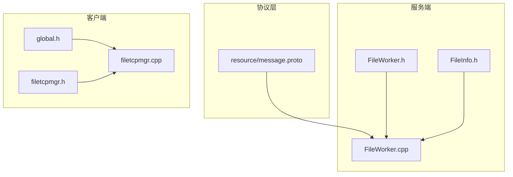
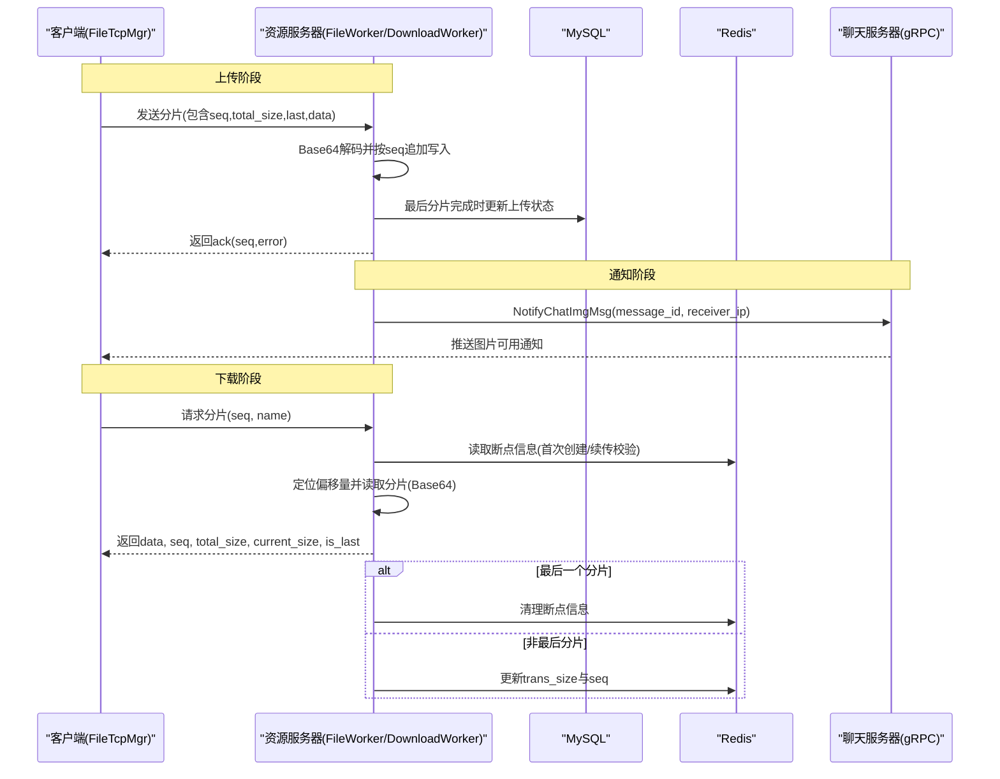
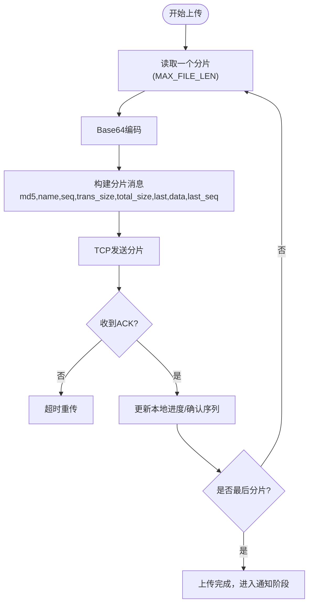
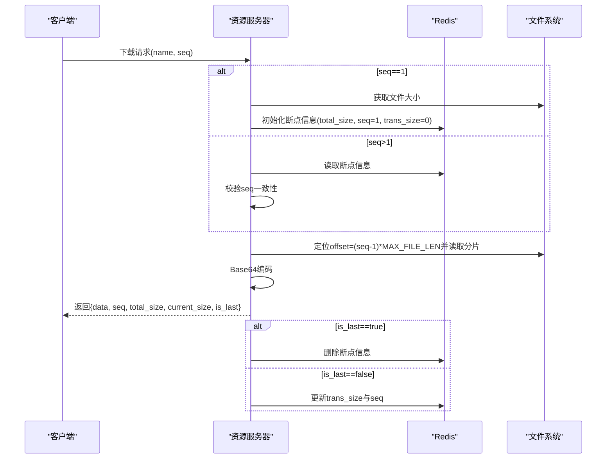
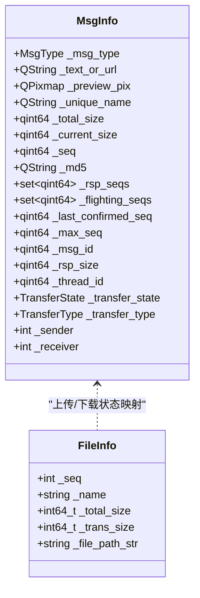
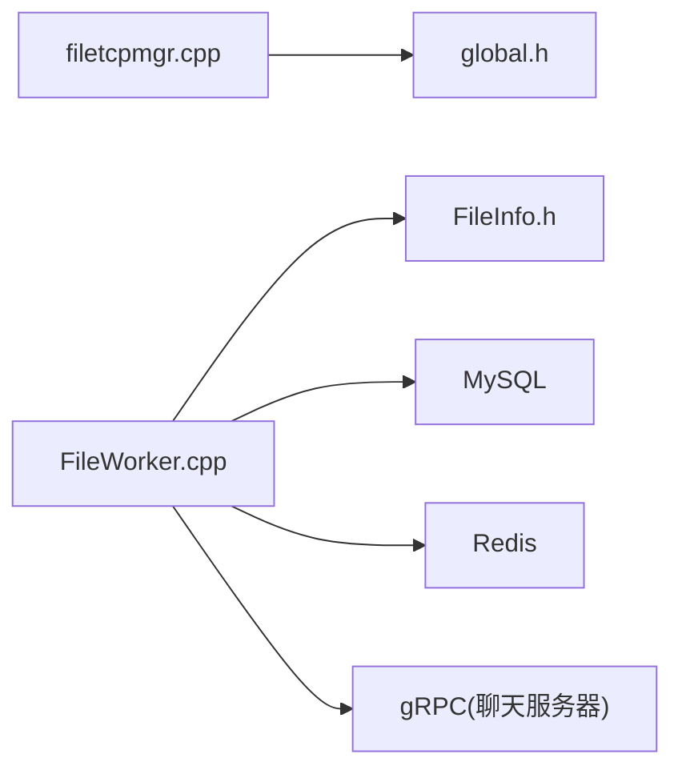

# 资源消息协议定义

<cite>
**本文引用的文件**   
- [message.proto](file://server/proto/resource/message.proto)
- [FileWorker.h](file://server\ResourceServer\include\FileWorker.h)
- [FileWorker.cpp](file://server\ResourceServer\src\FileWorker.cpp)
- [FileInfo.h](file://server\ResourceServer\include\FileInfo.h)
- [global.h](file://client\llfcchat\include\global.h)
- [filetcpmgr.h](file://client\llfcchat\include\filetcpmgr.h)
- [filetcpmgr.cpp](file://client\llfcchat\src\filetcpmgr.cpp)
- [day38-断点续传.md](file://开发文档\day38-断点续传.md)
- [day40-聊天图片资源续传和进度显示.md](file://开发文档\day40-聊天图片资源续传和进度显示.md)
- [day41-通知客户端异步下载聊天图片.md](file://开发文档\day41-通知客户端异步下载聊天图片.md)
</cite>

## 目录
1. [简介](#简介)
2. [项目结构](#项目结构)
3. [核心组件](#核心组件)
4. [架构总览](#架构总览)
5. [详细组件分析](#详细组件分析)
6. [依赖关系分析](#依赖关系分析)
7. [性能考虑](#性能考虑)
8. [故障排查指南](#故障排查指南)
9. [结论](#结论)
10. [附录](#附录)

## 简介
本文件为 LLFCChat 项目的“资源消息协议”提供完整、深入的技术文档，聚焦于 server/proto/resource/message.proto 中定义的与资源和文件传输相关的消息结构，并结合服务端与客户端实现，系统说明：
- 文件上传、下载、断点续传的消息格式与字段含义（含文件元数据、分片信息、进度跟踪）
- 资源消息的生命周期管理（从上传到下载完成的端到端流程）
- 大文件传输优化策略（并发控制、内存管理、错误重试机制）
- 资源操作的 API 调用示例（客户端侧的文件选择、上传进度显示、下载管理等）
- 文件存储路径规则与命名规范

## 项目结构
围绕资源消息协议，关键代码分布在以下位置：
- 协议定义：server/proto/resource/message.proto
- 服务端资源处理：server/ResourceServer/include/FileWorker.h, server/ResourceServer/src/FileWorker.cpp, server/ResourceServer/include/FileInfo.h
- 客户端资源传输：client/llfcchat/include/global.h, client/llfcchat/include/filetcpmgr.h, client/llfcchat/src/filetcpmgr.cpp
- 开发文档（流程与实现细节参考）：开发文档/day38-断点续传.md, day40-聊天图片资源续传和进度显示.md, day41-通知客户端异步下载聊天图片.md

图表来源 
- [message.proto:1-169](file://server/proto/resource/message.proto#L1-L169)
- [FileWorker.h:1-90](file://server\ResourceServer\include\FileWorker.h#L1-L90)
- [FileWorker.cpp:1-200](file://server\ResourceServer\src\FileWorker.cpp#L1-L200)
- [FileInfo.h:1-26](file://server\ResourceServer\include\FileInfo.h#L1-L26)
- [global.h:1-296](file://client\llfcchat\include\global.h#L1-L296)
- [filetcpmgr.h:1-85](file://client\llfcchat\include\filetcpmgr.h#L1-L85)
- [filetcpmgr.cpp:1-200](file://client\llfcchat\src\filetcpmgr.cpp#L1-L200)

章节来源
- [message.proto:1-169](file://server/proto/resource/message.proto#L1-L169)
- [FileWorker.h:1-90](file://server\ResourceServer\include\FileWorker.h#L1-L90)
- [FileWorker.cpp:1-200](file://server\ResourceServer\src\FileWorker.cpp#L1-L200)
- [FileInfo.h:1-26](file://server\ResourceServer\include\FileInfo.h#L1-L26)
- [global.h:1-296](file://client\llfcchat\include\global.h#L1-L296)
- [filetcpmgr.h:1-85](file://client\llfcchat\include\filetcpmgr.h#L1-L85)
- [filetcpmgr.cpp:1-200](file://client\llfcchat\src\filetcpmgr.cpp#L1-L200)

## 核心组件
- 协议消息与服务
  - message.proto 定义了校验服务、状态服务、聊天服务等 RPC，以及若干消息体。其中与资源相关的关键消息包括：NotifyChatImgReq/NotifyChatImgRsp，用于通知聊天图片资源可用；以及与登录、认证等相关的通用消息。
- 服务端文件工作器
  - FileWorker 负责接收并处理上传任务（头像、聊天图片、普通文件），按分片写入磁盘，并在完成时更新数据库或触发通知。
  - DownloadWorker 负责按分片读取文件、Base64 编码后返回给客户端，同时维护 Redis 中的断点续传状态。
- 客户端 TCP 管理器
  - FileTcpMgr 负责与资源服务器建立 TCP 连接、粘包/拆包解析、发送/接收分片数据、拥塞窗口控制、进度回调等。
  - global.h 定义了 ReqId、MsgInfo、TransferState、TransferType、MAX_FILE_LEN 等关键常量与数据结构，贯穿客户端上传/下载逻辑。

章节来源
- [message.proto:138-165](file://server/proto/resource/message.proto#L138-L165)
- [FileWorker.h:14-56](file://server\ResourceServer\include\FileWorker.h#L14-L56)
- [FileWorker.cpp:49-283](file://server\ResourceServer\src\FileWorker.cpp#L49-L283)
- [filetcpmgr.h:26-85](file://client\llfcchat\include\filetcpmgr.h#L26-L85)
- [global.h:15-88](file://client\llfcchat\include\global.h#L15-L88)
- [global.h:145-197](file://client\llfcchat\include\global.h#L145-L197)

## 架构总览
资源消息协议在 LLFCChat 中的端到端交互如下：
- 客户端通过 TCP 将文件分片（Base64）发送至资源服务器
- 资源服务器按 seq 顺序写入文件，记录进度至 Redis（下载场景）
- 聊天图片上传完成后，资源服务器通过 gRPC 通知聊天服务器，再由聊天服务器推送给接收方客户端
- 客户端根据服务器响应更新本地进度、重传缺失分片、最终完成下载

图表来源 
- [FileWorker.cpp:49-283](file://server\ResourceServer\src\FileWorker.cpp#L49-L283)
- [FileWorker.cpp:571-709](file://开发文档\day41-通知客户端异步下载聊天图片.md#L571-L709)
- [filetcpmgr.cpp:175-200](file://client\llfcchat\src\filetcpmgr.cpp#L175-L200)
- [message.proto:138-165](file://server/proto/resource/message.proto#L138-L165)

## 详细组件分析

### 协议消息与字段定义
- 聊天图片通知消息
  - NotifyChatImgReq/NotifyChatImgRsp：包含 from_uid、to_uid、message_id、file_name、total_size、thread_id 等字段，用于告知接收方某聊天图片已就绪并可下载。
- 其他通用消息
  - 登录、认证、文本聊天等消息在 message.proto 中定义，作为资源服务的上下文支撑（如获取 ChatServer 地址、Token 等）。

章节来源
- [message.proto:138-165](file://server/proto/resource/message.proto#L138-L165)
- [message.proto:19-44](file://server/proto/resource/message.proto#L19-L44)

### 上传流程与分片协议
- 客户端分片上传
  - 使用全局常量 MAX_FILE_LEN 作为分片大小，逐块读取文件并 Base64 编码
  - 每个分片携带 md5、name、seq、trans_size、total_size、last、data、last_seq 等字段
  - 采用“发送一帧、等待响应”的模式，避免粘包与拥塞
- 服务端处理
  - FileWorker 接收 ID_IMG_CHAT_UPLOAD_REQ / ID_FILE_INFO_SYNC_REQ / ID_UPLOAD_HEAD_ICON_REQ 等请求
  - 首包以 trunc 模式打开文件，后续包以 append 模式追加写入
  - 最后分片到达后更新数据库状态并通过 gRPC 通知聊天服务器

图表来源 
- [global.h:15-24](file://client\llfcchat\include\global.h#L15-L24)
- [day38-断点续传.md:479-631](file://开发文档\day38-断点续传.md#L479-L631)
- [FileWorker.cpp:199-283](file://server\ResourceServer\src\FileWorker.cpp#L199-L283)

章节来源
- [global.h:15-24](file://client\llfcchat\include\global.h#L15-L24)
- [day38-断点续传.md:479-631](file://开发文档\day38-断点续传.md#L479-L631)
- [FileWorker.cpp:199-283](file://server\ResourceServer\src\FileWorker.cpp#L199-L283)

### 下载流程与断点续传
- 客户端发起下载请求
  - 指定文件名与 seq，若 seq=1 表示新下载，否则为续传
- 服务端处理
  - 首次下载：读取文件大小，初始化 FileInfo 并写入 Redis（seq、total_size、trans_size、file_path_str）
  - 续传：从 Redis 恢复状态，校验 seq 一致性，计算偏移量 offset=(seq-1)*MAX_FILE_LEN，读取分片并 Base64 编码返回
  - 最后分片：清理 Redis 中的断点信息
- 客户端处理
  - 根据 is_last 判断是否结束，累计 current_size，更新 UI 进度条

图表来源 
- [day41-通知客户端异步下载聊天图片.md:571-709](file://开发文档\day41-通知客户端异步下载聊天图片.md#L571-L709)
- [FileInfo.h:1-26](file://server\ResourceServer\include\FileInfo.h#L1-L26)

章节来源
- [day41-通知客户端异步下载聊天图片.md:571-709](file://开发文档\day41-通知客户端异步下载聊天图片.md#L571-L709)
- [FileInfo.h:1-26](file://server\ResourceServer\include\FileInfo.h#L1-L26)

### 进度跟踪与并发控制
- 进度跟踪
  - 客户端 MsgInfo 维护 _current_size、_seq、_rsp_seqs、_flighting_seqs、_last_confirmed_seq、_max_seq 等字段，结合信号 sig_update_upload_progress/sig_update_download_progress 驱动 UI 更新
- 并发控制
  - 客户端拥塞窗口 _cwnd_size 限制未确认分片数量，防止网络拥塞
  - 服务端使用线程池/队列（FileWorker/DownloadWorker）串行化磁盘 I/O，降低竞争

图表来源 
- [global.h:167-197](file://client\llfcchat\include\global.h#L167-L197)
- [FileInfo.h:1-26](file://server\ResourceServer\include\FileInfo.h#L1-L26)

章节来源
- [global.h:167-197](file://client\llfcchat\include\global.h#L167-L197)
- [FileInfo.h:1-26](file://server\ResourceServer\include\FileInfo.h#L1-L26)

### 资源操作 API 调用示例（客户端侧）
- 文件选择与准备
  - 选择文件后计算 MD5、获取文件名与总大小，确定 last_seq
- 上传进度显示
  - 监听 sig_update_upload_progress，根据 _last_confirmed_seq 与 _max_seq 计算百分比
- 下载管理
  - 监听 sig_update_download_progress 与 sig_download_finish，根据 is_last 判断完成并关闭文件句柄

章节来源
- [day38-断点续传.md:479-631](file://开发文档\day38-断点续传.md#L479-L631)
- [day40-聊天图片资源续传和进度显示.md:633-795](file://开发文档\day40-聊天图片资源续传和进度显示.md#L633-L795)
- [filetcpmgr.h:65-82](file://client\llfcchat\include\filetcpmgr.h#L65-L82)

### 文件存储路径规则与命名规范
- 路径规则
  - 服务端写入前检查目录是否存在，不存在则自动创建
  - 首包使用 trunc 模式创建/清空文件，后续包使用 append 模式追加
- 命名规范
  - 文件名由客户端生成唯一名（例如基于时间戳+随机串），确保跨会话不冲突
  - 头像上传成功后会更新用户头像路径并缓存至 Redis

章节来源
- [FileWorker.cpp:66-112](file://server\ResourceServer\src\FileWorker.cpp#L66-L112)
- [FileWorker.cpp:115-196](file://server\ResourceServer\src\FileWorker.cpp#L115-L196)
- [global.h:280-283](file://client\llfcchat\include\global.h#L280-L283)

## 依赖关系分析
- 客户端依赖
  - filetcpmgr.cpp 依赖 global.h 中的常量与数据结构（ReqId、MsgInfo、TransferState、MAX_FILE_LEN）
- 服务端依赖
  - FileWorker.cpp 依赖 FileInfo.h 的断点状态结构，依赖 MySQL/Redis 进行持久化与缓存
  - 聊天图片上传完成后通过 gRPC 通知聊天服务器

图表来源 
- [filetcpmgr.cpp:175-200](file://client\llfcchat\src\filetcpmgr.cpp#L175-L200)
- [global.h:15-88](file://client\llfcchat\include\global.h#L15-L88)
- [FileWorker.cpp:256-277](file://server\ResourceServer\src\FileWorker.cpp#L256-L277)
- [FileInfo.h:1-26](file://server\ResourceServer\include\FileInfo.h#L1-L26)

章节来源
- [filetcpmgr.cpp:175-200](file://client\llfcchat\src\filetcpmgr.cpp#L175-L200)
- [global.h:15-88](file://client\llfcchat\include\global.h#L15-L88)
- [FileWorker.cpp:256-277](file://server\ResourceServer\src\FileWorker.cpp#L256-L277)
- [FileInfo.h:1-26](file://server\ResourceServer\include\FileInfo.h#L1-L26)

## 性能考虑
- 分片大小
  - MAX_FILE_LEN 控制单分片大小，平衡内存占用与网络开销
- 拥塞控制
  - 客户端 _cwnd_size 限制并发未确认分片数，避免丢包与重传风暴
- 磁盘 I/O
  - 服务端串行化写入，减少锁竞争；下载时按偏移量定位读取，避免全量加载
- 缓存与持久化
  - Redis 保存断点信息，支持快速恢复；MySQL 持久化聊天图片上传状态
- 错误重试
  - 客户端对未确认分片进行超时重传；服务端校验 seq 一致性，防止乱序导致的状态不一致

[本节为通用指导，不直接分析具体文件]

## 故障排查指南
- 常见问题
  - JSON 解析失败：检查消息体结构与字段完整性
  - 文件权限错误：确认服务端目录可写权限
  - 断点续传失败：核对 Redis 中 seq 与当前请求 seq 是否一致
  - 网络错误：检查连接状态、拥塞窗口设置与重传逻辑
- 调试建议
  - 打印分片 seq、total_size、current_size、is_last 关键字段
  - 在服务端日志中观察文件写入成功与否及最后分片处理分支
  - 在客户端监听 sig_connection_closed 与错误事件，及时恢复连接

章节来源
- [filetcpmgr.cpp:65-93](file://client\llfcchat\src\filetcpmgr.cpp#L65-L93)
- [FileWorker.cpp:89-112](file://server\ResourceServer\src\FileWorker.cpp#L89-L112)
- [day41-通知客户端异步下载聊天图片.md:571-709](file://开发文档\day41-通知客户端异步下载聊天图片.md#L571-L709)

## 结论
LLFCChat 的资源消息协议通过清晰的分片协议、严格的 seq 管理与 Redis 断点状态，实现了稳定可靠的大文件上传与下载能力。配合客户端拥塞窗口控制与进度反馈，既保证了用户体验，也提升了系统吞吐与鲁棒性。建议在扩展新资源类型时，沿用现有分片与断点模型，保持协议一致性。

[本节为总结，不直接分析具体文件]

## 附录
- 关键常量与枚举
  - FILE_UPLOAD_HEAD_LEN、FILE_UPLOAD_ID_LEN、FILE_UPLOAD_LEN_LEN、MAX_FILE_LEN、MAX_CWND_SIZE
  - ReqId（ID_IMG_CHAT_UPLOAD_REQ、ID_IMG_CHAT_CONTINUE_UPLOAD_REQ、ID_IMG_CHAT_DOWN_REQ 等）
  - TransferState、TransferType、MsgType
- 数据结构
  - MsgInfo（客户端上传/下载状态）
  - FileInfo（服务端断点信息）
  - DownloadInfo（客户端下载进度）

章节来源
- [global.h:15-24](file://client\llfcchat\include\global.h#L15-L24)
- [global.h:43-88](file://client\llfcchat\include\global.h#L43-L88)
- [global.h:145-197](file://client\llfcchat\include\global.h#L145-L197)
- [FileInfo.h:1-26](file://server\ResourceServer\include\FileInfo.h#L1-L26)