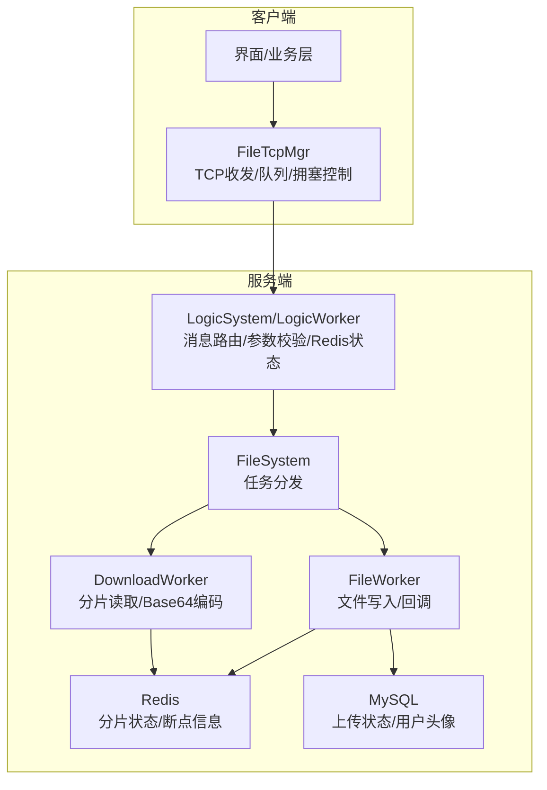
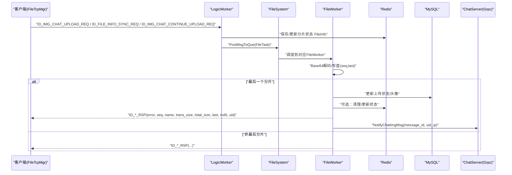
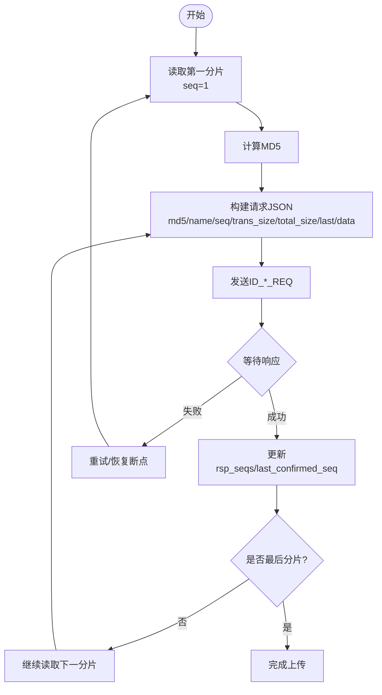
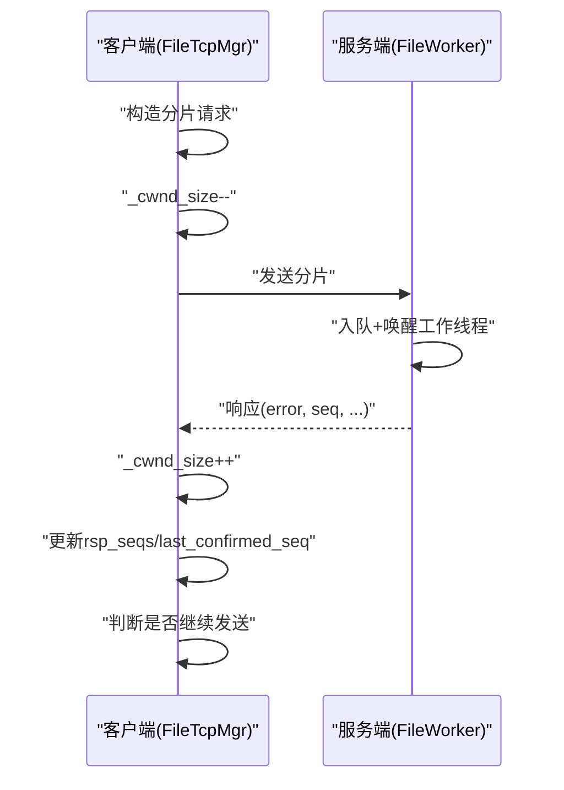
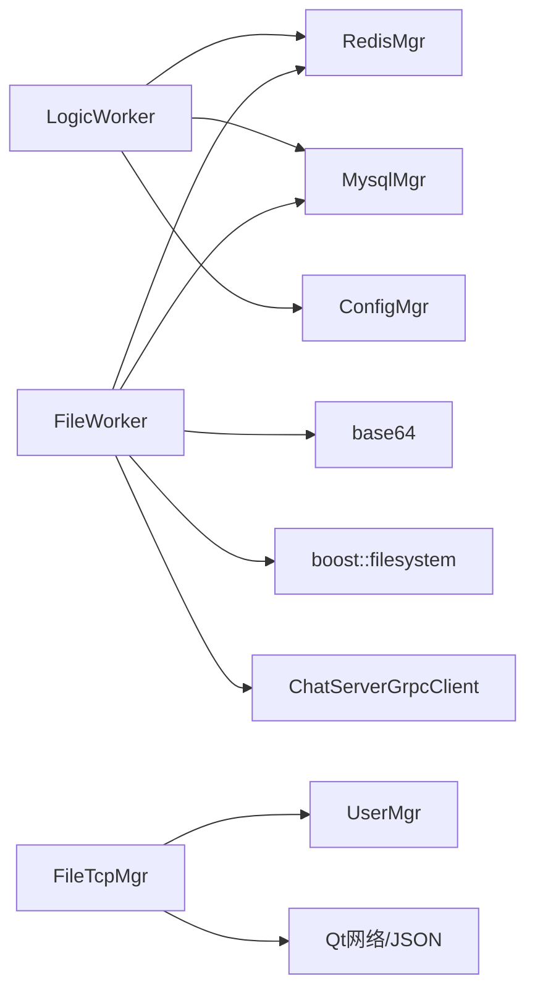

# 文件上传API

<cite>
**本文引用的文件**   
- [server/ResourceServer/include/FileWorker.h](file://server/ResourceServer/include/FileWorker.h)
- [server/ResourceServer/src/FileWorker.cpp](file://server/ResourceServer/src/FileWorker.cpp)
- [server/ResourceServer/include/FileSystem.h](file://server/ResourceServer/include/FileSystem.h)
- [server/ResourceServer/include/FileInfo.h](file://server/ResourceServer/include/FileInfo.h)
- [server/ResourceServer/include/LogicSystem.h](file://server/ResourceServer/include/LogicSystem.h)
- [server/ResourceServer/src/LogicSystem.cpp](file://server/ResourceServer/src/LogicSystem.cpp)
- [server/ResourceServer/include/const.h](file://server/ResourceServer/include/const.h)
- [client/llfcchat/include/filetcpmgr.h](file://client/llfcchat/include/filetcpmgr.h)
- [client/llfcchat/src/filetcpmgr.cpp](file://client/llfcchat/src/filetcpmgr.cpp)
- [开发文档/day38-断点续传.md](file://开发文档/day38-断点续传.md)
- [开发文档/day40-聊天图片资源续传和进度显示.md](file://开发文档/day40-聊天图片资源续传和进度显示.md)
</cite>

## 目录
1. [简介](#简介)
2. [项目结构](#项目结构)
3. [核心组件](#核心组件)
4. [架构总览](#架构总览)
5. [详细组件分析](#详细组件分析)
6. [依赖关系分析](#依赖关系分析)
7. [性能考量](#性能考量)
8. [故障排查指南](#故障排查指南)
9. [结论](#结论)
10. [附录：消息结构与调用示例](#附录消息结构与调用示例)

## 简介
本文件为LLFCChat项目的“文件上传API”提供完整技术文档，覆盖上传初始化、分片上传、断点续传、并发控制、错误处理与重试机制、超时策略以及性能优化实践。文档面向开发者与集成者，既包含服务端实现细节，也包含客户端调用流程与最佳实践。

## 项目结构
- 服务端（ResourceServer）
  - 逻辑层：LogicSystem/LogicWorker 负责消息路由、参数解析、Redis状态管理、任务派发
  - 工作层：FileWorker/DownloadWorker 负责文件读写、Base64编解码、持久化、回调通知
  - 文件系统抽象：FileSystem 将任务分发到多个 FileWorker/DownloadWorker 实例
  - 常量与协议：const.h 定义消息ID、错误码、分片大小等
  - 数据结构：FileInfo/ChatImgInfo 描述分片信息与聊天图片元数据
- 客户端（Qt/C++）
  - FileTcpMgr 负责TCP连接、粘包处理、发送队列、拥塞窗口控制、消息分发与回调
  - 业务层通过 UserMgr/ChatPage 等模块组织上传流程与UI进度更新



**图表来源** 
- [server/ResourceServer/include/FileSystem.h:1-21](file://server/ResourceServer/include/FileSystem.h#L1-L21)
- [server/ResourceServer/include/FileWorker.h:1-90](file://server/ResourceServer/include/FileWorker.h#L1-L90)
- [server/ResourceServer/src/FileWorker.cpp:1-663](file://server/ResourceServer/src/FileWorker.cpp#L1-L663)
- [server/ResourceServer/include/LogicSystem.h:1-34](file://server/ResourceServer/include/LogicSystem.h#L1-L34)
- [client/llfcchat/include/filetcpmgr.h:1-85](file://client/llfcchat/include/filetcpmgr.h#L1-L85)

**章节来源**
- [server/ResourceServer/include/FileSystem.h:1-21](file://server/ResourceServer/include/FileSystem.h#L1-L21)
- [server/ResourceServer/include/FileWorker.h:1-90](file://server/ResourceServer/include/FileWorker.h#L1-L90)
- [client/llfcchat/include/filetcpmgr.h:1-85](file://client/llfcchat/include/filetcpmgr.h#L1-L85)

## 核心组件
- FileWorker
  - 职责：接收上传任务，Base64解码后按分片顺序写入磁盘；首个分片清空文件，后续分片追加；最后一个分片触发回调（如更新数据库、通知ChatServer）。
  - 关键能力：分片顺序控制（seq）、最后分片标记（last）、路径创建与权限检查、异步回调。
- DownloadWorker
  - 职责：按分片读取文件，Base64编码后返回给客户端；支持断点续传（基于Redis中的FileInfo）。
  - 关键能力：偏移量计算、is_last判断、Redis状态同步与清理。
- FileSystem
  - 职责：维护多个 FileWorker/DownloadWorker 实例，按文件名哈希选择具体worker，保证负载均衡与隔离。
- LogicSystem/LogicWorker
  - 职责：解析请求JSON、校验参数、维护MD5->FileInfo映射、与Redis交互、派发任务至FileSystem。
- FileTcpMgr（客户端）
  - 职责：TCP粘包处理、发送队列、拥塞窗口控制、消息注册与分发、进度信号上报、断点续传发起。

**章节来源**
- [server/ResourceServer/include/FileWorker.h:1-90](file://server/ResourceServer/include/FileWorker.h#L1-L90)
- [server/ResourceServer/src/FileWorker.cpp:1-663](file://server/ResourceServer/src/FileWorker.cpp#L1-L663)
- [server/ResourceServer/include/FileSystem.h:1-21](file://server/ResourceServer/include/FileSystem.h#L1-L21)
- [server/ResourceServer/include/LogicSystem.h:1-34](file://server/ResourceServer/include/LogicSystem.h#L1-L34)
- [client/llfcchat/include/filetcpmgr.h:1-85](file://client/llfcchat/include/filetcpmgr.h#L1-L85)

## 架构总览
上传流程从客户端选择文件开始，经TCP发送至服务端的LogicWorker，再交由FileSystem分发到FileWorker进行分片写入；完成后通过回调更新数据库或通知ChatServer。下载流程则相反，由客户端发起分片请求，服务端DownloadWorker按偏移读取并返回Base64数据。



**图表来源** 
- [server/ResourceServer/src/FileWorker.cpp:1-663](file://server/ResourceServer/src/FileWorker.cpp#L1-L663)
- [server/ResourceServer/include/const.h:1-117](file://server/ResourceServer/include/const.h#L1-L117)
- [client/llfcchat/src/filetcpmgr.cpp:1-800](file://client/llfcchat/src/filetcpmgr.cpp#L1-L800)

## 详细组件分析

### 上传任务模型与处理器
- FileTask
  - 字段：会话、消息ID、用户ID、路径、文件名、分片序号、总大小、已传输大小、是否最后分片、数据体、回调函数、聊天消息ID、发送方/接收方ID、线程ID等。
- 处理器映射
  - 通过 _handlers 将消息ID映射到处理lambda，包括普通上传、头像上传、聊天图片上传、文件信息同步、续传图片上传等。

```mermaid
classDiagram
class FileTask {
+shared_ptr<CSession> _session
+MSG_IDS _msg_id
+int _uid
+int _seq
+string _path
+string _name
+int _total_size
+int _trans_size
+int _last
+string _file_data
+function<void(Json : : Value&)> _callback
+int _chat_msg_id
+int _sender
+int _receiver
+int _thread_id
}
class FileWorker {
+RegisterHandlers()
+PostTask(shared_ptr<FileTask>)
-task_callback(shared_ptr<FileTask>)
-std : : unordered_map<MSG_IDS, function> _handlers
-std : : thread _work_thread
-queue<function> _task_que
-atomic<bool> _b_stop
-mutex _mtx
-condition_variable _cv
}
class DownloadWorker {
+PostTask(shared_ptr<DownloadTask>)
-task_callback(shared_ptr<DownloadTask>)
-std : : thread _work_thread
-queue<shared_ptr<DownloadTask>> _task_que
-atomic<bool> _b_stop
-mutex _mtx
-condition_variable _cv
}
FileWorker --> FileTask : "处理"
DownloadWorker --> DownloadTask : "处理"
```

**图表来源** 
- [server/ResourceServer/include/FileWorker.h:1-90](file://server/ResourceServer/include/FileWorker.h#L1-L90)

**章节来源**
- [server/ResourceServer/include/FileWorker.h:1-90](file://server/ResourceServer/include/FileWorker.h#L1-L90)
- [server/ResourceServer/src/FileWorker.cpp:1-663](file://server/ResourceServer/src/FileWorker.cpp#L1-L663)

### 分片上传机制与断点续传
- 分片大小：MAX_FILE_LEN（默认32KB），在const.h中定义。
- 分片标识：seq（从1开始递增），last（是否为最后分片），trans_size（累计已传输字节数），total_size（文件总大小）。
- MD5校验：客户端计算文件MD5并随分片携带；服务端可通过LogicSystem维护MD5->FileInfo映射用于去重或一致性校验（当前主要用于客户端侧记录）。
- 重复分片处理：客户端维护未确认集合（flighting_seqs）与已确认集合（rsp_seqs），收到响应后将seq从未接收集合移至已接收集合并推进last_confirmed_seq；若出现重复seq，直接忽略。
- 断点续传：首次分片时创建FileInfo并写入Redis；后续分片更新seq与trans_size；下载时根据Redis中的FileInfo定位偏移量读取。



**图表来源** 
- [server/ResourceServer/src/FileWorker.cpp:1-663](file://server/ResourceServer/src/FileWorker.cpp#L1-L663)
- [client/llfcchat/src/filetcpmgr.cpp:1-800](file://client/llfcchat/src/filetcpmgr.cpp#L1-L800)
- [开发文档/day38-断点续传.md:479-631](file://开发文档/day38-断点续传.md#L479-L631)
- [开发文档/day40-聊天图片资源续传和进度显示.md:633-932](file://开发文档/day40-聊天图片资源续传和进度显示.md#L633-L932)

**章节来源**
- [server/ResourceServer/include/const.h:1-117](file://server/ResourceServer/include/const.h#L1-L117)
- [server/ResourceServer/src/FileWorker.cpp:1-663](file://server/ResourceServer/src/FileWorker.cpp#L1-L663)
- [client/llfcchat/src/filetcpmgr.cpp:1-800](file://client/llfcchat/src/filetcpmgr.cpp#L1-L800)
- [开发文档/day38-断点续传.md:479-631](file://开发文档/day38-断点续传.md#L479-L631)
- [开发文档/day40-聊天图片资源续传和进度显示.md:633-932](file://开发文档/day40-聊天图片资源续传和进度显示.md#L633-L932)

### 并发控制与任务调度
- 服务端
  - FileWorker/DownloadWorker 各自维护独立的工作线程与任务队列，使用互斥锁与条件变量实现安全入队与唤醒。
  - FileSystem 通过文件名哈希选择worker索引，避免热点冲突。
- 客户端
  - FileTcpMgr 维护发送队列与当前块，bytesWritten回调驱动队列出队；拥塞窗口_cwnd_size限制并发分片数量，防止网络拥塞。



**图表来源** 
- [client/llfcchat/src/filetcpmgr.cpp:1-800](file://client/llfcchat/src/filetcpmgr.cpp#L1-L800)
- [server/ResourceServer/src/FileWorker.cpp:1-663](file://server/ResourceServer/src/FileWorker.cpp#L1-L663)

**章节来源**
- [client/llfcchat/src/filetcpmgr.cpp:1-800](file://client/llfcchat/src/filetcpmgr.cpp#L1-L800)
- [server/ResourceServer/src/FileWorker.cpp:1-663](file://server/ResourceServer/src/FileWorker.cpp#L1-L663)

### 错误处理与重试机制
- 错误码：const.h 定义了统一错误码（如文件不存在、权限不足、序列号无效、Redis读写失败等）。
- 客户端处理
  - JSON解析失败、error字段非Success时，记录日志并终止当前分片流程；必要时触发重试或恢复断点。
  - 网络错误（连接拒绝、远程关闭、主机未找到、超时）分别处理并上报连接状态。
- 服务端处理
  - 文件路径创建失败、写入失败、Redis状态保存失败均返回相应错误码；最后一个分片完成后更新数据库并通知ChatServer。

**章节来源**
- [server/ResourceServer/include/const.h:1-117](file://server/ResourceServer/include/const.h#L1-L117)
- [client/llfcchat/src/filetcpmgr.cpp:1-800](file://client/llfcchat/src/filetcpmgr.cpp#L1-L800)
- [server/ResourceServer/src/FileWorker.cpp:1-663](file://server/ResourceServer/src/FileWorker.cpp#L1-L663)

### 超时处理
- 客户端
  - QTcpSocket::SocketTimeoutError 事件触发时，设置连接失败标志并通知上层；建议结合应用层心跳与重试策略。
- 服务端
  - 无显式超时控制；建议在网关层或上游HTTP/TCP层配置超时，避免长连接占用资源。

**章节来源**
- [client/llfcchat/src/filetcpmgr.cpp:1-800](file://client/llfcchat/src/filetcpmgr.cpp#L1-L800)

## 依赖关系分析
- 组件耦合
  - LogicWorker 依赖 RedisMgr/MysqlMgr/ConfigMgr 进行状态与配置访问。
  - FileWorker 依赖 base64、boost::filesystem、MysqlMgr、RedisMgr、ChatServerGrpcClient。
  - FileSystem 聚合多个 FileWorker/DownloadWorker，按哈希分发。
  - 客户端 FileTcpMgr 依赖 UserMgr、QStandardPaths、QJsonDocument 等。
- 外部依赖
  - Redis：存储分片状态与断点信息。
  - MySQL：持久化上传状态、用户头像路径。
  - gRPC：通知ChatServer图片上传完成。



**图表来源** 
- [server/ResourceServer/src/FileWorker.cpp:1-663](file://server/ResourceServer/src/FileWorker.cpp#L1-L663)
- [server/ResourceServer/src/LogicSystem.cpp:1-46](file://server/ResourceServer/src/LogicSystem.cpp#L1-L46)
- [client/llfcchat/src/filetcpmgr.cpp:1-800](file://client/llfcchat/src/filetcpmgr.cpp#L1-L800)

**章节来源**
- [server/ResourceServer/src/FileWorker.cpp:1-663](file://server/ResourceServer/src/FileWorker.cpp#L1-L663)
- [server/ResourceServer/src/LogicSystem.cpp:1-46](file://server/ResourceServer/src/LogicSystem.cpp#L1-L46)
- [client/llfcchat/src/filetcpmgr.cpp:1-800](file://client/llfcchat/src/filetcpmgr.cpp#L1-L800)

## 性能考量
- 并发上传
  - 客户端通过_cwnd_size控制并发分片数量，避免拥塞；服务端多worker并行处理不同文件。
- 内存管理
  - 分片大小固定为MAX_FILE_LEN（32KB），减少大对象分配；Base64编解码在分片级别进行，避免全文件加载。
- 网络优化
  - 粘包处理与队列发送确保稳定传输；bytesWritten回调驱动连续发送，降低系统调用开销。
- I/O优化
  - 首分片trunc模式，后续append模式，减少不必要的I/O；Redis缓存断点信息，避免重复读取。
- 扩展性
  - FileSystem按文件名哈希选择worker，便于水平扩展；gRPC异步通知ChatServer，解耦上传与推送。

[本节为通用指导，不直接分析具体文件]

## 故障排查指南
- 常见问题
  - JSON解析失败：检查消息格式与字段完整性。
  - 文件路径创建失败：确认服务器目录权限与路径合法性。
  - 写入失败：检查磁盘空间与权限。
  - Redis读写失败：检查Redis服务状态与键值格式。
  - 序列号不匹配：核对客户端seq与服务端期望值。
- 调试建议
  - 启用日志输出（客户端qDebug、服务端cerr/cout）。
  - 检查_cwnd_size与发送队列状态。
  - 验证Redis中FileInfo的seq与trans_size一致性。

**章节来源**
- [client/llfcchat/src/filetcpmgr.cpp:1-800](file://client/llfcchat/src/filetcpmgr.cpp#L1-L800)
- [server/ResourceServer/src/FileWorker.cpp:1-663](file://server/ResourceServer/src/FileWorker.cpp#L1-L663)

## 结论
LLFCChat的文件上传API采用分片+断点续传+并发控制的成熟方案，服务端通过多worker与Redis状态管理保障可靠性，客户端通过拥塞窗口与队列管理提升稳定性与吞吐。结合统一的错误码与完善的回调机制，可支撑大规模文件传输场景。

[本节为总结性内容，不直接分析具体文件]

## 附录：消息结构与调用示例

### 上传请求与响应消息结构（客户端视角）
- 请求字段（JSON）
  - md5：文件MD5（十六进制字符串）
  - name：文件名（含扩展名）
  - seq：分片序号（从1开始）
  - trans_size：累计已传输字节数
  - total_size：文件总大小
  - last：是否最后分片（0/1）
  - data：分片数据的Base64编码
  - uid：用户ID（部分接口需要）
  - receiver/sender：聊天图片上传时的接收方/发送方ID
  - message_id：聊天消息ID（用于状态更新与通知）
- 响应字段（JSON）
  - error：错误码（Success表示成功）
  - seq：确认的分片序号
  - name：文件名
  - trans_size：累计已传输字节数
  - total_size：文件总大小
  - last：是否最后分片
  - md5：文件MD5
  - uid：用户ID
  - receiver/sender：聊天图片上传时的接收方/发送方ID

**章节来源**
- [client/llfcchat/src/filetcpmgr.cpp:1-800](file://client/llfcchat/src/filetcpmgr.cpp#L1-L800)
- [server/ResourceServer/src/FileWorker.cpp:1-663](file://server/ResourceServer/src/FileWorker.cpp#L1-L663)
- [开发文档/day40-聊天图片资源续传和进度显示.md:633-932](file://开发文档/day40-聊天图片资源续传和进度显示.md#L633-L932)

### 完整调用示例（从文件选择到上传完成）
- 客户端步骤
  1. 选择文件，计算MD5与总大小，确定last_seq。
  2. 读取第一分片，构造JSON请求，设置seq=1，last根据是否最后分片决定。
  3. 发送ID_IMG_CHAT_UPLOAD_REQ或ID_FILE_INFO_SYNC_REQ。
  4. 等待响应，更新rsp_seqs与last_confirmed_seq，计算进度。
  5. 若非最后分片，继续读取下一分片并发送；若是最后分片，完成上传并移动文件到本地目录。
  6. 若有待上传文件，继续BatchSend下一个文件。
- 服务端步骤
  1. 解析请求，校验参数，更新Redis中FileInfo。
  2. 派发FileTask到FileWorker，按seq写入文件。
  3. 最后一个分片完成后，更新数据库状态，并通过gRPC通知ChatServer。
  4. 返回响应，包含error、seq、name、trans_size、total_size、last、md5、uid等字段。

**章节来源**
- [开发文档/day38-断点续传.md:479-631](file://开发文档/day38-断点续传.md#L479-L631)
- [client/llfcchat/src/filetcpmgr.cpp:1-800](file://client/llfcchat/src/filetcpmgr.cpp#L1-L800)
- [server/ResourceServer/src/FileWorker.cpp:1-663](file://server/ResourceServer/src/FileWorker.cpp#L1-L663)