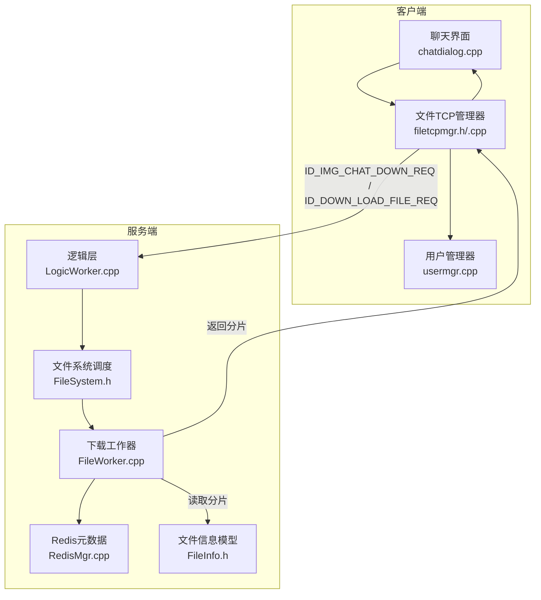
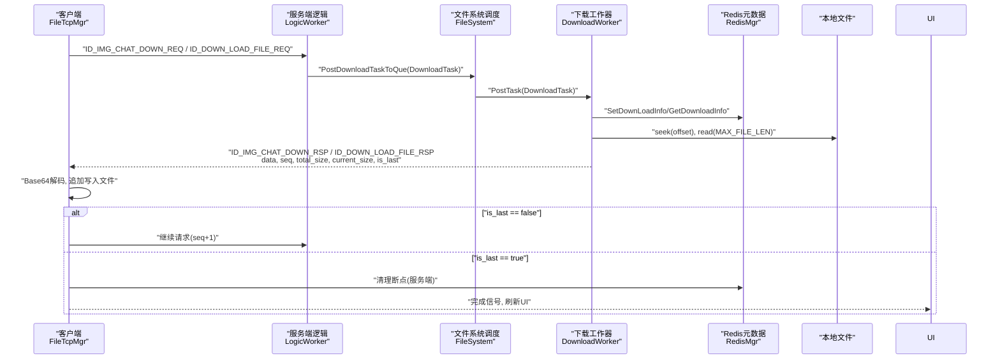
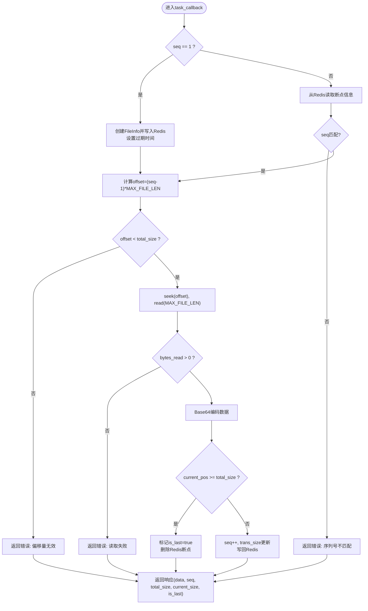
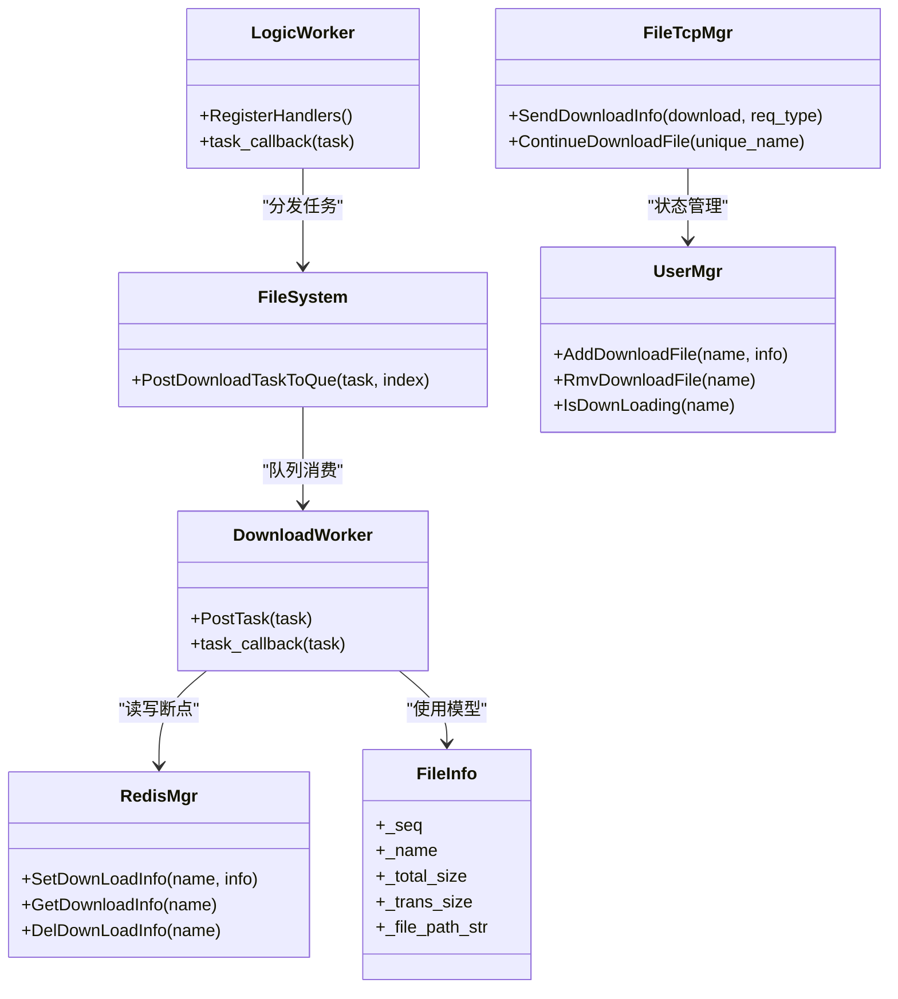

# 文件下载API

<cite>
**本文引用的文件**   
- [FileWorker.h](file://server/ResourceServer/include/FileWorker.h)
- [FileSystem.h](file://server/ResourceServer/include/FileSystem.h)
- [FileInfo.h](file://server/ResourceServer/include/FileInfo.h)
- [const.h](file://server/ResourceServer/include/const.h)
- [LogicWorker.cpp](file://server/ResourceServer/src/LogicWorker.cpp)
- [FileWorker.cpp](file://server/ResourceServer/src/FileWorker.cpp)
- [RedisMgr.cpp](file://server/ResourceServer/src/RedisMgr.cpp)
- [global.h](file://client/llfcchat/include/global.h)
- [filetcpmgr.h](file://client/llfcchat/include/filetcpmgr.h)
- [filetcpmgr.cpp](file://client/llfcchat/src/filetcpmgr.cpp)
- [usermgr.cpp](file://client/llfcchat/src/usermgr.cpp)
- [chatdialog.cpp](file://client/llfcchat/src/chatdialog.cpp)
- [message.proto](file://server/proto/resource/message.proto)
</cite>

## 目录
1. [简介](#简介)
2. [项目结构](#项目结构)
3. [核心组件](#核心组件)
4. [架构总览](#架构总览)
5. [详细组件分析](#详细组件分析)
6. [依赖关系分析](#依赖关系分析)
7. [性能考虑](#性能考虑)
8. [故障排查指南](#故障排查指南)
9. [结论](#结论)
10. [附录](#附录)

## 简介
本文件为LLFCChat项目的“文件下载API”提供全面文档，聚焦于服务端资源服务器（ResourceServer）与客户端（Qt/C++）之间的分片流式下载、断点续传、暂停恢复、进度更新与错误恢复等能力。文档涵盖：
- 下载请求/响应消息字段说明（DownloadFileReq/DownloadFileRsp语义化描述）
- 断点续传机制（断点记录、分片校验、增量写入）
- 完整下载流程示例（查询、分片获取、合并完成）
- 下载状态管理（进度、错误、清理）
- 性能调优建议（缓冲区、并发、缓存策略）

## 项目结构
- 服务端（ResourceServer）
  - 协议与常量：const.h、message.proto
  - 逻辑路由：LogicWorker.cpp
  - 文件系统与下载工作器：FileWorker.h/.cpp、FileSystem.h
  - 持久化元数据：RedisMgr.cpp、FileInfo.h
- 客户端（llfcchat）
  - 全局常量与数据结构：global.h
  - TCP传输管理器：filetcpmgr.h/.cpp
  - 用户管理与下载状态：usermgr.cpp
  - UI触发入口：chatdialog.cpp

**图表来源** 
- [LogicWorker.cpp:738-751](file://server/ResourceServer/src/LogicWorker.cpp#L738-L751)
- [FileWorker.cpp:528-589](file://server/ResourceServer/src/FileWorker.cpp#L528-L589)
- [FileSystem.h:12-18](file://server/ResourceServer/include/FileSystem.h#L12-L18)
- [FileWorker.h:43-56](file://server/ResourceServer/include/FileWorker.h#L43-L56)
- [RedisMgr.cpp:514-531](file://server/ResourceServer/src/RedisMgr.cpp#L514-L531)
- [global.h:284-290](file://client/llfcchat/include/global.h#L284-L290)
- [filetcpmgr.h:35-38](file://client/llfcchat/include/filetcpmgr.h#L35-L38)

**章节来源**
- [const.h:82-95](file://server/ResourceServer/include/const.h#L82-L95)
- [message.proto:138-165](file://server/proto/resource/message.proto#L138-L165)
- [global.h:22-24](file://client/llfcchat/include/global.h#L22-L24)

## 核心组件
- 下载任务与回调
  - DownloadTask：封装会话、用户ID、文件名、分片序号、文件路径与回调函数，用于异步读取并回传分片数据。
- 下载工作器
  - DownloadWorker：线程内队列消费任务，按seq定位偏移量，读取固定大小分片，Base64编码后返回；维护Redis中的断点信息。
- 文件系统调度
  - FileSystem：单例，持有多个FileWorker与DownloadWorker实例，按哈希分发任务，避免热点竞争。
- 元数据持久化
  - FileInfo：包含序列号、文件名、总大小、已传输大小、文件路径字符串。
  - RedisMgr：以JSON序列化存储上传/下载的断点信息，设置过期时间，支持删除。
- 客户端侧
  - DownloadInfo：客户端本地下载状态（名称、总大小、当前大小、序列号、本地路径）。
  - FileTcpMgr：负责发送下载请求、接收分片、解码写入、推进序列号、处理完成与继续下载。
  - UserMgr：维护下载任务集合与状态查询。

**章节来源**
- [FileWorker.h:43-56](file://server/ResourceServer/include/FileWorker.h#L43-L56)
- [FileWorker.cpp:528-589](file://server/ResourceServer/src/FileWorker.cpp#L528-L589)
- [FileSystem.h:12-18](file://server/ResourceServer/include/FileSystem.h#L12-L18)
- [FileInfo.h:4-15](file://server/ResourceServer/include/FileInfo.h#L4-L15)
- [RedisMgr.cpp:514-531](file://server/ResourceServer/src/RedisMgr.cpp#L514-L531)
- [global.h:284-290](file://client/llfcchat/include/global.h#L284-L290)
- [filetcpmgr.h:35-38](file://client/llfcchat/include/filetcpmgr.h#L35-L38)

## 架构总览
下载流程采用“请求-分片-续传”的流水线模式：
- 客户端发起下载请求（携带name、seq、token、uid等）
- 服务端逻辑层校验并投递到下载队列
- 下载工作器根据seq计算偏移量，从磁盘读取分片，Base64编码后返回
- 客户端解码写入本地文件，更新进度，若未结束则继续请求下一分片
- 最后一个分片完成后清理Redis断点信息，通知UI刷新

**图表来源** 
- [LogicWorker.cpp:738-751](file://server/ResourceServer/src/LogicWorker.cpp#L738-L751)
- [FileWorker.cpp:528-589](file://server/ResourceServer/src/FileWorker.cpp#L528-L589)
- [RedisMgr.cpp:514-531](file://server/ResourceServer/src/RedisMgr.cpp#L514-L531)
- [filetcpmgr.cpp:695-729](file://client/llfcchat/src/filetcpmgr.cpp#L695-L729)

## 详细组件分析

### 下载请求与响应消息（语义化定义）
- 下载请求（客户端→服务端）
  - name：文件唯一标识（含扩展名）
  - seq：分片序号（从1开始）
  - trans_size：当前已传输字节数（用于断点续传对齐）
  - total_size：文件总大小（可选，便于客户端预估）
  - token：鉴权令牌
  - uid：客户端用户ID
  - client_path：客户端本地保存路径（通用下载接口使用）
  - sender_id/receiver_id/message_id/thread_id：聊天场景关联信息（图片下载接口使用）
- 下载响应（服务端→客户端）
  - error：错误码（成功或失败原因）
  - data：Base64编码的分片数据
  - seq：本次分片序号
  - total_size：文件总大小
  - current_size：当前累计已下载字节数
  - is_last：是否最后一个分片

注意：项目中存在两套下载通道：
- 通用文件下载：ID_DOWN_LOAD_FILE_REQ / ID_DOWN_LOAD_FILE_RSP
- 聊天图片下载：ID_IMG_CHAT_DOWN_REQ / ID_IMG_CHAT_DOWN_RSP

**章节来源**
- [global.h:72-88](file://client/llfcchat/include/global.h#L72-L88)
- [const.h:82-95](file://server/ResourceServer/include/const.h#L82-L95)
- [filetcpmgr.cpp:695-729](file://client/llfcchat/src/filetcpmgr.cpp#L695-L729)
- [filetcpmgr.cpp:399-433](file://client/llfcchat/src/filetcpmgr.cpp#L399-L433)

### 断点续传机制
- 断点记录
  - 首次下载（seq==1）：服务端计算文件大小，初始化FileInfo并写入Redis（file_download_ + name），设置过期时间。
  - 后续下载：从Redis读取历史断点，校验seq一致性，确保分片顺序正确。
- 分片验证
  - 校验offset = (seq-1)*MAX_FILE_LEN是否小于total_size，防止越界。
  - 校验seq与Redis中记录的seq一致，避免乱序或重复。
- 增量下载
  - 每次读取MAX_FILE_LEN字节，Base64编码后返回；客户端解码并追加写入本地文件。
  - 最后一个分片完成后，服务端删除Redis断点信息，客户端移除本地下载状态并刷新UI。

**图表来源** 
- [FileWorker.cpp:528-589](file://server/ResourceServer/src/FileWorker.cpp#L528-L589)
- [RedisMgr.cpp:514-531](file://server/ResourceServer/src/RedisMgr.cpp#L514-L531)

**章节来源**
- [FileWorker.cpp:528-589](file://server/ResourceServer/src/FileWorker.cpp#L528-L589)
- [RedisMgr.cpp:514-531](file://server/ResourceServer/src/RedisMgr.cpp#L514-L531)

### 下载流程示例（代码级路径）
- 客户端发起下载
  - chatdialog.cpp：判断是否正在下载，构造DownloadInfo并调用FileTcpMgr::SendDownloadInfo
  - filetcpmgr.cpp：组织JSON请求，发送ID_DOWN_LOAD_FILE_REQ或ID_IMG_CHAT_DOWN_REQ
- 服务端处理
  - LogicWorker.cpp：解析请求，构造DownloadTask，投递到FileSystem队列
  - FileWorker.cpp：DownloadWorker读取分片，Base64编码，返回响应
- 客户端接收与合并
  - filetcpmgr.cpp：解析响应，Base64解码，按seq决定覆盖/追加写入，更新进度
  - 若is_last=false，继续请求下一分片；否则清理状态并刷新UI

**章节来源**
- [chatdialog.cpp:1189-1207](file://client/llfcchat/src/chatdialog.cpp#L1189-L1207)
- [filetcpmgr.cpp:695-729](file://client/llfcchat/src/filetcpmgr.cpp#L695-L729)
- [LogicWorker.cpp:738-751](file://server/ResourceServer/src/LogicWorker.cpp#L738-L751)
- [FileWorker.cpp:528-589](file://server/ResourceServer/src/FileWorker.cpp#L528-L589)

### 下载状态管理
- 客户端状态
  - UserMgr：维护_name_to_download_info映射，提供IsDownLoading/Add/Rmv等方法
  - global.h：DownloadInfo结构体包含_name、_total_size、_current_size、_seq、_client_path
- 服务端状态
  - RedisMgr：SetDownLoadInfo/DelDownLoadInfo/GetDownloadInfo，键名为file_download_ + name，带过期时间
- 暂停与恢复
  - 客户端UserMgr支持PauseTransFileByName/ResumeTransFileByName
  - FileTcpMgr暴露ContinueDownloadFile接口，触发继续下载逻辑

**章节来源**
- [usermgr.cpp:393-423](file://client/llfcchat/src/usermgr.cpp#L393-L423)
- [global.h:284-290](file://client/llfcchat/include/global.h#L284-L290)
- [RedisMgr.cpp:514-531](file://server/ResourceServer/src/RedisMgr.cpp#L514-L531)

## 依赖关系分析
- 模块耦合
  - LogicWorker依赖FileSystem进行任务分发
  - FileSystem依赖多个DownloadWorker实例
  - DownloadWorker依赖RedisMgr进行断点持久化
  - 客户端FileTcpMgr依赖UserMgr管理下载状态
- 外部依赖
  - Redis：存储断点信息，设置过期时间
  - 文件系统：按偏移量读取分片
- 潜在循环依赖
  - 无直接循环依赖，通过回调与队列解耦

**图表来源** 
- [FileWorker.h:43-56](file://server/ResourceServer/include/FileWorker.h#L43-L56)
- [FileSystem.h:12-18](file://server/ResourceServer/include/FileSystem.h#L12-L18)
- [RedisMgr.cpp:514-531](file://server/ResourceServer/src/RedisMgr.cpp#L514-L531)
- [global.h:284-290](file://client/llfcchat/include/global.h#L284-L290)
- [filetcpmgr.h:35-38](file://client/llfcchat/include/filetcpmgr.h#L35-L38)

**章节来源**
- [FileWorker.h:43-56](file://server/ResourceServer/include/FileWorker.h#L43-L56)
- [FileSystem.h:12-18](file://server/ResourceServer/include/FileSystem.h#L12-L18)
- [RedisMgr.cpp:514-531](file://server/ResourceServer/src/RedisMgr.cpp#L514-L531)

## 性能考虑
- 缓冲区大小
  - MAX_FILE_LEN=1024*32（32KB）作为分片大小，平衡内存占用与网络开销
  - 可根据网络带宽与磁盘IO调整，大文件可增大至64KB~128KB
- 并发控制
  - 服务端使用多DownloadWorker实例，按文件名哈希分发，避免热点锁竞争
  - 客户端可通过限制同时下载的文件数量与每个文件的分片并发度（当前为串行分片）
- 缓存策略
  - Redis断点信息设置过期时间（如3600秒），避免长期占用内存
  - 客户端可在内存中缓存最近下载的元数据，减少重复请求
- I/O优化
  - 服务端使用二进制流读取，避免频繁小对象分配
  - 客户端按seq追加写入，减少随机I/O
- 网络优化
  - Base64编码带来约33%额外开销，可考虑二进制传输或压缩（需双方协商）
  - 拥塞窗口控制（MAX_CWND_SIZE=5）可用于限流，避免突发流量

[本节为通用指导，无需特定文件引用]

## 故障排查指南
- 常见错误码
  - FileNotExists：文件不存在
  - FileReadPermissionFailed：无法打开文件
  - RedisReadErr：Redis读取失败（可能过期）
  - FileSeqInvalid：序列号不匹配
  - FileOffsetInvalid：偏移量超出文件大小
  - FileReadFailed：读取失败
- 排查步骤
  - 检查Redis中是否存在file_download_ + name键值
  - 确认seq与Redis中记录的seq一致
  - 验证offset < total_size
  - 检查文件权限与路径是否正确
  - 查看客户端日志中的base64解码与写入结果
- 恢复策略
  - 暂停后恢复：重新发送seq+1的请求
  - 断点丢失：客户端重置seq=1，从头下载
  - 网络中断：客户端重试机制（可扩展重传队列）

**章节来源**
- [FileWorker.cpp:528-589](file://server/ResourceServer/src/FileWorker.cpp#L528-L589)
- [RedisMgr.cpp:514-531](file://server/ResourceServer/src/RedisMgr.cpp#L514-L531)
- [filetcpmgr.cpp:695-729](file://client/llfcchat/src/filetcpmgr.cpp#L695-L729)

## 结论
LLFCChat的文件下载API实现了稳定可靠的分片流式下载与断点续传能力，通过Redis持久化断点信息、DownloadWorker异步处理、客户端状态管理，形成完整的下载闭环。建议在大规模部署时进一步优化分片大小、并发度与网络传输格式，以提升吞吐与降低延迟。

[本节为总结性内容，无需特定文件引用]

## 附录
- 相关协议与常量
  - 下载消息ID：ID_DOWN_LOAD_FILE_REQ/RSP、ID_IMG_CHAT_DOWN_REQ/RSP
  - 最大分片大小：MAX_FILE_LEN=1024*32
  - 聊天通知消息：NotifyChatImgReq/Rsp（用于通知客户端下载图片）
- 关键数据结构
  - DownloadTask：服务端下载任务
  - FileInfo：文件信息模型
  - DownloadInfo：客户端下载状态
  - MsgInfo：消息传输状态（含进度、序列号、类型等）

**章节来源**
- [const.h:82-95](file://server/ResourceServer/include/const.h#L82-L95)
- [global.h:22-24](file://client/llfcchat/include/global.h#L22-L24)
- [message.proto:138-165](file://server/proto/resource/message.proto#L138-L165)
- [FileWorker.h:43-56](file://server/ResourceServer/include/FileWorker.h#L43-L56)
- [FileInfo.h:4-15](file://server/ResourceServer/include/FileInfo.h#L4-L15)
- [global.h:284-290](file://client/llfcchat/include/global.h#L284-L290)