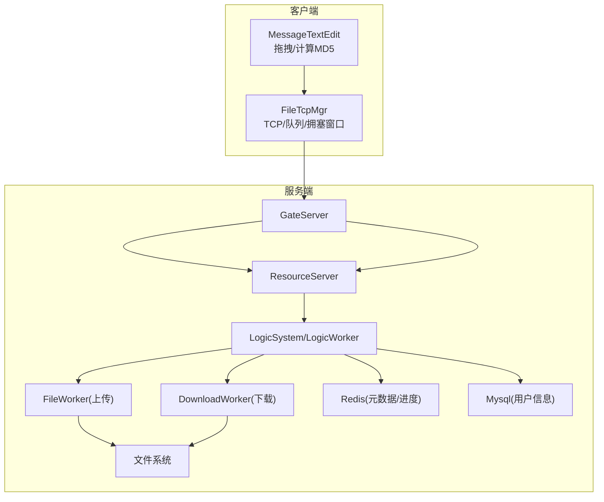
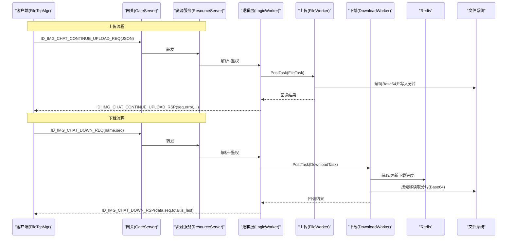
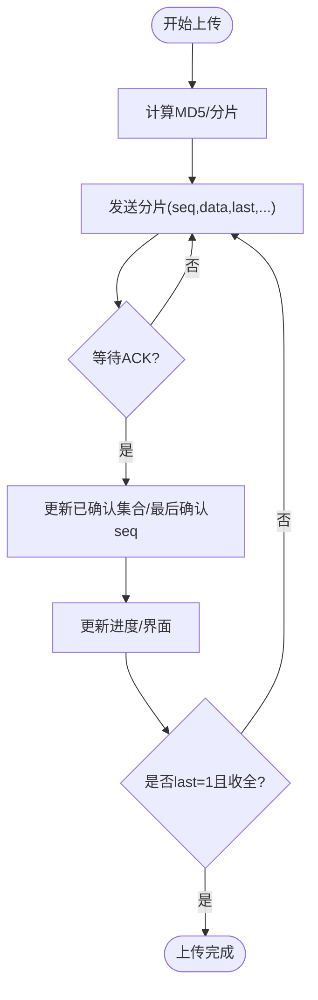
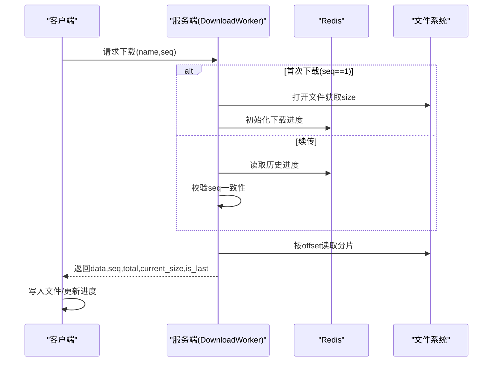
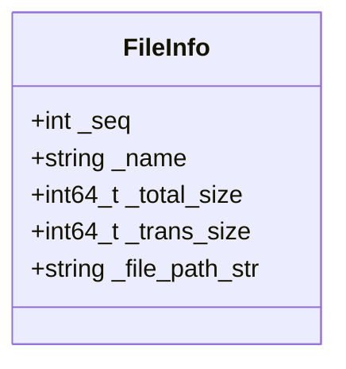
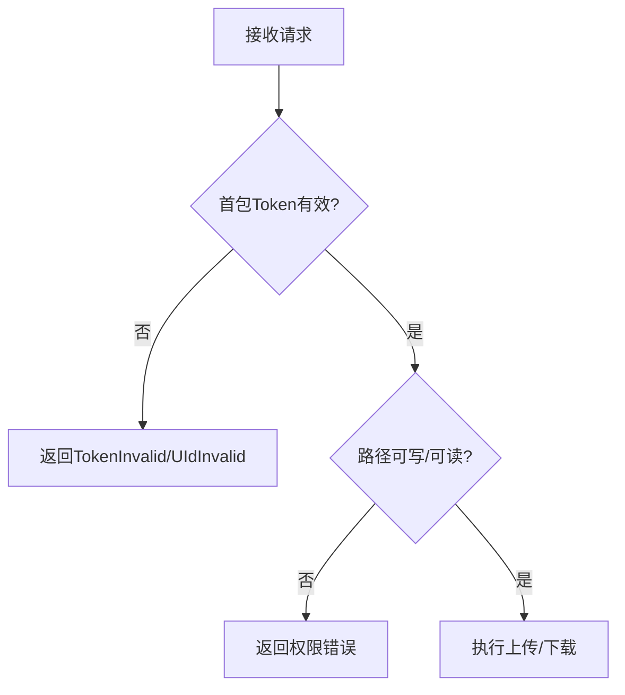
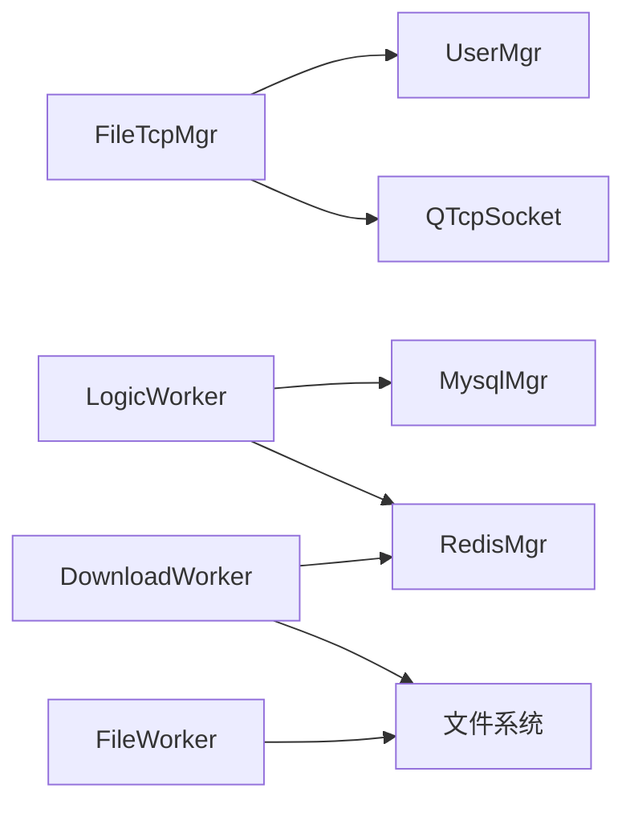

# 文件传输API

<cite>
**本文引用的文件**   
- [filetcpmgr.h](file://client/llfcchat/include/filetcpmgr.h)
- [filetcpmgr.cpp](file://client/llfcchat/src/filetcpmgr.cpp)
- [FileWorker.h](file://server/ResourceServer/include/FileWorker.h)
- [FileWorker.cpp](file://server/ResourceServer/src/FileWorker.cpp)
- [FileInfo.h](file://server/ResourceServer/include/FileInfo.h)
- [const.h](file://server/ResourceServer/include/const.h)
- [LogicSystem.cpp](file://server/ResourceServer/src/LogicSystem.cpp)
- [LogicWorker.cpp](file://server/ResourceServer/src/LogicWorker.cpp)
- [MessageTextEdit.cpp](file://client/llfcchat/src/MessageTextEdit.cpp)
- [day31-文件传输.md](file://开发文档/day31-文件传输.md)
- [day38-断点续传.md](file://开发文档/day38-断点续传.md)
- [day40-聊天图片资源续传和进度显示.md](file://开发文档/day40-聊天图片资源续传和进度显示.md)
- [day41-通知客户端异步下载聊天图片.md](file://开发文档/day41-通知客户端异步下载聊天图片.md)
</cite>

## 目录
1. [简介](#简介)
2. [项目结构](#项目结构)
3. [核心组件](#核心组件)
4. [架构总览](#架构总览)
5. [详细组件分析](#详细组件分析)
6. [依赖关系分析](#依赖关系分析)
7. [性能与并发控制](#性能与并发控制)
8. [错误处理与故障排查](#错误处理与故障排查)
9. [监控与运维指标](#监控与运维指标)
10. [结论](#结论)
11. [附录：API调用示例](#附录api调用示例)

## 简介
本文件为LLFCChat项目的“文件传输API”全面文档，覆盖上传、下载、分片、断点续传、并发控制、进度回调、元数据管理（含MD5校验）、以及安全机制（权限验证、访问控制）等。同时给出完整的API调用流程示例、错误处理策略、性能优化建议与监控指标收集方法，帮助开发者快速集成与运维。

## 项目结构
- 客户端（Qt/C++）
  - 文件传输管理器：FileTcpMgr（负责TCP连接、消息收发、拥塞窗口控制、进度信号）
  - UI层：MessageTextEdit（拖拽文件、计算MD5、插入消息列表）
- 服务端（C++/Boost.Asio + Redis/Mysql）
  - 逻辑层：LogicSystem/LogicWorker（路由请求、鉴权、任务分发）
  - 文件层：FileWorker（上传写入）、DownloadWorker（下载读取）
  - 元数据：FileInfo（序列号、文件名、总大小、已传输大小、路径）
  - 常量与错误码：const.h（消息ID、错误码、分片大小等）

**图表来源** 
- [filetcpmgr.h:1-85](file://client/llfcchat/include/filetcpmgr.h#L1-L85)
- [FileWorker.h:1-90](file://server/ResourceServer/include/FileWorker.h#L1-L90)
- [const.h:72-116](file://server/ResourceServer/include/const.h#L72-L116)

**章节来源**
- [filetcpmgr.h:1-85](file://client/llfcchat/include/filetcpmgr.h#L1-L85)
- [FileWorker.h:1-90](file://server/ResourceServer/include/FileWorker.h#L1-L90)
- [const.h:72-116](file://server/ResourceServer/include/const.h#L72-L116)

## 核心组件
- FileTcpMgr（客户端）
  - 职责：建立并维护与服务端的TCP长连接；封装消息头（ID+长度）；发送队列与拥塞窗口控制；解析响应并更新进度；提供继续上传/下载的信号槽接口。
  - 关键能力：分片发送、未确认序列号集合、已确认序列号集合、最后确认序列号、cwnd拥塞窗口、进度信号。
- FileWorker / DownloadWorker（服务端）
  - 职责：接收上传分片并落盘；支持按seq顺序追加写；下载时按偏移量读取分片；使用Redis持久化下载进度以支持断点续传。
- FileInfo（服务端）
  - 职责：记录下载/上传的元数据（seq、name、total_size、trans_size、file_path_str）。
- LogicSystem/LogicWorker（服务端）
  - 职责：解析请求、鉴权（Token校验）、将任务投递到对应Worker；返回统一JSON响应。
- MessageTextEdit（客户端UI）
  - 职责：拖拽文件、限制大小、计算MD5、生成唯一名、插入消息列表。

**章节来源**
- [filetcpmgr.h:26-85](file://client/llfcchat/include/filetcpmgr.h#L26-L85)
- [FileWorker.h:14-90](file://server/ResourceServer/include/FileWorker.h#L14-L90)
- [FileInfo.h:1-26](file://server/ResourceServer/include/FileInfo.h#L1-L26)
- [LogicSystem.cpp:21-45](file://server/ResourceServer/src/LogicSystem.cpp#L21-L45)
- [MessageTextEdit.cpp:129-192](file://client/llfcchat/src/MessageTextEdit.cpp#L129-L192)

## 架构总览
整体采用“客户端长连接 + 服务端多Worker线程池”的架构。上传走FileWorker，下载走DownloadWorker，两者均通过Redis进行状态同步，实现断点续传。

**图表来源** 
- [LogicWorker.cpp:532-570](file://server/ResourceServer/src/LogicWorker.cpp#L532-L570)
- [FileWorker.cpp:1-200](file://server/ResourceServer/src/FileWorker.cpp#L1-L200)
- [day41-通知客户端异步下载聊天图片.md:571-709](file://开发文档/day41-通知客户端异步下载聊天图片.md#L571-L709)

## 详细组件分析

### 上传接口（分片上传、断点续传、并发控制、进度回调）
- 协议字段（JSON）
  - md5：文件哈希（用于去重与校验）
  - name：文件名
  - seq：分片序号（从1开始）
  - trans_size：当前累计已传输字节数
  - total_size：文件总大小
  - last：是否最后一个分片
  - data：分片内容（Base64编码）
  - uid/sender/receiver：用户与会话相关标识
- 客户端行为
  - 计算MD5，拆分分片，按seq递增发送
  - 维护未确认集合（_flighting_seqs）与已确认集合（_rsp_seqs），推进_last_confirmed_seq
  - 拥塞窗口_cwnd_size控制并发分片数量，避免拥塞
  - 收到响应后更新进度，触发sig_update_upload_progress
- 服务端行为
  - 第一个分片创建文件，后续分片追加写
  - 校验Token（首包）与参数合法性
  - 返回seq与error，供客户端推进进度

**图表来源** 
- [filetcpmgr.cpp:432-580](file://client/llfcchat/src/filetcpmgr.cpp#L432-L580)
- [FileWorker.cpp:1-200](file://server/ResourceServer/src/FileWorker.cpp#L1-L200)
- [day38-断点续传.md:479-753](file://开发文档/day38-断点续传.md#L479-L753)

**章节来源**
- [filetcpmgr.h:26-85](file://client/llfcchat/include/filetcpmgr.h#L26-L85)
- [filetcpmgr.cpp:175-200](file://client/llfcchat/src/filetcpmgr.cpp#L175-L200)
- [FileWorker.cpp:1-200](file://server/ResourceServer/src/FileWorker.cpp#L1-L200)
- [day38-断点续传.md:479-753](file://开发文档/day38-断点续传.md#L479-L753)

### 下载接口（流式下载、暂停恢复、速度限制）
- 协议字段（JSON）
  - name：文件名
  - seq：分片序号
  - data：分片内容（Base64）
  - total_size：总大小
  - current_size：当前累计已下载字节数
  - is_last：是否最后一个分片
- 客户端行为
  - 根据seq发起下载请求
  - 接收data并写入本地文件，更新current_size
  - 支持暂停/恢复（设置状态位，触发ContinueDownloadFile）
- 服务端行为
  - 首次下载初始化FileInfo并写入Redis
  - 续传时从Redis读取历史进度，校验seq一致性
  - 按offset读取分片，Base64编码后返回

**图表来源** 
- [day41-通知客户端异步下载聊天图片.md:571-709](file://开发文档/day41-通知客户端异步下载聊天图片.md#L571-L709)
- [FileWorker.cpp:528-633](file://server/ResourceServer/src/FileWorker.cpp#L528-L633)

**章节来源**
- [day41-通知客户端异步下载聊天图片.md:571-709](file://开发文档/day41-通知客户端异步下载聊天图片.md#L571-L709)
- [FileWorker.cpp:528-633](file://server/ResourceServer/src/FileWorker.cpp#L528-L633)

### 文件元数据管理（存储、MD5校验、存储空间统计）
- 元数据结构
  - FileInfo：seq、name、total_size、trans_size、file_path_str
- MD5校验
  - 客户端在拖拽/选择文件后计算MD5，作为唯一标识与校验依据
- 存储位置
  - 服务端按配置路径组织文件目录，按用户名/会话子目录存放
- 空间统计
  - 可通过遍历目录或数据库记录进行统计（本项目中主要依赖文件系统与Redis中的下载进度）

**图表来源** 
- [FileInfo.h:1-26](file://server/ResourceServer/include/FileInfo.h#L1-L26)
- [MessageTextEdit.cpp:129-192](file://client/llfcchat/src/MessageTextEdit.cpp#L129-L192)

**章节来源**
- [FileInfo.h:1-26](file://server/ResourceServer/include/FileInfo.h#L1-L26)
- [MessageTextEdit.cpp:129-192](file://client/llfcchat/src/MessageTextEdit.cpp#L129-L192)

### 安全机制（权限验证、病毒扫描、访问控制）
- 权限验证
  - 首包校验Token（utoken_前缀），失败则拒绝
  - UID有效性校验（UidInvalid）
- 访问控制
  - 基于用户目录隔离（uid_str/name）
  - 读写权限检查（FileWritePermissionFailed/FileReadPermissionFailed）
- 病毒扫描
  - 当前代码未实现病毒扫描环节，可在FileWorker写入前接入外部扫描服务

**图表来源** 
- [LogicWorker.cpp:215-254](file://server/ResourceServer/src/LogicWorker.cpp#L215-L254)
- [const.h:5-29](file://server/ResourceServer/include/const.h#L5-L29)

**章节来源**
- [LogicWorker.cpp:215-254](file://server/ResourceServer/src/LogicWorker.cpp#L215-L254)
- [const.h:5-29](file://server/ResourceServer/include/const.h#L5-L29)

## 依赖关系分析
- 客户端依赖
  - FileTcpMgr依赖QTcpSocket、QJsonDocument、UserMgr（文件状态管理）
- 服务端依赖
  - LogicWorker依赖RedisMgr、MysqlMgr、ConfigMgr、base64
  - FileWorker/DownloadWorker依赖文件系统、Redis（断点续传）

**图表来源** 
- [filetcpmgr.h:26-85](file://client/llfcchat/include/filetcpmgr.h#L26-L85)
- [FileWorker.h:14-90](file://server/ResourceServer/include/FileWorker.h#L14-L90)
- [LogicSystem.cpp:21-45](file://server/ResourceServer/src/LogicSystem.cpp#L21-L45)

**章节来源**
- [filetcpmgr.h:26-85](file://client/llfcchat/include/filetcpmgr.h#L26-L85)
- [FileWorker.h:14-90](file://server/ResourceServer/include/FileWorker.h#L14-L90)
- [LogicSystem.cpp:21-45](file://server/ResourceServer/src/LogicSystem.cpp#L21-L45)

## 性能与并发控制
- 分片大小
  - MAX_FILE_LEN = 32KB（const.h定义），平衡网络与内存占用
- 拥塞窗口
  - 客户端_cwnd_size控制并发分片数量，避免拥塞丢包
- 线程模型
  - 服务端LogicWorker/FileWorker/DownloadWorker各自独立线程队列，提升吞吐
- 进度反馈
  - 每收到一个ACK即更新进度，减少UI卡顿
- 建议
  - 根据网络带宽调整_cwnd_size与MAX_FILE_LEN
  - 大文件场景启用后台下载与限速（客户端侧实现）

**章节来源**
- [const.h:114](file://server/ResourceServer/include/const.h#L114)
- [filetcpmgr.cpp:106-132](file://client/llfcchat/src/filetcpmgr.cpp#L106-L132)
- [day31-文件传输.md:1-200](file://开发文档/day31-文件传输.md#L1-L200)

## 错误处理与故障排查
- 常见错误码
  - Success、Error_Json、RPCFailed、TokenInvalid、UidInvalid、FileNotExists、FileWritePermissionFailed、FileReadPermissionFailed、FileSeqInvalid、FileOffsetInvalid、FileReadFailed、RedisReadErr等
- 典型问题
  - JSON解析失败：检查消息体格式
  - Token无效：重新登录获取新Token
  - 文件不存在：检查路径与权限
  - 序列号不匹配：检查客户端seq与Redis保存的一致性
  - 偏移量越界：校验offset与total_size
- 排查步骤
  - 查看客户端日志（连接错误、发送队列、拥塞窗口）
  - 查看服务端日志（Worker回调、Redis读写、文件IO）
  - 核对协议字段（md5、name、seq、last、data）

**章节来源**
- [const.h:5-29](file://server/ResourceServer/include/const.h#L5-L29)
- [filetcpmgr.cpp:65-93](file://client/llfcchat/src/filetcpmgr.cpp#L65-L93)
- [FileWorker.cpp:528-633](file://server/ResourceServer/src/FileWorker.cpp#L528-L633)

## 监控与运维指标
- 关键指标
  - 上传/下载成功率、平均耗时、吞吐（bytes/s）
  - 分片丢失率、重传次数
  - Redis命中率（断点续传）
  - Worker队列长度与延迟
- 采集方式
  - 客户端：统计发送/接收计数、耗时、错误码分布
  - 服务端：Worker回调耗时、Redis操作耗时、文件IO错误计数
- 告警规则
  - 错误率超过阈值（如>5%）
  - 队列积压（>1000）
  - Redis不可用

[本节为通用指导，无需源码引用]

## 结论
LLFCChat的文件传输API通过分片、断点续传、并发控制与进度回调，实现了稳定高效的上传/下载能力。服务端采用多Worker线程模型与Redis持久化，确保高吞吐与可靠性。建议在现有基础上补充病毒扫描、速率限制与更完善的监控体系，以提升安全性与可观测性。

[本节为总结，无需源码引用]

## 附录：API调用示例
- 上传初始化与分片上传
  - 客户端计算MD5，构造首个分片（seq=1, last=0/1），发送ID_IMG_CHAT_CONTINUE_UPLOAD_REQ
  - 服务端校验Token，写入分片，返回seq与error
  - 客户端收到ACK后推进_last_confirmed_seq，直到last=1且收全
- 下载初始化与分片下载
  - 客户端发送ID_IMG_CHAT_DOWN_REQ(name,seq)
  - 服务端首次下载初始化Redis，后续续传读取Redis并校验seq
  - 返回data、total_size、current_size、is_last
- 暂停与恢复
  - 客户端设置TransferState为Paused/Downloading/Uploading
  - 触发ContinueUploadFile/ContinueDownloadFile继续传输

**章节来源**
- [day38-断点续传.md:479-753](file://开发文档/day38-断点续传.md#L479-L753)
- [day41-通知客户端异步下载聊天图片.md:956-1020](file://开发文档/day41-通知客户端异步下载聊天图片.md#L956-L1020)
- [filetcpmgr.cpp:432-580](file://client/llfcchat/src/filetcpmgr.cpp#L432-L580)