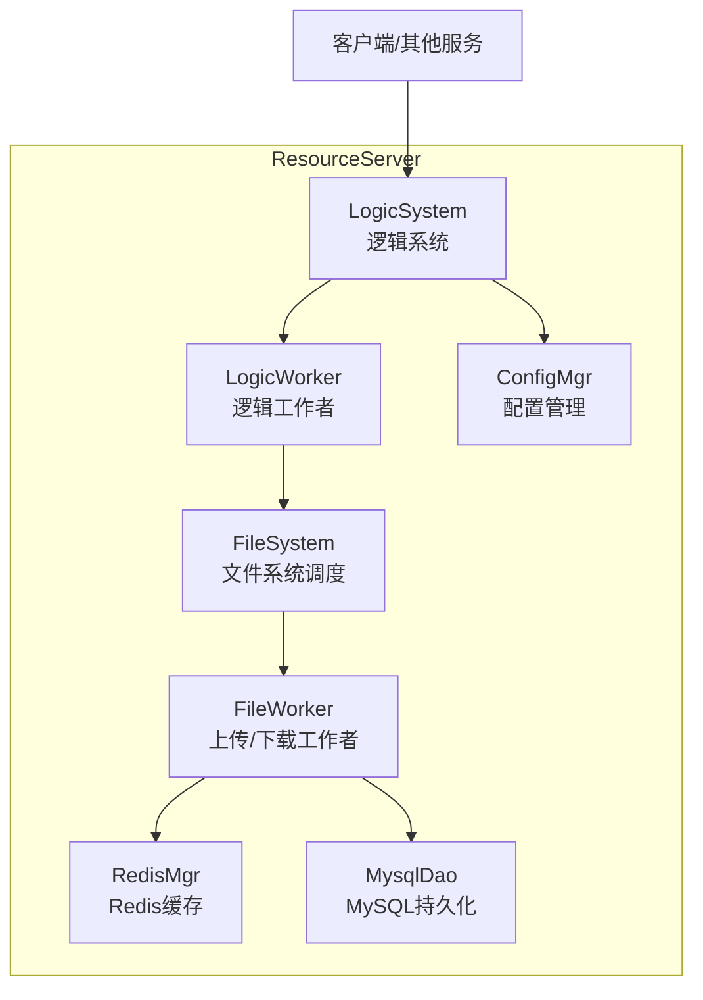
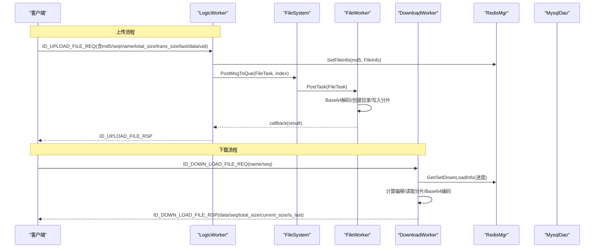
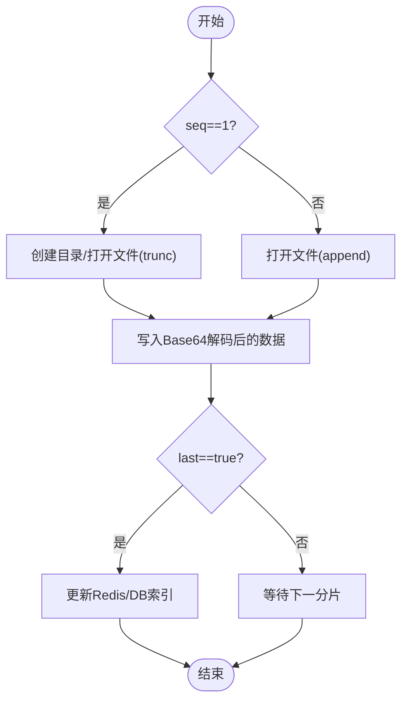
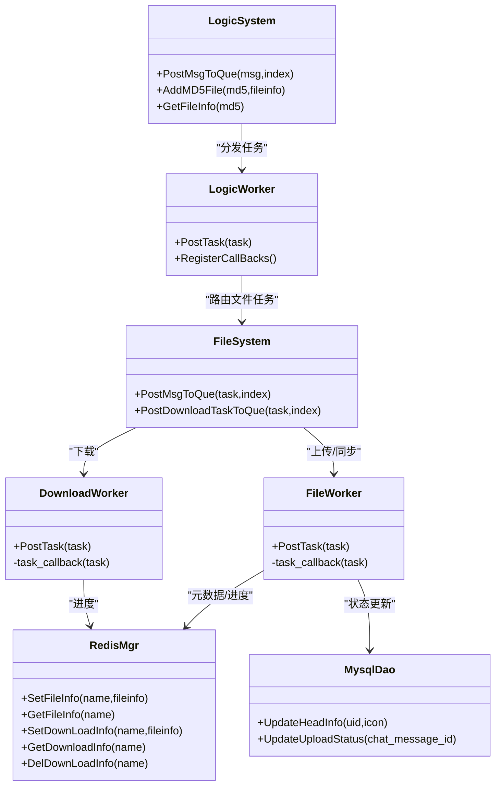

# 文件元数据API

<cite>
**本文引用的文件**   
- [FileInfo.h](file://server/ResourceServer/include/FileInfo.h)
- [FileSystem.h](file://server/ResourceServer/include/FileSystem.h)
- [FileWorker.h](file://server/ResourceServer/include/FileWorker.h)
- [LogicSystem.h](file://server/ResourceServer/include/LogicSystem.h)
- [const.h](file://server/ResourceServer/include/const.h)
- [MysqlDao.h](file://server/ResourceServer/include/MysqlDao.h)
- [RedisMgr.h](file://server/ResourceServer/include/RedisMgr.h)
- [message.proto](file://server/proto/resource/message.proto)
- [FileWorker.cpp](file://server/ResourceServer/src/FileWorker.cpp)
- [FileSystem.cpp](file://server/ResourceServer/src/FileSystem.cpp)
- [LogicSystem.cpp](file://server/ResourceServer/src/LogicSystem.cpp)
- [LogicWorker.cpp](file://server/ResourceServer/src/LogicWorker.cpp)
</cite>

## 目录
1. [简介](#简介)
2. [项目结构](#项目结构)
3. [核心组件](#核心组件)
4. [架构总览](#架构总览)
5. [详细组件分析](#详细组件分析)
6. [依赖关系分析](#依赖关系分析)
7. [性能考量](#性能考量)
8. [故障排查指南](#故障排查指南)
9. [结论](#结论)
10. [附录：API与消息定义](#附录api与消息定义)

## 简介
本文件面向LLFCChat项目的“文件元数据API”，聚焦于资源服务（ResourceServer）中的文件信息管理接口，涵盖文件上传、下载、续传、信息同步、头像与聊天图片处理等能力。文档将详细说明：
- FileInfo结构与相关消息格式（文件名、大小、类型、MD5值、存储路径等元数据字段）
- 分片存储机制、目录结构与索引维护
- 常用操作API示例（存在性检查、大小查询、删除等）
- 权限控制与安全验证（访问权限、用户隔离、Token校验）
- 监控与统计（存储使用率、文件数量统计、性能指标收集）

## 项目结构
ResourceServer模块负责文件读写、任务调度、缓存与数据库交互。关键目录与文件如下：
- include: 头文件定义（FileInfo、FileSystem、FileWorker、LogicSystem、常量与错误码、MySQL/Redis封装）
- src: 实现逻辑（工作线程、任务分发、文件IO、Redis/MySQL交互）
- proto: gRPC协议定义（状态服务、聊天服务等）

图表来源
- [FileSystem.h:1-21](file://server/ResourceServer/include/FileSystem.h#L1-L21)
- [FileWorker.h:1-90](file://server/ResourceServer/include/FileWorker.h#L1-L90)
- [LogicSystem.h:1-34](file://server/ResourceServer/include/LogicSystem.h#L1-L34)
- [RedisMgr.h:1-313](file://server/ResourceServer/include/RedisMgr.h#L1-L313)
- [MysqlDao.h:1-273](file://server/ResourceServer/include/MysqlDao.h#L1-L273)

章节来源
- [FileSystem.h:1-21](file://server/ResourceServer/include/FileSystem.h#L1-L21)
- [FileWorker.h:1-90](file://server/ResourceServer/include/FileWorker.h#L1-L90)
- [LogicSystem.h:1-34](file://server/ResourceServer/include/LogicSystem.h#L1-L34)

## 核心组件
- FileInfo：文件元数据载体，包含序列号、文件名、总大小、已传输大小、存储路径等字段。
- FileSystem：单例调度器，维护多组FileWorker与DownloadWorker，按哈希分配任务。
- FileWorker：处理上传、头像上传、聊天图片上传、文件信息同步、续传等具体业务；内部通过回调返回结果。
- DownloadWorker：处理断点续传下载，基于Redis维护下载进度，支持分片读取与Base64编码回传。
- LogicSystem/LogicWorker：逻辑层入口，解析请求、构造任务、路由到对应Worker，并维护MD5索引。
- RedisMgr/MySqlDao：缓存与持久化层，分别提供连接池、锁、计数、文件信息与下载进度存取。

章节来源
- [FileInfo.h:1-26](file://server/ResourceServer/include/FileInfo.h#L1-L26)
- [FileSystem.h:1-21](file://server/ResourceServer/include/FileSystem.h#L1-L21)
- [FileWorker.h:1-90](file://server/ResourceServer/include/FileWorker.h#L1-L90)
- [LogicSystem.h:1-34](file://server/ResourceServer/include/LogicSystem.h#L1-L34)
- [RedisMgr.h:1-313](file://server/ResourceServer/include/RedisMgr.h#L1-L313)
- [MysqlDao.h:1-273](file://server/ResourceServer/include/MysqlDao.h#L1-L273)

## 架构总览
整体采用“逻辑层 + 工作线程池”的异步模型：
- 逻辑层（LogicSystem/LogicWorker）负责协议解析、参数校验、任务编排与响应组装。
- 文件层（FileSystem/FileWorker/DownloadWorker）负责实际IO、分片处理、进度跟踪与回调通知。
- 数据层（RedisMgr/MySqlDao）负责缓存、分布式锁、计数与持久化。

图表来源
- [LogicWorker.cpp:78-162](file://server/ResourceServer/src/LogicWorker.cpp#L78-L162)
- [FileWorker.cpp:49-112](file://server/ResourceServer/src/FileWorker.cpp#L49-L112)
- [FileWorker.cpp:528-662](file://server/ResourceServer/src/FileWorker.cpp#L528-L662)
- [RedisMgr.h:269-313](file://server/ResourceServer/include/RedisMgr.h#L269-L313)
- [FileSystem.cpp:9-17](file://server/ResourceServer/src/FileSystem.cpp#L9-L17)

## 详细组件分析

### FileInfo与消息格式
- FileInfo字段说明：
  - _seq：当前分片序号
  - _name：文件名
  - _total_size：文件总大小
  - _trans_size：已传输字节数
  - _file_path_str：本地存储路径
- 上传/下载相关消息关键字段（JSON）：
  - md5：文件唯一标识
  - seq：分片序号
  - name：文件名
  - total_size：总大小
  - trans_size：已传输大小
  - last：是否最后一个分片
  - data：Base64编码的分片数据
  - uid：用户ID（用于目录隔离）
  - is_last：下载时指示是否为最后分片
  - current_size：当前累计已读字节

章节来源
- [FileInfo.h:1-26](file://server/ResourceServer/include/FileInfo.h#L1-L26)
- [const.h:72-95](file://server/ResourceServer/include/const.h#L72-L95)
- [LogicWorker.cpp:78-162](file://server/ResourceServer/src/LogicWorker.cpp#L78-L162)
- [FileWorker.cpp:528-662](file://server/ResourceServer/src/FileWorker.cpp#L528-L662)

### 文件存储管理机制
- 分片存储：
  - 上传端按seq分片发送，服务端在首个包时trunc创建文件，后续包append追加。
  - 下载端按MAX_FILE_LEN分片读取，计算offset=(seq-1)*MAX_FILE_LEN，读取后Base64编码返回。
- 目录结构：
  - 以uid为根目录，按name组织文件，确保用户隔离。
  - 自动创建父目录，失败返回相应错误码。
- 索引维护：
  - 首次上传时构建FileInfo并写入Redis（key=md5），后续更新seq与trans_size。
  - 下载进度同样以Redis维护，完成时清理。
  - 内存中LogicSystem维护md5->FileInfo映射，供同步查询。

图表来源
- [FileWorker.cpp:49-112](file://server/ResourceServer/src/FileWorker.cpp#L49-L112)
- [FileWorker.cpp:528-662](file://server/ResourceServer/src/FileWorker.cpp#L528-L662)
- [LogicWorker.cpp:120-154](file://server/ResourceServer/src/LogicWorker.cpp#L120-L154)

章节来源
- [FileWorker.cpp:49-112](file://server/ResourceServer/src/FileWorker.cpp#L49-L112)
- [FileWorker.cpp:528-662](file://server/ResourceServer/src/FileWorker.cpp#L528-L662)
- [LogicWorker.cpp:120-154](file://server/ResourceServer/src/LogicWorker.cpp#L120-L154)

### 常用API示例（代码级路径）
- 文件存在性检查：
  - 参考下载流程中对文件存在性的判断与错误码返回。
  - 路径：[FileWorker.cpp:540-545](file://server/ResourceServer/src/FileWorker.cpp#L540-L545)
- 文件大小查询：
  - 首包下载时获取文件大小并写入Redis。
  - 路径：[FileWorker.cpp:557-574](file://server/ResourceServer/src/FileWorker.cpp#L557-L574)
- 删除操作：
  - 可通过Redis键删除下载进度或文件信息；文件本身删除需结合文件系统API（仓库未直接暴露删除接口）。
  - 路径：[RedisMgr.h:286-307](file://server/ResourceServer/include/RedisMgr.h#L286-L307)

章节来源
- [FileWorker.cpp:540-574](file://server/ResourceServer/src/FileWorker.cpp#L540-L574)
- [RedisMgr.h:286-307](file://server/ResourceServer/include/RedisMgr.h#L286-L307)

### 权限控制与安全验证
- 用户隔离：
  - 上传路径包含uid，确保不同用户文件隔离。
  - 路径：[LogicWorker.cpp:90-95](file://server/ResourceServer/src/LogicWorker.cpp#L90-L95)
- Token校验：
  - gRPC Login接口用于鉴权，返回token；后续请求应携带token进行校验（仓库中Login定义见proto）。
  - 路径：[message.proto:30-39](file://server/proto/resource/message.proto#L30-L39)
- 访问权限：
  - 文件读写失败时返回对应错误码（如写权限不足、读权限不足）。
  - 路径：[const.h:5-29](file://server/ResourceServer/include/const.h#L5-L29)

章节来源
- [LogicWorker.cpp:90-95](file://server/ResourceServer/src/LogicWorker.cpp#L90-L95)
- [message.proto:30-39](file://server/proto/resource/message.proto#L30-L39)
- [const.h:5-29](file://server/ResourceServer/include/const.h#L5-L29)

### 监控与统计
- 存储使用率：
  - 可基于Redis键空间扫描或文件系统遍历统计（仓库未直接实现）。
- 文件数量统计：
  - 可通过Redis计数器（如IncreaseCount/DecreaseCount）维护服务节点的文件计数。
  - 路径：[RedisMgr.h:299-302](file://server/ResourceServer/include/RedisMgr.h#L299-L302)
- 性能指标收集：
  - Worker队列长度、任务耗时、错误码分布等可在日志中采集（仓库未内置指标导出）。

章节来源
- [RedisMgr.h:299-302](file://server/ResourceServer/include/RedisMgr.h#L299-L302)

## 依赖关系分析
- LogicSystem依赖LogicWorker进行任务分发，并维护md5->FileInfo内存索引。
- LogicWorker依赖FileSystem进行任务路由，依赖RedisMgr进行元数据与进度缓存，依赖MysqlDao进行持久化（如头像更新、聊天图片状态）。
- FileWorker/DownloadWorker依赖RedisMgr进行进度与元数据存取，依赖文件系统库进行IO。

图表来源
- [LogicSystem.h:1-34](file://server/ResourceServer/include/LogicSystem.h#L1-L34)
- [LogicWorker.h:1-38](file://server/ResourceServer/include/LogicWorker.h#L1-L38)
- [FileSystem.h:1-21](file://server/ResourceServer/include/FileSystem.h#L1-L21)
- [FileWorker.h:1-90](file://server/ResourceServer/include/FileWorker.h#L1-L90)
- [RedisMgr.h:269-313](file://server/ResourceServer/include/RedisMgr.h#L269-L313)
- [MysqlDao.h:237-273](file://server/ResourceServer/include/MysqlDao.h#L237-L273)

章节来源
- [LogicSystem.h:1-34](file://server/ResourceServer/include/LogicSystem.h#L1-L34)
- [FileSystem.h:1-21](file://server/ResourceServer/include/FileSystem.h#L1-L21)
- [FileWorker.h:1-90](file://server/ResourceServer/include/FileWorker.h#L1-L90)
- [RedisMgr.h:269-313](file://server/ResourceServer/include/RedisMgr.h#L269-L313)
- [MysqlDao.h:237-273](file://server/ResourceServer/include/MysqlDao.h#L237-L273)

## 性能考量
- 分片大小：MAX_FILE_LEN=32KB，平衡网络与内存占用。
- 并发模型：多Worker线程池（上传/下载各4个），降低阻塞。
- 缓存策略：Redis维护元数据与下载进度，减少磁盘IO与重复计算。
- 错误重试：下载断点续传避免全量重传，提升弱网稳定性。
- 建议优化：
  - 增加批量写入与合并小文件策略
  - 引入对象存储（如S3/OSS）替代本地文件系统
  - 完善指标采集（Prometheus/Grafana）

## 故障排查指南
- 常见错误码：
  - FileNotExists：文件不存在
  - FileWritePermissionFailed：写权限不足
  - FileReadPermissionFailed：读权限不足
  - FileSeqInvalid：序列号不匹配
  - FileOffsetInvalid：偏移量无效
  - FileReadFailed：读取失败
  - RedisReadErr：Redis读取失败
- 排查步骤：
  - 检查Redis键是否存在（如md5、下载进度）
  - 确认文件路径与权限（uid目录是否存在）
  - 核对seq与trans_size一致性
  - 查看日志输出（目录创建、文件写入、Base64编解码）

章节来源
- [const.h:5-29](file://server/ResourceServer/include/const.h#L5-L29)
- [FileWorker.cpp:540-574](file://server/ResourceServer/src/FileWorker.cpp#L540-L574)

## 结论
LLFCChat的资源服务通过清晰的层次划分与异步工作线程模型，实现了稳定高效的文件元数据管理与分片传输。借助Redis与MySQL的协同，系统在断点续传、用户隔离与状态同步方面具备良好扩展性。建议在生产环境中补充指标监控与对象存储集成，进一步提升可靠性与吞吐。

## 附录：API与消息定义
- 上传文件请求（ID_UPLOAD_FILE_REQ）：
  - 字段：md5、seq、name、total_size、trans_size、last、data、uid
  - 行为：首包创建元数据并落盘，后续包追加；完成后回调响应
  - 路径：[LogicWorker.cpp:78-162](file://server/ResourceServer/src/LogicWorker.cpp#L78-L162)
- 下载文件请求（ID_DOWN_LOAD_FILE_REQ）：
  - 字段：name、seq
  - 行为：计算偏移、读取分片、Base64编码返回；最后分片清理进度
  - 路径：[FileWorker.cpp:528-662](file://server/ResourceServer/src/FileWorker.cpp#L528-L662)
- 头像上传（ID_UPLOAD_HEAD_ICON_REQ）：
  - 行为：保存头像并更新用户信息至Redis
  - 路径：[FileWorker.cpp:115-196](file://server/ResourceServer/src/FileWorker.cpp#L115-L196)
- 聊天图片上传（ID_IMG_CHAT_UPLOAD_REQ / ID_IMG_CHAT_CONTINUE_UPLOAD_REQ）：
  - 行为：保存图片、更新数据库状态、通过gRPC通知接收方
  - 路径：[FileWorker.cpp:199-283](file://server/ResourceServer/src/FileWorker.cpp#L199-L283)
- 文件信息同步（ID_SYNC_FILE_REQ / ID_FILE_INFO_SYNC_REQ）：
  - 行为：查询内存/Redis中的FileInfo并返回
  - 路径：[LogicWorker.cpp:166-194](file://server/ResourceServer/src/LogicWorker.cpp#L166-L194)

章节来源
- [LogicWorker.cpp:78-194](file://server/ResourceServer/src/LogicWorker.cpp#L78-L194)
- [FileWorker.cpp:115-283](file://server/ResourceServer/src/FileWorker.cpp#L115-L283)
- [message.proto:30-39](file://server/proto/resource/message.proto#L30-L39)