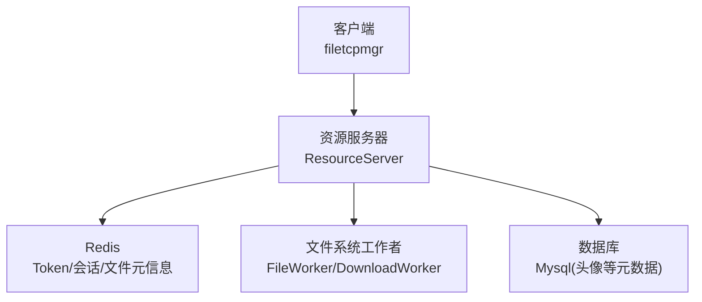
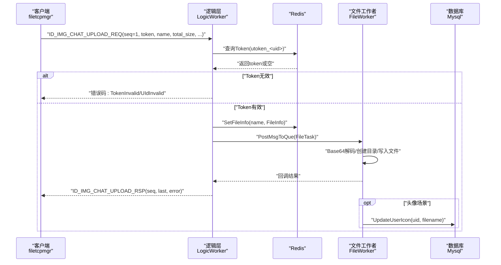
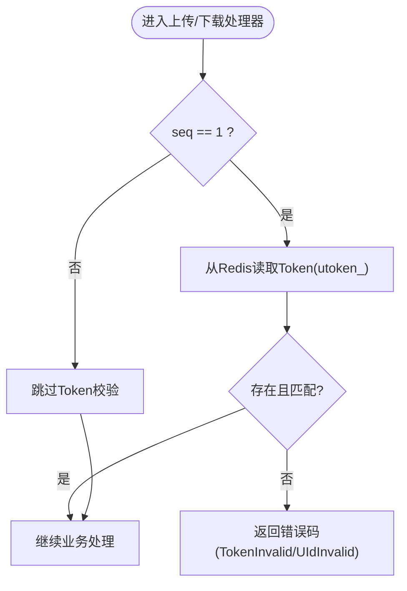
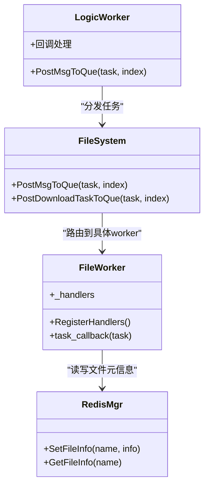
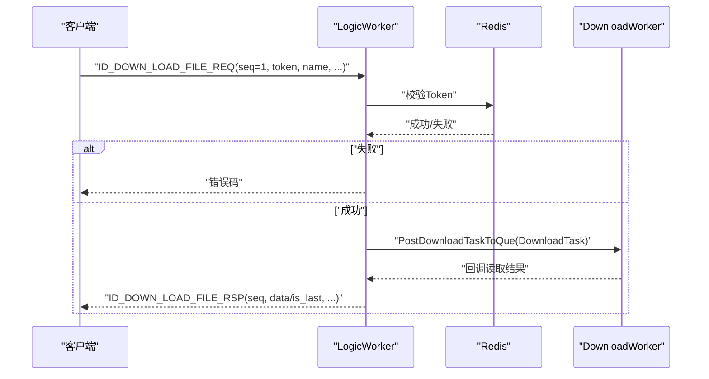
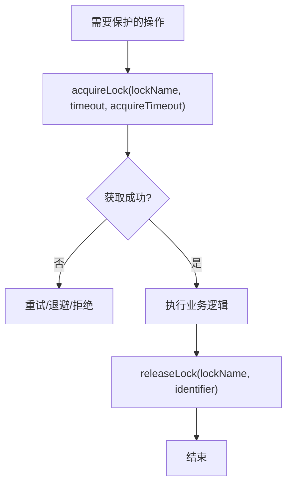
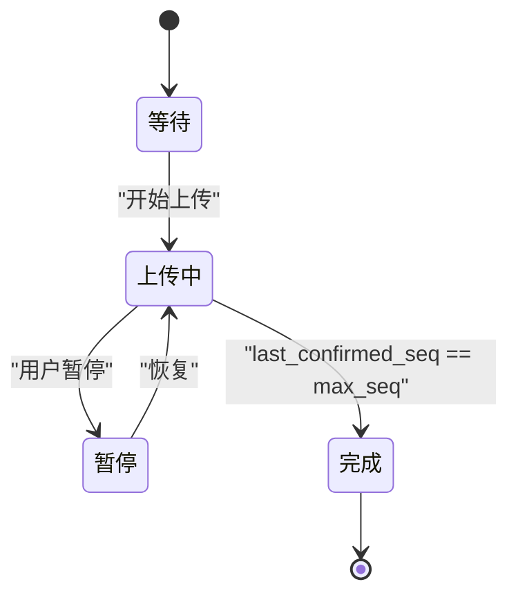
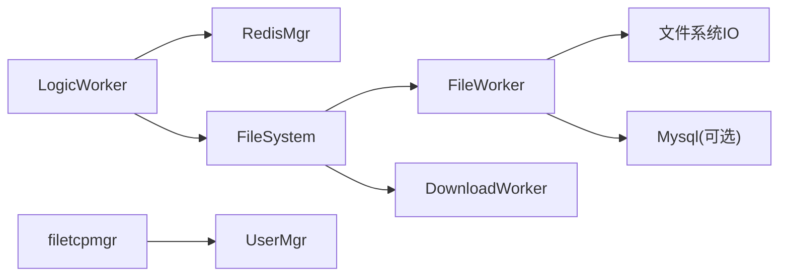

# 文件安全API

<cite>
**本文引用的文件**   
- [ResourceServer/LogicWorker.cpp](file://server/ResourceServer/src/LogicWorker.cpp)
- [ResourceServer/FileWorker.cpp](file://server/ResourceServer/src/FileWorker.cpp)
- [ResourceServer/RedisMgr.h](file://server/ResourceServer/include/RedisMgr.h)
- [ResourceServer/DistLock.h](file://server/ResourceServer/include/DistLock.h)
- [ResourceServer/FileSystem.h](file://server/ResourceServer/include/FileSystem.h)
- [ResourceServer/FileInfo.h](file://server/ResourceServer/include/FileInfo.h)
- [ResourceServer/const.h](file://server/ResourceServer/include/const.h)
- [client/filetcpmgr.cpp](file://client/llfcchat/src/filetcpmgr.cpp)
- [client/usermgr.cpp](file://client/llfcchat/src/usermgr.cpp)
- [开发文档/day32分布式锁设计思路.md](file://开发文档/day32分布式锁设计思路.md)
- [开发文档/day40-聊天图片资源续传和进度显示.md](file://开发文档/day40-聊天图片资源续传和进度显示.md)
</cite>

## 目录
1. [简介](#简介)
2. [项目结构](#项目结构)
3. [核心组件](#核心组件)
4. [架构总览](#架构总览)
5. [详细组件分析](#详细组件分析)
6. [依赖关系分析](#依赖关系分析)
7. [性能考虑](#性能考虑)
8. [故障排查指南](#故障排查指南)
9. [结论](#结论)
10. [附录：接口调用示例与最佳实践](#附录接口调用示例与最佳实践)

## 简介
本文件面向LLFCChat项目的“文件安全API”，聚焦于文件传输过程中的身份认证、权限控制、访问授权、Token验证机制、并发安全（分布式锁/文件锁/竞态防护）、以及安全审计与常见威胁防护策略。文档以代码级为依据，结合服务端ResourceServer与客户端filetcpmgr的实现，给出端到端的安全流程说明、关键数据结构、错误码语义、以及可操作的调用示例路径。

## 项目结构
- 服务端ResourceServer负责文件上传/下载、头像更新、聊天图片资源处理，并通过Redis进行Token校验与会话状态管理；通过文件系统工作者异步落盘，保证高吞吐与稳定性。
- 客户端filetcpmgr负责发起文件传输请求、维护传输状态机、断点续传、并发调度与UI进度更新。
- 公共常量与错误码定义在const.h中，便于统一错误处理与日志上报。

图表来源 
- [ResourceServer/FileSystem.h](file://server/ResourceServer/include/FileSystem.h)
- [ResourceServer/FileWorker.cpp](file://server/ResourceServer/src/FileWorker.cpp)
- [ResourceServer/RedisMgr.h](file://server/ResourceServer/include/RedisMgr.h)

章节来源
- [ResourceServer/FileSystem.h](file://server/ResourceServer/include/FileSystem.h)
- [ResourceServer/const.h](file://server/ResourceServer/include/const.h)

## 核心组件
- Token与鉴权
  - 首包校验：上传/下载首包时从Redis读取用户Token并比对，失败返回相应错误码。
  - 键空间：USERTOKENPREFIX + uid 作为Token存储键。
- 文件元信息与分片
  - FileInfo用于记录seq、name、total_size、trans_size、file_path_str等，上传/下载过程中由Redis持久化。
- 工作队列与并发
  - FileSystem将任务分发到多个FileWorker/DownloadWorker，按文件名哈希选择worker，避免热点竞争。
- 分布式锁
  - DistLock基于Redis实现加锁/解锁，配合超时与标识符，防止并发写冲突。
- 错误码体系
  - const.h集中定义错误码，如TokenInvalid、UidInvalid、FileNotExists、FileWritePermissionFailed等。

章节来源
- [ResourceServer/LogicWorker.cpp](file://server/ResourceServer/src/LogicWorker.cpp)
- [ResourceServer/FileInfo.h](file://server/ResourceServer/include/FileInfo.h)
- [ResourceServer/FileSystem.h](file://server/ResourceServer/include/FileSystem.h)
- [ResourceServer/DistLock.h](file://server/ResourceServer/include/DistLock.h)
- [ResourceServer/const.h](file://server/ResourceServer/include/const.h)

## 架构总览
下图展示一次“聊天图片上传”的完整安全流程：客户端携带Token与分片序列号发送请求，服务端首包校验Token，随后将任务投递至文件工作者异步写入，最后回调响应。

图表来源 
- [ResourceServer/LogicWorker.cpp](file://server/ResourceServer/src/LogicWorker.cpp)
- [ResourceServer/FileWorker.cpp](file://server/ResourceServer/src/FileWorker.cpp)
- [ResourceServer/RedisMgr.h](file://server/ResourceServer/include/RedisMgr.h)

章节来源
- [ResourceServer/LogicWorker.cpp](file://server/ResourceServer/src/LogicWorker.cpp)
- [ResourceServer/FileWorker.cpp](file://server/ResourceServer/src/FileWorker.cpp)

## 详细组件分析

### 组件A：Token验证与访问授权
- 首包校验时机：seq==1时执行Token校验，避免后续分片无谓处理。
- 校验流程：根据uid拼接Token键，从Redis获取并比较；不一致则立即返回错误码。
- 扩展点：可在该处增加IP白名单、设备指纹、请求签名等二次校验。

图表来源 
- [ResourceServer/LogicWorker.cpp](file://server/ResourceServer/src/LogicWorker.cpp)
- [ResourceServer/const.h](file://server/ResourceServer/include/const.h)

章节来源
- [ResourceServer/LogicWorker.cpp](file://server/ResourceServer/src/LogicWorker.cpp)
- [ResourceServer/const.h](file://server/ResourceServer/include/const.h)

### 组件B：文件上传与落盘（含头像与聊天图片）
- 任务分发：按文件名哈希选择FileWorker，降低单点竞争。
- 首包行为：创建目录、清空文件；后续分片追加写入。
- 回调处理：完成时回调上层，必要时更新数据库（头像）。
- 错误处理：目录创建失败、文件打开失败、写入失败均返回对应错误码。

图表来源 
- [ResourceServer/FileWorker.cpp](file://server/ResourceServer/src/FileWorker.cpp)
- [ResourceServer/FileSystem.h](file://server/ResourceServer/include/FileSystem.h)
- [ResourceServer/RedisMgr.h](file://server/ResourceServer/include/RedisMgr.h)

章节来源
- [ResourceServer/FileWorker.cpp](file://server/ResourceServer/src/FileWorker.cpp)
- [ResourceServer/FileSystem.h](file://server/ResourceServer/include/FileSystem.h)

### 组件C：文件下载与权限校验
- 首包校验：同上传，校验Token后再允许读取。
- 任务派发：按文件名哈希选择DownloadWorker，避免热点。
- 读取流程：检查文件存在性、打开文件、按seq分块读取并回调。

图表来源 
- [ResourceServer/LogicWorker.cpp](file://server/ResourceServer/src/LogicWorker.cpp)
- [ResourceServer/FileWorker.cpp](file://server/ResourceServer/src/FileWorker.cpp)

章节来源
- [ResourceServer/LogicWorker.cpp](file://server/ResourceServer/src/LogicWorker.cpp)
- [ResourceServer/FileWorker.cpp](file://server/ResourceServer/src/FileWorker.cpp)

### 组件D：分布式锁与并发安全
- 使用DistLock封装Redis加锁/解锁，支持过期时间与获取超时。
- 典型用法：对共享资源（如登录计数、会话清理）加锁，确保原子性与一致性。
- 建议：统一加锁顺序，避免与线程锁嵌套导致死锁。

图表来源 
- [ResourceServer/DistLock.h](file://server/ResourceServer/include/DistLock.h)
- [开发文档/day32分布式锁设计思路.md](file://开发文档/day32分布式锁设计思路.md)

章节来源
- [ResourceServer/DistLock.h](file://server/ResourceServer/include/DistLock.h)
- [开发文档/day32分布式锁设计思路.md](file://开发文档/day32分布式锁设计思路.md)

### 组件E：客户端传输状态机与并发控制
- 状态管理：维护上传/下载状态、已确认序列号集合、飞行中序列号集合。
- 并发调度：根据空闲worker选择待传输文件，避免拥塞。
- 断点续传：依据last_seq与rsp_seqs推进进度，直至完成。

图表来源 
- [client/usermgr.cpp](file://client/llfcchat/src/usermgr.cpp)
- [client/filetcpmgr.cpp](file://client/llfcchat/src/filetcpmgr.cpp)
- [开发文档/day40-聊天图片资源续传和进度显示.md](file://开发文档/day40-聊天图片资源续传和进度显示.md)

章节来源
- [client/usermgr.cpp](file://client/llfcchat/src/usermgr.cpp)
- [client/filetcpmgr.cpp](file://client/llfcchat/src/filetcpmgr.cpp)
- [开发文档/day40-聊天图片资源续传和进度显示.md](file://开发文档/day40-聊天图片资源续传和进度显示.md)

## 依赖关系分析
- ResourceServer内部依赖：
  - LogicWorker依赖RedisMgr进行Token与元信息存取，依赖FileSystem进行任务分发。
  - FileWorker/DownloadWorker依赖文件系统IO与可选的数据库操作（头像更新）。
- 客户端依赖：
  - filetcpmgr依赖UserMgr维护传输状态，依赖网络栈发送/接收消息。

图表来源 
- [ResourceServer/LogicWorker.cpp](file://server/ResourceServer/src/LogicWorker.cpp)
- [ResourceServer/FileSystem.h](file://server/ResourceServer/include/FileSystem.h)
- [ResourceServer/FileWorker.cpp](file://server/ResourceServer/src/FileWorker.cpp)
- [client/filetcpmgr.cpp](file://client/llfcchat/src/filetcpmgr.cpp)
- [client/usermgr.cpp](file://client/llfcchat/src/usermgr.cpp)

章节来源
- [ResourceServer/LogicWorker.cpp](file://server/ResourceServer/src/LogicWorker.cpp)
- [ResourceServer/FileSystem.h](file://server/ResourceServer/include/FileSystem.h)
- [ResourceServer/FileWorker.cpp](file://server/ResourceServer/src/FileWorker.cpp)
- [client/filetcpmgr.cpp](file://client/llfcchat/src/filetcpmgr.cpp)
- [client/usermgr.cpp](file://client/llfcchat/src/usermgr.cpp)

## 性能考虑
- 分片大小：MAX_FILE_LEN限制单次分片大小，平衡内存占用与网络开销。
- Worker池：按文件名哈希均匀分布任务，减少锁竞争与热点。
- Redis连接池：自动保活与重连，降低连接抖动影响。
- 异步回调：文件IO与DB操作异步化，提升吞吐。

[本节为通用指导，不直接分析具体文件]

## 故障排查指南
- 常见错误码
  - TokenInvalid：Token不存在或不匹配，检查登录流程与Redis键值。
  - UidInvalid：uid无效或非法，检查请求参数与来源。
  - FileNotExists：文件不存在，检查上传是否完成、路径是否正确。
  - FileWritePermissionFailed：写入失败，检查进程权限与磁盘空间。
  - FileReadPermissionFailed：读取失败，检查文件权限与路径。
- 定位步骤
  - 查看首包校验是否通过（seq==1分支）。
  - 检查Redis中Token与FileInfo是否存在。
  - 观察FileWorker/DownloadWorker回调是否触发及错误码。
  - 核对客户端状态机与序列号推进逻辑。

章节来源
- [ResourceServer/const.h](file://server/ResourceServer/include/const.h)
- [ResourceServer/LogicWorker.cpp](file://server/ResourceServer/src/LogicWorker.cpp)
- [ResourceServer/FileWorker.cpp](file://server/ResourceServer/src/FileWorker.cpp)

## 结论
LLFCChat的文件安全API通过“首包Token校验+Redis元信息持久化+Worker池异步IO+分布式锁”的组合，实现了高可靠、可扩展、易排障的文件传输能力。建议在现有基础上补充更细粒度的访问控制（如文件归属校验、操作权限矩阵）、完善审计日志与告警、强化输入校验与防重放策略，以满足更高安全等级需求。

[本节为总结，不直接分析具体文件]

## 附录：接口调用示例与最佳实践

### 安全接口调用示例（路径引用）
- 上传头像首包校验与回调
  - 服务端处理入口与Token校验：[ResourceServer/LogicWorker.cpp](file://server/ResourceServer/src/LogicWorker.cpp)
  - 文件写入与头像更新回调：[ResourceServer/FileWorker.cpp](file://server/ResourceServer/src/FileWorker.cpp)
- 聊天图片上传/续传/下载
  - 客户端处理与状态推进：[client/filetcpmgr.cpp](file://client/llfcchat/src/filetcpmgr.cpp)
  - 客户端传输状态管理：[client/usermgr.cpp](file://client/llfcchat/src/usermgr.cpp)
  - 进度与续传逻辑参考：[开发文档/day40-聊天图片资源续传和进度显示.md](file://开发文档/day40-聊天图片资源续传和进度显示.md)

### 安全最佳实践清单
- 身份与授权
  - 首包强制Token校验，失败即拒绝后续分片。
  - 建议增加请求签名、时间戳与nonce，防范重放攻击。
- 权限控制
  - 校验文件归属（sender/receiver），仅允许目标用户下载。
  - 对敏感操作（删除、覆盖）实施二次确认与权限矩阵。
- 并发与一致性
  - 使用分布式锁保护共享资源，统一加锁顺序。
  - 文件写入采用追加模式，避免并发覆盖。
- 审计与监控
  - 记录每次上传/下载的uid、name、seq、error码与耗时。
  - 异常阈值告警（如连续失败、慢请求）。
- 输入与输出防护
  - 严格校验JSON字段类型与长度，拒绝非法字符。
  - 对文件名做白名单过滤，禁止路径穿越。
  - 输出前进行HTML转义，防止XSS。

[本节为实践指导，不直接分析具体文件]