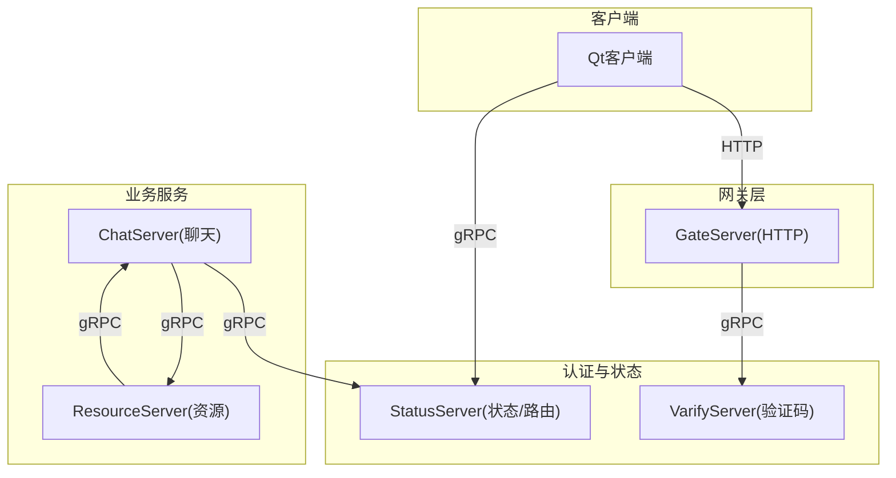
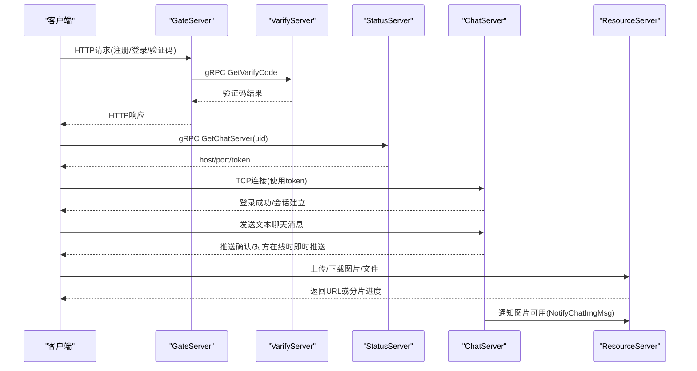
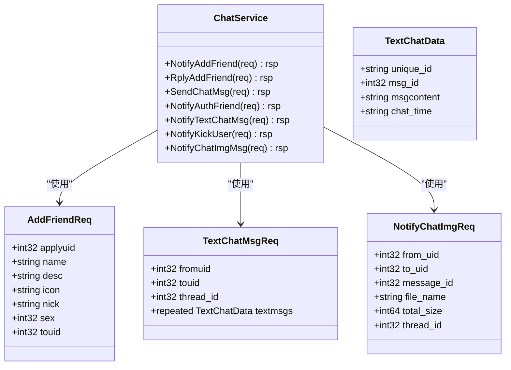
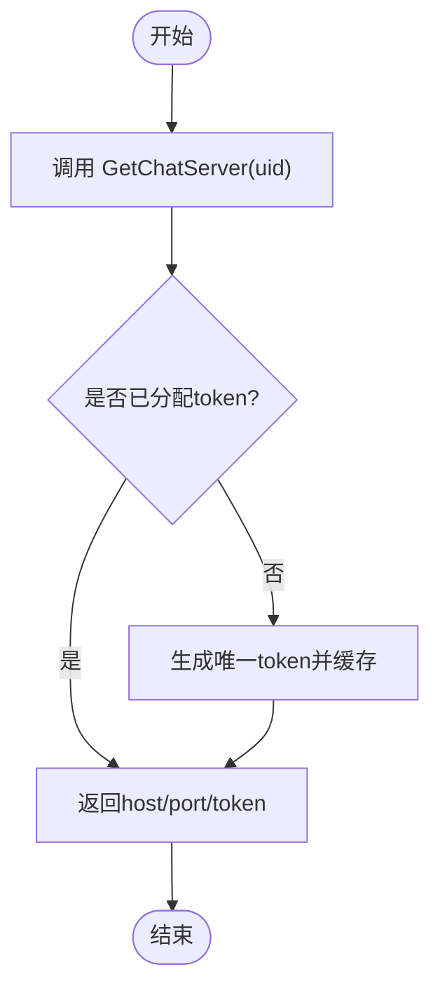
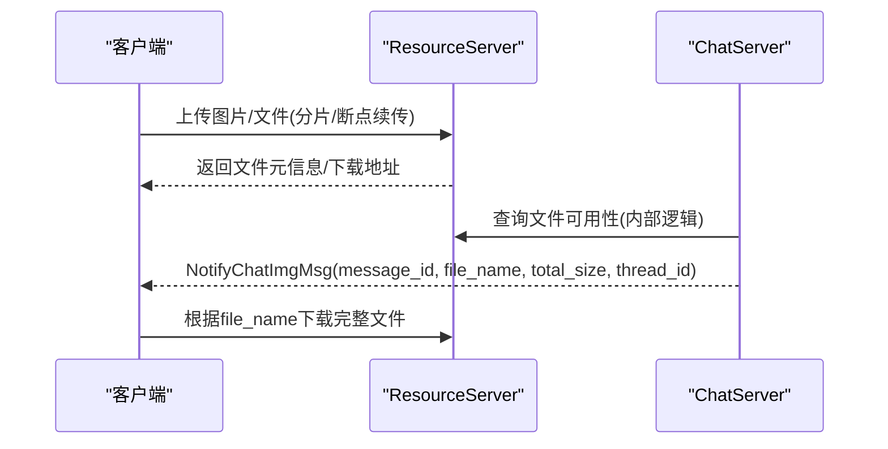
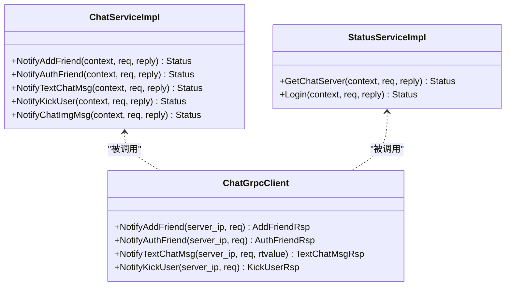
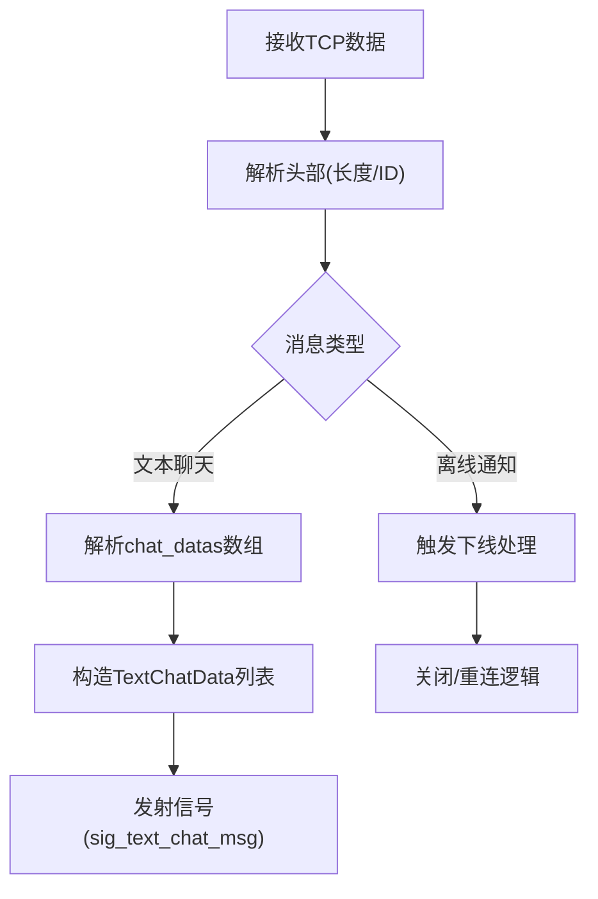
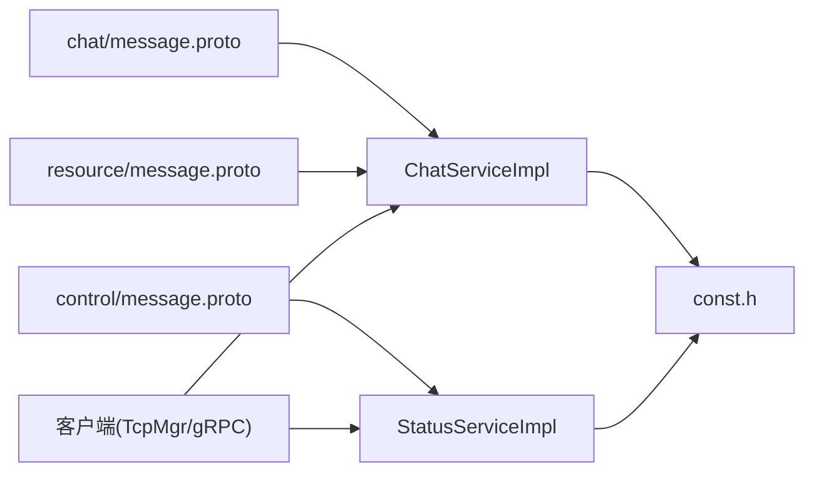

# gRPC协议设计

<cite>
**本文引用的文件**
- [server/proto/chat/message.proto](file://server/proto/chat/message.proto)
- [server/proto/control/message.proto](file://server/proto/control/message.proto)
- [server/proto/resource/message.proto](file://server/proto/resource/message.proto)
- [server/ChatServer/include/ChatServiceImpl.h](file://server/ChatServer/include/ChatServiceImpl.h)
- [server/ChatServer/src/ChatServiceImpl.cpp](file://server/ChatServer/src/ChatServiceImpl.cpp)
- [server/StatusServer/include/StatusServiceImpl.h](file://server/StatusServer/include/StatusServiceImpl.h)
- [server/StatusServer/src/StatusServiceImpl.cpp](file://server/StatusServer/src/StatusServiceImpl.cpp)
- [server/ChatServer/include/ChatGrpcClient.h](file://server/ChatServer/include/ChatGrpcClient.h)
- [server/ChatServer/src/ChatGrpcClient.cpp](file://server/ChatServer/src/ChatGrpcClient.cpp)
- [server/GateServer/src/VerifyGrpcClient.cpp](file://server/GateServer/src/VerifyGrpcClient.cpp)
- [server/VarifyServer/message.proto](file://server/VarifyServer/message.proto)
- [server/ChatServer/include/const.h](file://server/ChatServer/include/const.h)
- [client/llfcchat/include/tcpmgr.h](file://client/llfcchat/include/tcpmgr.h)
- [client/llfcchat/src/tcpmgr.cpp](file://client/llfcchat/src/tcpmgr.cpp)
- [README.md](file://README.md)
</cite>

## 目录
1. [简介](#简介)
2. [项目结构](#项目结构)
3. [核心组件](#核心组件)
4. [架构总览](#架构总览)
5. [详细组件分析](#详细组件分析)
6. [依赖关系分析](#依赖关系分析)
7. [性能考虑](#性能考虑)
8. [故障排查指南](#故障排查指南)
9. [结论](#结论)
10. [附录](#附录)

## 简介
本文件为LLFCChat项目的gRPC协议设计文档，聚焦于基于Protocol Buffers的微服务间通信规范。内容涵盖：
- 消息类型定义与服务接口规范（聊天、控制、资源三类）
- 错误码约定与一致性策略
- 版本管理与向后兼容性保证
- 接口文档生成与最佳实践
- 客户端与服务端实现示例、错误处理策略与调试方法

## 项目结构
本项目采用多服务拆分架构，通过gRPC进行服务间通信，主要包含：
- ChatServer：聊天业务服务，提供好友申请、文本聊天、图片通知、踢人等能力
- StatusServer：状态与路由服务，负责分配ChatServer地址与登录鉴权
- GateServer：HTTP网关，对外暴露HTTP接口并调用验证服务
- VarifyServer：验证码服务（Node.js），提供邮箱验证码下发
- ResourceServer：资源服务（文件上传下载、头像管理）
- Client：Qt客户端，通过TCP长连接接收服务端推送消息，并通过gRPC访问状态/验证服务

**图表来源**
- [server/proto/chat/message.proto](file://server/proto/chat/message.proto)
- [server/proto/control/message.proto](file://server/proto/control/message.proto)
- [server/proto/resource/message.proto](file://server/proto/resource/message.proto)
- [server/StatusServer/include/StatusServiceImpl.h](file://server/StatusServer/include/StatusServiceImpl.h)
- [server/ChatServer/include/ChatServiceImpl.h](file://server/ChatServer/include/ChatServiceImpl.h)

**章节来源**
- [README.md](file://README.md)

## 核心组件
- 协议定义
  - chat/message.proto：聊天相关消息与服务接口
  - control/message.proto：控制相关消息与服务接口
  - resource/message.proto：资源相关消息与服务接口
- 服务实现
  - ChatServiceImpl：实现ChatService的RPC接口，转发消息到在线用户会话
  - StatusServiceImpl：实现StatusService的RPC接口，返回ChatServer地址与Token，校验登录
- 客户端封装
  - ChatGrpcClient：聊天服务的gRPC客户端，维护连接池
  - VerifyGrpcClient：验证码服务的gRPC客户端
- 错误码与常量
  - const.h：统一错误码、消息ID、Redis键前缀等

**章节来源**
- [server/proto/chat/message.proto](file://server/proto/chat/message.proto)
- [server/proto/control/message.proto](file://server/proto/control/message.proto)
- [server/proto/resource/message.proto](file://server/proto/resource/message.proto)
- [server/ChatServer/include/ChatServiceImpl.h](file://server/ChatServer/include/ChatServiceImpl.h)
- [server/StatusServer/include/StatusServiceImpl.h](file://server/StatusServer/include/StatusServiceImpl.h)
- [server/ChatServer/include/ChatGrpcClient.h](file://server/ChatServer/include/ChatGrpcClient.h)
- [server/GateServer/src/VerifyGrpcClient.cpp](file://server/GateServer/src/VerifyGrpcClient.cpp)
- [server/ChatServer/include/const.h](file://server/ChatServer/include/const.h)

## 架构总览
下图展示了从客户端发起登录到获取ChatServer地址、建立TCP会话、发送聊天消息的整体流程。

**图表来源**
- [server/proto/control/message.proto](file://server/proto/control/message.proto)
- [server/proto/chat/message.proto](file://server/proto/chat/message.proto)
- [server/proto/resource/message.proto](file://server/proto/resource/message.proto)
- [server/StatusServer/src/StatusServiceImpl.cpp](file://server/StatusServer/src/StatusServiceImpl.cpp)
- [server/ChatServer/src/ChatServiceImpl.cpp](file://server/ChatServer/src/ChatServiceImpl.cpp)

## 详细组件分析

### 聊天协议(chat/message.proto)
- 服务接口
  - ChatService：好友申请、回复、文本聊天、踢人、图片通知等
- 关键消息
  - AddFriendReq/Rsp：好友申请与回复
  - AuthFriendReq/Rsp：好友认证消息集合
  - TextChatMsgReq/Rsp：文本聊天消息（含thread_id与textmsgs数组）
  - NotifyChatImgReq/Rsp：图片聊天通知（message_id、file_name、total_size、thread_id）
  - KickUserReq/Rsp：踢人指令

**图表来源**
- [server/proto/chat/message.proto](file://server/proto/chat/message.proto)

**章节来源**
- [server/proto/chat/message.proto](file://server/proto/chat/message.proto)
- [server/ChatServer/include/ChatServiceImpl.h](file://server/ChatServer/include/ChatServiceImpl.h)
- [server/ChatServer/src/ChatServiceImpl.cpp](file://server/ChatServer/src/ChatServiceImpl.cpp)

### 控制协议(control/message.proto)
- 服务接口
  - StatusService：获取ChatServer地址、登录校验
  - VarifyService：获取验证码（与控制协议重复定义，实际由VarifyServer实现）
- 关键消息
  - GetChatServerReq/Rsp：返回host/port/token
  - LoginReq/Rsp：登录校验，返回error/uid/token

**图表来源**
- [server/proto/control/message.proto](file://server/proto/control/message.proto)
- [server/StatusServer/src/StatusServiceImpl.cpp](file://server/StatusServer/src/StatusServiceImpl.cpp)

**章节来源**
- [server/proto/control/message.proto](file://server/proto/control/message.proto)
- [server/StatusServer/include/StatusServiceImpl.h](file://server/StatusServer/include/StatusServiceImpl.h)
- [server/StatusServer/src/StatusServiceImpl.cpp](file://server/StatusServer/src/StatusServiceImpl.cpp)

### 资源协议(resource/message.proto)
- 服务接口
  - ChatService：新增NotifyChatImgMsg用于通知客户端图片可用
- 关键消息
  - NotifyChatImgReq/Rsp：包含from_uid、to_uid、message_id、file_name、total_size、thread_id
- 说明
  - 资源上传/下载通常由ResourceServer提供HTTP或专用传输接口；聊天侧通过gRPC通知客户端下载

**图表来源**
- [server/proto/resource/message.proto](file://server/proto/resource/message.proto)
- [server/proto/chat/message.proto](file://server/proto/chat/message.proto)

**章节来源**
- [server/proto/resource/message.proto](file://server/proto/resource/message.proto)
- [server/proto/chat/message.proto](file://server/proto/chat/message.proto)

### 错误码约定
- 统一错误码定义在const.h中，常见包括：
  - Success=0
  - Error_Json=1001
  - RPCFailed=1002
  - TokenInvalid=1010
  - UidInvalid=1011
  - CREATE_CHAT_FAILED=1012
  - LOAD_CHAT_FAILED=1013
- 所有gRPC响应均包含int32 error字段，便于客户端统一处理

**章节来源**
- [server/ChatServer/include/const.h](file://server/ChatServer/include/const.h)

### 客户端与服务端实现示例
- 服务端实现
  - ChatServiceImpl：解析请求、查找目标用户会话、构造JSON并推送至客户端
  - StatusServiceImpl：读取配置、选择ChatServer、生成并缓存token、校验登录
- 客户端封装
  - ChatGrpcClient：维护ChatService::Stub连接池，支持并发调用与连接回收
  - VerifyGrpcClient：连接验证码服务，获取验证码

**图表来源**
- [server/ChatServer/include/ChatServiceImpl.h](file://server/ChatServer/include/ChatServiceImpl.h)
- [server/StatusServer/include/StatusServiceImpl.h](file://server/StatusServer/include/StatusServiceImpl.h)
- [server/ChatServer/include/ChatGrpcClient.h](file://server/ChatServer/include/ChatGrpcClient.h)

**章节来源**
- [server/ChatServer/src/ChatServiceImpl.cpp](file://server/ChatServer/src/ChatServiceImpl.cpp)
- [server/StatusServer/src/StatusServiceImpl.cpp](file://server/StatusServer/src/StatusServiceImpl.cpp)
- [server/ChatServer/include/ChatGrpcClient.h](file://server/ChatServer/include/ChatGrpcClient.h)
- [server/ChatServer/src/ChatGrpcClient.cpp](file://server/ChatServer/src/ChatGrpcClient.cpp)
- [server/GateServer/src/VerifyGrpcClient.cpp](file://server/GateServer/src/VerifyGrpcClient.cpp)

### 客户端TCP消息处理
- 客户端通过TcpMgr维护TCP长连接，接收服务端推送的消息（如文本聊天、离线通知等）
- 收到消息后解析JSON，转换为本地数据结构并触发UI更新

**图表来源**
- [client/llfcchat/include/tcpmgr.h](file://client/llfcchat/include/tcpmgr.h)
- [client/llfcchat/src/tcpmgr.cpp](file://client/llfcchat/src/tcpmgr.cpp)

**章节来源**
- [client/llfcchat/include/tcpmgr.h](file://client/llfcchat/include/tcpmgr.h)
- [client/llfcchat/src/tcpmgr.cpp](file://client/llfcchat/src/tcpmgr.cpp)

## 依赖关系分析
- 协议依赖
  - chat/control/resource三个proto包均定义了VarifyService与StatusService，但实际实现分别在VarifyServer与StatusServer
- 服务间依赖
  - ChatServer依赖StatusServer进行路由与登录校验
  - ResourceServer通过ChatService通知客户端图片可用
- 客户端依赖
  - 客户端通过gRPC访问StatusServer与VarifyServer，通过TCP接收ChatServer推送

**图表来源**
- [server/proto/chat/message.proto](file://server/proto/chat/message.proto)
- [server/proto/control/message.proto](file://server/proto/control/message.proto)
- [server/proto/resource/message.proto](file://server/proto/resource/message.proto)
- [server/ChatServer/include/ChatServiceImpl.h](file://server/ChatServer/include/ChatServiceImpl.h)
- [server/StatusServer/include/StatusServiceImpl.h](file://server/StatusServer/include/StatusServiceImpl.h)
- [server/ChatServer/include/const.h](file://server/ChatServer/include/const.h)

**章节来源**
- [server/proto/chat/message.proto](file://server/proto/chat/message.proto)
- [server/proto/control/message.proto](file://server/proto/control/message.proto)
- [server/proto/resource/message.proto](file://server/proto/resource/message.proto)
- [server/ChatServer/include/ChatServiceImpl.h](file://server/ChatServer/include/ChatServiceImpl.h)
- [server/StatusServer/include/StatusServiceImpl.h](file://server/StatusServer/include/StatusServiceImpl.h)
- [server/ChatServer/include/const.h](file://server/ChatServer/include/const.h)

## 性能考虑
- 连接池
  - ChatGrpcClient维护ChatService::Stub连接池，减少握手开销，提升吞吐
- 异步I/O
  - 服务端使用AsioIOServicePool进行异步网络处理，提高并发能力
- 缓存
  - Redis缓存用户基础信息与Token，降低数据库压力
- 分片与断点续传
  - 资源服务支持大文件分片上传与断点续传，提升稳定性与用户体验

[本节为通用指导，不直接分析具体文件]

## 故障排查指南
- 常见问题
  - RPC失败：检查ErrorCodes::RPCFailed，确认对端服务可达与端口配置
  - Token无效：检查ErrorCodes::TokenInvalid，确认StatusServer生成的token是否正确缓存
  - UID无效：检查ErrorCodes::UidInvalid，确认用户是否存在
  - JSON解析错误：检查ErrorCodes::Error_Json，确认消息体格式
- 调试方法
  - 启用日志输出，记录请求参数与响应状态
  - 使用gRPC命令行工具或抓包工具验证协议与序列化
  - 客户端打印TcpMgr接收到的原始数据，定位粘包/半包问题

**章节来源**
- [server/ChatServer/include/const.h](file://server/ChatServer/include/const.h)
- [server/ChatServer/src/ChatServiceImpl.cpp](file://server/ChatServer/src/ChatServiceImpl.cpp)
- [server/StatusServer/src/StatusServiceImpl.cpp](file://server/StatusServer/src/StatusServiceImpl.cpp)
- [client/llfcchat/src/tcpmgr.cpp](file://client/llfcchat/src/tcpmgr.cpp)

## 结论
本设计通过清晰的proto分层（chat/control/resource）与统一错误码体系，实现了可扩展、可维护的gRPC微服务通信。结合连接池、异步I/O与缓存机制，系统在性能与稳定性方面具备良好表现。建议后续持续完善资源协议的HTTP接口文档与客户端SDK，以提升开发效率与跨语言集成能力。

[本节为总结性内容，不直接分析具体文件]

## 附录

### 协议版本管理与向后兼容性
- 版本策略
  - 在proto文件中引入version字段，或在服务名/包名前缀体现版本（如v1/v2）
  - 新增字段应置于末尾，避免破坏已有字段编号
- 兼容原则
  - 禁止删除或重命名已有字段编号
  - 新增可选字段默认值需明确
  - 废弃字段保留但标记deprecated，逐步迁移
- 文档生成
  - 使用protoc生成API文档（如grpc-gateway或Swagger）
  - 将proto文件纳入版本控制，变更需评审与发布说明

[本节为通用指导，不直接分析具体文件]

### 客户端与服务端实现要点
- 客户端
  - 使用连接池管理gRPC通道，避免频繁创建销毁
  - 统一错误处理，将RPC错误映射为业务错误码
  - 对TCP推送消息进行健壮解析与重试
- 服务端
  - 严格校验输入参数，返回明确的错误码
  - 使用Defer模式确保响应字段设置的一致性
  - 合理划分服务职责，避免单点过载

**章节来源**
- [server/ChatServer/include/ChatGrpcClient.h](file://server/ChatServer/include/ChatGrpcClient.h)
- [server/ChatServer/src/ChatGrpcClient.cpp](file://server/ChatServer/src/ChatGrpcClient.cpp)
- [server/ChatServer/include/const.h](file://server/ChatServer/include/const.h)
- [server/ChatServer/src/ChatServiceImpl.cpp](file://server/ChatServer/src/ChatServiceImpl.cpp)