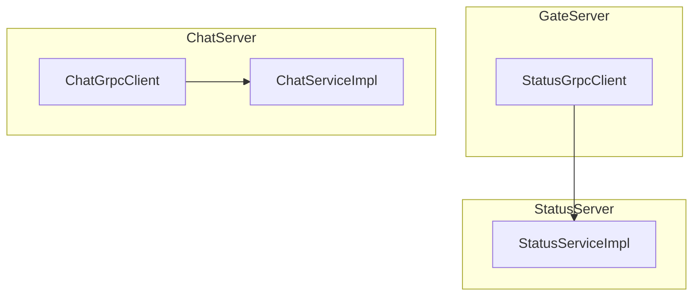
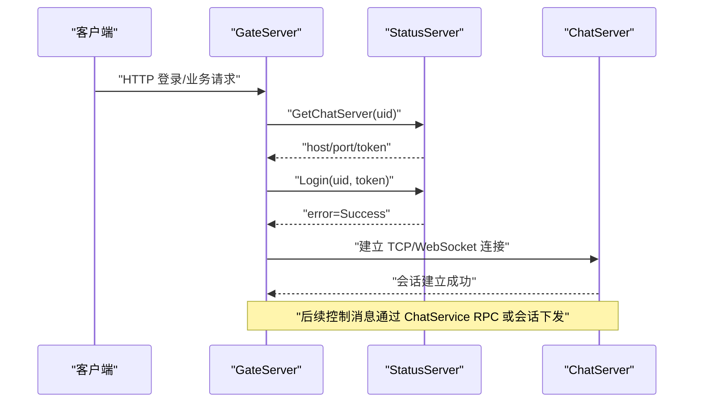
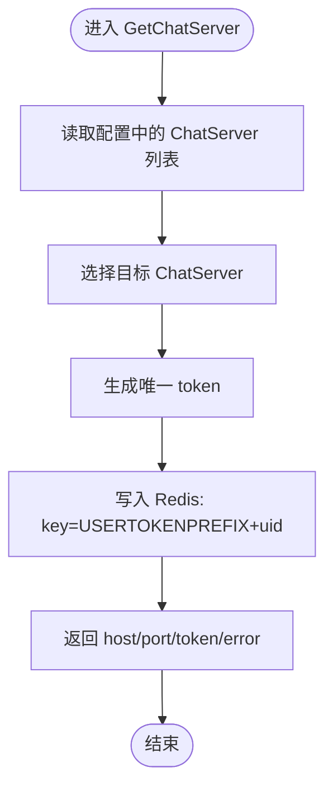
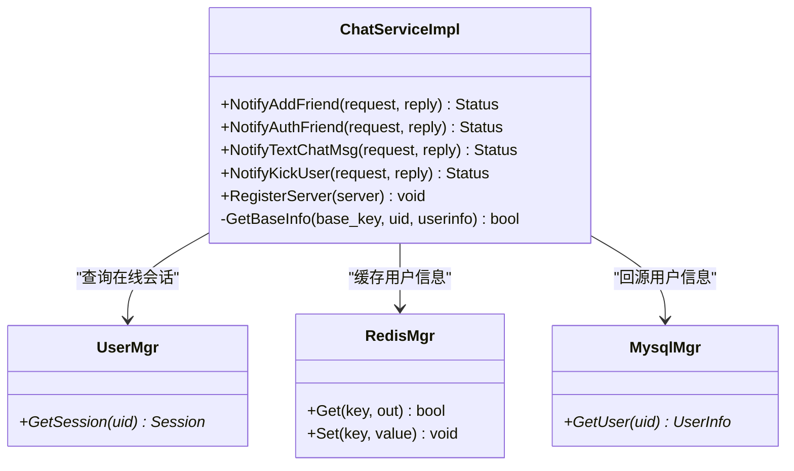
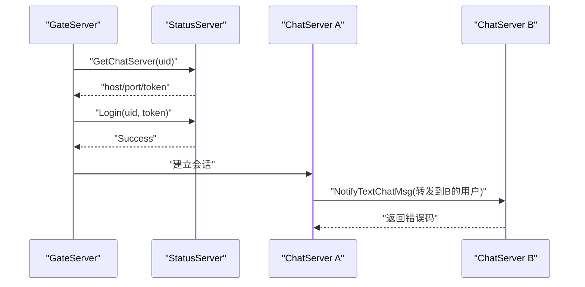
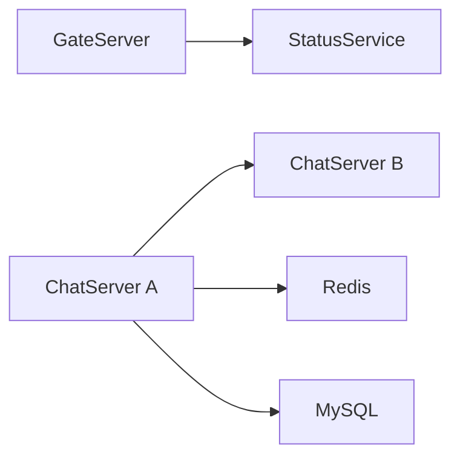

# 控制消息协议

<cite>
**本文引用的文件**   
- [server/proto/control/message.proto](file://server/proto/control/message.proto)
- [server/StatusServer/src/StatusServiceImpl.cpp](file://server/StatusServer/src/StatusServiceImpl.cpp)
- [server/StatusServer/include/StatusServiceImpl.h](file://server/StatusServer/include/StatusServiceImpl.h)
- [server/ChatServer/src/ChatServiceImpl.cpp](file://server/ChatServer/src/ChatServiceImpl.cpp)
- [server/ChatServer/include/ChatGrpcClient.h](file://server/ChatServer/include/ChatGrpcClient.h)
- [server/ChatServer/src/ChatGrpcClient.cpp](file://server/ChatServer/src/ChatGrpcClient.cpp)
- [server/GateServer/include/StatusGrpcClient.h](file://server/GateServer/include/StatusGrpcClient.h)
- [server/GateServer/src/StatusGrpcClient.cpp](file://server/GateServer/src/StatusGrpcClient.cpp)
</cite>

## 目录
1. [简介](#简介)
2. [项目结构](#项目结构)
3. [核心组件](#核心组件)
4. [架构总览](#架构总览)
5. [详细组件分析](#详细组件分析)
6. [依赖关系分析](#依赖关系分析)
7. [性能考虑](#性能考虑)
8. [故障排查指南](#故障排查指南)
9. [结论](#结论)
10. [附录](#附录)

## 简介
本文件为 LLFCChat 项目的控制消息协议文档，聚焦于 control/message.proto 中定义的控制指令与系统管理接口。该协议基于 gRPC/Protobuf，用于微服务间的协调、配置管理、服务发现与负载均衡、会话与用户状态管理、以及系统监控等关键能力。文档将详细说明：
- 控制消息的数据格式（Protobuf 消息与服务）
- 传输协议（gRPC）与安全机制（当前使用非安全通道，建议后续启用 TLS）
- 各类控制指令的类型、参数与返回值
- 典型调用流程（服务注册发现、登录鉴权、好友申请/认证、文本聊天通知、踢人下线）
- 错误处理与日志记录最佳实践
- 性能优化策略与调试方法

## 项目结构
控制消息协议位于 server/proto/control/message.proto，相关实现分布在以下模块：
- StatusServer：提供状态服务（服务发现、登录校验、Token 生成与校验）
- ChatServer：提供聊天控制服务（好友申请、认证、文本消息推送、踢人）
- GateServer：作为客户端调用 StatusService 获取 ChatServer 地址并执行登录校验
- ChatServer 内部通过 ChatGrpcClient 调用其他 ChatServer 实例的 ChatService

图表来源
- [server/GateServer/include/StatusGrpcClient.h:1-98](file://server/GateServer/include/StatusGrpcClient.h#L1-L98)
- [server/GateServer/src/StatusGrpcClient.cpp:1-53](file://server/GateServer/src/StatusGrpcClient.cpp#L1-L53)
- [server/StatusServer/include/StatusServiceImpl.h:1-52](file://server/StatusServer/include/StatusServiceImpl.h#L1-L52)
- [server/StatusServer/src/StatusServiceImpl.cpp:1-125](file://server/StatusServer/src/StatusServiceImpl.cpp#L1-L125)
- [server/ChatServer/include/ChatGrpcClient.h:1-120](file://server/ChatServer/include/ChatGrpcClient.h#L1-L120)
- [server/ChatServer/src/ChatGrpcClient.cpp:1-205](file://server/ChatServer/src/ChatGrpcClient.cpp#L1-L205)

章节来源
- [server/proto/control/message.proto:1-143](file://server/proto/control/message.proto#L1-L143)

## 核心组件
- Protobuf 协议定义
  - 服务：VarifyService、StatusService、ChatService
  - 消息：验证码请求/响应、获取 ChatServer 信息、登录请求/响应、好友申请/回复、文本聊天消息、踢人等
- 服务实现
  - StatusServiceImpl：实现 GetChatServer、Login，负责 Token 生成与校验、ChatServer 选择
  - ChatServiceImpl：实现好友申请、认证、文本消息推送、踢人等逻辑，并通过 UserMgr 定位在线会话
- 客户端封装
  - StatusGrpcClient：GateServer 调用 StatusService 的客户端封装，含连接池
  - ChatGrpcClient：ChatServer 间互调 ChatService 的客户端封装，含连接池

章节来源
- [server/proto/control/message.proto:1-143](file://server/proto/control/message.proto#L1-L143)
- [server/StatusServer/include/StatusServiceImpl.h:1-52](file://server/StatusServer/include/StatusServiceImpl.h#L1-L52)
- [server/StatusServer/src/StatusServiceImpl.cpp:1-125](file://server/StatusServer/src/StatusServiceImpl.cpp#L1-L125)
- [server/ChatServer/src/ChatServiceImpl.cpp:1-242](file://server/ChatServer/src/ChatServiceImpl.cpp#L1-L242)
- [server/GateServer/include/StatusGrpcClient.h:1-98](file://server/GateServer/include/StatusGrpcClient.h#L1-L98)
- [server/GateServer/src/StatusGrpcClient.cpp:1-53](file://server/GateServer/src/StatusGrpcClient.cpp#L1-L53)
- [server/ChatServer/include/ChatGrpcClient.h:1-120](file://server/ChatServer/include/ChatGrpcClient.h#L1-L120)
- [server/ChatServer/src/ChatGrpcClient.cpp:1-205](file://server/ChatServer/src/ChatGrpcClient.cpp#L1-L205)

## 架构总览
控制消息在微服务中的职责划分：
- GateServer：对外暴露 HTTP/业务入口，通过 StatusService 获取 ChatServer 路由与完成登录鉴权
- StatusServer：集中式状态服务，维护 ChatServer 列表、生成 Token、校验登录
- ChatServer：承载用户会话与聊天控制逻辑，支持跨实例的消息转发与踢人

图表来源
- [server/GateServer/src/StatusGrpcClient.cpp:1-53](file://server/GateServer/src/StatusGrpcClient.cpp#L1-L53)
- [server/StatusServer/src/StatusServiceImpl.cpp:1-125](file://server/StatusServer/src/StatusServiceImpl.cpp#L1-L125)
- [server/proto/control/message.proto:1-143](file://server/proto/control/message.proto#L1-L143)

## 详细组件分析

### 协议定义（control/message.proto）
- 服务
  - VarifyService：验证码获取（GetVarifyCode）
  - StatusService：服务发现与登录（GetChatServer、Login）
  - ChatService：聊天控制（NotifyAddFriend、RplyAddFriend、SendChatMsg、NotifyAuthFriend、NotifyTextChatMsg、NotifyKickUser）
- 消息
  - 验证码：GetVarifyReq/GetVarifyRsp
  - 服务发现：GetChatServerReq/GetChatServerRsp（返回 host、port、token）
  - 登录：LoginReq/LoginRsp（uid、token、error）
  - 好友申请：AddFriendReq/AddFriendRsp、RplyFriendReq/RplyFriendRsp
  - 文本聊天：TextChatMsgReq/TextChatMsgRsp、TextChatData
  - 踢人：KickUserReq/KickUserRsp

章节来源
- [server/proto/control/message.proto:1-143](file://server/proto/control/message.proto#L1-L143)

### StatusService 实现（StatusServiceImpl）
- GetChatServer
  - 从配置加载 ChatServer 列表
  - 选择一台 ChatServer（当前实现返回首台）
  - 生成唯一 token 并写入 Redis（键前缀 USERTOKENPREFIX + uid）
  - 返回 host、port、token、error
- Login
  - 校验 Redis 中是否存在相同 uid 的 token（防重复登录）
  - 校验 token 是否匹配
  - 返回 error、uid、token

图表来源
- [server/StatusServer/src/StatusServiceImpl.cpp:1-125](file://server/StatusServer/src/StatusServiceImpl.cpp#L1-L125)

章节来源
- [server/StatusServer/include/StatusServiceImpl.h:1-52](file://server/StatusServer/include/StatusServiceImpl.h#L1-L52)
- [server/StatusServer/src/StatusServiceImpl.cpp:1-125](file://server/StatusServer/src/StatusServiceImpl.cpp#L1-L125)

### ChatService 实现（ChatServiceImpl）
- NotifyAddFriend
  - 根据 touid 查找在线会话
  - 若存在则构造 JSON 通知并下发至客户端会话
  - 返回 error、applyuid、touid
- NotifyAuthFriend
  - 查找接收方会话，组装认证结果与历史消息数据
  - 优先从 Redis 获取用户基础信息，否则回源 MySQL 并缓存
  - 下发通知至客户端
- NotifyTextChatMsg
  - 查找接收方会话，组装文本消息数组并下发
- NotifyKickUser
  - 查找目标会话，触发离线通知并清理旧连接

图表来源
- [server/ChatServer/src/ChatServiceImpl.cpp:1-242](file://server/ChatServer/src/ChatServiceImpl.cpp#L1-L242)

章节来源
- [server/ChatServer/src/ChatServiceImpl.cpp:1-242](file://server/ChatServer/src/ChatServiceImpl.cpp#L1-L242)

### 客户端封装（StatusGrpcClient、ChatGrpcClient）
- StatusGrpcClient（GateServer 侧）
  - 连接池：StatusConPool，创建多个 StatusService::Stub
  - GetChatServer：构造请求并调用 StatusService
  - Login：携带 uid、token 进行登录校验
- ChatGrpcClient（ChatServer 侧）
  - 连接池：ChatConPool，按对端名称维护多组连接
  - 调用 ChatService 的 NotifyAddFriend、NotifyAuthFriend、NotifyTextChatMsg、NotifyKickUser
  - 统一错误码映射（如 RPCFailed）

图表来源
- [server/GateServer/include/StatusGrpcClient.h:1-98](file://server/GateServer/include/StatusGrpcClient.h#L1-L98)
- [server/GateServer/src/StatusGrpcClient.cpp:1-53](file://server/GateServer/src/StatusGrpcClient.cpp#L1-L53)
- [server/ChatServer/include/ChatGrpcClient.h:1-120](file://server/ChatServer/include/ChatGrpcClient.h#L1-L120)
- [server/ChatServer/src/ChatGrpcClient.cpp:1-205](file://server/ChatServer/src/ChatGrpcClient.cpp#L1-L205)

章节来源
- [server/GateServer/include/StatusGrpcClient.h:1-98](file://server/GateServer/include/StatusGrpcClient.h#L1-L98)
- [server/GateServer/src/StatusGrpcClient.cpp:1-53](file://server/GateServer/src/StatusGrpcClient.cpp#L1-L53)
- [server/ChatServer/include/ChatGrpcClient.h:1-120](file://server/ChatServer/include/ChatGrpcClient.h#L1-L120)
- [server/ChatServer/src/ChatGrpcClient.cpp:1-205](file://server/ChatServer/src/ChatGrpcClient.cpp#L1-L205)

## 依赖关系分析
- 组件耦合
  - GateServer 依赖 StatusService 进行服务发现与登录
  - ChatServer 之间通过 ChatService 进行控制消息转发
  - ChatServiceImpl 依赖 UserMgr、RedisMgr、MysqlMgr
- 外部依赖
  - gRPC 通道与 Stub
  - Redis（Token 存储、用户信息缓存）
  - MySQL（用户信息回源）
- 潜在循环依赖
  - 无直接代码级循环；注意避免在业务层引入跨服务循环调用

图表来源
- [server/proto/control/message.proto:1-143](file://server/proto/control/message.proto#L1-L143)
- [server/StatusServer/src/StatusServiceImpl.cpp:1-125](file://server/StatusServer/src/StatusServiceImpl.cpp#L1-L125)
- [server/ChatServer/src/ChatServiceImpl.cpp:1-242](file://server/ChatServer/src/ChatServiceImpl.cpp#L1-L242)

章节来源
- [server/proto/control/message.proto:1-143](file://server/proto/control/message.proto#L1-L143)
- [server/StatusServer/src/StatusServiceImpl.cpp:1-125](file://server/StatusServer/src/StatusServiceImpl.cpp#L1-L125)
- [server/ChatServer/src/ChatServiceImpl.cpp:1-242](file://server/ChatServer/src/ChatServiceImpl.cpp#L1-L242)

## 性能考虑
- 连接池
  - StatusConPool 与 ChatConPool 复用 gRPC Channel/Stub，减少握手开销
  - 合理设置池大小，避免过多线程竞争
- 负载均衡
  - 当前 GetChatServer 返回首台服务器，可扩展为基于 Redis 计数或健康检查的动态选择
- 缓存
  - 用户基础信息优先读 Redis，未命中再查 MySQL，降低数据库压力
- 序列化
  - Protobuf 二进制高效；JSON 仅用于会话下发，注意体积控制
- 超时与重试
  - 建议在客户端增加超时与重试策略，提升鲁棒性

[本节为通用指导，不直接分析具体文件]

## 故障排查指南
- 常见问题
  - RPC 失败：检查 StatusGrpcClient/ChatGrpcClient 的连接池与网络连通性
  - Token 无效：确认 StatusServer 生成的 token 与客户端传入一致，且未被重复登录拦截
  - 用户不在内存：ChatServiceImpl 查找会话为空时直接返回，需确认用户是否在线
- 日志与诊断
  - 在 StatusServiceImpl 与 ChatServiceImpl 的关键路径添加日志（如 UID、Token、错误码）
  - 使用 Redis CLI 检查 Token 键是否存在与值是否正确
  - 观察 ChatServer 会话管理与清理逻辑（踢人后连接是否释放）

章节来源
- [server/StatusServer/src/StatusServiceImpl.cpp:1-125](file://server/StatusServer/src/StatusServiceImpl.cpp#L1-L125)
- [server/ChatServer/src/ChatServiceImpl.cpp:1-242](file://server/ChatServer/src/ChatServiceImpl.cpp#L1-L242)
- [server/GateServer/src/StatusGrpcClient.cpp:1-53](file://server/GateServer/src/StatusGrpcClient.cpp#L1-L53)
- [server/ChatServer/src/ChatGrpcClient.cpp:1-205](file://server/ChatServer/src/ChatGrpcClient.cpp#L1-L205)

## 结论
LLFCChat 的控制消息协议以 gRPC/Protobuf 为核心，清晰划分了服务发现、登录鉴权、聊天控制与系统管理职责。通过连接池、缓存与统一的错误码体系，实现了高内聚、低耦合的微服务协作。后续可进一步增强负载均衡、安全传输（TLS）、超时重试与更完善的监控指标，以提升系统的稳定性与可观测性。

[本节为总结，不直接分析具体文件]

## 附录
- 控制指令速览
  - 服务发现：GetChatServerReq/GetChatServerRsp
  - 登录鉴权：LoginReq/LoginRsp
  - 好友申请：AddFriendReq/AddFriendRsp、RplyFriendReq/RplyFriendRsp
  - 文本聊天：TextChatMsgReq/TextChatMsgRsp、TextChatData
  - 踢人下线：KickUserReq/KickUserRsp
- 发送/接收示例（概念性）
  - GateServer 调用 StatusService.GetChatServer 获取 ChatServer 地址与 token
  - GateServer 调用 StatusService.Login 完成鉴权
  - ChatServer 通过 ChatService.NotifyTextChatMsg 向目标用户推送消息
  - ChatServer 通过 ChatService.NotifyKickUser 强制下线指定用户

[本节为概览说明，不直接分析具体文件]