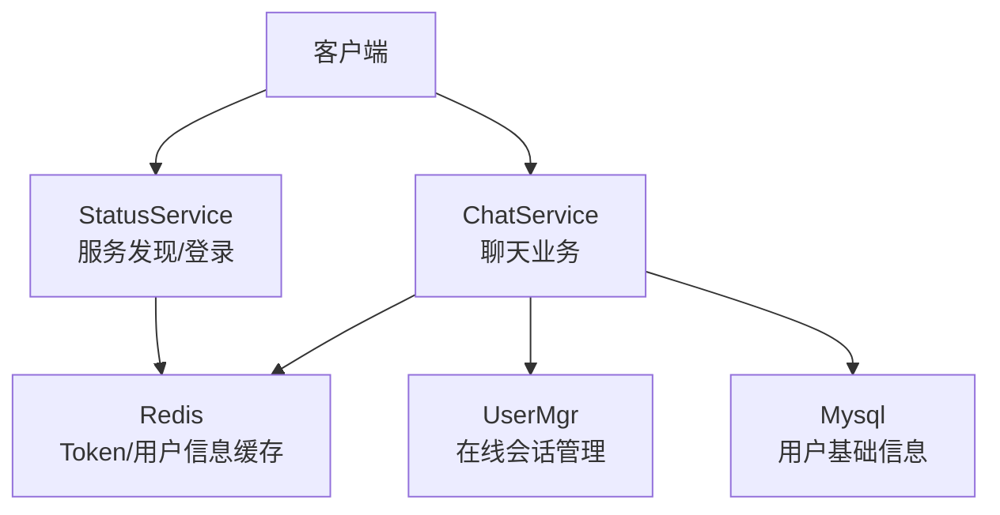
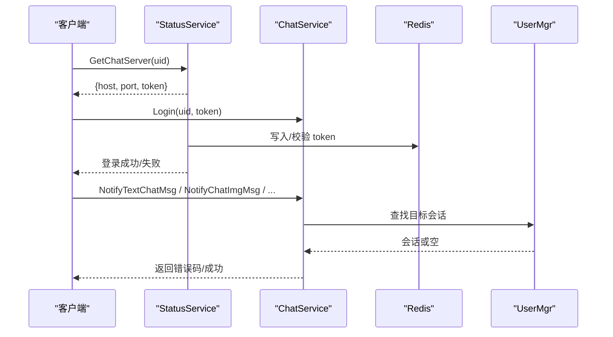
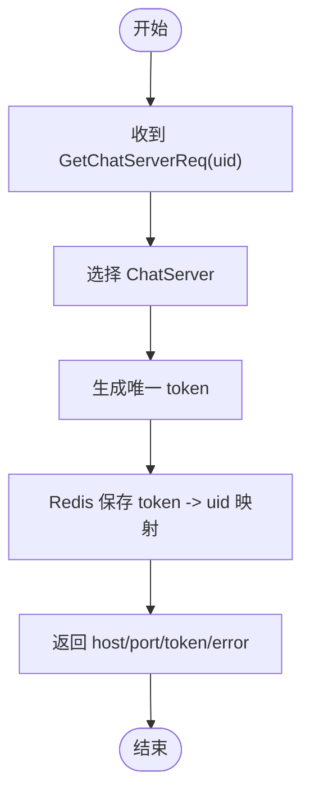
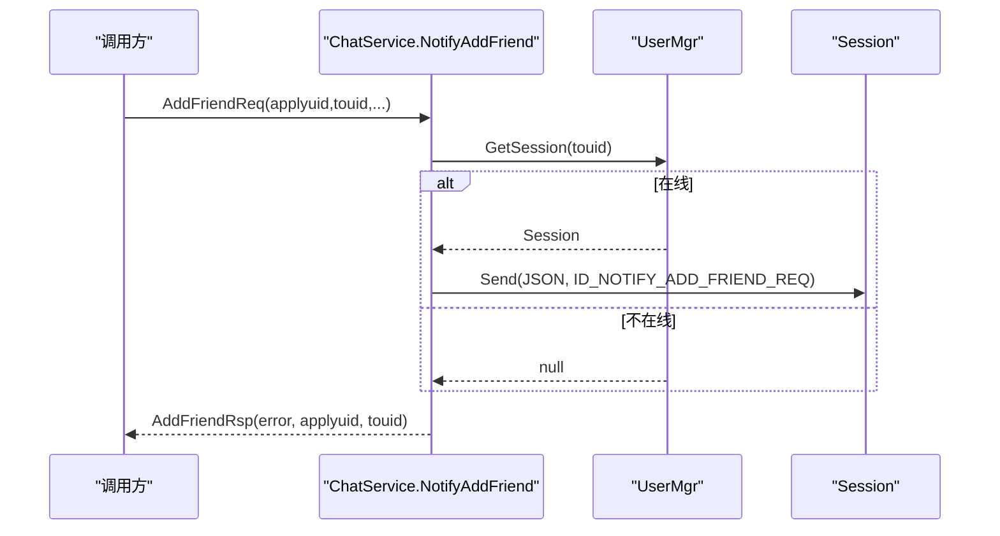
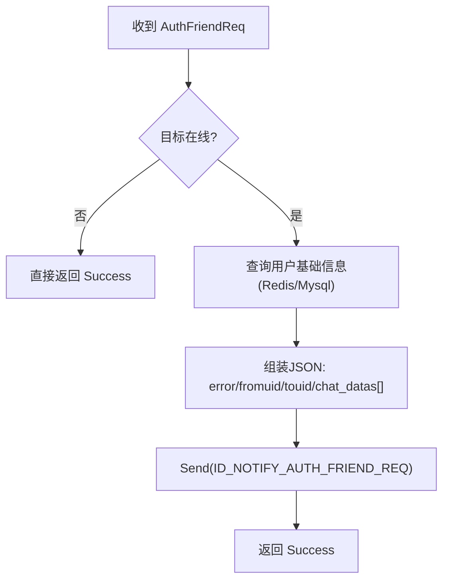
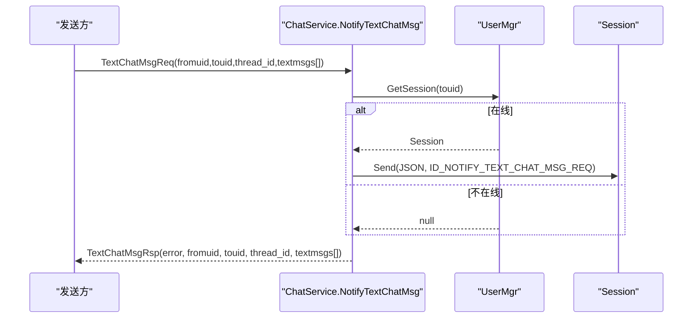
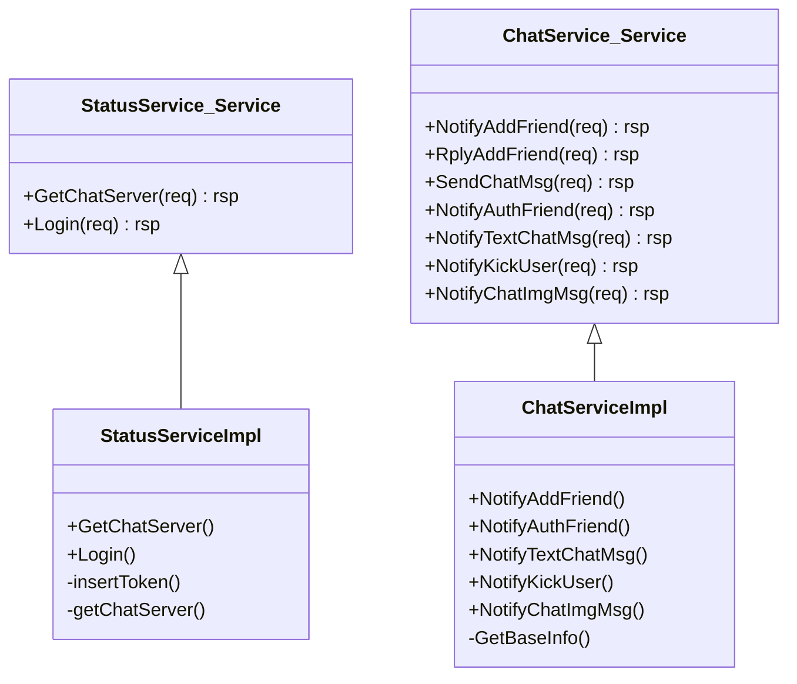

# 聊天消息协议

<cite>
**本文引用的文件**   
- [message.proto](file://server/proto/chat/message.proto)
- [StatusServiceImpl.cpp](file://server/StatusServer/src/StatusServiceImpl.cpp)
- [StatusServiceImpl.h](file://server/StatusServer/include/StatusServiceImpl.h)
- [ChatServiceImpl.cpp](file://server/ChatServer/src/ChatServiceImpl.cpp)
- [ChatServiceImpl.h](file://server/ChatServer/include/ChatServiceImpl.h)
- [const.h（ChatServer）](file://server/ChatServer/include/const.h)
</cite>

## 目录
1. [简介](#简介)
2. [项目结构](#项目结构)
3. [核心组件](#核心组件)
4. [架构总览](#架构总览)
5. [详细组件分析](#详细组件分析)
6. [依赖关系分析](#依赖关系分析)
7. [性能考虑](#性能考虑)
8. [故障排查指南](#故障排查指南)
9. [结论](#结论)
10. [附录：客户端与服务端实现示例与最佳实践](#附录客户端与服务端实现示例与最佳实践)

## 简介
本文件为 LLFCChat 项目的聊天消息协议文档，聚焦于 chat/message.proto 中定义的消息类型与服务接口。内容涵盖：
- StatusService 的服务发现与登录认证流程（GetChatServer、Login）
- ChatService 的 RPC 方法族：好友申请通知、回复、文本聊天推送、图片消息通知、踢人通知等
- 请求/响应消息字段说明（uid、token、message、thread_id 等关键字段）
- 序列化/反序列化约定、错误码规范与异常处理机制
- 客户端与服务端的典型使用场景与实现要点（连接建立、发送接收、错误重试）

## 项目结构
与聊天协议相关的代码主要位于 server 子模块：
- 协议定义：server/proto/chat/message.proto
- 状态服务（StatusServer）：负责服务发现与登录校验
- 聊天服务（ChatServer）：负责聊天相关业务逻辑与消息转发
- 常量与错误码：server/ChatServer/include/const.h

图表来源
- [message.proto:1-167](file://server/proto/chat/message.proto#L1-L167)
- [StatusServiceImpl.cpp:17-27](file://server/StatusServer/src/StatusServiceImpl.cpp#L17-L27)
- [ChatServiceImpl.cpp:16-47](file://server/ChatServer/src/ChatServiceImpl.cpp#L16-L47)

章节来源
- [message.proto:1-167](file://server/proto/chat/message.proto#L1-L167)
- [StatusServiceImpl.h:1-52](file://server/StatusServer/include/StatusServiceImpl.h#L1-L52)
- [ChatServiceImpl.h:1-55](file://server/ChatServer/include/ChatServiceImpl.h#L1-L55)

## 核心组件
- 协议定义（Proto）
  - 包名：message
  - 服务：StatusService、ChatService
  - 消息：GetChatServerReq/Rsp、LoginReq/Rsp、AddFriendReq/Rsp、RplyFriendReq/Rsp、SendChatMsgReq/Rsp、AuthFriendReq/Rsp、TextChatMsgReq/Rsp、KickUserReq/Rsp、NotifyChatImgReq/Rsp 等
- 状态服务（StatusService）
  - GetChatServer：根据 uid 返回 ChatServer 地址与一次性 token
  - Login：校验 token 与 uid 一致性，通过后允许进入聊天服务
- 聊天服务（ChatService）
  - NotifyAddFriend：向目标用户推送好友申请
  - RplyAddFriend：处理好友申请回复（由调用方实现，此处仅定义）
  - SendChatMsg：发送聊天消息（由调用方实现，此处仅定义）
  - NotifyAuthFriend：推送好友认证结果及历史消息
  - NotifyTextChatMsg：推送文本聊天消息
  - NotifyKickUser：踢出指定用户
  - NotifyChatImgMsg：推送图片消息下载通知

章节来源
- [message.proto:1-167](file://server/proto/chat/message.proto#L1-L167)
- [StatusServiceImpl.cpp:17-27](file://server/StatusServer/src/StatusServiceImpl.cpp#L17-L27)
- [ChatServiceImpl.cpp:16-47](file://server/ChatServer/src/ChatServiceImpl.cpp#L16-L47)

## 架构总览
下图展示客户端通过 StatusService 获取 ChatServer 并登录后，再与 ChatService 交互的整体流程。

图表来源
- [message.proto:19-44](file://server/proto/chat/message.proto#L19-L44)
- [StatusServiceImpl.cpp:17-27](file://server/StatusServer/src/StatusServiceImpl.cpp#L17-L27)
- [ChatServiceImpl.cpp:105-139](file://server/ChatServer/src/ChatServiceImpl.cpp#L105-L139)

## 详细组件分析

### StatusService：服务发现与登录
- GetChatServer
  - 输入：uid
  - 输出：host、port、token、error
  - 行为：从配置中选择 ChatServer，生成唯一 token 并持久化到 Redis，供后续 Login 校验
- Login
  - 输入：uid、token
  - 输出：error、uid、token
  - 行为：在 Redis 中校验 token 是否有效且与 uid 匹配；通过后返回成功

图表来源
- [StatusServiceImpl.cpp:17-27](file://server/StatusServer/src/StatusServiceImpl.cpp#L17-L27)
- [StatusServiceImpl.h:36-50](file://server/StatusServer/include/StatusServiceImpl.h#L36-L50)

章节来源
- [message.proto:19-44](file://server/proto/chat/message.proto#L19-L44)
- [StatusServiceImpl.cpp:17-27](file://server/StatusServer/src/StatusServiceImpl.cpp#L17-L27)
- [StatusServiceImpl.h:36-50](file://server/StatusServer/include/StatusServiceImpl.h#L36-L50)

### ChatService：聊天与好友相关 RPC

#### NotifyAddFriend（好友申请通知）
- 输入：applyuid、name、desc、icon、nick、sex、touid
- 输出：error、applyuid、touid
- 行为：若目标用户在内存中存在，则构造 JSON 并通过内部通道下发 ID_NOTIFY_ADD_FRIEND_REQ 通知

图表来源
- [ChatServiceImpl.cpp:16-47](file://server/ChatServer/src/ChatServiceImpl.cpp#L16-L47)
- [const.h（ChatServer）:49-79](file://server/ChatServer/include/const.h#L49-L79)

章节来源
- [message.proto:46-72](file://server/proto/chat/message.proto#L46-L72)
- [ChatServiceImpl.cpp:16-47](file://server/ChatServer/src/ChatServiceImpl.cpp#L16-L47)

#### RplyAddFriend（好友申请回复）
- 输入：rplyuid、agree、touid
- 输出：error、rplyuid、touid
- 行为：协议已定义，具体实现由调用方完成

章节来源
- [message.proto:62-72](file://server/proto/chat/message.proto#L62-L72)

#### SendChatMsg（发送聊天消息）
- 输入：fromuid、touid、message
- 输出：error、fromuid、touid
- 行为：协议已定义，具体实现由调用方完成

章节来源
- [message.proto:74-84](file://server/proto/chat/message.proto#L74-L84)

#### NotifyAuthFriend（好友认证通知）
- 输入：fromuid、touid、textmsgs[]（含 unique_id、msg_id、thread_id、msgcontent、status）
- 输出：error、fromuid、touid
- 行为：若目标在线，则组装 JSON（包含对方基础信息与历史消息数组），通过 ID_NOTIFY_AUTH_FRIEND_REQ 下发

图表来源
- [ChatServiceImpl.cpp:49-103](file://server/ChatServer/src/ChatServiceImpl.cpp#L49-L103)
- [const.h（ChatServer）:49-79](file://server/ChatServer/include/const.h#L49-L79)

章节来源
- [message.proto:95-105](file://server/proto/chat/message.proto#L95-L105)
- [ChatServiceImpl.cpp:49-103](file://server/ChatServer/src/ChatServiceImpl.cpp#L49-L103)

#### NotifyTextChatMsg（文本聊天消息推送）
- 输入：fromuid、touid、thread_id、textmsgs[]（unique_id、msg_id、msgcontent、chat_time）
- 输出：error、fromuid、touid、thread_id、textmsgs[]
- 行为：若目标在线，则构造 JSON（包含 thread_id 与消息数组），通过 ID_NOTIFY_TEXT_CHAT_MSG_REQ 下发

图表来源
- [ChatServiceImpl.cpp:105-139](file://server/ChatServer/src/ChatServiceImpl.cpp#L105-L139)
- [const.h（ChatServer）:49-79](file://server/ChatServer/include/const.h#L49-L79)

章节来源
- [message.proto:107-127](file://server/proto/chat/message.proto#L107-L127)
- [ChatServiceImpl.cpp:105-139](file://server/ChatServer/src/ChatServiceImpl.cpp#L105-L139)

#### NotifyKickUser（踢人通知）
- 输入：uid
- 输出：error、uid
- 行为：若目标在线，则触发下线通知并清理会话

章节来源
- [message.proto:129-136](file://server/proto/chat/message.proto#L129-L136)
- [ChatServiceImpl.cpp:189-212](file://server/ChatServer/src/ChatServiceImpl.cpp#L189-L212)

#### NotifyChatImgMsg（图片消息通知）
- 输入：from_uid、to_uid、message_id、file_name、total_size、thread_id
- 输出：error、from_uid、to_uid、message_id、file_name、total_size、thread_id
- 行为：若目标在线，则下发图片下载通知；否则仅返回状态

章节来源
- [message.proto:139-156](file://server/proto/chat/message.proto#L139-L156)
- [ChatServiceImpl.cpp:219-241](file://server/ChatServer/src/ChatServiceImpl.cpp#L219-L241)

### 消息结构与关键字段说明
- 通用字段
  - error：错误码，0 表示成功；非 0 表示失败原因
  - uid/fromuid/touid：用户标识
  - token：一次性令牌，用于登录校验
  - message/thread_id：聊天内容与会话线程标识
- 好友相关
  - AddFriendReq/Rsp：申请人与被申请人的基本信息与结果
  - RplyFriendReq/Rsp：申请人对好友申请的同意/拒绝
- 聊天相关
  - TextChatData：单条文本消息（unique_id、msg_id、msgcontent、chat_time）
  - TextChatMsgReq/Rsp：批量文本消息推送与确认
  - NotifyChatImgReq/Rsp：图片消息元数据（文件名、大小、thread_id）

章节来源
- [message.proto:1-167](file://server/proto/chat/message.proto#L1-L167)

## 依赖关系分析
- 协议层：message.proto 定义所有 RPC 方法与消息结构
- 状态服务：StatusServiceImpl 依赖配置与 Redis，提供 GetChatServer 与 Login
- 聊天服务：ChatServiceImpl 依赖 UserMgr、Redis、Mysql，实现消息转发与用户信息查询
- 常量与错误码：const.h 统一错误码、消息 ID、键前缀等

图表来源
- [message.proto:1-167](file://server/proto/chat/message.proto#L1-L167)
- [StatusServiceImpl.h:36-50](file://server/StatusServer/include/StatusServiceImpl.h#L36-L50)
- [ChatServiceImpl.h:29-53](file://server/ChatServer/include/ChatServiceImpl.h#L29-L53)

章节来源
- [StatusServiceImpl.h:1-52](file://server/StatusServer/include/StatusServiceImpl.h#L1-L52)
- [ChatServiceImpl.h:1-55](file://server/ChatServer/include/ChatServiceImpl.h#L1-L55)
- [message.proto:1-167](file://server/proto/chat/message.proto#L1-L167)

## 性能考虑
- 连接与会话
  - 仅在目标在线时进行消息下发，避免无效网络开销
  - 使用异步 IO 与队列限制（MAX_SENDQUE/MAX_RECVQUE）控制背压
- 缓存与存储
  - 用户基础信息优先查 Redis，未命中再回源 MySQL，降低数据库压力
  - Token 与登录计数等热点数据落 Redis，提升鉴权与路由效率
- 序列化
  - 服务端将 Proto 转换为 JSON 下发至客户端，注意避免频繁大对象拼装

[本节为通用指导，无需特定文件引用]

## 故障排查指南
- 常见错误码
  - Success=0：成功
  - Error_Json=1001：JSON 解析错误
  - RPCFailed=1002：RPC 请求错误
  - VarifyExpired=1003：验证码过期
  - VarifyCodeErr=1004：验证码错误
  - UserExist=1005：用户已存在
  - PasswdErr=1006：密码错误
  - EmailNotMatch=1007：邮箱不匹配
  - PasswdUpFailed=1008：更新密码失败
  - PasswdInvalid=1009：密码更新失败
  - TokenInvalid=1010：Token 失效
  - UidInvalid=1011：UID 无效
  - CREATE_CHAT_FAILED=1012：创建聊天失败
  - LOAD_CHAT_FAILED=1013：加载聊天失败
- 定位建议
  - 检查 error 字段是否为 0
  - 核对 uid/token 是否一致且未过期
  - 确认目标用户是否在线（会话是否存在）
  - 查看 Redis/Mysql 数据一致性
  - 关注消息 ID 与线程 ID 是否正确传递

章节来源
- [const.h（ChatServer）:5-20](file://server/ChatServer/include/const.h#L5-L20)
- [StatusServiceImpl.cpp:94-116](file://server/StatusServer/src/StatusServiceImpl.cpp#L94-L116)

## 结论
LLFCChat 的聊天协议以 Proto 为中心，结合 StatusService 与 ChatService 分工明确：前者负责服务发现与登录鉴权，后者负责聊天与好友相关消息分发。通过 Redis/Mysql 缓存与在线会话管理，实现了高效可靠的消息推送。遵循统一的错误码与消息结构，便于客户端稳定集成与问题定位。

[本节为总结性内容，无需特定文件引用]

## 附录：客户端与服务端实现示例与最佳实践

### 客户端接入流程（示例步骤）
- 服务发现
  - 调用 StatusService.GetChatServer(uid)，获取 host、port、token
- 登录认证
  - 调用 StatusService.Login(uid, token)，成功后方可连接 ChatService
- 聊天通信
  - 使用 ChatService.NotifyTextChatMsg 推送文本消息
  - 使用 ChatService.NotifyChatImgMsg 推送图片消息
  - 使用 ChatService.NotifyAddFriend/NotifyAuthFriend 处理好友流程
- 错误重试
  - 当 error≠0 或网络异常时，按指数退避重试
  - 对 TokenInvalid/UIdInvalid 等错误，重新执行服务发现与登录

章节来源
- [message.proto:19-44](file://server/proto/chat/message.proto#L19-L44)
- [StatusServiceImpl.cpp:17-27](file://server/StatusServer/src/StatusServiceImpl.cpp#L17-L27)
- [ChatServiceImpl.cpp:105-139](file://server/ChatServer/src/ChatServiceImpl.cpp#L105-L139)

### 服务端处理要点（示例步骤）
- 服务发现
  - 从配置读取 ChatServer 列表，选择合适节点并生成 token 存入 Redis
- 登录校验
  - 校验 token 与 uid 一致性，通过后允许进入聊天服务
- 消息转发
  - 根据 touid/fromuid 查找在线会话，构造 JSON 并通过内部消息 ID 下发
- 资源加载
  - 用户基础信息优先 Redis，未命中再查 Mysql，并回填缓存

章节来源
- [StatusServiceImpl.cpp:17-27](file://server/StatusServer/src/StatusServiceImpl.cpp#L17-L27)
- [ChatServiceImpl.cpp:142-187](file://server/ChatServer/src/ChatServiceImpl.cpp#L142-L187)
- [const.h（ChatServer）:49-79](file://server/ChatServer/include/const.h#L49-L79)

### 消息序列化与反序列化约定
- 协议层：使用 protobuf 进行 RPC 编解码
- 应用层：服务端将业务数据组织为 JSON 下发给客户端，客户端需按约定字段解析
- 关键字段
  - error：错误码
  - uid/fromuid/touid：用户标识
  - thread_id：会话线程
  - unique_id/msg_id：消息唯一标识
  - msgcontent/chat_time：文本内容与时间戳
  - file_name/total_size：图片资源元数据

章节来源
- [message.proto:1-167](file://server/proto/chat/message.proto#L1-L167)
- [ChatServiceImpl.cpp:105-139](file://server/ChatServer/src/ChatServiceImpl.cpp#L105-L139)