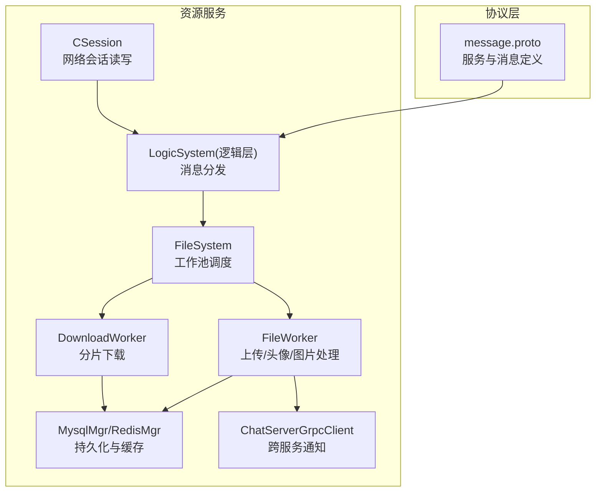
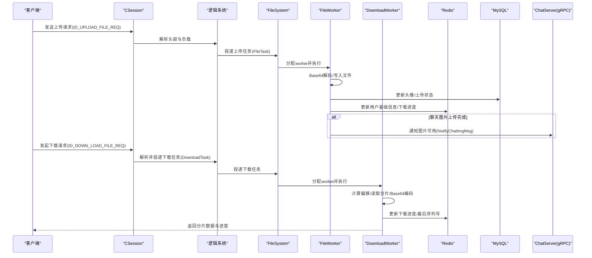
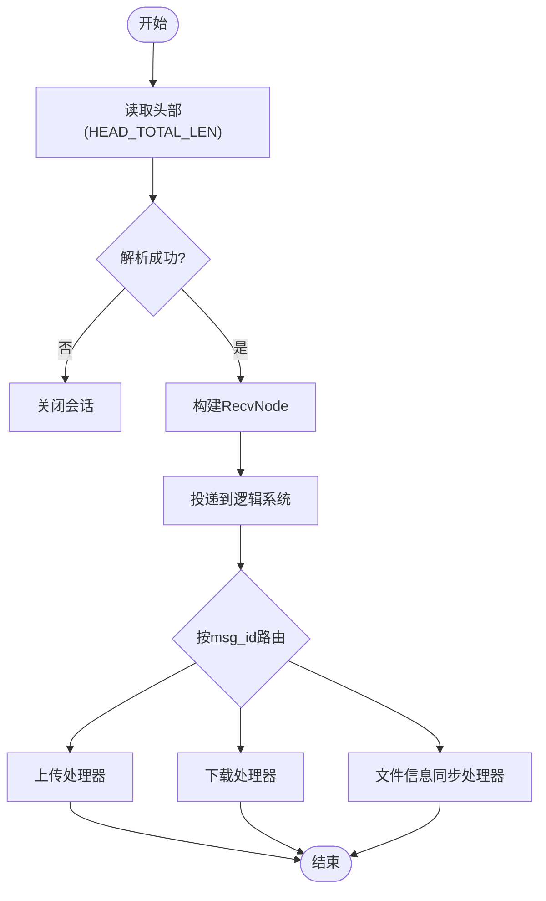
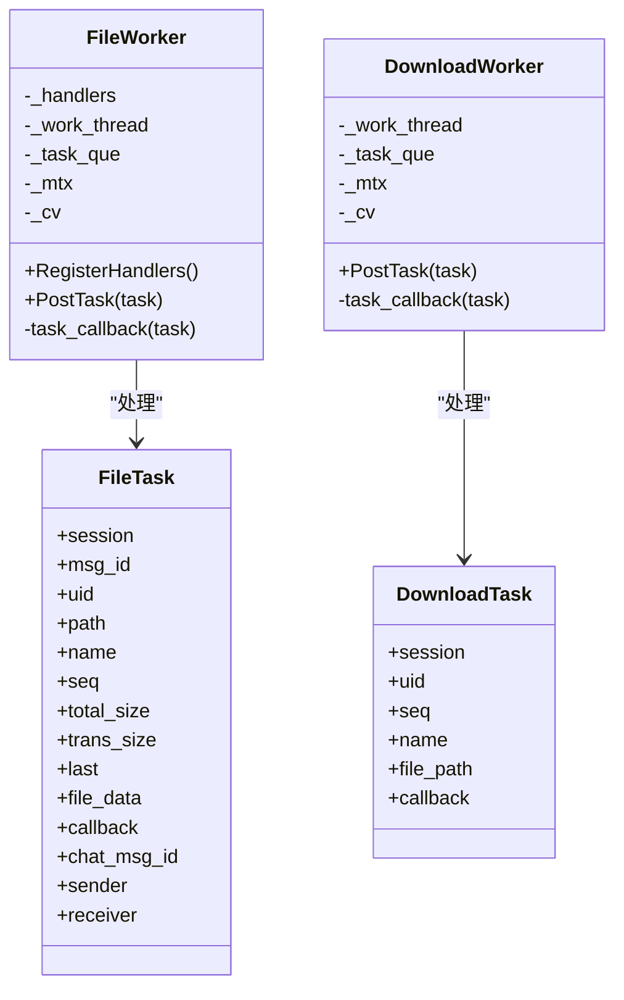
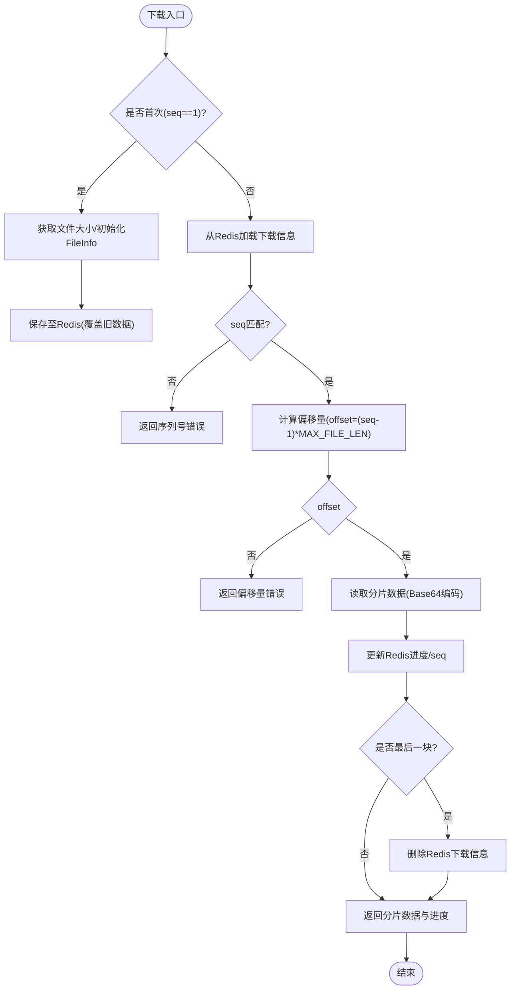
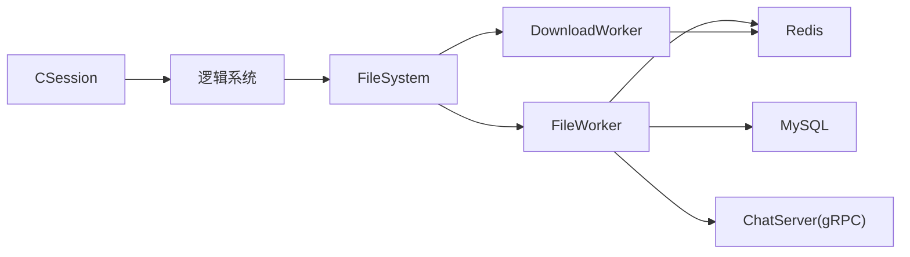

# 资源管理协议

<cite>
**本文引用的文件**
- [server/proto/resource/message.proto](file://server/proto/resource/message.proto)
- [server/ResourceServer/include/FileWorker.h](file://server/ResourceServer/include/FileWorker.h)
- [server/ResourceServer/src/FileWorker.cpp](file://server/ResourceServer/src/FileWorker.cpp)
- [server/ResourceServer/include/FileSystem.h](file://server/ResourceServer/include/FileSystem.h)
- [server/ResourceServer/src/FileSystem.cpp](file://server/ResourceServer/src/FileSystem.cpp)
- [server/ResourceServer/include/FileInfo.h](file://server/ResourceServer/include/FileInfo.h)
- [server/ResourceServer/include/const.h](file://server/ResourceServer/include/const.h)
- [server/ResourceServer/src/CSession.cpp](file://server/ResourceServer/src/CSession.cpp)
- [开发文档/day31-文件传输.md](file://开发文档/day31-文件传输.md)
- [开发文档/day38-断点续传.md](file://开发文档/day38-断点续传.md)
- [开发文档/day40-聊天图片资源续传和进度显示.md](file://开发文档/day40-聊天图片资源续传和进度显示.md)
</cite>

## 目录
1. [简介](#简介)
2. [项目结构](#项目结构)
3. [核心组件](#核心组件)
4. [架构总览](#架构总览)
5. [详细组件分析](#详细组件分析)
6. [依赖关系分析](#依赖关系分析)
7. [性能考量](#性能考量)
8. [故障排查指南](#故障排查指南)
9. [结论](#结论)
10. [附录](#附录)

## 简介
本文件为 LLFCChat 项目的“资源管理协议”与实现说明，聚焦于资源服务在文件上传/下载、头像管理、聊天图片资源等场景中的协议定义、RPC/消息处理流程、分片与断点续传、并发控制、存储策略、权限与安全、缓存策略以及性能优化与监控指标。内容基于仓库中资源服务的 C++ 实现与相关开发文档进行系统化整理，帮助读者快速理解并正确集成资源管理能力。

## 项目结构
资源管理相关代码主要位于 ResourceServer 模块与 proto 定义中：
- 协议定义：server/proto/resource/message.proto（包含状态、聊天、校验等服务及消息）
- 资源服务核心：
  - 网络会话与收发：CSession
  - 任务调度与工作者：FileWorker、DownloadWorker、FileSystem
  - 文件信息模型：FileInfo、ChatImgInfo
  - 常量与错误码：const.h
- 开发文档：day31、day38、day40 系列文档描述了文件传输、断点续传、聊天图片资源续传与进度显示的实现思路与交互流程。

图表来源
- [server/proto/resource/message.proto:1-169](file://server/proto/resource/message.proto#L1-L169)
- [server/ResourceServer/src/CSession.cpp:120-182](file://server/ResourceServer/src/CSession.cpp#L120-L182)
- [server/ResourceServer/include/FileSystem.h:1-21](file://server/ResourceServer/include/FileSystem.h#L1-L21)
- [server/ResourceServer/include/FileWorker.h:1-90](file://server/ResourceServer/include/FileWorker.h#L1-L90)
- [server/ResourceServer/src/FileWorker.cpp:49-458](file://server/ResourceServer/src/FileWorker.cpp#L49-L458)

章节来源
- [server/proto/resource/message.proto:1-169](file://server/proto/resource/message.proto#L1-L169)
- [server/ResourceServer/include/FileSystem.h:1-21](file://server/ResourceServer/include/FileSystem.h#L1-L21)
- [server/ResourceServer/include/FileWorker.h:1-90](file://server/ResourceServer/include/FileWorker.h#L1-L90)
- [server/ResourceServer/src/CSession.cpp:120-182](file://server/ResourceServer/src/CSession.cpp#L120-L182)

## 核心组件
- 协议与消息
  - 资源服务通过自定义 TCP 长连接协议进行分片传输，消息头包含 ID 与长度，负载为 JSON 数据；同时使用 gRPC 进行跨服务通知（如 ChatServer）。
  - 关键消息 ID 包括：ID_UPLOAD_FILE_REQ/RSP、ID_IMG_CHAT_UPLOAD_REQ/RSP、ID_IMG_CHAT_CONTINUE_UPLOAD_REQ/RSP、ID_FILE_INFO_SYNC_REQ/RSP、ID_DOWN_LOAD_FILE_REQ/RSP 等。
- 会话与网络
  - CSession 负责读取固定长度的头部（ID+Length），解析后投递到逻辑系统，再根据业务路由到文件系统或下载队列。
- 任务与工作线程
  - FileSystem 维护 FileWorker 与 DownloadWorker 的线程池，按 session 哈希或文件名哈希将任务分配到固定 worker，保证同一文件的有序性。
  - FileWorker 注册多种处理器：普通文件上传、头像上传、聊天图片上传、文件信息同步、续传图片上传等。
  - DownloadWorker 实现分片下载、断点续传、进度更新与完成清理。
- 数据模型
  - FileInfo：记录文件名、路径、总大小、已传输大小、当前序列号等。
  - ChatImgInfo：记录发送者、接收者、消息 ID、图片名等。
- 存储与缓存
  - 本地文件系统用于落盘；Redis 用于存储下载进度、用户基础信息等；MySQL 用于持久化用户信息与上传状态。
- 安全与权限
  - 错误码集中管理；登录态与 Token 校验由上层服务提供；IP 在线状态通过 Redis 判断是否可推送通知。

章节来源
- [server/ResourceServer/include/const.h:5-117](file://server/ResourceServer/include/const.h#L5-L117)
- [server/ResourceServer/src/CSession.cpp:127-182](file://server/ResourceServer/src/CSession.cpp#L127-L182)
- [server/ResourceServer/include/FileWorker.h:14-56](file://server/ResourceServer/include/FileWorker.h#L14-L56)
- [server/ResourceServer/include/FileInfo.h:1-26](file://server/ResourceServer/include/FileInfo.h#L1-L26)

## 架构总览
资源服务采用“网络会话 + 逻辑分发 + 文件工作者 + 下载工作者”的分层架构，结合 Redis 与 MySQL 提供状态与持久化能力，并通过 gRPC 与 ChatServer 协作完成聊天图片的异步通知。

图表来源
- [server/ResourceServer/src/CSession.cpp:127-182](file://server/ResourceServer/src/CSession.cpp#L127-L182)
- [server/ResourceServer/src/FileWorker.cpp:49-458](file://server/ResourceServer/src/FileWorker.cpp#L49-L458)
- [server/ResourceServer/src/FileWorker.cpp:528-662](file://server/ResourceServer/src/FileWorker.cpp#L528-L662)
- [server/ResourceServer/include/FileSystem.h:1-21](file://server/ResourceServer/include/FileSystem.h#L1-L21)

## 详细组件分析

### 协议与消息定义
- 资源服务使用自定义 TCP 协议，消息体为 JSON，字段包括：
  - 上传类：name、seq、trans_size、total_size、last、data、md5、uid、chat_msg_id、sender、receiver 等
  - 下载类：name、seq、is_last、total_size、current_size、data
  - 聊天图片通知：from_uid、to_uid、message_id、file_name、total_size、thread_id
- gRPC 消息用于跨服务通知（如 NotifyChatImgReq/Rsp），确保接收端在线时即时推送。

章节来源
- [server/proto/resource/message.proto:1-169](file://server/proto/resource/message.proto#L1-L169)
- [server/ResourceServer/include/const.h:72-95](file://server/ResourceServer/include/const.h#L72-L95)

### 网络会话与消息路由
- CSession 读取固定长度的头部（ID=2字节，Length=4字节），校验合法性后构造 RecvNode 并投递到逻辑系统。
- 逻辑系统根据 msg_id 选择对应处理器，并将任务投递到 FileSystem 的工作队列。

图表来源
- [server/ResourceServer/src/CSession.cpp:127-182](file://server/ResourceServer/src/CSession.cpp#L127-L182)

章节来源
- [server/ResourceServer/src/CSession.cpp:127-182](file://server/ResourceServer/src/CSession.cpp#L127-L182)

### 文件工作者与上传流程
- FileWorker 支持多种上传类型：
  - 普通文件上传：ID_UPLOAD_FILE_REQ
  - 头像上传：ID_UPLOAD_HEAD_ICON_REQ（完成后更新用户头像并刷新 Redis 缓存）
  - 聊天图片上传：ID_IMG_CHAT_UPLOAD_REQ（完成后更新数据库状态，若接收方在线则通过 gRPC 通知）
  - 文件信息同步：ID_FILE_INFO_SYNC_REQ
  - 续传图片上传：ID_IMG_CHAT_CONTINUE_UPLOAD_REQ
- 每个处理器均执行 Base64 解码、目录检查与创建、二进制写入、错误码返回与回调。

图表来源
- [server/ResourceServer/include/FileWorker.h:14-90](file://server/ResourceServer/include/FileWorker.h#L14-L90)
- [server/ResourceServer/src/FileWorker.cpp:49-458](file://server/ResourceServer/src/FileWorker.cpp#L49-L458)

章节来源
- [server/ResourceServer/src/FileWorker.cpp:49-458](file://server/ResourceServer/src/FileWorker.cpp#L49-L458)

### 下载工作者与断点续传
- DownloadWorker 实现分片下载：
  - 首次下载：获取文件大小，初始化 FileInfo 并写入 Redis（覆盖旧数据，设置过期时间）
  - 续传下载：从 Redis 读取历史进度，校验 seq 与偏移量，定位文件偏移读取指定分片
  - 每片返回：Base64 编码的数据、seq、total_size、current_size、is_last
  - 完成清理：最后一个分片完成后删除 Redis 中的下载信息
- 错误处理：文件不存在、读取失败、Redis 读取失败、序列号不匹配、偏移量越界等均有明确错误码。

图表来源
- [server/ResourceServer/src/FileWorker.cpp:528-662](file://server/ResourceServer/src/FileWorker.cpp#L528-L662)

章节来源
- [server/ResourceServer/src/FileWorker.cpp:528-662](file://server/ResourceServer/src/FileWorker.cpp#L528-L662)

### 文件系统与并发控制
- FileSystem 作为单例，维护多个 FileWorker 与 DownloadWorker 实例，形成线程池。
- 任务分配策略：
  - 上传：按 session_id 哈希分配到固定 worker，保证同一会话的有序性
  - 下载：按文件名哈希分配到固定 worker，保证同一文件的有序性
- 并发度：FILE_WORKER_COUNT 与 DOWN_LOAD_WORKER_COUNT 均为 4，可根据硬件调整。

章节来源
- [server/ResourceServer/include/FileSystem.h:1-21](file://server/ResourceServer/include/FileSystem.h#L1-L21)
- [server/ResourceServer/src/FileSystem.cpp:1-29](file://server/ResourceServer/src/FileSystem.cpp#L1-L29)
- [server/ResourceServer/include/const.h:63-69](file://server/ResourceServer/include/const.h#L63-L69)

### 存储策略与缓存
- 本地文件系统：二进制写入，首包 trunc，后续 append，自动创建目录。
- Redis：
  - 下载进度：SetDownLoadInfo/GetDownloadInfo/DelDownLoadInfo
  - 用户基础信息：USER_BASE_INFO + uid，头像更新后刷新
  - IP 在线状态：USERIPPREFIX + uid，用于判断是否推送通知
- MySQL：
  - 用户信息：头像路径、密码、昵称等
  - 聊天图片上传状态：UpdateUploadStatus

章节来源
- [server/ResourceServer/src/FileWorker.cpp:114-196](file://server/ResourceServer/src/FileWorker.cpp#L114-L196)
- [server/ResourceServer/src/FileWorker.cpp:198-283](file://server/ResourceServer/src/FileWorker.cpp#L198-L283)
- [server/ResourceServer/include/const.h:97-106](file://server/ResourceServer/include/const.h#L97-L106)

### 权限控制与安全验证
- 错误码集中管理，涵盖 JSON 解析、RPC 失败、Token 失效、文件权限、Redis 操作等。
- 登录态与 Token：由上游服务（如 GateServer/VerifyServer）提供，资源服务通过 Redis 校验 token 与用户在线状态。
- 访问控制：仅允许已认证用户进行上传/下载；头像更新需校验 uid 与 token。

章节来源
- [server/ResourceServer/include/const.h:5-29](file://server/ResourceServer/include/const.h#L5-L29)

### 完整实现示例（大文件上传/下载、进度显示、错误恢复）
- 大文件上传：
  - 客户端分片发送，携带 name、seq、trans_size、total_size、last、data
  - 服务器逐片写入，最后一片触发状态更新与通知
- 断点续传：
  - 客户端暂停/继续，服务端通过 Redis 记录进度，客户端根据 last_confirmed_seq 继续发送
- 进度显示：
  - 客户端 UI 层根据回包的 seq、total_size、current_size 更新进度条
- 错误恢复：
  - 网络异常时重试，Redis 中无进度则从头开始；序列号不匹配则报错并提示重新上传

章节来源
- [开发文档/day31-文件传输.md:1-779](file://开发文档/day31-文件传输.md#L1-L779)
- [开发文档/day38-断点续传.md:1-800](file://开发文档/day38-断点续传.md#L1-L800)
- [开发文档/day40-聊天图片资源续传和进度显示.md:1-800](file://开发文档/day40-聊天图片资源续传和进度显示.md#L1-L800)

## 依赖关系分析
资源服务内部组件耦合清晰，职责分离：
- CSession 仅负责网络 I/O，不关心业务逻辑
- 逻辑系统负责路由，将任务投递给 FileSystem
- FileSystem 管理 FileWorker/DownloadWorker，屏蔽线程细节
- FileWorker/DownloadWorker 专注文件操作与状态更新
- 外部依赖：Redis、MySQL、gRPC（ChatServer）

图表来源
- [server/ResourceServer/src/CSession.cpp:120-182](file://server/ResourceServer/src/CSession.cpp#L120-L182)
- [server/ResourceServer/include/FileSystem.h:1-21](file://server/ResourceServer/include/FileSystem.h#L1-L21)
- [server/ResourceServer/include/FileWorker.h:1-90](file://server/ResourceServer/include/FileWorker.h#L1-L90)

章节来源
- [server/ResourceServer/src/CSession.cpp:120-182](file://server/ResourceServer/src/CSession.cpp#L120-L182)
- [server/ResourceServer/include/FileSystem.h:1-21](file://server/ResourceServer/include/FileSystem.h#L1-L21)
- [server/ResourceServer/include/FileWorker.h:1-90](file://server/ResourceServer/include/FileWorker.h#L1-L90)

## 性能考量
- 分片大小：MAX_FILE_LEN = 32KB，平衡内存占用与网络开销
- 并发度：FILE_WORKER_COUNT 与 DOWN_LOAD_WORKER_COUNT 可调，建议与 CPU 核数匹配
- 序列化：Base64 编解码带来额外开销，建议在客户端压缩后再编码
- I/O 模式：二进制直写，避免频繁小文件 IO
- 缓存命中：Redis 用于下载进度与用户信息，减少数据库压力
- 背压控制：发送队列限制 MAX_SENDQUE，防止内存溢出

[本节为通用指导，无需特定文件引用]

## 故障排查指南
- 常见问题与错误码：
  - FileNotExists：文件不存在
  - FileWritePermissionFailed：写入权限不足
  - FileReadPermissionFailed：读取权限不足
  - FileSeqInvalid：序列号不匹配
  - FileOffsetInvalid：偏移量越界
  - RedisReadErr：Redis 读取失败
- 排查步骤：
  - 检查日志输出（文件路径、错误码、序列号）
  - 确认 Redis 中是否存在下载进度或用户信息
  - 验证 MySQL 中上传状态是否更新
  - 检查 gRPC 通知是否成功（接收方在线状态）

章节来源
- [server/ResourceServer/include/const.h:5-29](file://server/ResourceServer/include/const.h#L5-L29)
- [server/ResourceServer/src/FileWorker.cpp:528-662](file://server/ResourceServer/src/FileWorker.cpp#L528-L662)

## 结论
LLFCChat 的资源管理协议与服务实现提供了完整的文件上传/下载、头像管理、聊天图片资源处理能力，具备分片传输、断点续传、并发控制、缓存与持久化、跨服务通知等特性。通过清晰的组件分层与错误码体系，系统具备良好的可维护性与扩展性。在实际部署中，建议根据硬件与业务负载调整并发度与分片大小，并结合监控指标持续优化性能。

[本节为总结，无需特定文件引用]

## 附录
- 关键消息 ID 列表：
  - ID_UPLOAD_FILE_REQ/RSP：普通文件上传
  - ID_UPLOAD_HEAD_ICON_REQ/RSP：头像上传
  - ID_IMG_CHAT_UPLOAD_REQ/RSP：聊天图片上传
  - ID_IMG_CHAT_CONTINUE_UPLOAD_REQ/RSP：聊天图片续传
  - ID_FILE_INFO_SYNC_REQ/RSP：文件信息同步
  - ID_DOWN_LOAD_FILE_REQ/RSP：文件下载
- 关键常量：
  - MAX_FILE_LEN：分片大小（32KB）
  - FILE_WORKER_COUNT/DOWN_LOAD_WORKER_COUNT：工作线程数（4）
  - HEAD_TOTAL_LEN/HEAD_ID_LEN/HEAD_DATA_LEN：消息头长度

章节来源
- [server/ResourceServer/include/const.h:72-114](file://server/ResourceServer/include/const.h#L72-L114)