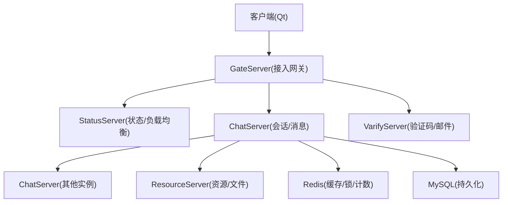
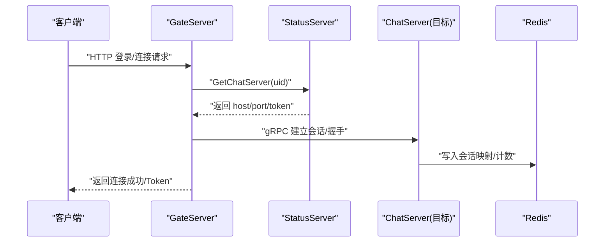
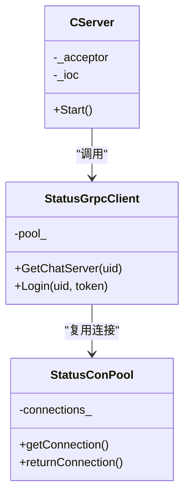
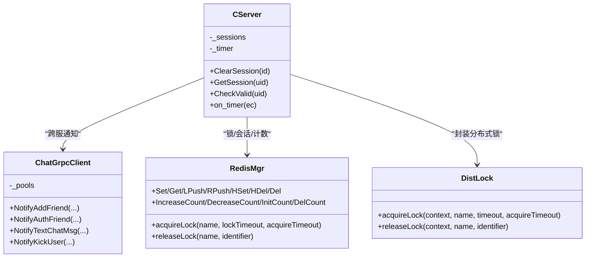
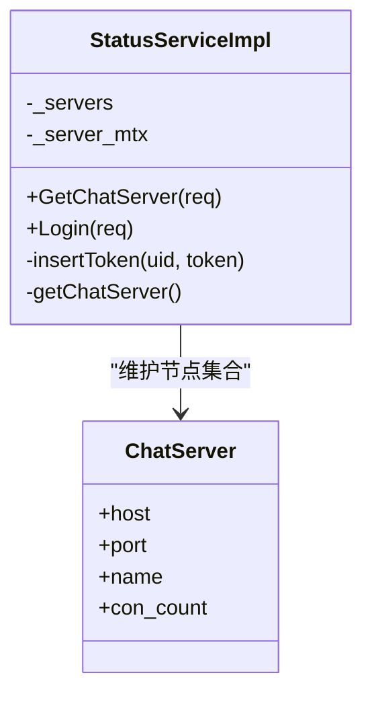
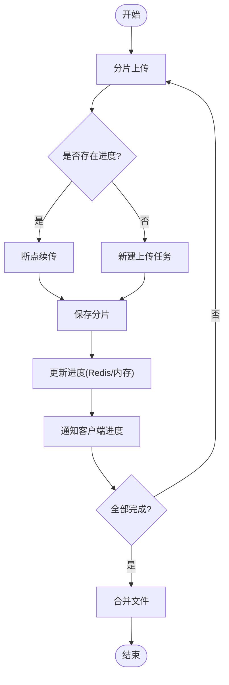
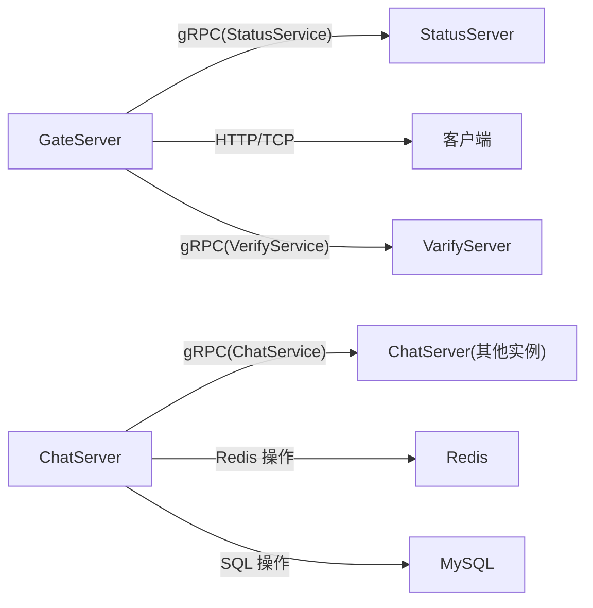
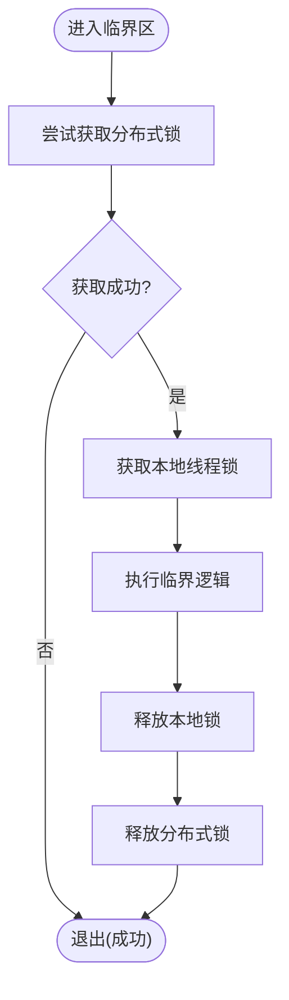

# 分布式系统

<cite>
**本文引用的文件**
- [README.md](file://README.md)
- [CMakeLists.txt](file://CMakeLists.txt)
- [chat.proto](file://proto/chat_service/chat.proto)
- [status.proto](file://proto/status_service/status.proto)
- [StatusServiceImpl.h](file://server/StatusServer/include/StatusServiceImpl.h)
- [DistLock.h](file://server/ChatServer/include/DistLock.h)
- [RedisMgr.h](file://server/ChatServer/include/RedisMgr.h)
- [StatusGrpcClient.h](file://server/GateServer/include/StatusGrpcClient.h)
- [ChatGrpcClient.h](file://server/ChatServer/include/ChatGrpcClient.h)
- [CServer.h（Gate）](file://server/GateServer/include/CServer.h)
- [CServer.h（Chat）](file://server/ChatServer/include/CServer.h)
- [day27-分布式服务设计.md](file://开发文档/day27-分布式服务设计.md)
- [day35心跳逻辑.md](file://开发文档/day35心跳逻辑.md)
- [day38-断点续传.md](file://开发文档/day38-断点续传.md)
- [day08-邮箱认证服务.md](file://开发文档/day08-邮箱认证服务.md)
- [day14-登录功能.md](file://开发文档/day14-登录功能.md)
- [StatusServer CMakeLists.txt](file://server/StatusServer/CMakeLists.txt)
</cite>

## 目录
1. [简介](#简介)
2. [项目结构](#项目结构)
3. [核心组件](#核心组件)
4. [架构总览](#架构总览)
5. [详细组件分析](#详细组件分析)
6. [依赖关系分析](#依赖关系分析)
7. [性能与可扩展性](#性能与可扩展性)
8. [故障转移与高可用](#故障转移与高可用)
9. [分布式锁与死锁处理](#分布式锁与死锁处理)
10. [配置管理与服务发现](#配置管理与服务发现)
11. [安全、监控与灾难恢复](#安全监控与灾难恢复)
12. [部署拓扑与基础设施](#部署拓扑与基础设施)
13. [结论](#结论)

## 简介
本架构文档面向 LLFCChat 分布式聊天系统，聚焦负载均衡、故障转移与分布式协调的高层设计。系统由 GateServer（接入网关）、ChatServer（会话与消息转发）、StatusServer（状态与负载均衡）、ResourceServer（资源与文件传输）、VarifyServer（验证码与邮件）以及 Redis、MySQL 等基础设施组成。通过 gRPC 实现服务间通信，使用 Redis 完成分布式锁与会话/计数共享，结合 Asio IO 池提升并发能力，形成可扩展、高可用的即时通讯平台。

## 项目结构
- 客户端：Qt + Boost.Asio/Beast，负责 TCP/HTTP 交互与 UI。
- 服务端：
  - GateServer：HTTP/TCP 接入，鉴权后路由到 ChatServer。
  - ChatServer：用户会话管理、消息转发、跨服通知、踢人逻辑。
  - StatusServer：维护各 ChatServer 的连接数与健康状态，提供负载均衡决策。
  - ResourceServer：文件上传/下载、分片与断点续传。
  - VarifyServer：Node.js 实现的验证码与邮件发送。
- 协议定义：gRPC proto 定义 chat_service 与 status_service。
- 构建系统：CMake + vcpkg，统一依赖与代码生成。

**图表来源**
- [chat.proto:1-105](file://proto/chat_service/chat.proto#L1-L105)
- [status.proto:1-32](file://proto/status_service/status.proto#L1-L32)
- [StatusServiceImpl.h:1-52](file://server/StatusServer/include/StatusServiceImpl.h#L1-L52)
- [ChatGrpcClient.h:1-116](file://server/ChatServer/include/ChatGrpcClient.h#L1-L116)
- [StatusGrpcClient.h:1-98](file://server/GateServer/include/StatusGrpcClient.h#L1-L98)

**章节来源**
- [CMakeLists.txt:1-34](file://CMakeLists.txt#L1-L34)
- [StatusServer CMakeLists.txt:31-86](file://server/StatusServer/CMakeLists.txt#L31-L86)

## 核心组件
- GateServer：接收客户端 HTTP/TCP 请求，调用 StatusServer 获取目标 ChatServer，并建立长连接。
- ChatServer：维护用户会话、消息路由、跨服通知（好友申请、文本消息、图片通知、踢人），并通过 Redis 做分布式锁与计数。
- StatusServer：维护 ChatServer 注册信息与连接数，返回最小负载节点；处理登录校验与 Token 管理。
- ResourceServer：文件分片上传、断点续传、进度同步，配合 Redis 记录进度。
- VarifyServer：验证码生成与邮件发送，供 GateServer 调用。
- 基础设施：Redis（锁、会话、计数、进度）、MySQL（用户与消息持久化）。

**章节来源**
- [day27-分布式服务设计.md:1-7](file://开发文档/day27-分布式服务设计.md#L1-L7)
- [day38-断点续传.md:1068-1129](file://开发文档/day38-断点续传.md#L1068-L1129)
- [day14-登录功能.md:383-450](file://开发文档/day14-登录功能.md#L383-L450)

## 架构总览
系统采用“接入网关 + 业务微服务”的分层架构。GateServer 作为唯一入口，屏蔽后端多实例细节；StatusServer 集中式维护服务健康与负载信息；ChatServer 之间通过 gRPC 进行横向通信；Redis 作为共享状态中心，支撑分布式锁、会话映射与连接计数。

**图表来源**
- [status.proto:1-32](file://proto/status_service/status.proto#L1-L32)
- [StatusGrpcClient.h:1-98](file://server/GateServer/include/StatusGrpcClient.h#L1-L98)
- [ChatGrpcClient.h:1-116](file://server/ChatServer/include/ChatGrpcClient.h#L1-L116)
- [RedisMgr.h:267-305](file://server/ChatServer/include/RedisMgr.h#L267-L305)

## 详细组件分析

### GateServer（接入网关）
- 职责：HTTP/TCP 接入、鉴权、路由到 ChatServer、维持客户端长连接。
- 并发模型：基于 AsioIOServicePool 的 IOContext 池，轮询分配，提升吞吐。
- 关键类：CServer（监听与接受连接）、StatusGrpcClient（连接池与调用 StatusService）。

**图表来源**
- [CServer.h（Gate）:1-16](file://server/GateServer/include/CServer.h#L1-L16)
- [StatusGrpcClient.h:1-98](file://server/GateServer/include/StatusGrpcClient.h#L1-L98)

**章节来源**
- [day08-邮箱认证服务.md:227-253](file://开发文档/day08-邮箱认证服务.md#L227-L253)
- [day08-邮箱认证服务.md:301-335](file://开发文档/day08-邮箱认证服务.md#L301-L335)

### ChatServer（会话与消息）
- 职责：用户会话管理、消息转发、跨服通知、踢人逻辑、与 ResourceServer 协作。
- 并发模型：AsioIOServicePool + steady_timer 心跳检测。
- 关键类：CServer（会话表与定时器）、ChatGrpcClient（跨服 gRPC 调用）、DistLock/RedisMgr（分布式锁与共享状态）。

**图表来源**
- [CServer.h（Chat）:1-33](file://server/ChatServer/include/CServer.h#L1-L33)
- [ChatGrpcClient.h:1-116](file://server/ChatServer/include/ChatGrpcClient.h#L1-L116)
- [DistLock.h:1-18](file://server/ChatServer/include/DistLock.h#L1-L18)
- [RedisMgr.h:267-305](file://server/ChatServer/include/RedisMgr.h#L267-L305)

**章节来源**
- [day27-分布式服务设计.md:221-276](file://开发文档/day27-分布式服务设计.md#L221-L276)
- [day35心跳逻辑.md:318-365](file://开发文档/day35心跳逻辑.md#L318-L365)

### StatusServer（状态与负载均衡）
- 职责：维护 ChatServer 注册信息、连接数统计、返回最小负载节点；处理登录校验与 Token 发放。
- 关键类：StatusServiceImpl（gRPC 服务实现）、ChatServer（内部结构体表示节点信息）。

**图表来源**
- [StatusServiceImpl.h:1-52](file://server/StatusServer/include/StatusServiceImpl.h#L1-L52)
- [status.proto:1-32](file://proto/status_service/status.proto#L1-L32)

**章节来源**
- [day14-登录功能.md:383-450](file://开发文档/day14-登录功能.md#L383-L450)

### ResourceServer（资源与文件传输）
- 职责：文件分片上传、断点续传、进度同步；与 ChatServer 协作推送图片消息通知。
- 关键机制：LogicSystem 中维护 MD5→FileInfo 映射，后续可迁移至 Redis 以支持分布式扩展。

**图表来源**
- [day38-断点续传.md:1068-1129](file://开发文档/day38-断点续传.md#L1068-L1129)

**章节来源**
- [day38-断点续传.md:1068-1129](file://开发文档/day38-断点续传.md#L1068-L1129)

### VarifyServer（验证码与邮件）
- 职责：生成验证码、发送邮件，供 GateServer 在注册/重置流程中调用。
- 技术栈：Node.js + gRPC-JS + ioredis。

**章节来源**
- [VarifyServer package-lock.json:1-34](file://server/VarifyServer/package-lock.json#L1-L34)

## 依赖关系分析
- 服务间通信：gRPC（chat_service、status_service）。
- 共享状态：Redis（锁、会话、计数、进度）。
- 持久化：MySQL（用户与消息）。
- 构建与代码生成：CMake + vcpkg，proto 生成由 GrpcCodegen.cmake 驱动。

**图表来源**
- [chat.proto:1-105](file://proto/chat_service/chat.proto#L1-L105)
- [status.proto:1-32](file://proto/status_service/status.proto#L1-L32)
- [StatusServer CMakeLists.txt:31-86](file://server/StatusServer/CMakeLists.txt#L31-L86)

**章节来源**
- [CMakeLists.txt:1-34](file://CMakeLists.txt#L1-L34)

## 性能与可扩展性
- 并发模型：AsioIOServicePool 将 IO 事件分配到多个线程，避免单线程瓶颈。
- 连接池：Redis 连接池与 gRPC 连接池减少握手开销，提高吞吐。
- 水平扩展：ChatServer 无状态化（会话映射在 Redis），新增实例即插即用；StatusServer 动态感知负载。
- I/O 优化：TCP 粘包处理、异步读写、定时器批量清理过期会话。

[本节为通用指导，不直接分析具体文件]

## 故障转移与高可用
- 心跳机制：ChatServer 定时检测会话存活，异常时触发清理与重连。
- 异地登录保护：通过 Redis 存储用户当前 session_id，冲突时踢出旧连接。
- 服务降级：当 StatusServer 不可用时，GateServer 可回退到本地缓存或告警重试。
- 数据一致性：分布式锁保证关键操作的原子性（如踢人、登录切换）。

**章节来源**
- [day35心跳逻辑.md:1-26](file://开发文档/day35心跳逻辑.md#L1-L26)
- [day35心跳逻辑.md:318-365](file://开发文档/day35心跳逻辑.md#L318-L365)

## 分布式锁与死锁处理
- 实现原理：基于 Redis 的 SETNX + 过期时间 + 唯一标识符，确保互斥与超时释放。
- 使用场景：会话清理、异地登录踢人、跨服通知原子性。
- 死锁避免：
  - 加锁顺序一致：先分布式锁，再本地线程锁。
  - 使用 std::scoped_lock 对多把互斥量一次性加锁，避免交叉等待。
  - 遍历收集过期 UID 后再逐个清理，减少持有锁时间。

**图表来源**
- [DistLock.h:1-18](file://server/ChatServer/include/DistLock.h#L1-L18)
- [RedisMgr.h:267-305](file://server/ChatServer/include/RedisMgr.h#L267-L305)
- [day35心跳逻辑.md:148-172](file://开发文档/day35心跳逻辑.md#L148-L172)

**章节来源**
- [day35心跳逻辑.md:148-172](file://开发文档/day35心跳逻辑.md#L148-L172)
- [day35心跳逻辑.md:318-365](file://开发文档/day35心跳逻辑.md#L318-L365)

## 配置管理与服务发现
- 配置管理：ConfigMgr 读取 INI 配置文件，按 Section 组织 key-value，启动时加载路径与端口等参数。
- 服务发现：StatusServer 维护 ChatServer 列表与连接数，GateServer 通过 gRPC 查询最小负载节点。
- 注册与注销：ChatServer 启动时向 Redis 初始化连接计数，退出时删除计数键。

**章节来源**
- [day07-visualstudio配置grpc.md:268-388](file://开发文档/day07-visualstudio配置grpc.md#L268-L388)
- [day27-分布式服务设计.md:221-276](file://开发文档/day27-分布式服务设计.md#L221-L276)

## 安全、监控与灾难恢复
- 安全：
  - 传输层：建议启用 TLS（当前示例使用 InsecureChannelCredentials，生产需替换）。
  - 鉴权：Token 由 StatusServer 签发，GateServer/ChatServer 校验。
- 监控：
  - 指标：连接数、QPS、错误率、Redis 命中率、MySQL 慢查询。
  - 日志：结构化日志，集中采集与分析。
- 灾难恢复：
  - 备份：MySQL 定期快照，Redis AOF/RDB 策略。
  - 容灾：多副本部署，自动故障转移与数据回放。

[本节为通用指导，不直接分析具体文件]

## 部署拓扑与基础设施
- 推荐拓扑：
  - GateServer：多实例，前置负载均衡器（Nginx/HAProxy）。
  - ChatServer：水平扩展，无状态化，会话映射在 Redis。
  - StatusServer：主备或集群模式，避免单点。
  - ResourceServer：独立部署，文件存储建议使用对象存储（S3/OSS）。
  - VarifyServer：轻量服务，可容器化部署。
- 基础设施需求：
  - Redis：高可用（哨兵/Cluster），合理内存与持久化策略。
  - MySQL：主从复制，读写分离，索引优化。
  - 网络：低延迟内网，防火墙与安全组策略。

[本节为通用指导，不直接分析具体文件]

## 结论
LLFCChat 分布式系统通过清晰的职责划分与成熟的中间件组合，实现了高可用、可扩展的即时通讯平台。GateServer 作为统一入口，StatusServer 提供负载均衡与服务发现，ChatServer 专注会话与消息，ResourceServer 处理大文件传输，Redis 与 MySQL 分别承担缓存与持久化。通过分布式锁、心跳检测与连接池等技术，系统在并发、容错与性能方面具备良好表现。未来可进一步引入服务网格、链路追踪与更完善的监控告警体系，以提升运维效率与用户体验。