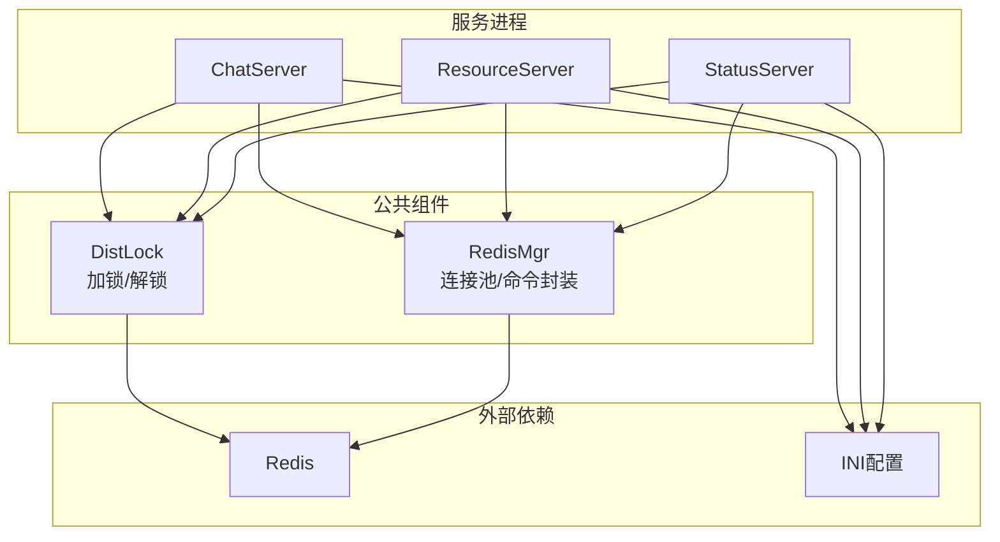
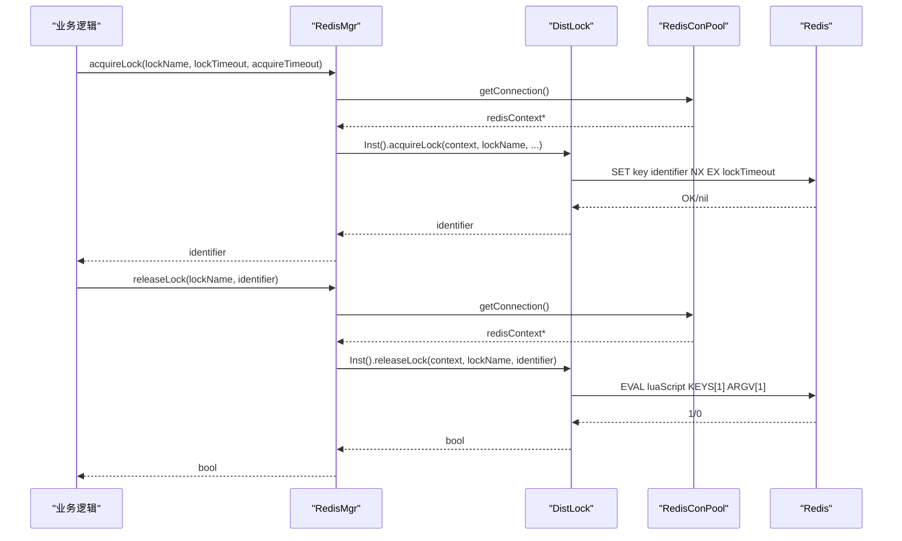
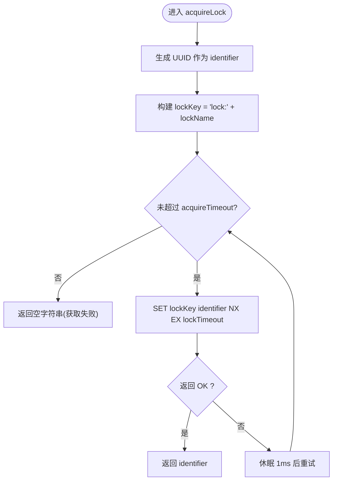
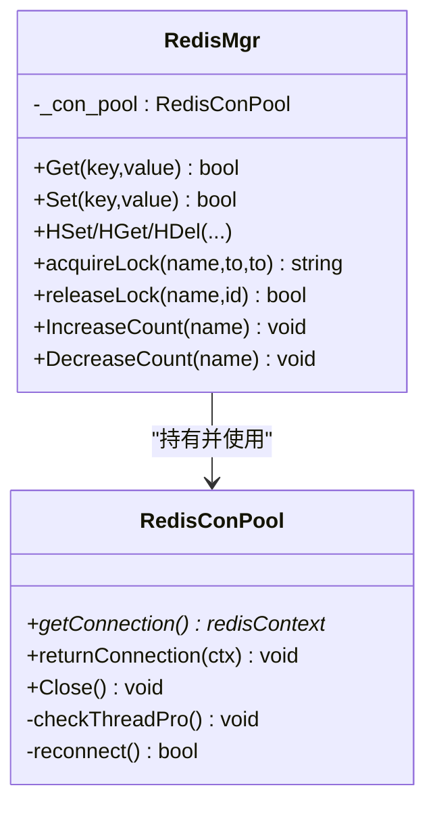
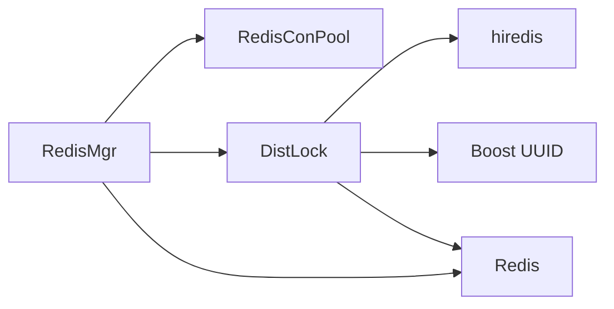

# 分布式锁

<cite>
**本文引用的文件**   
- [server/ChatServer/include/DistLock.h](file://server/ChatServer/include/DistLock.h)
- [server/ChatServer/src/DistLock.cpp](file://server/ChatServer/src/DistLock.cpp)
- [server/ChatServer/include/RedisMgr.h](file://server/ChatServer/include/RedisMgr.h)
- [server/ChatServer/src/RedisMgr.cpp](file://server/ChatServer/src/RedisMgr.cpp)
- [server/ChatServer/include/const.h](file://server/ChatServer/include/const.h)
- [server/ResourceServer/include/DistLock.h](file://server/ResourceServer/include/DistLock.h)
- [server/ResourceServer/src/DistLock.cpp](file://server/ResourceServer/src/DistLock.cpp)
- [server/StatusServer/include/DistLock.h](file://server/StatusServer/include/DistLock.h)
- [开发文档/day32分布式锁设计思路.md](file://开发文档/day32分布式锁设计思路.md)
- [开发文档/day41-分布式死锁解决方案.md](file://开发文档/day41-分布式死锁解决方案.md)
- [server/ChatServer/config/chatserver1.ini](file://server/ChatServer/config/chatserver1.ini)
</cite>

## 目录
1. [引言](#引言)
2. [项目结构](#项目结构)
3. [核心组件](#核心组件)
4. [架构总览](#架构总览)
5. [详细组件分析](#详细组件分析)
6. [依赖关系分析](#依赖关系分析)
7. [性能与优化](#性能与优化)
8. [故障排查指南](#故障排查指南)
9. [结论](#结论)
10. [附录：使用示例与测试要点](#附录使用示例与测试要点)

## 引言
本文件面向 LLFCChat 的分布式锁子系统，系统性阐述基于 Redis 的分布式锁实现原理、获取/释放/续期机制、死锁检测与自动恢复策略、可重入锁的设计与取舍、锁粒度选择原则与性能优化技巧，以及并发控制的最佳实践与常见陷阱。内容严格依据仓库中的代码与开发文档进行提炼与归纳，帮助读者快速理解并正确使用该能力。

## 项目结构
LLFCChat 在多个服务（ChatServer、ResourceServer、StatusServer）中均包含分布式锁模块 DistLock，并通过各服务的 RedisMgr 统一封装连接池与命令执行。配置通过 INI 文件提供 Redis 地址与认证信息。

图表来源
- [server/ChatServer/include/DistLock.h:1-18](file://server/ChatServer/include/DistLock.h#L1-L18)
- [server/ChatServer/src/DistLock.cpp:1-73](file://server/ChatServer/src/DistLock.cpp#L1-L73)
- [server/ChatServer/include/RedisMgr.h:267-305](file://server/ChatServer/include/RedisMgr.h#L267-L305)
- [server/ChatServer/src/RedisMgr.cpp:362-393](file://server/ChatServer/src/RedisMgr.cpp#L362-L393)
- [server/ChatServer/config/chatserver1.ini:20-23](file://server/ChatServer/config/chatserver1.ini#L20-L23)

章节来源
- [server/ChatServer/include/DistLock.h:1-18](file://server/ChatServer/include/DistLock.h#L1-L18)
- [server/ChatServer/src/DistLock.cpp:1-73](file://server/ChatServer/src/DistLock.cpp#L1-L73)
- [server/ChatServer/include/RedisMgr.h:267-305](file://server/ChatServer/include/RedisMgr.h#L267-L305)
- [server/ChatServer/src/RedisMgr.cpp:362-393](file://server/ChatServer/src/RedisMgr.cpp#L362-L393)
- [server/ChatServer/config/chatserver1.ini:20-23](file://server/ChatServer/config/chatserver1.ini#L20-L23)

## 核心组件
- DistLock：分布式锁的核心实现，负责生成唯一标识符、原子加锁、Lua 原子解锁。
- RedisMgr：Redis 连接池与常用命令封装，提供 acquireLock/releaseLock 的便捷接口，并在业务方法中通过 Defer 确保释放锁。
- const.h：定义锁超时、重试时间等常量，以及键前缀等全局常量。
- 各服务中的 DistLock 实现一致，保证跨服务的一致性行为。

章节来源
- [server/ChatServer/include/DistLock.h:1-18](file://server/ChatServer/include/DistLock.h#L1-L18)
- [server/ChatServer/src/DistLock.cpp:1-73](file://server/ChatServer/src/DistLock.cpp#L1-L73)
- [server/ChatServer/include/RedisMgr.h:267-305](file://server/ChatServer/include/RedisMgr.h#L267-L305)
- [server/ChatServer/src/RedisMgr.cpp:362-393](file://server/ChatServer/src/RedisMgr.cpp#L362-L393)
- [server/ChatServer/include/const.h:85-94](file://server/ChatServer/include/const.h#L85-L94)

## 架构总览
下图展示了从业务调用到 Redis 的完整链路：业务层通过 RedisMgr.acquireLock/releaseLock 获取/释放锁；内部委托 DistLock 完成原子操作；底层由 RedisConPool 管理连接与保活。

图表来源
- [server/ChatServer/src/RedisMgr.cpp:362-393](file://server/ChatServer/src/RedisMgr.cpp#L362-L393)
- [server/ChatServer/src/DistLock.cpp:27-73](file://server/ChatServer/src/DistLock.cpp#L27-L73)
- [server/ChatServer/include/RedisMgr.h:267-305](file://server/ChatServer/include/RedisMgr.h#L267-L305)

## 详细组件分析

### DistLock：原子加锁与原子解锁
- 加锁流程
  - 生成全局唯一标识符 identifier（UUID）。
  - 构造锁键 lockKey = "lock:" + lockName。
  - 循环尝试 SET lockKey identifier NX EX lockTimeout，直到成功或达到 acquireTimeout。
  - 成功返回 identifier，失败返回空串。
- 解锁流程
  - 使用 Lua 脚本原子判断值是否等于 identifier，相等则删除 key，否则返回 0。
  - 通过 EVAL 执行脚本，返回值 1 表示成功释放。

图表来源
- [server/ChatServer/src/DistLock.cpp:27-49](file://server/ChatServer/src/DistLock.cpp#L27-L49)

章节来源
- [server/ChatServer/src/DistLock.cpp:27-73](file://server/ChatServer/src/DistLock.cpp#L27-L73)
- [开发文档/day32分布式锁设计思路.md:51-242](file://开发文档/day32分布式锁设计思路.md#L51-L242)

### RedisMgr：连接池与锁接口封装
- 连接池
  - 初始化时创建固定数量的 redisContext 连接，并进行 AUTH。
  - 后台线程周期性 PING 保活，异常连接剔除并重连。
- 锁接口
  - acquireLock/releaseLock 从池中取连接，委托 DistLock 执行，再通过 Defer 确保连接归还。
- 业务计数场景
  - IncreaseCount/DecreaseCount 等方法使用分布式锁保护登录计数等共享资源。

图表来源
- [server/ChatServer/include/RedisMgr.h:9-265](file://server/ChatServer/include/RedisMgr.h#L9-L265)
- [server/ChatServer/src/RedisMgr.cpp:362-393](file://server/ChatServer/src/RedisMgr.cpp#L362-L393)

章节来源
- [server/ChatServer/include/RedisMgr.h:9-265](file://server/ChatServer/include/RedisMgr.h#L9-L265)
- [server/ChatServer/src/RedisMgr.cpp:362-393](file://server/ChatServer/src/RedisMgr.cpp#L362-L393)

### 常量与配置
- 常量
  - LOCK_TIME_OUT：锁过期时间（秒）。
  - ACQUIRE_TIME_OUT：获取锁最大等待时间（秒）。
  - 键前缀：如 LOGIN_COUNT、LOCK_PREFIX、USER_SESSION_PREFIX 等。
- 配置
  - chatserver1.ini 中 Redis 的 Host/Port/Passwd。

章节来源
- [server/ChatServer/include/const.h:85-94](file://server/ChatServer/include/const.h#L85-L94)
- [server/ChatServer/config/chatserver1.ini:20-23](file://server/ChatServer/config/chatserver1.ini#L20-L23)

### 多服务一致性
- ResourceServer、StatusServer 中的 DistLock 接口与 ChatServer 保持一致，便于跨服务协作。

章节来源
- [server/ResourceServer/include/DistLock.h:1-18](file://server/ResourceServer/include/DistLock.h#L1-L18)
- [server/ResourceServer/src/DistLock.cpp:1-73](file://server/ResourceServer/src/DistLock.cpp#L1-L73)
- [server/StatusServer/include/DistLock.h:1-18](file://server/StatusServer/include/DistLock.h#L1-L18)

## 依赖关系分析
- 组件耦合
  - RedisMgr 依赖 RedisConPool 管理连接，依赖 DistLock 实现锁语义。
  - DistLock 直接依赖 hiredis 与 Boost UUID。
- 外部依赖
  - Redis：提供原子 SET/NX/EX 与 Lua 执行能力。
  - 配置文件：提供 Redis 连接参数。

图表来源
- [server/ChatServer/include/RedisMgr.h:9-265](file://server/ChatServer/include/RedisMgr.h#L9-L265)
- [server/ChatServer/src/DistLock.cpp:1-11](file://server/ChatServer/src/DistLock.cpp#L1-L11)

章节来源
- [server/ChatServer/include/RedisMgr.h:9-265](file://server/ChatServer/include/RedisMgr.h#L9-L265)
- [server/ChatServer/src/DistLock.cpp:1-11](file://server/ChatServer/src/DistLock.cpp#L1-L11)

## 性能与优化
- 原子性与最小网络往返
  - 加锁使用 SET ... NX EX 一次命令完成“存在性检查+设置+过期”，避免多次往返。
  - 解锁使用 Lua 脚本保证“判等+删除”的原子性。
- 重试与退避
  - 获取锁采用固定间隔 1ms 重试，配合 acquireTimeout 限制最长等待时间，降低忙等开销。
- 连接池与保活
  - 连接池复用连接，减少握手成本；后台线程定期 PING，异常连接剔除并重连，提升稳定性。
- 锁粒度建议
  - 尽量细化锁粒度（例如以用户 ID、会话 ID、聊天线程 ID 为维度），减少热点冲突。
- 超时与续期
  - 当前实现未内置续期；建议将业务处理时间控制在 lockTimeout 内，或使用“看门狗”模式（独立线程根据业务进度动态续期），注意幂等与安全性。
- 避免长事务与阻塞
  - 临界区应尽可能短小，避免 I/O 阻塞；必要时将耗时操作移出临界区。

[本节为通用指导，不直接分析具体文件]

## 故障排查指南
- 常见问题
  - 无法获取锁：检查 Redis 连通性、AUTH 是否成功、lockTimeout/acquireTimeout 是否过小。
  - 解锁失败：确认传入 identifier 与加锁时一致；检查 Lua 脚本执行结果是否为 1。
  - 连接池耗尽：观察连接池大小与并发量，适当扩容；关注后台保活线程日志。
- 调试建议
  - 打印关键路径日志：获取锁/释放锁/连接池状态。
  - 监控 Redis 指标：QPS、延迟、连接数、内存使用。
- 死锁与数据库层面
  - 若涉及 MySQL 事务（如 SELECT FOR UPDATE + INSERT），需参考开发文档中的间隙锁与插入意向锁冲突分析，调整 SQL 顺序或引入分布式锁规避。

章节来源
- [server/ChatServer/src/RedisMgr.cpp:362-393](file://server/ChatServer/src/RedisMgr.cpp#L362-L393)
- [开发文档/day41-分布式死锁解决方案.md:1-120](file://开发文档/day41-分布式死锁解决方案.md#L1-L120)

## 结论
LLFCChat 的分布式锁基于 Redis 的原子命令与 Lua 脚本，实现了高可靠、低成本的跨进程/跨服务互斥。通过连接池与保活机制保障稳定性，结合合理的锁粒度与超时策略，可在高并发场景下有效避免数据竞争与死锁。建议在需要长时间持锁的业务中引入安全的续期机制，并持续监控与调优。

[本节为总结，不直接分析具体文件]

## 附录：使用示例与测试要点
- 基本用法
  - 通过 RedisMgr.acquireLock 获取锁，返回 identifier；业务完成后调用 releaseLock 释放。
  - 使用 Defer 确保异常路径也能释放锁与归还连接。
- 典型用例
  - 登录计数增减：IncreaseCount/DecreaseCount 使用分布式锁保护共享计数器。
  - 心跳清理：定时任务获取用户级锁，清理会话与 IP 信息。
- 测试要点
  - 并发加锁：多进程/多线程同时请求同一 lockName，验证仅一个成功。
  - 超时重试：设置较小的 acquireTimeout，验证失败分支与日志。
  - 解锁安全：错误 identifier 不应释放他人锁。
  - 连接池压力：在高并发下观察连接池与保活线程行为。

章节来源
- [server/ChatServer/src/RedisMgr.cpp:395-461](file://server/ChatServer/src/RedisMgr.cpp#L395-L461)
- [开发文档/day32分布式锁设计思路.md:430-543](file://开发文档/day32分布式锁设计思路.md#L430-L543)