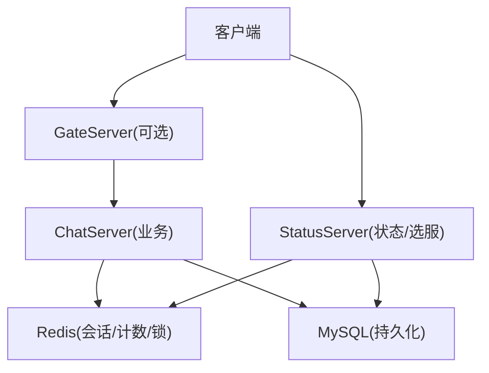
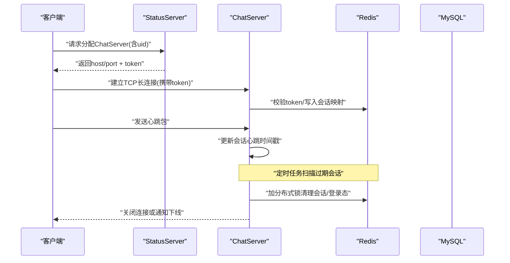
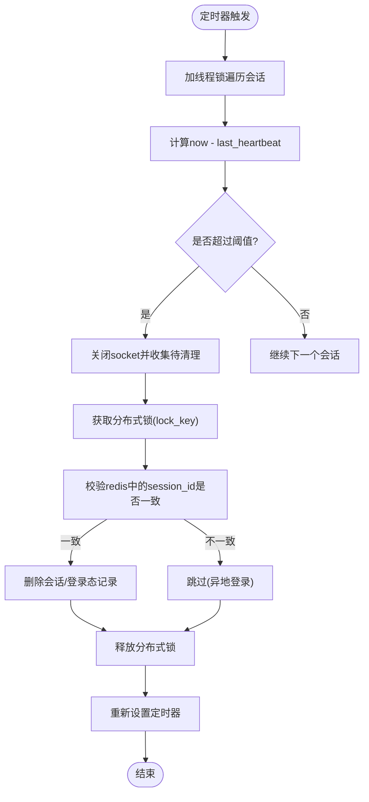
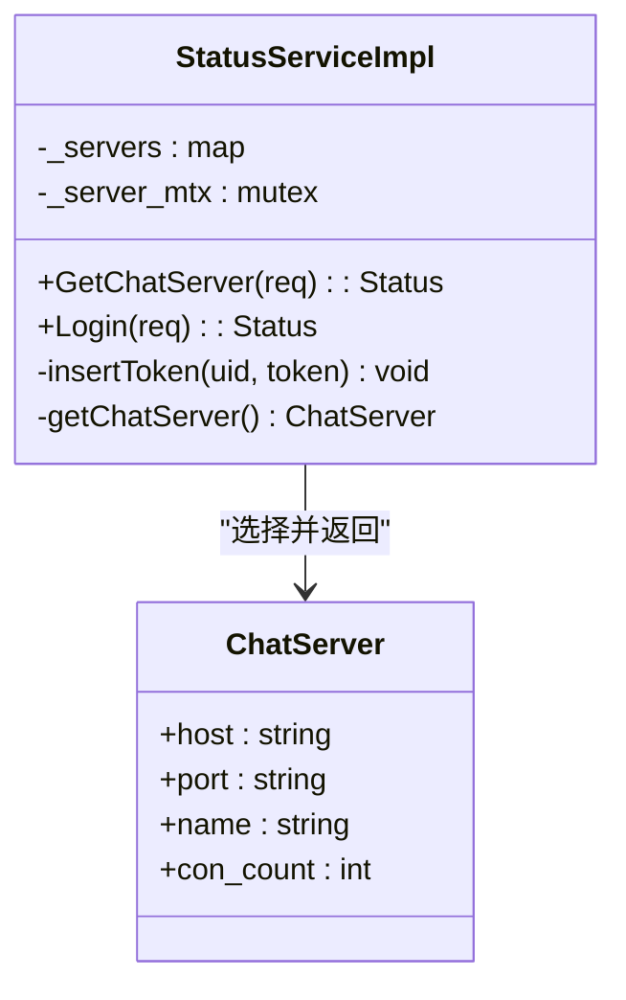
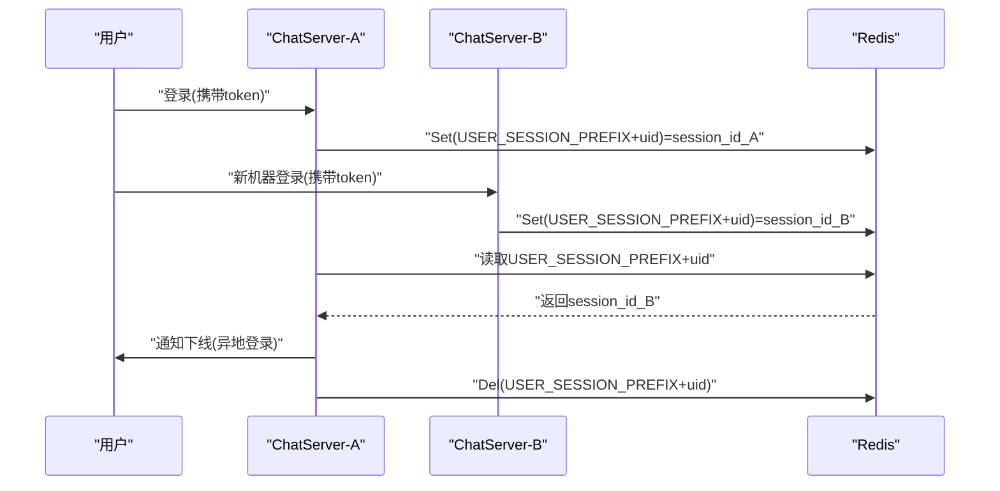
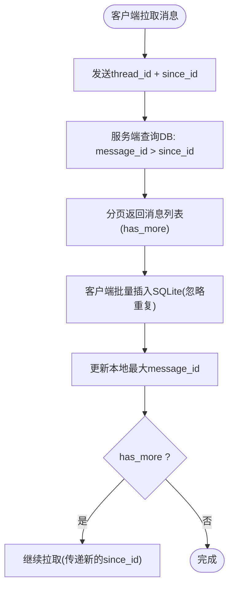
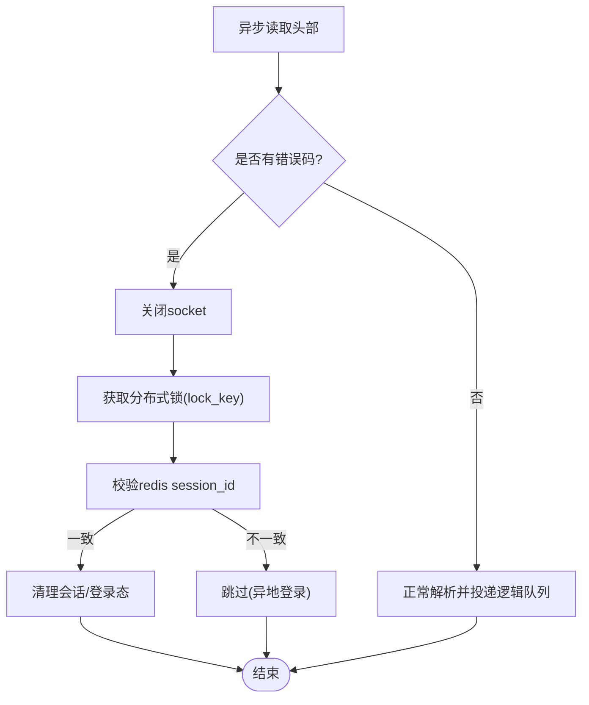
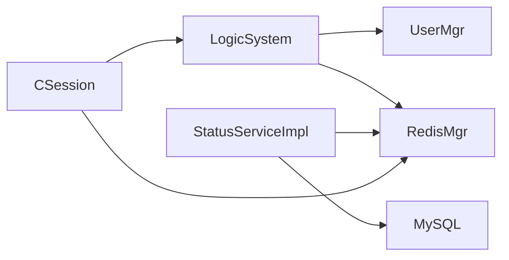
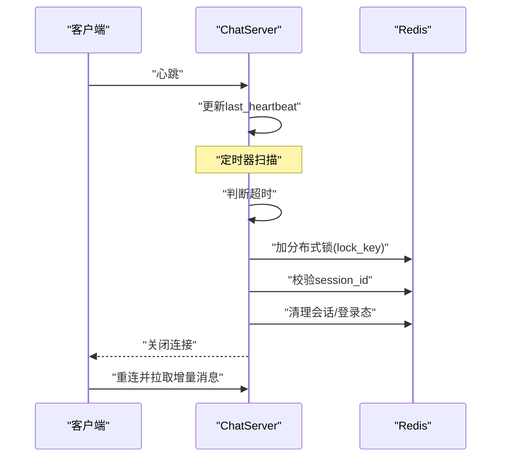

# 故障转移

<cite>
**本文引用的文件**   
- [server/StatusServer/src/StatusServiceImpl.cpp](file://server/StatusServer/src/StatusServiceImpl.cpp)
- [server/StatusServer/include/StatusServiceImpl.h](file://server/StatusServer/include/StatusServiceImpl.h)
- [server/ChatServer/include/CSession.h](file://server/ChatServer/include/CSession.h)
- [server/ChatServer/src/CSession.cpp](file://server/ChatServer/src/CSession.cpp)
- [server/ChatServer/include/UserMgr.h](file://server/ChatServer/include/UserMgr.h)
- [server/ChatServer/src/UserMgr.cpp](file://server/ChatServer/src/UserMgr.cpp)
- [server/ChatServer/include/LogicSystem.h](file://server/ChatServer/include/LogicSystem.h)
- [server/ChatServer/src/LogicSystem.cpp](file://server/ChatServer/src/LogicSystem.cpp)
- [server/ChatServer/include/RedisMgr.h](file://server/ChatServer/include/RedisMgr.h)
- [server/ChatServer/include/DistLock.h](file://server/ChatServer/include/DistLock.h)
- [开发文档/day35心跳逻辑.md](file://开发文档/day35心跳逻辑.md)
- [开发文档/day27-分布式服务设计.md](file://开发文档/day27-分布式服务设计.md)
- [开发文档/day14-登录功能.md](file://开发文档/day14-登录功能.md)
- [开发文档/day33单服程踢人逻辑.md](file://开发文档/day33单服程踢人逻辑.md)
- [开发文档/day37-聊天信息存储方案.md](file://开发文档/day37-聊天信息存储方案.md)
</cite>

## 目录
1. [引言](#引言)
2. [项目结构](#项目结构)
3. [核心组件](#核心组件)
4. [架构总览](#架构总览)
5. [详细组件分析](#详细组件分析)
6. [依赖关系分析](#依赖关系分析)
7. [性能与一致性考量](#性能与一致性考量)
8. [故障场景模拟与恢复流程](#故障场景模拟与恢复流程)
9. [监控指标与告警规则](#监控指标与告警规则)
10. [结论](#结论)

## 引言
本文件面向LLFCChat的故障转移系统，聚焦以下目标：
- 服务节点监控、心跳检测与健康状态管理
- 主从切换机制、数据同步与一致性保证
- 用户会话迁移策略，确保服务切换时用户体验不中断
- 故障检测算法、超时处理与重试机制
- 分布式环境下的状态管理与数据备份策略
- 监控指标定义与告警规则配置

## 项目结构
本项目采用多服务架构，关键服务包括：
- ChatServer：业务聊天服务，维护TCP长连接、会话与消息路由
- StatusServer：状态服务，提供服务器选择与登录校验能力
- GateServer/ResourceServer：网关与资源服务（与本故障转移主题相关度较低）
- Redis/MySQL：分布式缓存与持久化存储
- DistLock：基于Redis的分布式锁实现

**图表来源** 
- [server/StatusServer/src/StatusServiceImpl.cpp:17-27](file://server/StatusServer/src/StatusServiceImpl.cpp#L17-L27)
- [server/ChatServer/include/CSession.h:28-76](file://server/ChatServer/include/CSession.h#L28-L76)
- [server/ChatServer/include/RedisMgr.h:267-305](file://server/ChatServer/include/RedisMgr.h#L267-L305)

**章节来源**
- [开发文档/day27-分布式服务设计.md](file://开发文档/day27-分布式服务设计.md)
- [server/StatusServer/src/StatusServiceImpl.cpp:17-27](file://server/StatusServer/src/StatusServiceImpl.cpp#L17-L27)

## 核心组件
- CSession：封装TCP会话、读写、心跳更新与异常处理
- UserMgr：进程内UID到Session映射，支持跨进程踢人与清理
- LogicSystem：消息分发与业务回调，包含心跳处理、登录、聊天等
- RedisMgr：Redis连接池、键值操作、分布式锁接口
- DistLock：基于Redis的分布式锁实现
- StatusServiceImpl：状态服务实现，负责选服、Token校验与插入

**章节来源**
- [server/ChatServer/include/CSession.h:28-76](file://server/ChatServer/include/CSession.h#L28-L76)
- [server/ChatServer/src/UserMgr.cpp:10-49](file://server/ChatServer/src/UserMgr.cpp#L10-L49)
- [server/ChatServer/include/LogicSystem.h:17-58](file://server/ChatServer/include/LogicSystem.h#L17-L58)
- [server/ChatServer/include/RedisMgr.h:267-305](file://server/ChatServer/include/RedisMgr.h#L267-L305)
- [server/ChatServer/include/DistLock.h:1-18](file://server/ChatServer/include/DistLock.h#L1-L18)
- [server/StatusServer/include/StatusServiceImpl.h:36-50](file://server/StatusServer/include/StatusServiceImpl.h#L36-L50)

## 架构总览
下图展示故障转移相关的核心交互：客户端通过状态服务获取ChatServer地址并建立连接；ChatServer维护心跳与在线会话；Redis作为分布式状态中心；分布式锁用于并发安全。

**图表来源** 
- [server/StatusServer/src/StatusServiceImpl.cpp:17-27](file://server/StatusServer/src/StatusServiceImpl.cpp#L17-L27)
- [server/ChatServer/src/CSession.cpp:99-140](file://server/ChatServer/src/CSession.cpp#L99-L140)
- [开发文档/day35心跳逻辑.md:41-93](file://开发文档/day35心跳逻辑.md#L41-L93)
- [开发文档/day33单服程踢人逻辑.md:397-460](file://开发文档/day33单服程踢人逻辑.md#L397-L460)

## 详细组件分析

### 心跳检测与健康状态管理
- 客户端周期性发送心跳，服务端在接收时更新会话心跳时间戳
- 定时器周期遍历会话，计算当前时间与最后心跳时间的差值，超过阈值判定为过期
- 过期会话触发关闭与清理，必要时使用分布式锁避免竞态

**图表来源** 
- [开发文档/day35心跳逻辑.md:41-93](file://开发文档/day35心跳逻辑.md#L41-L93)
- [server/ChatServer/include/CSession.h:46-51](file://server/ChatServer/include/CSession.h#L46-L51)
- [server/ChatServer/src/CSession.cpp:99-140](file://server/ChatServer/src/CSession.cpp#L99-L140)
- [server/ChatServer/include/RedisMgr.h:290-298](file://server/ChatServer/include/RedisMgr.h#L290-L298)

**章节来源**
- [开发文档/day35心跳逻辑.md:41-93](file://开发文档/day35心跳逻辑.md#L41-L93)
- [server/ChatServer/include/CSession.h:46-51](file://server/ChatServer/include/CSession.h#L46-L51)
- [server/ChatServer/src/CSession.cpp:99-140](file://server/ChatServer/src/CSession.cpp#L99-L140)

### 主从切换与选服机制
- StatusServer维护ChatServer列表，根据负载或默认策略返回一个可用节点
- 客户端拿到地址后建立连接，同时生成并下发token供后续校验
- 若某节点不可用，客户端可再次请求StatusServer进行重选

**图表来源** 
- [server/StatusServer/include/StatusServiceImpl.h:16-35](file://server/StatusServer/include/StatusServiceImpl.h#L16-L35)
- [server/StatusServer/include/StatusServiceImpl.h:36-50](file://server/StatusServer/include/StatusServiceImpl.h#L36-L50)
- [server/StatusServer/src/StatusServiceImpl.cpp:17-27](file://server/StatusServer/src/StatusServiceImpl.cpp#L17-L27)

**章节来源**
- [server/StatusServer/include/StatusServiceImpl.h:16-50](file://server/StatusServer/include/StatusServiceImpl.h#L16-L50)
- [server/StatusServer/src/StatusServiceImpl.cpp:17-27](file://server/StatusServer/src/StatusServiceImpl.cpp#L17-L27)
- [开发文档/day27-分布式服务设计.md](file://开发文档/day27-分布式服务设计.md)

### 用户会话迁移与一致性保证
- 登录成功后，将uid与session_id绑定至Redis，便于跨节点识别与踢人
- 当检测到同一uid在其他节点登录或本地会话过期时，通过分布式锁保护清理流程
- 会话迁移策略：优先保持现有连接；若必须迁移，先在新节点建立会话，再通知旧节点断开

**图表来源** 
- [开发文档/day33单服程踢人逻辑.md:397-460](file://开发文档/day33单服程踢人逻辑.md#L397-L460)
- [server/ChatServer/src/UserMgr.cpp:27-44](file://server/ChatServer/src/UserMgr.cpp#L27-L44)
- [server/ChatServer/include/RedisMgr.h:290-298](file://server/ChatServer/include/RedisMgr.h#L290-L298)

**章节来源**
- [开发文档/day33单服程踢人逻辑.md:397-460](file://开发文档/day33单服程踢人逻辑.md#L397-L460)
- [server/ChatServer/src/UserMgr.cpp:27-44](file://server/ChatServer/src/UserMgr.cpp#L27-L44)

### 数据同步与一致性
- 聊天消息拉取采用“增量同步”：客户端携带本地最大message_id，服务端返回大于该ID的消息集合
- 断线重连后按since_id拉取缺失消息，保证最终一致性
- 图片等资源上传进度与元数据落Redis，支持断点续传

**图表来源** 
- [开发文档/day37-聊天信息存储方案.md:31-56](file://开发文档/day37-聊天信息存储方案.md#L31-L56)
- [开发文档/day37-聊天信息存储方案.md:327-332](file://开发文档/day37-聊天信息存储方案.md#L327-L332)

**章节来源**
- [开发文档/day37-聊天信息存储方案.md:31-56](file://开发文档/day37-聊天信息存储方案.md#L31-L56)
- [开发文档/day37-聊天信息存储方案.md:327-332](file://开发文档/day37-聊天信息存储方案.md#L327-L332)

### 故障检测算法、超时与重试
- 心跳阈值：建议60s；示例中演示使用20s
- 读失败路径：捕获错误码，关闭连接，进入异常会话清理流程
- 重试机制：Redis连接池定期PING检查并重建连接；MySQL连接池健康检查与自动重连

**图表来源** 
- [server/ChatServer/src/CSession.cpp:99-140](file://server/ChatServer/src/CSession.cpp#L99-L140)
- [开发文档/day35心跳逻辑.md:41-93](file://开发文档/day35心跳逻辑.md#L41-L93)
- [server/ChatServer/include/RedisMgr.h:137-206](file://server/ChatServer/include/RedisMgr.h#L137-L206)

**章节来源**
- [server/ChatServer/src/CSession.cpp:99-140](file://server/ChatServer/src/CSession.cpp#L99-L140)
- [开发文档/day35心跳逻辑.md:41-93](file://开发文档/day35心跳逻辑.md#L41-L93)
- [server/ChatServer/include/RedisMgr.h:137-206](file://server/ChatServer/include/RedisMgr.h#L137-L206)

### 分布式锁与死锁规避
- 分布式锁以lock_key=LOCK_PREFIX+uid命名，标识符由Redis返回
- 避免线程锁与分布式锁交叉顺序导致死锁：统一加锁顺序或使用scoped_lock
- 清理流程需先获取分布式锁，再执行Redis操作与本地清理

**章节来源**
- [server/ChatServer/include/DistLock.h:1-18](file://server/ChatServer/include/DistLock.h#L1-L18)
- [server/ChatServer/include/RedisMgr.h:290-298](file://server/ChatServer/include/RedisMgr.h#L290-L298)
- [开发文档/day35心跳逻辑.md:95-172](file://开发文档/day35心跳逻辑.md#L95-L172)

## 依赖关系分析
- ChatServer依赖Redis进行会话、计数、锁与部分元数据存储
- StatusServer依赖Redis与MySQL进行Token校验与选服
- LogicSystem集中处理消息回调，依赖UserMgr与Redis
- CSession负责网络I/O与心跳更新，依赖LogicSystem进行消息投递

**图表来源** 
- [server/ChatServer/include/CSession.h:28-76](file://server/ChatServer/include/CSession.h#L28-L76)
- [server/ChatServer/include/LogicSystem.h:17-58](file://server/ChatServer/include/LogicSystem.h#L17-L58)
- [server/ChatServer/include/UserMgr.h:1-22](file://server/ChatServer/include/UserMgr.h#L1-L22)
- [server/ChatServer/include/RedisMgr.h:267-305](file://server/ChatServer/include/RedisMgr.h#L267-L305)
- [server/StatusServer/include/StatusServiceImpl.h:36-50](file://server/StatusServer/include/StatusServiceImpl.h#L36-L50)

**章节来源**
- [server/ChatServer/include/CSession.h:28-76](file://server/ChatServer/include/CSession.h#L28-L76)
- [server/ChatServer/include/LogicSystem.h:17-58](file://server/ChatServer/include/LogicSystem.h#L17-L58)
- [server/ChatServer/include/UserMgr.h:1-22](file://server/ChatServer/include/UserMgr.h#L1-L22)
- [server/ChatServer/include/RedisMgr.h:267-305](file://server/ChatServer/include/RedisMgr.h#L267-L305)
- [server/StatusServer/include/StatusServiceImpl.h:36-50](file://server/StatusServer/include/StatusServiceImpl.h#L36-L50)

## 性能与一致性考量
- 心跳阈值与定时器间隔：建议60s，避免频繁扫描；示例演示20s
- Redis连接池健康检查：周期性PING，失败则重建连接，保障高可用
- MySQL连接池健康检查：定期SELECT 1探测，失败则重建连接
- 分布式锁粒度：以uid为维度，减少锁竞争
- 消息增量同步：降低带宽与数据库压力，提升重连恢复速度

**章节来源**
- [开发文档/day35心跳逻辑.md:41-93](file://开发文档/day35心跳逻辑.md#L41-L93)
- [server/ChatServer/include/RedisMgr.h:137-206](file://server/ChatServer/include/RedisMgr.h#L137-L206)
- [server/ChatServer/include/MysqlDao.h:102-160](file://server/ChatServer/include/MysqlDao.h#L102-L160)
- [开发文档/day37-聊天信息存储方案.md:31-56](file://开发文档/day37-聊天信息存储方案.md#L31-L56)

## 故障场景模拟与恢复流程
- 场景1：客户端网络抖动导致心跳超时
  - 服务端定时器判定会话过期，关闭连接并清理Redis中的会话与登录态
  - 客户端重连后按since_id拉取缺失消息，恢复一致性
- 场景2：异地登录冲突
  - 新登录覆盖Redis中的session_id，旧节点检测到不一致后通知下线
- 场景3：Redis短暂不可用
  - 连接池健康检查发现失败，自动重建连接；业务层可加退避重试
- 场景4：MySQL连接失效
  - 连接池健康检查失败，自动重连；查询失败时提示重试

**图表来源** 
- [开发文档/day35心跳逻辑.md:41-93](file://开发文档/day35心跳逻辑.md#L41-L93)
- [server/ChatServer/src/CSession.cpp:99-140](file://server/ChatServer/src/CSession.cpp#L99-L140)
- [server/ChatServer/include/RedisMgr.h:290-298](file://server/ChatServer/include/RedisMgr.h#L290-L298)

**章节来源**
- [开发文档/day35心跳逻辑.md:41-93](file://开发文档/day35心跳逻辑.md#L41-L93)
- [server/ChatServer/src/CSession.cpp:99-140](file://server/ChatServer/src/CSession.cpp#L99-L140)
- [server/ChatServer/include/RedisMgr.h:290-298](file://server/ChatServer/include/RedisMgr.h#L290-L298)

## 监控指标与告警规则
- 会话指标
  - 在线会话数：按服务器名统计（Redis Hash字段）
  - 心跳超时率：单位时间内会话超时的比例
- 连接健康
  - Redis连接池活跃连接数、失败次数、重连成功率
  - MySQL连接池健康检查失败次数、重连成功率
- 选服与登录
  - StatusServer选服耗时、Token校验失败率
- 告警建议
  - 心跳超时率连续N分钟高于阈值
  - Redis/MySQL连接池失败次数突增
  - 选服耗时P95超过阈值

[本节为通用指导，不直接分析具体文件]

## 结论
LLFCChat的故障转移体系围绕心跳检测、分布式锁、Redis状态中心与增量消息同步构建，具备较强的健壮性与可扩展性。通过合理的阈值与重试策略，可在服务节点故障或网络抖动时快速恢复，保障用户体验连续性。建议在运维侧完善监控与告警，持续优化阈值与容量规划。