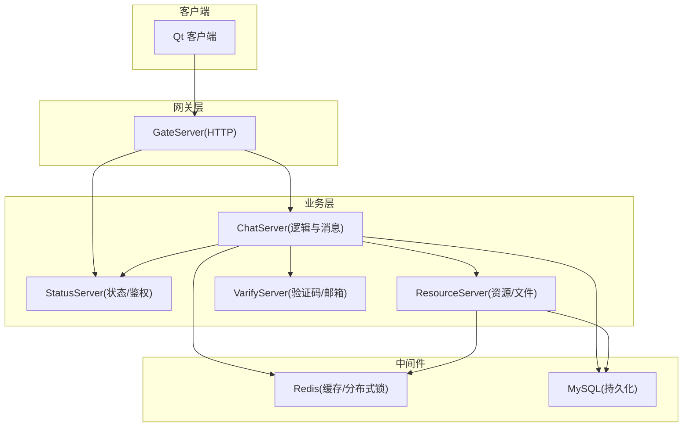
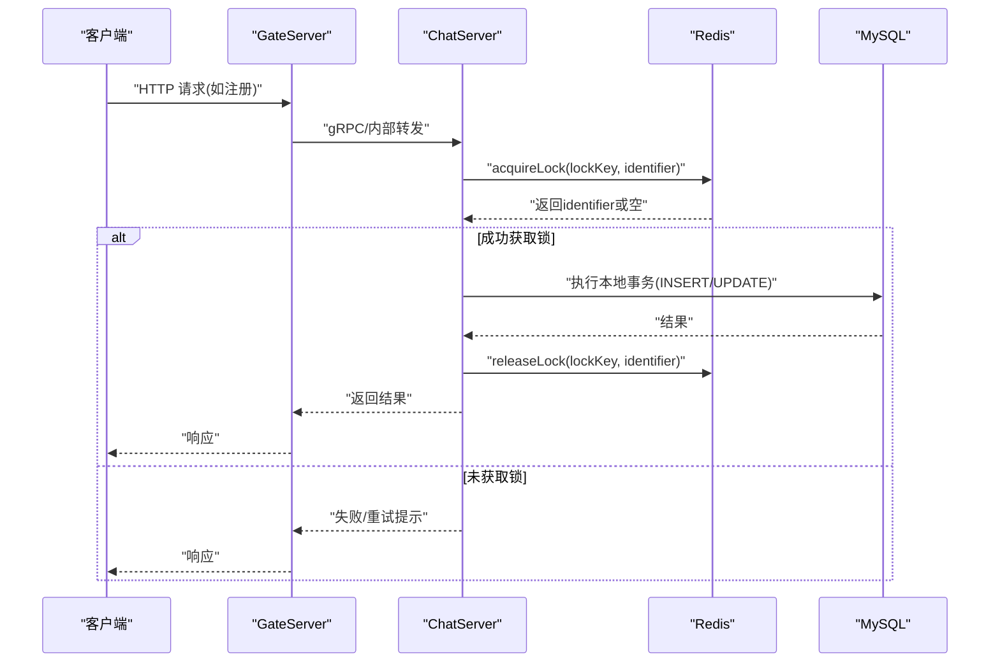
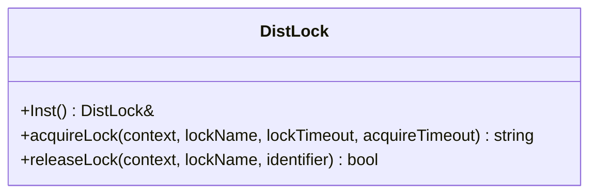
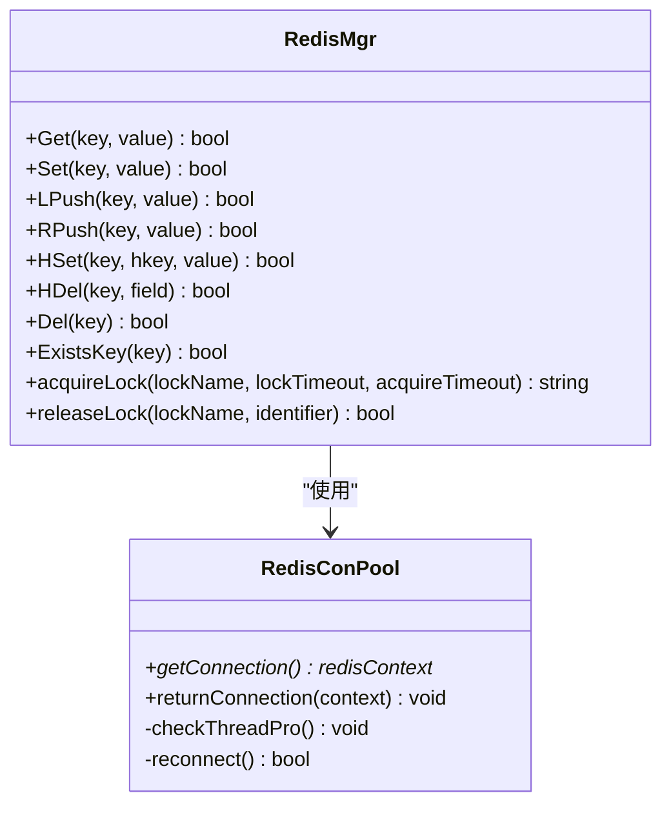
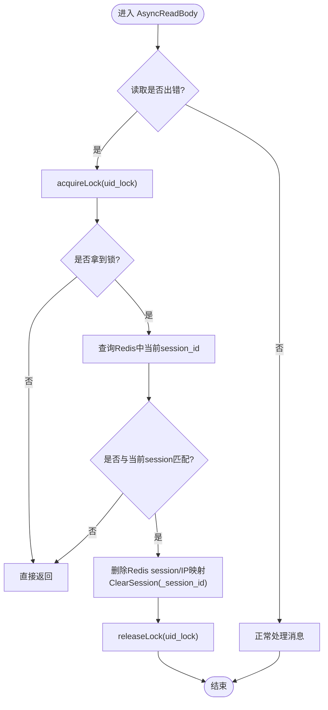
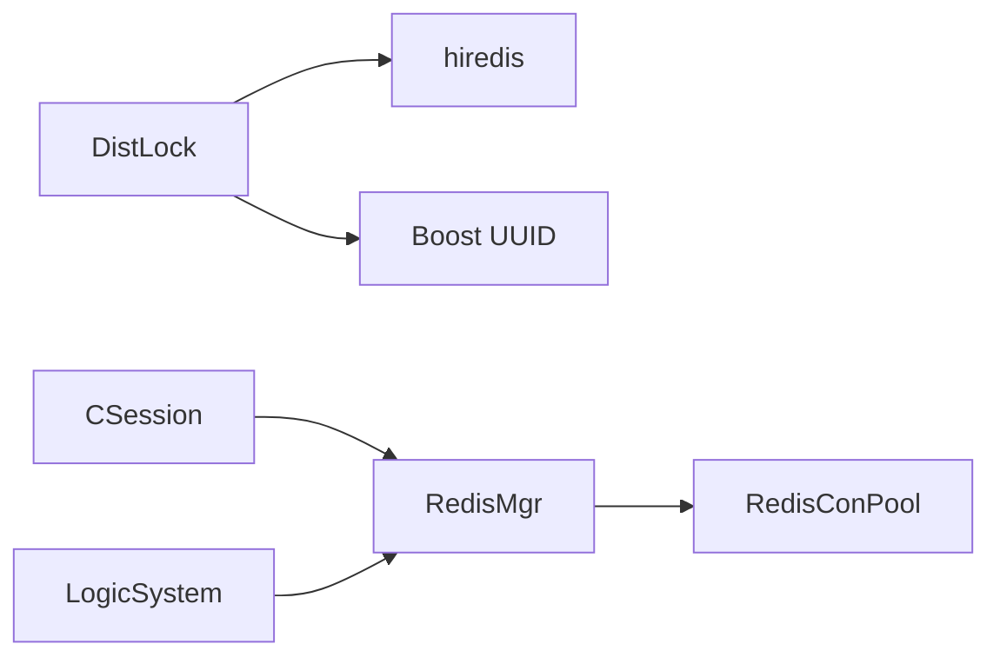

# 分布式事务处理

<cite>
**本文引用的文件**   
- [server/ChatServer/include/DistLock.h](file://server/ChatServer/include/DistLock.h)
- [server/ChatServer/src/DistLock.cpp](file://server/ChatServer/src/DistLock.cpp)
- [server/ChatServer/include/RedisMgr.h](file://server/ChatServer/include/RedisMgr.h)
- [server/ChatServer/src/RedisMgr.cpp](file://server/ChatServer/src/RedisMgr.cpp)
- [server/ChatServer/include/LogicSystem.h](file://server/ChatServer/include/LogicSystem.h)
- [server/ChatServer/src/CSession.cpp](file://server/ChatServer/src/CSession.cpp)
- [开发文档/day32分布式锁设计思路.md](file://开发文档/day32分布式锁设计思路.md)
- [开发文档/day33单服程踢人逻辑.md](file://开发文档/day33单服程踢人逻辑.md)
- [开发文档/day35心跳逻辑.md](file://开发文档/day35心跳逻辑.md)
- [sql备份/llfc.sql](file://sql备份/llfc.sql)
- [server/ResourceServer/src/MysqlDao.cpp](file://server/ResourceServer/src/MysqlDao.cpp)
</cite>

## 目录
1. [引言](#引言)
2. [项目结构](#项目结构)
3. [核心组件](#核心组件)
4. [架构总览](#架构总览)
5. [详细组件分析](#详细组件分析)
6. [依赖关系分析](#依赖关系分析)
7. [性能与一致性考量](#性能与一致性考量)
8. [故障处理与恢复](#故障处理与恢复)
9. [监控与调试指南](#监控与调试指南)
10. [结论](#结论)

## 引言
本技术文档围绕 LLFCChat 的分布式事务处理进行系统化说明，重点包括：
- Saga 模式在聊天系统中的落地方案、补偿事务设计与错误恢复机制
- 基于 Redis 分布式锁的事务协调器实现，确保跨服务操作的一致性
- TCC（Try-Confirm-Cancel）在聊天场景的应用建议
- 用户注册流程的多步骤事务编排示例
- 事务日志记录与状态管理
- 网络分区与节点故障的处理策略
- 事务监控与调试工具使用方法

## 项目结构
LLFCChat 采用多服务架构（ChatServer、GateServer、StatusServer、ResourceServer、VarifyServer），通过 gRPC 与 HTTP 交互，使用 Redis 作为分布式缓存与锁存储，MySQL 作为持久化存储。分布式事务相关能力主要分布在 ChatServer 的 Redis 连接池、分布式锁与消息编排层。

**图表来源** 
- [server/ChatServer/include/RedisMgr.h](file://server/ChatServer/include/RedisMgr.h)
- [server/ChatServer/src/RedisMgr.cpp](file://server/ChatServer/src/RedisMgr.cpp)
- [server/ChatServer/include/LogicSystem.h](file://server/ChatServer/include/LogicSystem.h)
- [server/ChatServer/src/CSession.cpp](file://server/ChatServer/src/CSession.cpp)

**章节来源**
- [server/ChatServer/include/RedisMgr.h](file://server/ChatServer/include/RedisMgr.h)
- [server/ChatServer/src/RedisMgr.cpp](file://server/ChatServer/src/RedisMgr.cpp)
- [server/ChatServer/include/LogicSystem.h](file://server/ChatServer/include/LogicSystem.h)
- [server/ChatServer/src/CSession.cpp](file://server/ChatServer/src/CSession.cpp)

## 核心组件
- 分布式锁 DistLock：基于 Redis SET NX EX + Lua 脚本实现原子加解锁，支持持有者标识符与超时释放
- Redis 连接池 RedisConPool/RedisMgr：提供连接获取、健康检查、自动重连与常用命令封装
- 逻辑编排 LogicSystem：消息路由与回调注册，承载事务编排入口
- 会话 CSession：异步 IO 读写、异常清理与分布式锁保护的关键路径

**章节来源**
- [server/ChatServer/include/DistLock.h](file://server/ChatServer/include/DistLock.h)
- [server/ChatServer/src/DistLock.cpp](file://server/ChatServer/src/DistLock.cpp)
- [server/ChatServer/include/RedisMgr.h](file://server/ChatServer/include/RedisMgr.h)
- [server/ChatServer/src/RedisMgr.cpp](file://server/ChatServer/src/RedisMgr.cpp)
- [server/ChatServer/include/LogicSystem.h](file://server/ChatServer/include/LogicSystem.h)
- [server/ChatServer/src/CSession.cpp](file://server/ChatServer/src/CSession.cpp)

## 架构总览
下图展示以 Redis 分布式锁为核心的事务协调器在聊天系统中的作用位置与调用链。

**图表来源** 
- [server/ChatServer/src/DistLock.cpp](file://server/ChatServer/src/DistLock.cpp)
- [server/ChatServer/src/RedisMgr.cpp](file://server/ChatServer/src/RedisMgr.cpp)
- [server/ChatServer/include/LogicSystem.h](file://server/ChatServer/include/LogicSystem.h)

## 详细组件分析

### 分布式锁 DistLock 类图

**图表来源** 
- [server/ChatServer/include/DistLock.h](file://server/ChatServer/include/DistLock.h)
- [server/ChatServer/src/DistLock.cpp](file://server/ChatServer/src/DistLock.cpp)

**章节来源**
- [server/ChatServer/include/DistLock.h](file://server/ChatServer/include/DistLock.h)
- [server/ChatServer/src/DistLock.cpp](file://server/ChatServer/src/DistLock.cpp)
- [开发文档/day32分布式锁设计思路.md](file://开发文档/day32分布式锁设计思路.md)

### Redis 连接池与管理器
- RedisConPool：维护 redisContext 连接池，周期性 PING 检测健康，失败时重建连接
- RedisMgr：封装常用命令（GET/SET/LPUSH/RPUSH/HSET/HDEL/DEL/EXISTS），并暴露 acquireLock/releaseLock 接口

**图表来源** 
- [server/ChatServer/include/RedisMgr.h](file://server/ChatServer/include/RedisMgr.h)
- [server/ChatServer/src/RedisMgr.cpp](file://server/ChatServer/src/RedisMgr.cpp)

**章节来源**
- [server/ChatServer/include/RedisMgr.h](file://server/ChatServer/include/RedisMgr.h)
- [server/ChatServer/src/RedisMgr.cpp](file://server/ChatServer/src/RedisMgr.cpp)

### 会话与异常清理中的分布式锁
CSession 在网络异常或读失败路径中，使用分布式锁保护“踢人/下线”等关键清理逻辑，避免并发竞态导致的状态不一致。

**图表来源** 
- [server/ChatServer/src/CSession.cpp](file://server/ChatServer/src/CSession.cpp)
- [开发文档/day33单服程踢人逻辑.md](file://开发文档/day33单服程踢人逻辑.md)

**章节来源**
- [server/ChatServer/src/CSession.cpp](file://server/ChatServer/src/CSession.cpp)
- [开发文档/day33单服程踢人逻辑.md](file://开发文档/day33单服程踢人逻辑.md)

### 事务编排与日志（Saga/TCC 建议）
- 当前代码已具备分布式锁与连接池基础，适合在此基础上扩展 Saga 编排器与 TCC 协调器
- 建议在 LogicSystem 中增加事务编排模块，统一注册各服务的 Try/Confirm/Cancel 回调，并通过 Redis 持久化事务状态与补偿日志
- 对于聊天系统的典型场景（好友申请、私聊线程创建、消息落库），可分别定义 Try/Confirm/Cancel 阶段，保证最终一致性

[本节为概念性说明，不直接分析具体文件]

## 依赖关系分析
- DistLock 依赖 hiredis 与 Boost UUID，用于生成唯一标识与原子 SET/NX/EX
- RedisMgr 依赖 RedisConPool，负责连接生命周期管理与命令封装
- LogicSystem 作为消息路由中心，未来可扩展事务编排器
- CSession 在异常路径中使用 RedisMgr 的分布式锁保护清理逻辑

**图表来源** 
- [server/ChatServer/src/DistLock.cpp](file://server/ChatServer/src/DistLock.cpp)
- [server/ChatServer/include/RedisMgr.h](file://server/ChatServer/include/RedisMgr.h)
- [server/ChatServer/src/RedisMgr.cpp](file://server/ChatServer/src/RedisMgr.cpp)
- [server/ChatServer/include/LogicSystem.h](file://server/ChatServer/include/LogicSystem.h)
- [server/ChatServer/src/CSession.cpp](file://server/ChatServer/src/CSession.cpp)

**章节来源**
- [server/ChatServer/src/DistLock.cpp](file://server/ChatServer/src/DistLock.cpp)
- [server/ChatServer/include/RedisMgr.h](file://server/ChatServer/include/RedisMgr.h)
- [server/ChatServer/src/RedisMgr.cpp](file://server/ChatServer/src/RedisMgr.cpp)
- [server/ChatServer/include/LogicSystem.h](file://server/ChatServer/include/LogicSystem.h)
- [server/ChatServer/src/CSession.cpp](file://server/ChatServer/src/CSession.cpp)

## 性能与一致性考量
- 分布式锁粒度：按 uid/session 维度加锁，避免全局热点；合理设置 lockTimeout 与 acquireTimeout，防止长事务阻塞
- 连接池健康检查：RedisConPool 周期 PING 与失败重连，降低连接失效对事务的影响
- 数据库事务：MySQL 存储过程内使用 START TRANSACTION/COMMIT/ROLLBACK，保证单库一致性
- 幂等性与去重：利用 Redis 键值与 Lua 脚本保证加解锁原子性，避免重复提交

**章节来源**
- [server/ChatServer/src/DistLock.cpp](file://server/ChatServer/src/DistLock.cpp)
- [server/ChatServer/src/RedisMgr.cpp](file://server/ChatServer/src/RedisMgr.cpp)
- [sql备份/llfc.sql](file://sql备份/llfc.sql)

## 故障处理与恢复
- 网络分区：客户端与服务端均具备错误码与重试提示；服务端在 Redis 不可用时快速失败并回滚本地事务
- 节点故障：RedisConPool 自动重连；MySQL 连接池定期检测并重建连接
- 补偿事务（Saga）：在编排层记录每步状态，失败时按逆序执行 Cancel；确认阶段失败则触发 Confirm 重试
- 死锁规避：统一加锁顺序（先分布式锁后线程锁），或使用 tryLock+退避重试

**章节来源**
- [开发文档/day35心跳逻辑.md](file://开发文档/day35心跳逻辑.md)
- [server/ChatServer/src/RedisMgr.cpp](file://server/ChatServer/src/RedisMgr.cpp)
- [sql备份/llfc.sql](file://sql备份/llfc.sql)

## 监控与调试指南
- Redis 监控：查看 key 是否存在、锁是否被占用、连接池大小与健康状态
- 日志定位：关注 Redis 命令执行日志、加解锁结果、MySQL 事务回滚信息
- 调试建议：
  - 打印 acquireLock/releaseLock 返回值与 identifier
  - 观察 CSession 异常路径是否成功清理 session 与 Redis 映射
  - 使用 Redis CLI 验证 Lua 脚本行为与键过期时间

[本节为通用指导，不直接分析具体文件]

## 结论
LLFCChat 已具备分布式锁与连接池等关键基础设施，适合在此基础上构建 Saga/TCC 事务编排器。通过统一的锁策略、幂等设计与补偿机制，可在聊天系统中实现跨服务操作的最终一致性，并在网络分区与节点故障下保持稳健运行。