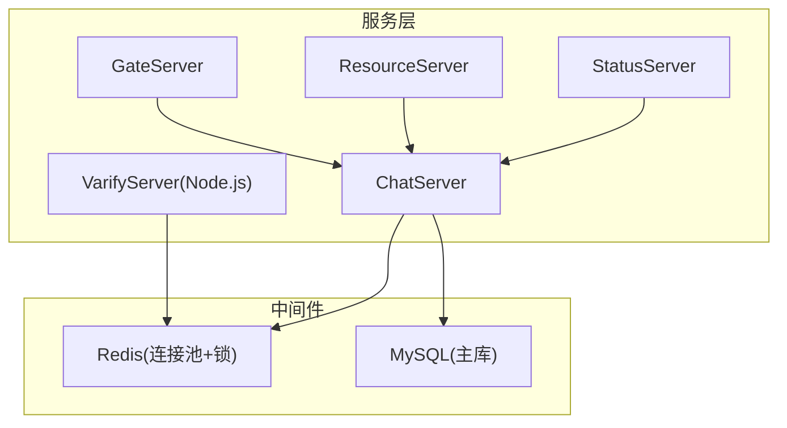
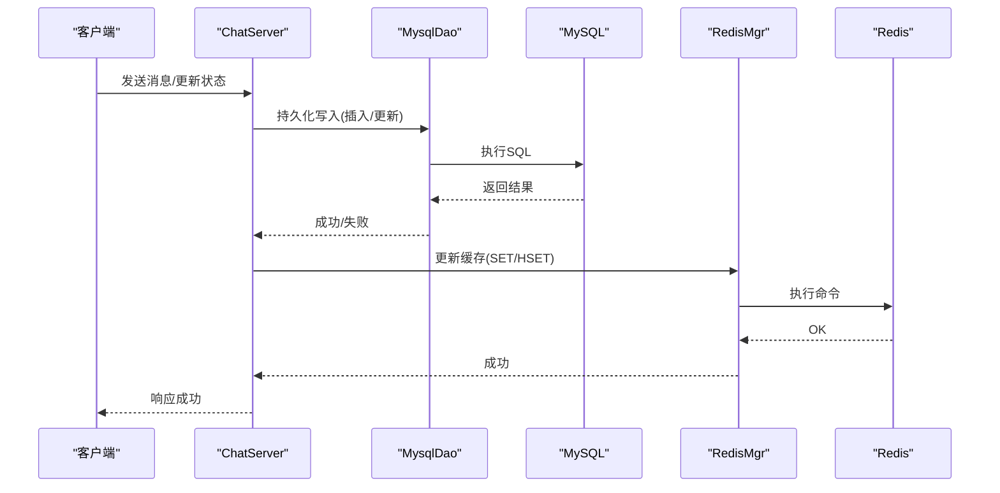
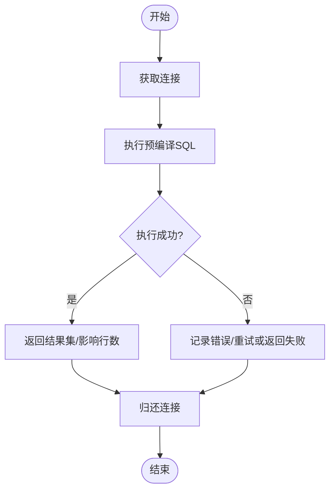
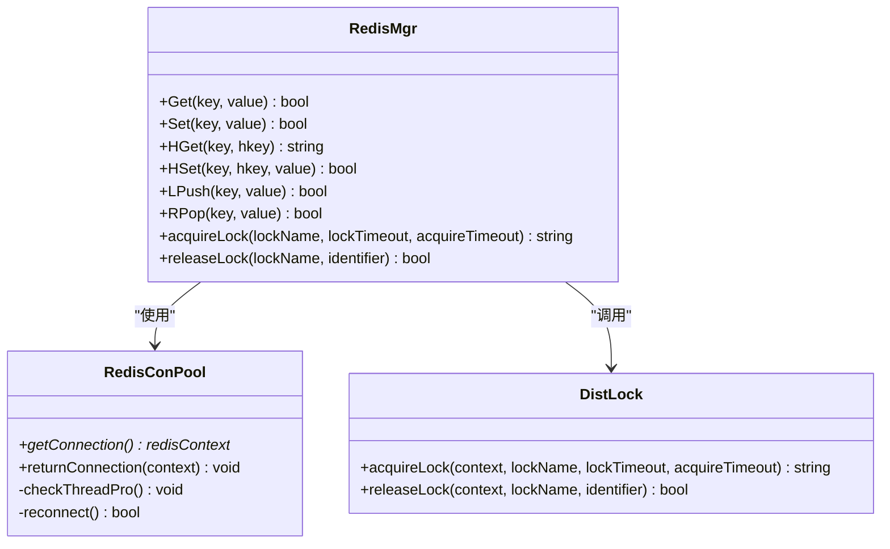
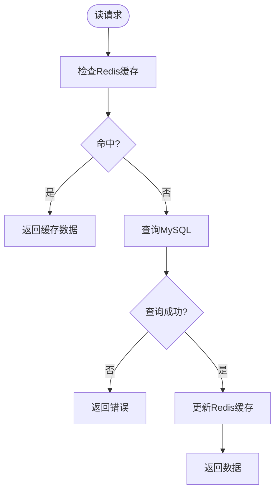
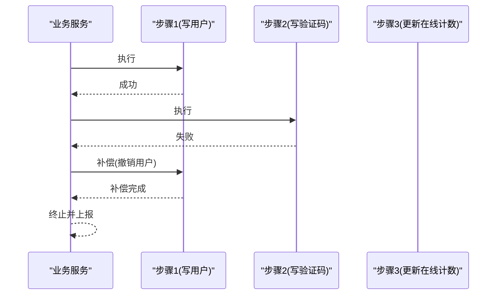
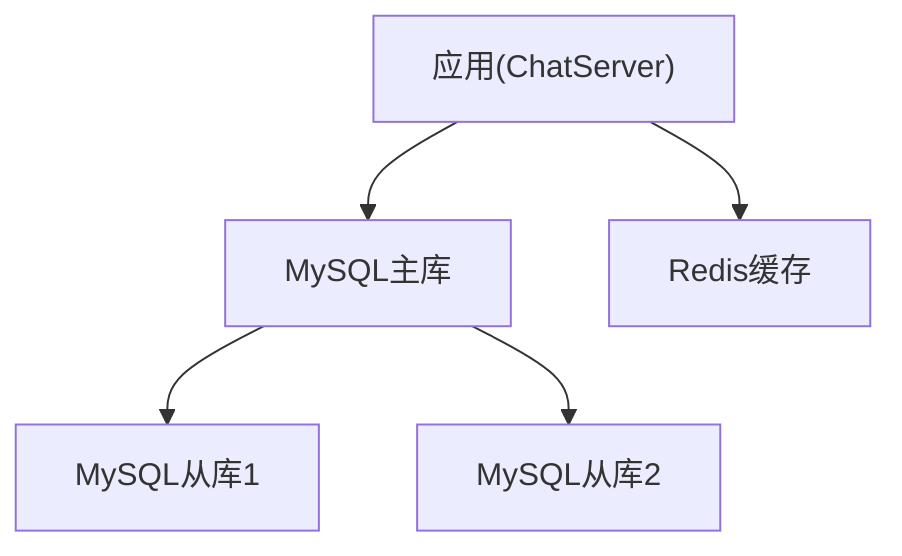
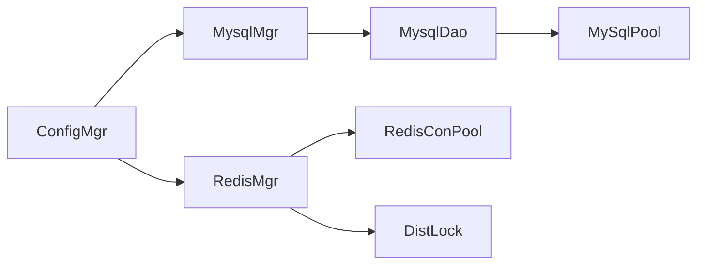

# 数据一致性

<cite>
**本文引用的文件**   
- [MysqlMgr.h](file://server/ChatServer/include/MysqlMgr.h)
- [MysqlMgr.cpp](file://server/ChatServer/src/MysqlMgr.cpp)
- [MysqlDao.h](file://server/ChatServer/include/MysqlDao.h)
- [RedisMgr.h](file://server/ChatServer/include/RedisMgr.h)
- [RedisMgr.cpp](file://server/ChatServer/src/RedisMgr.cpp)
- [DistLock.h](file://server/ChatServer/include/DistLock.h)
- [DistLock.cpp](file://server/ChatServer/src/DistLock.cpp)
- [ConfigMgr.h](file://server/ChatServer/include/ConfigMgr.h)
- [day37-聊天信息存储方案.md](file://开发文档/day37-聊天信息存储方案.md)
- [llfc.sql](file://sql备份/llfc.sql)
</cite>

## 目录
1. [引言](#引言)
2. [项目结构](#项目结构)
3. [核心组件](#核心组件)
4. [架构总览](#架构总览)
5. [详细组件分析](#详细组件分析)
6. [依赖关系分析](#依赖关系分析)
7. [性能考量](#性能考量)
8. [故障排查指南](#故障排查指南)
9. [结论](#结论)
10. [附录](#附录)

## 引言
本技术文档围绕 LLFCChat 的数据一致性方案展开，重点说明 MySQL 与 Redis 的读写分离与缓存一致性策略、分布式锁与分布式事务（Saga 模式与补偿机制）、数据分片与副本同步策略、数据迁移与版本升级、数据校验与修复、备份与恢复流程，以及一致性级别选择与性能权衡建议。文档基于仓库中的 C++ 服务端代码与 SQL 脚本进行分析与总结，力求为工程实践提供可落地的指导。

## 项目结构
LLFCChat 后端服务包含多个独立进程：ChatServer、GateServer、ResourceServer、StatusServer、VarifyServer。其中 ChatServer 承担聊天消息与好友关系的持久化访问，使用 MysqlMgr/MysqlDao 管理 MySQL，使用 RedisMgr 管理 Redis，并通过 DistLock 实现分布式锁。SQL 脚本定义了聊天消息、会话、好友等核心表结构。

**图表来源** 
- [MysqlMgr.h:1-41](file://server/ChatServer/include/MysqlMgr.h#L1-L41)
- [RedisMgr.h:1-305](file://server/ChatServer/include/RedisMgr.h#L1-L305)
- [llfc.sql:1-200](file://sql备份/llfc.sql#L1-L200)

**章节来源**
- [MysqlMgr.h:1-41](file://server/ChatServer/include/MysqlMgr.h#L1-L41)
- [RedisMgr.h:1-305](file://server/ChatServer/include/RedisMgr.h#L1-L305)
- [llfc.sql:1-200](file://sql备份/llfc.sql#L1-L200)

## 核心组件
- MySQL 访问层
  - MysqlMgr：对外暴露用户注册、认证、好友申请、会话创建、消息加载与写入等接口，内部委托给 MysqlDao。
  - MysqlDao：封装数据库连接池、健康检查、重连、预编译语句执行，提供具体 SQL 操作。
- Redis 访问层
  - RedisMgr：封装 GET/SET/HGET/HSET/LPUSH/RPOP 等操作，维护连接池与健康检查，并提供分布式锁获取与释放。
  - DistLock：基于 Redis SET NX EX + Lua 脚本实现原子性加锁与解锁。
- 配置管理
  - ConfigMgr：读取 INI 配置文件，提供按 Section/Key 取值能力，用于初始化 Redis/MySQL 连接参数。

**章节来源**
- [MysqlMgr.h:1-41](file://server/ChatServer/include/MysqlMgr.h#L1-L41)
- [MysqlMgr.cpp:1-95](file://server/ChatServer/src/MysqlMgr.cpp#L1-L95)
- [MysqlDao.h:1-270](file://server/ChatServer/include/MysqlDao.h#L1-L270)
- [RedisMgr.h:1-305](file://server/ChatServer/include/RedisMgr.h#L1-L305)
- [RedisMgr.cpp:1-462](file://server/ChatServer/src/RedisMgr.cpp#L1-L462)
- [DistLock.h:1-18](file://server/ChatServer/include/DistLock.h#L1-L18)
- [DistLock.cpp:1-73](file://server/ChatServer/src/DistLock.cpp#L1-L73)
- [ConfigMgr.h:1-84](file://server/ChatServer/include/ConfigMgr.h#L1-L84)

## 架构总览
整体采用“读多写少”的缓存加速与“强一致写路径”的组合策略：
- 写路径：业务逻辑先落盘 MySQL，再更新 Redis 缓存；必要时通过分布式锁保证并发安全。
- 读路径：优先从 Redis 读取，未命中则回源 MySQL 并回填缓存。
- 分布式锁：基于 Redis 的原子操作与 Lua 脚本，确保临界区互斥。
- 连接池：MySQL 与 Redis 均实现连接池与心跳保活，提升稳定性与吞吐。

**图表来源** 
- [MysqlMgr.cpp:1-95](file://server/ChatServer/src/MysqlMgr.cpp#L1-L95)
- [MysqlDao.h:1-270](file://server/ChatServer/include/MysqlDao.h#L1-L270)
- [RedisMgr.cpp:1-462](file://server/ChatServer/src/RedisMgr.cpp#L1-L462)

## 详细组件分析

### MySQL 数据访问与一致性
- 连接池与保活
  - MySqlPool 维护固定数量的连接，周期性执行 SELECT 1 进行健康检查，异常时重建连接。
  - getConnection/returnConnection 配合条件变量实现线程安全的借还连接。
- 数据模型与索引
  - chat_message：message_id 自增主键，thread_id + message_id 复合索引支持增量拉取。
  - chat_thread：会话类型与创建时间。
  - private_chat/group_chat/group_chat_member：会话成员与权限。
- 分页与游标
  - 通过 lastId 游标与 LIMIT N+1 判断是否还有下一页，避免大 OFFSET 扫描。

**图表来源** 
- [MysqlDao.h:1-270](file://server/ChatServer/include/MysqlDao.h#L1-L270)

**章节来源**
- [MysqlDao.h:1-270](file://server/ChatServer/include/MysqlDao.h#L1-L270)
- [llfc.sql:1-200](file://sql备份/llfc.sql#L1-L200)
- [day37-聊天信息存储方案.md:1-800](file://开发文档/day37-聊天信息存储方案.md#L1-L800)

### Redis 缓存与分布式锁
- 连接池与保活
  - RedisConPool 初始化若干连接，后台线程定期 PING 检测存活，失败连接自动重建。
- 常用操作
  - GET/SET/HGET/HSET/LPUSH/RPOP/DEL/EXISTS 等封装，统一错误处理与资源释放。
- 分布式锁
  - acquireLock：SET key identifier NX EX timeout 原子加锁，带超时与轮询等待。
  - releaseLock：EVAL Lua 脚本仅当值匹配时删除，防止误删他人锁。

**图表来源** 
- [RedisMgr.h:1-305](file://server/ChatServer/include/RedisMgr.h#L1-L305)
- [RedisMgr.cpp:1-462](file://server/ChatServer/src/RedisMgr.cpp#L1-L462)
- [DistLock.h:1-18](file://server/ChatServer/include/DistLock.h#L1-L18)
- [DistLock.cpp:1-73](file://server/ChatServer/src/DistLock.cpp#L1-L73)

**章节来源**
- [RedisMgr.h:1-305](file://server/ChatServer/include/RedisMgr.h#L1-L305)
- [RedisMgr.cpp:1-462](file://server/ChatServer/src/RedisMgr.cpp#L1-L462)
- [DistLock.cpp:1-73](file://server/ChatServer/src/DistLock.cpp#L1-L73)

### 读写分离与缓存一致性策略
- 读路径
  - 优先查询 Redis，未命中则回源 MySQL，成功后回填 Redis 并设置合理过期时间。
- 写路径
  - 先写 MySQL，成功后再更新 Redis；对热点键可采用延迟双删或版本号控制减少脏读。
- 一致性级别
  - 强一致：在关键写路径加分布式锁，串行化更新 MySQL 与 Redis。
  - 最终一致：允许短暂不一致，通过异步任务或监听 Binlog 进行补偿。

[无图表来源，因为该图为概念性流程图]

### 分布式事务（Saga 模式与补偿）
- 设计思路
  - 将跨服务/跨存储的长事务拆分为多个本地事务步骤，每步有对应的补偿操作。
  - 正常流程顺序执行各步骤；任一失败则按已执行步骤逆序执行补偿，直至回滚到初始状态。
- 在本项目中的应用建议
  - 注册/登录流程：若涉及用户表、验证码、在线计数等多存储，可将“写用户”“写验证码”“更新在线计数”拆分为 Saga 步骤。
  - 聊天消息：消息落库后，推送通知与统计计数作为后续步骤；失败则触发补偿（如撤销计数）。
- 关键点
  - 幂等性：每个步骤与补偿必须幂等，避免重复执行导致副作用。
  - 状态机：记录 Saga 当前阶段与已执行步骤，便于恢复与重试。
  - 监控与告警：对失败步骤进行追踪与人工干预入口。

[无图表来源，因为该图为概念性序列图]

### 数据分片与副本同步策略
- 分片策略
  - 按 user_id 或 thread_id 哈希分片，保证同一会话的消息在同一节点，降低跨节点复制开销。
  - 结合游标分页与索引优化，避免全表扫描。
- 副本同步
  - 主从复制：主库写，从库读；利用 Binlog 异步复制，容忍秒级延迟。
  - 一致性权衡：读从库可能读到旧数据，需根据场景选择读主或引入版本号/时间戳比较。
- 冲突解决
  - 以主库为准，客户端侧做去重与合并（基于 message_id 唯一性）。

[无图表来源，因为该图为概念性架构图]

### 数据迁移与版本升级
- 数据库变更
  - 使用 SQL 脚本增量变更，保持向后兼容；新增字段默认值与非空约束需谨慎。
  - 发布前在测试环境验证 DDL 与数据迁移脚本。
- 灰度发布
  - 分批滚动升级服务实例，观察错误率与延迟指标。
- 回滚策略
  - 保留旧版本二进制与配置；DDL 变更尽量可逆，数据迁移脚本具备回滚能力。

[本节为通用指导，不直接分析具体文件]

### 数据校验与修复机制
- 校验
  - 启动时校验关键表结构与索引是否存在。
  - 定时任务比对 Redis 与 MySQL 的一致性（抽样校验），发现不一致触发修复。
- 修复
  - 基于 message_id 的唯一性与有序性，对缺失或重复消息进行补录或删除。
  - 对在线计数等计数器，使用 Redis 原子操作与分布式锁保障准确性。

[本节为通用指导，不直接分析具体文件]

### 备份与恢复流程
- 备份
  - 定期全量备份（mysqldump/物理备份）与增量备份（Binlog）。
  - Redis 持久化（RDB/AOF）与快照导出。
- 恢复
  - 按时间点恢复（PITR），先恢复主库，再回放 Binlog 至目标位点。
  - Redis 恢复 AOF/RDB 文件，重启服务加载。

[本节为通用指导，不直接分析具体文件]

## 依赖关系分析
- 组件耦合
  - MysqlMgr 依赖 MysqlDao，MysqlDao 依赖连接池与 JDBC。
  - RedisMgr 依赖 RedisConPool 与 DistLock。
  - 配置由 ConfigMgr 提供，所有模块通过单例获取。
- 外部依赖
  - MySQL 驱动、hiredis、Boost（UUID/PropertyTree）。

**图表来源** 
- [MysqlMgr.h:1-41](file://server/ChatServer/include/MysqlMgr.h#L1-L41)
- [MysqlDao.h:1-270](file://server/ChatServer/include/MysqlDao.h#L1-L270)
- [RedisMgr.h:1-305](file://server/ChatServer/include/RedisMgr.h#L1-L305)
- [ConfigMgr.h:1-84](file://server/ChatServer/include/ConfigMgr.h#L1-L84)

**章节来源**
- [MysqlMgr.h:1-41](file://server/ChatServer/include/MysqlMgr.h#L1-L41)
- [MysqlDao.h:1-270](file://server/ChatServer/include/MysqlDao.h#L1-L270)
- [RedisMgr.h:1-305](file://server/ChatServer/include/RedisMgr.h#L1-L305)
- [ConfigMgr.h:1-84](file://server/ChatServer/include/ConfigMgr.h#L1-L84)

## 性能考量
- 连接池大小
  - 根据 CPU 核数与 IO 特性调整 MySQL/Redis 连接池大小，避免过多上下文切换。
- 索引与查询
  - 充分利用 (thread_id, message_id) 与 (thread_id, created_at) 索引，避免全表扫描。
- 缓存命中率
  - 热点键设置合理 TTL，避免雪崩；批量读取时使用管道或批量命令。
- 分布式锁粒度
  - 缩小锁粒度，缩短持有时间，减少竞争。
- 读写分离
  - 读多写少场景下，读从库可显著降低主库压力，但需接受延迟。

[本节为通用指导，不直接分析具体文件]

## 故障排查指南
- Redis 连接问题
  - 检查 AUTH 与网络连通性；查看连接池健康检查日志与重连次数。
- MySQL 连接问题
  - 检查 SELECT 1 健康检查失败原因；关注异常堆栈与错误码。
- 分布式锁死锁
  - 确认 acquire/release 成对出现；检查 Lua 脚本返回值与标识符匹配。
- 缓存不一致
  - 核对写路径顺序与异常分支；增加一致性校验任务定位差异。

**章节来源**
- [RedisMgr.cpp:1-462](file://server/ChatServer/src/RedisMgr.cpp#L1-L462)
- [MysqlDao.h:1-270](file://server/ChatServer/include/MysqlDao.h#L1-L270)
- [DistLock.cpp:1-73](file://server/ChatServer/src/DistLock.cpp#L1-L73)

## 结论
LLFCChat 通过 MySQL 与 Redis 的分层设计与连接池保活，实现了高可用与高性能的数据访问；借助 Redis 分布式锁与原子操作，保证了关键路径的并发安全。在分布式环境下，建议采用 Saga 模式拆分长事务，并结合幂等与补偿机制达成最终一致。通过合理的分片与副本策略、完善的迁移与备份恢复流程，以及持续的一致性校验，可在不同一致性级别与性能之间取得平衡。

[本节为总结，不直接分析具体文件]

## 附录
- 数据模型参考
  - chat_message、chat_thread、private_chat、group_chat、group_chat_member 等表结构与索引设计。
- 配置示例
  - Redis/MySQL 的连接参数通过 ConfigMgr 读取 INI 配置。

**章节来源**
- [llfc.sql:1-200](file://sql备份/llfc.sql#L1-L200)
- [ConfigMgr.h:1-84](file://server/ChatServer/include/ConfigMgr.h#L1-L84)