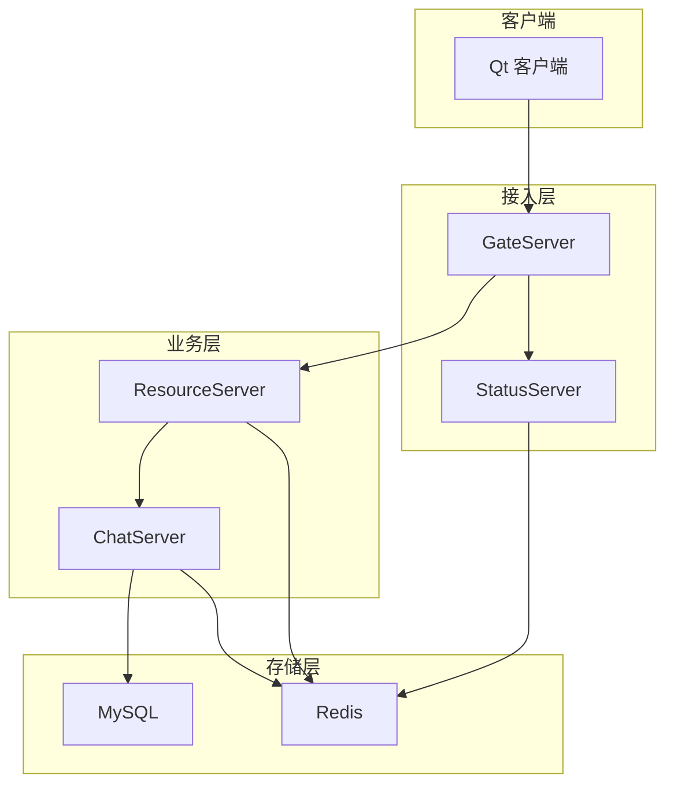
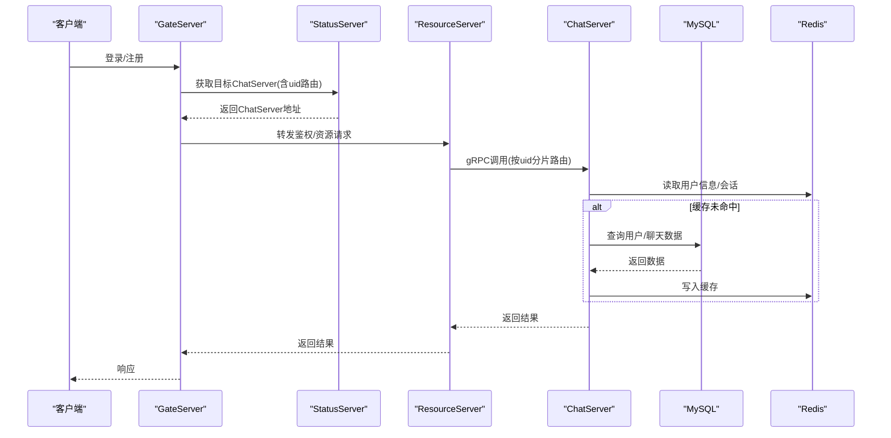
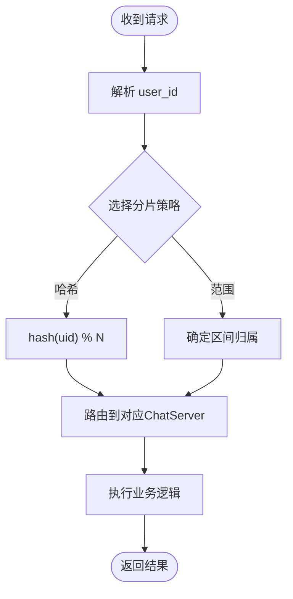
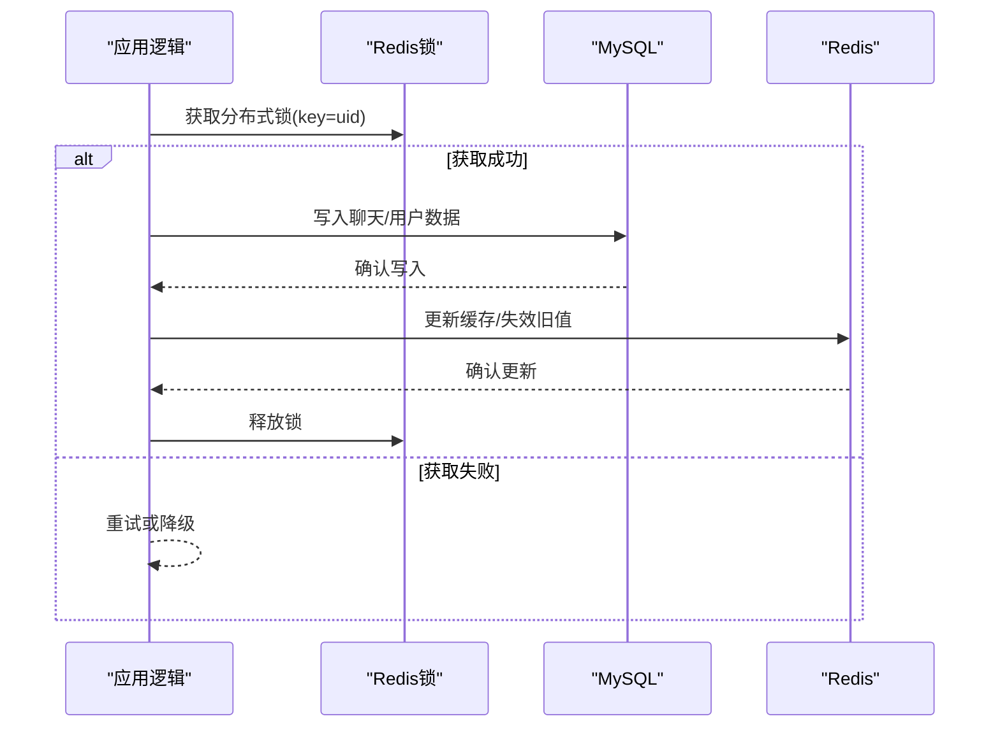
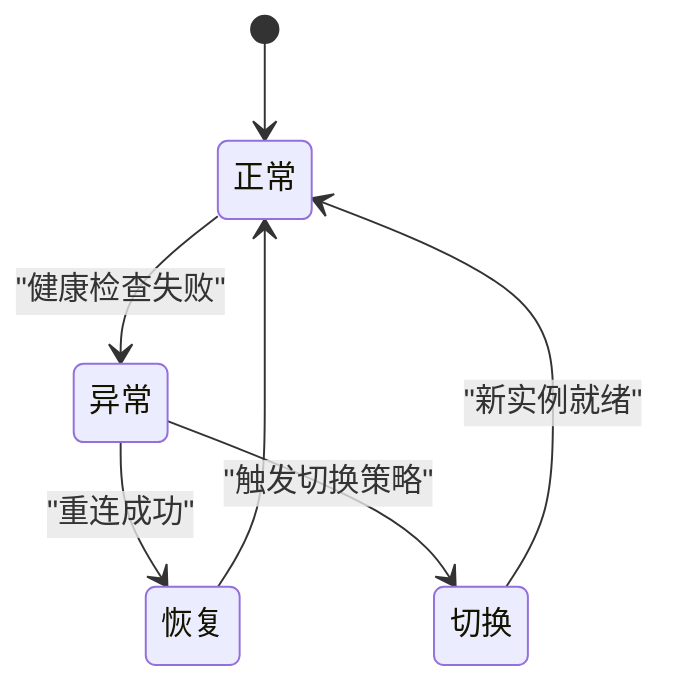
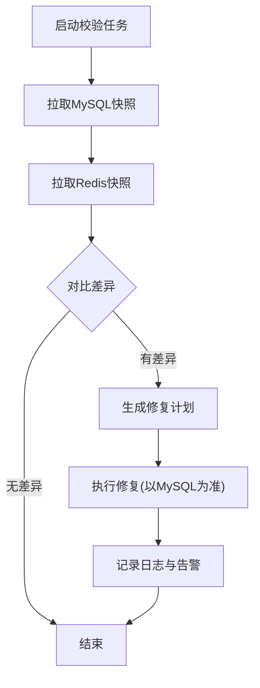
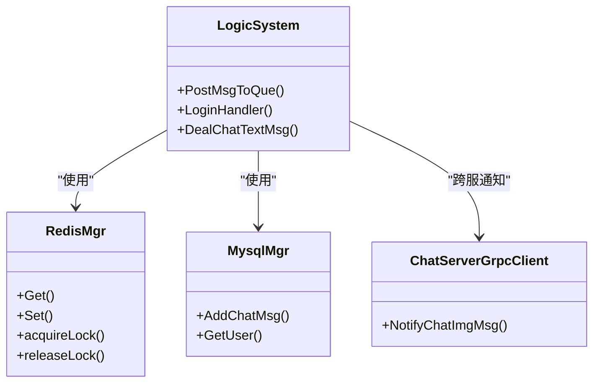

# 数据分片与副本同步

<cite>
**本文引用的文件**   
- [README.md](file://README.md)
- [LogicSystem.h](file://server/ChatServer/include/LogicSystem.h)
- [LogicSystem.cpp](file://server/ChatServer/src/LogicSystem.cpp)
- [UserMgr.h](file://server/ChatServer/include/UserMgr.h)
- [UserMgr.cpp](file://server/ChatServer/src/UserMgr.cpp)
- [MysqlMgr.h](file://server/ChatServer/include/MysqlMgr.h)
- [MysqlDao.h](file://server/ChatServer/include/MysqlDao.h)
- [RedisMgr.h](file://server/ChatServer/include/RedisMgr.h)
- [config.ini（ResourceServer）](file://server/ResourceServer/config/config.ini)
- [ChatServerGrpcClient.cpp](file://server/ResourceServer/src/ChatServerGrpcClient.cpp)
- [VerifyGrpcClient.cpp](file://server/GateServer/src/VerifyGrpcClient.cpp)
- [day27-分布式服务设计.md](file://开发文档/day27-分布式服务设计.md)
- [day32分布式锁设计思路.md](file://开发文档/day32分布式锁设计思路.md)
- [llfc.sql](file://sql备份/llfc.sql)
- [chat_message.sql](file://sql备份/chat_message.sql)
</cite>

## 目录
1. [简介](#简介)
2. [项目结构](#项目结构)
3. [核心组件](#核心组件)
4. [架构总览](#架构总览)
5. [详细组件分析](#详细组件分析)
6. [依赖关系分析](#依赖关系分析)
7. [性能考虑](#性能考虑)
8. [故障排查指南](#故障排查指南)
9. [结论](#结论)
10. [附录](#附录)

## 简介
本技术文档围绕 LLFCChat 的数据分片与副本同步展开，重点说明：
- 用户数据的分片策略：按用户ID哈希分片与范围分片的实现方案、分片键选择与负载均衡策略。
- 主从复制与数据一致性：多节点间的一致性保障、副本故障检测与自动切换机制。
- 配置与扩容迁移：分片配置示例、在线扩容与数据迁移流程。
- 监控与调优：分片监控指标、热点与倾斜规避建议、性能优化要点。

本项目已具备分布式基础能力（gRPC 跨服通信、Redis 缓存与分布式锁、MySQL 持久化），为分片与副本同步提供了必要支撑。

**章节来源**
- [README.md](file://README.md)

## 项目结构
LLFCChat 采用多服务架构：客户端（Qt/C++）、网关（GateServer）、聊天服务（ChatServer）、资源服务（ResourceServer）、状态服务（StatusServer）、验证服务（VarifyServer）。数据存储层使用 MySQL 与 Redis。

**图示来源**
- [config.ini（ResourceServer）:1-26](file://server/ResourceServer/config/config.ini#L1-L26)
- [ChatServerGrpcClient.cpp:32-52](file://server/ResourceServer/src/ChatServerGrpcClient.cpp#L32-L52)

**章节来源**
- [config.ini（ResourceServer）:1-26](file://server/ResourceServer/config/config.ini#L1-L26)
- [ChatServerGrpcClient.cpp:32-52](file://server/ResourceServer/src/ChatServerGrpcClient.cpp#L32-L52)

## 核心组件
- 逻辑系统 LogicSystem：消息路由、会话绑定、跨服通知、好友申请与认证、聊天消息处理等。
- 用户会话管理 UserMgr：维护 uid 到 session 的映射，支持踢人、会话清理。
- 数据库访问 MysqlMgr/MysqlDao：用户信息、好友关系、聊天消息读写；连接池与健康检查。
- 缓存与分布式锁 RedisMgr：用户信息缓存、登录态、分布式锁、计数器等。
- gRPC 客户端 ChatServerGrpcClient：按服务器名称建立连接池，用于跨服通知与转发。
- 配置管理：各服务通过配置文件声明自身与对端地址端口。

**章节来源**
- [LogicSystem.h:1-60](file://server/ChatServer/include/LogicSystem.h#L1-L60)
- [LogicSystem.cpp:1-120](file://server/ChatServer/src/LogicSystem.cpp#L1-L120)
- [UserMgr.h:1-22](file://server/ChatServer/include/UserMgr.h#L1-L22)
- [UserMgr.cpp:1-50](file://server/ChatServer/src/UserMgr.cpp#L1-L50)
- [MysqlMgr.h:1-41](file://server/ChatServer/include/MysqlMgr.h#L1-L41)
- [MysqlDao.h:102-160](file://server/ChatServer/include/MysqlDao.h#L102-L160)
- [RedisMgr.h:1-305](file://server/ChatServer/include/RedisMgr.h#L1-L305)
- [ChatServerGrpcClient.cpp:32-52](file://server/ResourceServer/src/ChatServerGrpcClient.cpp#L32-L52)

## 架构总览
当前代码已实现“按服务器名”的多实例通信与基本分布式能力。分片与副本同步可基于以下扩展点落地：
- 分片键：以 user_id 为主键进行哈希或范围分片。
- 路由：根据 user_id 计算分片位置，将请求定向到对应 ChatServer 实例。
- 一致性：通过 Redis 分布式锁与事务保证写一致；读路径优先 Redis，回源 MySQL。
- 副本：引入主从复制（如 MySQL 主从或 Redis 主从），配合健康检查与自动切换。

**图示来源**
- [LogicSystem.cpp:116-252](file://server/ChatServer/src/LogicSystem.cpp#L116-L252)
- [ChatServerGrpcClient.cpp:32-52](file://server/ResourceServer/src/ChatServerGrpcClient.cpp#L32-L52)
- [RedisMgr.h:267-305](file://server/ChatServer/include/RedisMgr.h#L267-L305)

## 详细组件分析

### 分片键选择与路由策略
- 分片键：user_id（整数型，唯一且稳定）。
- 哈希分片：hash(user_id) % N（N 为分片数），适用于均匀分布与快速定位。
- 范围分片：按 user_id 区间划分（如 1-10000 -> 分片A），便于有序扫描与范围查询。
- 路由实现：在 ResourceServer 中维护 chatserver1/chatserver2 的连接池，结合配置与 uid 计算目标实例。

**图示来源**
- [config.ini（ResourceServer）:19-26](file://server/ResourceServer/config/config.ini#L19-L26)
- [ChatServerGrpcClient.cpp:32-52](file://server/ResourceServer/src/ChatServerGrpcClient.cpp#L32-L52)

**章节来源**
- [config.ini（ResourceServer）:1-26](file://server/ResourceServer/config/config.ini#L1-L26)
- [ChatServerGrpcClient.cpp:32-52](file://server/ResourceServer/src/ChatServerGrpcClient.cpp#L32-L52)

### 主从复制与数据一致性
- 写路径：先落库（MySQL），再更新缓存（Redis），必要时加分布式锁避免并发冲突。
- 读路径：优先读 Redis，未命中则回源 MySQL 并回填缓存。
- 一致性：分布式锁（Redis）确保关键操作的原子性；会话与登录态通过 Redis 统一维护。

**图示来源**
- [RedisMgr.h:267-305](file://server/ChatServer/include/RedisMgr.h#L267-L305)
- [LogicSystem.cpp:116-252](file://server/ChatServer/src/LogicSystem.cpp#L116-L252)

**章节来源**
- [RedisMgr.h:267-305](file://server/ChatServer/include/RedisMgr.h#L267-L305)
- [LogicSystem.cpp:116-252](file://server/ChatServer/src/LogicSystem.cpp#L116-L252)

### 副本故障检测与自动切换
- 健康检查：Redis 连接池周期性 PING 检测，异常连接剔除并重连。
- 服务发现：StatusServer 维护 ChatServer 连接数与状态，GateServer 据此选择负载最小的实例。
- 自动切换：当目标 ChatServer 不可用时，切换到其他可用实例或降级为只读。

**图示来源**
- [RedisMgr.h:137-206](file://server/ChatServer/include/RedisMgr.h#L137-L206)
- [day27-分布式服务设计.md:221-276](file://开发文档/day27-分布式服务设计.md#L221-L276)

**章节来源**
- [RedisMgr.h:137-206](file://server/ChatServer/include/RedisMgr.h#L137-L206)
- [day27-分布式服务设计.md:221-276](file://开发文档/day27-分布式服务设计.md#L221-L276)

### 数据校验与修复流程
- 校验：定期比对 Redis 与 MySQL 的关键数据（如用户基本信息、会话状态），差异项标记修复。
- 修复：以 MySQL 为准，增量同步至 Redis；对不一致的会话状态进行重建或清理。
- 审计：记录修复日志，便于追溯与告警。

[此图为概念流程图，不直接映射具体源码文件]

### 分片配置示例
- 分片数 N：初始 2（chatserver1、chatserver2），可按需扩展。
- 路由表：ResourceServer 配置中声明各 ChatServer 的 Host/Port。
- 键空间：user_id 作为分片键，所有涉及用户的数据均按该键路由。

**章节来源**
- [config.ini（ResourceServer）:19-26](file://server/ResourceServer/config/config.ini#L19-L26)

### 扩容与迁移方案
- 水平扩容：新增 ChatServer 实例，更新 ResourceServer 配置，调整分片策略（如 N+1）。
- 数据迁移：按 user_id 区间或哈希桶逐步迁移，迁移期间双写保证一致性。
- 流量切换：灰度切流，观察延迟与错误率，逐步全量切换。

[本节为通用方案说明，不直接引用具体源码文件]

## 依赖关系分析
- LogicSystem 依赖 RedisMgr（缓存/锁）、MysqlMgr（持久化）、ChatGrpcClient（跨服通知）。
- ResourceServer 依赖 ChatServerGrpcClient（按服务器名路由）、RedisMgr（缓存/进度）。
- GateServer 依赖 VerifyGrpcClient（验证码服务）与 StatusGrpcClient（状态服务）。

**图示来源**
- [LogicSystem.h:1-60](file://server/ChatServer/include/LogicSystem.h#L1-L60)
- [RedisMgr.h:267-305](file://server/ChatServer/include/RedisMgr.h#L267-L305)
- [MysqlMgr.h:1-41](file://server/ChatServer/include/MysqlMgr.h#L1-L41)
- [ChatServerGrpcClient.cpp:32-52](file://server/ResourceServer/src/ChatServerGrpcClient.cpp#L32-L52)

**章节来源**
- [LogicSystem.h:1-60](file://server/ChatServer/include/LogicSystem.h#L1-L60)
- [RedisMgr.h:267-305](file://server/ChatServer/include/RedisMgr.h#L267-L305)
- [MysqlMgr.h:1-41](file://server/ChatServer/include/MysqlMgr.h#L1-L41)
- [ChatServerGrpcClient.cpp:32-52](file://server/ResourceServer/src/ChatServerGrpcClient.cpp#L32-L52)

## 性能考虑
- 缓存命中率：提升 Redis 命中率，降低 MySQL 压力。
- 连接池大小：合理设置 Redis/MySQL/gRPC 连接池大小，避免过多上下文切换。
- 异步处理：大对象（图片/文件）采用断点续传与异步下载，减少阻塞。
- 热点规避：分片键选择均匀分布，避免单点热点；必要时引入二级分片或本地缓存。

[本节为通用指导，不直接引用具体源码文件]

## 故障排查指南
- 连接问题：检查 Redis/MySQL 连接池健康检查与重连逻辑。
- 锁竞争：查看分布式锁获取/释放是否匹配，是否存在超时未释放。
- 路由错误：核对 ResourceServer 配置与 uid 路由计算是否正确。
- 数据不一致：对比 Redis 与 MySQL 快照，定位差异并修复。

**章节来源**
- [RedisMgr.h:137-206](file://server/ChatServer/include/RedisMgr.h#L137-L206)
- [MysqlDao.h:102-160](file://server/ChatServer/include/MysqlDao.h#L102-L160)
- [day32分布式锁设计思路.md:1-38](file://开发文档/day32分布式锁设计思路.md#L1-L38)

## 结论
LLFCChat 已具备分布式基础能力，通过引入 user_id 分片键、Redis 分布式锁与连接池健康检查，可实现稳定的分片与副本同步。后续应完善分片路由、数据迁移与一致性校验，构建高可用、可扩展的聊天数据平台。

[本节为总结，不直接引用具体源码文件]

## 附录
- 数据库表结构参考：chat_message、private_chat、friend_apply 等。
- 分布式服务设计：StatusServer 负载均衡、ChatServer 多实例通信。

**章节来源**
- [llfc.sql:1-457](file://sql备份/llfc.sql#L1-L457)
- [chat_message.sql:1-38](file://sql备份/chat_message.sql#L1-L38)
- [day27-分布式服务设计.md:1-276](file://开发文档/day27-分布式服务设计.md#L1-L276)