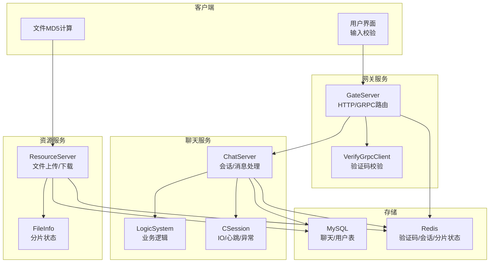
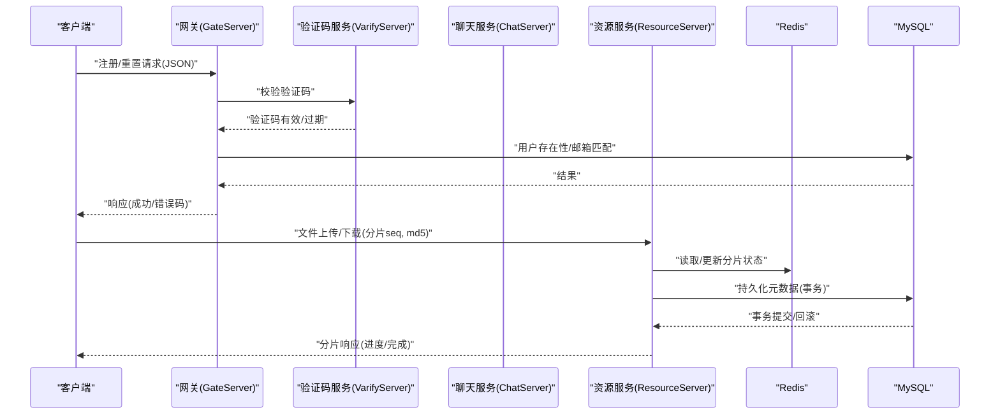
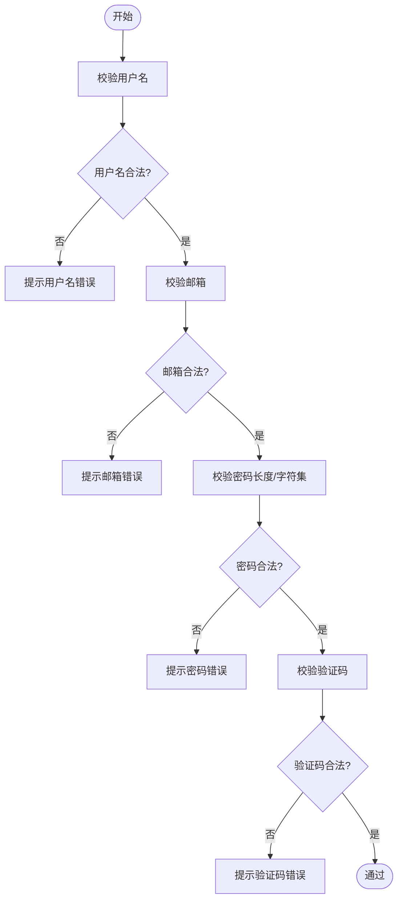
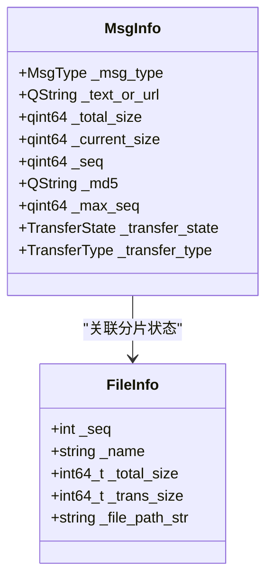
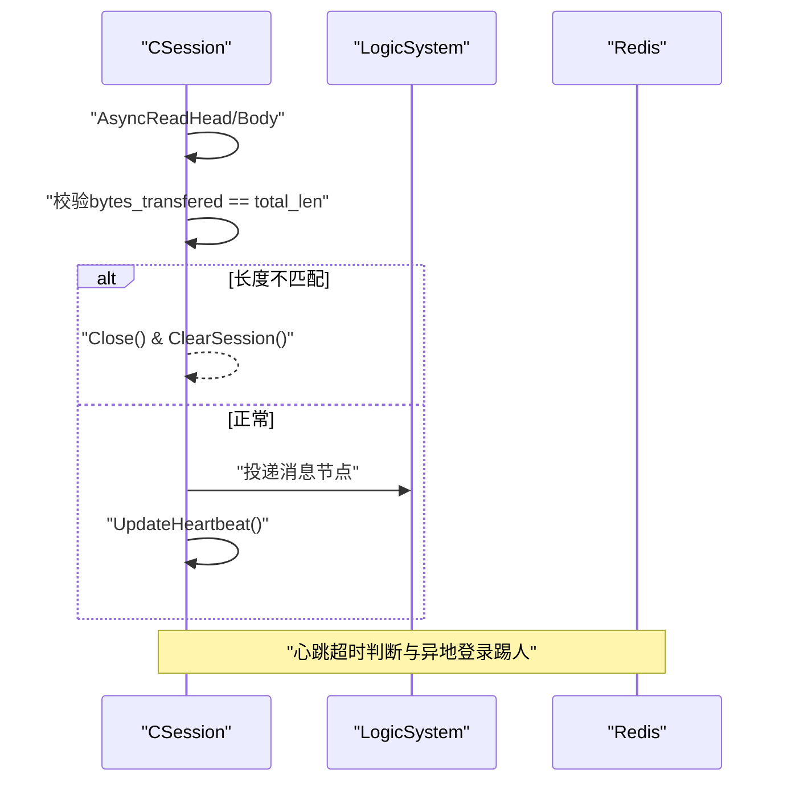
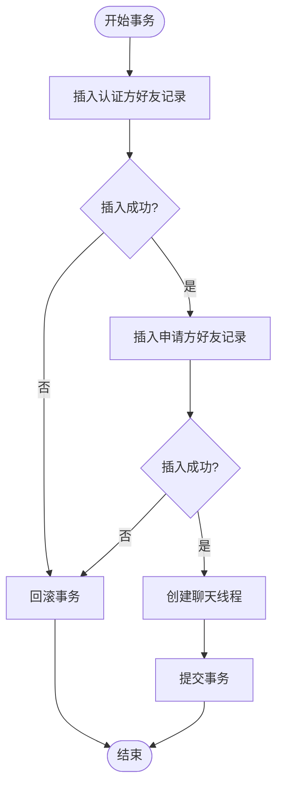
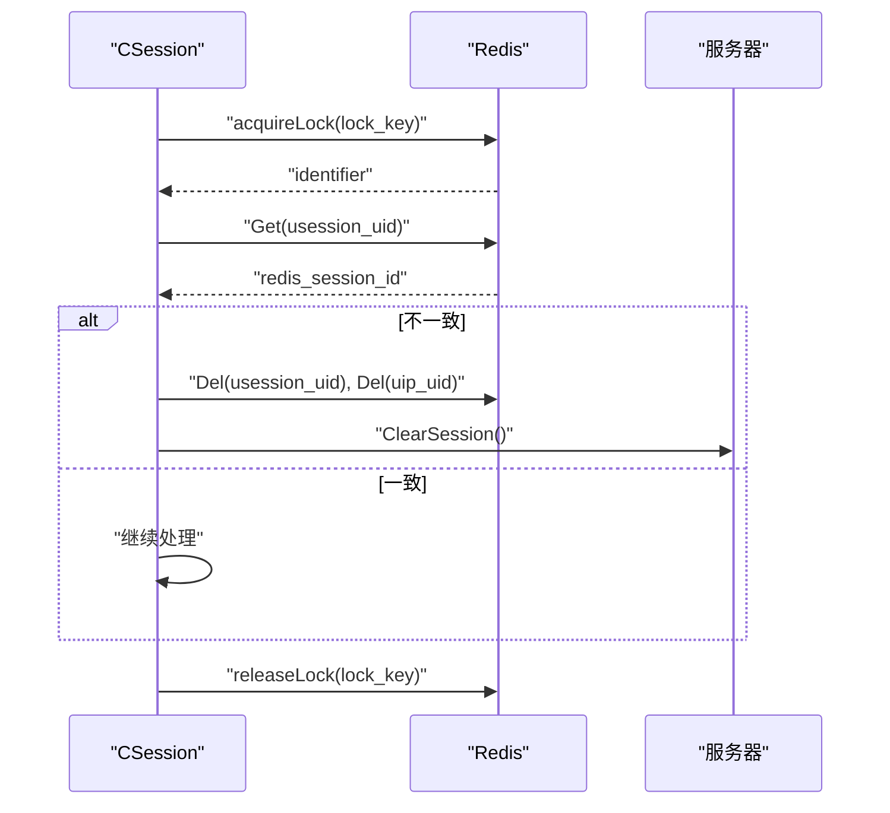
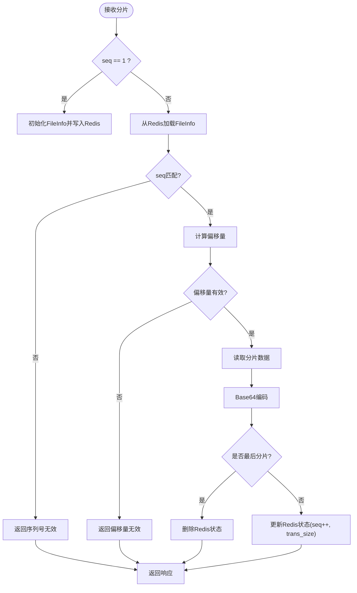
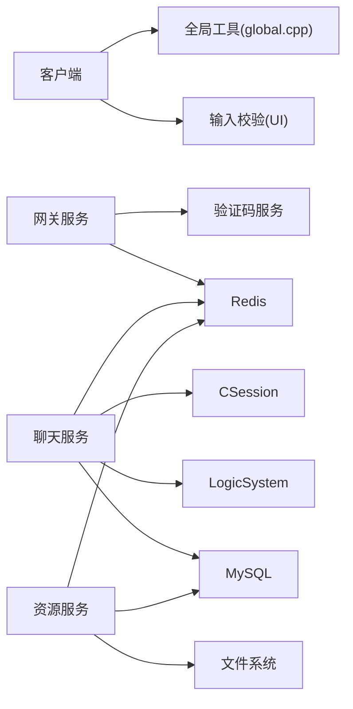

# 数据校验与修复机制

<cite>
**本文引用的文件**   
- [global.cpp](file://client/llfcchat/src/global.cpp)
- [MessageTextEdit.cpp](file://client/llfcchat/src/MessageTextEdit.cpp)
- [CSession.cpp](file://server/ChatServer/src/CSession.cpp)
- [LogicSystem.cpp](file://server/ChatServer/src/LogicSystem.cpp)
- [const.h](file://server/ChatServer/include/const.h)
- [data.h](file://server/ChatServer/include/data.h)
- [FileInfo.h](file://server/ResourceServer/include/FileInfo.h)
- [MysqlDao.cpp](file://server/ResourceServer/src/MysqlDao.cpp)
- [VerifyGrpcClient.cpp](file://server/GateServer/src/VerifyGrpcClient.cpp)
- [chat_message.sql](file://sql备份/chat_message.sql)
- [llfc3.sql](file://sql备份/llfc3.sql)
- [day12-注册界面完善.md](file://开发文档/day12-注册界面完善.md)
- [day13-重置界面.md](file://开发文档/day13-重置界面.md)
- [day35心跳逻辑.md](file://开发文档/day35心跳逻辑.md)
- [day38-断点续传.md](file://开发文档/day38-断点续传.md)
- [day41-通知客户端异步下载聊天图片.md](file://开发文档/day41-通知客户端异步下载聊天图片.md)
</cite>

## 目录
1. [引言](#引言)
2. [项目结构](#项目结构)
3. [核心组件](#核心组件)
4. [架构总览](#架构总览)
5. [详细组件分析](#详细组件分析)
6. [依赖关系分析](#依赖关系分析)
7. [性能考量](#性能考量)
8. [故障排查指南](#故障排查指南)
9. [结论](#结论)
10. [附录](#附录)

## 引言
本技术文档聚焦于 LLFCChat 的数据完整性校验与修复机制，覆盖业务规则验证、数据格式检查、一致性检测（CRC/哈希）、批量与增量修复流程、版本管理与向后兼容、迁移回滚策略，以及数据质量监控与告警配置。文档以代码级事实为依据，结合现有实现中的校验点（如 JSON 解析、长度校验、MD5 校验、序列号校验、Redis 状态一致性）与修复路径（断点续传、事务回滚、分布式锁保护），为开发者提供可操作的规范与实践建议。

## 项目结构
LLFCChat 采用多服务架构：客户端（Qt/C++）、网关服务（GateServer）、聊天服务（ChatServer）、资源服务（ResourceServer）、验证码服务（VarifyServer），并使用 MySQL 与 Redis 作为持久化与缓存层。数据校验贯穿客户端输入、网络传输、服务端处理与存储各层；数据修复在传输中断、状态不一致等场景下通过断点续传、事务回滚与分布式锁保障最终一致性。

图表来源 
- [VerifyGrpcClient.cpp:1-9](file://server/GateServer/src/VerifyGrpcClient.cpp#L1-L9)
- [CSession.cpp:184-224](file://server/ChatServer/src/CSession.cpp#L184-L224)
- [LogicSystem.cpp:564-591](file://server/ChatServer/src/LogicSystem.cpp#L564-L591)
- [FileInfo.h:1-26](file://server/ResourceServer/include/FileInfo.h#L1-L26)
- [chat_message.sql:1-38](file://sql备份/chat_message.sql#L1-L38)

章节来源
- [VerifyGrpcClient.cpp:1-9](file://server/GateServer/src/VerifyGrpcClient.cpp#L1-L9)
- [CSession.cpp:184-224](file://server/ChatServer/src/CSession.cpp#L184-L224)
- [LogicSystem.cpp:564-591](file://server/ChatServer/src/LogicSystem.cpp#L564-L591)
- [FileInfo.h:1-26](file://server/ResourceServer/include/FileInfo.h#L1-L26)
- [chat_message.sql:1-38](file://sql备份/chat_message.sql#L1-L38)

## 核心组件
- 客户端输入与格式校验：用户名、邮箱、密码、验证码等正则与长度校验，错误提示管理。
- 文件完整性校验：基于 MD5 的文件哈希计算，用于去重与一致性比对。
- 网络层数据完整性：JSON 解析校验、报文长度校验、序列号校验、心跳超时检测。
- 存储层一致性：Redis 中分片状态、会话信息、验证码的读写一致性；MySQL 事务回滚。
- 分布式一致性：分布式锁保护关键操作（踢人、会话清理）。

章节来源
- [day12-注册界面完善.md:133-203](file://开发文档/day12-注册界面完善.md#L133-L203)
- [day13-重置界面.md:88-173](file://开发文档/day13-重置界面.md#L88-L173)
- [global.cpp:46-63](file://client/llfcchat/src/global.cpp#L46-L63)
- [MessageTextEdit.cpp:175-192](file://client/llfcchat/src/MessageTextEdit.cpp#L175-L192)
- [CSession.cpp:184-224](file://server/ChatServer/src/CSession.cpp#L184-L224)
- [LogicSystem.cpp:564-591](file://server/ChatServer/src/LogicSystem.cpp#L564-L591)
- [MysqlDao.cpp:302-349](file://server/ResourceServer/src/MysqlDao.cpp#L302-L349)

## 架构总览
下图展示数据校验与修复的关键调用链：客户端发起请求，网关进行验证码校验，聊天服务处理消息并维护会话心跳，资源服务负责文件分片上传/下载，Redis 与 MySQL 保证状态与持久化的一致性。

图表来源 
- [day13-重置界面.md:323-395](file://开发文档/day13-重置界面.md#L323-L395)
- [day11-注册功能.md:636-707](file://开发文档/day11-注册功能.md#L636-L707)
- [day38-断点续传.md:1924-2041](file://开发文档/day38-断点续传.md#L1924-L2041)
- [day41-通知客户端异步下载聊天图片.md:571-709](file://开发文档/day41-通知客户端异步下载聊天图片.md#L571-L709)
- [MysqlDao.cpp:302-349](file://server/ResourceServer/src/MysqlDao.cpp#L302-L349)

## 详细组件分析

### 客户端输入与格式校验
- 用户名非空、邮箱正则匹配、密码长度与字符集限制、验证码非空。
- 错误提示统一管理，避免重复提示。

图表来源 
- [day12-注册界面完善.md:133-203](file://开发文档/day12-注册界面完善.md#L133-L203)
- [day13-重置界面.md:88-173](file://开发文档/day13-重置界面.md#L88-L173)

章节来源
- [day12-注册界面完善.md:133-203](file://开发文档/day12-注册界面完善.md#L133-L203)
- [day13-重置界面.md:88-173](file://开发文档/day13-重置界面.md#L88-L173)

### 文件完整性校验（MD5）
- 客户端对文件按块计算 MD5，生成唯一文件名，记录到消息列表。
- 服务端在上传/下载过程中使用 seq 与 total_size/trans_size 跟踪进度，必要时校验一致性。

图表来源 
- [global.h:167-199](file://client/llfcchat/include/global.h#L167-L199)
- [FileInfo.h:1-26](file://server/ResourceServer/include/FileInfo.h#L1-L26)

章节来源
- [global.cpp:46-63](file://client/llfcchat/src/global.cpp#L46-L63)
- [MessageTextEdit.cpp:175-192](file://client/llfcchat/src/MessageTextEdit.cpp#L175-L192)
- [FileInfo.h:1-26](file://server/ResourceServer/include/FileInfo.h#L1-L26)

### 网络层数据完整性与心跳
- JSON 解析失败返回统一错误码。
- 读长度不匹配则关闭连接并清理会话。
- 心跳超时判定连接失效，触发下线流程。

图表来源 
- [CSession.cpp:184-224](file://server/ChatServer/src/CSession.cpp#L184-L224)
- [day35心跳逻辑.md:367-444](file://开发文档/day35心跳逻辑.md#L367-L444)

章节来源
- [CSession.cpp:184-224](file://server/ChatServer/src/CSession.cpp#L184-L224)
- [day35心跳逻辑.md:367-444](file://开发文档/day35心跳逻辑.md#L367-L444)

### 存储层一致性与事务回滚
- 好友关系创建涉及双向插入，任一失败需回滚。
- 聊天线程创建与消息写入在同一事务内，确保原子性。

图表来源 
- [MysqlDao.cpp:302-349](file://server/ResourceServer/src/MysqlDao.cpp#L302-L349)

章节来源
- [MysqlDao.cpp:302-349](file://server/ResourceServer/src/MysqlDao.cpp#L302-L349)

### 分布式锁与会话一致性
- 使用 Redis 分布式锁保护会话清理与踢人逻辑，防止并发冲突。
- 比较 Redis 中保存的 session_id 与当前 session_id，不一致则强制下线。

图表来源 
- [day35心跳逻辑.md:95-146](file://开发文档/day35心跳逻辑.md#L95-L146)
- [day33单服程踢人逻辑.md:397-460](file://开发文档/day33单服程踢人逻辑.md#L397-L460)

章节来源
- [day35心跳逻辑.md:95-146](file://开发文档/day35心跳逻辑.md#L95-L146)
- [day33单服程踢人逻辑.md:397-460](file://开发文档/day33单服程踢人逻辑.md#L397-L460)

### 断点续传与增量修复
- 上传/下载过程使用 Redis 存储分片状态（seq、trans_size、total_size），支持断点续传。
- 首次分片初始化状态，后续分片校验 seq 与偏移量，完成后清理状态。

图表来源 
- [day38-断点续传.md:1924-2041](file://开发文档/day38-断点续传.md#L1924-L2041)
- [day41-通知客户端异步下载聊天图片.md:571-709](file://开发文档/day41-通知客户端异步下载聊天图片.md#L571-L709)

章节来源
- [day38-断点续传.md:1924-2041](file://开发文档/day38-断点续传.md#L1924-L2041)
- [day41-通知客户端异步下载聊天图片.md:571-709](file://开发文档/day41-通知客户端异步下载聊天图片.md#L571-L709)

### 数据版本管理与向后兼容
- 数据库表结构演进（如 chat_message 增加 msg_type 字段）需保持向后兼容。
- 客户端与服务端协议枚举（ChatMsgType）扩展时，旧客户端应忽略未知类型或降级处理。

章节来源
- [chat_message.sql:1-38](file://sql备份/chat_message.sql#L1-L38)
- [llfc3.sql:1-38](file://sql备份/llfc3.sql#L1-L38)
- [data.h:60-65](file://server/ChatServer/include/data.h#L60-L65)

### 迁移与回滚机制
- 使用 MySQL 事务包裹多步写入，任何一步失败均回滚，保证原子性。
- 针对分片状态与下载进度，Redis 设置过期时间，避免脏数据长期残留。

章节来源
- [MysqlDao.cpp:302-349](file://server/ResourceServer/src/MysqlDao.cpp#L302-L349)
- [day41-通知客户端异步下载聊天图片.md:571-709](file://开发文档/day41-通知客户端异步下载聊天图片.md#L571-L709)

## 依赖关系分析
- 客户端依赖全局工具（MD5、唯一文件名生成）与 UI 校验模块。
- 网关服务依赖验证码服务与 Redis。
- 聊天服务依赖会话管理、逻辑系统、Redis、MySQL。
- 资源服务依赖文件系统、Redis、MySQL。

图表来源 
- [global.cpp:46-63](file://client/llfcchat/src/global.cpp#L46-L63)
- [VerifyGrpcClient.cpp:1-9](file://server/GateServer/src/VerifyGrpcClient.cpp#L1-L9)
- [CSession.cpp:184-224](file://server/ChatServer/src/CSession.cpp#L184-L224)
- [LogicSystem.cpp:564-591](file://server/ChatServer/src/LogicSystem.cpp#L564-L591)

章节来源
- [global.cpp:46-63](file://client/llfcchat/src/global.cpp#L46-L63)
- [VerifyGrpcClient.cpp:1-9](file://server/GateServer/src/VerifyGrpcClient.cpp#L1-L9)
- [CSession.cpp:184-224](file://server/ChatServer/src/CSession.cpp#L184-L224)
- [LogicSystem.cpp:564-591](file://server/ChatServer/src/LogicSystem.cpp#L564-L591)

## 性能考量
- 大文件 MD5 计算采用分块读取，降低内存占用。
- 分片大小与拥塞窗口控制平衡吞吐与稳定性。
- Redis 作为分片状态与验证码的高速缓存，减少数据库压力。
- 心跳阈值与超时策略影响连接回收效率。

[本节为通用指导，无需特定文件引用]

## 故障排查指南
- JSON 解析失败：检查请求体结构与编码，确认后端解析器配置。
- 长度不匹配：检查粘包/拆包处理，确认 HEAD_TOTAL_LEN 与数据长度字段。
- 验证码过期/错误：核对 Redis 中验证码键值与 TTL。
- 会话不一致：检查 Redis 中 usession_ 与 uip_ 键值，确认分布式锁释放。
- 分片状态异常：查看 Redis 中分片状态键，核对 seq 与 trans_size。

章节来源
- [day13-重置界面.md:323-395](file://开发文档/day13-重置界面.md#L323-L395)
- [CSession.cpp:184-224](file://server/ChatServer/src/CSession.cpp#L184-L224)
- [day35心跳逻辑.md:367-444](file://开发文档/day35心跳逻辑.md#L367-L444)
- [day38-断点续传.md:1924-2041](file://开发文档/day38-断点续传.md#L1924-L2041)

## 结论
LLFCChat 的数据校验与修复机制覆盖输入、传输、存储全链路，通过 MD5 校验、JSON/长度/序列号校验、心跳超时、分布式锁与事务回滚等手段保障数据一致性与可靠性。断点续传与 Redis 状态管理为大规模文件传输提供稳健支撑。建议在后续迭代中补充 CRC 校验、更细粒度的监控指标与自动化修复脚本，进一步提升数据质量与运维效率。

[本节为总结，无需特定文件引用]

## 附录
- 校验规则定义：用户名非空、邮箱正则、密码长度与字符集、验证码非空。
- 一致性检测：MD5 文件哈希、seq 序列号校验、Redis 状态一致性。
- 修复流程：断点续传、事务回滚、分布式锁保护。
- 版本兼容：数据库字段扩展、协议枚举扩展。
- 监控告警：建议接入日志聚合与指标采集，对解析失败、长度不匹配、验证码过期、会话不一致、分片异常等事件进行告警。

[本节为补充说明，无需特定文件引用]