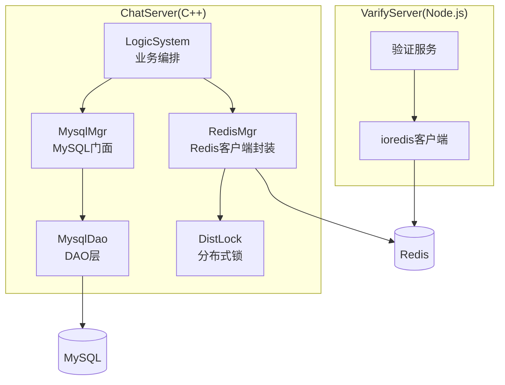
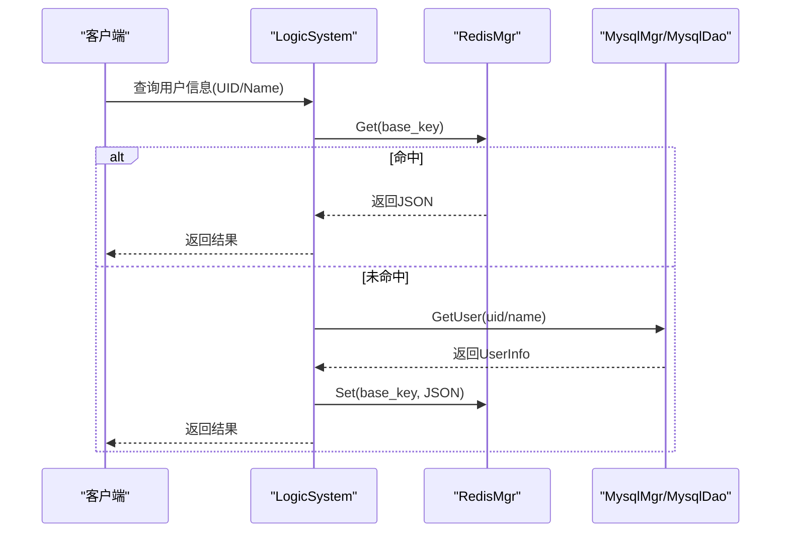
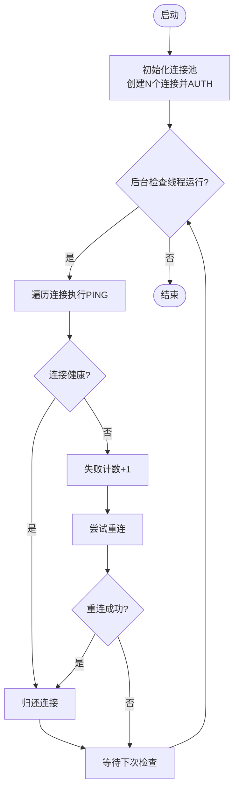
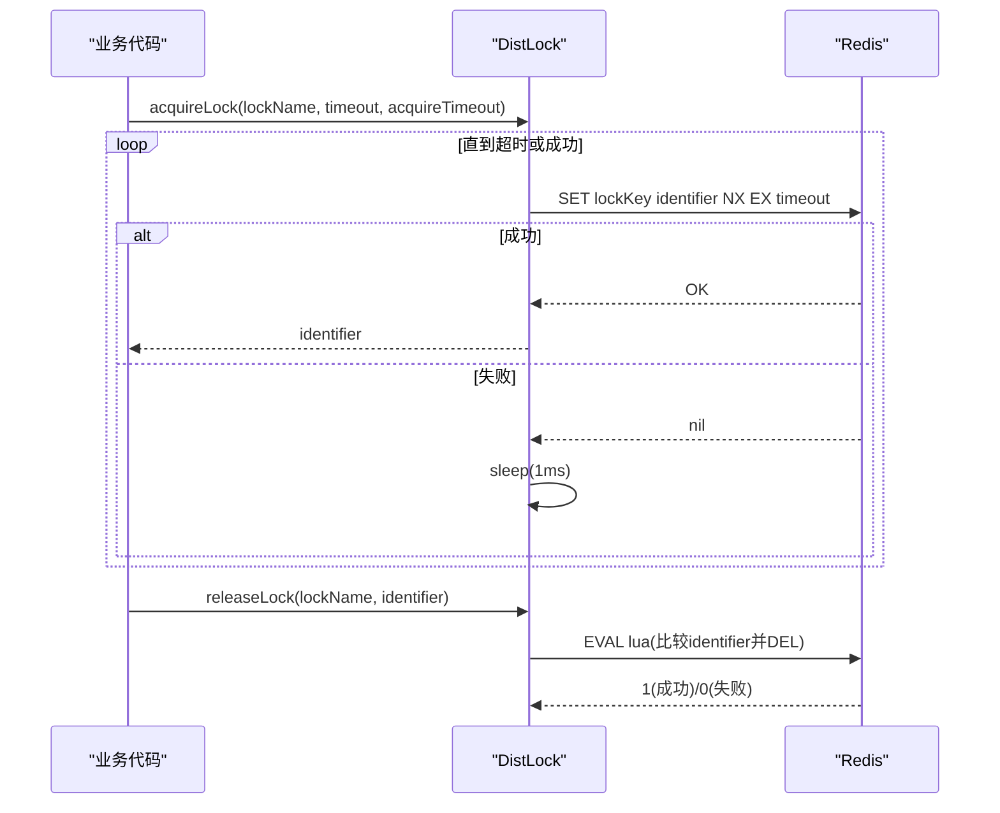
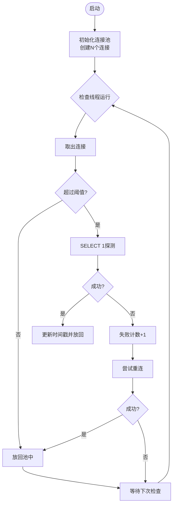
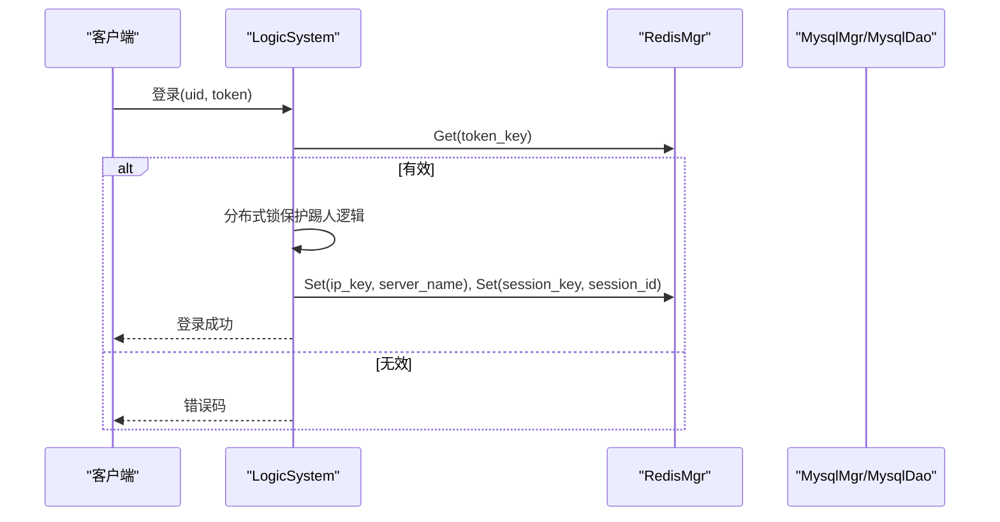
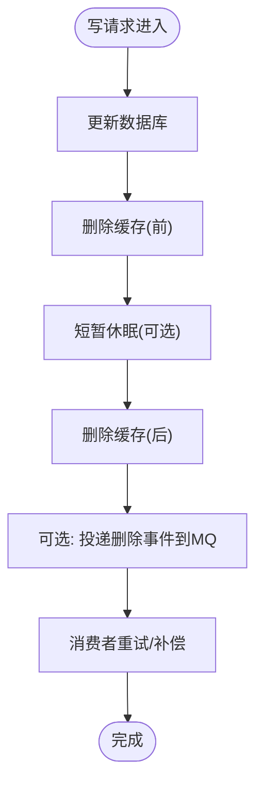
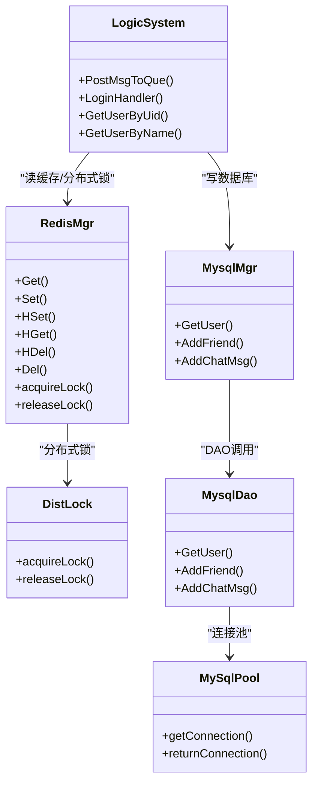

# 缓存同步策略

<cite>
**本文引用的文件**   
- [RedisMgr.h](file://server/ChatServer/include/RedisMgr.h)
- [RedisMgr.cpp](file://server/ChatServer/src/RedisMgr.cpp)
- [DistLock.h](file://server/ChatServer/include/DistLock.h)
- [DistLock.cpp](file://server/ChatServer/src/DistLock.cpp)
- [MysqlDao.h](file://server/ChatServer/include/MysqlDao.h)
- [MysqlDao.cpp](file://server/ChatServer/src/MysqlDao.cpp)
- [MysqlMgr.h](file://server/ChatServer/include/MysqlMgr.h)
- [MysqlMgr.cpp](file://server/ChatServer/src/MysqlMgr.cpp)
- [LogicSystem.h](file://server/ChatServer/include/LogicSystem.h)
- [LogicSystem.cpp](file://server/ChatServer/src/LogicSystem.cpp)
- [redis.js](file://server/VarifyServer/redis.js)
</cite>

## 目录
1. [简介](#简介)
2. [项目结构](#项目结构)
3. [核心组件](#核心组件)
4. [架构总览](#架构总览)
5. [详细组件分析](#详细组件分析)
6. [依赖关系分析](#依赖关系分析)
7. [性能考量](#性能考量)
8. [故障排查指南](#故障排查指南)
9. [结论](#结论)
10. [附录](#附录)

## 简介
本技术文档围绕 LLFCChat 的缓存同步策略展开，重点阐述 MySQL 与 Redis 之间的数据一致性方案、读写分离与缓存失效处理机制。结合代码实现，说明 Cache-Aside 模式在用户信息读取路径中的应用，分布式锁（基于 Redis）在并发场景下的使用方式，以及连接池健康检查与自动重连等基础设施能力。同时给出缓存预热、穿透防护、雪崩缓解的建议与监控恢复策略，帮助读者在实际工程中落地高可用、高性能的缓存体系。

## 项目结构
本项目为多服务 C++ 聊天系统，其中 ChatServer 承担核心业务逻辑，通过 MysqlMgr/MysqlDao 访问 MySQL，通过 RedisMgr 访问 Redis；分布式锁由 DistLock 提供；验证服务 VarifyServer 使用 Node.js + ioredis 管理 Redis。

图表来源
- [LogicSystem.cpp:116-252](file://server/ChatServer/src/LogicSystem.cpp#L116-L252)
- [RedisMgr.h:267-303](file://server/ChatServer/include/RedisMgr.h#L267-L303)
- [MysqlMgr.h:8-39](file://server/ChatServer/include/MysqlMgr.h#L8-L39)
- [MysqlDao.h:236-267](file://server/ChatServer/include/MysqlDao.h#L236-L267)
- [redis.js:1-48](file://server/VarifyServer/redis.js#L1-L48)

章节来源
- [LogicSystem.h:17-58](file://server/ChatServer/include/LogicSystem.h#L17-L58)
- [RedisMgr.h:267-303](file://server/ChatServer/include/RedisMgr.h#L267-L303)
- [MysqlMgr.h:8-39](file://server/ChatServer/include/MysqlMgr.h#L8-L39)
- [MysqlDao.h:236-267](file://server/ChatServer/include/MysqlDao.h#L236-L267)
- [redis.js:1-48](file://server/VarifyServer/redis.js#L1-L48)

## 核心组件
- Redis 连接池与健康检查：RedisConPool 维护连接队列，周期性 PING 检测并重建失效连接，保障高可用。
- Redis 操作封装：RedisMgr 提供 Get/Set/HSet/HGet/HDel/Del/LPush/RPush 等接口，统一资源管理与错误处理。
- 分布式锁：DistLock 基于 SET NX EX + Lua 脚本实现原子性加锁/解锁，避免误删。
- MySQL 连接池与健康检查：MySqlPool 维护连接，后台线程定期执行 SELECT 1 探测并重建异常连接。
- DAO 层：MysqlDao 封装 SQL 操作，包含事务、分页、批量插入等复杂逻辑。
- 业务编排：LogicSystem 将 Redis 与 MySQL 组合成 Cache-Aside 读路径，并在登录、好友认证等流程中应用分布式锁。

章节来源
- [RedisMgr.h:9-265](file://server/ChatServer/include/RedisMgr.h#L9-L265)
- [RedisMgr.cpp:19-359](file://server/ChatServer/src/RedisMgr.cpp#L19-L359)
- [DistLock.h:4-16](file://server/ChatServer/include/DistLock.h#L4-L16)
- [DistLock.cpp:27-73](file://server/ChatServer/src/DistLock.cpp#L27-L73)
- [MysqlDao.h:25-232](file://server/ChatServer/include/MysqlDao.h#L25-L232)
- [MysqlDao.cpp:125-145](file://server/ChatServer/src/MysqlDao.cpp#L125-L145)
- [LogicSystem.cpp:587-718](file://server/ChatServer/src/LogicSystem.cpp#L587-L718)

## 架构总览
下图展示“用户信息查询”的 Cache-Aside 流程：优先从 Redis 获取，未命中则回源 MySQL 并回填缓存；写路径建议采用先更新数据库再删除缓存的策略，并结合分布式锁保证并发安全。

图表来源
- [LogicSystem.cpp:587-718](file://server/ChatServer/src/LogicSystem.cpp#L587-L718)
- [RedisMgr.cpp:19-79](file://server/ChatServer/src/RedisMgr.cpp#L19-L79)
- [MysqlMgr.cpp:42-50](file://server/ChatServer/src/MysqlMgr.cpp#L42-L50)
- [MysqlDao.cpp:508-590](file://server/ChatServer/src/MysqlDao.cpp#L508-L590)

## 详细组件分析

### Redis 连接池与健康检查
- 连接池初始化：构造时创建固定数量连接，AUTH 认证后入队。
- 获取/归还连接：getConnection/getConNonBlock 支持阻塞与非阻塞获取；returnConnection 归还并唤醒等待者。
- 健康检查：后台线程定时对每个连接执行 PING，失败计数累加并触发重连；重连成功后补齐池容量。
- 关闭与清理：Close 设置停止标志并回收线程；ClearConnections 释放所有连接。

图表来源
- [RedisMgr.h:36-46](file://server/ChatServer/include/RedisMgr.h#L36-L46)
- [RedisMgr.h:137-206](file://server/ChatServer/include/RedisMgr.h#L137-L206)
- [RedisMgr.cpp:19-79](file://server/ChatServer/src/RedisMgr.cpp#L19-L79)

章节来源
- [RedisMgr.h:9-265](file://server/ChatServer/include/RedisMgr.h#L9-L265)
- [RedisMgr.cpp:19-359](file://server/ChatServer/src/RedisMgr.cpp#L19-L359)

### 分布式锁（Redis）
- 加锁：SET lockKey identifier NX EX timeout，带过期时间防止死锁。
- 解锁：EVAL Lua 脚本比较 identifier 一致才 DEL，确保仅持有者可释放。
- 使用示例：登录踢人、计数增减等关键路径均通过 RedisMgr.acquireLock/releaseLock 包裹。

图表来源
- [DistLock.cpp:27-49](file://server/ChatServer/src/DistLock.cpp#L27-L49)
- [DistLock.cpp:52-73](file://server/ChatServer/src/DistLock.cpp#L52-L73)
- [RedisMgr.cpp:362-393](file://server/ChatServer/src/RedisMgr.cpp#L362-L393)

章节来源
- [DistLock.h:4-16](file://server/ChatServer/include/DistLock.h#L4-L16)
- [DistLock.cpp:27-73](file://server/ChatServer/src/DistLock.cpp#L27-L73)
- [RedisMgr.cpp:362-393](file://server/ChatServer/src/RedisMgr.cpp#L362-L393)

### MySQL 连接池与健康检查
- 连接池初始化：创建 N 个连接，记录最后操作时间戳。
- 健康检查：后台线程按阈值判断是否执行 SELECT 1 探测，失败则标记并尝试重建连接。
- 获取/归还：getConnection 阻塞等待可用连接；returnConnection 归还并通知等待者。

图表来源
- [MysqlDao.h:42-54](file://server/ChatServer/include/MysqlDao.h#L42-L54)
- [MysqlDao.h:62-123](file://server/ChatServer/include/MysqlDao.h#L62-L123)
- [MysqlDao.cpp:125-145](file://server/ChatServer/src/MysqlDao.cpp#L125-L145)

章节来源
- [MysqlDao.h:25-232](file://server/ChatServer/include/MysqlDao.h#L25-L232)
- [MysqlDao.cpp:125-145](file://server/ChatServer/src/MysqlDao.cpp#L125-L145)

### 业务编排与 Cache-Aside 读路径
- 用户信息查询：优先查 Redis，未命中则查 MySQL 并回填 Redis。
- 登录校验：校验 token 有效性，跨服踢人通过分布式锁保护。
- 好友认证：写入数据库后，根据目标用户所在服务器进行本地或远程推送。

图表来源
- [LogicSystem.cpp:116-252](file://server/ChatServer/src/LogicSystem.cpp#L116-L252)
- [RedisMgr.cpp:19-79](file://server/ChatServer/src/RedisMgr.cpp#L19-L79)

章节来源
- [LogicSystem.cpp:116-252](file://server/ChatServer/src/LogicSystem.cpp#L116-L252)
- [LogicSystem.cpp:587-718](file://server/ChatServer/src/LogicSystem.cpp#L587-L718)

### 写路径与一致性策略
- 双写一致性：当前代码在写路径（如添加好友、发送消息）主要落库，未直接写缓存。建议在写数据库成功后，删除对应缓存键，让读路径按需回填。
- 延迟双删：在更新数据库前后各删除一次缓存，降低短暂不一致窗口。
- 异步同步（消息队列）：可将写事件投递到 MQ，消费者负责删除或更新缓存，提高主流程吞吐。

[该图为概念流程图，不直接映射具体源码]

### 缓存预热、穿透防护与雪崩缓解
- 缓存预热：热点用户信息可在服务启动或登录成功后主动写入 Redis，减少冷启动时的回源压力。
- 穿透防护：对不存在的数据可设置短 TTL 的空值占位，或在 DAO 层增加存在性判断。
- 雪崩缓解：为缓存键设置随机过期时间，避免集中过期；配合限流与降级策略。

[本节为通用实践建议，不直接引用具体源码]

## 依赖关系分析
- LogicSystem 依赖 RedisMgr 与 MysqlMgr，形成读路径的 Cache-Aside 与写路径的直写 DB。
- RedisMgr 依赖 DistLock 实现分布式锁；内部使用 hiredis 与连接池。
- MysqlMgr 封装 MysqlDao，后者通过 MySqlPool 管理连接。
- VarifyServer 使用 ioredis 作为 Redis 客户端，提供心跳与基础操作。

图表来源
- [LogicSystem.h:17-58](file://server/ChatServer/include/LogicSystem.h#L17-L58)
- [RedisMgr.h:267-303](file://server/ChatServer/include/RedisMgr.h#L267-L303)
- [DistLock.h:4-16](file://server/ChatServer/include/DistLock.h#L4-L16)
- [MysqlMgr.h:8-39](file://server/ChatServer/include/MysqlMgr.h#L8-L39)
- [MysqlDao.h:236-267](file://server/ChatServer/include/MysqlDao.h#L236-L267)
- [MysqlDao.h:25-232](file://server/ChatServer/include/MysqlDao.h#L25-L232)

章节来源
- [LogicSystem.h:17-58](file://server/ChatServer/include/LogicSystem.h#L17-L58)
- [RedisMgr.h:267-303](file://server/ChatServer/include/RedisMgr.h#L267-L303)
- [DistLock.h:4-16](file://server/ChatServer/include/DistLock.h#L4-L16)
- [MysqlMgr.h:8-39](file://server/ChatServer/include/MysqlMgr.h#L8-L39)
- [MysqlDao.h:236-267](file://server/ChatServer/include/MysqlDao.h#L236-L267)
- [MysqlDao.h:25-232](file://server/ChatServer/include/MysqlDao.h#L25-L232)

## 性能考量
- 连接池大小：根据 QPS 与 RT 调整 Redis/MySQL 连接池大小，避免过多上下文切换与资源争用。
- 命令选择：尽量使用 HGET/HSET 等结构化命令，减少序列化开销；批量操作优先使用管道或数组参数。
- 超时与重试：为网络 I/O 设置合理超时，失败快速失败并降级；对幂等操作可引入有限重试。
- 热点键：对高频访问的用户信息设置较长 TTL，必要时分片存储以降低单键竞争。
- 监控指标：统计命中率、RT、错误率、连接池占用、锁等待时长等，用于定位瓶颈。

[本节为通用性能建议，不直接引用具体源码]

## 故障排查指南
- Redis 连接异常：检查 AUTH 配置、网络连通性与防火墙；查看连接池健康检查日志与失败计数。
- 分布式锁问题：确认 identifier 唯一性与 Lua 脚本执行结果；排查锁超时设置与业务执行耗时。
- MySQL 连接异常：检查 URL、用户名密码、Schema；观察 SELECT 1 探测失败与重连日志。
- 缓存不一致：核对写路径是否删除缓存；检查是否存在并发写导致脏读；必要时引入版本号或 CAS。
- 服务间通信：确认 gRPC 路由与 IP 映射正确；跨服踢人与通知链路需保证幂等与重试。

章节来源
- [RedisMgr.cpp:19-79](file://server/ChatServer/src/RedisMgr.cpp#L19-L79)
- [DistLock.cpp:27-73](file://server/ChatServer/src/DistLock.cpp#L27-L73)
- [MysqlDao.cpp:125-145](file://server/ChatServer/src/MysqlDao.cpp#L125-L145)
- [LogicSystem.cpp:116-252](file://server/ChatServer/src/LogicSystem.cpp#L116-L252)

## 结论
LLFCChat 在用户信息查询路径上实现了典型的 Cache-Aside 模式，并通过 Redis 连接池与 MySQL 连接池的健康检查提升稳定性；分布式锁保证了跨服踢人与计数操作的原子性。当前写路径以直写数据库为主，建议补充“先更新数据库再删除缓存”的一致性策略，并可结合延迟双删与 MQ 异步同步进一步提升一致性与吞吐。配合合理的预热、穿透防护与雪崩缓解措施，以及完善的监控与故障恢复策略，可有效支撑高并发聊天场景。

## 附录
- 参考实现路径（不展示代码内容，仅提供文件与行号）：
  - Cache-Aside 读路径：[LogicSystem.cpp:587-718](file://server/ChatServer/src/LogicSystem.cpp#L587-L718)
  - 分布式锁加锁/解锁：[DistLock.cpp:27-73](file://server/ChatServer/src/DistLock.cpp#L27-L73)
  - Redis 连接池健康检查：[RedisMgr.h:137-206](file://server/ChatServer/include/RedisMgr.h#L137-L206)
  - MySQL 连接池健康检查：[MysqlDao.h:62-123](file://server/ChatServer/include/MysqlDao.h#L62-L123)
  - 登录与踢人流程：[LogicSystem.cpp:116-252](file://server/ChatServer/src/LogicSystem.cpp#L116-L252)
  - 验证服务 Redis 客户端：[redis.js:1-48](file://server/VarifyServer/redis.js#L1-L48)