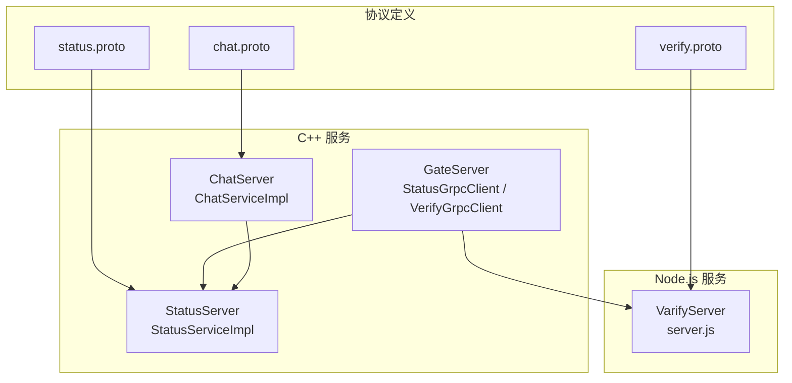
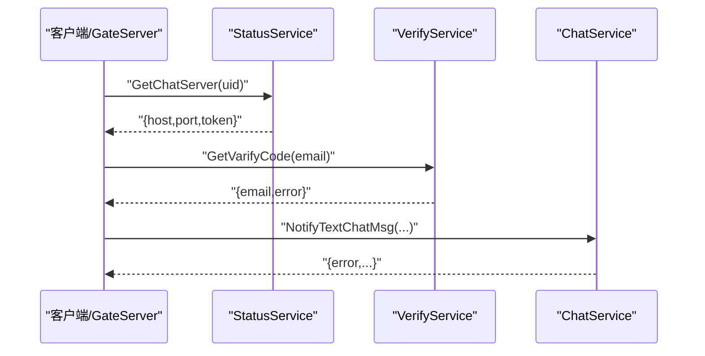
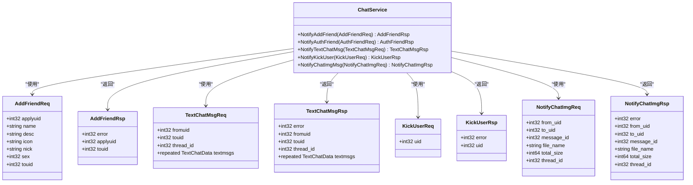
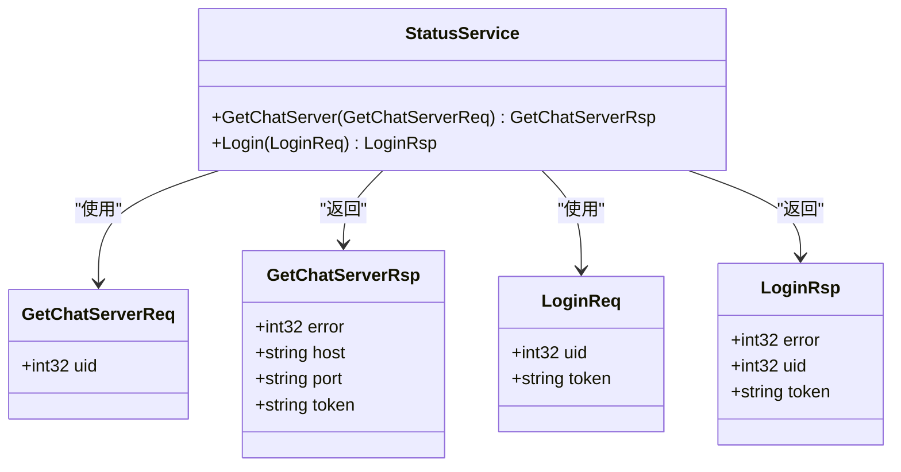
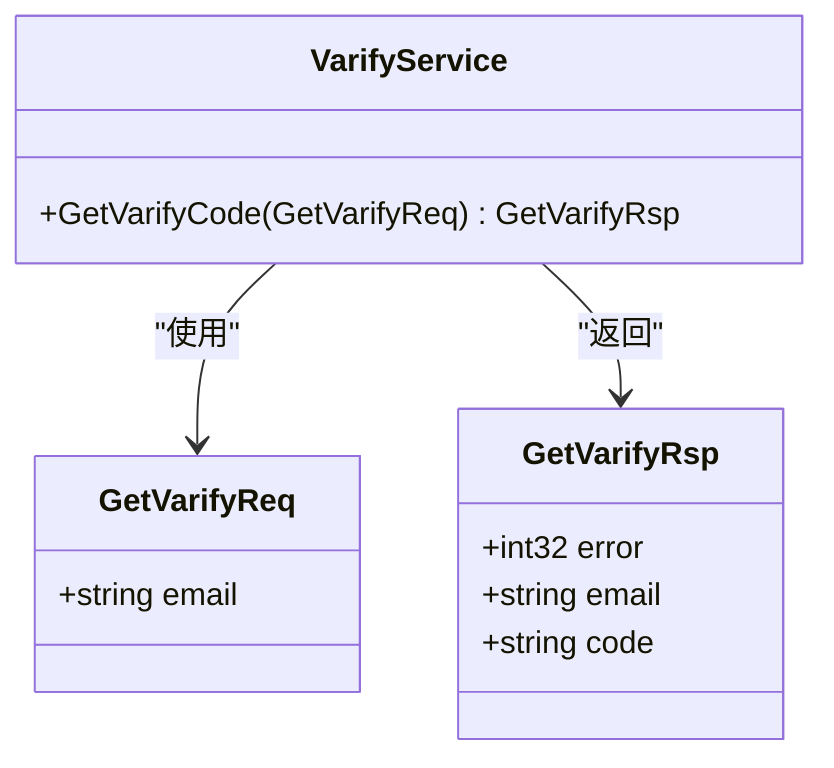
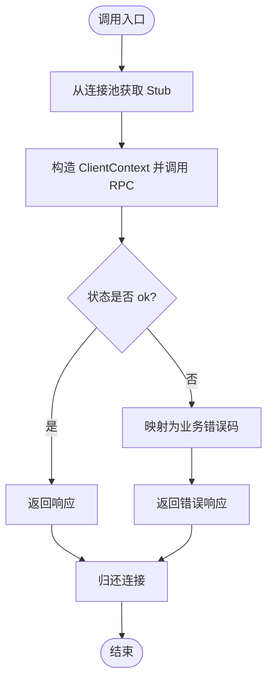
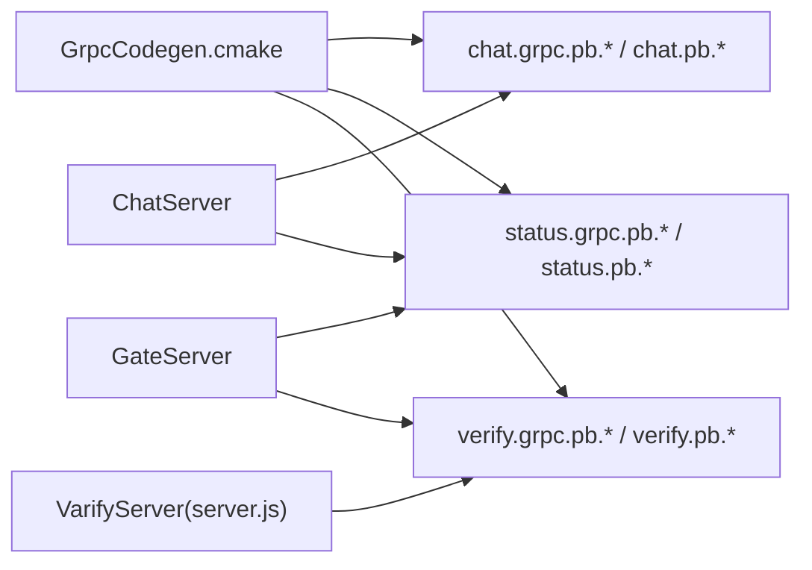

# gRPC通信协议

<cite>
**本文引用的文件**   
- [chat.proto](file://proto/chat_service/chat.proto)
- [status.proto](file://proto/status_service/status.proto)
- [verify.proto](file://proto/verify_service/verify.proto)
- [ChatGrpcClient.h](file://server/ChatServer/include/ChatGrpcClient.h)
- [ChatGrpcClient.cpp](file://server/ChatServer/src/ChatGrpcClient.cpp)
- [StatusGrpcClient.h](file://server/GateServer/include/StatusGrpcClient.h)
- [StatusGrpcClient.cpp](file://server/GateServer/src/StatusGrpcClient.cpp)
- [VerifyGrpcClient.h](file://server/GateServer/include/VerifyGrpcClient.h)
- [VerifyGrpcClient.cpp](file://server/GateServer/src/VerifyGrpcClient.cpp)
- [ChatServiceImpl.h](file://server/ChatServer/include/ChatServiceImpl.h)
- [StatusServiceImpl.h](file://server/StatusServer/include/StatusServiceImpl.h)
- [server.js](file://server/VarifyServer/server.js)
- [GrpcCodegen.cmake](file://cmake/GrpcCodegen.cmake)
- [const.h（ChatServer）](file://server/ChatServer/include/const.h)
- [const.h（GateServer）](file://server/GateServer/include/const.h)
</cite>

## 目录
1. [简介](#简介)
2. [项目结构](#项目结构)
3. [核心组件](#核心组件)
4. [架构总览](#架构总览)
5. [详细组件分析](#详细组件分析)
6. [依赖关系分析](#依赖关系分析)
7. [性能与优化](#性能与优化)
8. [故障排查指南](#故障排查指南)
9. [结论](#结论)
10. [附录：接口调用示例与错误处理](#附录接口调用示例与错误处理)

## 简介
本技术文档围绕 LLFCChat 的 gRPC 通信协议展开，覆盖 Protocol Buffers 消息定义、微服务间 gRPC 接口设计（ChatService、StatusService、VerifyService）、gRPC 客户端实现（连接管理、请求发送、响应处理）、错误处理机制（gRPC 状态码映射与业务异常）、序列化与网络传输优化策略、超时控制与重试机制、调试工具与监控指标收集方法，并提供具体的接口调用示例和错误处理代码路径。

## 项目结构
- 协议定义位于 proto 目录下，按服务划分 chat_service、status_service、verify_service。
- C++ 服务端包含 ChatServer、StatusServer；GateServer 作为网关聚合外部 HTTP 与内部 gRPC 调用；Node.js 实现的 VarifyServer 提供验证码服务。
- CMake 脚本负责 Protobuf/gRPC 代码生成与库封装。

**图表来源** 
- [chat.proto:1-105](file://proto/chat_service/chat.proto#L1-L105)
- [status.proto:1-32](file://proto/status_service/status.proto#L1-L32)
- [verify.proto:1-19](file://proto/verify_service/verify.proto#L1-L19)
- [ChatServiceImpl.h:1-55](file://server/ChatServer/include/ChatServiceImpl.h#L1-L55)
- [StatusServiceImpl.h:1-52](file://server/StatusServer/include/StatusServiceImpl.h#L1-L52)
- [StatusGrpcClient.h:1-98](file://server/GateServer/include/StatusGrpcClient.h#L1-L98)
- [VerifyGrpcClient.h:1-113](file://server/GateServer/include/VerifyGrpcClient.h#L1-L113)
- [server.js:1-76](file://server/VarifyServer/server.js#L1-L76)

**章节来源**
- [chat.proto:1-105](file://proto/chat_service/chat.proto#L1-L105)
- [status.proto:1-32](file://proto/status_service/status.proto#L1-L32)
- [verify.proto:1-19](file://proto/verify_service/verify.proto#L1-L19)
- [GrpcCodegen.cmake:1-72](file://cmake/GrpcCodegen.cmake#L1-L72)

## 核心组件
- ChatService：聊天服务，支持好友申请通知、好友认证、文本聊天消息推送、踢人通知、图片消息通知等。
- StatusService：状态服务，提供获取聊天服务器地址与登录校验能力。
- VerifyService：验证码服务，提供邮箱验证码获取。

各服务的消息类型、字段编号与语义详见“详细组件分析”中的协议说明。

**章节来源**
- [chat.proto:1-105](file://proto/chat_service/chat.proto#L1-L105)
- [status.proto:1-32](file://proto/status_service/status.proto#L1-L32)
- [verify.proto:1-19](file://proto/verify_service/verify.proto#L1-L19)

## 架构总览
LLFCChat 采用多语言微服务架构：
- GateServer（C++）通过 gRPC 调用 StatusService 与 VerifyService。
- ChatServer（C++）之间通过 gRPC 进行跨实例的消息转发与协作。
- VarifyServer（Node.js）提供验证码生成与邮件发送。

**图表来源** 
- [status.proto:1-32](file://proto/status_service/status.proto#L1-L32)
- [verify.proto:1-19](file://proto/verify_service/verify.proto#L1-L19)
- [chat.proto:1-105](file://proto/chat_service/chat.proto#L1-L105)
- [StatusGrpcClient.cpp:1-53](file://server/GateServer/src/StatusGrpcClient.cpp#L1-L53)
- [VerifyGrpcClient.cpp:1-9](file://server/GateServer/src/VerifyGrpcClient.cpp#L1-L9)
- [ChatGrpcClient.cpp:1-203](file://server/ChatServer/src/ChatGrpcClient.cpp#L1-L203)

## 详细组件分析

### ChatService 协议与实现
- 服务方法
  - NotifyAddFriend：好友申请通知
  - NotifyAuthFriend：好友认证通知
  - NotifyTextChatMsg：文本聊天消息推送
  - NotifyKickUser：踢人通知
  - NotifyChatImgMsg：图片消息通知
- 关键消息
  - AddFriendReq/Rsp、AuthFriendReq/Rsp、TextChatData、TextChatMsgReq/Rsp、KickUserReq/Rsp、NotifyChatImgReq/Rsp

**图表来源** 
- [chat.proto:1-105](file://proto/chat_service/chat.proto#L1-L105)

**章节来源**
- [chat.proto:1-105](file://proto/chat_service/chat.proto#L1-L105)
- [ChatServiceImpl.h:1-55](file://server/ChatServer/include/ChatServiceImpl.h#L1-L55)

### StatusService 协议与实现
- 服务方法
  - GetChatServer：根据用户ID获取聊天服务器地址与令牌
  - Login：登录校验并返回令牌
- 关键消息
  - GetChatServerReq/Rsp、LoginReq/Rsp

**图表来源** 
- [status.proto:1-32](file://proto/status_service/status.proto#L1-L32)

**章节来源**
- [status.proto:1-32](file://proto/status_service/status.proto#L1-L32)
- [StatusServiceImpl.h:1-52](file://server/StatusServer/include/StatusServiceImpl.h#L1-L52)

### VerifyService 协议与实现
- 服务方法
  - GetVarifyCode：根据邮箱生成或复用验证码并发送邮件
- 关键消息
  - GetVarifyReq/Rsp

**图表来源** 
- [verify.proto:1-19](file://proto/verify_service/verify.proto#L1-L19)

**章节来源**
- [verify.proto:1-19](file://proto/verify_service/verify.proto#L1-L19)
- [server.js:1-76](file://server/VarifyServer/server.js#L1-L76)

### gRPC 客户端实现（连接管理与请求处理）
- ChatGrpcClient
  - 连接池：ChatConPool 维护多个 ChatService::Stub，线程安全获取与归还
  - 方法：NotifyAddFriend、NotifyAuthFriend、NotifyTextChatMsg、NotifyKickUser
  - 错误处理：将 gRPC 状态码映射为业务错误码（如 RPCFailed）
- StatusGrpcClient
  - 连接池：StatusConPool 维护多个 StatusService::Stub
  - 方法：GetChatServer、Login
  - 错误处理：失败时设置业务错误码
- VerifyGrpcClient
  - 连接池：RPConPool 维护多个 VarifyService::Stub
  - 方法：GetVarifyCode
  - 错误处理：失败时设置业务错误码

**图表来源** 
- [ChatGrpcClient.cpp:1-203](file://server/ChatServer/src/ChatGrpcClient.cpp#L1-L203)
- [StatusGrpcClient.cpp:1-53](file://server/GateServer/src/StatusGrpcClient.cpp#L1-L53)
- [VerifyGrpcClient.cpp:1-9](file://server/GateServer/src/VerifyGrpcClient.cpp#L1-L9)

**章节来源**
- [ChatGrpcClient.h:1-116](file://server/ChatServer/include/ChatGrpcClient.h#L1-L116)
- [ChatGrpcClient.cpp:1-203](file://server/ChatServer/src/ChatGrpcClient.cpp#L1-L203)
- [StatusGrpcClient.h:1-98](file://server/GateServer/include/StatusGrpcClient.h#L1-L98)
- [StatusGrpcClient.cpp:1-53](file://server/GateServer/src/StatusGrpcClient.cpp#L1-L53)
- [VerifyGrpcClient.h:1-113](file://server/GateServer/include/VerifyGrpcClient.h#L1-L113)
- [VerifyGrpcClient.cpp:1-9](file://server/GateServer/src/VerifyGrpcClient.cpp#L1-L9)

## 依赖关系分析
- 构建期依赖
  - GrpcCodegen.cmake 统一封装 protoc 与 grpc_cpp_plugin，生成 .pb.cc/.h 与 .grpc.pb.cc/.h，并打包为静态库供各服务引用。
- 运行期依赖
  - GateServer 依赖 StatusService 与 VerifyService 的 gRPC 客户端。
  - ChatServer 之间通过 ChatService 的 gRPC 客户端进行跨实例通信。
  - Node.js 的 VarifyServer 暴露 gRPC 服务，被 GateServer 调用。

**图表来源** 
- [GrpcCodegen.cmake:1-72](file://cmake/GrpcCodegen.cmake#L1-L72)
- [ChatGrpcClient.h:1-116](file://server/ChatServer/include/ChatGrpcClient.h#L1-L116)
- [StatusGrpcClient.h:1-98](file://server/GateServer/include/StatusGrpcClient.h#L1-L98)
- [VerifyGrpcClient.h:1-113](file://server/GateServer/include/VerifyGrpcClient.h#L1-L113)
- [server.js:1-76](file://server/VarifyServer/server.js#L1-L76)

**章节来源**
- [GrpcCodegen.cmake:1-72](file://cmake/GrpcCodegen.cmake#L1-L72)

## 性能与优化
- 连接池
  - 各客户端均实现连接池（ChatConPool、StatusConPool、RPConPool），避免频繁创建 Channel/Stub，提升吞吐与降低延迟。
- 序列化
  - 使用 protobuf 二进制序列化，减少网络体积与解析开销。
- 并发模型
  - gRPC 基于异步 I/O，配合连接池可实现高并发调用。
- 建议优化
  - 合理设置连接池大小与超时时间，避免资源耗尽。
  - 对大消息（如图片元数据）可考虑分片或流式传输。
  - 启用压缩（gzip）以降低带宽占用。

[本节为通用指导，不直接分析具体文件]

## 故障排查指南
- 常见错误码
  - Success：成功
  - Error_Json：JSON 解析错误
  - RPCFailed：RPC 请求失败
  - VarifyExpired：验证码过期
  - VarifyCodeErr：验证码错误
  - UserExist：用户已存在
  - PasswdErr：密码错误
  - EmailNotMatch：邮箱不匹配
  - TokenInvalid：Token 失效
  - UidInvalid：UID 无效
- 定位步骤
  - 检查 gRPC 状态码是否为 ok，若失败则记录服务端日志与错误码。
  - 核对配置（Host/Port）与服务注册信息。
  - 验证消息字段是否符合 proto 定义。
  - 查看 Redis/MySQL 缓存与数据库一致性。

**章节来源**
- [const.h（ChatServer）:1-104](file://server/ChatServer/include/const.h#L1-L104)
- [const.h（GateServer）:1-65](file://server/GateServer/include/const.h#L1-L65)

## 结论
LLFCChat 的 gRPC 通信体系以清晰的协议定义与模块化客户端实现为基础，结合连接池与错误码映射，实现了稳定高效的微服务间通信。后续可在超时控制、重试策略、监控指标等方面进一步增强系统韧性与可观测性。

[本节为总结性内容，不直接分析具体文件]

## 附录：接口调用示例与错误处理

### 获取聊天服务器地址（StatusService.GetChatServer）
- 请求参数
  - uid：用户ID
- 响应字段
  - error：错误码
  - host：聊天服务器主机
  - port：聊天服务器端口
  - token：鉴权令牌
- 调用流程
  - GateServer 调用 StatusGrpcClient.GetChatServer，失败时设置业务错误码。

**章节来源**
- [status.proto:1-32](file://proto/status_service/status.proto#L1-L32)
- [StatusGrpcClient.cpp:1-53](file://server/GateServer/src/StatusGrpcClient.cpp#L1-L53)

### 获取验证码（VerifyService.GetVarifyCode）
- 请求参数
  - email：邮箱地址
- 响应字段
  - error：错误码
  - email：邮箱地址
  - code：验证码
- 调用流程
  - GateServer 调用 VerifyGrpcClient.GetVarifyCode，失败时设置业务错误码。

**章节来源**
- [verify.proto:1-19](file://proto/verify_service/verify.proto#L1-L19)
- [VerifyGrpcClient.cpp:1-9](file://server/GateServer/src/VerifyGrpcClient.cpp#L1-L9)
- [server.js:1-76](file://server/VarifyServer/server.js#L1-L76)

### 文本聊天消息推送（ChatService.NotifyTextChatMsg）
- 请求参数
  - fromuid：发送者ID
  - touid：接收者ID
  - thread_id：会话线程ID
  - textmsgs：文本消息列表（unique_id、msgcontent 等）
- 响应字段
  - error：错误码
  - fromuid、touid、thread_id、textmsgs：回显请求数据
- 调用流程
  - ChatServer 调用 ChatGrpcClient.NotifyTextChatMsg，失败时设置业务错误码。

**章节来源**
- [chat.proto:1-105](file://proto/chat_service/chat.proto#L1-L105)
- [ChatGrpcClient.cpp:1-203](file://server/ChatServer/src/ChatGrpcClient.cpp#L1-L203)

### 错误处理与状态码映射
- gRPC 状态码映射
  - 当 status.ok() 为 false 时，将错误码设置为 RPCFailed。
- 业务异常处理
  - 在响应对象中填充 error 字段，便于上层统一处理。

**章节来源**
- [ChatGrpcClient.cpp:1-203](file://server/ChatServer/src/ChatGrpcClient.cpp#L1-L203)
- [StatusGrpcClient.cpp:1-53](file://server/GateServer/src/StatusGrpcClient.cpp#L1-L53)
- [VerifyGrpcClient.cpp:1-9](file://server/GateServer/src/VerifyGrpcClient.cpp#L1-L9)
- [const.h（ChatServer）:1-104](file://server/ChatServer/include/const.h#L1-L104)
- [const.h（GateServer）:1-65](file://server/GateServer/include/const.h#L1-L65)