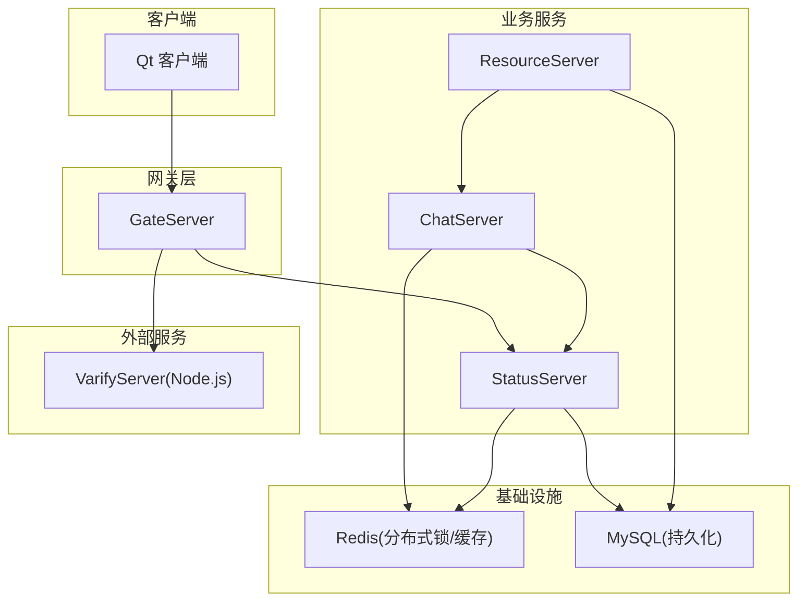
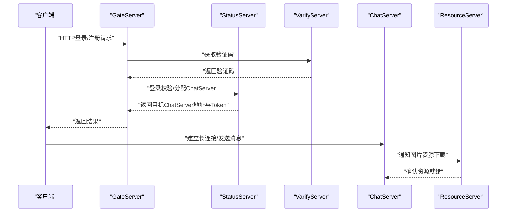
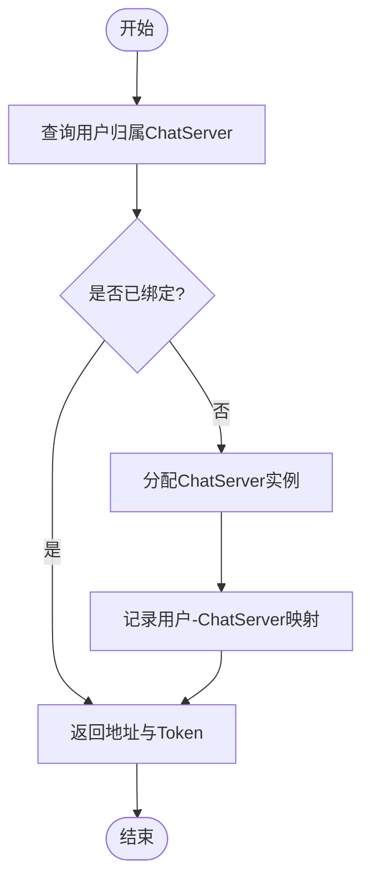
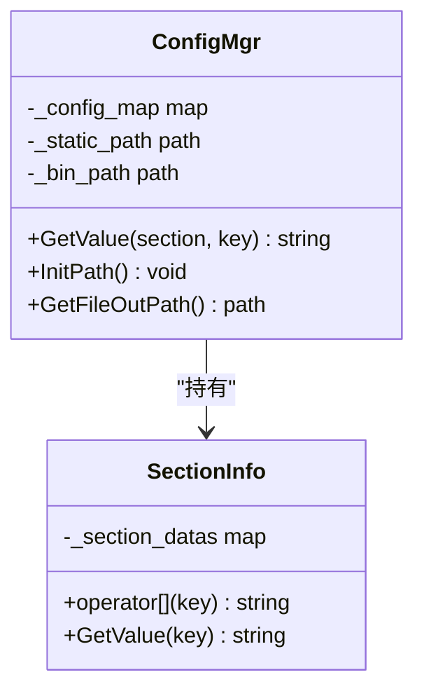
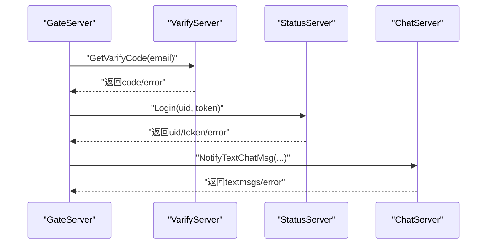
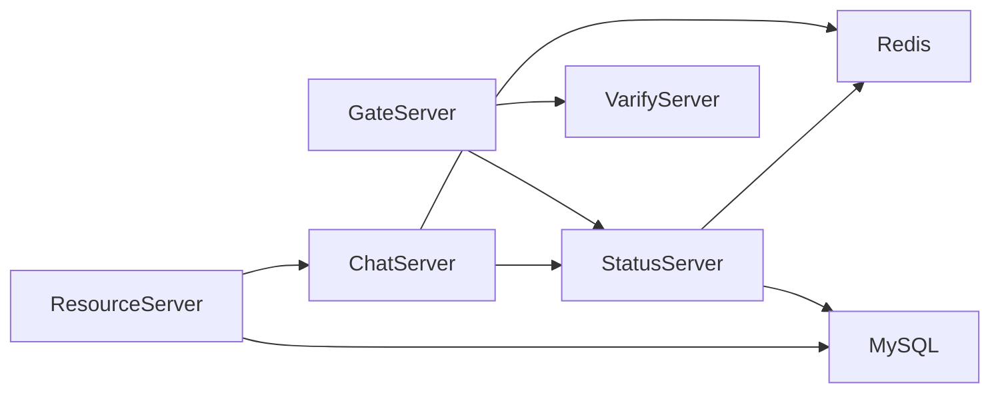

# 服务治理

<cite>
**本文引用的文件**   
- [README.md](file://README.md)
- [chat.proto](file://proto/chat_service/chat.proto)
- [status.proto](file://proto/status_service/status.proto)
- [verify.proto](file://proto/verify_service/verify.proto)
- [ChatServer ConfigMgr.h](file://server/ChatServer/include/ConfigMgr.h)
- [ChatServer ConfigMgr.cpp](file://server/ChatServer/src/ConfigMgr.cpp)
- [GateServer ConfigMgr.h](file://server/GateServer/include/ConfigMgr.h)
- [GateServer ConfigMgr.cpp](file://server/GateServer/src/ConfigMgr.cpp)
- [ResourceServer ConfigMgr.h](file://server(ResourceServer/include/ConfigMgr.h)
- [ResourceServer ConfigMgr.cpp](file://server/ResourceServer/src/ConfigMgr.cpp)
- [StatusServer ConfigMgr.h](file://server/StatusServer/include/ConfigMgr.h)
- [StatusServer ConfigMgr.cpp](file://server/StatusServer/src/ConfigMgr.cpp)
- [DistLock.h](file://server/ChatServer/include/DistLock.h)
- [VerifyGrpcClient.h](file://server/GateServer/include/VerifyGrpcClient.h)
- [StatusGrpcClient.h](file://server/GateServer/include/StatusGrpcClient.h)
- [ChatGrpcClient.h](file://server/ChatServer/include/ChatGrpcClient.h)
</cite>

## 目录
1. [引言](#引言)
2. [项目结构](#项目结构)
3. [核心组件](#核心组件)
4. [架构总览](#架构总览)
5. [详细组件分析](#详细组件分析)
6. [依赖关系分析](#依赖关系分析)
7. [性能考量](#性能考量)
8. [故障排查指南](#故障排查指南)
9. [结论](#结论)
10. [附录](#附录)

## 引言
本文件面向LLFCChat服务治理体系，围绕服务注册与发现、配置中心、服务间通信协议（gRPC）、限流熔断降级、监控指标与日志追踪、以及微服务编排与依赖管理等主题进行系统化说明。文档基于仓库现有代码与Proto定义进行梳理，并给出可操作的实践建议与可视化图示，帮助读者快速理解当前实现与扩展方向。

## 项目结构
项目采用多服务拆分：客户端（Qt/C++）通过HTTP/TCP与网关交互；后端包含多个C++服务（GateServer、ChatServer、StatusServer、ResourceServer）以及一个Node.js验证服务（VarifyServer）。Proto定义位于proto目录，各服务通过gRPC进行内部通信。配置管理在各服务中独立实现，读取本地INI文件。

**图表来源** 
- [chat.proto:1-105](file://proto/chat_service/chat.proto#L1-L105)
- [status.proto:1-32](file://proto/status_service/status.proto#L1-L32)
- [verify.proto:1-19](file://proto/verify_service/verify.proto#L1-L19)

**章节来源**
- [README.md:1-112](file://README.md#L1-L112)

## 核心组件
- gRPC接口与消息模型：ChatService、StatusService、VarifyService三个服务定义了跨进程通信契约。
- 配置管理：各服务使用统一的INI解析器加载配置，支持路径与基础参数读取。
- 连接池：针对gRPC客户端实现连接池，复用Channel与Stub，降低握手开销。
- 分布式锁：基于Redis的轻量分布式锁，用于跨实例协调。
- 存储与缓存：MySQL用于持久化，Redis用于会话、状态与锁。

**章节来源**
- [chat.proto:1-105](file://proto/chat_service/chat.proto#L1-L105)
- [status.proto:1-32](file://proto/status_service/status.proto#L1-L32)
- [verify.proto:1-19](file://proto/verify_service/verify.proto#L1-L19)
- [ChatServer ConfigMgr.h:1-84](file://server/ChatServer/include/ConfigMgr.h#L1-L84)
- [ChatServer ConfigMgr.cpp:1-50](file://server/ChatServer/src/ConfigMgr.cpp#L1-L50)
- [GateServer ConfigMgr.h:1-84](file://server/GateServer/include/ConfigMgr.h#L1-L84)
- [GateServer ConfigMgr.cpp:1-50](file://server/GateServer/src/ConfigMgr.cpp#L1-L50)
- [ResourceServer ConfigMgr.h:1-90](file://server/ResourceServer/include/ConfigMgr.h#L1-L90)
- [ResourceServer ConfigMgr.cpp:1-83](file://server/ResourceServer/src/ConfigMgr.cpp#L1-L83)
- [StatusServer ConfigMgr.h:1-84](file://server/StatusServer/include/ConfigMgr.h#L1-L84)
- [StatusServer ConfigMgr.cpp:1-50](file://server/StatusServer/src/ConfigMgr.cpp#L1-L50)
- [DistLock.h:1-18](file://server/ChatServer/include/DistLock.h#L1-L18)
- [VerifyGrpcClient.h:1-113](file://server/GateServer/include/VerifyGrpcClient.h#L1-L113)
- [StatusGrpcClient.h:1-98](file://server/GateServer/include/StatusGrpcClient.h#L1-L98)
- [ChatGrpcClient.h:1-116](file://server/ChatServer/include/ChatGrpcClient.h#L1-L116)

## 架构总览
整体采用“网关+业务服务”的分层架构。客户端通过GateServer统一接入，GateServer负责鉴权、路由与调用下游服务。ChatServer处理聊天相关逻辑，StatusServer提供用户登录与会话管理，ResourceServer负责资源上传下载。VarifyServer提供验证码下发能力。

**图表来源** 
- [status.proto:1-32](file://proto/status_service/status.proto#L1-L32)
- [verify.proto:1-19](file://proto/verify_service/verify.proto#L1-L19)
- [chat.proto:1-105](file://proto/chat_service/chat.proto#L1-L105)

## 详细组件分析

### 服务注册与发现机制
- 现状：未发现集中式注册中心（如Consul/Nacos/Eureka）。服务发现通过StatusService完成：客户端或Gate向Status查询某用户的ChatServer地址与Token。
- 元数据管理：当前未在服务端暴露版本、健康检查等元数据字段。可在StatusService响应中扩展host/port/token，并在后续增加version、region、capacity等字段。
- 版本控制：未在gRPC接口中体现版本策略（如URL前缀、Header版本控制）。建议在接口设计时引入版本字段或命名空间，便于灰度发布与回滚。

**图表来源** 
- [status.proto:1-32](file://proto/status_service/status.proto#L1-L32)

**章节来源**
- [status.proto:1-32](file://proto/status_service/status.proto#L1-L32)

### 配置中心设计与热更新
- 现状：各服务使用本地INI配置文件，启动时由ConfigMgr读取并缓存到内存。不支持运行时热更新与版本管理。
- 建议方案：
  - 引入集中式配置中心（如Nacos/Apollo），支持按环境、服务名、实例维度管理配置。
  - 实现配置监听与热更新：在内存中维护配置快照，变更时原子替换引用，保证无中断更新。
  - 版本管理：为每次变更生成版本号，支持回滚与审计。
  - 安全与权限：敏感配置加密存储，访问控制与审计日志。

**图表来源** 
- [ChatServer ConfigMgr.h:1-84](file://server/ChatServer/include/ConfigMgr.h#L1-L84)
- [ChatServer ConfigMgr.cpp:1-50](file://server/ChatServer/src/ConfigMgr.cpp#L1-L50)
- [ResourceServer ConfigMgr.h:1-90](file://server/ResourceServer/include/ConfigMgr.h#L1-L90)
- [ResourceServer ConfigMgr.cpp:1-83](file://server/ResourceServer/src/ConfigMgr.cpp#L1-L83)

**章节来源**
- [ChatServer ConfigMgr.h:1-84](file://server/ChatServer/include/ConfigMgr.h#L1-L84)
- [ChatServer ConfigMgr.cpp:1-50](file://server/ChatServer/src/ConfigMgr.cpp#L1-L50)
- [GateServer ConfigMgr.h:1-84](file://server/GateServer/include/ConfigMgr.h#L1-L84)
- [GateServer ConfigMgr.cpp:1-50](file://server/GateServer/src/ConfigMgr.cpp#L1-L50)
- [ResourceServer ConfigMgr.h:1-90](file://server/ResourceServer/include/ConfigMgr.h#L1-L90)
- [ResourceServer ConfigMgr.cpp:1-83](file://server/ResourceServer/src/ConfigMgr.cpp#L1-L83)
- [StatusServer ConfigMgr.h:1-84](file://server/StatusServer/include/ConfigMgr.h#L1-L84)
- [StatusServer ConfigMgr.cpp:1-50](file://server/StatusServer/src/ConfigMgr.cpp#L1-L50)

### 服务间通信协议（gRPC）与错误处理
- 接口规范：
  - ChatService：好友申请、认证、文本消息、踢人、图片通知等。
  - StatusService：查询ChatServer、登录校验。
  - VarifyService：验证码获取。
- 错误处理：当前通过响应体中的error字段表示业务错误；网络层错误通过gRPC Status判断。建议在客户端侧统一封装重试、超时与降级策略。
- 连接池：各服务均实现了gRPC客户端连接池，复用Channel与Stub，提升吞吐与稳定性。

**图表来源** 
- [verify.proto:1-19](file://proto/verify_service/verify.proto#L1-L19)
- [status.proto:1-32](file://proto/status_service/status.proto#L1-L32)
- [chat.proto:1-105](file://proto/chat_service/chat.proto#L1-L105)
- [VerifyGrpcClient.h:1-113](file://server/GateServer/include/VerifyGrpcClient.h#L1-L113)
- [StatusGrpcClient.h:1-98](file://server/GateServer/include/StatusGrpcClient.h#L1-L98)
- [ChatGrpcClient.h:1-116](file://server/ChatServer/include/ChatGrpcClient.h#L1-L116)

**章节来源**
- [chat.proto:1-105](file://proto/chat_service/chat.proto#L1-L105)
- [status.proto:1-32](file://proto/status_service/status.proto#L1-L32)
- [verify.proto:1-19](file://proto/verify_service/verify.proto#L1-L19)
- [VerifyGrpcClient.h:1-113](file://server/GateServer/include/VerifyGrpcClient.h#L1-L113)
- [StatusGrpcClient.h:1-98](file://server/GateServer/include/StatusGrpcClient.h#L1-L98)
- [ChatGrpcClient.h:1-116](file://server/ChatServer/include/ChatGrpcClient.h#L1-L116)

### 限流、熔断与降级策略
- 现状：未见显式的限流、熔断、降级实现。
- 建议方案：
  - 限流：在Gate入口与关键RPC调用处实施令牌桶/漏桶算法，限制QPS与并发数。
  - 熔断：对下游服务调用设置失败阈值与恢复窗口，触发熔断后快速失败，避免雪崩。
  - 降级：在不可用场景返回默认值或缓存数据，保障用户体验。
  - 重试与退避：对幂等接口实施指数退避重试，避免瞬时抖动放大。

[本节为通用实践建议，不直接分析具体文件]

### 监控指标、日志聚合与链路追踪
- 现状：未见内置Prometheus指标采集、结构化日志与分布式追踪集成。
- 建议方案：
  - 指标：暴露CPU、内存、线程池、连接池、RPC QPS、延迟分位、错误率等指标。
  - 日志：统一输出JSON格式，包含trace_id、service、level、msg、fields。
  - 追踪：集成OpenTelemetry/Jaeger，贯穿客户端-网关-业务服务全链路。
  - 告警：基于指标阈值与错误率设置告警规则，联动自动化处置。

[本节为通用实践建议，不直接分析具体文件]

### 微服务编排与依赖管理最佳实践
- 现状：服务以独立进程部署，未见Kubernetes/Helm编排与依赖声明。
- 建议方案：
  - 容器化：每个服务打包为镜像，定义健康检查与资源限制。
  - 编排：使用Kubernetes Deployment/Service/Ingress管理生命周期与流量。
  - 依赖：明确服务依赖拓扑，使用Sidecar注入（如Envoy/Istio）实现治理。
  - 配置与环境：区分dev/staging/prod环境，使用配置中心统一管理。

[本节为通用实践建议，不直接分析具体文件]

## 依赖关系分析
- 组件耦合：
  - Gate依赖Status与Verify；Chat依赖Status与Resource；Resource依赖Chat。
  - 各服务共享ConfigMgr模式，但各自独立实现INI解析。
- 外部依赖：
  - gRPC用于服务间通信；Redis用于分布式锁与缓存；MySQL用于持久化。
- 潜在循环依赖：当前未见明显循环依赖，但需关注Chat与Resource之间的通知流程。

**图表来源** 
- [ChatGrpcClient.h:1-116](file://server/ChatServer/include/ChatGrpcClient.h#L1-L116)
- [StatusGrpcClient.h:1-98](file://server/GateServer/include/StatusGrpcClient.h#L1-L98)
- [VerifyGrpcClient.h:1-113](file://server/GateServer/include/VerifyGrpcClient.h#L1-L113)
- [DistLock.h:1-18](file://server/ChatServer/include/DistLock.h#L1-L18)

**章节来源**
- [ChatGrpcClient.h:1-116](file://server/ChatServer/include/ChatGrpcClient.h#L1-L116)
- [StatusGrpcClient.h:1-98](file://server/GateServer/include/StatusGrpcClient.h#L1-L98)
- [VerifyGrpcClient.h:1-113](file://server/GateServer/include/VerifyGrpcClient.h#L1-L113)
- [DistLock.h:1-18](file://server/ChatServer/include/DistLock.h#L1-L18)

## 性能考量
- gRPC连接池：复用Channel与Stub减少握手成本，提升吞吐。
- 异步IO：各服务使用AsioIOServicePool进行高并发I/O处理。
- 数据库与缓存：合理设计索引与缓存策略，避免热点键与慢查询。
- 资源释放：确保连接池关闭与异常路径的资源回收，防止泄漏。

[本节为通用性能讨论，不直接分析具体文件]

## 故障排查指南
- 常见问题：
  - 配置加载失败：检查INI文件路径与权限，确认Section与Key存在。
  - gRPC调用失败：检查目标服务地址、端口与网络连通性，查看Status返回码。
  - 分布式锁冲突：确认Redis连接与锁标识唯一性，避免误释放。
- 定位方法：
  - 启用详细日志，记录请求ID与服务调用链。
  - 使用连接池监控统计，观察队列长度与等待时间。
  - 结合Redis与MySQL监控，定位瓶颈与异常。

**章节来源**
- [ChatServer ConfigMgr.cpp:1-50](file://server/ChatServer/src/ConfigMgr.cpp#L1-L50)
- [GateServer ConfigMgr.cpp:1-50](file://server/GateServer/src/ConfigMgr.cpp#L1-L50)
- [ResourceServer ConfigMgr.cpp:1-83](file://server/ResourceServer/src/ConfigMgr.cpp#L1-L83)
- [StatusServer ConfigMgr.cpp:1-50](file://server/StatusServer/src/ConfigMgr.cpp#L1-L50)
- [VerifyGrpcClient.h:1-113](file://server/GateServer/include/VerifyGrpcClient.h#L1-L113)
- [StatusGrpcClient.h:1-98](file://server/GateServer/include/StatusGrpcClient.h#L1-L98)
- [ChatGrpcClient.h:1-116](file://server/ChatServer/include/ChatGrpcClient.h#L1-L116)
- [DistLock.h:1-18](file://server/ChatServer/include/DistLock.h#L1-L18)

## 结论
当前LLFCChat已具备清晰的多服务架构与gRPC通信基础，配置管理采用本地INI文件，尚未实现集中式配置中心与服务注册发现。建议优先引入配置中心与注册中心，完善限流熔断与监控追踪，逐步构建完整的微服务治理体系。

[本节为总结性内容，不直接分析具体文件]

## 附录
- Proto接口清单：
  - ChatService：好友申请、认证、文本消息、踢人、图片通知。
  - StatusService：查询ChatServer、登录校验。
  - VarifyService：验证码获取。
- 配置项示例（INI）：
  - 各服务根目录config.ini，包含服务端口、数据库、Redis等基础配置。
- 分布式锁API：
  - acquireLock/releaseLock用于跨实例协调。

**章节来源**
- [chat.proto:1-105](file://proto/chat_service/chat.proto#L1-L105)
- [status.proto:1-32](file://proto/status_service/status.proto#L1-L32)
- [verify.proto:1-19](file://proto/verify_service/verify.proto#L1-L19)
- [DistLock.h:1-18](file://server/ChatServer/include/DistLock.h#L1-L18)