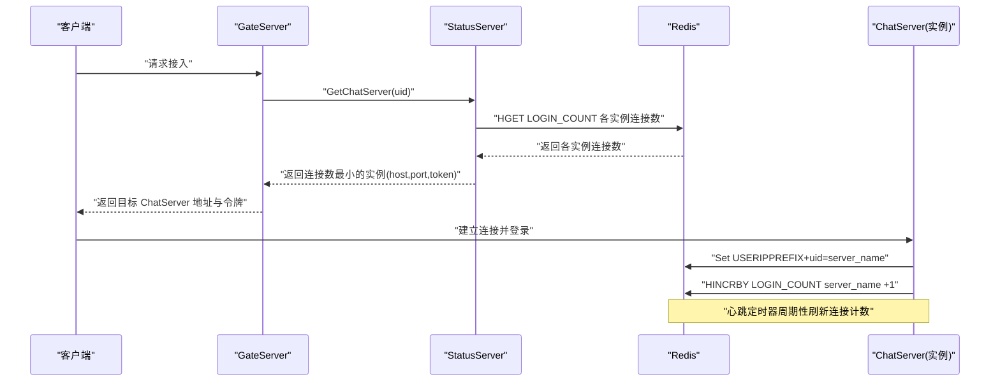
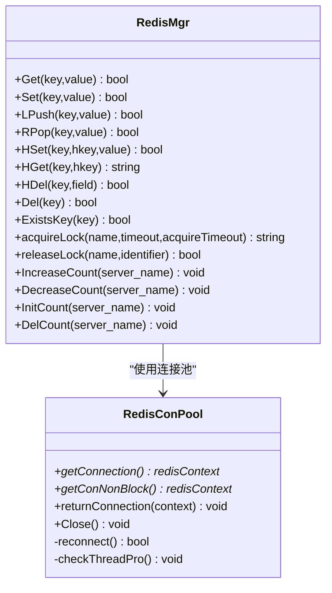
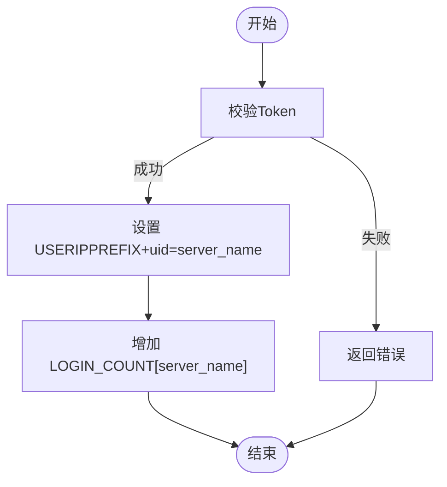
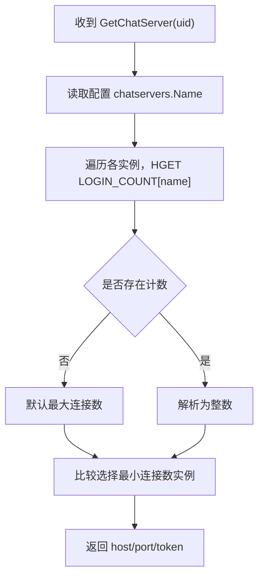
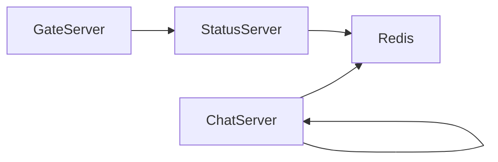

# 服务注册与发现

<cite>
**本文引用的文件**   
- [RedisMgr.h](file://server/ChatServer/include/RedisMgr.h)
- [RedisMgr.cpp](file://server/ChatServer/src/RedisMgr.cpp)
- [const.h](file://server/ChatServer/include/const.h)
- [ConfigMgr.h](file://server/ChatServer/include/ConfigMgr.h)
- [StatusServiceImpl.cpp](file://server/StatusServer/src/StatusServiceImpl.cpp)
- [day27-分布式服务设计.md](file://开发文档/day27-分布式服务设计.md)
- [day35心跳逻辑.md](file://开发文档/day35心跳逻辑.md)
- [day33单服程踢人逻辑.md](file://开发文档/day33单服程踢人逻辑.md)
- [day32分布式锁设计思路.md](file://开发文档/day32分布式锁设计思路.md)
- [ChatGrpcClient.cpp](file://server/ChatServer/src/ChatGrpcClient.cpp)
</cite>

## 目录
1. [简介](#简介)
2. [项目结构](#项目结构)
3. [核心组件](#核心组件)
4. [架构总览](#架构总览)
5. [详细组件分析](#详细组件分析)
6. [依赖关系分析](#依赖关系分析)
7. [性能考虑](#性能考虑)
8. [故障排查指南](#故障排查指南)
9. [结论](#结论)
10. [附录：示例与最佳实践](#附录示例与最佳实践)

## 简介
本文件围绕 LLFCChat 的“服务注册与发现”机制进行系统化说明，重点覆盖：
- 服务元数据管理设计（服务名称、版本信息、健康状态等）的存储与更新机制
- Redis 在服务发现中的作用（实例注册、注销与健康检查）
- 负载均衡策略（轮询、权重分配与服务选择算法）
- 服务实例故障转移与自动恢复机制
- 服务发现的性能优化与缓存策略
- 提供具体代码路径以展示如何注册新服务与查询可用实例

## 项目结构
LLFCChat 采用多服务拆分架构，关键与“服务注册与发现”相关的模块包括：
- ChatServer：业务聊天服务，维护用户会话、连接数统计、登录态与服务器名映射
- StatusServer：状态服务，负责根据连接数等指标进行服务选择（负载均衡）
- GateServer：网关服务，对外暴露 HTTP 接口并协调验证与状态服务
- Redis：作为共享状态中心，承载连接计数、用户会话映射、分布式锁等
- gRPC：用于服务间通信（如 ChatServer 之间或与其他服务的调用）

```mermaid
graph TB
Client["客户端"] --> Gate["GateServer(网关)"]
Gate --> Status["StatusServer(状态服务)"]
Status --> Redis["Redis(共享状态)"]
Gate --> Chat1["ChatServer(实例1)"]
Gate --> Chat2["ChatServer(实例2)"]
Chat1 < --> Redis
Chat2 < --> Redis
Chat1 < --> Chat2
```

图表来源 
- [StatusServiceImpl.cpp:17-27](file://server/StatusServer/src/StatusServiceImpl.cpp#L17-L27)
- [RedisMgr.h:267-303](file://server/ChatServer/include/RedisMgr.h#L267-L303)
- [day27-分布式服务设计.md:221-276](file://开发文档/day27-分布式服务设计.md#L221-L276)

章节来源
- [day27-分布式服务设计.md:221-276](file://开发文档/day27-分布式服务设计.md#L221-L276)

## 核心组件
- Redis 连接池与管理器（RedisConPool/RedisMgr）
  - 连接池：线程安全获取/归还连接，后台保活检测与自动重连
  - 管理器：封装常用命令（GET/SET/HSET/HGET/LPUSH/RPOP/DEL/EXISTS），以及分布式锁与连接计数操作
- 常量与键空间（const.h）
  - 定义 LOGIN_COUNT、USER_SESSION_PREFIX、USERIPPREFIX、LOCK_PREFIX 等键前缀
- 配置管理（ConfigMgr）
  - 读取 INI 配置，支持 SelfServer、PeerServer、chatservers 等段
- 状态服务（StatusServiceImpl）
  - 根据 Redis 中的连接计数选择负载最小的 ChatServer 返回给网关

章节来源
- [RedisMgr.h:267-303](file://server/ChatServer/include/RedisMgr.h#L267-L303)
- [const.h:81-94](file://server/ChatServer/include/const.h#L81-L94)
- [ConfigMgr.h:46-82](file://server/ChatServer/include/ConfigMgr.h#L46-L82)
- [StatusServiceImpl.cpp:29-55](file://server/StatusServer/src/StatusServiceImpl.cpp#L29-L55)

## 架构总览
服务注册与发现的整体流程如下：
- ChatServer 启动时初始化连接计数为 0，并在运行期间通过心跳定时刷新连接数到 Redis
- 用户登录成功后，将 uid→server_name 映射写入 Redis，同时增加该 server 的连接计数
- 客户端请求接入时，GateServer 调用 StatusServer 获取目标 ChatServer；StatusServer 从 Redis 读取各实例的连接计数，选择最小者返回
- 连接异常或心跳超时，清理 Redis 中对应映射与计数，实现故障转移



图表来源 
- [StatusServiceImpl.cpp:17-27](file://server/StatusServer/src/StatusServiceImpl.cpp#L17-L27)
- [RedisMgr.cpp:395-461](file://server/ChatServer/src/RedisMgr.cpp#L395-L461)
- [day27-分布式服务设计.md:365-444](file://开发文档/day27-分布式服务设计.md#L365-L444)

## 详细组件分析

### Redis 连接池与管理器（RedisConPool/RedisMgr）
- 连接池特性
  - 线程安全的 getConnection/getConNonBlock/returnConnection
  - 后台线程定期 PING 保活，失败连接自动重建并回池
  - 支持 Close/ClearConnections 优雅关闭
- 管理器能力
  - 基础命令：Get/Set/LPush/RPop/HSet/HGet/HDel/Del/ExistsKey
  - 分布式锁：acquireLock/releaseLock（基于 DistLock）
  - 连接计数：IncreaseCount/DecreaseCount/InitCount/DelCount（原子性通过分布式锁保证）



图表来源 
- [RedisMgr.h:9-108](file://server/ChatServer/include/RedisMgr.h#L9-L108)
- [RedisMgr.h:267-303](file://server/ChatServer/include/RedisMgr.h#L267-L303)
- [RedisMgr.cpp:19-461](file://server/ChatServer/src/RedisMgr.cpp#L19-L461)

章节来源
- [RedisMgr.h:9-108](file://server/ChatServer/include/RedisMgr.h#L9-L108)
- [RedisMgr.cpp:19-461](file://server/ChatServer/src/RedisMgr.cpp#L19-L461)

### 服务元数据管理与键空间设计
- 键空间约定（部分）
  - LOGIN_COUNT：哈希表，字段为 server_name，值为当前连接数
  - USERIPPREFIX+uid：字符串，值为当前 uid 所在的 server_name
  - USERTOKENPREFIX+uid：字符串，值为登录令牌
  - LOCK_PREFIX+uid：分布式锁键
- 元数据更新时机
  - 启动：初始化 LOGIN_COUNT[server_name]=0
  - 登录成功：设置 USERIPPREFIX+uid=server_name，并增加 LOGIN_COUNT[server_name]
  - 下线/异常：删除 USERIPPREFIX+uid，减少 LOGIN_COUNT[server_name]

章节来源
- [const.h:81-94](file://server/ChatServer/include/const.h#L81-L94)
- [day27-分布式服务设计.md:221-276](file://开发文档/day27-分布式服务设计.md#L221-L276)
- [day27-分布式服务设计.md:365-444](file://开发文档/day27-分布式服务设计.md#L365-L444)

### 服务注册与注销（ChatServer）
- 注册（登录成功）
  - 校验 token，加载用户基础信息
  - 设置 USERIPPREFIX+uid=server_name
  - 增加 LOGIN_COUNT[server_name]
- 注销（连接异常/下线）
  - 加分布式锁避免并发冲突
  - 校验当前 session_id 与 Redis 中一致后再清理
  - 删除 USERIPPREFIX+uid，减少 LOGIN_COUNT[server_name]



图表来源 
- [day27-分布式服务设计.md:365-444](file://开发文档/day27-分布式服务设计.md#L365-L444)
- [RedisMgr.cpp:395-461](file://server/ChatServer/src/RedisMgr.cpp#L395-L461)

章节来源
- [day27-分布式服务设计.md:365-444](file://开发文档/day27-分布式服务设计.md#L365-L444)
- [RedisMgr.cpp:395-461](file://server/ChatServer/src/RedisMgr.cpp#L395-L461)

### 健康检查与心跳（ChatServer）
- 心跳定时器周期扫描本地会话，识别过期连接
- 批量收集过期会话后，逐个加分布式锁清理 Redis 映射与计数
- 连接数统计在心跳结束后统一写回 Redis，降低频繁加锁开销

```mermaid
sequenceDiagram
participant T as "定时器"
participant L as "本地会话集合"
participant D as "分布式锁"
participant R as "Redis"
T->>L : "遍历会话，标记过期"
T-->>T : "释放本地锁，收集过期UID列表"
loop 对每个过期UID
T->>D : "acquireLock(lock_prefix+uid)"
D-->>T : "返回标识符"
T->>R : "Get(USER_SESSION_PREFIX+uid)"
R-->>T : "返回session_id"
alt "session_id不一致"
T-->>T : "跳过异地登录"
else "session_id一致"
T->>R : "Del(USER_SESSION_PREFIX+uid)"
T->>R : "Del(USERIPPREFIX+uid)"
T->>R : "DecreaseCount(server_name)"
end
T->>D : "releaseLock(lock_prefix+uid, identifier)"
end
T->>R : "HSet(LOGIN_COUNT, server_name, count)"
```



图表来源 
- [day35心跳逻辑.md:41-93](file://开发文档/day35心跳逻辑.md#L41-L93)
- [day35心跳逻辑.md:318-365](file://开发文档/day35心跳逻辑.md#L318-L365)
- [day33单服程踢人逻辑.md:387-460](file://开发文档/day33单服程踢人逻辑.md#L387-L460)
- [RedisMgr.cpp:395-461](file://server/ChatServer/src/RedisMgr.cpp#L395-L461)

章节来源
- [day35心跳逻辑.md:41-93](file://开发文档/day35心跳逻辑.md#L41-L93)
- [day35心跳逻辑.md:318-365](file://开发文档/day35心跳逻辑.md#L318-L365)
- [day33单服程踢人逻辑.md:387-460](file://开发文档/day33单服程踢人逻辑.md#L387-L460)

### 服务发现与负载均衡（StatusServer）
- 服务列表来源于配置文件 chatservers.Name（逗号分隔）
- 选择策略：读取 Redis 中 LOGIN_COUNT 的各实例连接数，选择最小者返回
- 返回内容包含 host、port、token（用于后续鉴权）



图表来源 
- [StatusServiceImpl.cpp:29-55](file://server/StatusServer/src/StatusServiceImpl.cpp#L29-L55)
- [StatusServiceImpl.cpp:57-92](file://server/StatusServer/src/StatusServiceImpl.cpp#L57-L92)
- [day27-分布式服务设计.md:487-524](file://开发文档/day27-分布式服务设计.md#L487-L524)

章节来源
- [StatusServiceImpl.cpp:29-55](file://server/StatusServer/src/StatusServiceImpl.cpp#L29-L55)
- [StatusServiceImpl.cpp:57-92](file://server/StatusServer/src/StatusServiceImpl.cpp#L57-L92)
- [day27-分布式服务设计.md:487-524](file://开发文档/day27-分布式服务设计.md#L487-L524)

### 分布式锁与一致性保障
- 加锁：基于 Redis SET NX EX 实现，带过期时间防止死锁
- 解锁：Lua 脚本确保仅锁持有者可释放
- 使用场景：用户会话清理、连接计数更新等关键路径

章节来源
- [day32分布式锁设计思路.md:535-543](file://开发文档/day32分布式锁设计思路.md#L535-L543)
- [RedisMgr.cpp:362-393](file://server/ChatServer/src/RedisMgr.cpp#L362-L393)

## 依赖关系分析
- ChatServer 依赖 Redis 进行状态持久化与共享
- StatusServer 依赖 Redis 获取实时连接计数以实现负载均衡
- GateServer 依赖 StatusServer 完成服务发现
- ChatServer 之间通过 gRPC 进行跨实例通知（如好友申请、消息转发）



图表来源 
- [ChatGrpcClient.cpp:63-90](file://server/ChatServer/src/ChatGrpcClient.cpp#L63-L90)
- [StatusServiceImpl.cpp:29-55](file://server/StatusServer/src/StatusServiceImpl.cpp#L29-L55)
- [RedisMgr.cpp:19-461](file://server/ChatServer/src/RedisMgr.cpp#L19-L461)

章节来源
- [ChatGrpcClient.cpp:63-90](file://server/ChatServer/src/ChatGrpcClient.cpp#L63-L90)
- [StatusServiceImpl.cpp:29-55](file://server/StatusServer/src/StatusServiceImpl.cpp#L29-L55)
- [RedisMgr.cpp:19-461](file://server/ChatServer/src/RedisMgr.cpp#L19-L461)

## 性能考虑
- Redis 连接池
  - 预创建连接，避免频繁握手
  - 后台保活线程定期 PING，失败连接自动重建
- 连接计数更新
  - 心跳定时器批量统计后一次性写回，降低锁竞争
- 分布式锁
  - 短生命周期锁，避免长时间占用
- 缓存策略
  - 用户基础信息优先查 Redis，未命中再查数据库（双写一致性需结合业务）
- 建议
  - 合理设置连接池大小与保活间隔
  - 对热点 key（LOGIN_COUNT）做分片或限流
  - 对 StatusServer 的选择算法可引入权重与亲和性

章节来源
- [RedisMgr.h:9-108](file://server/ChatServer/include/RedisMgr.h#L9-L108)
- [day35心跳逻辑.md:644-688](file://开发文档/day35心跳逻辑.md#L644-L688)
- [ChatGrpcClient.cpp:63-90](file://server/ChatServer/src/ChatGrpcClient.cpp#L63-L90)

## 故障排查指南
- Redis 连接问题
  - 检查连接池初始化与 AUTH 认证是否成功
  - 观察保活线程日志与重连计数
- 服务选择异常
  - 核对 chatservers 配置是否正确
  - 检查 LOGIN_COUNT 哈希表字段与值是否符合预期
- 会话清理不一致
  - 确认分布式锁获取与释放顺序正确
  - 比对 Redis 中 session_id 与本地 session_id 是否一致
- 心跳未生效
  - 检查定时器周期与阈值设置
  - 确认心跳结束后连接计数写回逻辑执行

章节来源
- [RedisMgr.cpp:19-461](file://server/ChatServer/src/RedisMgr.cpp#L19-L461)
- [day35心跳逻辑.md:41-93](file://开发文档/day35心跳逻辑.md#L41-L93)
- [day33单服程踢人逻辑.md:387-460](file://开发文档/day33单服程踢人逻辑.md#L387-L460)

## 结论
LLFCChat 的服务注册与发现以 Redis 为核心状态中心，结合 ChatServer 的心跳与连接计数、StatusServer 的最小连接数选择策略，实现了轻量而可靠的分布式服务治理。通过分布式锁与健壮的 Redis 连接池，系统在并发与故障场景下具备较好的稳定性与可扩展性。

## 附录：示例与最佳实践

### 如何注册新服务（ChatServer）
- 启动时初始化连接计数
  - 参考路径：[day27-分布式服务设计.md:221-276](file://开发文档/day27-分布式服务设计.md#L221-L276)
- 登录成功后更新映射与计数
  - 参考路径：[day27-分布式服务设计.md:365-444](file://开发文档/day27-分布式服务设计.md#L365-L444)
- 下线/异常时清理映射与计数
  - 参考路径：[day35心跳逻辑.md:318-365](file://开发文档/day35心跳逻辑.md#L318-L365)

### 如何查询可用实例（StatusServer）
- 读取配置 chatservers.Name
  - 参考路径：[StatusServiceImpl.cpp:29-55](file://server/StatusServer/src/StatusServiceImpl.cpp#L29-L55)
- 遍历各实例连接数并选择最小者
  - 参考路径：[StatusServiceImpl.cpp:57-92](file://server/StatusServer/src/StatusServiceImpl.cpp#L57-L92)

### 负载均衡策略
- 当前策略：最小连接数（Weighted Least Connections）
- 扩展建议：
  - 权重分配：按 CPU/内存/地域等维度加权
  - 轮询：简单场景可按顺序轮询
  - 亲和性：同一用户尽量路由到同一实例

### 健康检查与故障转移
- 健康检查：Redis PING 保活 + 业务心跳（会话超时）
- 故障转移：心跳检测到异常后清理 Redis 映射，下次请求自动路由到其他实例

### 性能优化与缓存策略
- Redis 连接池与保活线程
- 批量统计连接数后写回
- 用户基础信息优先读 Redis，未命中再读数据库

章节来源
- [day27-分布式服务设计.md:221-276](file://开发文档/day27-分布式服务设计.md#L221-L276)
- [day27-分布式服务设计.md:365-444](file://开发文档/day27-分布式服务设计.md#L365-L444)
- [StatusServiceImpl.cpp:29-55](file://server/StatusServer/src/StatusServiceImpl.cpp#L29-L55)
- [StatusServiceImpl.cpp:57-92](file://server/StatusServer/src/StatusServiceImpl.cpp#L57-L92)
- [RedisMgr.cpp:19-461](file://server/ChatServer/src/RedisMgr.cpp#L19-L461)