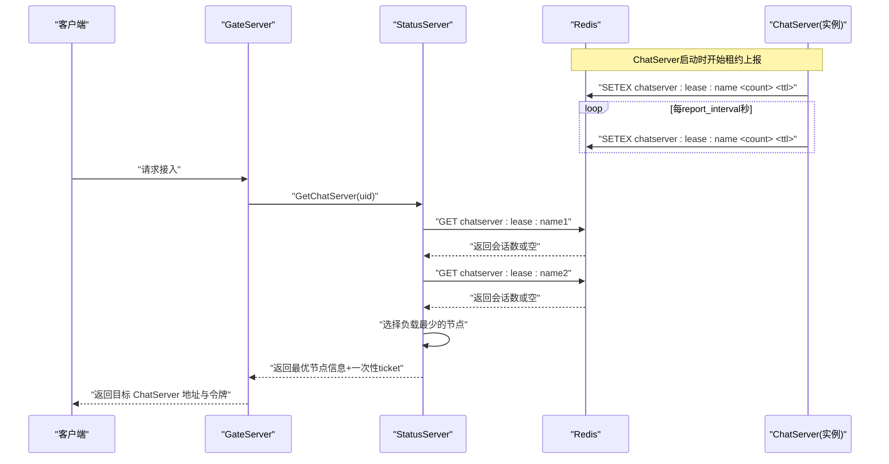
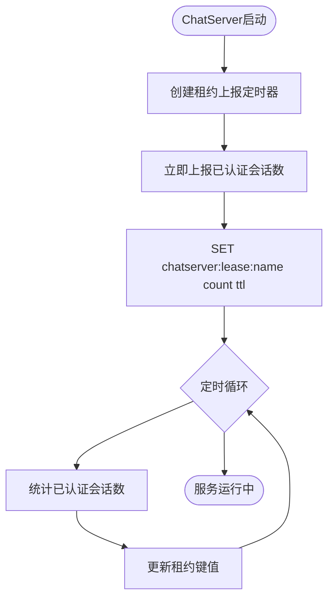
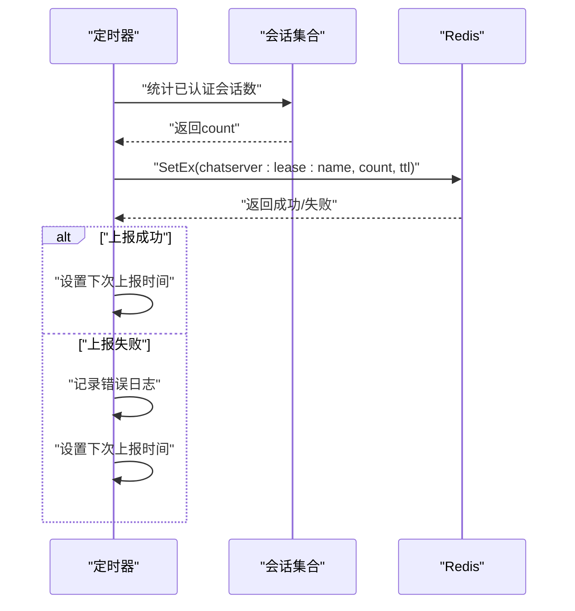
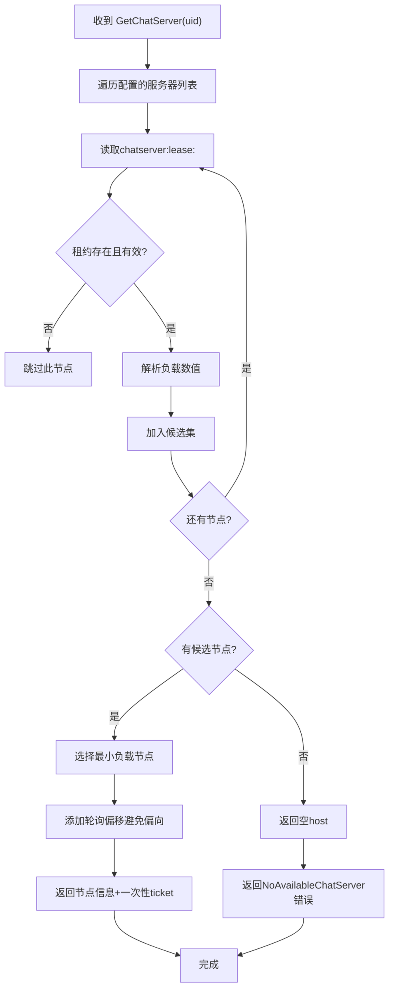
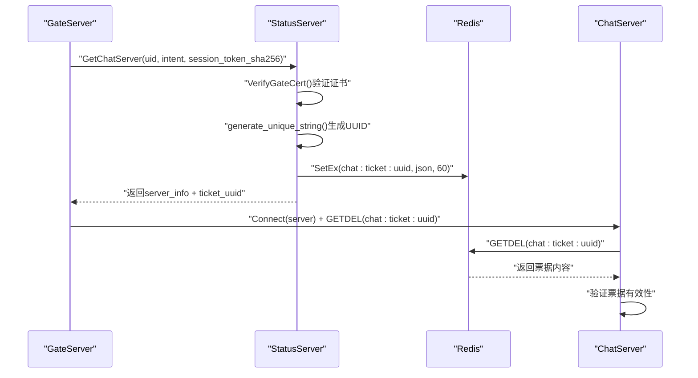
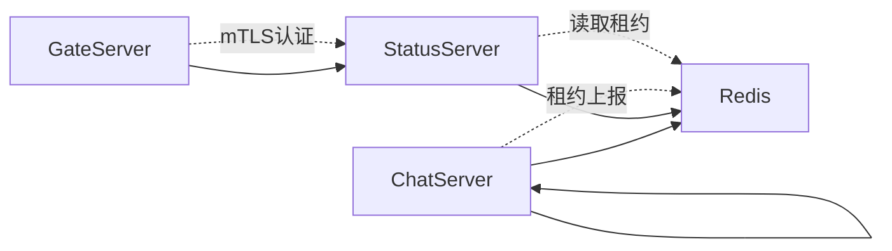

# 服务注册与发现

<cite>
**本文引用的文件**   
- [CServer.h](file://server/ChatServer/include/CServer.h)
- [CServer.cpp](file://server/ChatServer/src/CServer.cpp)
- [const.h](file://server/ChatServer/include/const.h)
- [StatusServiceImpl.cpp](file://server/StatusServer/src/StatusServiceImpl.cpp)
- [ChatServer.cpp](file://server/ChatServer/src/ChatServer.cpp)
- [config.ini](file://server/StatusServer/config/config.ini)
</cite>

## 更新摘要
**变更内容**   
- **完全移除了心跳检测机制**：删除了CHATSERVER_HEARTBEAT_PREFIX和CHATSERVER_INFO_KEY相关的JSON元数据存储
- **采用基于租约的轻量级服务发现**：每个ChatServer定期发布认证会话计数到Redis，使用chatserver:lease:<name>键
- **简化负载均衡策略**：StatusServer直接读取各节点的已认证会话数，选择负载最少的节点
- **增强故障转移机制**：当所有租约缺失或过期时返回NoAvailableChatServer错误码

## 目录
1. [简介](#简介)
2. [项目结构](#项目结构)
3. [核心组件](#核心组件)
4. [架构总览](#架构总览)
5. [详细组件分析](#详细组件分析)
6. [依赖关系分析](#依赖关系分析)
7. [性能考虑](#性能考虑)
8. [故障排查指南](#故障排查指南)
9. [结论](#结论)
10. [附录：示例与最佳实践](#附录示例与最佳实践)

## 简介
本文件围绕 LLFCChat 的"服务注册与发现"机制进行系统化说明，重点覆盖：
- **基于租约的轻量级服务发现设计**：ChatServer定期发布认证会话计数到Redis作为租约
- Redis在服务发现中的作用（租约管理、负载信息存储）
- 负载均衡策略（最小连接数选择算法）
- 服务实例故障转移与自动恢复机制
- 服务发现的性能优化与缓存策略
- 提供具体代码路径以展示如何注册新服务与查询可用实例

**更新** 本次更新完全重构了服务发现机制，从复杂的心跳检测和JSON元数据存储改为简洁的基于租约的负载上报机制，显著降低了系统复杂性和Redis开销。

## 项目结构
LLFCChat 采用多服务拆分架构，关键与"服务注册与发现"相关的模块包括：
- ChatServer：业务聊天服务，维护用户会话、统计已认证会话数，支持租约上报
- StatusServer：状态服务，负责根据会话数等指标进行服务选择（负载均衡），支持动态服务发现
- GateServer：网关服务，对外暴露 HTTP 接口并协调验证与状态服务
- Redis：作为共享状态中心，承载会话计数、分布式锁、服务租约信息
- gRPC：用于服务间通信（如 ChatServer 之间或与其他服务的调用）

```mermaid
graph TB
Client["客户端"] --> Gate["GateServer(网关)"]
Gate --> Status["StatusServer(状态服务)"]
Status --> Redis["Redis(共享状态)"]
Gate --> Chat1["ChatServer(实例1)"]
Gate --> Chat2["ChatServer(实例2)"]
Chat1 < --> Redis
Chat2 < --> Redis
Chat1 < --> Chat2
Chat1 -.->|租约上报| Redis
Chat2 -.->|租约上报| Redis
Status -.->|读取租约| Redis
```

**图表来源** 
- [StatusServiceImpl.cpp:111-169](file://server/StatusServer/src/StatusServiceImpl.cpp#L111-L169)
- [ChatServer.cpp:50-69](file://server/ChatServer/src/ChatServer.cpp#L50-L69)
- [CServer.cpp:75-88](file://server/ChatServer/src/CServer.cpp#L75-L88)

## 核心组件
- Redis 连接池与管理器（RedisConPool/RedisMgr）
  - 连接池：线程安全获取/归还连接，后台保活检测与自动重连
  - 管理器：封装常用命令（GET/SET/HSET/HGET/LPUSH/RPOP/DEL/EXISTS），以及分布式锁与连接计数操作
- 常量与键空间（const.h）
  - 定义 IPCOUNTPREFIX、USER_SESSION_PREFIX、LOCK_PREFIX 等键前缀
  - 新增 CHAT_TICKET_PREFIX 用于一次性mTLS登录票据
  - 移除了CHATSERVER_INFO_KEY和CHATSERVER_HEARTBEAT_PREFIX
- 配置管理（ConfigMgr）
  - 读取 INI 配置，支持 SelfServer、PeerServer、chatservers 等段
- 状态服务（StatusServiceImpl）
  - 根据 Redis 中的租约信息选择负载最小的 ChatServer 返回给网关
  - 支持从静态配置加载所有 ChatServer 实例信息

章节来源
- [const.h:142-161](file://server/ChatServer/include/const.h#L142-L161)
- [StatusServiceImpl.cpp:82-109](file://server/StatusServer/src/StatusServiceImpl.cpp#L82-L109)

## 架构总览
新的基于租约的服务发现整体流程如下：
- ChatServer 启动时创建租约上报定时器，立即上报一次已认证会话数
- 每report_interval秒通过SetEx命令更新chatserver:lease:<name>键，值为当前已认证会话数
- StatusServer 启动时从静态配置加载所有ChatServer实例信息
- 客户端请求接入时，GateServer调用StatusServer获取目标ChatServer
- StatusServer遍历配置的服务器列表，读取各节点的租约信息，选择负载最少者返回
- 如果所有租约都缺失或过期，返回NoAvailableChatServer错误码



**图表来源** 
- [ChatServer.cpp:50-69](file://server/ChatServer/src/ChatServer.cpp#L50-L69)
- [StatusServiceImpl.cpp:111-169](file://server/StatusServer/src/StatusServiceImpl.cpp#L111-L169)

## 详细组件分析

### 基于租约的服务发现机制
- **租约键设计**：chatserver:lease:<server_name>，值为十进制字符串表示的已认证会话数
- **租约更新**：ChatServer每report_interval秒通过SetEx命令续租，TTL为lease_ttl
- **租约检查**：StatusServer读取租约键，只接受存在且可解析为非负整数的值
- **负载计算**：直接解析租约值作为负载指标，无需复杂的哈希表操作



**图表来源** 
- [ChatServer.cpp:50-69](file://server/ChatServer/src/ChatServer.cpp#L50-L69)
- [CServer.cpp:75-88](file://server/ChatServer/src/CServer.cpp#L75-L88)

章节来源
- [ChatServer.cpp:50-69](file://server/ChatServer/src/ChatServer.cpp#L50-L69)
- [CServer.cpp:75-88](file://server/ChatServer/src/CServer.cpp#L75-L88)

### 会话统计与租约上报（ChatServer）
- **会话统计方法**：GetAuthenticatedSessionCount()统计GetUserId() > 0的会话数量
- **租约上报定时器**：使用boost::asio::steady_timer实现周期性上报
- **原子性保证**：通过SetEx命令确保租约更新的原子性和TTL管理
- **错误处理**：上报失败只记录日志，不影响服务正常运行



**图表来源** 
- [CServer.cpp:75-88](file://server/ChatServer/src/CServer.cpp#L75-L88)
- [ChatServer.cpp:56-68](file://server/ChatServer/src/ChatServer.cpp#L56-L68)

章节来源
- [CServer.cpp:75-88](file://server/ChatServer/src/CServer.cpp#L75-L88)
- [ChatServer.cpp:56-68](file://server/ChatServer/src/ChatServer.cpp#L56-L68)

### 动态服务发现与负载均衡（StatusServer）
- **服务列表初始化**：从配置文件加载所有ChatServer实例信息
- **租约读取策略**：按配置顺序逐个读取chatserver:lease:<name>键
- **健康检查**：租约不存在或值不可解析视为节点不可用
- **选择算法**：选择负载最少的节点，相同负载时使用轮询避免偏向第一个节点
- **兜底机制**：无存活节点时返回空host，由上层处理NoAvailableChatServer错误



**图表来源** 
- [StatusServiceImpl.cpp:111-169](file://server/StatusServer/src/StatusServiceImpl.cpp#L111-L169)

章节来源
- [StatusServiceImpl.cpp:111-169](file://server/StatusServer/src/StatusServiceImpl.cpp#L111-L169)

### mTLS安全认证与一次性票据
- **证书验证**：VerifyGateCert函数验证客户端证书的SAN字段必须包含"llfc-gate"
- **一次性票据**：StatusServer生成UUID作为chat_ticket，存储在chat:ticket:<uuid>键中，TTL=60秒
- **票据内容**：包含uid、server、intent等信息，支持RESUME场景的session_token_sha256
- **原子消费**：ChatServer通过GETDEL命令原子性地获取并删除票据



**图表来源** 
- [StatusServiceImpl.cpp:36-80](file://server/StatusServer/src/StatusServiceImpl.cpp#L36-L80)

章节来源
- [StatusServiceImpl.cpp:36-80](file://server/StatusServer/src/StatusServiceImpl.cpp#L36-L80)

### 分布式锁与一致性保障
- **加锁机制**：基于Redis SET NX EX实现，带过期时间防止死锁
- **解锁机制**：Lua脚本确保仅锁持有者可释放
- **使用场景**：用户会话清理、连接计数更新等关键路径
- **超时配置**：LOCK_TIME_OUT=10秒，ACQUIRE_TIME_OUT=5秒

章节来源
- [const.h:163-166](file://server/ChatServer/include/const.h#L163-L166)

## 依赖关系分析
- ChatServer 依赖 Redis 进行租约上报，支持负载信息持久化
- StatusServer 依赖 Redis 获取实时负载信息以实现负载均衡
- GateServer 依赖 StatusServer 完成服务发现和mTLS认证
- ChatServer 之间通过 gRPC 进行跨实例通知（如好友申请、消息转发）



**图表来源** 
- [StatusServiceImpl.cpp:36-80](file://server/StatusServer/src/StatusServiceImpl.cpp#L36-L80)
- [ChatServer.cpp:50-69](file://server/ChatServer/src/ChatServer.cpp#L50-L69)

## 性能考虑
- **Redis 连接池**
  - 预创建连接，避免频繁握手
  - 后台保活线程定期 PING，失败连接自动重建
- **租约上报优化**
  - 批量统计会话数后一次性写回，降低锁竞争
  - 使用SetEx命令原子性更新，减少网络往返
- **服务发现优化**
  - StatusServer缓存本地静态配置作为基础
  - 租约键使用TTL自动清理，减少手动维护成本
- **建议**
  - 合理设置租约上报间隔和TTL
  - 对热点key做分片或限流
  - 调整租约TTL以适应不同网络环境

## 故障排查指南
- **Redis 连接问题**
  - 检查连接池初始化与 AUTH 认证是否成功
  - 观察保活线程日志与重连计数
- **租约上报失败**
  - 检查chatserver:lease:<name>键是否正常更新
  - 验证租约值是否为有效的十进制字符串
- **服务选择异常**
  - 核对chatservers配置是否正确
  - 检查StatusServer是否能正确读取Redis中的租约信息
- **mTLS认证失败**
  - 验证客户端证书SAN字段是否包含"llfc-gate"
  - 检查一次性票据是否正确生成和消费
- **故障转移问题**
  - 检查StatusServer的兜底逻辑是否正常工作
  - 验证NoAvailableChatServer错误码是否正确返回

## 结论
LLFCChat 的服务注册与发现经过重构后，采用了更加简洁高效的基于租约的机制。通过ChatServer定期上报已认证会话数到Redis，StatusServer直接读取负载信息进行负载均衡选择，显著降低了系统复杂性和Redis开销。新的机制在保持高可用性的同时，提供了更好的性能和可扩展性。mTLS安全认证和一次性票据机制进一步增强了系统的安全性。

## 附录：示例与最佳实践

### 如何实现基于租约的服务发现（ChatServer）
- 启动租约上报定时器
  - 参考路径：[ChatServer.cpp:50-69](file://server/ChatServer/src/ChatServer.cpp#L50-L69)
- 统计已认证会话数
  - 参考路径：[CServer.cpp:75-88](file://server/ChatServer/src/CServer.cpp#L75-L88)
- 更新租约键值
  - 参考路径：[ChatServer.cpp:62-65](file://server/ChatServer/src/ChatServer.cpp#L62-L65)

### 如何实现动态服务发现（StatusServer）
- 从配置加载服务器列表
  - 参考路径：[StatusServiceImpl.cpp:82-109](file://server/StatusServer/src/StatusServiceImpl.cpp#L82-L109)
- 读取租约信息并选择负载最少节点
  - 参考路径：[StatusServiceImpl.cpp:111-169](file://server/StatusServer/src/StatusServiceImpl.cpp#L111-L169)
- 生成一次性mTLS票据
  - 参考路径：[StatusServiceImpl.cpp:52-79](file://server/StatusServer/src/StatusServiceImpl.cpp#L52-L79)

### 负载均衡策略
- **当前策略**：最小负载（基于已认证会话数）+ 健康检查 + 轮询防偏向
- **扩展建议**：
  - 权重分配：按CPU/内存/地域等维度加权
  - 延迟感知：结合响应时间进行智能选择
  - 亲和性：同一用户尽量路由到同一实例

### 健康检查与故障转移
- **健康检查**：租约TTL自动失效 + 值格式验证
- **故障转移**：租约缺失时跳过该节点，无存活节点返回NoAvailableChatServer
- **兜底机制**：配置缺省处理，确保服务可用性

### 性能优化与缓存策略
- Redis连接池与保活线程
- 批量统计会话数后写回
- 租约键TTL自动清理，减少手动维护
- mTLS票据短期TTL，提高安全性

章节来源
- [ChatServer.cpp:50-69](file://server/ChatServer/src/ChatServer.cpp#L50-L69)
- [CServer.cpp:75-88](file://server/ChatServer/src/CServer.cpp#L75-L88)
- [StatusServiceImpl.cpp:82-169](file://server/StatusServer/src/StatusServiceImpl.cpp#L82-L169)