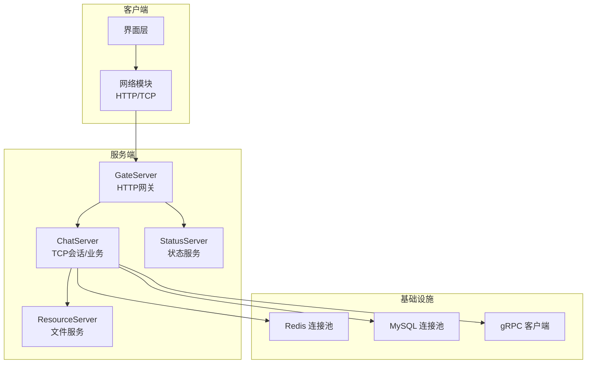
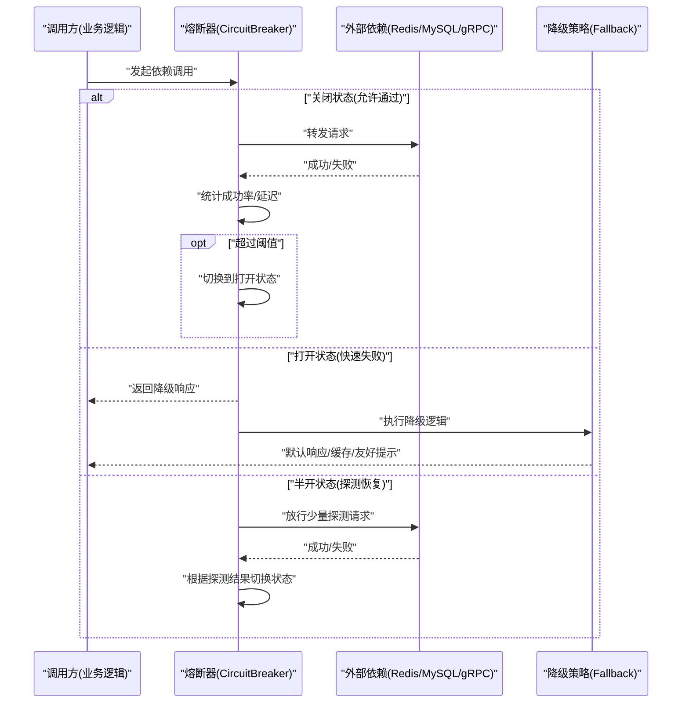
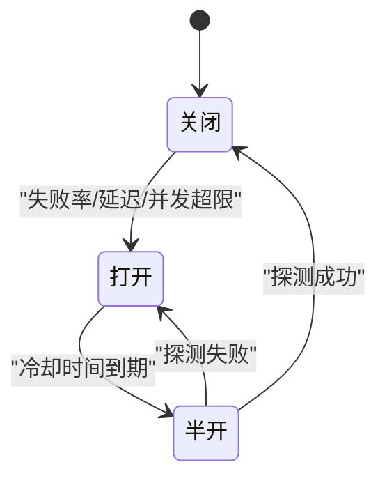
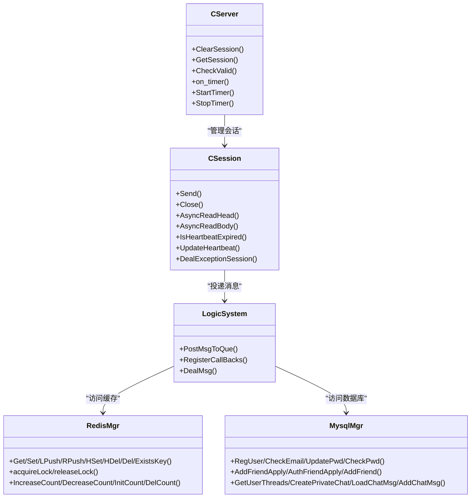

# 熔断降级机制

<cite>
**本文引用的文件**   
- [CSession.h](file://server/ChatServer/include/CSession.h)
- [CServer.h](file://server/ChatServer/include/CServer.h)
- [LogicSystem.h](file://server/ChatServer/include/LogicSystem.h)
- [RedisMgr.h](file://server/ChatServer/include/RedisMgr.h)
- [MysqlMgr.h](file://server/ChatServer/include/MysqlMgr.h)
- [const.h](file://server/ChatServer/include/const.h)
- [data.h](file://server/ChatServer/include/data.h)
- [global.h](file://client/llfcchat/include/global.h)
- [mainwindow.cpp](file://client/llfcchat/src/mainwindow.cpp)
- [day35心跳逻辑.md](file://开发文档/day35心跳逻辑.md)
</cite>

## 目录
1. [简介](#简介)
2. [项目结构](#项目结构)
3. [核心组件](#核心组件)
4. [架构总览](#架构总览)
5. [详细组件分析](#详细组件分析)
6. [依赖关系分析](#依赖关系分析)
7. [性能考量](#性能考量)
8. [故障排查指南](#故障排查指南)
9. [结论](#结论)
10. [附录](#附录)

## 简介
本文件为 LLFCChat 的熔断与降级机制提供系统化说明。由于当前仓库未包含现成的“熔断器”实现，本文基于现有代码中的连接管理、心跳检测、错误码体系、资源池健康检查等能力，给出可落地的熔断状态机设计、触发条件、降级策略、监控指标、配置项、隔离与限流方案，以及测试方法与使用示例模板。读者可据此在 ChatServer/GateServer/ResourceServer 中按需集成熔断器，以增强对下游依赖（数据库、缓存、RPC）的弹性保护。

## 项目结构
- 服务端：
  - ChatServer：TCP 会话、消息路由、业务逻辑、MySQL/Redis 访问封装
  - GateServer：HTTP 网关与验证服务调用
  - ResourceServer：文件资源服务
  - StatusServer：状态服务
- 客户端：Qt 桌面端，负责 UI、网络请求、会话管理
- 公共定义：错误码、消息 ID、数据结构等

[本图为概念性架构图，不直接映射具体源码文件]

## 核心组件
- CSession：维护单个 TCP 会话的生命周期、读写、心跳更新与异常处理入口
- CServer：会话集合管理、稳态定时器（心跳检测、超时清理）
- LogicSystem：消息分发与回调注册中心，承载业务处理线程与队列
- RedisMgr/RedisConPool：Redis 连接池、健康检查与自动重连
- MysqlMgr/MysqlDao：MySQL 访问封装与连接池健康检查
- const.h：全局错误码、消息ID、常量
- data.h：用户、聊天消息、分页结果等数据模型
- global.h（客户端）：客户端错误码与状态枚举

上述组件共同构成“连接与依赖健康”的基础设施，是构建熔断器的关键素材。

**章节来源**
- [CSession.h:1-86](file://server/ChatServer/include/CSession.h#L1-L86)
- [CServer.h:1-39](file://server/ChatServer/include/CServer.h#L1-L39)
- [LogicSystem.h:1-60](file://server/ChatServer/include/LogicSystem.h#L1-L60)
- [RedisMgr.h:1-305](file://server/ChatServer/include/RedisMgr.h#L1-L305)
- [MysqlMgr.h:1-41](file://server/ChatServer/include/MysqlMgr.h#L1-L41)
- [const.h:1-104](file://server/ChatServer/include/const.h#L1-L104)
- [data.h:1-65](file://server/ChatServer/include/data.h#L1-L65)
- [global.h:90-170](file://client/llfcchat/include/global.h#L90-L170)

## 架构总览
下图展示建议的熔断器在系统中的位置与交互方式。熔断器应围绕“对外部依赖的调用点”进行包裹，例如 Redis 操作、MySQL 查询、gRPC 调用、文件上传等。

[本图为概念性流程图，不直接映射具体源码文件]

## 详细组件分析

### 熔断器状态机设计
- 关闭（Closed）：正常放行请求，持续统计失败率与延迟；达到阈值后进入打开
- 打开（Open）：拒绝新请求，立即走降级路径；经过冷却时间后进入半开
- 半开（Half-Open）：放行少量探测请求，若成功则回到关闭，若失败则回到打开

[本图为概念性状态图，不直接映射具体源码文件]

### 熔断触发条件
- 失败率阈值：在滑动时间窗口内，失败比例超过设定阈值即触发
- 请求超时：单次调用耗时超过阈值计入失败或单独作为触发维度
- 并发限制：当活跃请求数超过上限时，快速失败并触发降级

这些条件可与现有“错误码”和“连接健康检查”结合使用。例如：
- Redis/MySQL 连接失败、超时、异常均视为一次失败
- gRPC RPCFailed 错误码可作为失败计数依据

**章节来源**
- [const.h:5-20](file://server/ChatServer/include/const.h#L5-L20)
- [RedisMgr.h:137-206](file://server/ChatServer/include/RedisMgr.h#L137-L206)
- [MysqlMgr.h:42-100](file://server/ChatServer/include/MysqlMgr.h#L42-L100)

### 降级策略实现
- 默认响应：返回标准 JSON，包含错误码与提示信息
- 缓存数据：从本地或 Redis 读取最近可用快照
- 友好提示：向客户端返回可读的错误信息，避免黑屏或崩溃

建议在 LogicSystem 的业务回调中统一接入降级逻辑，确保所有依赖调用都具备兜底能力。

**章节来源**
- [LogicSystem.h:17-58](file://server/ChatServer/include/LogicSystem.h#L17-L58)
- [const.h:5-20](file://server/ChatServer/include/const.h#L5-L20)

### 监控指标
- 成功率：单位时间内成功/总请求数
- 延迟统计：P50/P95/P99 延迟分布
- 状态变化日志：关闭→打开、打开→半开、半开→关闭 的变更事件
- 资源健康：Redis/MySQL 连接池健康度、失败次数、重连次数

可借助现有 Redis 计数器与日志输出扩展指标上报。

**章节来源**
- [RedisMgr.h:267-305](file://server/ChatServer/include/RedisMgr.h#L267-L305)
- [MysqlMgr.h:42-100](file://server/ChatServer/include/MysqlMgr.h#L42-L100)

### 配置参数
- 阈值设置：失败率阈值、最小样本数、延迟阈值、并发上限
- 时间窗口：滑动窗口大小、采样粒度、冷却时间
- 降级开关：是否启用缓存/默认响应/友好提示
- 监控开关：是否开启指标采集与日志记录

建议将配置集中管理，支持热更新。

[本节为通用配置说明，不直接引用具体文件]

### 服务依赖隔离与限流保护
- 隔离：按依赖维度划分熔断器实例（如 Redis、MySQL、gRPC），互不影响
- 限流：在熔断前增加令牌桶/漏桶限流，降低突发流量冲击
- 超时控制：为每次依赖调用设置合理超时，避免线程阻塞

可在 LogicSystem 的消息处理前后插入限流与熔断拦截器。

[本节为通用设计说明，不直接引用具体文件]

### 心跳与连接健康（熔断基础）
- 心跳检测：服务器定时扫描会话，过期则断开并清理
- 连接健康：Redis/MySQL 定期 PING/SELECT 1，失败则标记并尝试重连
- 异常处理：读/写异常统一进入异常处理流程，释放资源并清理会话

这些能力为熔断器提供了可靠的“健康信号”。

**章节来源**
- [CSession.h:46-51](file://server/ChatServer/include/CSession.h#L46-L51)
- [CServer.h:34-36](file://server/ChatServer/include/CServer.h#L34-L36)
- [day35心跳逻辑.md:41-93](file://开发文档/day35心跳逻辑.md#L41-L93)
- [RedisMgr.h:137-206](file://server/ChatServer/include/RedisMgr.h#L137-L206)
- [MysqlMgr.h:42-100](file://server/ChatServer/include/MysqlMgr.h#L42-L100)

### 客户端侧的心跳与下线提示
- 客户端检测到心跳超时或异常连接时，弹出下线提示
- 可在此处引入本地熔断提示（如暂时禁用某功能）

**章节来源**
- [mainwindow.cpp:28-126](file://client/llfcchat/src/mainwindow.cpp#L28-L126)
- [global.h:163-170](file://client/llfcchat/include/global.h#L163-L170)

## 依赖关系分析
- CServer 持有会话集合与定时器，负责生命周期与心跳
- CSession 负责单会话读写、心跳更新、异常处理
- LogicSystem 作为消息中枢，调度业务回调
- RedisMgr/MysqlMgr 提供连接池与健康检查
- const.h 定义错误码与消息 ID，贯穿各层

**图表来源**
- [CServer.h:1-39](file://server/ChatServer/include/CServer.h#L1-L39)
- [CSession.h:1-86](file://server/ChatServer/include/CSession.h#L1-L86)
- [LogicSystem.h:1-60](file://server/ChatServer/include/LogicSystem.h#L1-L60)
- [RedisMgr.h:267-305](file://server/ChatServer/include/RedisMgr.h#L267-L305)
- [MysqlMgr.h:1-41](file://server/ChatServer/include/MysqlMgr.h#L1-L41)

**章节来源**
- [CServer.h:1-39](file://server/ChatServer/include/CServer.h#L1-L39)
- [CSession.h:1-86](file://server/ChatServer/include/CSession.h#L1-L86)
- [LogicSystem.h:1-60](file://server/ChatServer/include/LogicSystem.h#L1-L60)
- [RedisMgr.h:267-305](file://server/ChatServer/include/RedisMgr.h#L267-L305)
- [MysqlMgr.h:1-41](file://server/ChatServer/include/MysqlMgr.h#L1-L41)

## 性能考量
- 熔断判断应在无锁或低锁竞争路径上完成，避免影响主链路
- 滑动窗口建议使用环形数组或原子计数器，减少 GC/内存压力
- 指标采集采用异步上报，避免阻塞业务线程
- 降级路径尽量轻量，优先返回缓存或默认值

[本节为通用性能建议，不直接引用具体文件]

## 故障排查指南
- 观察 Redis/MySQL 连接池健康状态与失败计数
- 检查心跳定时器是否正常触发与清理
- 核对错误码与日志，定位失败原因（网络、鉴权、数据不一致）
- 客户端侧关注心跳超时与下线提示

**章节来源**
- [RedisMgr.h:137-206](file://server/ChatServer/include/RedisMgr.h#L137-L206)
- [MysqlMgr.h:42-100](file://server/ChatServer/include/MysqlMgr.h#L42-L100)
- [day35心跳逻辑.md:41-93](file://开发文档/day35心跳逻辑.md#L41-L93)
- [mainwindow.cpp:28-126](file://client/llfcchat/src/mainwindow.cpp#L28-L126)

## 结论
当前仓库已具备构建熔断器的坚实基础：会话与心跳管理、错误码体系、连接池健康检查与自动重连。建议在此基础上实现统一的熔断器组件，覆盖 Redis、MySQL、gRPC 等依赖，配合降级策略与监控指标，提升系统整体稳定性与可用性。

[本节为总结性内容，不直接引用具体文件]

## 附录

### 熔断器使用示例（模板）
- 在业务调用点（如 LogicSystem 回调）包裹熔断器
- 配置失败率阈值、冷却时间、并发上限
- 定义降级策略：默认响应、缓存读取、友好提示
- 采集指标：成功率、延迟、状态变化日志

[本节为模板说明，不直接引用具体文件]

### 配置模板（示例字段）
- failure_rate_threshold: 失败率阈值（0~1）
- min_samples: 最小样本数
- latency_threshold_ms: 延迟阈值（毫秒）
- max_concurrency: 最大并发
- window_seconds: 滑动窗口秒数
- cooldown_seconds: 冷却时间秒数
- fallback_enabled: 是否启用降级
- metrics_enabled: 是否启用指标采集

[本节为通用配置模板，不直接引用具体文件]

### 测试方法与故障模拟场景
- 注入失败：模拟 Redis/MySQL 不可用、gRPC 超时
- 压测：高并发下观察熔断触发与恢复
- 断网：模拟网络抖动，验证心跳与重连
- 数据异常：构造脏数据，验证降级与回滚

[本节为通用测试建议，不直接引用具体文件]